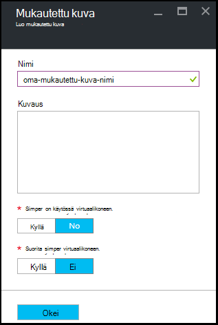

<properties
    pageTitle="Hallitse Azure DevTest harjoituksia mukautetun kuvien luomiseen VMs | Microsoft Azure"
    description="Opettele luomaan mukautetun kuvan .vhd-tiedosto tai aiemmin luotuun AM-Azure DevTest harjoituksia"
    services="devtest-lab,virtual-machines"
    documentationCenter="na"
    authors="tomarcher"
    manager="douge"
    editor=""/>

<tags
    ms.service="devtest-lab"
    ms.workload="na"
    ms.tgt_pltfrm="na"
    ms.devlang="na"
    ms.topic="article"
    ms.date="09/07/2016"
    ms.author="tarcher"/>

# Azure DevTest harjoituksia mukautetun kuvien luomiseen VMs hallinta

Azure DevTest harjoituksia mukautetun kuvien avulla voit luoda VMs nopeasti odottamatta vaatimat ohjelmistot kohde tietokoneeseen on asennettu. Mukautetun kuvia voidaan asentaa valmiiksi kaikki ohjelmat, jotka sinulla on oltava .vhd-tiedoston ja luominen AM Näennäiskiintolevytiedosto avulla. Ohjelmisto on jo asennettu, AM luontiaikaa on paljon nopeammin. Lisäksi mukautetun kuvia käytetään Kloonaa VMs luomalla mukautetun kuvan AM ja luomalla sitten, että mukautettu kuvasta VMs.

Tässä artikkelissa kerrotaan, miten voit:

- [Luo mukautettu kuva tiedostosta Näennäiskiintolevyn](#create-a-custom-image-from-a-vhd-file) niin, että voit luoda sitten AM, mukautettu kuva. 
- [Luo mukautettu kuva-AM](#create-a-custom-image-from-a-vm) nopean AM kloonaamalla.

## Luo mukautettu kuva Näennäiskiintolevyn-tiedostosta

Tässä osassa näet, miten voit luoda mukautetun kuvan Näennäiskiintolevyn tiedostosta.
Tarvitset kelvollinen Näennäiskiintolevytiedosto toimien kaikki tässä osassa.   

1. Kirjautuminen [Azure portal](http://go.microsoft.com/fwlink/p/?LinkID=525040).

1. Valitse **Lisää palveluja**ja valitse sitten luettelosta **DevTest harjoituksia** .

1. Valitse haluamasi testiympäristössä harjoituksia-luettelosta.  

1. Valitse sivu kurssin **määritys**. 

1. Valitse **Mukautettu kuvia**kurssin **määritys** -sivu.

1. Valitse **Mukautettu kuvat** -sivu **+ Mukautettu kuva**.

    

1. Kirjoita mukautetun kuvan nimen. Tämä nimi näkyy perus kuvia luettelo luotaessa AM.

1. Kirjoita mukautetun kuvan kuvaus. Kuvaus näkyy perus kuvia luettelo AM luotaessa.

1. Valitse **Näennäiskiintolevytiedosto**.

1. Jos käytössäsi ole luetteloitu Näennäiskiintolevytiedosto, lisää se noudattamalla [Näennäiskiintolevyn tiedoston lataaminen](#upload-a-vhd-file) -osassa ja palauttaa tätä, kun olet valmis.

1. Valitse haluamasi Näennäiskiintolevytiedosto.

1. Valitse **OK** ja sulje **Näennäiskiintolevytiedosto** -sivu.

1. Valitse **käyttöjärjestelmän määritys**.

1. Valitse **Windows** - tai **Linux** **OS määritys** -välilehti.

1. Jos **Windows** on valittuna, Määritä valintaruudun kautta *onko asennusohjelman tietokoneeseen* .

1. Valitse **OK** ja sulje **Käyttöjärjestelmän määritys** -sivu.

1. Valitse **OK** , jos haluat luoda mukautetun kuvan.

1. Siirry kohtaan [Seuraavat vaiheet](#next-steps) .

###Näennäiskiintolevyn tiedoston lataaminen

Jos haluat lisätä mukautetun kuvan, sinun on käytettävissäsi Näennäiskiintolevytiedosto.

1. Valitse **Lataa Näennäiskiintolevytiedosto PowerShell** **Näennäiskiintolevytiedosto** -sivu.

    

1. Seuraava sivu näkyy ohjeet muokkaamalla ja suorittamalla PowerShell-komentosarja, joka lataa Azure tilaukseen .vhd-tiedosto. 
**Huomautus:** Tämä toimenpide voivat olla pitkiä kokoa ja Näennäiskiintolevytiedosto yhteysnopeuden mukaan.

## Mukautetun kuvan luominen AM
Jos sinulla on jo määritetty AM, luoda mukautetun kuvan, AM ja käyttää jälkeenpäin muiden samanlaiset VMs luomiseen, mukautettu kuva. Seuraavat vaiheet kuvaavat luominen mukautetun kuvan AM:

1. Kirjautuminen [Azure portal](http://go.microsoft.com/fwlink/p/?LinkID=525040).

1. Valitse **Lisää palveluja**ja valitse sitten luettelosta **DevTest harjoituksia** .

1. Valitse haluamasi testiympäristössä harjoituksia-luettelosta.  

1. Valitse sivu kurssin **Omat näennäiskoneiden**.
 
1. Valitse **Oma näennäiskoneiden** -sivu, joista haluat luoda mukautetun kuvan AM.

1. Valitse sivu AM **Luo mukautettu kuva (Näennäiskiintolevyn)**.

    

1. Kirjoita nimi ja kuvaus mukautetun kuvan **luominen kuva** -sivu. Niissä olevat tiedot näkyvät luettelossa kantalukujen AM luodessasi.

    

1. Valitse, tarvitseeko sysprep suoritettiin AM. Jos sysprep on ei toimi AM, määrittää, haluatko sysprep suoritetaan, kun AM luodaan mukautettu kuvassa.

1. Valitse **OK** kun olet valmis luomaan mukautettu kuva.

[AZURE.INCLUDE [devtest-lab-try-it-out](../../includes/devtest-lab-try-it-out.md)]

## Aiheeseen liittyvät blogimerkintöjen

- [Mukautetun kuvia tai kaavat?](https://blogs.msdn.microsoft.com/devtestlab/2016/04/06/custom-images-or-formulas/)
- [Mukautetun kuvia välillä Azure DevTest harjoituksia kopioiminen](http://www.visualstudiogeeks.com/blog/DevOps/How-To-Move-CustomImages-VHD-Between-AzureDevTestLabs#copying-custom-images-between-azure-devtest-labs)

##Seuraavat vaiheet

Kun olet lisännyt mukautetun kuvan käytettäväksi luotaessa AM, seuraava vaihe on lisättävä [AM, että kurssin](./devtest-lab-add-vm-with-artifacts.md).