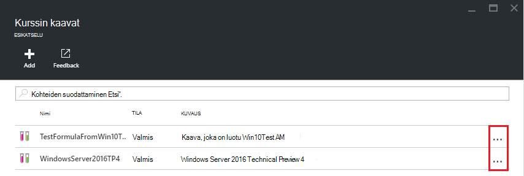

<properties
    pageTitle="Hallitse Azure DevTest harjoituksia luominen VMs kaavoissa | Microsoft Azure"
    description="Lue, miten voit luoda, päivittää, ja poistaa Azure DevTest harjoituksia kaavat ja luo uusi VMs niiden avulla."
    services="devtest-lab,virtual-machines"
    documentationCenter="na"
    authors="tomarcher"
    manager="douge"
    editor=""/>

<tags
    ms.service="devtest-lab"
    ms.workload="na"
    ms.tgt_pltfrm="na"
    ms.devlang="na"
    ms.topic="article"
    ms.date="08/30/2016"
    ms.author="tarcher"/>

# DevTest harjoituksia kaavojen luomiseen VMs hallinta

Azure DevTest harjoituksia kaavassa on ominaisuuksien oletusarvot virtual machine (AM) luomiseen käytetyt luettelo. Kun luot kaavan AM, oletusarvoja voidaan-on, tai joita olet muokannut. [Mukautetun kuvia](./devtest-lab-create-template.md) ja [Marketplace-kuvia](./devtest-lab-configure-marketplace-images.md), kuten kaavat on nopea AM valmisteluun järjestelmä.  

Tässä artikkelissa käydään voit suorittaa seuraavia tehtäviä:

- [Kaavan luominen](#create-a-formula)
- [Valmistele AM kaavan avulla](#use-a-formula-to-provision-a-vm)
- [Kaavan muokkaaminen](#modify-a-formula)
- [Kaavan poistaminen](#delete-a-formula)

> [AZURE.NOTE] Kaavat - [mukautetun kuvat](./devtest-lab-create-template.md) – kuten avulla voit luoda perus kuva Näennäiskiintolevyn tiedostosta. Kuvaa voidaan valmistella uuden AM. Sopivuutta mikä sopii erityisesti ympäristön, lue lisätietoja artikkelista [Comparing mukautetun kuvat ja kaavat DevTest harjoituksia](./devtest-lab-comparing-vm-base-image-types.md).

## Kaavan luominen
Käyttäjät, joilla DevTest harjoituksia *käyttäjät* on voivat luoda VMs kaavalla pohjana. Kaavojen luomisesta kahdella tavalla: 

- Käytä Base -, kun haluat määrittää kaavan ominaisuudet.
- Valitse aiemmin luotu kurssin AM - aiemmin AM asetusten perusteella Käytä tätä, kun haluat luoda kaavan.

### Kaavan luominen on kanta
Seuraavat vaiheet opastavat kaavan luominen mukautetun kuvan, Marketplace-kuva tai toinen kaava.

1. Kirjautuminen [Azure portal](http://go.microsoft.com/fwlink/p/?LinkID=525040).

1. Valitse **Lisää palveluja**ja valitse sitten luettelosta **DevTest harjoituksia** .

1. Valitse haluamasi testiympäristössä harjoituksia-luettelosta.  

1. Valitse sivu kurssin **kaavat (Uudelleenkäytettävä kantalukujen)**.

    

1. Valitse **+ Lisää** **kurssin kaavat** -sivu.

    

1. Valitse Perus (mukautetun kuvan, Marketplace-kuva tai kaava), josta haluat luoda kaavan **Valitse on kanta** -sivu.

    

1. **Luo kaava** -sivu Määritä seuraavat arvot:

    - **Kaavan nimi** - kaava nimi. Tämän arvon näkyvät perus kuvia luettelossa AM luodessasi. Nimen tarkistetaan, kun kirjoitat sen ja jos ei ole kelvollinen viestin ilmaisee kelvollinen nimi vaatimukset.
    - **Kuvaus** - kirjoittaa kaavan kuvaava. Tämä arvo on käytettävissä kaavan pikavalikko, kun luot AM.
    - **Käyttäjänimi** - käyttäjän nimi, joka myönnetty järjestelmänvalvojan oikeudet.
    - **Salasana** - Anna - tai valitse avattavasta valikosta - arvo, joka on liitetty salaisuus (salasana), jota haluat käyttää määritetyn käyttäjän.  
    - **Kuva** - kentässä näkyy valitun kuvan nimi Edellinen sivu. 
    - **Virtuaalikoneen kokoa** - Valitse jokin ennalta määrättyjen kohteiden, jotka määrittävät suoritin sydämiä, RAM-Muistia koko ja luo AM kiintolevylle kokoa.
    - **Virtual verkko** - määrittää haluamasi virtual verkon.
    - **Aliverkon** – Määritä haluamasi aliverkon.
    - **Julkiseen IP-osoite** - jos testiympäristössä käytäntö on määritetty Salli valitun aliverkon julkiseen IP-osoitteet, haluatko IP-osoite on julkinen valitsemalla **Kyllä** tai **ei**. Muussa tapauksessa tämä asetus on poistettu käytöstä ja **ei**valittu.
    - **Palvelutiedot** – Valitse ja määritä palvelutiedot, johon haluat lisätä kuvan. Suojatun arvot eivät tallennu kaavan sisältävä merkkijono. Tämän vuoksi Palvelutietojen parametrit, jotka ovat suojattuja merkkijonot eivät näy. 

        

1. Valitse Luo kaava **Luo** .

### Kaavan luominen AM
Seuraavat vaiheet opastavat luominen aiemmin AM perustuvan kaavan. 

> [AZURE.NOTE] Kaavan luominen AM, AM on oltava luotu jälkeen 2016 30 maaliskuussa. 

1. Kirjautuminen [Azure portal](http://go.microsoft.com/fwlink/p/?LinkID=525040).

1. Valitse **Lisää palveluja**ja valitse sitten luettelosta **DevTest harjoituksia** .

1. Valitse haluamasi testiympäristössä harjoituksia-luettelosta.  

1. Valitse AM, josta haluat luoda kaavan kurssin **Yhteenveto** -sivu.

    

1. Valitse sivu AM **kaavan (Uudelleenkäytettävä perus)**.

    

1. Kirjoita **Luo kaava** -sivu uuden kaavan **nimi** ja **kuvaus** .

    

1. Valitse **OK** , jos haluat luoda kaavan.

## Valmistele AM kaavan avulla
Kun olet luonut kaavan, voit luoda AM, että kaavan perusteella. Osan [lisääminen ja palvelutiedot AM](devtest-lab-add-vm-with-artifacts.md#add-a-vm-with-artifacts) esitellään prosessi.

## Kaavan muokkaaminen
Kaavan muokkaaminen seuraavasti:

1. Kirjautuminen [Azure portal](http://go.microsoft.com/fwlink/p/?LinkID=525040).

1. Valitse **Lisää palveluja**ja valitse sitten luettelosta **DevTest harjoituksia** .

1. Valitse haluamasi testiympäristössä harjoituksia-luettelosta.  

1. Valitse sivu kurssin **kaavat (Uudelleenkäytettävä kantalukujen)**.

    

1. Valitse muokattavan kaavan **kurssin kaavat** -sivu.

1. **Päivitä kaava** -sivu, tee haluamasi muutokset ja valitse **Päivitä**.

## Kaavan poistaminen 
Jos haluat poistaa kaavan, toimi seuraavasti:

1. Kirjautuminen [Azure portal](http://go.microsoft.com/fwlink/p/?LinkID=525040).

1. Valitse **Lisää palveluja**ja valitse sitten luettelosta **DevTest harjoituksia** .

1. Valitse haluamasi testiympäristössä harjoituksia-luettelosta.  

1. Valitse **kaavat**kurssin **asetukset** -sivu.

    

1. Valitse **kurssin kaavat** -sivu napsauttamalla kolmea pistettä poistettavan kaavan oikealle puolelle.

    

1. Valitse kaavan pikavalikosta **Poista**.

    

1. Valitse **Kyllä** , jos haluat poistamisen vahvistusvalintaikkuna.

[AZURE.INCLUDE [devtest-lab-try-it-out](../../includes/devtest-lab-try-it-out.md)]

## Aiheeseen liittyvät blogimerkintöjen

- [Mukautetun kuvia tai kaavat?](https://blogs.msdn.microsoft.com/devtestlab/2016/04/06/custom-images-or-formulas/)

## Seuraavat vaiheet
Kun olet luonut käytettäväksi kaavan luomiseen AM, seuraava vaihe on lisättävä [AM, että kurssin](./devtest-lab-add-vm-with-artifacts.md).