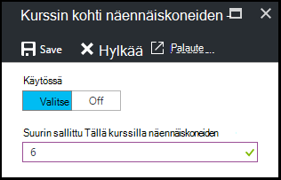

<properties
    pageTitle="Kurssin suojauskäytäntöjen Azure DevTest harjoituksia | Microsoft Azure"
    description="Opettele kurssin suojauskäytäntöjen esimerkiksi AM kokoja, suurin VMs käyttäjän ja Sammuta automaatio kohden."
    services="devtest-lab,virtual-machines"
    documentationCenter="na"
    authors="tomarcher"
    manager="douge"
    editor=""/>

<tags
    ms.service="devtest-lab"
    ms.workload="na"
    ms.tgt_pltfrm="na"
    ms.devlang="na"
    ms.topic="article"
    ms.date="09/12/2016"
    ms.author="tarcher"/>

# Kurssin suojauskäytäntöjen Azure DevTest harjoituksia

> [AZURE.VIDEO how-to-set-vm-policies-in-a-devtest-lab]

Azure DevTest harjoituksia avulla voit määrittää avaimen käytäntöjä, joiden avulla voit hallita kustannukset ja minimoida jätettä oman harjoituksia. Kurssin käytännöt sisältävät VMs luotu ja kurssin ja eri automaattinen sulkeminen ja automaattisen käynnistyksen asetukset käyttäjää kohden. 

## Azure DevTest harjoituksia käytäntöjä kurssin käyttäminen

Seuraavien ohjeiden mukaisesti ohjaavat käytännöt Azure DevTest harjoituksia-kurssin määrittäminen:

Voit tarkastella kurssin jäsenyydelle (ja muuttaa), toimi seuraavasti:

1. Kirjautuminen [Azure portal](http://go.microsoft.com/fwlink/p/?LinkID=525040).

1. Valitse **Lisää palveluja**ja valitse sitten luettelosta **DevTest harjoituksia** .

1. Valitse haluamasi testiympäristössä harjoituksia-luettelosta.   

1. Valitse **tietoturva-asetukset**.

1. **Tietoturva-asetukset** -sivu sisältää asetuksia, jotka voit määrittää: 

    

    Lisätietoja käytännön määrittäminen, valitse se seuraavasta luettelosta:

    - [Sallitut virtuaalikoneen koot](#set-allowed-virtual-machine-sizes) – Valitse AM koot luettelo sallittu testiympäristössä. Käyttäjä voi luoda VMs vain tästä luettelosta.

    - [Käyttäjäkohtainen näennäiskoneiden](#set-virtual-machines-per-user) – Määritä VMs, joka voidaan luoda käyttäjän enimmäismäärä. 

    - [Kurssin kohti näennäiskoneiden](#set-virtual-machines-per-lab) - Määritä VMs, joka voidaan luoda kurssin enimmäismäärä. 

    - [Automaattinen sulkeminen](#set-auto-shutdown) – Määritä aika, kun nykyisen testiympäristössä on VMs suljetaan automaattisesti.

    - [Automaattinen aloitus](#set-auto-start) - Määritä aika, kun nykyisen testiympäristössä VMs automaattisesti käynnistäminen.

## Määritä sallitut virtual machine koot

Käytännön AM sallitun koon määrittämiseen voit pienentää kurssin jätteiden voit määrittää, mitkä AM koot sallitaan testiympäristössä. Jos tämä käytäntö on aktivoitu, vain AM koot tästä luettelosta voidaan luoda VMs.

1. Valitse **sallitut näennäiskoneiden koot**kurssin **tietoturva-asetukset** -sivu.

    
 
1. Valitse **Valitse** tämän käytännön käyttöön ja **poistaminen käytöstä** , poista se käytöstä.

1. Jos otat tämän käytännön, valitse vähintään yksi AM koot, joka voidaan luoda oman testiympäristössä.

1. Valitse **Tallenna**.

## Määritä näennäiskoneiden käyttäjää kohden

Näennäiskoneiden **Käyttäjäkohtainen** käytännön avulla voit määrittää VMs, joka voidaan luoda valitsemalla yksittäisten käyttäjien enimmäismäärä. Jos käyttäjä yrittää luoda AM, kun käyttäjien enimmäismäärä on saavutettu-virhesanoma osoittaa, AM ei voi luoda. 

1. Valitse kurssin **tietoturva-asetukset** -sivu, **näennäiskoneiden käyttäjää kohden**.

    

1. Valitse **Valitse** tämän käytännön käyttöön ja **poistaminen käytöstä** , poista se käytöstä.

1. Jos otat tämän käytännön, kirjoita enimmäismäärä, joka on luotu käyttäjän VMs ilmaiseva numeerinen arvo. Jos kirjoitat luku, joka ei ole kelvollinen, Käyttöliittymä näyttää kentän sallittu enimmäismäärä.

1. Valitse **Tallenna**.

## Määritä näennäiskoneiden kurssin kohden

Näennäiskoneiden **kohti kurssin** käytännön avulla voit määrittää, joka voidaan luoda nykyisen testiympäristössä VMs enimmäismäärä. Jos käyttäjä yrittää luoda AM, kun kurssin enimmäismäärä on saavutettu-virhesanoma osoittaa, AM ei voi luoda. 

1. Valitse kurssin **käytäntöasetukset** sivu **näennäiskoneiden kurssin kohden**.

    

1. Valitse **Valitse** tämän käytännön käyttöön ja **poistaminen käytöstä** , poista se käytöstä.

1. Jos otat tämän käytännön, kirjoita enimmäismäärä, joka voidaan luoda nykyisen testiympäristössä VMs ilmaiseva numeerinen arvo. Jos kirjoitat luku, joka ei ole kelvollinen, Käyttöliittymä näyttää kentän sallittu enimmäismäärä.

1. Valitse **Tallenna**.

## Määritä automaattinen-sulkeminen

Automaattinen Sammuta käytännön avulla Pienennä kurssin jätteiden sallimalla voit määrittää ajan, joka Tällä kurssilla VMs Sammuta.

1. Valitse **Automaattinen sulkeminen**kurssin **tietoturva-asetukset** -sivu.

    

1. Valitse **Valitse** tämän käytännön käyttöön ja **poistaminen käytöstä** , poista se käytöstä.

1. Jos otat tämän käytännön, Määritä nykyinen testiympäristössä kaikki VMs Sammuta paikallista aikaa.

1. Valitse **Tallenna**.

1. Oletusarvon mukaan käytössä, kun käytäntö koskee kaikkia VMs nykyisen testiympäristössä. Jos haluat poistaa tietyn AM tämän asetuksen, Avaa AM sivu ja muuta sen **Automaattinen Sammuta** -asetus 

## Automaattisen käynnistyksen määrittäminen

Automaattisen käynnistyksen käytännön avulla voit määrittää, kun nykyisen testiympäristössä VMs voi käynnistää.  

1. Valitse **Automaattinen käynnistys**kurssin **tietoturva-asetukset** -sivu.

    

1. Valitse **Valitse** tämän käytännön käyttöön ja **poistaminen käytöstä** , poista se käytöstä.

1. Jos otat tämän käytännön määrittää paikallisen Ajoitettu aloitusaika ja viikonpäivien, jossa kellonajan koskee. 

1. Valitse **Tallenna**.

1. Kun otettu käyttöön, käytäntö ei käytetä minkä tahansa VMs nykyisen testiympäristössä automaattisesti. Jos haluat käyttää tätä asetusta tietyn AM, Avaa AM sivu ja muuta sen **Käynnistä automaattisesti** -asetus 

[AZURE.INCLUDE [devtest-lab-try-it-out](../../includes/devtest-lab-try-it-out.md)]

## Seuraavat vaiheet

Kun olet määrittänyt ja eri AM käytäntöasetukset haettu oman kurssin, seuraavat seikat, voit kokeilla seuraava:

- [Määritä kustannusten hallinta](./devtest-lab-configure-cost-management.md) - kuvataan, miten **Kuukausittaiset arvioitu kustannukset trendi** -kaaviossa  
Voit tarkastella kuluvan kuukauden on arvioitu kustannukset päivämäärä- ja arvioidut kuukausi kustannukset.
- [Luo mukautettu kuva](./devtest-lab-create-template.md) - AM luodessasi voit määrittää tietokannassa, joka voi olla mukautetun kuvan tai Marketplace-kuva. Tässä artikkelissa kuvataan, miten voit luoda mukautetun kuvan Näennäiskiintolevyn tiedostosta.
- [Määritä Marketplace kuvat](./devtest-lab-configure-marketplace-images.md) - Azure DevTest harjoituksia tukee luominen Azure Marketplace kuvat perustuvat VMs. Tässä artikkelissa kuvataan, miten voit määrittää, mitä mahdollisesti Azure Marketplacesta kuvia voidaan käyttää luotaessa VMs testiympäristössä.
- [Luo AM testiympäristössä](./devtest-lab-add-vm-with-artifacts.md) - on kuvattu luomisesta AM perus kuvasta (joko mukautettu tai Marketplace), ja miten voit käyttää omaa AM palvelutiedot.
