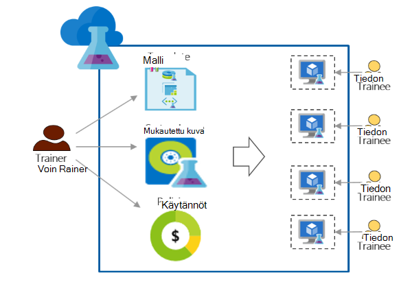

<properties
    pageTitle="Käytä Azure DevTest harjoituksia koulutusta | Microsoft Azure"
    description="Opettele käyttämään Azure DevTest harjoituksia koulutus skenaarioissa."
    services="devtest-lab,virtual-machines"
    documentationCenter="na"
    authors="steved0x"
    manager="douge"
    editor=""/>

<tags
    ms.service="devtest-lab"
    ms.workload="na"
    ms.tgt_pltfrm="na"
    ms.devlang="na"
    ms.topic="article"
    ms.date="09/12/2016"
    ms.author="sdanie"/>

# Käytä Azure DevTest harjoituksia koulutus

Azure DevTest harjoituksia avulla voidaan toteuttaa monta skenaariota lisäksi keskihajonta/testi. Yksi tilanteisiin on koulutus testiympäristössä määrittäminen. Azure DevTest harjoituksia avulla voit luoda testiympäristössä, johon voidaan lisätä mukautettuja malleja, jotka kunkin tiedon avulla voit luoda samanlaiset ja eristetty ympäristöissä koulutusta. Voit varmistaa koulutus ympäristöissä ovat käytettävissä kunkin tiedon vain, kun ne on ne ja sisällä riittävästi resursseja – kuten näennäiskoneiden - koulutusta vaaditaan. Lopuksi voit helposti jakamiseen testiympäristössä oppisopimussuhteiset työntekijät, jotka he pääsevät yhdellä napsautuksella.   

Azure DevTest harjoituksia täyttää seuraavat vaatimukset, joita tarvitaan kouluttaminen virtual-ympäristössä: 

-   Oppisopimussuhteiset työntekijät näe VMs luoma oppisopimussuhteiset muut työntekijät
-   Koulutus jokaiseen tietokoneeseen on oltava täsmälleen samat
-   Oppisopimussuhteiset työntekijät voivat nopeasti valmistella koulutus ympäristöissä
-   Varmistamalla, että oppisopimussuhteiset työntekijät ei voi käyttää useita VMs kuin tarvitsemansa koulutusta ja myös Sammuta VMs kun niitä ei käytetä ne kustannusten hallinta
-   Koulutus testiympäristössä jakaminen helposti kunkin tiedon
-   Koulutus testiympäristössä käyttää yhä uudelleen

Tässä artikkelissa tietoja eri Azure DevTest harjoituksia ominaisuudet, joita voidaan käyttää vastaa yksityiskohtaiset ohjeet, joita voit seurata määrittämään kurssin koulutusta ja edellä kuvattuja koulutus vaatimuksia.  

## Azure DevTest harjoituksia koulutusta toteuttaminen

1. **Luo testiympäristössä** 

    Harjoituksia ovat aloituskohdan-Azure DevTest harjoituksia. Kun luot testiympäristössä, voit suorittaa tehtäviä siten kuin käyttäjien (oppisopimussuhteiset työntekijät) lisääminen testiympäristössä, määrittää käytäntöjä kustannusten, Määritä AM kuviksi, joita voit luoda nopeasti.   

    Lisätietoja valitsemalla seuraavan taulukon linkeistä:

  	| Tehtävä                                                            | Oppimasi                                                    |
|-----------------------------------------------------------------|----------------------------------------------------------------------|
| [Azure DevTest harjoituksia kurssin luominen](devtest-lab-create-lab.md) | Opettele kurssin luominen Azure DevTest harjoituksia Azure-portaalissa. |

2. **Luo koulutus VMs käyttämällä valmiita marketplace kuvia ja mukautettuja kuvia tunnissa** 
    
    Voit valita useista kuvien valmiita kuvia Azure Marketplacesta ja tarkastella niitä offline-testiympäristössä oppisopimussuhteiset työntekijät varten. Jos valmiita kuvia ei vastaa tarpeitasi, voit luoda mukautetun kuvan luomalla kurssin käyttämällä valmiita kuvaa Azure Marketplacen kaikki, jotka tarvitset koulutuksen ja tallentamalla AM mukautetun kuvan testiympäristössä ohjelmistojen AM. 

    Lisätietoja valitsemalla seuraavan taulukon linkeistä:

  	| Tehtävä                                                                              | Oppimasi                                                                                                                                  |
|-----------------------------------------------------------------------------------|-------------------------------------------------------------------------------------------------------------------------------------------------|
| [Määritä Azure Marketplace-kuvat](devtest-lab-configure-marketplace-images.md) | Katso, kuinka voit whitelist Azure Marketplace-kuvia; puhelujen valittavissa vain kuvat haluat koulutuksen.                 |
| [Mukautetun kuvan luominen](devtest-lab-create-template.md)                           | Luo mukautettu kuva asentamalla valmiiksi niin, että oppisopimussuhteiset työntekijät voivat luoda nopeasti AM, mukautettu kuva käyttämällä koulutuksen tarvittavat ohjelmistot. |

3. **Luo Uudelleenkäytettävä malleja, koulutusta tietokoneissa** 

    Azure DevTest harjoituksia kaavassa on ominaisuuksien oletusarvot AM luomiseen käytetyt luettelo. Voit luoda kaavan testiympäristössä valitsemalla kuvan, AM-koko (yhdistelmän suorittimen ja RAM-Muistia) ja virtual verkkoon. Kunkin tiedon voit kaava näkyy testiympäristössä ja luoda AM. 

    Lisätietoja valitsemalla seuraavan taulukon linkeistä:

  	| Tehtävä                                                                         | Oppimasi                                                                                                          |
|------------------------------------------------------------------------------|-------------------------------------------------------------------------------------------------------------------------|
| [DevTest harjoituksia kaavojen luomiseen VMs hallinta](devtest-lab-manage-formulas.md) | Katso, miten voit luoda kaavan valitsemalla kuvan, AM koon (yhdistelmä suorittimen ja RAM-Muistia) ja virtual verkon. |

4. **Kustannusten hallinta**

    Voit määrittää käytännön määrittäminen enimmäismäärä, joka voidaan luoda valitsemalla testiympäristössä tiedon VMs testiympäristössä Azure DevTest harjoituksia. 

    Jos ovat toteuttaa Monipäiväinen koulutus ja haluat lopettaa kaikki VMs tiettynä ajankohtana päivän ja uudelleen automaattisesti ne seuraavaan päivään, voit helposti tehdä, määrittämällä automaattisen sulkeminen ja automaattisen käynnistyksen määrittäminen testiympäristössä. 

    Lopuksi koulutus päätyttyä voit poistaa kaikki VMs kerralla suorittamalla yhden PowerShell-komentosarjaa. 

    Lisätietoja valitsemalla seuraavan taulukon linkeistä:

  	| Tehtävä                                                                                                                                    | Oppimasi                                                      |
|-----------------------------------------------------------------------------------------------------------------------------------------|---------------------------------------------------------------------|
| [Kurssin käytäntöjen määrittäminen](devtest-lab-set-lab-policy.md)                                                                                    | Käytäntöjen määrittäminen testiympäristössä hallita kustannukset.                       |
| [Poista kaikki testiympäristössä VMs käyttämällä PowerShell-komentosarja](devtest-lab-faq.md#how-can-i-automate-the-process-of-deleting-all-the-vms-in-my-lab) | Poista kaikki kerralla harjoituksia koulutus päätyttyä. |

5. **Kunkin tiedon testiympäristössä jakaminen**

    Harjoituksia voi käyttää suoraan oman oppisopimussuhteiset työntekijät kanssa jaettavan linkin avulla. Oman oppisopimussuhteiset työntekijät jopa ei ole on Azure-tili, kun ne on [Microsoft-tili](devtest-lab-faq.md#what-is-a-microsoft-account). Oppisopimussuhteiset työntekijät näe muiden oppisopimussuhteiset työntekijät luoma VMs.  

    Lisätietoja valitsemalla seuraavan taulukon linkeistä:

  	| Tehtävä                                                                                                                                | Oppimasi                                                   |
|-------------------------------------------------------------------------------------------------------------------------------------|------------------------------------------------------------------|
| [Tiedon lisääminen Azure DevTest harjoituksia-testiympäristössä](devtest-lab-add-devtest-user.md)                                                     | Azure portaalin avulla voit lisätä oppisopimussuhteiset työntekijät koulutus-kurssin.       |
| [Lisää oppisopimussuhteiset työntekijät käyttämällä PowerShell-komentosarjaa testiympäristössä](devtest-lab-add-devtest-user.md#add-an-external-user-to-a-lab-using-powershell) | PowerShellin avulla voit automatisoida lisääminen oppisopimussuhteiset työntekijät koulutus-kurssin avulla. |
| [Linkin testiympäristössä](devtest-lab-faq.md#how-do-i-share-a-direct-link-to-my-lab)                                                  | Katso, miten kurssin suoraan käyttää kautta hyperlinkin.        |

6. **Käyttää testiympäristössä yhä uudelleen** 

    Voit automatisoida kurssin luominen, mukautetut asetukset, mukaan lukien Resurssienhallinta-mallin luominen ja käyttämällä sitä Luo identtisiä harjoituksia yhä uudelleen. 

    Lisätietoja valitsemalla seuraavan taulukon linkeistä:

  	| Tehtävä                                                                                                                               | Oppimasi                                                      |
|------------------------------------------------------------------------------------------------------------------------------------|---------------------------------------------------------------------|
| [Luo testiympäristössä, Resurssienhallinta mallin avulla](devtest-lab-faq.md#how-do-i-create-a-lab-from-an-azure-resource-manager-template) | Luo harjoituksia Azure DevTest harjoituksia Resurssienhallinta mallien avulla. |

[AZURE.INCLUDE [devtest-lab-try-it-out](../../includes/devtest-lab-try-it-out.md)]  

