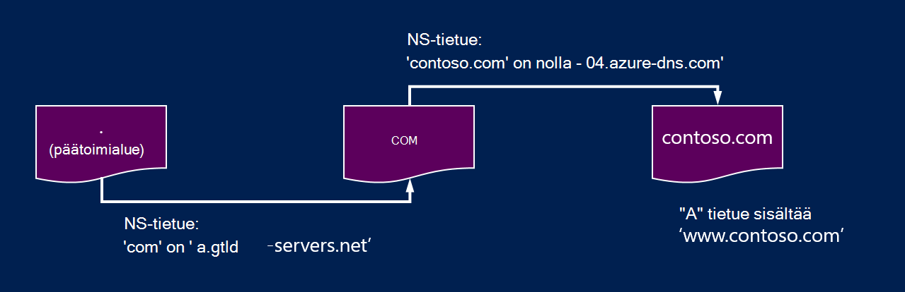
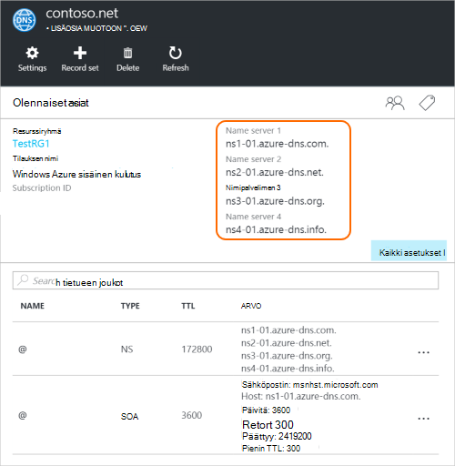

<properties
   pageTitle="Delegoi toimialueen Azure DNS | Microsoft Azure"
   description="Voit muuttaa toimialueen delegointi ja Azure DNS-nimipalvelimet avulla voit lisätä toimialueen ylläpitäminen osaavat."
   services="dns"
   documentationCenter="na"
   authors="sdwheeler"
   manager="carmonm"
   editor=""/>

<tags
   ms.service="dns"
   ms.devlang="na"
   ms.topic="get-started-article"
   ms.tgt_pltfrm="na"
   ms.workload="infrastructure-services"
   ms.date="06/30/2016"
   ms.author="sewhee"/>

# Edustajan Azure DNS toimialue

Azure DNS voit isännöidä DNS-vyöhyke ja Azure-tietokannassa toimialueen DNS-tietueiden hallinta. Jotta saavuttamiseksi Azure DNS toimialueen DNS-kyselyt toimialue on voi delegoida Azure DNS ylemmän tason toimialueesta. Muista Azure DNS ei ole toimialuerekisteröijän. Tässä artikkelissa kerrotaan toimialueen delegointi toiminta ja niiden delegoida toimialueiden Azure DNS.

## DNS-delegointi toiminta

### Toimialueet ja alueet

Domain Name System on toimialueen hierarkian. Hierarkian alkaa '' päätoimialue, jonka nimi on yksinkertaisesti**.**.  Alapuolelle tulee ylimmän tason toimialueet, kuten "com', 'nettonykyarvon',"organisaatiokaavion","USA"tai"jp".  Nämä alla on toisen tason toimialueet, kuten "org.uk" tai "co.jp".  Ja niin edelleen. Toimialueen DNS-hierarkiassa isännöidään käyttämällä eri DNS-alueita. Yleisesti vyöhykkeiden jaetaan, ylläpitää DNS-nimipalvelimet eri puolilla maailmaa.

**DNS-vyöhyke**

Toimialue on yksilöllinen nimi Domain Name System, esimerkiksi contoso. DNS-vyöhyke käytetään isännöimiseen tietyn toimialueen DNS-tietueet. Esimerkiksi toimialueen "contoso.com" voi sisältää useita DNS-tietueiden, kuten mail.contoso.com (for postipalvelimeen) ja www.contoso.com (varten sivuston).

**Toimialuerekisteröijän**

Toimialueen rekisteröintipalveluun on yritys, jotka voivat suorittaa Internet-toimialueen nimen. Hän tarkistaa, jos Internet-toimialue, jota haluat käyttää on käytettävissä ja voit ostaa sen. Toimialuenimen rekisteröitynyt voi oikeudellinen omistaja toimialuenimi. Jos sinulla on jo Internet-toimialue, Delegoi Azure DNS nykyinen toimialuerekisteröintipalvelusi avulla.

>[AZURE.NOTE] Lisätietoja kuka omistaa annetun toimialuenimi tai lisätietoja siitä, miten voit ostaa toimialueen lisätietoja [Azure AD-Internet-toimialuehallinta](https://msdn.microsoft.com/library/azure/hh969248.aspx).

### Tarkkuutta ja delegointi

DNS-palvelimien kahdenlaisia:

- _Tärkeimpien_ DNS-palvelin isännöi DNS-vyöhykkeet. Se on vastauksia DNS-kyselyt Näitä vyöhykkeitä tietueissa.
- _Rekursiiviset_ DNS-palvelin ei isännöi DNS-vyöhykkeet. Se on vastauksia kaikki DNS-kyselyt soittamalla hallitsevan DNS-palvelimet keräämistä varten tarvitsemat tiedot.

>[AZURE.NOTE] Azure DNS tarjoaa hallitsevan DNS-palvelun.  Se ei tarjoa rekursiivinen DNS-palvelusta.

> Pilvipalveluiden ja VMs Azure automaattisesti määritetty käyttämään rekursiivinen DNS-palvelut, jotka on erikseen Azure's infrastruktuurin osana.  Lisätietoja DNS-asetusten muuttamisesta on artikkelissa [Nimenselvitys Azure-tietokannassa](../virtual-network/virtual-networks-name-resolution-for-vms-and-role-instances.md#name-resolution-using-your-own-dns-server).

DNS-asiakkaat PC-tai mobiililaitteiden Soita yleensä suorittaa minkä tahansa DNS-kyselyt asiakassovellusten on rekursiivinen DNS-palvelimeen.

Kun rekursiivinen DNS-palvelin vastaanottaa kyselyn DNS-tietueen, kuten "www.contoso.com", se on ensin Etsi vyöhykkeen "contoso.com" toimialueen palvelimen nimi. Voit tehdä tämän se alkaa pääkansion nimipalvelimia ja sieltä löytää isännöinnin 'com-vyöhykkeen nimipalvelimet. Se sitten kyselyt 'com-nimipalvelimet etsiminen isännöinnin "contoso.com" vyöhykkeen nimipalvelimet.  Lopuksi on voi tehdä kyselyn näistä nimipalvelimen "www.contoso.com".

Tätä kutsutaan ratkaiseminen DNS-nimi. Asiassa DNS-ratkaisun sisältää lisätoimia, kuten seuraavassa CNAMEs, mutta ei tärkeitä tietoja DNS-delegointi toiminta.

Miten ylemmän tason vyöhykkeen "Osoita" ali-vyöhykkeen nimipalvelimia? Se tekee sen käyttämällä erityinen DNS-tietue, jota kutsutaan NS-tietue (NS on "nimipalvelin"). Esimerkiksi juurikansio sisältää "com" NS-tietueet ja näyttää 'com-vyöhykkeen nimipalvelimia. Puolestaan 'com-vyöhyke sisältää "contoso.com", jossa näkyvät "contoso.com" vyöhykkeen nimipalvelimet NS-tietueet. Määritä ali-vyöhykkeen ylemmän tason vyöhykkeessä NS-tietueet kutsutaan delegoiminen toimialueen.

Kunkin delegointi itse asiassa kaksi kopiota NS-tietueet; toinen ylemmän tason vyöhykkeen osoittamalla lapsen, ja toisen lapsen vyöhykkeellä itse. "Contoso.com"-vyöhyke sisältää NS-tietueet contoso.com (lisäksi "com" NS-tietueita). Näitä kutsutaan tärkeimpien NS-tietueet ja niiden istut osoitteessa ali-alueen yläreunassa.

## Delegoiminen Azure DNS toimialue

Kun luot DNS-vyöhyke Azure DNS, sinun täytyy määrittäminen NS-tietueet ylemmän tason vyöhykkeessä, jotta Azure DNS nimenselvitys vyöhykkeen tärkeimpien lähde. Rekisteröintipalvelustasi tarjoaa toimialueiden hankittu jostakin rekisteröintipalvelusta, voit määrittää nämä NS-tietueet.

>[AZURE.NOTE] Sinun ei tarvitse omistettava toimialue, jotta he voivat luoda DNS-vyöhyke Azure DNS-toimialueen nimi. Haluat kuitenkin toimialueen määrittäminen delegointi Azure DNS rekisteröijästä kanssa.

Oletetaan, että ostat toimialueen "contoso.com" ja alueen nimi "contoso.com" luominen Azure DNS. Toimialueen omistaja rekisteröintipalvelustasi tarjoaa asetuksen nimi-server (eli NS-tietueet)-osoitteiden määrittäminen toimialueen. Rekisteröijästä tallentaa nämä NS-tietueet ylemmän tason toimialueen, tässä tapauksessa ".com". Asiakkaiden eri puolilla maailmaa sitten yhteystietoryhmässä toimialueen Azure DNS-vyöhyke, kun yrität selvittää DNS-tietueet "contoso.com".

### Löydä nimi palvelinten nimet

Ennen kuin voit siirtää DNS-vyöhyke Azure DNS, sinun on tietää vyöhykkeen nimi palvelimen nimet. Azure DNS varaa nimipalvelimet resurssivarannosta aina, kun vyöhyke luodaan.

Helpoin tapa on määritetty vyöhykkeeseen nimipalvelimet on Azure portaalin.  Tässä esimerkissä vyöhykkeen 'contoso.net' on määritetty nimipalvelimet ' ns1-01.azure-dns.com', 'ns2 01.azure-dns .net', ' ns3-01.azure-dns.org', ja ' ns4-01.azure-dns.info':

 

Azure DNS luo automaattisesti oman aikavyöhykkeesi, joka sisältää määritetyt nimipalvelimet tärkeimpien NS-tietueet.  Nähdäksesi nimi palvelinten nimet PowerShellin Azure tai Azure CLI riittää, että haluat hakea nämä tietueet.

PowerShellin Azure tärkeimpien NS-tietueita voidaan hakea seuraavasti. Huomaa, että tietueen nimi “@” on käytetty tietueiden alueen yläreunassa.

    PS> $zone = Get-AzureRmDnsZone –Name contoso.net –ResourceGroupName MyResourceGroup
    PS> Get-AzureRmDnsRecordSet –Name “@” –RecordType NS –Zone $zone

    Name              : @
    ZoneName          : contoso.net
    ResourceGroupName : MyResourceGroup
    Ttl               : 3600
    Etag              : 5fe92e48-cc76-4912-a78c-7652d362ca18
    RecordType        : NS
    Records           : {ns1-01.azure-dns.com, ns2-01.azure-dns.net, ns3-01.azure-dns.org,
                        ns4-01.azure-dns.info}
    Tags              : {}

Voit käyttää myös Office kaikissa ympäristöissä Azure CLI tärkeimpien NS-tietueiden hakeminen ja tutustu näin ollen vyöhykkeeseen oman nimipalvelimet:

    C:\> azure network dns record-set show MyResourceGroup contoso.net @ NS
    info:    Executing command network dns record-set show
        + Looking up the DNS Record Set "@" of type "NS"
    data:    Id                              : /subscriptions/.../resourceGroups/MyResourceGroup/providers/Microsoft.Network/dnszones/contoso.net/NS/@
    data:    Name                            : @
    data:    Type                            : Microsoft.Network/dnszones/NS
    data:    Location                        : global
    data:    TTL                             : 172800
    data:    NS records
    data:        Name server domain name     : ns1-01.azure-dns.com.
    data:        Name server domain name     : ns2-01.azure-dns.net.
    data:        Name server domain name     : ns3-01.azure-dns.org.
    data:        Name server domain name     : ns4-01.azure-dns.info.
    data:
    info:    network dns record-set show command OK

### Voit määrittää delegointi

Kunkin rekisteröintipalvelu on omia DNS-hallintatyökalut, voit muuttaa toimialueen nimipalvelintietueita. NS-tietueiden muokkaaminen Rekisteröintipalvelun DNS-hallintasivulle ja korvaa NS-tietueet Azure DNS luotu olevilla.

Kun delegoiminen Azure DNS toimialue, sinun on käytettävä Azure DNS myöntämä nimi palvelinten nimet.  Käytä aina kaikki 4 nimi palvelinten nimet, riippumatta siitä, että toimialueen nimi.  Toimialueen delegointi ei edellytä palvelimen nimeä käyttämään toimialueen ylimmän tason toimialue.

Älä käytä 'Liimaa tietueiden' osoittamaan Azure DNS nimeä palvelimen IP-osoitteet, koska nämä IP-osoitteet saattavat muuttua myöhemmin. Käyttämällä nimi palvelinten nimet oman vyöhykkeessä, niin sanottu 'vanity nimipalvelimet' delegoinnit ei tueta tällä hetkellä Azure DNS.

### Vahvista nimenselvitys toimii

Kun olet suorittanut delegoinnin, voit varmistaa, että nimenselvitys toimii kyselyn SOA-tietue (joka on luotu automaattisesti myös vyöhykkeen luotaessa) vyöhykkeen esimerkiksi "nslookup-työkalun avulla.

Huomaa, että sinulla ei ole Määritä Azure DNS-nimipalvelimet, koska Normaali DNS-ratkaisuprosessin etsii nimipalvelimia automaattisesti Jos delegoinnin on määritetty oikein.

    nslookup –type=SOA contoso.com

    Server: ns1-04.azure-dns.com
    Address: 208.76.47.4

    contoso.com
    primary name server = ns1-04.azure-dns.com
    responsible mail addr = msnhst.microsoft.com
    serial = 1
    refresh = 900 (15 mins)
    retry = 300 (5 mins)
    expire = 604800 (7 days)
    default TTL = 300 (5 mins)

## Valtuutettu alitoimialueisiin Azure DNS-palvelimesta

Jos haluat määrittää erillisen ali-alueen, voit delegoida aliraportti toimialueen Azure DNS. Oletetaan esimerkiksi ottaa määrittäminen ja valtuutetun "contoso.com" Azure DNS-haluat määrittää erillisen ali-alueen "partners.contoso.com".

Vastaavat prosessin seuraa kuin tavallinen delegointi aliraportti toimialueen määrittämisestä. Ainoa ero on vaiheessa 3 NS-tietueet on luotava ylemmän tason vyöhykkeen contoso.com, jos Azure DNS sijaan määritettävään toimialueen rekisteröintipalveluun kautta.

1. Luo lapsen vyöhykkeen 'partners.contoso.com' Azure DNS.
2. Etsi lapsen vyöhykkeellä hankkiminen lapsen vyöhykkeen Azure DNS-isännöintipalvelu nimipalvelimet tärkeimpien NS-tietueet.
3. Delegoida ali-alueen määrittämällä osoittamalla lapsen vyöhykkeen ylemmän tason vyöhykkeellä NS-tietueet.

### Määritettävän aliraportti toimialueeseen

PowerShellin seuraavassa esimerkissä on kuvattu, miten tämä toimii. Samat vaiheet voidaan suorittaa Azure-portaalin kautta tai Office kaikissa ympäristöissä Azure CLI kautta.

#### Vaihe 1. Luo pää- ja aliluetteloista vyöhykkeisiin.

Ensin luodaan, pää- ja aliluetteloista vyöhykkeisiin. Nämä voi olla samaa resurssiryhmä tai eri resurssiryhmät.

    $parent = New-AzureRmDnsZone -Name contoso.com -ResourceGroupName RG1
    $child = New-AzureRmDnsZone -Name partners.contoso.com -ResourceGroupName RG1

#### Vaihe 2. Nouda NS-tietueet

Seuraavaksi on noutaa tärkeimpien NS-tietueet lapsen vyöhykkeen seuraavan esimerkin mukaisesti.  Sisältää ali-vyöhykkeeseen nimipalvelimet.

    $child_ns_recordset = Get-AzureRmDnsRecordSet -Zone $child -Name "@" -RecordType NS

#### Vaihe 3. Edustajan ali-vyöhyke

Luo vastaavan määrittäminen ylemmän tason vyöhykkeessä, viimeistele delegoinnin NS-tietue. Huomaa, että ylemmän tason vyöhykkeellä tietuejoukon nimi vastaa ali-alueen nimi tässä tapauksessa "kumppaneille".

    $parent_ns_recordset = New-AzureRmDnsRecordSet -Zone $parent -Name "partners" -RecordType NS -Ttl 3600
    $parent_ns_recordset.Records = $child_ns_recordset.Records
    Set-AzureRmDnsRecordSet -RecordSet $parent_ns_recordset

### Vahvista nimenselvitys toimii

Voit tarkistaa, että kaikki tiedot on määritetty oikein tarkistamalla lapsen vyöhykkeen SOA-tietueen.

    nslookup –type=SOA partners.contoso.com

    Server: ns1-08.azure-dns.com
    Address: 208.76.47.8

    partners.contoso.com
        primary name server = ns1-08.azure-dns.com
        responsible mail addr = msnhst.microsoft.com
        serial = 1
        refresh = 900 (15 mins)
        retry = 300 (5 mins)
        expire = 604800 (7 days)
        default TTL = 300 (5 mins)

## Seuraavat vaiheet

[DNS-vyöhykkeet hallinta](dns-operations-dnszones.md)

[DNS-tietueiden hallinta](dns-operations-recordsets.md)

