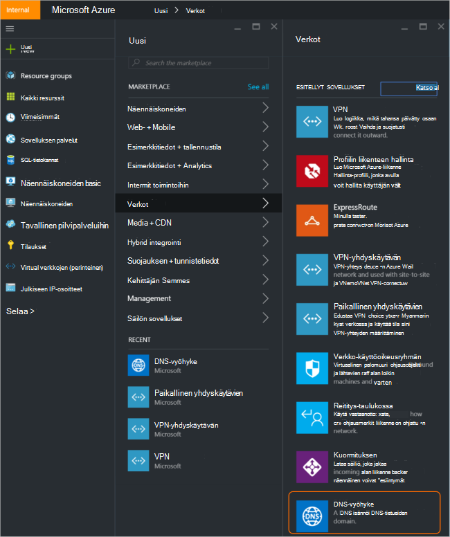
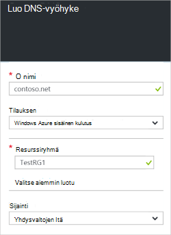
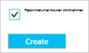
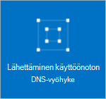
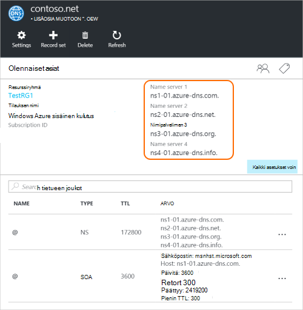
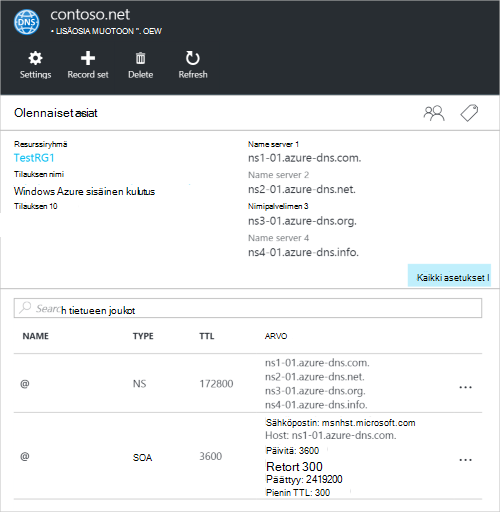

<properties
   pageTitle="Voit luoda ja hallita DNS-vyöhyke Azure-portaalissa | Microsoft Azure"
   description="Opettele luomaan DNS-vyöhykkeet Azure DNS. Tämä on vaiheittaiset ohjeet luoda ja hallita ensimmäisen DNS-ja Käynnistä isännöinnin toimialueen DNS-Azure-portaalissa."
   services="dns"
   documentationCenter="na"
   authors="sdwheeler"
   manager="carmonm"
   editor=""
   tags="azure-resource-manager"/>

<tags
   ms.service="dns"
   ms.devlang="na"
   ms.topic="article"
   ms.tgt_pltfrm="na"
   ms.workload="infrastructure-services"
   ms.date="08/16/2016"
   ms.author="sewhee"/>

# Luo DNS-vyöhyke Azure-portaalissa

> [AZURE.SELECTOR]
- [Azure Portal](dns-getstarted-create-dnszone-portal.md)
- [PowerShellin](dns-getstarted-create-dnszone.md)
- [Azure CLI](dns-getstarted-create-dnszone-cli.md)

Tässä artikkelissa opastaa vaihe vaiheelta, miten DNS-vyöhyke luominen Azure-portaalissa. Voit myös luoda PowerShell tai CLI DNS-vyöhyke.

[AZURE.INCLUDE [dns-create-zone-about](../../includes/dns-create-zone-about-include.md)]

### Tunnisteiden Azure DNS-tietoja

Tunnisteet ovat luettelon nimen ja arvon tietoparin, ja niitä käytetään Azure resurssien hallinnan avulla otsikko resurssien laskutuksen tai ryhmittely. Lisätietoja tunnisteita on artikkelissa [Azure resurssien järjestämiseen tunnisteiden käyttäminen](../resource-group-using-tags.md).

Voit lisätä tunnisteita Azure-portaalissa käyttämällä DNS-vyöhyke **asetukset** -sivu.

## Luo DNS-vyöhyke

1. Kirjaudu Azure-portaaliin

2. Valitse toiminto-valikossa ja valitse **Uusi > verkko >** ja valitse sitten **DNS-vyöhyke** Avaa DNS-vyöhyke-sivu.

    

3. Valitse **DNS-vyöhyke** -sivu valitsemalla **Luo** alaosassa. **Luo DNS-vyöhyke** -sivu avautuu.

    

4. **Luo DNS-vyöhyke** -sivu, valitse nimeä DNS-vyöhyke. Esimerkki: *contoso.com*. Katso [Tietoja DNS Zone nimet](#names) edellisen osan.

5. Määritä seuraavaksi resurssiryhmä, jota haluat käyttää. Voit luoda uusi resurssiryhmä tai valitse sellainen, joka on jo olemassa.

6. Määrittää resurssiryhmän sijainti **sijainti** avattavasta valikosta. Huomaa, että tämä asetus viittaa resurssiryhmä ei DNS-vyöhyke sijainti sijainti. Todellinen DNS-vyöhyke resurssi on automaattisesti "Yleinen", joka ei ole jotakin, mitä voit (tai täytyy) Määritä portaalissa.

7. Voit jättää **raporttinäkymät-ikkunan kiinnittäminen** -valintaruudun valinta, jos haluat etsiä helposti uuden vyöhykkeen-raporttinäkymän. Valitse **Luo**.

    

8. Luo napsauttamisen jälkeen näkyviin tulee uusi vyöhykkeen parhaillaan määritetty koontinäytössä.

    

9. Kun uusi vyöhyke on luotu, uusi vyöhykkeen sivu avautuu koontinäytössä.

## Näytä tietueet

DNS-vyöhyke luominen luo myös seuraavat tietueet:

- "Aloita sekä myöntäjä" (SOA)-tietue. SOA ei sisällä tietoja jokaisen DNS-vyöhyke ylimmällä tasolla.
- Tärkeimpien (NS) nimipalvelintietueita. Nämä Näytä mitä nimipalvelimet isännöit vyöhykkeen. Azure DNS käyttää nimipalvelimet resurssivarantoon ja hieman eri nimipalvelimet voidaan määrittää vyöhykkeitä Azure DNS-palvelimesta. Lisätietoja on kohdassa [edustajan Azure DNS toimialue](dns-domain-delegation.md) .

Voit tarkastella tietueita Azure-portaalista

1. Valitse **DNS-vyöhyke** -sivu, **kaikkia asetuksia** Avaa DNS-vyöhykkeen **Asetukset-sivu** .

    

2. Essentials-ruudun alaosassa näet tietue määrittää DNS-vyöhyke.

    

## Testi

Voit testata DNS-vyöhyke DNS-työkaluja, kuten nslookup, tarkastella ja [Ratkaise DnsName PowerShell cmdlet-komennon](https://technet.microsoft.com/library/jj590781.aspx)avulla.

Jos et ole vielä valtuutetun toimialueen käyttämään uutta aluetta Azure DNS-, sinun on suora suoraan hiirellä yhtä suorakulmion nimipalvelimet vyöhykkeen DNS-kysely. Vyöhykkeen nimipalvelimet on esitetty NS-tietueet mukaan lueteltuna `Get-AzureRmDnsRecordSet` yläpuolella. Voidaan varmistaa, että korvaava oikeat arvot yhdeksi alla oleva komento vyöhykkeen.

    nslookup
    > set type=SOA
    > server ns1-01.azure-dns.com
    > contoso.com

    Server: ns1-01.azure-dns.com
    Address:  208.76.47.1

    contoso.com
            primary name server = ns1-01.azure-dns.com
            responsible mail addr = msnhst.microsoft.com
            serial  = 1
            refresh = 900 (15 mins)
            retry   = 300 (5 mins)
            expire  = 604800 (7 days)
            default TTL = 300 (5 mins)

## Poista DNS-vyöhyke

Voit poistaa DNS-vyöhyke suoraan portaalin. Ennen kuin poistat DNS-vyöhyke Azure DNS-palvelimeen, sinun on poistettava kaikki tietueet joukot lukuun ottamatta NS ja SOA tietueet vyöhykkeen ylimmällä tasolla, jotka on luotu automaattisesti, kun vyöhyke on luotu.

1. Etsi poistettava vyöhykkeen **DNS-vyöhyke** -sivu ja valitse sitten **Poista** yläreunaan sivu.

2. Näyttöön tulee sanoma, jolloin tiedät, että sinun on poistettava kaikki tietueet joukot, paitsi NS ja SOA tietueet, jotka on luotu automaattisesti. Jos olet poistanut tietueen joukot, valitse **Kyllä**. Huomaa, että poistettaessa DNS-vyöhyke-portaalista, resurssiryhmä, johon on liitetty DNS-vyöhyke ei poisteta.

## Seuraavat vaiheet

Kun olet luonut DNS-vyöhyke, luo [tietue joukot ja tietueiden](dns-getstarted-create-recordset-portal.md) voit käynnistää Internet-toimialueen nimet selvitetään.
