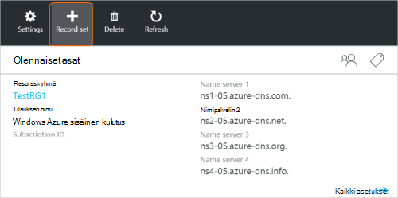
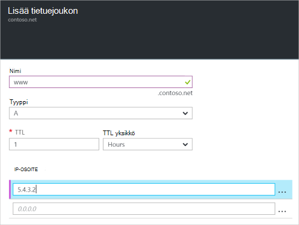

<properties
   pageTitle="Luo tietuejoukon ja tietueet DNS-vyöhyke Azure-portaalissa | Microsoft Azure"
   description="Voit luoda isäntätietueet Azure DNS ja luoda tietueen joukkoja ja tietueiden Azure-portaalissa"
   services="dns"
   documentationCenter="na"
   authors="sdwheeler"
   manager="carmonm"
   editor=""
   tags="azure-resource-manager"/>

<tags
   ms.service="dns"
   ms.devlang="na"
   ms.topic="article"
   ms.tgt_pltfrm="na"
   ms.workload="infrastructure-services"
   ms.date="08/16/2016"
   ms.author="sewhee"/>

# DNS-tietueen joukot ja tietueiden luominen Azure-portaalissa

> [AZURE.SELECTOR]
- [Azure Portal](dns-getstarted-create-recordset-portal.md)
- [PowerShellin](dns-getstarted-create-recordset.md)
- [Azure CLI](dns-getstarted-create-recordset-cli.md)

Tässä artikkelissa käydään läpi luominen tietueita ja tietueiden joukot mukaan Azure-portaalissa. Kun luot DNS-vyöhyke, voit lisätä toimialueen DNS-tietueet. Tällöin sinun on DNS-tietueet ja tietueen joukot.

[AZURE.INCLUDE [dns-about-records-include](../../includes/dns-about-records-include.md)]

## Tietuejoukon ja tietueen luominen

Seuraavassa esimerkissä esitellään tietuejoukon ja tietueen luominen käyttämällä Azure portaalin. Käytämme "A" DNS-tietuetyyppi.

1. Kirjaudu sisään-portaaliin.

2. Siirry **DNS-vyöhyke** -sivu, johon haluat luoda tietuejoukon.

3. **DNS-vyöhyke** -sivu yläreunassa Valitse **tietueen määrittäminen** Avaa **Lisää tietue määrittäminen** -sivu.

    

4. **Lisää tietue määrittäminen** -sivu, valitse nimeä oman tietuejoukon. Voit nimetä esimerkiksi oman tietuejoukon "**www**".

    

5. Valitse luotavan tietueen tyyppi. Valitse esimerkiksi **A**.

6. Määritä **TTL**. Oletusarvoinen time to live-portaalissa on tunnin.

7. Lisää IP-osoitteet, yksi IP-osoite riviä kohden. Kun ehdotettu tietuejoukon nimi ja edempänä tietuetyyppi, IPv4-IP-osoitteiden lisääminen www-tietuejoukon **A** -tietuetta.

8. Kun olet lisännyt IP-osoitteet, valitse **OK** sivu alareunassa. DNS-tietuejoukon luodaan.

## Seuraavat vaiheet

Tietuejoukon ja tietueiden hallinta-kohdassa [Hallitse DNS-tietueet ja tietueen määrittää Azure-portaalissa](dns-operations-recordsets-portal.md).

Saat lisätietoja Azure DNS [Azure DNS yleiskatsaus](dns-overview.md).
