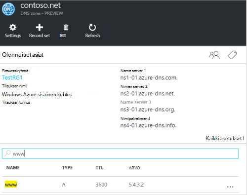
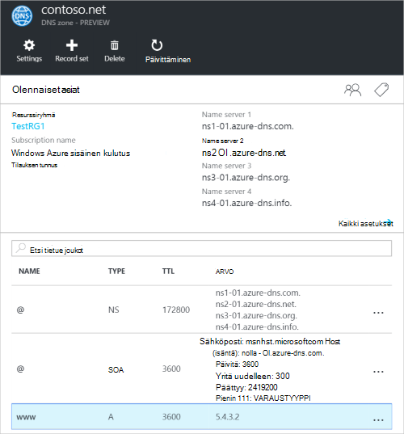
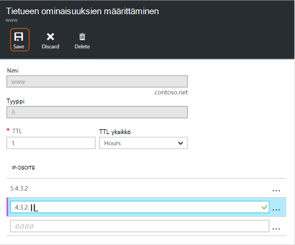
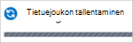
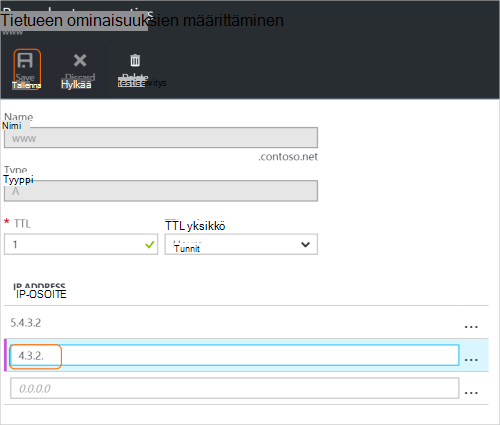
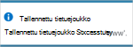
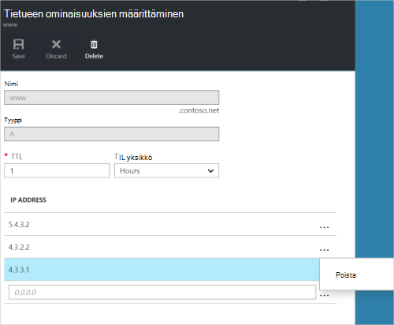
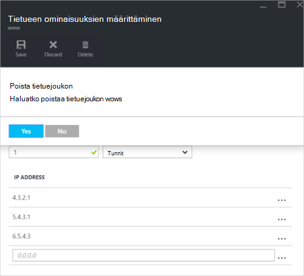

<properties
   pageTitle="DNS-tietueen joukot ja Azure-portaalissa tietueiden hallinta | Microsoft Azure"
   description="Hallita DNS-tietueen asettaa ja tallentaa, kun toimialueen Azure DNS-isännöintipalvelu."
   services="dns"
   documentationCenter="na"
   authors="sdwheeler"
   manager="carmonm"
   editor=""
   tags="azure-resource-manager"/>

<tags
   ms.service="dns"
   ms.devlang="na"
   ms.topic="article"
   ms.tgt_pltfrm="na"
   ms.workload="infrastructure-services"
   ms.date="08/16/2016"
   ms.author="sewhee"/>

# DNS-tietueiden hallintaan ja tietueen määrittää Azure-portaalissa

> [AZURE.SELECTOR]
- [Azure Portal](dns-operations-recordsets-portal.md)
- [Azure CLI](dns-operations-recordsets-cli.md)
- [PowerShellin](dns-operations-recordsets.md)

Tämän artikkelin avulla voit hallita tietueen joukot ja tietueet DNS-vyöhyke Azure-portaalissa.

On tärkeää ymmärtää DNS-tietueen joukot ja yksittäiset DNS-tietueet. Tietuejoukon on kokoelma vyöhykkeen tietueet, jotka on sama nimi ja tyyppi on sama. Lisätietoja on artikkelissa [Luo DNS-tietueen joukot ja tietueiden Azure-portaalissa](dns-getstarted-create-recordset-portal.md).

## Uuden tietuejoukon ja tietueen luominen

Azure-portaalissa tietuejoukon luomisesta on artikkelissa [DNS-tietueiden luominen käyttämällä Azure portaalin](dns-getstarted-create-recordset-portal.md).

## Tarkastele tietuejoukon

1. Siirry Azure-portaalissa **DNS-vyöhyke** -sivu.

2. Etsi tietuejoukon ja napsauttamalla sitä. Tämä avaa tietuejoukon ominaisuudet.

    

## Lisää uusi tietue tietuejoukon

Voit lisätä minkä tahansa tietuejoukon enintään 20 tietuetta. Tietuejoukon ei voi olla kaksi päällekkäisiä tietueita. Tyhjä tietueen joukot (nolla tietueilla) voidaan luoda, mutta ne eivät näy Azure DNS-nimipalvelimet. Tietueen tyyppi CNAME määrä voi olla enintään yksi tietue.

1. Valitse DNS-vyöhykkeen **tietueen ominaisuuksien määrittäminen** -sivu, johon haluat lisätä tietueeseen ja jonka tietuejoukko.

    

2. Määritä tietueen ominaisuuksien määrittäminen täyttämällä kentät.

    

2. Valitse **Tallenna** sivu yläreunassa Tallenna asetukset. Sulje sivu.

3. Valitse oikeasta näet, että tietueen tallentaminen.

    

Kun tietue on tallennettu, **DNS-vyöhyke** -sivu arvot vaikuttavat uuden tietueen.

## Tietueen päivitys

Kun olet päivittänyt aiemmin luodun tietuejoukon tietueen, voit päivittää kentät riippuvat tietueen tyyppi, joiden kanssa työskentelet.

1. Etsi tietue tietueen joukon **tietueen ominaisuuksien määrittäminen** -sivu.

2. Muokkaa tietuetta. Kun muokkaat tietueen, voit muuttaa tietueen käytettävissä olevia asetuksia. Seuraavassa esimerkissä **IP-osoite** -kenttään valitaan, ja IP-osoite on muokataan.

    

3. Valitse **Tallenna** sivu yläreunassa Tallenna asetukset. Oikeassa yläkulmassa tulee ilmoitus, joka tietue on tallennettu.

    

Kun tietue on tallennettu, Määritä **DNS-vyöhyke** -sivu tietueen arvot vaikuttavat päivitetty tietue.

## Tietueen poistaminen tietuejoukon

Voit poistaa tietueita tietuejoukon Azure portaalin. Huomaa, että tietuejoukon viimeisen tietueen poistaminen ei poista tietuejoukon.

1. Etsi tietue tietueen joukon **tietueen ominaisuuksien määrittäminen** -sivu.

2. Napsauta poistettavaa tietuetta. Valitse sitten **Poista**.

    

3. Valitse **Tallenna** sivu yläreunassa Tallenna asetukset.

3. Kun tietue on poistettu, tietueen **DNS-vyöhyke** -sivu-arvot vaikuttavat poistamista.

## Poista tietuejoukon

1. **Tietueen ominaisuuksien määrittäminen** tietuetta sivu määrittäminen, valitse **Poista**.

    

2. Näyttöön tulee kysymys, jos haluat poistaa tietuejoukon.

3. Varmista, että nimi vastaa tietuejoukon, jonka haluat poistaa, ja valitse sitten **Kyllä**.

4. Tarkista tietuejoukon ei enää näy **DNS-vyöhyke** -sivu.

## NS ja SOA tietueiden käyttäminen

Muut tietuetyypit hallitaan NS ja SOA tietueet, jotka luodaan automaattisesti eri tavalla.

### Muokkaa SOA tietueet

Voi lisätä tai poistaa tietueita vyöhykkeen apex määritetään automaattisesti luotu SOA-tietue (nimen = "@"). Voit muokata kaikkia SOA (lukuun ottamatta "isäntä") tietueesta parametrit ja tietueen set TTL kuitenkin.

### Muokkaa vyöhykkeen apex osoitteessa NS-tietueet

Ei voi lisätä, poistaa tai muokata tietueet vyöhykkeen apex määritetään automaattisesti luotu NS-tietue (nimen = "@"). Vain muutoksen, joka on sallittu on muokattava tietuejoukon TTL.

### Poista SOA tai NS tietueen joukot

Et voi poistaa SOA ja NS-tietue määrittää vyöhykkeen apex osoitteessa (nimen = "@") , jotka on luotu automaattisesti vyöhykkeen luomisen yhteydessä. Ne poistetaan automaattisesti, kun poistat vyöhykkeen.

## Seuraavat vaiheet

-   Saat lisätietoja Azure DNS [Azure DNS yleiskatsaus](dns-overview.md).
-   Saat lisätietoja automatisointi DNS [luominen DNS-vyöhykkeet ja tietueen asettaa käyttämällä .NET SDK](dns-sdk.md).
-   Saat lisätietoja käänteinen DNS-tietueiden [hallinta PowerShellin avulla palvelujen käänteinen DNS-tietueet](dns-reverse-dns-record-operations-ps.md).
