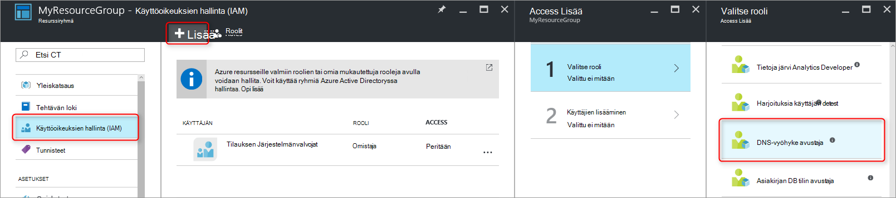
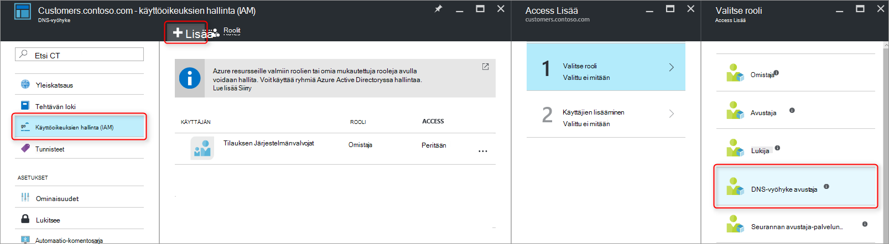

<properties 
   pageTitle="DNS-vyöhykkeet ja tietueiden suojaaminen | Microsoft Azure" 
   description="Voit suojata DNS-vyöhykkeet ja Microsoft Azure DNS-tietueen joukot." 
   services="dns" 
   documentationCenter="na" 
   authors="jtuliani" 
   manager="carmonm" 
   editor=""/>

<tags
   ms.service="dns"
   ms.devlang="na"
   ms.topic="article"
   ms.tgt_pltfrm="na"
   ms.workload="infrastructure-services" 
   ms.date="10/20/2016"
   ms.author="jtuliani"/>

# DNS-vyöhykkeet ja tietueiden suojaaminen

DNS-vyöhykkeet ja tietueet ovat tärkeitä resursseja. DNS-vyöhyke tai jopa vain yhden DNS-tietueen poistaminen voi aiheuttaa yhteensä palvelun käyttökatkosta.  On tärkeää, että tärkeät DNS-vyöhykkeet ja tietueiden suojataan luvatonta tai vahingossa tehdyt muutokset.

Tässä artikkelissa kerrotaan, miten Azure DNS-palvelun avulla voit suojata DNS-vyöhykkeet ja tietueita, kuten muutoksilta.  Emme Käytä kaksi annettu Azure resurssien hallinnan avulla tehokkaita suojaustoimintoja: [Roolipohjainen käyttöoikeuksien valvonta](../active-directory/role-based-access-control-what-is.md) ja [resurssien lukitukset](../resource-group-lock-resources.md).

## Roolipohjainen käyttöoikeuksien valvonta

Azure Roolipohjainen käytön hallinta (RBAC) mahdollistaa tarkasti rajattuja käyttöoikeuksien hallinnan Azure käyttäjiä, ryhmiä ja resursseja. Käytä RBAC, voit myöntää tarkasti access määrää, että käyttäjien on suoritettava niiden työt. Saat lisätietoja siitä, miten RBAC avulla voit hallita niiden käyttöä, [Mikä on Roolipohjainen käyttöoikeuksien valvonta](../active-directory/role-based-access-control-what-is.md).

### 'DNS Zone osallistujan'-rooli

'DNS Zone avustaja' on valmiita rooli toimittaman Azure DNS resurssien hallinta.  Voit hallita DNS-resursseja, mutta ei muita resursseja ryhmän DNS Zone osallistujan oikeuksien määrittäminen käyttäjän tai ryhmän avulla.

Oletetaan, että resurssin ryhmän 'myzones' on viisi vyöhykettä Contoso Corporation. Täydet oikeudet nämä DNS-vyöhykkeet myöntämistä DNS-järjestelmänvalvojan kyseinen resurssiryhmä 'DNS Zone osallistuja-oikeudet, avulla. Se ei tarvitse myöntää tarpeettomat oikeuksia, kuten DNS-järjestelmänvalvoja voi luoda tai pysäyttää virtuaalisten laitteiden.

Helpoin tapa RBAC käyttöoikeuksien on [Azure portaalin](../active-directory/role-based-access-control-configure.md).  Avaa resurssiryhmän "Käyttöoikeuksien hallinta (IAM)"-sivu, valitse valitsemalla Lisää- sitten 'DNS Zone avustaja' rooli ja valitse tarvittavat käyttäjät tai ryhmät voivat myöntää käyttöoikeuksia.

Käyttöoikeuksia voidaan myös [myöntää Azure PowerShellin avulla](../active-directory/role-based-access-control-manage-access-powershell.md):

    # Grant 'DNS Zone Contributor' permissions to all zones in a resource group
    New-AzureRmRoleAssignment -SignInName <user email address> -RoleDefinitionName "DNS Zone Contributor" -ResourceGroupName <resource group name>

Vastaava komento on myös [Azure-CLI kautta](../active-directory/role-based-access-control-manage-access-azure-cli.md):

    # Grant 'DNS Zone Contributor' permissions to all zones in a resource group
    azure role assignment create --signInName  <user email address> --roleName "DNS Zone Contributor" --resourceGroup <resource group name>

### Vyöhykkeen tason RBAC

Resurssiryhmä-tilauksen tai yksittäinen resurssi voi suojata Azure RBAC säännöt. Kyseessä Azure DNS resurssin voi olla yksittäisen DNS-vyöhyke tai jopa yksittäisiä tietuejoukon.

Oletetaan, että resurssin ryhmän 'myzones' sisältää vyöhykkeen "contoso.com" ja subzone 'customers.contoso.com' jossa CNAME-tietueet luodaan asiakkaan jokaiselle tilille.  Tilin avulla voit hallita näitä CNAME-tietueet määritetään käyttöoikeudet 'customers.contoso.com' vyöhykkeen vain tietueiden luomiseen, se ei ole käyttöoikeutta muille alueille.

Vyöhykkeen tason RBAC käyttöoikeudet voi myöntää Azure portaalin kautta.  Avaa vyöhykkeen "Käyttöoikeuksien hallinta (IAM)"-sivu, valitse valitsemalla Lisää- sitten 'DNS Zone avustaja' rooli ja valitse tarvittavat käyttäjät tai ryhmät voivat myöntää käyttöoikeuksia.

Käyttöoikeuksia voidaan myös [myöntää Azure PowerShellin avulla](../active-directory/role-based-access-control-manage-access-powershell.md):

    # Grant 'DNS Zone Contributor' permissions to a specific zone
    New-AzureRmRoleAssignment -SignInName <user email address> -RoleDefinitionName "DNS Zone Contributor" -ResourceGroupName <resource group name> -ResourceName <zone name> -ResourceType Microsoft.Network/DNSZones

Vastaava komento on myös [Azure-CLI kautta](../active-directory/role-based-access-control-manage-access-azure-cli.md):

    # Grant 'DNS Zone Contributor' permissions to a specific zone
    azure role assignment create --signInName <user email address> --roleName "DNS Zone Contributor" --resource-name <zone name> --resource-type Microsoft.Network/DNSZones --resource-group <resource group name>

### Tietueen määrittäminen RBAC

Emme voi edetä vaihe. Harkitse sähköpostin Contoso Corporation, kuka on pääsy MX ja TXT-tietueiden etsiminen "contoso.com"-alueen yläreunassa järjestelmänvalvoja.  Hän ei tarvitse muita MX- tai TXT-tietueita sekä tietueisiin minkä tahansa.  Azure DNS avulla voit määrittää tarkasti tietueeseen, joka sähköpostin järjestelmänvalvoja on pääsy tietuejoukon-tason oikeudet.  Sähköpostin järjestelmänvalvoja on myöntänyt tarkasti ohjausobjektia hän on, ja ei voi tehdä muita muutoksia.
  
Tietuejoukko tason RBAC käyttöoikeuksia voi määrittää kautta Azure-portaaliin, "Käyttäjät"-painikkeen avulla tietuejoukon-sivu:

Tietuejoukko tason RBAC käyttöoikeudet voidaan myös [myöntää Azure PowerShellin avulla](../active-directory/role-based-access-control-manage-access-powershell.md):

    # Grant permissions to a specific record set
    New-AzureRmRoleAssignment -SignInName <user email address> -RoleDefinitionName "DNS Zone Contributor" -Scope "/subscriptions/<subscription id>/resourceGroups/<resource group name>/providers/Microsoft.Network/dnszones/<zone name>/<record type>/<record name>" 

Vastaava komento on myös [Azure-CLI kautta](../active-directory/role-based-access-control-manage-access-azure-cli.md):

    # Grant permissions to a specific record set
    azure role assignment create --signInName <user email address> --roleName "DNS Zone Contributor" --scope "/subscriptions/<subscription id>/resourceGroups/<resource group name>/providers/Microsoft.Network/dnszones/<zone name>/<record type>/<record name>"

### Mukautetut roolit

Valmiin 'DNS Zone avustaja-roolin mahdollistaa DNS resurssin täydet oikeudet. On myös mahdollista luoda omia asiakkaan Azure roolit antamaan jopa tarkemmin ohjausobjektin.

Harkitse uudelleen esimerkki, jossa vyöhykkeellä "customers.contoso.com" CNAME-tietue on luotu Contoso Corporation asiakkaan tileille.  Nämä CNAMEs hallinnassa käytettävän tilin myönnettävä hallintaoikeudet CNAME-tietueet.  Valitse ei voi muokata tietueita muuntyyppisten (kuten MX-tietueita) tai suorittaa vyöhykkeen tason kuten vyöhykkeen Poista.

Seuraavassa esimerkissä esitetään mukautettu roolimääritys CNAME-tietueiden hallintaa varten:

    {
        "Name": "DNS CNAME Contributor",
        "Id": "",
        "IsCustom": true,
        "Description": "Can manage DNS CNAME records only.",
        "Actions": [
            "Microsoft.Network/dnsZones/CNAME/*",
            "Microsoft.Network/dnsZones/read",
            "Microsoft.Authorization/*/read",
            "Microsoft.Insights/alertRules/*",
            "Microsoft.ResourceHealth/availabilityStatuses/read",
            "Microsoft.Resources/deployments/*",
            "Microsoft.Resources/subscriptions/resourceGroups/read",
            "Microsoft.Support/*"
        ],
        "NotActions": [
        ],
        "AssignableScopes": [
            "/subscriptions/ c276fc76-9cd4-44c9-99a7-4fd71546436e"
        ]
    }

Toiminnot-ominaisuus määrittää DNS-kohtaisia seuraavat oikeudet:

- `Microsoft.Network/dnsZones/CNAME/*`myöntää täydet oikeudet CNAME-tietueet
- `Microsoft.Network/dnsZones/read`antaa oikeudet lukea DNS-vyöhykkeet, mutta ei voi muokata niitä, voit tarkastella vyöhykkeen, jossa CNAME-TIETUE luodaan.

Jäljellä olevat toiminnot kopioidaan [DNS Zone osallistujan sisäinen rooli](../active-directory/role-based-access-built-in-roles.md#dns-zone-contributor).

>[AZURE.NOTE] Mukautettu RBAC rooli avulla voit estää tietueen joukkojen poistaminen edelleen he voivat päivittää ei koske tehokas hallinta. Se estää tietueen joukot poistetaan, mutta se ei estä heitä muokkaaminen.  Sallitut muutokset ovat lisääminen ja poistaminen tietuejoukon, mukaan lukien poistetaan kaikki tietueet, jätä tyhjä' tietuejoukon tietueita. Tämä on samoin kuin määrittää DNS-ratkaisu kannalta tietueen poistaminen.

Mukautetun roolimäärityksiä ei voi määrittää tällä hetkellä Azure portaalin kautta. Mukautettu rooli perusteella tätä roolimääritys voidaan luoda PowerShellin Azure avulla:

    # Create new role definition based on input file
    New-AzureRmRoleDefinition -InputFile <file path>

Se voidaan luoda myös Azure-CLI kautta:

    # Create new role definition based on input file
    azure role create –inputfile <file path>

Rooli sitten voidaan varata samalla tavalla kuin valmiin roolit tämän artikkelin ohjeiden mukaisesti.

Lisätietoja siitä, miten voit luoda hallinta- ja määrittää mukautetun roolit on artikkelissa [Azure RBAC mukautetun roolit](../active-directory/role-based-access-control-custom-roles.md).

## Resurssien lukitukset

Lisäksi RBAC Azure Resurssienhallinta tukee eri suojauksen hallinta, eli 'Lukitse' resurssien mahdollisuus. Jossa RBAC sääntöjen avulla voit hallita tietyille käyttäjille ja ryhmille toiminnot, resurssien lukitukset resurssin käytetään ja ovat voimassa kaikille käyttäjille ja roolit. Lisätietoja on artikkelissa [Lukitse resurssien Azure resurssien hallinta](../resource-group-lock-resources.md).

Resurssin lukitus on kahdenlaisia: **DoNotDelete** ja **vain luku-tilassa**. Nämä voi suojata joko DNS-vyöhyke tai yksittäisen tietuejoukon.  Seuraavissa kohdissa kuvataan useita yleisiä tilanteita, joissa ja miten niiden tueksi resurssin lukitusten avulla.

### Kaikki muutokset suojautuminen

Jos haluat estää tehdään muutoksia, käytä vain luku-lukko vyöhykkeen.  Tämä estää uusien tietueiden joukkojen luodaan ja olemassa olevan tietueen joukkoja voi muokata tai poistaa.

Vyöhykkeen Tasaa resurssit lukitukset voidaan luoda Azure portaalin kautta.  Valitse DNS zone-sivu "Lukkoja", "Lisää":

Vyöhykkeen tason resurssin lukitukset voidaan luoda myös PowerShellin Azure kautta:

    # Lock a DNS zone
    New-AzureRmResourceLock -LockLevel <lock level> -LockName <lock name> -ResourceName <zone name> -ResourceType Microsoft.Network/DNSZones -ResourceGroupName <resource group name> 

Azure resurssin lukitusten määrittäminen ei tue tällä hetkellä Azure-CLI kautta.

### Yksittäisten tietueiden suojaaminen
Jos haluat estää aiemmin DNS-tietueen määrittäminen muutoksilta, koskevat vain luku-Lukitse tietuejoukon.

>[AZURE.NOTE] Lukko DoNotDelete soveltaminen tietuejoukon ei ole tehokas hallinta. Se estää poistamisen tietuejoukon, mutta se ei estä muokkaaminen.  Sallitut muutokset ovat lisääminen ja poistaminen tietuejoukon, mukaan lukien poistetaan kaikki tietueet, jätä tyhjä' tietuejoukon tietueita. Tämä on samoin kuin määrittää DNS-ratkaisu kannalta tietueen poistaminen.

Tietuejoukon Tasaa resurssit lukitukset voi tällä hetkellä vain määritetty Azure PowerShellin avulla.  Hän ei tue Azure portal tai Azure CLI.

    # Lock a DNS record set
    New-AzureRmResourceLock -LockLevel <lock level> -LockName <lock name> -ResourceName <zone name>/<record set name> -ResourceType Microsoft.Network/DNSZones/<record type> -ResourceGroupName <resource group name> 

### Suojautuminen vyöhykkeen poistaminen

Kun vyöhyke poistetaan Azure DNS-vyöhykkeellä kaikissa tietueen joukoissa poistetaan myös.  Tätä toimintoa ei voi kumota.  Poistetaan vahingossa kriittinen vyöhykkeen on voi olla merkittäviä business vaikutus.  Näin ollen erittäin tärkeää suorittaa vahingossa vyöhykkeen poisto.

Lukko DoNotDelete soveltaminen vyöhykkeen estää vyöhykkeen poistamista.  Kuitenkin koska lukitukset periytyvät lapsen resurssit, se poistetaan, minkä tahansa tietueen määrittää vyöhykkeen, poistamiselta, joka voi olla ei-toivottujen.  Lisäksi Huomautus edellä kuvattua on myös kelvoton jälkeen tietueita voidaan poistaa yhä olemassa olevan tietueen joukot.

Vaihtoehtoisena harkitse DoNotDelete lukko soveltaminen tietuejoukon vyöhykkeellä, kuten SOA tietuejoukon.  Vyöhykkeen ei voi poistaa poistamatta myös tietueen joukot, koska tämä suojaa zone poisto, mutta sallia tietueen joukot muokataan vapaasti vyöhykkeen sisällä. Jos ohjelma yritetään poistaa vyöhykkeen, Azure Resurssienhallinta tunnistaa tämä on poistettava myös SOA tietuejoukon ja estää puhelun, koska SOA on lukittu.  Ei ole tietueen joukot poistetaan.

PowerShell-komentoa Luo DoNotDelete lukko vastaan tietyn alueen SOA-tietue:

    # Protect against zone delete with DoNotDelete lock on the record set
    New-AzureRmResourceLock -LockLevel DoNotDelete -LockName <lock name> -ResourceName <zone name>/@ -ResourceType Microsoft.Network/DNSZones/SOA -ResourceGroupName <resource group name> 

Voit estää vahingossa vyöhykkeen poiston on mukautettu rooli avulla voit varmistaa operaattori ja palvelutilejä avulla voit hallita oman vyöhykkeet ei ole vyöhykkeen käyttöoikeuksien poistaminen. Kun haluat poistaa vyöhykkeen, voit pakottaa kaksivaiheinen Poista, ensimmäinen myöntäminen vyöhykkeen Poista käyttöoikeus (vyöhyke laajuus estää poistaminen väärässä vyöhykkeessä) ja toinen poistaminen vyöhykkeen.

Tämän toisen menetelmän on se etu, että se toimii kaikkien alueiden, käytä tilit, eikä sinun tarvitse muistaa Luo kaikki lukitukset. Se on, että kaikki tilit vyöhykkeen Poista käyttöoikeudet, kuten tilauksen omistaja ja edelleen vahingossa poistaa kriittinen vyöhykkeen haitta.

On mahdollista käyttää sekä tavoista - resurssien lukitukset ja mukautettuja rooleja - samanaikaisesti kuin linnaa syvyys-menetelmän DNS zone suojaus.

## Seuraavat vaiheet

- Lisätietoja RBAC käyttämisestä on artikkelissa [Azure-portaalissa käyttöoikeuksien hallinnan käytön aloittaminen](../active-directory/role-based-access-control-what-is.md). 
- Lisätietoja resurssien lukitukset käyttämisestä on artikkelissa [Lukitse resurssien Azure resurssien hallinta](../resource-group-lock-resources.md).
- Saat lisätietoja Azure resurssien suojaaminen [suojausasiat Azure Resurssienhallinta](../best-practices-resource-manager-security.md).
