<properties 
    pageTitle="DocumentDB logiikan sovellusten ilmoitusten muuttaminen | Microsoft Azure" 
    description="." 
    keywords="Muuta ilmoitus"
    services="documentdb" 
    authors="hedidin" 
    manager="jhubbard" 
    editor="mimig" 
    documentationCenter=""/>

<tags 
    ms.service="documentdb" 
    ms.workload="data-services" 
    ms.tgt_pltfrm="na" 
    ms.devlang="rest-api" 
    ms.topic="article" 
    ms.date="09/23/2016" 
    ms.author="b-hoedid"/>

# <a name="notifications-for-new-or-changed-documentdb-resources-using-logic-apps"></a>Uusia tai muutettuja DocumentDB resurssien logiikan sovellusten ilmoitukset

Tässä artikkelissa on peräisin kysymys voin tuli kirjattu jokin Azure DocumentDB yhteisön keskustelupalstoilla. Kysymys oli, **onko DocumentDB tukevat muokattu resurssit-ilmoitukset**?

Minulla on käyttänyt BizTalkin monta vuotta ja tämä on hyvin käytetty vaihtoehto [WCF LOB sovittimen](https://msdn.microsoft.com/library/bb798128.aspx)käytettäessä. Näin voin päättänyt nähdäksesi, jos voin kaksoiskappaleet/uusi tai muokattu asiakirjojen DocumentDB tämän toiminnon.

Tässä artikkelissa on yleiskatsaus muuta notification-ratkaisun, joka sisältää [käynnistin](documentdb-programming.md#trigger) ja [Logiikka sovelluksen](../app-service-logic/app-service-logic-what-are-logic-apps.md)osat. Tärkeää koodikatkelmat toimitetaan tekstiin ja koko ratkaisu on käytettävissä [GitHub](https://github.com/HEDIDIN/DocDbNotifications).

## <a name="use-case"></a>Käyttötapaus

Seuraavat Tarinan on tämän artikkelin käyttötapaus.

DocumentDB on kunto tason seitsemän kansainvälinen (HL7) nopeasti terveydenhoito yhteensopivuus resurssit (FHIR) asiakirjojen säilö. Oletetaan, että DocumentDB tietokannan yhdistettynä HL7-FHIR palvelimen API ja logiikka App muutoksista.  Terveydenhuollon tilojen Potilas tiedot on tallennetaan DocumentDB "Potilaille" tietokannan. On useita kokoelmien Potilas tietokantaan. Kliinisen tutkimuksen tunnistus, jne. Potilas tiedot kuuluu tunnistus.  Sinulla on kokoelma nimeltä "Potilaalle".

Cardiology osasto seurataan nummet ja Harjoitus henkilötietoja. Uusi tai muokattu Potilas tietueiden hakeminen on aikaa. Ne pyytää IT-osaston, jos oli siten, että he saavat ilmoituksen uusi tai muokattu Potilas tietueita.  

IT-osaston said, että ne voi antaa helposti tämä. Ne said myös, että ne voi push asiakirjat [Azure-Blob-säiliö](https://azure.microsoft.com/services/storage/) Cardiology osasto helposti voi käyttää niitä.

## <a name="how-the-it-department-solved-the-problem"></a>Miten IT-osaston ratkaista ongelma

Jotta voit luoda tämän sovelluksen, IT-osasto päättää malliin ensimmäisen kerran.  Hyvä vaihtoehto yritystietojen prosessimalli ja Mallinnusmerkinnät (BPMN) käyttämisestä on, että sekä tekniset ja tehtävistä selainpohjaisista henkilöiden helposti ymmärtää sitä. Koko ilmoituksen yhteydessä pidetään liiketoimintaprosessien. 

## <a name="high-level-view-of-notification-process"></a>Ylätason näkymän ilmoituksen prosessi

1. Voit aloittaa logiikan-sovellusta, joka on ajastin käynnistimen kanssa. Oletusarvon mukaan käynnistin suorittaa tunnissa.
2. HTTP-POST tehdä seuraava logiikan-sovellukseen.
3. Logiikan sovellus ei oleva työmäärä.

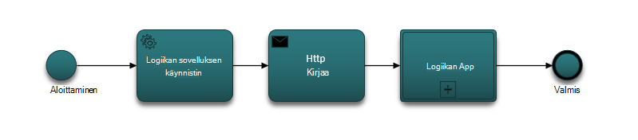

### <a name="lets-take-a-look-at-what-this-logic-app-does"></a>Voit tarkastella logiikan sovelluksen mitä
Jos tarkastelet seuraavassa kuvassa on useita vaiheita LogicApp työnkulun.

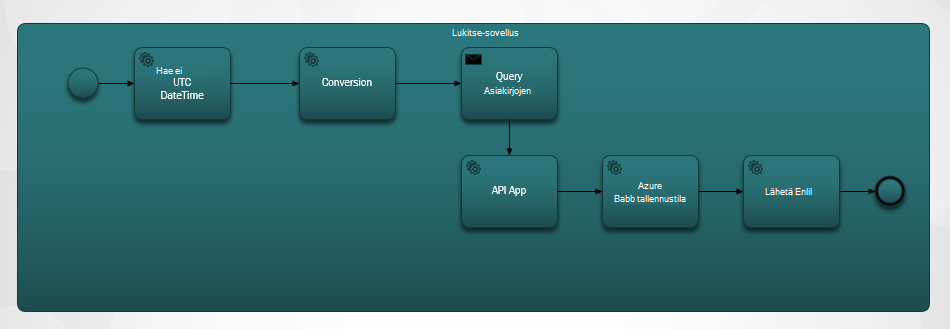

Vaiheet ovat seuraavat:

1. Sinun on hankittava nykyisen UTC-ja API-sovelluksesta.  Oletusarvo on edellisen tunnin.

2. UTC-ja muunnetaan Unix aikaleiman-muoto. Tämä on DocumentDB aikaleimat oletusmuoto.

3. KIRJATAAN API-sovellukseen, jota ei DocumentDB kyselyn. Arvoa käytetään kyselyssä.

    ```SQL
        SELECT * FROM Patients p WHERE (p._ts >= @unixTimeStamp)
    ```

    > [AZURE.NOTE] _Ts edustaa kaikkien DocumentDB resurssien aikaleima-metatiedot.

4. Jos määritettynä on löytyvät asiakirjat, vastauksen teksti lähetetään Azure-Blob-objektien tallennustilaan.

    > [AZURE.NOTE] Blob-objektien tallennustilaan edellyttää Azure-tallennustilan tilin. Sinun täytyy valmistella Azure Blob storage tili ja Lisää uusi Blob-objektien nimeltä potilaille. Lisätietoja on artikkelissa [tietoja Azure-tallennustilan asiakkaat](../storage/storage-create-storage-account.md) ja [Azure-Blob-säiliö käytön aloittaminen](../storage/storage-dotnet-how-to-use-blobs.md).

5. Lopuksi lähettää sähköpostiviestin, joka ilmoittaa vastaanottajalle löytyvät asiakirjat määrän. Jos tiedostoja ei löytynyt, sähköpostiviestin teksti olisi "0 asiakirjojen Found". 

Nyt kun olet luonut verrata työnkulun mitä, voit tarkastella siitä, miten voit ottaa.

### <a name="lets-start-with-the-main-logic-app"></a>Aloitetaan tärkeimmät logiikan-sovellus

Jos et ole tottunut logiikan sovellukset ja ne ovat käytettävissä [Azure Marketplacesta](https://portal.azure.com/)voit lukea lisää ne [mitä logiikan sovelluksia?](../app-service-logic/app-service-logic-what-are-logic-apps.md)

Kun luot uuden logiikan sovelluksen, sinua pyydetään **siitä, miten haluat aloittaa?**

Kun napsautat tekstiruutua, voit valita tapahtumat. Logiikan sovelluksen Valitse **Manuaalinen – kun HTTP-pyyntö on vastaanotettu** alla kuvatulla tavalla.

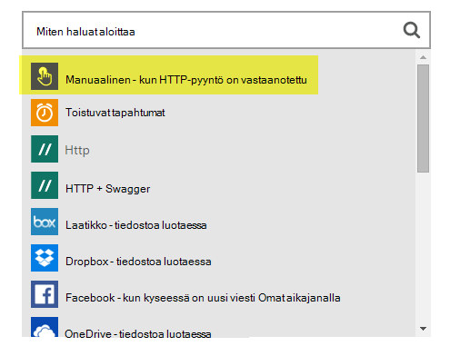

### <a name="design-view-of-your-completed-logic-app"></a>Valmiit logiikan sovelluksen rakennenäkymässä
Oletetaan, että siirtyä eteenpäin ja katsomalla logiikan-sovellus, joka on nimeltään DocDB valmiit rakennenäkymässä.


Logiikan sovelluksen suunnittelussa toiminnot muokattaessa on valita **tulostaa** HTTP-pyyntö tai edellinen toiminto alla sendMail toiminnon esitetyllä tavalla.

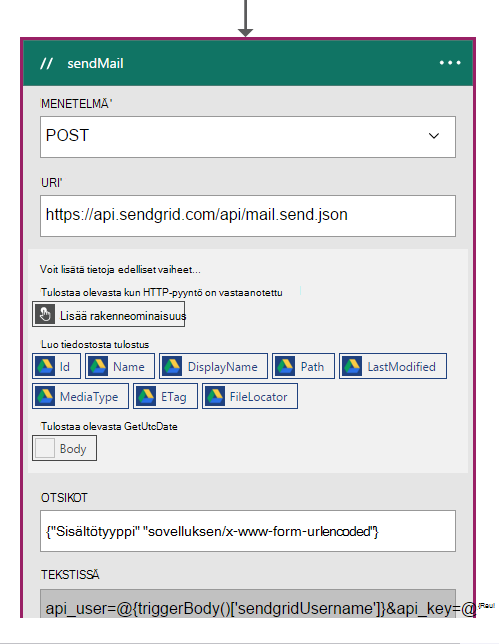

Ennen työnkulun kunkin toimintoa voit tehdä päätös; **Lisää toiminnon** tai **Lisää ehto** seuraavassa kuvassa esitetyllä tavalla.

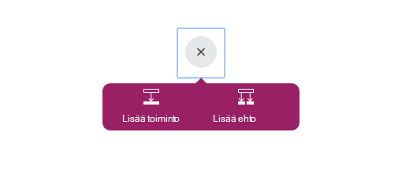

Jos valitset **Lisää ehto**, näyttöön tulee lomakkeen antamaan oman logiikan seuraavassa kuvassa esitetyllä tavalla.  Tämä on oikeastaan liiketoimintasääntö.  Jos valitset kentän sisällä, voit valita, parametrit valitsemalla Edellinen toiminto. Voit myös kirjoittaa suoraan arvot.

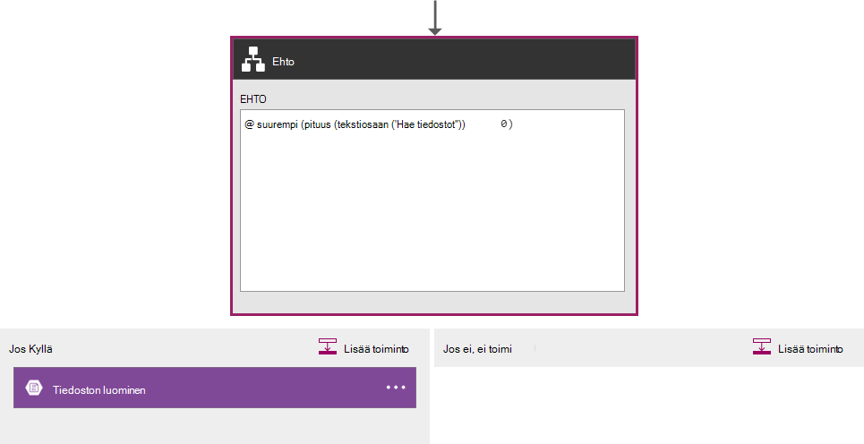

> [AZURE.NOTE] Käytössä on myös annettavien kaikki koodinäkymän ominaisuus.

Seuraavaksi tutustumme valmis logiikan sovelluksen koodi-näkymässä.  

```JSON
   
    "$schema": "https://schema.management.azure.com/providers/Microsoft.Logic/schemas/2015-08-01-preview/workflowdefinition.json#",
    "actions": {
        "Conversion": {
            "conditions": [
                {
                    "dependsOn": "GetUtcDate"
                }
            ],
            "inputs": {
                "method": "post",
                "queries": {
                    "currentdateTime": "@{body('GetUtcDate')}"
                },
                "uri": "https://docdbnotificationapi-debug.azurewebsites.net/api/Conversion"
            },
            "metadata": {
                "apiDefinitionUrl": "https://docdbnotificationapi-debug.azurewebsites.net/swagger/docs/v1",
                "swaggerSource": "custom"
            },
            "type": "Http"
        },
        "Createfile": {
            "conditions": [
                {
                    "expression": "@greater(length(body('GetDocuments')), 0)"
                },
                {
                    "dependsOn": "GetDocuments"
                }
            ],
            "inputs": {
                "body": "@body('GetDocuments')",
                "host": {
                    "api": {
                        "runtimeUrl": "https://logic-apis-westus.azure-apim.net/apim/azureblob"
                    },
                    "connection": {
                        "name": "@parameters('$connections')['azureblob']['connectionId']"
                    }
                },
                "method": "post",
                "path": "/datasets/default/files",
                "queries": {
                    "folderPath": "/patients",
                    "name": "Patient_@{guid()}.json"
                }
            },
            "type": "ApiConnection"
        },
        "GetDocuments": {
            "conditions": [
                {
                    "dependsOn": "Conversion"
                }
            ],
            "inputs": {
                "method": "post",
                "queries": {
                    "unixTimeStamp": "@body('Conversion')"
                },
                "uri": "https://docdbnotificationapi-debug.azurewebsites.net/api/Patient"
            },
            "metadata": {
                "apiDefinitionUrl": "https://docdbnotificationapi-debug.azurewebsites.net/swagger/docs/v1",
                "swaggerSource": "custom"
            },
            "type": "Http"
        },
        "GetUtcDate": {
            "conditions": [],
            "inputs": {
                "method": "get",
                "queries": {
                    "hoursBack": "@{int(triggerBody()['GetUtcDate_HoursBack'])}"
                },
                "uri": "https://docdbnotificationapi-debug.azurewebsites.net/api/Authorization"
            },
            "metadata": {
                "apiDefinitionUrl": "https://docdbnotificationapi-debug.azurewebsites.net/swagger/docs/v1",
                "swaggerSource": "custom"
            },
            "type": "Http"
        },
        "sendMail": {
            "conditions": [
                {
                    "dependsOn": "GetDocuments"
                }
            ],
            "inputs": {
                "body": "api_user=@{triggerBody()['sendgridUsername']}&api_key=@{triggerBody()['sendgridPassword']}&from=@{parameters('fromAddress')}&to=@{triggerBody()['EmailTo']}&subject=@{triggerBody()['Subject']}&text=@{int(length(body('GetDocuments')))} Documents Found",
                "headers": {
                    "Content-type": "application/x-www-form-urlencoded"
                },
                "method": "POST",
                "uri": "https://api.sendgrid.com/api/mail.send.json"
            },
            "type": "Http"
        }
    },
    "contentVersion": "1.0.0.0",
    "outputs": {
        "Results": {
            "type": "String",
            "value": "@{int(length(body('GetDocuments')))} Records Found"
        }
    },
    "parameters": {
        "$connections": {
            "defaultValue": {},
            "type": "Object"
        },
        "fromAddress": {
            "defaultValue": "user@msn.com",
            "type": "String"
        },
        "toAddress": {
            "defaultValue": "XXXXX@XXXXXXX.net",
            "type": "String"
        }
    },
    "triggers": {
        "manual": {
            "inputs": {
                "schema": {
                    "properties": {},
                    "required": [],
                    "type": "object"
                }
            },
            "type": "Manual"
        }
    
```

Jos et ole tuttuja eri osiin koodissa kuvaa, voit tarkastella [Logiikan App työnkulun Definition Language](http://aka.ms/logicappsdocs) -ohjeista.

Tämän työnkulun käytät [HTTP Webhook käynnistintä](https://sendgrid.com/blog/whats-webhook/). Jos tarkastelet yllä olevan koodin, näet seuraavan esimerkin parametrit.

```C#

    =@{triggerBody()['Subject']}

```

`triggerBody()` Edustaa parametreja, jotka sisältyvät REST-kirjaa REST API-sovelluksen logiikan tekstiosaan. `()['Subject']` Edustaa kenttä. Kaikki nämä parametrit muodostavat JSON muotoiltu tekstissä. 

> [AZURE.NOTE] Web-koukku käyttämällä voi olla täydet oikeudet otsikon ja tekstiosan käynnistimen pyynnön. Tämän sovelluksen haluat tekstin.

Kuten edellä mainittiin, voit käyttää suunnittelija parametrit tai tehdä koodi-näkymässä.
Jos teet koodi-näkymässä, valitse voit määrittää mitkä ominaisuudet vaativat arvon seuraava koodi näyte esitetyllä tavalla. 

```JSON

    "triggers": {
        "manual": {
            "inputs": {
            "schema": {
                "properties": {
            "Subject": {
                "type" : "String"   

            }
            },
                "required": [
            "Subject"
                 ],
                "type": "object"
            }
            },
            "type": "Manual"
        }
        }
```

Mitä olet tekemässä Luo JSON-rakenne, joka siirretään HTTP viestin tekstiosaan.
Kyselysäännön käynnistin, sinun on takaisinsoitto URL-osoite.  Opit luomaan sen myöhemmin opetusohjelman.  

## <a name="actions"></a>Toiminnot
Katsotaan, mitä kunkin logiikan Microsoftin sovellus-toiminto tekee.

### <a name="getutcdate"></a>GetUTCDate

**Suunnittelutyökalun näkymä**

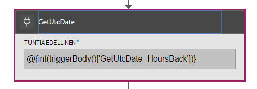

**Koodinäkymän**

```JSON

    "GetUtcDate": {
            "conditions": [],
            "inputs": {
            "method": "get",
            "queries": {
                "hoursBack": "@{int(triggerBody()['GetUtcDate_HoursBack'])}"
            },
            "uri": "https://docdbnotificationapi-debug.azurewebsites.net/api/Authorization"
            },
            "metadata": {
            "apiDefinitionUrl": "https://docdbnotificationapi-debug.azurewebsites.net/swagger/docs/v1"
            },
            "type": "Http"
        },

```

HTTP-toiminto tekee GET-toiminto.  Kutsuu API Sovelluksen GetUtcDate-menetelmää. Uri käyttää välitetty käynnistimen tekstiosaan "GetUtcDate_HoursBack"-ominaisuutta.  "GetUtcDate_HoursBack"-arvoksi on määritetty ensimmäisen logiikan-sovelluksessa. Opit lisää sovelluksen käynnistimen logiikan myöhemmin-opetusohjelman.

Tämä toiminto kutsuu API sovelluksen merkkijono päivämäärä UTC-aika-arvon.

#### <a name="operations"></a>Toiminnot

**Pyyntö**

```JSON

    {
        "uri": "https://docdbnotificationapi-debug.azurewebsites.net/api/Authorization",
        "method": "get",
        "queries": {
          "hoursBack": "24"
        }
    }

```

**Vastaus**

```JSON

    {
        "statusCode": 200,
        "headers": {
          "pragma": "no-cache",
          "cache-Control": "no-cache",
          "date": "Fri, 26 Feb 2016 15:47:33 GMT",
          "server": "Microsoft-IIS/8.0",
          "x-AspNet-Version": "4.0.30319",
          "x-Powered-By": "ASP.NET"
        },
        "body": "Fri, 15 Jan 2016 23:47:33 GMT"
    }

```

Seuraava vaihe on UTC-aika DateTime-arvon muuntaminen Unix-aikaleiman, joka on kaksinkertainen .NET-tyyppi.

### <a name="conversion"></a>Muuntaminen

##### <a name="designer-view"></a>Suunnittelutyökalun näkymä

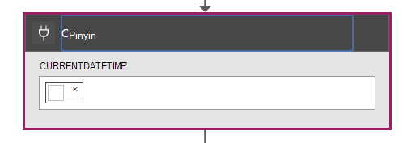

##### <a name="code-view"></a>Koodinäkymän

```JSON

    "Conversion": {
        "conditions": [
        {
            "dependsOn": "GetUtcDate"
        }
        ],
        "inputs": {
        "method": "post",
        "queries": {
            "currentDateTime": "@{body('GetUtcDate')}"
        },
        "uri": "https://docdbnotificationapi-debug.azurewebsites.net/api/Conversion"
        },
        "metadata": {
        "apiDefinitionUrl": "https://docdbnotificationapi-debug.azurewebsites.net/swagger/docs/v1"
        },
        "type": "Http"
    },

```

Tässä vaiheessa voit siirtää GetUTCDate palauttama arvo.  Tällä dependsOn ehto, mikä tarkoittaa, että GetUTCDate-toiminto on suoritettu. Muussa tapauksessa valitse tämä toiminto on ohitettu. 

Tämä toiminto kutsuu API sovelluksen käsittelemään muuntaminen.

#### <a name="operations"></a>Toiminnot

##### <a name="request"></a>Pyyntö

```JSON

    {
        "uri": "https://docdbnotificationapi-debug.azurewebsites.net/api/Conversion",
        "method": "post",
        "queries": {
        "currentDateTime": "Fri, 15 Jan 2016 23:47:33 GMT"
        }
    }   
```

##### <a name="response"></a>Vastaus

```JSON

    {
        "statusCode": 200,
        "headers": {
          "pragma": "no-cache",
          "cache-Control": "no-cache",
          "date": "Fri, 26 Feb 2016 15:47:33 GMT",
          "server": "Microsoft-IIS/8.0",
          "x-AspNet-Version": "4.0.30319",
          "x-Powered-By": "ASP.NET"
        },
        "body": 1452901653
    }
```

Seuraavan toiminnon käyt POST-toiminnon sekä API-sovellukseen.

### <a name="getdocuments"></a>GetDocuments 

##### <a name="designer-view"></a>Suunnittelutyökalun näkymä


##### <a name="code-view"></a>Koodinäkymän

```JSON

    "GetDocuments": {
        "conditions": [
        {
            "dependsOn": "Conversion"
        }
        ],
        "inputs": {
        "method": "post",
        "queries": {
            "unixTimeStamp": "@{body('Conversion')}"
        },
        "uri": "https://docdbnotificationapi-debug.azurewebsites.net/api/Patient"
        },
        "metadata": {
        "apiDefinitionUrl": "https://docdbnotificationapi-debug.azurewebsites.net/swagger/docs/v1"
        },
        "type": "Http"
    },

```

GetDocuments toiminnon aiot siirtää vastauksen tekstissä muunto-toiminto. Tämä on Uri-parametrin:

 
```C#

    unixTimeStamp=@{body('Conversion')}

```

QueryDocuments-toiminto tekee HTTP POST-toiminnon API-sovellukseen. 

Käytettävän menetelmän on **QueryForNewPatientDocuments**.

#### <a name="operations"></a>Toiminnot

##### <a name="request"></a>Pyyntö

```JSON

    {
        "uri": "https://docdbnotificationapi-debug.azurewebsites.net/api/Patient",
        "method": "post",
        "queries": {
        "unixTimeStamp": "1452901653"
        }
    }
```

##### <a name="response"></a>Vastaus

```JSON

    {
        "statusCode": 200,
        "headers": {
        "pragma": "no-cache",
        "cache-Control": "no-cache",
        "date": "Fri, 26 Feb 2016 15:47:35 GMT",
        "server": "Microsoft-IIS/8.0",
        "x-AspNet-Version": "4.0.30319",
        "x-Powered-By": "ASP.NET"
        },
        "body": [
        {
            "id": "xcda",
            "_rid": "vCYLAP2k6gAXAAAAAAAAAA==",
            "_self": "dbs/vCYLAA==/colls/vCYLAP2k6gA=/docs/vCYLAP2k6gAXAAAAAAAAAA==/",
            "_ts": 1454874620,
            "_etag": "\"00007d01-0000-0000-0000-56b79ffc0000\"",
            "resourceType": "Patient",
            "text": {
            "status": "generated",
            "div": "<div>\n      \n      <p>Henry Levin the 7th</p>\n    \n    </div>"
            },
            "identifier": [
            {
                "use": "usual",
                "type": {
                "coding": [
                    {
                    "system": "http://hl7.org/fhir/v2/0203",
                    "code": "MR"
                    }
                ]
                },
                "system": "urn:oid:2.16.840.1.113883.19.5",
                "value": "12345"
            }
            ],
            "active": true,
            "name": [
            {
                    "family": [
                        "Levin"
                    ],
                    "given": [
                        "Henry"
                    ]
                }
            ],
            "gender": "male",
            "birthDate": "1932-09-24",
            "managingOrganization": {
                "reference": "Organization/2.16.840.1.113883.19.5",
                "display": "Good Health Clinic"
            }
        },

```

Seuraava toiminto on tallentaa asiakirjat [Azure-blogi-tallennustilan](https://azure.microsoft.com/services/storage/). 

> [AZURE.NOTE] Blob-objektien tallennustilaan edellyttää Azure-tallennustilan tilin. Sinun täytyy valmistella Azure Blob storage tili ja Lisää uusi Blob-objektien nimeltä potilaille. Lisätietoja on artikkelissa [Azure-Blob-säiliö käytön aloittaminen](../storage/storage-dotnet-how-to-use-blobs.md).

### <a name="create-file"></a>Tiedoston luominen

##### <a name="designer-view"></a>Suunnittelutyökalun näkymä

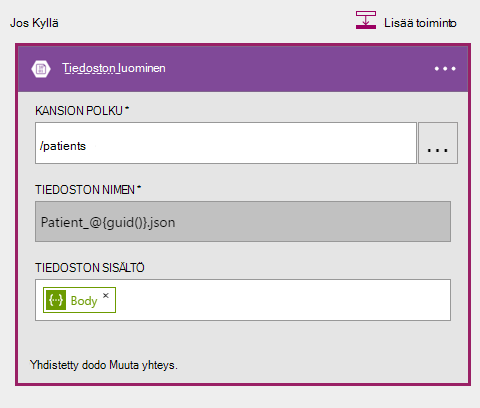

##### <a name="code-view"></a>Koodinäkymän

```JSON

    {
    "host": {
        "api": {
            "runtimeUrl": "https://logic-apis-westus.azure-apim.net/apim/azureblob"
        },
        "connection": {
            "name": "subscriptions/fxxxxxc079-4e5d-b002-xxxxxxxxxx/resourceGroups/Api-Default-Central-US/providers/Microsoft.Web/connections/azureblob"
        }
    },
    "method": "post",
    "path": "/datasets/default/files",
    "queries": {
        "folderPath": "/patients",
        "name": "Patient_17513174-e61d-4b56-88cb-5cf383db4430.json"
    },
    "body": [
        {
            "id": "xcda",
            "_rid": "vCYLAP2k6gAXAAAAAAAAAA==",
            "_self": "dbs/vCYLAA==/colls/vCYLAP2k6gA=/docs/vCYLAP2k6gAXAAAAAAAAAA==/",
            "_ts": 1454874620,
            "_etag": "\"00007d01-0000-0000-0000-56b79ffc0000\"",
            "resourceType": "Patient",
            "text": {
                "status": "generated",
                "div": "<div>\n      \n      <p>Henry Levin the 7th</p>\n    \n    </div>"
            },
            "identifier": [
                {
                    "use": "usual",
                    "type": {
                        "coding": [
                            {
                                "system": "http://hl7.org/fhir/v2/0203",
                                "code": "MR"
                            }
                        ]
                    },
                    "system": "urn:oid:2.16.840.1.113883.19.5",
                    "value": "12345"
                }
            ],
            "active": true,
            "name": [
                {
                    "family": [
                        "Levin"
                    ],
                    "given": [
                        "Henry"
                    ]
                }
            ],
            "gender": "male",
            "birthDate": "1932-09-24",
            "managingOrganization": {
                "reference": "Organization/2.16.840.1.113883.19.5",
                "display": "Good Health Clinic"
            }
        },

```

Koodi on luotu suunnittelija-toiminto. Sinun ei tarvitse Muokkaa koodia.

Jos et ole käyttänyt Azure-Blob-Ohjelmointirajapinta, katso [Azure-blob-säiliö API käytön aloittaminen](../connectors/connectors-create-api-azureblobstorage.md).

#### <a name="operations"></a>Toiminnot

##### <a name="request"></a>Pyyntö

```JSON

    "host": {
        "api": {
            "runtimeUrl": "https://logic-apis-westus.azure-apim.net/apim/azureblob"
        },
        "connection": {
            "name": "subscriptions/fxxxxxc079-4e5d-b002-xxxxxxxxxx/resourceGroups/Api-Default-Central-US/providers/Microsoft.Web/connections/azureblob"
        }
    },
    "method": "post",
    "path": "/datasets/default/files",
    "queries": {
        "folderPath": "/patients",
        "name": "Patient_17513174-e61d-4b56-88cb-5cf383db4430.json"
    },
    "body": [
        {
            "id": "xcda",
            "_rid": "vCYLAP2k6gAXAAAAAAAAAA==",
            "_self": "dbs/vCYLAA==/colls/vCYLAP2k6gA=/docs/vCYLAP2k6gAXAAAAAAAAAA==/",
            "_ts": 1454874620,
            "_etag": "\"00007d01-0000-0000-0000-56b79ffc0000\"",
            "resourceType": "Patient",
            "text": {
                "status": "generated",
                "div": "<div>\n      \n      <p>Henry Levin the 7th</p>\n    \n    </div>"
            },
            "identifier": [
                {
                    "use": "usual",
                    "type": {
                        "coding": [
                            {
                                "system": "http://hl7.org/fhir/v2/0203",
                                "code": "MR"
                            }
                        ]
                    },
                    "system": "urn:oid:2.16.840.1.113883.19.5",
                    "value": "12345"
                }
            ],
            "active": true,
            "name": [
                {
                    "family": [
                        "Levin"
                    ],
                    "given": [
                        "Henry"
                    ]
                }
            ],
            "gender": "male",
            "birthDate": "1932-09-24",
            "managingOrganization": {
                "reference": "Organization/2.16.840.1.113883.19.5",
                "display": "Good Health Clinic"
            }
        },….


```

##### <a name="response"></a>Vastaus

```JSON

    {
        "statusCode": 200,
        "headers": {
        "pragma": "no-cache",
        "x-ms-request-id": "2b2f7c57-2623-4d71-8e53-45c26b30ea9d",
        "cache-Control": "no-cache",
        "date": "Fri, 26 Feb 2016 15:47:36 GMT",
        "set-Cookie": "ARRAffinity=29e552cea7db23196f7ffa644003eaaf39bc8eb6dd555511f669d13ab7424faf;Path=/;Domain=127.0.0.1",
        "server": "Microsoft-HTTPAPI/2.0",
        "x-AspNet-Version": "4.0.30319",
        "x-Powered-By": "ASP.NET"
        },
        "body": {
        "Id": "0B0nBzHyMV-_NRGRDcDNMSFAxWFE",
        "Name": "Patient_47a2a0dc-640d-4f01-be38-c74690d085cb.json",
        "DisplayName": "Patient_47a2a0dc-640d-4f01-be38-c74690d085cb.json",
        "Path": "/Patient/Patient_47a2a0dc-640d-4f01-be38-c74690d085cb.json",
        "LastModified": "2016-02-26T15:47:36.215Z",
        "Size": 65647,
        "MediaType": "application/octet-stream",
        "IsFolder": false,
        "ETag": "\"c-g_a-1OtaH-kNQ4WBoXLp3Zv9s/MTQ1NjUwMTY1NjIxNQ\"",
        "FileLocator": "0B0nBzHyMV-_NRGRDcDNMSFAxWFE"
        }
    }
```

Viimeinen vaihe on Lähetä sähköposti-ilmoituksen

### <a name="sendemail"></a>LähetäSähköposti

##### <a name="designer-view"></a>Suunnittelutyökalun näkymä

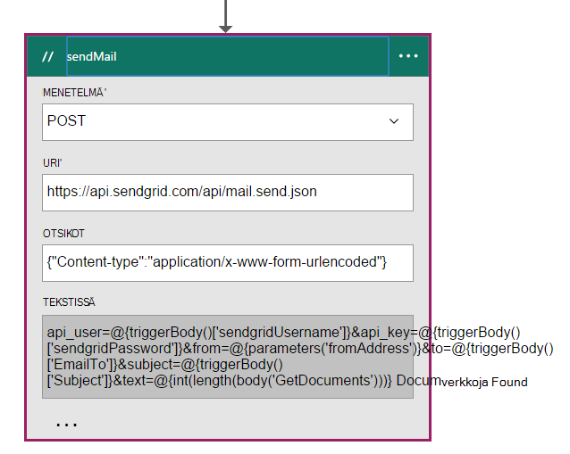

##### <a name="code-view"></a>Koodinäkymän

```JSON


    "sendMail": {
        "conditions": [
        {
            "dependsOn": "GetDocuments"
        }
        ],
        "inputs": {
        "body": "api_user=@{triggerBody()['sendgridUsername']}&api_key=@{triggerBody()['sendgridPassword']}&from=@{parameters('fromAddress')}&to=@{triggerBody()['EmailTo']}&subject=@{triggerBody()['Subject']}&text=@{int(length(body('GetDocuments')))} Documents Found",
        "headers": {
            "Content-type": "application/x-www-form-urlencoded"
        },
        "method": "POST",
        "uri": "https://api.sendgrid.com/api/mail.send.json"
        },
        "type": "Http"
    }
```

Tämän toiminnon avulla voit lähettää sähköposti-ilmoituksen.  Käytössäsi on [SendGrid](https://sendgrid.com/marketing/sendgrid-services?cvosrc=PPC.Bing.sendgrib&cvo_cid=SendGrid%20-%20US%20-%20Brand%20-%20&mc=Paid%20Search&mcd=BingAds&keyword=sendgrib&network=o&matchtype=e&mobile=&content=&search=1&utm_source=bing&utm_medium=cpc&utm_term=%5Bsendgrib%5D&utm_content=%21acq%21v2%2134335083397-8303227637-1649139544&utm_campaign=SendGrid+-+US+-+Brand+-+%28English%29).   

Tämä koodi on luotu mallin avulla logiikan sovelluksen ja SendGrid, joka on [101-logiikkaa-sovelluksen-sendgrid Github säilöön](https://github.com/Azure/azure-quickstart-templates/tree/master/101-logic-app-sendgrid).
 
HTTP-toiminto on VIESTIIN. 

Todennus-parametrit on käynnistimen ominaisuuksia

```JSON

    },
        "sendgridPassword": {
             "type": "SecureString"
         },
         "sendgridUsername": {
            "type": "String"
         }

        In addition, other parameters are static values set in the Parameters section of the Logic App. These are:
        },
        "toAddress": {
            "defaultValue": "XXXX@XXXX.com",
            "type": "String"
        },
        "fromAddress": {
            "defaultValue": "XXX@msn.com",
            "type": "String"
        },
        "emailBody": {
            "defaultValue": "@{string(concat(int(length(actions('QueryDocuments').outputs.body)) Records Found),'/n', actions('QueryDocuments').outputs.body)}",
            "type": "String"
        },

```

EmailBody on ketjuttaa palauttamien kysely, joka voi olla "0" tai enemmän mukana, "tietuetta löydy-tiedostojen määrä. Muut parametrit on määritetty käynnistimen parametreista.

Tämä toiminto määräytyy **GetDocuments** -toiminto.

#### <a name="operations"></a>Toiminnot

##### <a name="request"></a>Pyyntö
```JSON

    {
        "uri": "https://api.sendgrid.com/api/mail.send.json",
        "method": "POST",
        "headers": {
        "Content-type": "application/x-www-form-urlencoded"
        },
        "body": "api_user=azureuser@azure.com&api_key=Biz@Talk&from=user@msn.com&to=XXXX@XXXX.com&subject=New Patients&text=37 Documents Found"
    }

```

##### <a name="response"></a>Vastaus

```JSON

    {
        "statusCode": 200,
        "headers": {
        "connection": "keep-alive",
        "x-Frame-Options": "DENY,DENY",
        "access-Control-Allow-Origin": "https://sendgrid.com",
        "date": "Fri, 26 Feb 2016 15:47:35 GMT",
        "server": "nginx"
        },
        "body": {
        "message": "success"
        }
    }
```

Lopuksi haluat näe tulokset logiikan sovellukset Azure-portaalissa. Saadakseen ne parametrin lisääminen tulostus-osassa.


```JSON

    "outputs": {
        "Results": {
            "type": "String",
            "value": "@{int(length(actions('QueryDocuments').outputs.body))} Records Found"
        }

```

Palauttaa arvon saman arvon, joka lähetetään sähköpostiviestin teksti. Seuraavassa kuvassa on esimerkki, jossa "29 tietuetta löydy".

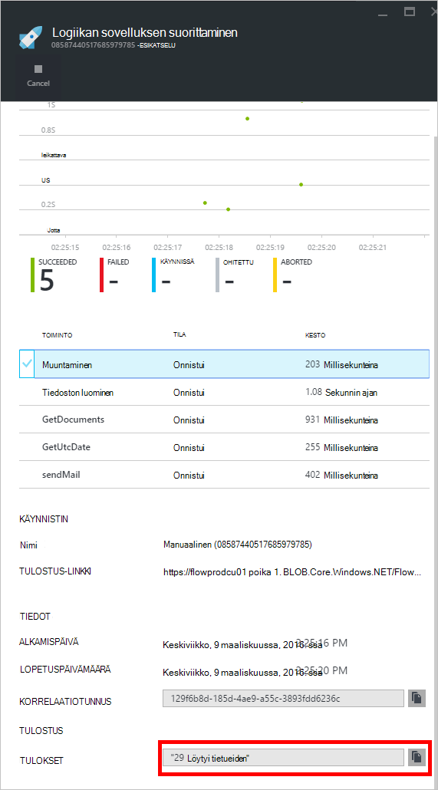

## <a name="metrics"></a>Arvot
Voit määrittää tärkeimmät logiikan sovelluksen portaalissa seuranta. Voit tarkastella Suorita viive ja muita tapahtumia, kuten seuraavassa kuvassa näytetään.

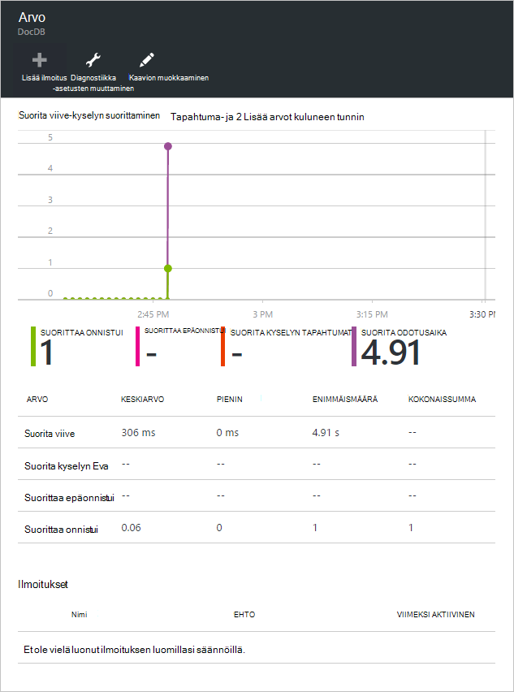

## <a name="docdb-trigger"></a>DocDb käynnistin

Logiikan tätä sovellusta ei käynnistin, joka käynnistää työnkulun tärkeimmät logiikan-sovellukseen.

Seuraavassa kuvassa on suunnittelija-näkymä.

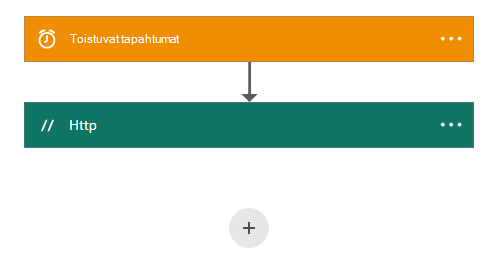

```JSON

    {
        "$schema": "https://schema.management.azure.com/providers/Microsoft.Logic/schemas/2015-08-01-preview/workflowdefinition.json#",
        "actions": {
        "Http": {
            "conditions": [],
            "inputs": {
            "body": {
                "EmailTo": "XXXXXX@XXXXX.net",
                "GetUtcDate_HoursBack": "24",
                "Subject": "New Patients",
                "sendgridPassword": "********",
                "sendgridUsername": "azureuser@azure.com"
            },
            "method": "POST",
            "uri": "https://prod-01.westus.logic.azure.com:443/workflows/12a1de57e48845bc9ce7a247dfabc887/triggers/manual/run?api-version=2015-08-01-preview&sp=%2Ftriggers%2Fmanual%2Frun&sv=1.0&sig=ObTlihr529ATIuvuG-dhxOgBL4JZjItrvPQ8PV6973c"
            },
            "type": "Http"
        }
        },
        "contentVersion": "1.0.0.0",
        "outputs": {
        "Results": {
            "type": "String",
            "value": "@{body('Http')['status']}"
        }
        },
        "parameters": {},
        "triggers": {
        "recurrence": {
            "recurrence": {
            "frequency": "Hour",
            "interval": 24
            },
            "type": "Recurrence"
        }
        }
    }

```

Käynnistin on määritetty toistuminen 24 tuntia. Toiminto on HTTP-viestin, joka käyttää tärkeimmät logiikan sovelluksen takaisinsoitto URL-osoite. Tekstissä esiintyy, jotka on määritetty rakenteessa JSON parametrit. 

#### <a name="operations"></a>Toiminnot

##### <a name="request"></a>Pyyntö

```JSON

    {
        "uri": "https://prod-01.westus.logic.azure.com:443/workflows/12a1de57e48845bc9ce7a247dfabc887/triggers/manual/run?api-version=2015-08-01-preview&sp=%2Ftriggers%2Fmanual%2Frun&sv=1.0&sig=ObTlihr529ATIuvuG-dhxOgBL4JZjItrvPQ8PV6973c",
        "method": "POST",
        "body": {
        "EmailTo": "XXXXXX@XXXXX.net",
        "GetUtcDate_HoursBack": "24",
        "Subject": "New Patients",
        "sendgridPassword": "********",
        "sendgridUsername": "azureuser@azure.com"
        }
    }

```

##### <a name="response"></a>Vastaus

```JSON

    {
        "statusCode": 202,
        "headers": {
        "pragma": "no-cache",
        "x-ms-ratelimit-remaining-workflow-writes": "7486",
        "x-ms-ratelimit-burst-remaining-workflow-writes": "1248",
        "x-ms-request-id": "westus:2d440a39-8ba5-4a9c-92a6-f959b8d2357f",
        "cache-Control": "no-cache",
        "date": "Thu, 25 Feb 2016 21:01:06 GMT"
        }
    }
```

Nyt katsotaan API-sovellus.

## <a name="docdbnotificationapi"></a>DocDBNotificationApi

Vaikka sovelluksessa useita työvaiheita, vain aiot käyttää kolme.

* GetUtcDate
* ConvertToTimeStamp
* QueryForNewPatientDocuments

### <a name="docdbnotificationapi-operations"></a>DocDBNotificationApi toiminnot
Voit tarkastella Swagger käyttöohjeista

> [AZURE.NOTE] Jotta voit soittaa toimintojen ulkoisesti, sinun on lisättävä CORS, sallittu arvo origin "*" (ilman lainausmerkkejä) asetuksia-Ohjelmointirajapinnan sovelluksesi seuraavassa kuvassa esitetyllä tavalla.

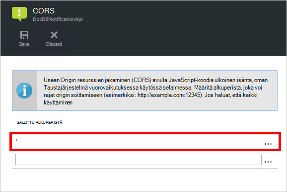

#### <a name="getutcdate"></a>GetUtcDate

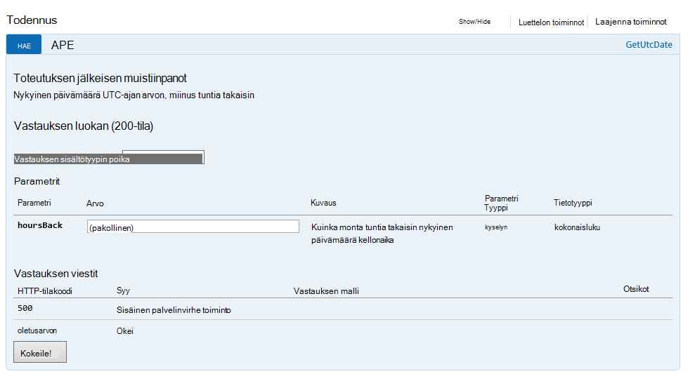

#### <a name="converttotimestamp"></a>ConvertToTimeStamp

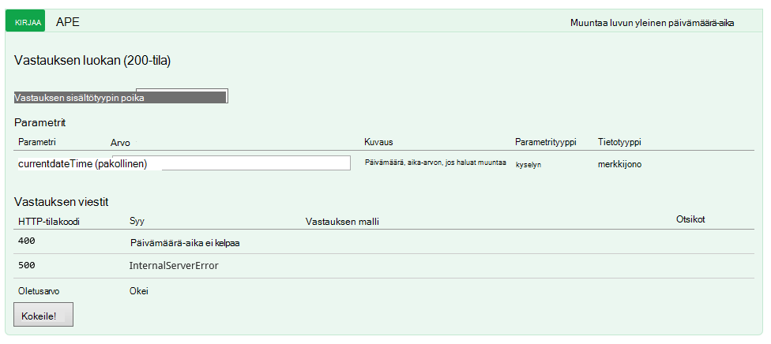

#### <a name="queryfornewpatientdocuments"></a>QueryForNewPatientDocuments

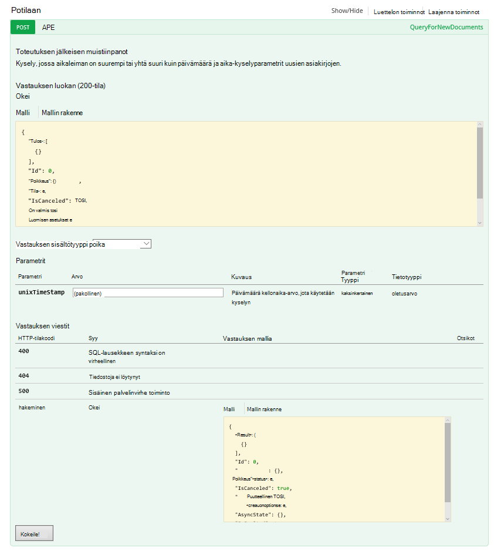

Voit tarkastella koodia takana tätä toimintoa.

#### <a name="getutcdate"></a>GetUtcDate

```C#

    /// <summary>
    /// Gets the current UTC Date value
    /// </summary>
    /// <returns></returns>
    [H ttpGet]
    [Metadata("GetUtcDate", "Gets the current UTC Date value minus the Hours Back")]
    [SwaggerOperation("GetUtcDate")]
    [SwaggerResponse(HttpStatusCode.OK, type: typeof (string))]
    [SwaggerResponse(HttpStatusCode.InternalServerError, "Internal Server Operation Error")]
    public string GetUtcDate(
       [Metadata("Hours Back", "How many hours back from the current Date Time")] int hoursBack)
    {


        return DateTime.UtcNow.AddHours(-hoursBack).ToString("r");
    }
```

Tämä toiminto palauttaa funktio palauttaa vain nykyisen UTC-ja miinus HoursBack-arvo.

#### <a name="converttotimestamp"></a>ConvertToTimeStamp

``` C#

        /// <summary>
        ///     Converts DateTime to double
        /// </summary>
        /// <param name="currentdateTime"></param>
        /// <returns></returns>
        [Metadata("Converts Universal DateTime to number")]
        [SwaggerResponse(HttpStatusCode.OK, null, typeof (double))]
        [SwaggerResponse(HttpStatusCode.BadRequest, "DateTime is invalid")]
        [SwaggerResponse(HttpStatusCode.InternalServerError)]
        [SwaggerOperation(nameof(ConvertToTimestamp))]
        public double ConvertToTimestamp(
            [Metadata("currentdateTime", "DateTime value to convert")] string currentdateTime)
        {
            double result;

            try
            {
                var uncoded = HttpContext.Current.Server.UrlDecode(currentdateTime);

                var newDateTime = DateTime.Parse(uncoded);
                //create Timespan by subtracting the value provided from the Unix Epoch
                var span = newDateTime - new DateTime(1970, 1, 1, 0, 0, 0, 0).ToLocalTime();

                //return the total seconds (which is a UNIX timestamp)
                result = span.TotalSeconds;
            }
            catch (Exception e)
            {
                throw new Exception("unable to convert to Timestamp", e.InnerException);
            }

            return result;
        }

```

Tämä toiminto muuntaa vastauksen GetUtcDate toiminnon double-arvoa.

#### <a name="queryfornewpatientdocuments"></a>QueryForNewPatientDocuments

```C#

        /// <summary>
        ///     Query for new Patient Documents
        /// </summary>
        /// <param name="unixTimeStamp"></param>
        /// <returns>IList</returns>
        [Metadata("QueryForNewDocuments",
            "Query for new Documents where the Timestamp is greater than or equal to the DateTime value in the query parameters."
            )]
        [SwaggerOperation("QueryForNewDocuments")]
        [SwaggerResponse(HttpStatusCode.OK, type: typeof (Task<IList<Document>>))]
        [SwaggerResponse(HttpStatusCode.BadRequest, "The syntax of the SQL Statement is incorrect")]
        [SwaggerResponse(HttpStatusCode.NotFound, "No Documents were found")]
        [SwaggerResponse(HttpStatusCode.InternalServerError, "Internal Server Operation Error")]
        // ReSharper disable once ConsiderUsingAsyncSuffix
        public IList<Document> QueryForNewPatientDocuments(
            [Metadata("UnixTimeStamp", "The DateTime value used to search from")] double unixTimeStamp)
        {
            var context = new DocumentDbContext();
            var filterQuery = string.Format(InvariantCulture, "SELECT * FROM Patient p WHERE p._ts >=  {0}",
                unixTimeStamp);
            var options = new FeedOptions {MaxItemCount = -1};


            var collectionLink = UriFactory.CreateDocumentCollectionUri(DocumentDbContext.DatabaseId,
                DocumentDbContext.CollectionId);

            var response =
                context.Client.CreateDocumentQuery<Document>(collectionLink, filterQuery, options).AsEnumerable();

            return response.ToList();
    }

```

Tämä toiminto käyttää [DocumentDB.NET SDK](documentdb-sdk-dotnet.md) asiakirjan kyselyn luominen. 

```C#
     CreateDocumentQuery<Document>(collectionLink, filterQuery, options).AsEnumerable();
```

ConvertToTimeStamp-toiminto (unixTimeStamp) vastaus on ohitettu. Toiminto palauttaa tiedostot-luettelon `IList<Document>`.

Aiemmin puhuimme CallbackURL. Jotta voit aloittaa työnkulun tärkeimmät logiikan sovelluksen, sinun on Soita CallbackURL avulla.

## <a name="callbackurl"></a>CallbackURL

Aloita, sinun on kohdassa Azure AD-tunnuksen.  Voi olla vaikea saada tunnuksen. Helppo tapa etsimäni ja Jeff Hollan, joka on Azure logiikan sovelluksen-Järjestelmänhallinnan suositellaan [armclient](http://blog.davidebbo.com/2015/01/azure-resource-manager-client.html) käyttäminen PowerShell.  Voit asentaa sen jälkeen ohjeita.

Haluat käyttää toiminnot ovat kirjautuminen ja ARM-Ohjelmointirajapinnan kutsu.
 
Kirjaudu sisään: Voit käyttää samoja tunnistetietoja Azure-portaaliin kirjauduttaessa. 

Soita ARM Api-toiminto on luovat oman CallBackURL haluamasi vaihtoehto.

PowerShellin voit kutsua sitä seuraavasti:  

```powershell

    ArmClient.exe post https://management.azure.com/subscriptions/[YOUR SUBSCRIPTION ID/resourcegroups/[YOUR RESOURCE GROUP]/providers/Microsoft.Logic/workflows/[YOUR LOGIC APP NAME/triggers/manual/listcallbackurl?api-version=2015-08-01-preview

```

Tuloksen pitäisi näyttää tältä:

```powershell

    https://prod-02.westus.logic.azure.com:443/workflows/12a1de57e48845bc9ce7a247dfabc887/triggers/manual/run?api-version=2015-08-01-prevaiew&sp=%2Ftriggers%2Fmanual%2Frun&sv=1.0&sig=XXXXXXXXXXXXXXXXXXX

```

Voit esimerkiksi [postman](http://www.getpostman.com/) työkalun testaamiseen tärkeimmät logiikan App seuraavassa kuvassa esitetyllä tavalla.

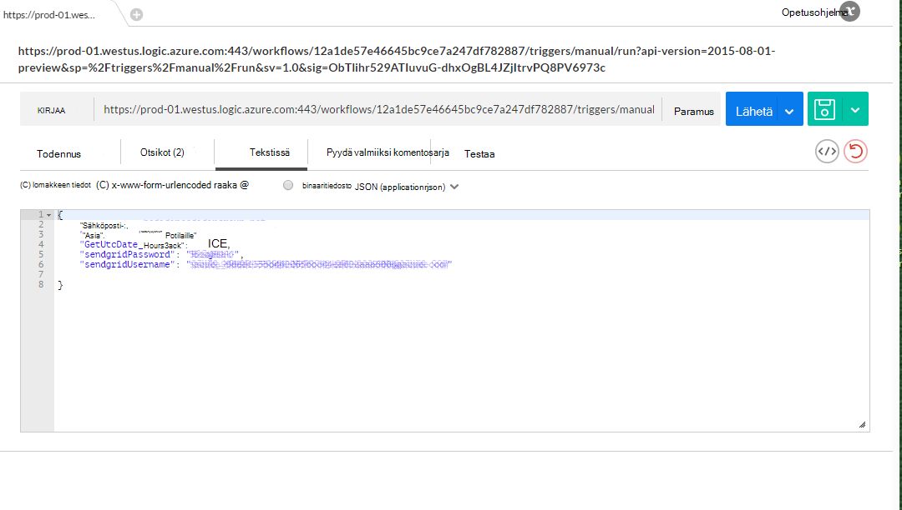

Seuraavassa taulukossa on lueteltu, jotka muodostavat jotakin DocDB käynnistimen logiikan sovelluksen käynnistimen parametrit.

Parametri | Kuvaus 
--- | --- 
GetUtcDate_HoursBack | Asettaa haun alkamispäivä tuntimäärä
sendgridUsername | Asettaa haun alkamispäivä tuntimäärä
sendgridPassword | Lähetä ruudukon sähköpostin käyttäjänimi
Sähköpostina | Sähköpostiosoite, joka vastaanottaa sähköposti-ilmoituksen
Aihe | Sähköpostin aihe

## <a name="viewing-the-patient-data-in-the-azure-blob-service"></a>Azure-Blob-palvelussa Potilas tietojen tarkasteleminen

Siirry Azure-tallennustilan tilin ja valitse BLOB palvelut, kuten seuraavassa kuvassa.

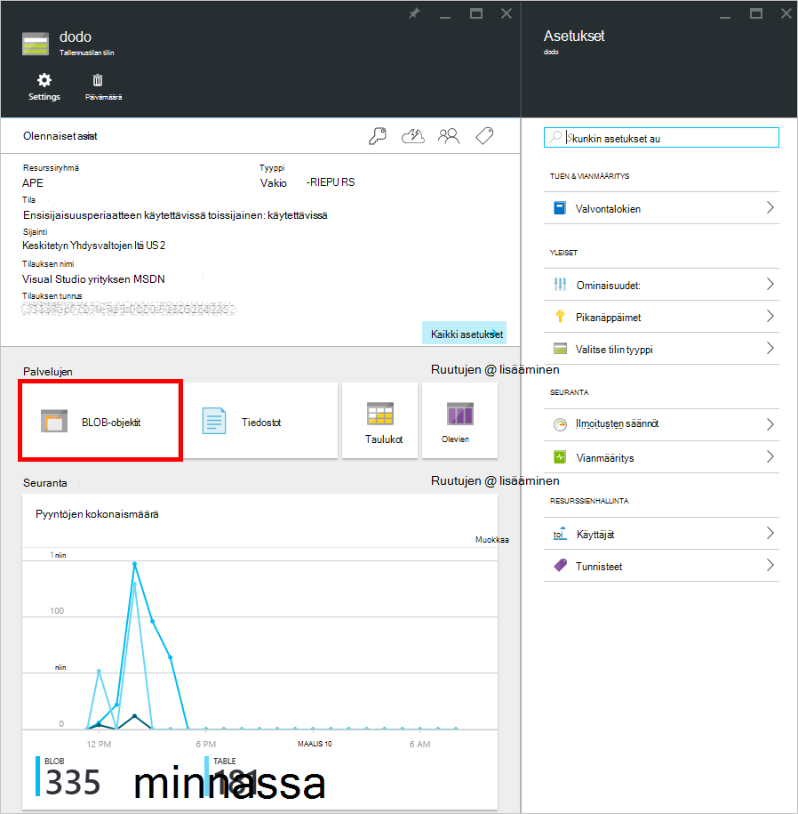 

Sinulla voi tarkastella Potilas Blob-objektien tietoja alla kuvatulla tavalla.

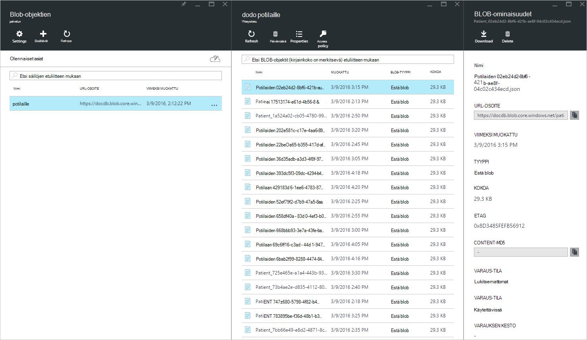


## <a name="summary"></a>Yhteenveto

Valitse tätä vaiheittaista oppinut seuraavasti:

* On mahdollista toteuttavien ilmoitukset DocumentDB.
* Logiikan-sovellusten avulla voit automatisoida prosessin.
* Logiikan-sovellusten avulla voit pienentää aikana sovelluksen kuluvaa aikaa.
* HTTP-protokollan avulla voit helposti tarjoaman API-sovelluksen sisällä logiikan-sovellus.
* Voit helposti luoda CallBackURL, joka korvaa HTTP-kuuntelutoiminnon.
* Voit helposti luoda mukautettuja työnkulkuja logiikan sovellusten suunnittelussa.

Avain on Suunnittele ja työnkulun malli.

## <a name="next-steps"></a>Seuraavat vaiheet
Lataa ja käyttää annettujen [Github](https://github.com/HEDIDIN/DocDbNotifications)logiikan sovelluksen koodia. Kutsutaan sovelluksen luomiseen ja lähettää repo muutokset. 

Lisätietoja DocumentDB, tutustu [Oppimispolkuun](https://azure.microsoft.com/documentation/learning-paths/documentdb/).
