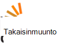

<properties
  pageTitle="DocumentDB yhteisön & uutisia | Microsoft Azure"
  description="Muodosta yhteyksiä ja esittele työsi tarkentaminen taitosi Azure DocumentDB-yhteisöön liittyminen."
  services="documentdb"
  documentationCenter=""
  authors="aliuy"
  manager="johnmac"
  editor="mimig"/>

<tags
  ms.service="documentdb"
  ms.devlang="na"
  ms.topic="article"
  ms.tgt_pltfrm="na"
  ms.workload="data-services"
  ms.date="09/26/2016"
  ms.author="andrl"/>

# Yhteisöportaali

## Yhteisön spotti

Anna meidän edistää projektin! Näytä awesome projektin kanssa DocumentDB käsittelet ja autamme oman genius Jaa maailman kanssa. Lähetä projektin, Lähetä meille sähköpostia osoitteessa: [askdocdb@microsoft.com](mailto:askdocdb@microsoft.com).

### documentdb-lumenize

*Larry Maccherone mukaan*

Koosteet (Ryhmittelyperuste-Pivot-taulukon ja N Kolmiulotteinen kuutio) ja ajoittaminen sarjan muunnoksia kuin DocumentDB tallennettuja toimintosarjoja.

Kuittaa tiedostoa ulos [Github](https://github.com/lmaccherone/documentdb-lumenize) ja [npm](https://www.npmjs.com/package/lumenize).

### DocumentDB Studio

*Ming Liu mukaan*

Asiakkaan hallinnan tarkastelu/explorer Microsoft Azure DocumentDB palvelun.

Kuittaa tiedostoa ulos, [Github](https://github.com/mingaliu/DocumentDBStudio).

### DoQmentDB

*Ariel Mashraki mukaan*

DoQmentDB on Node.js promise-pohjaisen asiakas-, joka sisältää MongoDB kaltaisessa kerroksen DocumentDB päälle.

Kuittaa tiedostoa ulos [Github](https://github.com/a8m/doqmentdb) ja [npm](https://www.npmjs.com/package/doqmentdb).

### DocumentDB swagger REST-Ohjelmointirajapinnalla

*Howard Edidin mukaan*

DocumentDB REST API Swagger tiedosto, jossa voit helposti käyttöön API sovelluksena.

Kuittaa tiedostoa ulos, [Github](https://github.com/HEDIDIN/DocumentDB-REST/tree/master/DocumentDBRestApi).

### Sujuva documentdb kuin laajennus

*Yoichi Kawasaki mukaan*

Sujuva documentdb kuin laajennus on Fluentd-laajennuksen Azure DocumentDB tulostetaan.

Kuittaa tiedostoa ulos [Github](https://github.com/yokawasa/fluent-plugin-documentdb) ja [rubygems](https://rubygems.org/gems/fluent-plugin-documentdb).

*Etsi lisää Avaa lähde [GitHub](https://github.com/search?p=4&q=documentdb&type=Repositories)DocumentDB projektit.*

## Uutiset, blogit ja artikkelit

Voit pitää ajan tasalla uusimmista DocumentDB ja ominaisuuksilla kanssa seuraavat [blogi](https://azure.microsoft.com/blog/tag/documentdb/).

**Yhteisön kirjoituksia:**

- [**Siirtyminen sosiaalisen kanssa DocumentDB**](https://blogs.msdn.microsoft.com/mvpawardprogram/2016/03/15/going-social-with-documentdb/) - *Matias Quarantaas mukaan*

- [**UWP ja Azure App palvelujen DocumentDB isoa: valokuvien jakamiseen sovelluksen**](https://blogs.windows.com/buildingapps/2016/03/17/uwp-azure-app-services-and-documentdb-soup-a-photo-sharing-app/) - *Eric Langland mukaan*

- [**Uusia tai muutettuja DocumentDB resurssien logiikan sovellusten ilmoitukset**](documentdb-change-notification.md) - *Howard Edidin mukaan*

- [**Keräätkö lokien Azure DocumentDB käyttämällä sujuva documentdb kuin laajennuksen**](http://unofficialism.info/posts/collecting-logs-into-azure-documentdb-using-fluent-plugin-documentdb/) - *Yoichi Kawasaki mukaan*

- [**DocumentDB uusia, osa 1/2 – teoria**](https://peterintheazuresky.wordpress.com/2016/02/19/documentdb-revisited-part-12-the-theory/) - *Peter Mannerhult mukaan*

- [**Mitä perinteisen Wordin kanssa ja Azure's DocumentDB tietoja hate**](http://blog.falafel.com/4-what-to-love-and-hate-about-azures-documentdb/) - *George Saadeh mukaan*

- [**Azure DocumentDB palvelinpuolen komentosarjan**](https://www.simple-talk.com/cloud/cloud-data/azure-documentdb-server-side-scripting/) - *Robert Sheldon mukaan*

- [**DocumentDB käyttäminen tietojen allas Azure Stream analysoinnissa**](http://janatdevelopment.com/2015/12/11/documentdb-as-a-data-sink-for-azure-stream-analytics/?utm_source=twitterfeed&utm_medium=twitter) - *Jan Hentschel mukaan*

- [**Azure DocumentDB tuotannon!** ](http://blog.nexapp.ca/2015/11/30/azure-documentdb-in-production/)  -  *Alexandre Walsh ja Marc Olivier Duval*

- [**Azure haun Indeksoijilla – DocumentDB kyselyt (Espanja)**](http://www.ealsur.com.ar/wp/index.php/2015/11/19/azure-search-indexers-documentdb-queries/) - *Matthias Quaranta mukaan*

- [**Azure DocumentDB SQL-kyselyn perusteet (japani)**](http://beachside.hatenablog.com/entry/2015/12/06/000045) - *Atsushi Yokohama mukaan*

- [**Arvopisteiden - Aurelia täyttää DocumentDB: Matchmaker matkan**](https://msdn.microsoft.com/magazine/mt620011.aspx) - *Julie Lerman mukaan*

- [**Infrastruktuurin koodi ja jatkuva Node.js + Azure DocumentDB-ratkaisun käyttöönotto**](http://www.talmeida.net/blog/2015/10/26/infrastructure-as-code-and-continuous-deployment-of-a-nodejs-azure-documentdb-solution) - *Thiago Almedia mukaan*

- [**Miksi DocumentDb on hyvä Business järkevää joitakin projektien**](http://www.iquestllc.com/blogs/read/405/why-documentdb-makes-good-business-sense-for-some-projects) - *Samuel Uresin mukaan*

- [**Azure DocumentDB kehittäminen siirtäminen eteenpäin – asiakas-luokka (1 / 2) kehittäminen (japani)**](http://beachside.hatenablog.com/entry/2015/10/01/202734) - *Atsushi Yokohama mukaan*

- [**Asiat on hyvä tietää käytettäessä Azure DocumentDB (japani)**](http://beachside.hatenablog.com/entry/2015/10/01/202734) - *Atsushi Yokohama mukaan*

- [**Käsittely Azure DocumentDB RequestRateTooLarge virheet ja suorituskyvyn testaaminen**](http://blogs.msdn.com/b/bigdatasupport/archive/2015/09/02/dealing-with-requestratetoolarge-errors-in-azure-documentdb-and-testing-documentdb-performance.aspx) - *Azim Uddin mukaan*

- [**Arvopisteiden – yleiskuvaus Microsoft Azure DocumentDB**](https://msdn.microsoft.com/magazine/mt147238.aspx) - *Julie Lerman mukaan*

- [**Käyttäminen DocumentDB F #**](https://jamessdixon.wordpress.com/2014/12/30/using-documentdb-with-f/) - *Janne Dixon mukaan*

- [**Analysoinnissa sovelluksen kirjautuu kanssa DocumentDB**](http://vincentlauzon.com/2015/09/06/analysing-application-logs-with-documentdb/) - *Vincent Philippe Lauzon mukaan*

- [**Azure DocumentDB – aika varmuuskopiot vaiheessa**](http://softwarejuancarlos.com/2015/09/06/azure-documentdb-point-in-time-backups/) - *Juan Teemu Sanchez mukaan*

*Onko sinulla blogimerkintä, koodi malli tai Esimerkkitapaus haluat jakaa? [Kerro meille, mistä](mailto:askdocdb@microsoft.com)!*

## Tapahtuma- ja tallenteet

### Uusimpia ja tulevista tapahtumista

| Tapahtuman nimi                                                                                                                 | Esittäjän                                                     | Sijainti             | Päivämäärä                     | Hashtag |
| -------------------------------------------------------------------------------------------------------------------------- | ----------------------------------------------------------- | -------------------- | ------------------------ | ------- |
| [Ignite 2016](https://myignite.microsoft.com/sessions?q=documentdb)  [Esityksen: Ota käyttöön digitaalisen A.C.I.D tekemäänsä tehokkuutta käyttäminen Joseph Sirosh muunnos](https://myignite.microsoft.com/sessions/34953)  [Istunnon: Azure DocumentDB valtaviin tasolla: asiakkaan onnistumisen ja tyylien kuvioita Syam Kumar Nair ja Andrew'lle Liu](https://myignite.microsoft.com/sessions/3066)  [Istunnon: Node.js ja DocumentDB ja käyttää Lassila IoT resurssien hallinta](https://myignite.microsoft.com/sessions/39704)  [Istunnon: Luoda entistä tehokkaammin ja skaalattava sovelluksia Microsoft Azure-tietokannan Services käyttäminen Tara Jana ja Moshe Gutman](https://myignite.microsoft.com/sessions/2633)| Andrew'lle Liu Syam Kumar Nair ja Tara Jana | ATLANTA GA | Syyskuussa 26 – 30-2016 | [#MSIgnite](https://twitter.com/MS_Ignite) |
| [Meetup osoitteessa Ignite: DocumentDB: suurissa sovellusten lisäominaisuudet](http://www.meetup.com/Azure-in-the-ATL/events/234252070/) | Andrew'lle Liu Syam Kumar Nair |  ATLANTA GA | 27 syyskuussa 2016 | [#MSIgnite](https://twitter.com/MS_Ignite)[@FlatironCity](https://twitter.com/FlatironCity) |
| [Strata + Hadoop Maailman](http://conferences.oreilly.com/strata/hadoop-big-data-ny/?cmp=kn-data-confreg-home-stny16_bing_branded) | Tervetuloa käy Microsoftin booth! | New York, NY | Syyskuussa 26 – 29-2016 | [#StrataConf](https://twitter.com/strataconf) |
| [Pääoman kaupunki .NET käyttäjät-ryhmä](http://www.meetup.com/tally-dot-net/events/233768568/) | Santosh Hari | Tallahassee, FL | 3 marraskuun 2016 | puuttuu |

*Puhumisen tai isännöinnin tapahtuman? [Kerro meille,](mailto:askdocdb@microsoft.com) mistä apua!*

### Edellinen tapahtuma- ja tallenteet

| Tapahtuman nimi                                                                                                                 | Esittäjän                                                     | Sijainti             | Päivämäärä                   | Tallentaminen |
| -------------------------------------------------------------------------------------------------------------------------- | ----------------------------------------------------------- | -------------------- | ---------------------- | --------- |
| [DevTeach](http://devteach.com/) | Esko Cenerelli  | Montrealin, joten | Heinäkuussa 4-8-2016 | [NoSQL, ei ole ongelma Azure DocumentDB käyttäminen](http://www.slideshare.net/KenCenerelli) |
| [Integrointi ja IoT](http://www.btug.be/events) | Eldert Grootenboer | Kontich, Belgia | 30 kesäkuussa 2016 | puuttuu |
| [MongoDB maailman 2016](https://www.mongodb.com/world16) | Kirill Gavrylyuk | New York, New Yorkissa | Kesäkuussa 28 – 29-2016 | puuttuu |
| [Integrointi käyttäjäryhmä](http://www.integrationusergroup.com/do-logic-apps-support-error-handling/) | Howard s Edidin | Web-lähetystä | 2016 20 kesäkuussa | [Logiikan-sovellukset tukevat Virheenkäsittely](http://www.integrationusergroup.com/do-logic-apps-support-error-handling/) |
| [Meetup: UK Azure käyttäjäryhmä](http://www.meetup.com/UKAzureUserGroup/events/229673468/)| Andrew'lle Liu  | Lontoon, UK | 2016 12 toukokuun | puuttuu
|[Meetup: ONETUG - Orlando .NET käyttäjäryhmä](http://www.meetup.com/ONETUG/events/230797164/)| Santosh Hari| Orlando, FL| 2016 12 toukokuu| puuttuu 
| [SQLBits XV](https://sqlbits.com/)                                                                                         | Andrew'lle Liu Aravind Ramachandran                            | Liverpoolin, UK        | Toukokuu 4 – 7, 2016            | puuttuu| 
| [Meetup: Kokousesitelmän .NET Kehittäjät-ryhmälle](http://www.meetup.com/NYC-NET-Developers/events/230396260/)                            | Leonard Lobel                                               | New York Cityn, NY    | 2016: n huhtikuun 21           | puuttuu |
| [Integrointi käyttäjäryhmä](http://www.integrationusergroup.com/#)                                                            | Howard Edidin                                               | Webinaari              | 2016: n huhtikuun 25           | puuttuu |
| [Yleinen Azure Bootcamp: SoCal](http://xprs.imcreator.com/free/vishalishere/gab2016)                                        | Leonard Lobel                                               | Oranssi, CA           | 2016: n huhtikuun 16           | puuttuu |
| [Yleinen Azure Bootcamp: Redmond](https://www.eventbrite.com/e/2016-global-azure-bootcamp-redmond-wa-tickets-21387752343)   | David Makogon                                               | Redmond, WA          | 2016: n huhtikuun 16           | puuttuu |
| [SQL lauantai #481 - Israel 2016](http://www.sqlsaturday.com/481/Sessions/Details.aspx?sid=40912)                          | Leonard Lobel                                               | HaMerkaz, Israel     | 2016: n huhtikuun 04         | puuttuu |
| [Muodosta 2016](https://build.microsoft.com/)                                                                                 | Teemu Macintyre                                              | San Francisco, Kalifornian    | 31 maaliskuussa 2016         | [Sovellusten toimittaminen asteikkoa, jossa DocumentDB Azure's NoSQL asiakirjan tietokanta-palvelussa](https://channel9.msdn.com/Events/Build/2016/B840)
| [SQL lauantai #505 - Belgia 2016](http://www.sqlsaturday.com/505/Sessions/Details.aspx?sid=44217)                         | Mihail Mateev                                               | Antwerpen, Belgia     | 19 maaliskuussa 2016         | puuttuu |
| [Meetup: CloudTalk](http://www.meetup.com/CloudTalk/events/227963695/)                                                     | Kirat Pandya                                                | Bellevue, WA         | 3 maaliskuussa 2016          | puuttuu |
| [Meetup: Azure Austin](http://www.meetup.com/azureaustin/events/228209275/)                                                | Merwan Chinta                                               | Austin-TX           | 28 tammikuussa 2016       | puuttuu |
| [Meetup: msdevmtl](http://www.meetup.com/msdevmtl/events/223839818/)                                                       | Vincent Philippe Lauzon                                     | Montrealin, QC, joten | 1 joulukuussa 2015       | puuttuu |
| [Meetup: SeattleJS](http://www.meetup.com/seattlejs/events/220102664/)                                                     | David Makogon                                               | Seattle, USA          | 12 marraskuun 2015      | puuttuu |
| [VÄLITTÄÄ Summit 2015](http://www.sqlpass.org/summit/2015/)                                                                    | Esko Renz, Andrew'lle Hoh, Aravind Ramachandran, John Macintyre | Seattle, USA          | Lokakuussa 27 30 2015    | [Nykyaikainen Azure-sovellusten kehittäminen](https://www.youtube.com/watch?v=k5Z24HX-RyQ) |
| [CloudDevelop 2015](http://www.clouddevelop.org/)                                                                          | David Makogon Ryan Crawcour                                | Kolumbuksen, OH         | 23 lokakuussa 2015       | puuttuu |
| [SQL lauantai #454 - Torino 2015](http://www.sqlsaturday.com/454/Sessions/Details.aspx?sid=40130)                           | Makrotyökirja De Nittis                                             | Torino, Italia         | 10 lokakuussa 2015       | puuttuu |
| [SQL lauantai #430 - Sofia 2015](http://www.sqlsaturday.com/430/Sessions/Details.aspx?sid=36090)                           | Leonard Lobel                                               | Sofia, Bulgaria      | 10 lokakuussa 2015       | puuttuu |
| [SQL lauantai #444 - Kansas Cityn 2015](http://www.sqlsaturday.com/444/Sessions/Details.aspx?sid=38576)                     | Esko Renz                                                   | Kansas Kaupunki-kk      | 3 lokakuussa 2015        | puuttuu |
| [SQL lauantai #429 - Oporto 2015](http://www.sqlsaturday.com/429/Sessions/Details.aspx?sid=36089)                          | Leonard Lobel                                               | Oporto, portugali     | 3 lokakuussa 2015        | puuttuu |
| [AzureCon](https://azure.microsoft.com/azurecon/)                                                                          | David Makogon, Ryan Crawcour, John Macintyre                | Online-tapahtuma        | 29 syyskuussa 2015     | [Azure tiedot ja analytics-ympäristössä](https://channel9.msdn.com/events/Microsoft-Azure/AzureCon-2015/ACON207) [DocumentDB NoSQL tietojen käsitteleminen](https://channel9.msdn.com/Events/Microsoft-Azure/AzureCon-2015/ACON338) |
| [SQL lauantai #434 – hollanti 2015](http://www.sqlsaturday.com/434/Sessions/Details.aspx?sid=36413)                         | Leonard Lobel                                               | Utrecht, Alankomaat | 26 syyskuussa 2015     | [Azure DocumentDB esittely](https://channel9.msdn.com/Blogs/Windows-Azure/SQL-Saturday-Holland-2015-Introduction-to-Azure-DocumentDB) |
| [SQL lauantai #441 - Denver 2015](http://www.sqlsaturday.com/441/Sessions/Details.aspx?sid=39191)                          | Esko Renz                                                   | Denver, MÄÄ           | 2015 19 syyskuu     | puuttuu |
| [Meetup: San Francisco Bay alueen Azure kehittäjät](http://www.meetup.com/bayazure/events/223943785/)                        | Andrew'lle Liu                                                  | San Francisco, Kalifornian    | 15 syyskuussa 2015     | puuttuu |
| [Valko-Venäjä Azure käyttäjäryhmä täyttävät ylöspäin](https://www.facebook.com/events/786540124800276/)                                       | Alex Zyl                                                    | Minsk, Valko-Venäjä       | 9 syyskuussa 2015      | [Johdanto DocumentDB käsite yleiskatsaus, yhdenmukaisuuden tasoja, sharding strategiat](https://www.youtube.com/watch?v=Uc_qwWzJKH8) |
| [NoSQL nyt!](http://nosql2015.dataversity.net/)                                                                            | David Makogon Ryan Crawcour                                | San Josen, CA         | Elokuussa 18-20 2015     | puuttuu |
| [@ScaleSeattle](http://www.atscaleconference.com/)                                                                        | Dharma Shukla                                               | Seattle, USA          | 2015 17 kesäkuussa          | [Indeksoinnin ja Azure DocumentDB rakenteen ympäristöstä riippumattomalla tavalla](https://www.youtube.com/watch?v=VJQ_5qFFVP4) |
| [Päivitä Tech 2015](https://channel9.msdn.com/Events/DXPortugal/Tech-Refresh-2015)                                         | Bruno Lopes                                                 | Lissabon, portugali     | 2015 15 kesäkuussa          | [DocumentDB 101](https://channel9.msdn.com/Events/DXPortugal/Tech-Refresh-2015/DPDEV01) |
| [SQL lauantai #417 - Sri Lankan 2015](http://www.sqlsaturday.com/417/Sessions/Details.aspx?sid=21415)                       | Mihail Mateev                                               | Delhi, Sri Lankan   | 2015 06 kesäkuussa          | puuttuu |
| [Meetup: Seattle skaalattavuus Meetup](http://www.meetup.com/Seattle-Scalability-Meetup/events/204010442/)                    | Dharma Shukla                                               | Seattle, USA          | 27. toukokuu 2015           | puuttuu |
| [SQL lauantai #377 - Kiova 2015](http://www.sqlsaturday.com/377/Sessions/Details.aspx?sid=20322)                            | Mihail Mateev                                               | Kiova, Ukraina        | 23. toukokuu 2015           | puuttuu |
| [Tietokannan kuukausi](http://www.databasemonth.com/database/azure-documentdb)                                                   | Dharma Shukla                                               | New York, NY         | 19. toukokuu 2015           | [Azure DocumentDB: Erittäin skaalattava usean vuokraajan asiakirjan hallintapalvelua](https://www.youtube.com/watch?v=iZsqBc3Dkbk) |
| [Meetup: Lontoo SQL Server-käyttäjäryhmän](http://www.meetup.com/London-SQL-Server-User-Group/events/221525058/)               | Allan Wahlman                                              | Lontoon, UK           | 19. toukokuu 2015           | puuttuu |
| [DevIntersection](https://devintersection.com/)                                                                            | Andrew'lle Liu                                                  | Scottsdale, Suomi       | 18-21 toukokuu 2015        | puuttuu |
| [Meetup: Seattle Web App Kehittäjät-ryhmälle](http://www.meetup.com/Seattle-Web-App-Developers-Group/events/220591071/)       | Andrew'lle Liu                                                  | Seattle, USA          | 14. toukokuu 2015           | puuttuu |
| [Ignite](http://ignite.microsoft.com/)                                                                                     | Andrew'lle Hoh, John Macintyre                                  | Chicago-IL          | 4-8 toukokuu 2015          | [Valitse uusimman-DocumentDB video](https://azure.microsoft.com/documentation/videos/microsoft-ignite-2015-select-latest-from-microsoft-azure-documentdb/) [DocumentDB ja Azure Hdinsightista: yhdessä parempi videon](https://azure.microsoft.com/documentation/videos/microsoft-ignite-2015-microsoft-azure-documentdb-and-azure-hdinsight-better-together/) |
| [Muodosta 2015](http://www.buildwindows.com/)                                                                                 | Ryan Crawcour                                               | San Francisco, Kalifornian    | Huhtikuussa 29-kirjoitustukea – 1. toukokuu 2015 | [Muodosta Azure's NoSQL-palveluun seuraavan suuri kohdetta: DocumentDB](https://channel9.msdn.com/Events/Build/2015/2-729) |
| [Yleinen Azure Bootcamp 2015 – espanja](http://azurebootcamp.es/)                                                             | Matti Ruiz Pavon Roberto Gonzalez                           | Madrid, espanja        | 25. huhtikuussa 2015         | [#DEAN DocumentDB + Express + AngularJS + NodeJS Azure-käyttöjärjestelmässä](https://channel9.msdn.com/events/Developers-Spain-Events/Global-Azure-Bootcamp-2015/DEAN-DocumentDB--Express--AngularJS--NodeJS-running-on-Azure) |
| [Meetup: Azure käyttäjäryhmä Tanska](http://www.meetup.com/Azure-Usergroup-Denmark/events/221026670/)                         | Christian Holm Diget                                        | Kööpenhaminassa, Tanska  | 16. huhtikuussa 2015         | puuttuu |
| [Meetup: Helsinki Microsoft Cloud](http://www.meetup.com/Charlotte-Microsoft-Cloud/events/221503519/)                     | Jaana Rance                                                 | Ravintoloita        | 8. huhtikuussa 2015          | puuttuu |
| [SQL lauantai #375 - piin laakso 2015](http://www.sqlsaturday.com/375/Sessions/Details.aspx?sid=15289)                  | IKE Ellis                                                   | Mountain näkymän, CA    | 28. maaliskuu 2015         | puuttuu |
| [Meetup: Istanbul Azure Meetup](http://www.meetup.com/istanbul-azure-meetup/events/220325538/)                             | Daron Yondem                                                | Istanbul, Turkki     | 7. maaliskuu 2015          | puuttuu |
| [Meetup: hienoa järviä alueryhmä .net käyttäjä](http://www.meetup.com/Great-Lakes-Area-NET-User-Group-MIGANG/events/220364576/) | Esko Collier                                             | Southfield, MI       | 18. helmikuu 2015      | puuttuu |
| [TechX Azure](https://www.youtube.com/channel/UCDRlI2E4z5qmHsBXTrFOE2Q)                                                    | Magnus Mårtensson                                           | Tukholma, Ruotsi    | 28 – 29 tammikuussa 2015    | [Uusi NoSQL vaihtoehto pilveen Azure DocumentDB](https://www.youtube.com/watch?v=Hw7hDYoChNI) |

### Videot ja Podcast

| Näytä                                        | Esittäjän                     | Päivämäärä               | Jakson |
| ------------------------------------------- | --------------------------- | ------------------ | ------- |
| Kanavan 9: Microsoft + Avaa lähde          | Josen Miguel Parrella         | 2016: n huhtikuun 14    | [Keskiarvo DEAN Bitnami, AM asteikko joukot ja DocumentDB Azure-tietokannassa](https://channel9.msdn.com/Blogs/Open/From-MEAN-to-DEAN-in-Azure-with-Bitnami-VM-Scale-Sets-and-DocumentDB) |
| Wired2WinWebinar                            | Sai Sankar Kunnathukuzhiyil | 9 maaliskuussa 2016      | [Azure DocumentDB kanssa, ratkaisujen kehittämiseen](https://www.youtube.com/watch?v=xKttEwXv_bs)
| Integrointi käyttäjäryhmä                      | Han Wong                    | 17 helmikuussa 2016  | [Analysoida ja relaatio DocumentDB + Power BI-tietojen visualisointi](http://www.integrationusergroup.com/analyze-visualize-non-relational-data-documentdb-power-bi/) |
| Azure Podcast-lähetysten                           | Skaalaa Teeter                 | 14 tammikuussa 2016   | [Jakson 110: Käytä DocumentDB & haku](http://azpodcast.azurewebsites.net/post/Episode-110-Using-DocumentDB-Search) |
| Kanavan 9: Moderni sovellukset              | Tara Shankar Jana           | 13 joulukuussa 2016  | [Tehtävä, Nykyaikainen lähestymistapa tietojen sovelluksia](https://channel9.msdn.com/Series/Modern-Applications/Take-a-modern-approach-to-data-in-your-apps) |
| NinjaTips                                   | Miguel Quintero             | 10 joulukuussa 2015  | [DocumentDB - Un vistazo Yleiset](https://channel9.msdn.com/Series/Ninja-Tips/31-NinjaTips-Desarrollo-DocumentDB-1-Vistazo-general) |
| Integrointi käyttäjäryhmä                      | Howard Edidin               | 9 marraskuun 2015   | [Azure DocumentDB terveydenhuollon integroinnin – osa 2](http://www.integrationusergroup.com/azure-documentdb-for-healthcare-integration-part-2/) |
| Integrointi käyttäjäryhmä                      | Howard Edidin               | 5 lokakuussa 2015    | [Azure DocumentDB terveydenhuollon integrointi](http://www.integrationusergroup.com/?event=azure-documentdb-and-biztalk) |
| Directx Italia – #TecHeroes                       | Alessandro Melchiori        | 2 lokakuussa 2015    | [#TecHeroes - DocumentDB](https://channel9.msdn.com/Shows/TecHeroes/TecHeroes-DocumentDB) |
| Microsoft Cloud Show - Podcast-lähetysten              | Andrew'lle Liu                  | 30 syyskuussa 2015 | [Jakson 099 - Azure DocumentDB Andrew'lle Liu kanssa](http://www.microsoftcloudshow.com/podcast/Episodes/099-azure-documentdb-with-andrew-liu) |
| .NET kiviä!  -Podcast-lähetysten                      | Ryan Crawcour               | 29 syyskuussa 2015 | [Tietoja DocumentDB Ryan CrawCour kanssa](https://www.dotnetrocks.com/?show=1197) |
| Tarjoamia tietoja                                | Ryan Crawcour               | 28 syyskuussa 2015 | [Koska GA Azure DocumentDB uudet ominaisuudet](https://channel9.msdn.com/Shows/Data-Exposed/Whats-New-with-Azure-DocumentDB-Since-GA) |
| Azure Podcast-lähetysten                           | Skaalaa Teeter                 | 2015 17 syyskuu | [Jakson 94: azpodcast.com uudelleen-arkkitehtuuri](http://azpodcast.azurewebsites.net/post/Episode-94-azpodcastcom-re-architecture) |
| Cloud kansi                                 | Ryan Crawcour               | 4 syyskuussa 2015  | [Jakson 185: DocumentDB päivityksiä Ryan CrawCour](https://channel9.msdn.com/Shows/Cloud+Cover/Episode-185-DocDB-Updates-with-Ryan-CrawCour) |
| CodeChat 033                                | Greg Doerr                  | 28 heinäkuussa 2015      | [Valitse Azure DocumentDB Greg Doerr](https://channel9.msdn.com/Shows/codechat/033) |
| NoSql Keski                               | Kuningas Wilder                 | 25. toukokuu 2015       | [Golf seuranta - videon yleiskatsaus siitä, miten voit luoda päälle AngularJS, WebApi 2 ja DocumentDB web-sovelluksen.](http://www.nosqlcentral.net/Story/Details/videos/kahanu/1-documentdb-golf-tracker-overview) |
| Ladatun Technologies PASS Virtual luvun | Stephen Baron               | 25. toukokuu 2015       | [Hei DocumentDB](https://www.youtube.com/watch?v=itFXQCd9-dI) |
| Tarjoamia tietoja                                | Ryan Crawcour               | 8. huhtikuussa 2015      | [DocumentDB Yleiset saatavuudesta ja uudet!](https://channel9.msdn.com/Shows/Data-Exposed/DocumentDB-General-Availability-and-Whats-New) |
| Tarjoamia tietoja                                | Andrew'lle Liu                  | 17. maaliskuu 2015     | [Java SDK DocumentDB](https://channel9.msdn.com/Shows/Data-Exposed/Java-SDK-for-DocumentDB) |
| #DevHangout                                 | Gustavo Alzate Sandoval     | 11. maaliskuu 2015     | [DocumentDB, la perustaa de datos NoSql de Microsoft Azure](https://www.youtube.com/watch?v=8Ud3jB8KOBA) |
| Tietoja arkkitehtuuri Virtual luvun KERRALLA      | IKE Ellis                   | 25. helmikuu 2015  | [Johdanto DocumentDB](https://www.youtube.com/watch?v=7BQYdFUkz6s) |

### Online-luokat

| Kumppanin oppiminen                                                                                                                                                                      | Kuvaus |
| ------------------------------------------------------------------------------------------------------------------------------------------------------------------------------------- | ----------- |
|  | [**Microsoft Virtual Academy**](https://mva.microsoft.com/en-US/training-courses/deploying-web-apps-to-azure-app-service-16629) tarjoaa koulutusta henkilöiltä, jotka Azure DocumentDB apuna. |
|                                                       | [**Pluralsight**](http://www.pluralsight.com/courses/azure-documentdb-introduction) on ojentamassa Azure koulutus avaimen Microsoft-kumppaniin. Jos olet MSDN-tilaaja, etuja avulla voit helposti Microsoft Azure-koulutusta. |
|                                                  | [**OpsGility**](https://www.opsgility.com/courses/player/introduction_to_azure_documentdb) tarjoaa Microsoft Azure kattavaa koulutusta. Pyydä ohjattuun koulutukseen paikalla tai remote luokkahuoneen mukaan niiden alan kuitata kouluttajien kautta. |

## Keskustelun

### Twitter-

Noudata us twitter [@DocumentDB](https://twitter.com/DocumentDB) ja Pysy ajan tasalla [#DocumentDB](https://twitter.com/hashtag/DocumentDB) hashtag uusimmat keskustelun.

### Online-keskustelupalstat

| Keskustelupalsta-palvelu                                                                                                                  | Kuvaus |
| ------------------------------------------------------------------------------------------------------------------------------- | ----------- |
|  | Kielen riippumattomalla muokata käyttäjien kanssa kysymys ja vastaus sivuston ohjelmoijille. Tutustu tunnistetta seuraavien: [azure documentdb](http://stackoverflow.com/questions/tagged/azure-documentdb) |
|                                 | Hyvä tuki-ja palautetta Microsoft Azure-ominaisuuksia ja palveluita, kuten sivustoista, DocumentDB jne. |

## Pyydä ryhmän

Tarvitsetko teknistä apua? Onko sinulla kysyttävää? Etsitkö, onko NoSQL hyvin ratkaistavaan puolestasi? Voit [aikataulun 1:1 suoraan DocumentDB suunnitteluryhmät ryhmän kanssa keskustelu](http://www.askdocdb.com/). Voit myös vianmääritys [Sähköposti](mailto:askdocdb@microsoft.com) tai tweet osoitteeseen [@DocumentDB](https://twitter.com/DocumentDB). 

## Avaa lähde-projektit

Avaa lähde yhteisön yhteiskäyttöä Azure DocumentDB ryhmän aktiivisesti kehittämä nämä projektit.

### SDK: T

| Käyttöympäristö | Github                                                                      | Package |
| -------- | --------------------------------------------------------------------------- | ------- |
| Node.js  | [Azure-documentdb-solmu](https://github.com/Azure/azure-documentdb-node)     | [npm](https://www.npmjs.com/package/documentdb) |
| Java     | [Azure-documentdb-java](https://github.com/Azure/azure-documentdb-java)     | [Maven-testi](http://search.maven.org/#search%7Cga%7C1%7Ca%3A%22azure-documentdb%22) |
| Python   | [Azure-documentdb-python](https://github.com/Azure/azure-documentdb-python) | [PyPI](https://pypi.python.org/pypi/pydocumentdb) |

### Muiden projektien

| Nimi                | Github                                                                                            | Sivuston |
| ------------------- | ------------------------------------------------------------------------------------------------- | ------- |
| Ohjeet       | [Azure-sisältö](https://github.com/Azure/azure-content/tree/master/articles/documentdb)           | [Asiakirjat-sivusto](https://azure.microsoft.com/documentation/services/documentdb/) |
| Hadoop-yhdistin    | [Azure-documentdb-hadoop](https://github.com/Azure/azure-documentdb-hadoop)                       | [Maven-testi](http://search.maven.org/#search%7Cga%7C1%7Ca%3A%22azure-documentdb-hadoop%22) |
| Tietojen siirtotyökalu | [Azure-documentdb-datamigrationtool](https://github.com/Azure/azure-documentdb-datamigrationtool) | [Microsoft download Centeristä](http://www.microsoft.com/en-us/download/details.aspx?id=46436) |

## DocumentDB ohjatut toiminnot

DocumentDB ohjatut toiminnot eivät yhteisön täytemerkkejä, jotka on osoitettu esimerkinomainen sitoumus, auttaa muita hyödyntäminen tehokkaasti kokemuksensa Azure DocumentDB kanssa. Ne jakaa poikkeuksellisissa aktiivisia henkilöitä, tosielämän knowledge ja tekninen osaamisalueet yhteisön ja DocumentDB ryhmän kanssa.

Ohjattu toiminto | Kuva 
 --- | --- 
 [Allan Wahlman](https://twitter.com/allansqlis) |  
 [Jen Stirrup](https://twitter.com/jenstirrup) |             
 [Lenni Lobel](https://twitter.com/lennilobel) |  |          
 [Mihail Mateev](https://twitter.com/mihailmateev) |  |
 [Larry Maccherone](https://twitter.com/lmaccherone) |  
 [Howard Edidin](https://twitter.com/hsedidin) |  
 [Santosh Hari](https://twitter.com/_s_hari) |  

Haluat luoda DocumentDB ohjatun toiminnon? Kun ei ole ensisijainen varten jatkossa DocumentDB ohjatun toiminnon, emme laskeminen ehtojen muun muassa seuraavat valtuutetun osuudet online keskustelupalstoilla, kuten StackOverflow ja MSDN; vaikutus Wiki- ja online-sisällön; kokoukset ja käyttäjäryhmiä. Podcast-Web-sivustot, blogit ja sosiaalisen median; ja artikkelit ja kirjat. Voit nimetä itse tai joku lähettää [sähköpostia](mailto:askdocdb@microsoft.com).
