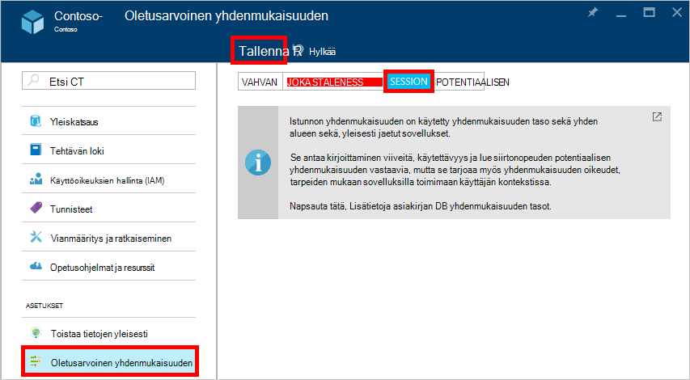

<properties
    pageTitle="Yhdenmukaisuuden tasojen DocumentDB | Microsoft Azure"
    description="DocumentDB on neljä yhdenmukaisuuden tasoa, jotta saldo potentiaalisen yhdenmukaisuuden, käytettävyys ja viive valinnat."
    keywords="potentiaalisen yhdenmukaisuuden documentdb azure-Microsoft azure"
    services="documentdb"
    authors="syamkmsft"
    manager="jhubbard"
    editor="cgronlun"
    documentationCenter=""/>

<tags
    ms.service="documentdb"
    ms.workload="data-services"
    ms.tgt_pltfrm="na"
    ms.devlang="na"
    ms.topic="article"
    ms.date="08/24/2016"
    ms.author="syamk"/>

# DocumentDB yhdenmukaisuuden tasot

Azure DocumentDB on suunniteltu alkava määrittäminen Yleinen jakaumaan mielessä. Se on suunniteltu tarjota ennakoitavissa pieni viive oikeudet, 99,99 % käytettävyys-SLA ja useita hyvin määritetyn kevennetty yhdenmukaisuuden malleja. Tällä hetkellä DocumentDB on neljä yhdenmukaisuuden tasoa: vahva, joka-staleness-istunnon ja potentiaalisen. Lisäksi **hyvä** ja **potentiaalisen yhdenmukaisuuden** mallien yleisesti tarjoamia NoSQL muita tietokantoja DocumentDB myös on kaksi huolellisesti koodattu ja operationalized yhdenmukaisuuden mallia – **joka staleness** ja **istunnon**ja vahvistettu niiden käyttökelpoisuus vastaan käytännön Käytä tapauksissa. Muunnokset nämä neljä yhdenmukaisuuden tasot avulla voit tehdä hyvin perustellun valinnat yhdenmukaisuuden, käytettävyys ja viive välillä. 

## Yhdenmukaisuuden käyttöalueet

Yksittäisen käyttäjäpyyntö on määritetty yhdenmukaisuuden rakeisuuden. Kirjoituspyyntö saattaa vastaavat Lisää, korvaa, upsert tai poistaa tapahtuman (kanssa tai ilman liittyvät pre tai post käynnistimen suorittamisen). Tai kirjoittaminen pyyntö voi vastata useiden tiedostojen osion kautta toimivien JavaScript tallennettu toimintosarja tapahtumien suorittamisen. Kirjoituksia, jossa luku/kysely tapahtuma on myös määritetty yksittäisen käyttäjäpyynnön. Käyttäjän saattaa edellyttää voit siirtyä lokimerkintöjen päälle suuren-tulosjoukon, jonka kesto on useita osioita, mutta jokainen lukea tapahtuman on määritetty yhdelle sivulle ja served yhteen-osioon.

## Yhdenmukaisuuden tasot

Voit määrittää yhdenmukaisuuden oletustaso tietokannan tililläsi, joka koskee kaikkia kokoelmien (yli kaikki tietokannat) tietokanta-tili. Oletusarvon mukaan kaikki lukee ja käyttäjän määrittämät resurssit vastaan kyselyt käyttävät yhdenmukaisuuden oletustaso määritetty tietokanta-tilissä. Voit kuitenkin Keskeytä tietyn luku/kysely yhdenmukaisuuden taso määrittämällä [[x-ms-yhdenmukaisuuden-taso]](https://msdn.microsoft.com/library/azure/mt632096.aspx) pyynnön otsikko. On neljänlaisia DocumentDB replikoinnin protokollan tukeman yhdenmukaisuuden tasoja, jotka sisältävät tietyn yhdenmukaisuuden oikeudet ja suorituskyvyn Tyhjennä trade-off seuraavalla tavalla.

![DocumentDB on useita, hyvin määritelty (kevennetty) yhdenmukaisuuden mallien valittavana][1]

**Vahvan**: 

- Vahvan yhdenmukaisuuden on [linearizability](https://aphyr.com/posts/313-strong-consistency-models) takaa lukee taata palauttaa tiedoston edellisen version kanssa. 
- Vahvan yhdenmukaisuuden takaa, että Kirjoita on näkyvissä vain, kun se on vahvistettu kuuluminen replikoiden suurimmalla äänistä mukaan. Kirjoita joko synkronoidusti pyrkii kuuluminen pääsivujen ja secondaries äänistä, tai se on keskeytetty. Luku on aina kuitata suurin luku quorum-asiakkaaksi näkevät koskaan ei ole kokonaan tai osittain kirjoittaminen ja aina taata lukemaan täyttävät kirjoittaminen. 
- DocumentDB tilit, jotka on määritetty käyttämään vahva yhdenmukaisuuden useita Azure alue ei voi liittää DocumentDB tilin. 
- Kustannukset (kannalta [pyynnön yksiköt](documentdb-request-units.md) kulutettu), lue-toiminto vahva yhdenmukaisuuden on suurempi kuin istunnon ja potentiaalisen, mutta sama kuin joka staleness.
 

**Bounded staleness**: 

- Joka staleness yhdenmukaisuuden oikeudet, joka lukee saattaa viiveen takana kirjoituksia enintään *K* versioilla tai etuliitteiden asiakirjan tai *t* -aikaväli. 
- Kun valitset joka staleness, "staleness" määritetty näin ollen kahdella tavalla: 
    - Asiakirjan, jolla lukee viive kirjoituksia takana *K* versioiden määrä
    - Aikavälin *t* 
- Joka staleness tarjouksia yleinen tilauksen lukuun ottamatta "staleness"keskusteluikkunasta käsin. Huomaa, että monotoninen luku takaa olemassa alueella sisä- ja ulkopuolelle "staleness ikkunan". 
- Staleness, joka on vahvempi kuin istunnon tai potentiaalisen yhdenmukaisuuden yhdenmukaisuuden takaa. Yleisesti sovelluksia on suositeltavaa, voit käyttää joka staleness skenaarioissa kohtaa, johon haluat on hyvä yhdenmukaisuuden, mutta haluat myös 99,99 % saatavuudesta ja pieni viive. 
- DocumentDB tilit, joille on määritetty joka staleness yhdenmukaisuuden liittämällä DocumentDB tilin minkä tahansa Azure alueiden määrän. 
- Kustannukset (kannalta RUs kulutettu), lue-toiminto, joka staleness on suurempi kuin istunnon ja potentiaalisen yhdenmukaisuuden, mutta sama kuin vahva yhdenmukaisuuden.

**Istunnon**: 

- Toisin kuin vahva ja joka staleness yhdenmukaisuuden tasot tarjoamia yleisen yhdenmukaisuuden mallit-istunnon yhdenmukaisuuden on määritetty asiakkaan istunnon. 
- Istunnon yhdenmukaisuuden sopii kaikissa tilanteissa laitteeseen tai toiselle käyttäjälle istunnon asiaan jälkeen se takaa monotoninen lukuja, monotoninen kirjoituksia ja oman kirjoituksia (RYW) takaa luku. 
- Istunnon yhdenmukaisuuden tarjoaa ennakoitavissa yhdenmukaisuuden istunnon ja suurin luku siirtonopeuden silti pienimpien viive kirjoituksia ja lukuja. 
- DocumentDB tilit, joille on määritetty istunnon yhdenmukaisuuden liittämällä DocumentDB tilin minkä tahansa Azure alueiden määrän. 
- Kustannukset (kannalta RUs kulutettu), lue-toiminto on pienempi kuin vahva ja joka staleness, mutta yli potentiaalisen yhdenmukaisuuden istunnon yhdenmukaisuuden taso
 

**Potentiaalisen**: 

- Potentiaalisen yhdenmukaisuuden takaa, että puuttuessa minkä tahansa edelleen kirjoituksia ryhmän replikoiden myöhemmin todennäköisyyden. 
- Potentiaalisen yhdenmukaisuuden on yhdenmukaisuuden heikoimpia lomakkeen paikassa, jossa on jokin muu sähköpostiohjelma saattaa käyttää arvoja, jotka ovat vanhempia kuin se oli nähnyt niistä.
- Potentiaalisen yhdenmukaisuuden tarjoaa heikoimpia luku yhdenmukaisuuden, mutta se tarjoaa alin viive sekä lukujen kirjoituksia.
- DocumentDB tilit, joille on määritetty potentiaalisen yhdenmukaisuuden liittämällä DocumentDB tilin minkä tahansa Azure alueiden määrän. 
- Kustannukset (kannalta RUs kulutettu), lue-toiminto potentiaalisen yhdenmukaisuuden taso on pienin DocumentDB yhdenmukaisuuden tasot kaikki.

## Yhdenmukaisuuden oikeudet

Seuraavassa taulukossa sieppaa eri yhdenmukaisuuden oikeudet vastaavat neljä yhdenmukaisuuden tasot.

| Takuun                                                         |    Vahvan                                       |    Joka Staleness                                                                           |    Istunnon                                       |    Potentiaalisen                                 |
|----------------------------------------------------------|-------------------------------------------------|------------------------------------------------------------------------------------------------|--------------------------------------------------|--------------------------------------------------|
|    **Yleinen tilauksen kokonaismäärä**                                |    Kyllä                                          |    Kyllä, "staleness ikkunassa" ulkopuolella                                                      |    Ei, osittainen "istunnon" tilauksen                   |    Ei                                            |
|    **Yhtenäinen etuliite on voimassa**                       |    Kyllä                                          |    Kyllä                                                                                         |    Kyllä                                           |    Kyllä                                           |
|    **Monotoninen lukee**                                   |    Kyllä                                          |    Kyllä, eri alueilla staleness ikkunan ulkopuolella ja alueella aina.     |    Kyllä istunnossa:                    |    Ei                                            |
|    **Monotoninen kirjoituksia**                                  |    Kyllä                                          |    Kyllä                                                                                         |    Kyllä                                           |    Kyllä                                           |
|    **Lue oman kirjoituksia**                                  |    Kyllä                                          |    Kyllä                                                                                         |    Kyllä (kirjoitus-alue)                      |    Ei                                            |

## Yhdenmukaisuuden oletustaso määrittäminen

1.  [Azure portal](https://portal.azure.com/), valitse Jumpbar, valitse **DocumentDB (NoSQL)**.

2. Valitse tietokanta-tili, jota haluat muokata **DocumentDB (NoSQL)** -sivu.

3. Valitse tili-sivu napsauttamalla **yhdenmukaisuuden**.

4. Valitse **Oletus yhdenmukaisuuden** -sivu yhdenmukaisuuden uusi käyttöoikeustaso ja valitse **Tallenna**.

    

## Kyselyjen yhdenmukaisuuden tasot

Oletusarvoisesti käyttäjän määrittämät resurssien kyselyjen yhdenmukaisuuden taso on sama kuin yhdenmukaisuuden taso lukee. Oletusarvon mukaan indeksi päivitetään synkronoidusti kunkin Lisää, korvaa tai poista asiakirjan-kokoelmaan. Näin vastaamaan samalla yhdenmukaisuuden tasolla, joka lukee asiakirjan kyselyt. Kun DocumentDB on optimoitu kirjoittaminen ja tukee kestävä tietomääristä asiakirjan kirjoituksia, painikkeen indeksi ylläpito ja kohdistetussa yhdenmukaisia kyselyt, voit määrittää tietyt sivustokokoelmat niiden hakemiston päivittäminen purjeveneestä. Viive-indeksointi osa kirjoittamisen suorituskykyä edelleen ja sopii joukkona nieltynä skenaariot työmäärä ollessa ensisijaisesti luku näkyvä.  

Indeksoinnin tila|  Lukee|  Kyselyt  
-------------|-------|---------
CONSISTENT (oletus)|   Valitse vahva, joka staleness istunnossa tai potentiaalisen|    Valitse vahva, joka staleness istunnossa tai potentiaalisen|
Kuitata|   Valitse vahva, joka staleness istunnossa tai potentiaalisen|    Potentiaalisen  

Nimellä on luku-pyyntöjä, voit pienentää tietyn kyselyn pyyntö yhdenmukaisuuden taso määrittämällä [x-ms-yhdenmukaisuuden-tason](https://msdn.microsoft.com/library/azure/mt632096.aspx) pyynnön otsikko.

## Seuraavat vaiheet

Jos haluat tehdä lisää lukeminen yhdenmukaisuuden tasot ja kompromissien, on suositeltavaa on seuraavissa resursseissa:

-   Doug Korhonen. Replikoitua tietojen yhdenmukaisuuden selitetään baseball (video) kautta.   
[https://www.YouTube.com/watch?v=gluIh8zd26I](https://www.youtube.com/watch?v=gluIh8zd26I)
-   Doug Korhonen. Replikoitua tietojen yhdenmukaisuuden selitetään baseball kautta.   
[http://Research.microsoft.com/Pubs/157411/ConsistencyAndBaseballReport.PDF](http://research.microsoft.com/pubs/157411/ConsistencyAndBaseballReport.pdf)
-   Doug Korhonen. Istunnon oikeudet heikosti yhdenmukaisia replikoitua tiedoille.   
[http://DL.acm.org/CITATION.cfm?id=383631](http://dl.acm.org/citation.cfm?id=383631)
-   Daniel Abadi. Nykyaikainen Distributed Systems-tietokannan rakenteeseen kompromissien yhdenmukaisuuden: pää on vain osa Tarinan ".   
[http://Computer.org/CSDL/mags/CO/2012/02/mco2012020037-ABS.HTML](http://computer.org/csdl/mags/co/2012/02/mco2012020037-abs.html)
-   Peter Bailis, Shivaram Venkataraman, Michael J. Franklin, Joseph M. Hellerstein, ioni Stoica. Probabilistic joka Staleness (PBS) käytännön osittainen Quorums varten.   
[http://vldb.org/pvldb/vol5/p776_peterbailis_vldb2012.PDF](http://vldb.org/pvldb/vol5/p776_peterbailis_vldb2012.pdf)
-   Werner Vogels. Potentiaalisen yhdenmukaisia - uusia.    
[http://allthingsdistributed.com/2008/12/eventually_consistent.HTML](http://allthingsdistributed.com/2008/12/eventually_consistent.html)

[1]: ./media/documentdb-consistency-levels/consistency-tradeoffs.png
