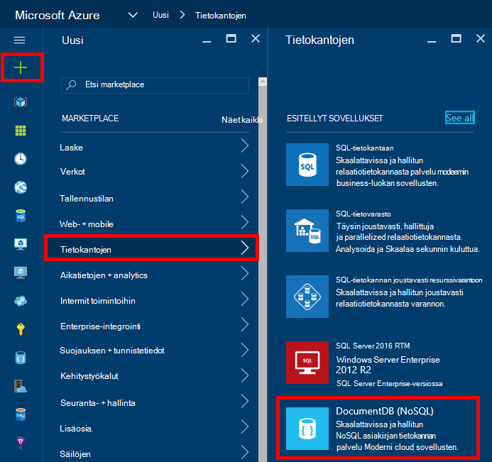
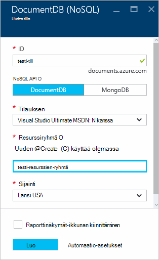
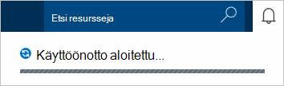
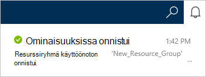
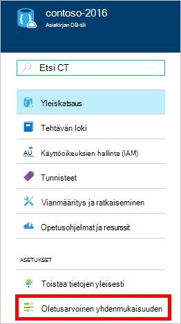
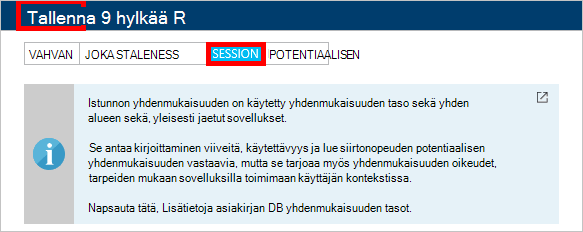

<properties
    pageTitle="Voit luoda DocumentDB tilin | Microsoft Azure"
    description="Luoda Azure DocumentDB NoSQL tietokannan. DocumentDB-tilin luominen ja Käynnistä blazing nopea ja maailmanlaajuisesti NoSQL tietokantaa näiden ohjeiden mukaisesti." 
    keywords="tietokannan luominen"
    services="documentdb"
    documentationCenter=""
    authors="mimig1"
    manager="jhubbard"
    editor="monicar"/>

<tags
    ms.service="documentdb"
    ms.workload="data-services"
    ms.tgt_pltfrm="na"
    ms.devlang="na"
    ms.topic="get-started-article"
    ms.date="10/17/2016"
    ms.author="mimig"/>

# Azure-portaalissa DocumentDB NoSQL-tilin luominen

> [AZURE.SELECTOR]
- [Azure portal](documentdb-create-account.md)
- [Azure CLI ja Azure Resurssienhallinta](documentdb-automation-resource-manager-cli.md)

Luo tietokanta on Microsoft Azure DocumentDB edellyttää seuraavia toimia:

- On Azure-tili. Saat [ilmaisia Azure-tili](https://azure.microsoft.com/free) , jos sitä ei vielä ole. 
- Luo DocumentDB tili.  

Voit luoda DocumentDB-tili, käyttämällä joko Azure portal, Azure Resurssienhallinta mallien tai Azure käyttöliittymä (CLI). Tämän artikkelin avulla voit luoda DocumentDB tilin Azure-portaalissa. Luo tili käyttämällä Azure Resurssienhallinta tai Azure CLI, on artikkelissa [automatisoida DocumentDB tietokannan tilin luominen](documentdb-automation-resource-manager-cli.md).

Oletko uusi DocumentDB? Neljän minuutin [Tässä](https://azure.microsoft.com/documentation/videos/create-documentdb-on-azure/) videossa mukaan, miten yleisimpiä suorittaminen online-portaalissa Scott Hanselman.

1.  Kirjautuminen [Azure portal](https://portal.azure.com/).
2.  Jumpbar, valitse **Uusi**ja valitse **tietokantojen** **DocumentDB (NoSQL)**. 

      

3. Määritä uudet määritykset DocumentDB tilin **uusi tili** -sivu.

    

    - Kirjoita **tunnus** -ruutuun DocumentDB tilin nimi.  Kun **tunnus** on tarkistettu, vihreä valintamerkki tulee **tunnus** -ruutuun. **Tunnus** -arvo muuttuu isäntänimi URI sisällä. **Tunnus** voi olla vain pieniä kirjaimia, numeroita ja '-' merkki ja on oltava 3 – 50 merkkiä. Huomaa, että *documents.azure.com* lisätään valitsemasi päätepisteen nimi, joka tulos tulee DocumentDB tilin päätepiste.

    - Valitse käytettävä ohjelmoinnin malli **NoSQL API** -ruudussa:
        - **DocumentDB**: DocumentDB API on saatavana .NET, Java, Node.js, Python ja JavaScript- [SDK: T](documentdb-sdk-dotnet.md), sekä HTTP [muille käyttäjille](https://msdn.microsoft.com/library/azure/dn781481.aspx)ja tarjoaa ohjelmallisesti DocumentDB toimintoja. 
       
        - **MongoDB**: DocumentDB tarjoaa myös [protokolla tason tuki](documentdb-protocol-mongodb.md) **MongoDB** API. Kun valitset MongoDB API-vaihtoehdon, voit jutella DocumentDB aiemmin MongoDB SDK: T ja - [työkalujen](documentdb-mongodb-mongochef.md) avulla. Voit [siirtää](documentdb-import-data.md) DocumentDB, käyttäminen [ei edellytä koodin muutoksia](documentdb-connect-mongodb-account.md)aiemmin MongoDB sovelluksia ja hyödyntää täysin hallitun tietokannan palveluna rajattomasti mittakaava, yleinen replikoinnin ja muita ominaisuuksia.

    - **Tilauksen**Valitse Azure tilaus, jota haluat käyttää DocumentDB-tilillä. Jos tiliisi on vain yksi tilaus, tiliin on valittuna oletusarvoisesti.

    - **Resurssiryhmä**Valitse tai luo resurssiryhmä DocumentDB tilissäsi.  Oletusarvon mukaan luodaan uusi resurssiryhmä. Lisätietoja on artikkelissa [Azure-portaalissa voit hallita Azure resursseja](../articles/azure-portal/resource-group-portal.md).

    - **Sijainnin** avulla voit määrittää maantieteellinen sijainti, johon isännöimiseen DocumentDB-tilillesi. 

4.  Kun uusi DocumentDB tilin asetukset on määritetty, valitse **Luo**. Käyttöönoton tilan tarkistaminen Tarkista ilmoitukset-toiminnossa.  

      

    

5.  Kun DocumentDB-tili on luotu, on valmis käytettäväksi oletusasetukset. **Istunnon**on määritetty oletusarvoinen yhdenmukaisuuden DocumentDB tilin.  Voit muuttaa oletusarvon yhdenmukaisuuden resurssi-valikossa **Oletusarvon yhdenmukaisuuden** . Lisätietoja DocumentDB tarjoamia yhdenmukaisuuden tasot, katso [yhdenmukaisuuden tasojen DocumentDB](documentdb-consistency-levels.md).

      

      

[How to: Create a DocumentDB account]: #Howto
[Next steps]: #NextSteps
[documentdb-manage]:../articles/documentdb/documentdb-manage.md

## Seuraavat vaiheet

Nyt kun olet luonut DocumentDB-tili, seuraava vaihe on DocumentDB sivustokokoelman ja tietokannan luomiseen. 

Voit luoda uuden sivustokokoelman ja tietokanta käyttämällä jotakin seuraavista toimista:

- Kuvattuja [luoda Azure-portaalissa DocumentDB kokoelman](documentdb-create-collection.md)Azure portal.
- Täydellisesti opetusohjelmia, jotka sisältävät mallitiedot: [.NET](documentdb-get-started.md), [.NET MVC](documentdb-dotnet-application.md), [Java](documentdb-java-application.md), [Node.js](documentdb-nodejs-application.md)tai [Python](documentdb-python-application.md).
- [.NET](documentdb-dotnet-samples.md#database-examples), [Node.js](documentdb-nodejs-samples.md#database-examples)tai [Python](documentdb-python-samples.md#database-examples) sample code GitHub käytettävissä.
- Esimerkiksi [.NET](documentdb-sdk-dotnet.md) [Node.js](documentdb-sdk-node.md), [Java](documentdb-sdk-java.md), [Python](documentdb-sdk-python.md)ja [Muut](https://msdn.microsoft.com/library/azure/mt489072.aspx) SDK: T.

Kun olet luonut tietokannan ja sivustokokoelman, sinun täytyy kokoelmien [tiedostojen lisääminen](documentdb-view-json-document-explorer.md) .

Kun tiedostot ovat kokoelma, voit [DocumentDB SQL](documentdb-sql-query.md) suorittaa [kyselyjä](documentdb-sql-query.md#executing-queries) vastaan tiedostoja. Voit suorittaa kyselyjä käyttämällä [Kyselyn Explorer](documentdb-query-collections-query-explorer.md) -portaalissa, [REST API](https://msdn.microsoft.com/library/azure/dn781481.aspx)tai jokin [SDK: T](documentdb-sdk-dotnet.md).

### Opi lisää

Lisätietoja DocumentDB, tutki nämä resurssit:

-   [DocumentDB oppimispolku](https://azure.microsoft.com/documentation/learning-paths/documentdb/)
-   [DocumentDB hierarkkisia resurssin mallin ja käsitteitä](documentdb-resources.md)
