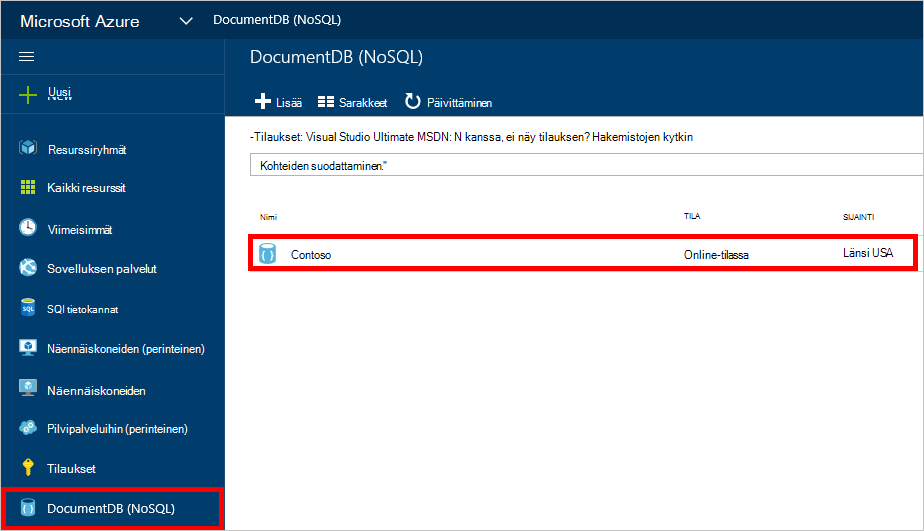
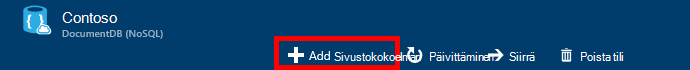
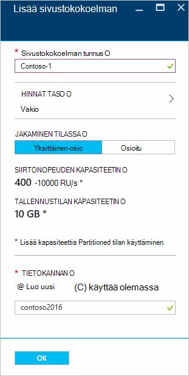
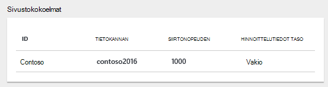
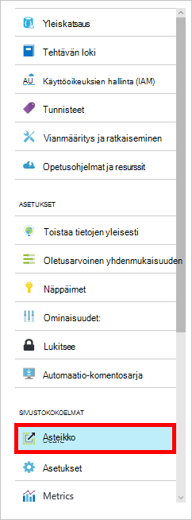

<properties 
    pageTitle="Luo DocumentDB tietokanta ja sivustokokoelman | Microsoft Azure" 
    description="NoSQL tietokantojen luominen ja online-palvelun-portaalin käytön Azure DocumentDB JSON asiakirjan sivustokokoelmat-pilvestä perusteella asiakirjan tietokannan. Pyydä maksuttoman kokeiluversion tänään." 
    services="documentdb" 
    authors="mimig1" 
    manager="jhubbard" 
    editor="monicar" 
    documentationCenter=""/>

<tags 
    ms.service="documentdb" 
    ms.workload="data-services" 
    ms.tgt_pltfrm="na" 
    ms.devlang="na" 
    ms.topic="article" 
    ms.date="10/17/2016" 
    ms.author="mimig"/>

# DocumentDB kerääminen ja Azure-portaalissa tietokannan luominen

Käyttämään Microsoft Azure DocumentDB on oltava [DocumentDB tili](documentdb-create-account.md), tietokannan, kokoelma ja asiakirjoja. Tässä ohjeaiheessa kerrotaan, miten DocumentDB sivustokokoelman luominen Azure-portaalissa. 

Mitä sivustokokoelman kuvaus Katso [DocumentDB sivustokokoelman ominaisuudet?](#what-is-a-documentdb-collection)

1.  Valitse [Azure portal](https://portal.azure.com/)-Jumpbar, valitse **DocumentDB (NoSQL)**ja valitse tili, johon haluat lisätä kokoelma **DocumentDB (NoSQL)** -sivu. Jos sinulla ei ole luetellut tilit, tarvitset [DocumentDB-tilin](documentdb-create-account.md)luominen.

    
    
    Jos **DocumentDB (NoSQL)** ei ole näkyvissä Jumpbar, valitse **Lisää palveluja** ja valitse sitten **DocumentDB (NoSQL)**. Jos sinulla ei ole luetellut tilit, tarvitset [DocumentDB-tilin](documentdb-create-account.md)luominen.

2. Valitse **Lisää sivustokokoelman**valitun tilin **DocumentDB tili** -sivu.

    

3. Kirjoita **Lisää sivustokokoelman** , sivu **tunnus** -ruutuun uusi tunnus. Sivustokokoelman nimet on oltava 1 – 255 merkkiä, eikä se saa sisältää `/ \ # ?` tai lopussa on välilyönti. Kun nimi on tarkistettu, vihreä valintamerkki tulee tunnus-ruutuun.

    

4. Oletusarvon mukaan **Hinnat taso** määritetään **Vakio** , niin, että voit mukauttaa siirtonopeuden ja tallennustilaa kokoelmasta. Saat lisätietoja hinnoittelu taso [DocumentDB tasojen suorituskykyä](documentdb-performance-levels.md).  

5. Valitse **osioimisen tilassa** kokoelman **Osio** tai **Partitioned**. 

    **Osio** on varattu tallennustilaa 10 gigatavua, ja se voi olla siirtonopeuden tasot 400-10 000 pyynnön yksiköt/toisen (RU/s). Yksi RU vastaa luku 1 kt asiakirjan siirtonopeuden. Saat lisätietoja pyynnön yksiköt [pyynnön yksiköt](documentdb-request-units.md). 

    **Osioitu sivustokokoelman** skaalata käsittelemään rajattoman määrän tallennustilan useita osioita kautta ja voi olla siirtonopeuden tasoja aloittaen 10,100 RU/s. Voit varata suurin tallennustila on 250 Gigatavua portaalin, ja voit varata useimmat siirtonopeuden on 250,000 RU/s. Tiedoston niin, että joko kiintiön pyyntö kuvatulla tavalla [pyynnön entistä DocumentDB tilin kiintiön](documentdb-increase-limits.md). Katso Lisää monirivistä tietoja osioitua sivustokokoelmat- [osio ja osioitua sivustokokoelmat](documentdb-partition-data.md#single-partition-and-partitioned-collections).

    Oletusarvon mukaan uusi osio-sivustokokoelman siirtonopeuden on määritetty 1000 RU/s ja tallennustilaa 10 gigatavua. Sivustokokoelman siirtonopeuden asetetaan osioitua kokoelman 10100 RU/s ja tallennustilaa 250 gigatavua. Voit muuttaa siirtonopeuden ja tallennustilaa kokoelman kokoelman luomisen jälkeen. 

6. Jos luot osioitua sivustokokoelman, valitse kokoelman **Osio-näppäintä** . On tärkeää luoda performant sivustokokoelman valitaan oikea osio-näppäintä. Saat lisätietoja valitsemalla osion näppäintä [suunnitteleminen jakaminen](documentdb-partition-data.md#designing-for-partitioning).

7. Valitse **tietokanta** -sivu luoda uuden tietokannan tai Käytä aiemmin luotua. Tietokannan nimen on oltava 1 – 255 merkkiä, eikä se saa sisältää `/ \ # ?` tai lopussa on välilyönti. Vahvista nimi, valitse hiirellä tekstiruudun ulkopuolelle. Kun nimi on tarkistettu, ruutuun tulee vihreä valintamerkki.

8. Valitse **OK** näytön alareunassa uusi sivustokokoelman luomiseen. 

9. Uuden sivustokokoelman nyt näkyy **Yhteenveto** -sivu **sivustokokoelmat** -linssin.
 
    

10. **Valinnainen:** **Voit muokata sivustokokoelman portaalissa siirtonopeuden Valitse resurssi-valikon.** 

    

## DocumentDB sivustokokoelman ominaisuudet 

Kokoelma on JSON asiakirjojen ja liittyvän JavaScript-sovelluksen logiikkaa säilö. Kokoelma on laskutettavan kokonaisuus, jossa [kustannukset](documentdb-performance-levels.md) määräytyy valmistellun siirtonopeuden kokoelman. Kokoelmien voi olla yksi tai useampi osioiden/palvelin ja käsitellään käytännössä rajoittamaton tallennus- tai siirtonopeuden tietomääristä skaalata.

Kokoelmien ovat automaattisesti osioinut vähintään yksi fyysiset palvelimet yhdeksi DocumentDB. Kun luot kokoelma, voit määrittää valmistellun siirtonopeuden myyntialueella pyynnön toisen ja osion avaimen ominaisuuden kohden. Tämän ominaisuuden arvoa käytetään DocumentDB osiot ja reitin pyynnöt kyselyjen kuten asiakirjojen jakamiseen. Osion avainarvon toimii myös tallennettujen toimintosarjojen ja käynnistimien tapahtuman reunaa. Valikoimien on varattu määrää nopeus tietyn kyseisen kokoelma, jolla ei ole jaettu muiden saman tilin sivustokokoelmat. Voit skaalata vuoksi sovelluksen sekä tallennustilan ja siirtonopeuden ulos. 

Sivustokokoelmat eivät ole sama kuin relaatiotietokannasta taulukot. Kokoelmien Älä pakota rakenteen, itse asiassa DocumentDB Pakota kaikki mallit, rakenteen vapaa-tietokanta on. Tämän vuoksi voit tallentaa saman kokoelman asiakirjojen monipuolisen rakenteet eri tyyppiä. Voit valita sivustokokoelmat avulla voit tallentaa objektit yhteen tyypin taulukoiden kanssa samalla tavalla. Paras mallin vain riippuu siitä, miten tiedot näkyvät yhdessä kyselyissä ja tapahtumia.

## Muita tapoja luoda DocumentDB kokoelman

Kokoelmien ei tarvitse luoda-portaalissa, voit myös luoda ne [DocumentDB SDK: T](documentdb-sdk-dotnet.md) ja REST-Ohjelmointirajapinnalla avulla. 

- Katso C# koodin otoksen, [C# sivustokokoelman objektit](documentdb-dotnet-samples.md#collection-examples). 
- Katso Node.js koodin otoksen [Node.js sivustokokoelman objektit](documentdb-nodejs-samples.md#collection-examples).
- Katso Python koodin otoksen [Python sivustokokoelman objektit](documentdb-python-samples.md#collection-examples).
- Katso REST API otoksen [Luo ryhmä](https://msdn.microsoft.com/library/azure/mt489078.aspx).

## Vianmääritys

**Lisää sivustokokoelman** on poistettu käytöstä Azure-portaalissa, siis tilisi on poistettu käytöstä, joka toteutuu tavallisesti, kun kaikki edut hyvitykset kuukauden käytetään.   

## Seuraavat vaiheet

Nyt kun olet luonut kokoelma, seuraava vaihe on lisää tiedostoja tai tuoda asiakirjojen kokoelmaa. Jos tiedostojen lisäämisessä kokoelma, sinulla on muutama vaihtoehtoa:

- Voit [lisätä tiedostoja](documentdb-view-json-document-explorer.md) Resurssienhallinnassa asiakirjan portaalissa.
- Voit [tuonti-tiedostot ja tiedot](documentdb-import-data.md) käyttämällä DocumentDB tietojen siirto-työkalua, jonka avulla voit tuoda JSON ja CSV-tiedostoja sekä tietojen tuominen SQL Server, MongoDB, Azure-taulukkotallennus ja muut DocumentDB sivustokokoelmat. 
- Tai voit lisätä tiedostoja käyttämällä jotakin [DocumentDB SDK: T](documentdb-sdk-dotnet.md). DocumentDB on .NET, Java, Python, Node.js ja JavaScript-Ohjelmointirajapinnan SDK: T. Katso C# esittää, kuinka voit käsitellä tiedostoja käyttämällä DocumentDB .NET SDK MALLIKOODEJA, [C#-asiakirjan objektit](documentdb-dotnet-samples.md#document-examples). Katso Node.js MALLIKOODEJA esittää, kuinka voit käsitellä tiedostoja käyttämällä DocumentDB Node.js SDK- [Node.js asiakirjan objektit](documentdb-nodejs-samples.md#document-examples).

Kun tiedostot ovat kokoelma, voit [DocumentDB SQL](documentdb-sql-query.md) suorittaa [kyselyjä](documentdb-sql-query.md#executing-queries) vastaan tiedostojen käyttämällä [Kyselyn Explorer](documentdb-query-collections-query-explorer.md) -portaalissa, [REST API](https://msdn.microsoft.com/library/azure/dn781481.aspx)tai jokin [SDK: T](documentdb-sdk-dotnet.md). 
