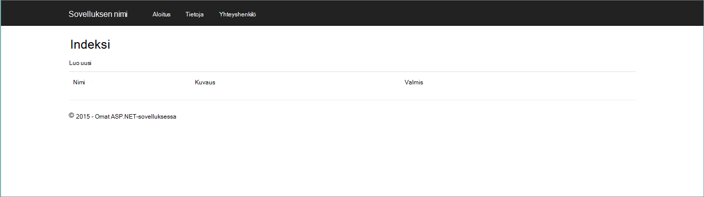

<properties 
    pageTitle="Ottaa käyttöön DocumentDB ja Azure App palvelun Web Apps Azure-Resurssienhallinta-mallin avulla | Microsoft Azure" 
    description="Opi ottamaan DocumentDB-tili, Azure palvelun Web sovellukset ja otoksen web-sovelluksen Azure Resurssienhallinta-mallin avulla." 
    services="documentdb, app-service\web" 
    authors="h0n" 
    manager="jhubbard" 
    editor="monicar" 
    documentationCenter=""/>

<tags 
    ms.service="documentdb" 
    ms.workload="data-services" 
    ms.tgt_pltfrm="na" 
    ms.devlang="na" 
    ms.topic="article" 
    ms.date="08/02/2016" 
    ms.author="hawong"/>

# Ottaa käyttöön DocumentDB ja Azure App palvelun Web Apps Azure-Resurssienhallinta-mallin avulla

Tässä opetusohjelmassa näytetään, miten voit käyttää mallia Azure Resurssienhallinta käyttöönotto ja integroida [Microsoft Azure DocumentDB](https://azure.microsoft.com/services/documentdb/) [Azure App palvelun](http://go.microsoft.com/fwlink/?LinkId=529714) web app-sovelluksessa ja Internet-sovelluksen malli.

Azure Resurssienhallinta mallien avulla voit helposti automatisoida käyttöönotto- ja Azure resurssien määrittäminen.  Tässä opetusohjelmassa näytetään web-sovelluksen käyttöönotto ja määrittäminen automaattisesti DocumentDB tilin yhteystiedot.

Kun olet suorittanut tämän opetusohjelman, osaat seuraaviin kysymyksiin:  

-   Miten Azure Resurssienhallinta-malli käyttää käyttöönotto ja integroida DocumentDB tilin verkkosovellukseen Azure sovelluksen-palvelussa?
-   Miten Azure Resurssienhallinta-malli käyttää käyttöönotto ja integroida DocumentDB-tili, verkkosovellukseen App palvelun Web Apps-sovelluksissa ja Webdeploy-sovelluksen?

## Edellytykset
> [AZURE.TIP] Kun tässä opetusohjelmassa ei oletetaan, että edellisen kokemusta Azure Resurssienhallinta malleja tai JSON-olisi haluat muokata viitatun malleja tai Käyttöönottoasetukset Valitse tuntemus kunkin alueen on suoritettava.

Ennen kuin noudattamalla tässä opetusohjelmassa, varmista, että käytössäsi ovat seuraavat:

- Azure tilaus. Azure on tilauspohjaista ympäristö.  Lisätietoja hankkiminen tilauksen näkyy [Hankkiminen asetukset](https://azure.microsoft.com/pricing/purchase-options/), [Jäsenen tarjoaa](https://azure.microsoft.com/pricing/member-offers/)tai [Maksuttoman kokeiluversion käyttäjäksi](https://azure.microsoft.com/pricing/free-trial/).

##Vaihe 1: Lataa mallitiedostot ##
Aloitetaan lataamalla tämän opetusohjelman Käytämme mallitiedostot.

1. Lataa [DocumentDB-tilin Web Apps-sovellusten luominen ja käyttöönotto esittely sovelluksen otoksen](https://portalcontent.blob.core.windows.net/samples/DocDBWebsiteTodo.json) mallin paikalliseen kansioon (esimerkiksi C:\DocumentDBTemplates). Tämä malli otetaan käyttöön DocumentDB-tili, sovelluksen web App-palvelun ja web-sovelluksen.  Se määritetään automaattisesti myös web-sovelluksen DocumentDB tiliin yhdistämistä varten.

2. Lataa [Luo DocumentDB tili ja Web Apps-malli](https://portalcontent.blob.core.windows.net/samples/DocDBWebSite.json) -mallin paikalliseen kansioon (esimerkiksi C:\DocumentDBTemplates). Tämä malli otetaan käyttöön DocumentDB-tili, sovelluksen Service-verkkosovellus, ja Muokkaa sivuston sovellusasetuksia, voit helposti tuoda DocumentDB yhteyden tietoja, mutta ei ole web-sovelluksen.  

##Vaihe 2: Käyttöönotto DocumentDB asiakas, sovelluksen palvelun web app ja esittely sovelluksen malli

Nyt käyttöön japanin Microsoftin ensimmäisen malli.

> [AZURE.TIP] Mallia ei tarkista web-sovelluksen nimi- ja DocumentDB tilin nimi on kirjoitettu alle on a) voimassa ja b) käytettävissä.  On suositeltavaa, että tarkistat toimittamaan ennen lähettämistä käyttöönoton suunnitteleminen nimet käytettävyyttä.

1. Kirjaudu [Azure-portaalissa](https://portal.azure.com), valitse uusi ja Etsi "Mallin käyttöönottoa".
    

2. Valitse malli käyttöönoton kohde ja valitse **Luo**
    

3.  Muokkaa **mallia**, Liitä DocDBWebsiteTodo.json mallitiedoston sisältö ja valitse **Tallenna**.
    

4. Valitse **Muokkaa parametrit**, anna kunkin pakollinen parametrien arvot ja valitse **OK**.  Parametrit ovat seuraavat:

    1. NIMI: Määrittää sovelluksen palvelun web app-nimen ja muodostamiseen, voit käyttää web Appin URL-osoite (esimerkiksi määrität "mydemodocdbwebapp" ja valitse, jolla käytät web Appin URL-osoite on mydemodocdbwebapp.azurewebsites.net).

    2. HOSTINGPLANNAME: Määrittää sovelluksen palvelun isännöintipalvelu aiot luoda nimi.

    3. SIJAINTI: Määrittää Azure johon luot DocumentDB ja web app resurssit.

    4. DATABASEACCOUNTNAME: Määrittää luomaan DocumentDB-tilin nimi.   

    

5. Valitse aiemmin luotu resurssiryhmä tai tehdä uusi resurssiryhmä nimi ja valitse resurssiryhmän sijainti.
    
  
6.  Valitse **Tarkista juridiset ehdot**, **Osta**, ja valitse sitten **Luo** Aloita käyttöönotto.  Valitse **raporttinäkymät-ikkunan kiinnittäminen** , jotta tuloksena käyttöönoton näkyy helposti Azure portaalin aloitussivulla.
    

7.  Kun asennus on valmis, resurssien ryhmä-sivu avautuu.
      

8.  Sovelluksen käyttöä varten yksinkertaisesti Siirry web Appin URL-osoite (edellä olevassa esimerkissä URL-osoite on http://mydemodocdbwebapp.azurewebsites.net).  Näet web-sovelluksen:

    

9. Siirry eteenpäin ja luo pari tehtävät web App-sovelluksessa ja palaa sitten Azure-portaalissa resurssien ryhmä-sivu. DocumentDB tilin resurssin resurssit-luettelosta ja valitse sitten **Kysely Explorer**.
      

10. Suorita oletuskyselyn, "Valitse *FROM c" ja Tarkista tulokset.  Huomaa, että kysely on noudettu todo kohteita, jonka loit vaiheessa 7 tallentamaasi JSON-esitys.  Vapaasti kokeilla kyselyjen; yrittää esimerkiksi Valitse* -c WHERE c.isComplete = TOSI, palautetaan kaikki todo kohteet, jotka on merkitty valmiiksi.

    

11. Vapaasti DocumentDB portaalin kokemus tarkasteleminen tai muokkaaminen Todo-sovelluksen malli.  Kun olet valmis, ota japanin toiseen malliin.
    
 
## Vaihe 3: Asiakirjan tilin ja web app otosten käyttöönotto

Nyt käyttöön japanin sekä toinen malli.  Tämä malli on hyötyä näyttää, miten voit voit lisätä DocumentDB yhteyden tietoja, kuten tilin päätepiste ja avaimen web Appiin sovellusasetukset tai mukautetun yhteysmerkkijonon. Esimerkiksi olet oman web-sovelluksen, jotka haluat ottaa käyttöön DocumentDB tilillä ja on täytetty automaattisesti käyttöönoton aikana yhteystiedot.

> [AZURE.TIP] Mallia ei tarkista web-sovelluksen nimi- ja DocumentDB tilin nimi on kirjoitettu alle on a) voimassa ja b) käytettävissä.  On suositeltavaa, että tarkistat toimittamaan ennen lähettämistä käyttöönoton suunnitteleminen nimet käytettävyyttä.

1. [Azure-portaali](https://portal.azure.com)valitsemalla Uusi ja Etsi "Mallin käyttöönottoa".
    

2. Valitse malli käyttöönoton kohde ja valitse **Luo**
    

3.  Muokkaa **mallia**, Liitä DocDBWebSite.json mallitiedoston sisältö ja valitse **Tallenna**.
    

4. Valitse **Muokkaa parametrit**, anna kunkin pakollinen parametrien arvot ja valitse **OK**.  Parametrit ovat seuraavat:

    1. NIMI: Määrittää sovelluksen palvelun web app-nimen ja muodostamiseen, voit käyttää web Appin URL-osoite (esimerkiksi määrität "mydemodocdbwebapp" ja valitse, jolla käytät web Appin URL-osoite on mydemodocdbwebapp.azurewebsites.net).

    2. HOSTINGPLANNAME: Määrittää sovelluksen palvelun isännöintipalvelu aiot luoda nimi.

    3. SIJAINTI: Määrittää Azure johon luot DocumentDB ja web app resurssit.

    4. DATABASEACCOUNTNAME: Määrittää luomaan DocumentDB-tilin nimi.   

    

5. Valitse aiemmin luotu resurssiryhmä tai tehdä uusi resurssiryhmä nimi ja valitse resurssiryhmän sijainti.
    
  
6.  Valitse **Tarkista juridiset ehdot**, **Osta**, ja valitse sitten **Luo** Aloita käyttöönotto.  Valitse **raporttinäkymät-ikkunan kiinnittäminen** , jotta tuloksena käyttöönoton näkyy helposti Azure portaalin aloitussivulla.
    

7.  Kun asennus on valmis, resurssien ryhmä-sivu avautuu.
      

8. Online-resurssin resurssit-luettelosta ja valitse sitten **Sovellusasetukset**
      

9. Huomaat, miten on sovellusasetukset esitä DocumentDB päätepiste ja kunkin DocumentDB perustyyli-näppäimiä.
      

10. Vapaasti jatkaa tutustuminen Azure-portaalin tai on Microsoftin DocumentDB-sovelluksen luominen DocumentDB [esimerkit](http://go.microsoft.com/fwlink/?LinkID=402386) .

    
    

## Seuraavat vaiheet

Onnittelen! DocumentDB-sovelluksen palvelun web app- ja Azure Resurssienhallinta mallien avulla otoksen verkkosovelluksen on otettu käyttöön.

- Saat lisätietoja DocumentDB napsauttamalla [tätä](http://azure.com/docdb).
- Lisätietoja Azure App palvelun Web Apps-sovelluksista, napsauta [tätä](http://go.microsoft.com/fwlink/?LinkId=325362).
- Lisätietoja Azure Resurssienhallinta malleja, napsauta [tätä](https://msdn.microsoft.com/library/azure/dn790549.aspx).

## Mikä on muuttunut
* Katso muutoksen opas verkkosivuilta App palveluun: [Azure App palvelu ja sen vaikutus aiemmin Azure-palvelut](http://go.microsoft.com/fwlink/?LinkId=529714)
* Lisätietoja ja uuden portaalin vanha portaalin muutettava artikkelissa: [Siirtyminen Azure perinteinen Portal-viittaus](http://go.microsoft.com/fwlink/?LinkId=529715)

>[AZURE.NOTE] Jos haluat aloittaa Azure App palvelun ennen rekisteröimässä Azure-tili, siirry [Yritä App palvelu](http://go.microsoft.com/fwlink/?LinkId=523751), jossa lyhytkestoinen starter verkkosovellukseen heti voit luoda sovelluksen-palvelussa. Ei ole pakollinen; luottokortit ei ole sitoumukset.
 
