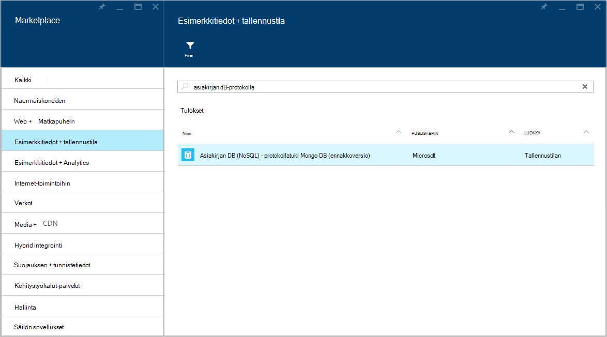
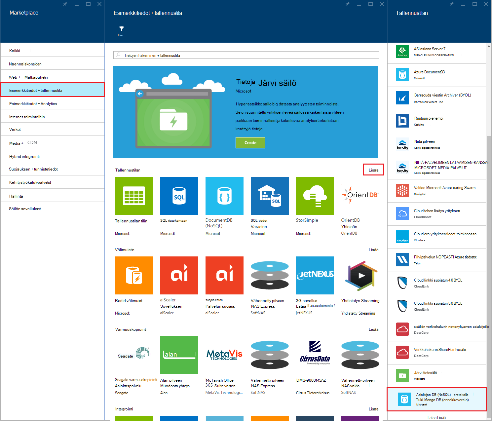
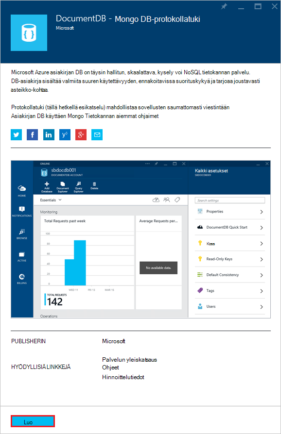
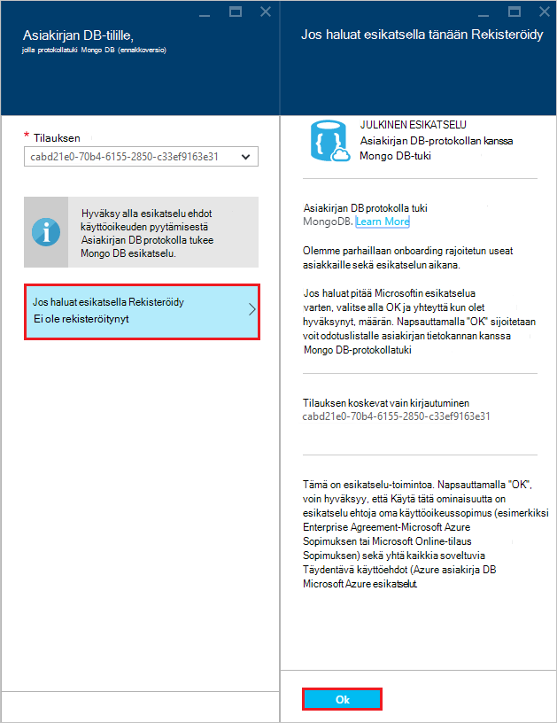
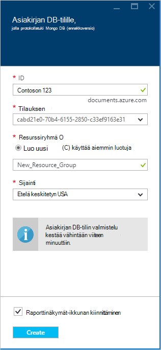
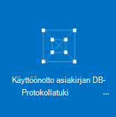
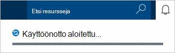
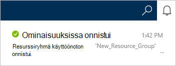
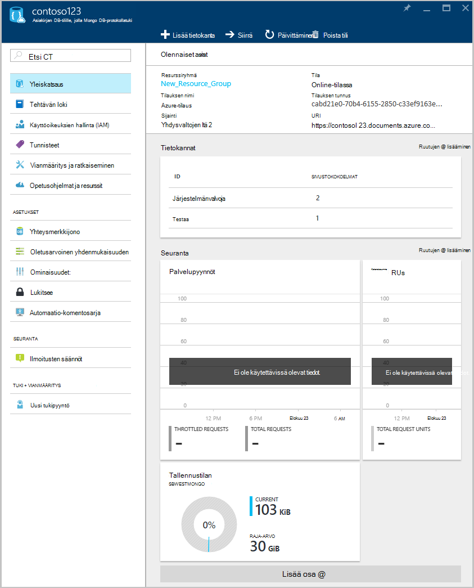

<properties 
    pageTitle="Luoda DocumentDB tilin protokollatuki MongoDB | Microsoft Azure" 
    description="Opi luomaan DocumentDB tilin MongoDB-protokolla tukee nyt käytettävissä esikatselu." 
    services="documentdb" 
    authors="AndrewHoh" 
    manager="jhubbard" 
    editor="" 
    documentationCenter=""/>

<tags 
    ms.service="documentdb" 
    ms.workload="data-services" 
    ms.tgt_pltfrm="na" 
    ms.devlang="na" 
    ms.topic="article" 
    ms.date="10/20/2016" 
    ms.author="anhoh"/>

# DocumentDB-tilin luominen protokolla tukee MongoDB Azure-portaalissa

Azure DocumentDB tilin luominen protokolla tukee MongoDB, toimi seuraavasti:

- On Azure-tili. Saat [ilmaisia Azure-tili](https://azure.microsoft.com/free/) , jos sitä ei vielä ole.

## Luo tili  

DocumentDB-tilin luominen protokolla tukee MongoDB, suorita seuraavat vaiheet.

1. Uudessa ikkunassa Kirjaudu [Azure-portaalissa](https://portal.azure.com).
2. **Uusi**, valitse **tietoja + tallennustilan**, valitse **Näytä kaikki**ja Hae "DocumentDB protokolla" **tietojen + tallennustilan** luokka. Valitse **DocumentDB - protokollatuki MongoDB**.

    

3. Voit myös **tietojen + tallennustilan** -luokan **tallennustilan**-valitsemalla **Lisää**, ja valitse sitten **Lataa Lisää** kerran tai useita kertoja **DocumentDB - protokollatuki MongoDB**näytettävä. Valitse **DocumentDB - protokollatuki MongoDB**.

    

4. Valitse **Luo** käynnistää esikatselu rekisteröitymistä **DocumentDB - protokollatuki MongoDB (esikatselu)** -sivu.

    

5. Valitse **DocumentDB tili** -sivu, **Voit esikatsella Rekisteröidy**. Lue tiedot ja valitse sitten **OK**.

    

6.  Hyväksyttyään esikatselu ehtoja voit palautetaan luominen-sivu.  Määritä uudet määritykset tilin **DocumentDB tili** -sivu.

    

    - Kirjoita **tunnus** -ruutuun tilin nimi.  Kun **tunnus** on tarkistettu, vihreä valintamerkki tulee **tunnus** -ruutuun. **Tunnus** -arvo muuttuu isäntänimi URI sisällä. **Tunnus** voi olla vain pieniä kirjaimia, numeroita ja '-' merkki ja on oltava 3 – 50 merkkiä. Huomaa, että *documents.azure.com* lisätään valitsemasi päätepisteen nimi, joka tulos muuttuu tilin päätepiste.

    - **Tilauksen**Valitse Azure tilaus, jota haluat käyttää tilillä. Jos tiliisi on vain yksi tilaus, tiliin on valittuna oletusarvoisesti.

    - **Resurssiryhmä**Valitse tai luo resurssiryhmä-tilin.  Oletusarvon mukaan aiemmin resurssiryhmä, valitse Azure tilauksen valitaan.  Voi kuitenkin valita, valitse Luo uusi resurssiryhmä, johon haluat lisätä tilin. Lisätietoja on artikkelissa [Azure-portaalissa voit hallita Azure resursseja](resource-group-portal.md).

    - Määritä maantieteellinen sijainti, johon isännöimiseen tilin käyttämällä **sijainti** .
    
    - Valinnainen: Tarkista **raporttinäkymät-ikkunan kiinnittäminen**. Jos kiinnitettyinä Raporttinäkymät-ikkunan, noudata **Vaihe 8** alla Näytä uuden tilin vasemmanpuoleisessa siirtymisruudussa.

7.  Kun uusi tiliasetukset on määritetty, valitse **Luo**.  Voi kestää muutaman minuutin kuluttua Luo tili.  Jos kiinnitetty koontinäyttö, voit valvoa Startboard valmistelu edistymisen.  
      

    Jos koontinäyttö ei kiinnitetty, voit valvoa edistymistä ilmoitukset-toiminnosta.  

      

    

8.  Jos haluat käyttää uuden tilin, valitse **DocumentDB (NoSQL)** vasemmassa valikosta. Tavallinen DocumentDB ja DocumentDB luettelon Mongo protokollan tuki-tilien kanssa Valitse uuden tilin nimi.

9.  On nyt valmis käytettäväksi oletusasetukset. 

    
    

## Seuraavat vaiheet

- Lue, miten DocumentDB tiliin protokollan kanssa [yhteyden](documentdb-connect-mongodb-account.md) tuki MongoDB.

 
