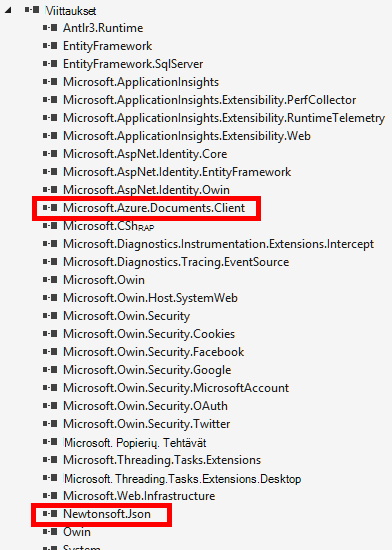

<properties 
    pageTitle="ASP.NET-MVC DocumentDB opetusohjelma: Web-sovellusten kehittämiseen | Microsoft Azure" 
    description="ASP.NET-MVC opetusohjelma MVC web-sovellusten luominen käyttämällä DocumentDB. JSON tallentaa ja käyttää tietoja sijaitseva Azure-sivustoon – ASP verkon MVC opetusohjelma vaiheittainen todo-sovellus." 
    keywords="ASP.NET mvc opetusohjelma, web-sovellusten kehittämiseen, mvc web-sovelluksen, asp nettonykyarvon mvc opetusohjelma vaihe vaiheelta"
    services="documentdb" 
    documentationCenter=".net" 
    authors="syamkmsft" 
    manager="jhubbard" 
    editor="cgronlun"/>

<tags 
    ms.service="documentdb" 
    ms.workload="data-services" 
    ms.tgt_pltfrm="na" 
    ms.devlang="dotnet" 
    ms.topic="hero-article" 
    ms.date="08/25/2016" 
    ms.author="syamk"/>

# ASP.NET-MVC opetusohjelma: Web-sovellusten kehittämiseen DocumentDB kanssa

> [AZURE.SELECTOR]
- [.NET](documentdb-dotnet-application.md)
- [Node.js](documentdb-nodejs-application.md)
- [Java](documentdb-java-application.md)
- [Python](documentdb-python-application.md) 

Voit korostaa siitä, miten voit tehokkaasti hyödyntää Azure DocumentDB tallentamiseen ja kyselyn JSON asiakirjat, tässä artikkelissa näytetään, miten voit luoda todo sovellusta Azure DocumentDB lopusta loppuun-hallintapaketteihin. Tehtävät tallennetaan tiedostoina JSON Azure DocumentDB.

Tämä hallintapaketteihin näytetään, miten Azure tarjoaman DocumentDB-palvelun avulla voit tallentaa ja käyttää tietoja isännöidään Azure ASP.NET MVC web sovellus. Jos etsit opetusohjelma, vain keskitytään DocumentDB ja eivätkä ASP.NET MVC osia, katso [DocumentDB C#-konsolisovelluksen luominen](documentdb-get-started.md).

> [AZURE.TIP] Tässä opetusohjelmassa oletetaan, että edellisen kokemus ASP.NET MVC ja Azure sivustot. Jos ole ennen käyttänyt ASP.NET tai [valmistelevat Työkalut](#_Toc395637760), on suositeltavaa lataaminen valmis malliprojektin [GitHub][] ja noudattamalla tässä esimerkissä. Kun se on luotu, voit tarkistaa tämän artikkelin Hanki-koodin kontekstissa projektin tietoja.

## Tietokannan Tässä opetusohjelmassa edellytyksistä

Ennen kuin noudattamalla tämän artikkelin, varmista, että käytössäsi ovat seuraavat:

- Azure active tili. Jos sinulla ei ole tiliä, voit luoda ilmainen kokeiluversio tili vain muutaman minuutin. Lisätietoja on artikkelissa [Azure maksuttoman kokeiluversion](https://azure.microsoft.com/pricing/free-trial/).
- [Visual Studio 2015](http://www.visualstudio.com/) tai Visual Studio 2013 Päivitä 4 tai uudempi. Visual Studio 2013: n avulla, jos haluat asentaa [Microsoft.Net.Compilers nuget paketti](https://www.nuget.org/packages/Microsoft.Net.Compilers/) Lisää C# 6.0 tuki. 
- .NET versio 2.5.1 Azure SDK tai uudempi versio, [Microsoftin WWW-ympäristö asennusohjelma][]kautta.

Kaikki tämän artikkelin näyttökuvien toteutettu käytetään .NET versio 2.5.1 Visual Studio 2013, jolla Päivitä 4: n kanssa ja Azure SDK-paketissa. Jos järjestelmässä on määritetty eri versioita on mahdollista, että näyttöjä ja asetukset eivät vastaa täysin, mutta jos yllä edellytykset täyttyvät tämä ratkaisu pitäisi toimia.

## Vaihe 1: DocumentDB tietokannan tilin luominen

Aloitetaan luomalla DocumentDB-tili. Jos olet jo määrittänyt tilin, voit siirtyä [Luo uusi ASP.NET MVC-sovellus](#_Toc395637762).

[AZURE.INCLUDE [documentdb-create-dbaccount](../../includes/documentdb-create-dbaccount.md)]

[AZURE.INCLUDE [documentdb-keys](../../includes/documentdb-keys.md)]

 
Selkeät nyt ASP.NET MVC uuden sovelluksen luominen maasta ylöspäin. 

## Vaihe 2: Luo uusi ASP.NET MVC-sovellus

Nyt kun olet määrittänyt tilin, luodaan uusi ASP.NET projektin.

1. Visual Studiossa, valitse **Tiedosto** -valikosta **Uusi**ja valitse sitten **Projekti**.

    **Uusi projekti** -valintaikkuna.
2. **Projekti** -ruudussa Laajenna **Mallit**, **Visual C#**, **Verkko**ja valitse sitten **ASP.NET Web-sovelluksen**.

    

3. Kirjoita projektin nimi **nimi** -ruutuun. Tässä opetusohjelmassa käytetään nimi "todo". Jos haluat käyttää jollakin muulla kuin tämä, sitten sitä tässä opetusohjelmassa puheen tietoja todo nimitilan, sinun on muutettava annettu MALLIKOODEJA käyttämään nimeltä, joista voit sovelluksen. 

4. Valitse **Selaa** ja Selaa kansioon, johon haluat luoda projekti ja valitse sitten **OK**.

    Näkyviin tulee **Uusi ASP.NET-projekti** -valintaikkuna.

    

5. Valitse mallit-ruudussa **MVC**.

6. Jos aio Azure sovelluksen Valitse **Host pilveen** oikeassa alakulmassa on isännöitävä sovelluksen Azure. Olemme olet valinnut isännöimiseen pilveen ja Azure-sivuston ylläpidettävä sovelluksen käyttämiseen. Jos valitset tämän vaihtoehdon preprovision Azure-sivuston puolestasi ja elinkaaren huomattavasti helpottavaa kun on aika lopullinen toimimasta-sovellus. Jos haluat isännöidä tämän muualla tai et halua määrittää Azure toimiston ulkopuolella, vain Poista **Host pilveen**.

7. Valitse **OK** ja anna Visual Studiossa, sen ympärille scaffolding ASP.NET MVC tyhjää mallia tavalla. 

8. Jos haluat isännöidä tämä pilvipalvelussa tulee näkyviin vähintään yhden muita näytön sinulta kysytään, haluatko Azure-tiliin kirjautuminen ja annettava joitakin arvot uuteen sivustoon. Kaikki muut arvot, ja jatka. 

    Voin eivät ole valinnut "tietokantapalvelimen" tässä, koska olemme et käytä Azure SQL-tietokantapalvelimen tähän, tutustutaan luot uuden Azure DocumentDB tilin myöhemmin Azure-portaalissa.

    Saat lisätietoja **sovelluksen palvelusopimus** ja **resurssiryhmä**valitseminen artikkelissa [Azure App palvelun suunnitelmien perusteellisempaa yleiskatsaus](../app-service/azure-web-sites-web-hosting-plans-in-depth-overview.md).

    

9. Kun Visual Studio on luonut mallitekstin MVC sovelluksen on tyhjä, joita voit suorittaa paikallisesti ASP.NET-sovelluksessa.

    Ohitetaan käynnissä projektin paikallisesti, koska en varma, että kaikki katsomista ASP.NET "Hei-maailman" sovelluksen. Nyt siirtyä suoraan Microsoftin sovelluksen kehittämistä sekä lisäämällä DocumentDB tähän projektiin.

## Vaihe 3: Lisää DocumentDB projektiin MVC web-sovelluksen

Nyt kun on suurin osa, tämä ratkaisu annettava ASP.NET MVC putkisto-aloitetaan Tässä opetusohjelmassa Azure DocumentDB lisääminen Microsoftin MVC web-sovelluksen reaali aihe.

1. DocumentDB .NET SDK on pakattu ja jakaa NuGet-pakettina. Jos haluat NuGet-paketti Visual Studiossa, käytä NuGet pakettien hallinta Visual Studiossa **Ratkaisunhallinnassa** projektin hiiren kakkospainikkeella ja valitsemalla **Hallitse NuGet paketit**.

    

    **NuGet pakettien hallinta** -valintaikkuna.

2. Kirjoita ***Azure DocumentDB***NuGet **Etsi** -ruutuun.
    
    Tuloksista Asenna **Microsoft Azure DocumentDB asiakkaan kirjasto** -paketti. Tämä Lataa ja asentaa DocumentDB paketin sekä kaikki riippuvuudet, kuten Newtonsoft.Json. Valitse **Esikatselu** -ikkunassa **OK** , ja **hyväksyn** **Käyttöoikeuden hyväksyminen** -ikkunassa suoritettua asennusta.

    

    Voit myös asentaa paketin pakettien hallinta-konsolin. **Työkalut** -valikon kiellä **NuGet pakettien hallinta**ja valitse sitten **Paketin hallinta-konsolin**. Tulee näkyviin Kirjoita seuraava komento.

        Install-Package Microsoft.Azure.DocumentDB

3. Kun paketti on asennettu, Visual Studio-ratkaisun pitäisi muistuttaa seuraavia toimintoja uusi sisällyttävä leikkausoperaattori lisännyt, Microsoft.Azure.Documents.Client ja Newtonsoft.Json.

    

##Vaihe 4: ASP.NET MVC-sovelluksen määrittäminen
 
Nyt lisääminen mallit, näkymien ja ohjaimet MVC tämän sovelluksen:

- [Lisää malli](#_Toc395637764).
- [Lisää valvonta on](#_Toc395637765).
- [Lisää näkymiä](#_Toc395637766).

### Lisää JSON-tietomalli

Aloitetaan luomalla **M** MVC-malli. 

1. **Ratkaisunhallinnassa** **Mallit** -kansion hiiren kakkospainikkeella, valitse **Lisää**ja valitse sitten **luokka**.

    **Lisää uusi kohde** -valintaikkuna.

2. Uuden luokan **Item.cs** nimeä ja valitse **Lisää**. 

3. Lisää tämä **Item.cs** uusi tiedosto *-lauseella*edellisen jälkeen Seuraava.
        
        using Newtonsoft.Json;
    
4. Korvaa nyt koodi 
        
        public class Item
        {
        }

    Seuraava koodi.

        public class Item
        {
            [JsonProperty(PropertyName = "id")]
            public string Id { get; set; }
             
            [JsonProperty(PropertyName = "name")]
            public string Name { get; set; }

            [JsonProperty(PropertyName = "description")]
            public string Description { get; set; }

            [JsonProperty(PropertyName = "isComplete")]
            public bool Completed { get; set; }
        }

    DocumentDB kaikissa tiedoissa on välitetty ‑toiminto ja tallennettu JSON. Voit vaikuttaa siihen, miten objektit ovat muuntaa sarjaksi tai poistaa JSON.NET, voit käyttää **JsonProperty** määrite osoittaa juuri luomaasi **kohteen** luokan. Et **ole** voit tehdä tämän mutta haluan varmistaa, että oma ominaisuudet noudattamalla JSON camelCase nimeämiskäytännöt. 
    
    Ei ainoastaan voit valita ominaisuuden nimen muoto se siirtyy JSON, mutta voit nimetä .NET-ominaisuudet kokonaan kuin voin näkyy **kuvaus** -ominaisuuden. 
    

### Lisää ohjain

Joka kestää varoen **M**nyt japanin **C** luominen MVC-ohjain-luokka.

1. **Ratkaisunhallinnassa** **ohjaimet** -kansiota hiiren kakkospainikkeella, valitse **Lisää**ja valitse sitten **ohjauskoneen**.

    **Lisää Scaffold** -valintaikkuna.

2. Valitse **MVC 5 Controller - Tyhjennä** ja valitse sitten **Lisää**.

    

3. Uuden ohjaimen, nimi **ItemController.**

    

    Kun tiedosto on luotu, Visual Studio-ratkaisun pitäisi muistuttaa seuraavat uuden ItemController.cs tiedoston, napsauta **Ratkaisunhallinnassa**. Uusi aiemmin luotu Item.cs tiedosto näkyy myös.

    

    Voit sulkea ItemController.cs, emme palata siihen myöhemmin. 

### Lisää näkymiä

Seuraavaksi luodaan **V** MVC näkymät:

- [Lisää kohde indeksi-näkymä](#AddItemIndexView).
- [Lisää uusi kohde-näkymä](#AddNewIndexView).
- [Lisää Muokkaa kohdetta-näkymä](#_Toc395888515).

#### Lisää kohde indeksi-näkymä

1. **Ratkaisunhallinnassa**Laajenna **näkymät** -kansioon, napsauta **kohde** -kansion tyhjentäminen, Visual Studio luodaan puolestasi, kun olet lisännyt **ItemController** aiemmin, valitsemalla **Lisää**ja valitse sitten **Näytä**.

    

2. **Lisää näkymä** -valintaikkunassa seuraavasti:
    - Kirjoita **näkymän nimi** -ruutuun ***Hakemisto***.
    - Valitse **malli** -ruudusta ***luettelo***.
    - Valitse **mallin luokka** -ruudussa ***kohteen (todo. Mallien)***.
    - Jätä **tietojen kontekstin luokka** -ruutu tyhjäksi. 
    - Kirjoita sivun asettelu-ruutuun ***~/Views/Shared/_Layout.cshtml***.
    
    

3. Kun kaikki nämä arvot on määritetty, valitse **Lisää** ja anna Visual Studiossa, Luo uusi mallinäkymä. Kun se on valmis, se avautuu cshtml-tiedosto on luotu. Olemme sulkea tiedoston Visual Studiossa, kun Microsoft palata siihen myöhemmin.

#### Lisää uusi kohde-näkymä

Miten **Kohteen indeksi** -näkymän luomaasi samalla, emme Luo nyt uusi näkymä uusien **kohteiden**luominen.

1. **Ratkaisunhallinnassa** **kohde** -kansiota hiiren kakkospainikkeella uudelleen, valitse **Lisää**ja valitse sitten **Näytä**.

2. **Lisää näkymä** -valintaikkunassa seuraavasti:
    - Kirjoita **näkymän nimi** -ruutuun ***luominen***.
    - Valitse **malli** -ruudussa ***Luo***.
    - Valitse **mallin luokka** -ruudussa ***kohteen (todo. Mallien)***.
    - Jätä **tietojen kontekstin luokka** -ruutu tyhjäksi.
    - Kirjoita sivun asettelu-ruutuun ***~/Views/Shared/_Layout.cshtml***.
    - Valitse **Lisää**.

#### Lisää Muokkaa kohdetta-näkymä

Ja lopuksi Lisää yhden edellisen näkymän **kohteen** muokkaaminen samalla tavalla kuin ennen.

1. **Ratkaisunhallinnassa** **kohde** -kansiota hiiren kakkospainikkeella uudelleen, valitse **Lisää**ja valitse sitten **Näytä**.

2. **Lisää näkymä** -valintaikkunassa seuraavasti:
    - Kirjoita **näkymän nimi** -ruutuun ***Muokkaa***.
    - Valitse **malli** -ruudussa ***Muokkaa***.
    - Valitse **mallin luokka** -ruudussa ***kohteen (todo. Mallien)***.
    - Jätä **tietojen kontekstin luokka** -ruutu tyhjäksi. 
    - Kirjoita sivun asettelu-ruutuun ***~/Views/Shared/_Layout.cshtml***.
    - Valitse **Lisää**.

Kun tämä on valmis, Sulje kaikki cshtml Visual Studiossa asiakirjat kuin on palauttaa nämä näkymät myöhemmin.

## Vaihe 5: Johdotus DocumentDB määrittäminen

Nyt kun vakio MVC tiedostot on otettava hoitamaan, japanin Siirry koodin lisääminen DocumentDB. 

Tässä osassa lisäämme koodia seuraavasti:

- [Puutteellinen kohteiden](#_Toc395637770).
- [Kohteiden lisääminen](#_Toc395637771).
- [Kohteiden muokkaamista](#_Toc395637772).

### Puutteellinen kohteiden näyttäminen MVC web-sovelluksen

Huomaa, että tässä on Lisää luokka, joka sisältää kaikki logiikan, voit muodostaa yhteyden ja DocumentDB. Tässä opetusohjelmassa on kapseloida kaikki tämän funktioiden kutsutaan DocumentDBRepository säilöön luokan. 

1. **Ratkaisunhallinnassa**projektin hiiren kakkospainikkeella, valitse **Lisää**ja valitse sitten **luokan**. Uuden luokan **DocumentDBRepository** nimeä ja valitse **Lisää**.
 
2. Valitse juuri luomasi **DocumentDBRepository** luokka ja lisää seuraavat *lauseiden käyttämisestä* yläpuolella *nimitilan* määritys
        
        using Microsoft.Azure.Documents; 
        using Microsoft.Azure.Documents.Client; 
        using Microsoft.Azure.Documents.Linq; 
        using System.Configuration;
        using System.Linq.Expressions;
        using System.Threading.Tasks;

    Korvaa nyt koodi 

        public class DocumentDBRepository
        {
        }

    Seuraava koodi.

        public static class DocumentDBRepository<T> where T : class
        {
            private static readonly string DatabaseId = ConfigurationManager.AppSettings["database"];
            private static readonly string CollectionId = ConfigurationManager.AppSettings["collection"];
            private static DocumentClient client;
    
            public static void Initialize()
            {
                client = new DocumentClient(new Uri(ConfigurationManager.AppSettings["endpoint"]), ConfigurationManager.AppSettings["authKey"]);
                CreateDatabaseIfNotExistsAsync().Wait();
                CreateCollectionIfNotExistsAsync().Wait();
            }
    
            private static async Task CreateDatabaseIfNotExistsAsync()
            {
                try
                {
                    await client.ReadDatabaseAsync(UriFactory.CreateDatabaseUri(DatabaseId));
                }
                catch (DocumentClientException e)
                {
                    if (e.StatusCode == System.Net.HttpStatusCode.NotFound)
                    {
                        await client.CreateDatabaseAsync(new Database { Id = DatabaseId });
                    }
                    else
                    {
                        throw;
                    }
                }
            }
    
            private static async Task CreateCollectionIfNotExistsAsync()
            {
                try
                {
                    await client.ReadDocumentCollectionAsync(UriFactory.CreateDocumentCollectionUri(DatabaseId, CollectionId));
                }
                catch (DocumentClientException e)
                {
                    if (e.StatusCode == System.Net.HttpStatusCode.NotFound)
                    {
                        await client.CreateDocumentCollectionAsync(
                            UriFactory.CreateDatabaseUri(DatabaseId),
                            new DocumentCollection { Id = CollectionId },
                            new RequestOptions { OfferThroughput = 1000 });
                    }
                    else
                    {
                        throw;
                    }
                }
            }
        }

    > [AZURE.TIP] Kun luot uuden DocumentCollection voit antaa valinnainen RequestOptions parametri OfferType, jonka avulla voit määrittää uuden kokoelman suorituskyvyn taso. Jos tämä parametri ei siirretä tarjouksen oletustietotyyppi käytetään. Saat lisätietoja DocumentDB tarjouksen tyypit Lue [DocumentDB suorituskyvyn tasot](documentdb-performance-levels.md)

3. Olemme parhaillaan luet joitakin määritys-arvot niin Avaa **seuraavan koodin korostetut sovelluksesi** ja lisää seuraavat rivit-kohdassa `<AppSettings>` osa.
    
        <add key="endpoint" value="enter the URI from the Keys blade of the Azure Portal"/>
        <add key="authKey" value="enter the PRIMARY KEY, or the SECONDARY KEY, from the Keys blade of the Azure  Portal"/>
        <add key="database" value="ToDoList"/>
        <add key="collection" value="Items"/>
    
4. Päivitä nyt arvot *päätepisteen* ja *authKey* käyttämällä Azure-portaalin näppäimet-sivu. Käyttää **URI** -näppäimiä-sivu päätepisteen-asetuksen arvona ja käyttää **PERUSAVAIN**tai **Toissijaisen AVAIMEN** näppäimet sivu authKey-asetuksen arvona.

    Että tulevat hoito johtimen DocumentDB-tietovaraston nyt oletetaan, että Lisää tämän sovelluksen logiikkaa.

5. Ensiksi haluamme tehdä todo luettelo-sovelluksen kanssa on puutteellinen kohteet.  Kopioi ja liitä seuraava koodikatkelman missä tahansa **DocumentDBRepository** luokan sisällä.

        public static async Task<IEnumerable<T>> GetItemsAsync(Expression<Func<T, bool>> predicate)
        {
            IDocumentQuery<T> query = client.CreateDocumentQuery<T>(
                UriFactory.CreateDocumentCollectionUri(DatabaseId, CollectionId))
                .Where(predicate)
                .AsDocumentQuery();

            List<T> results = new List<T>();
            while (query.HasMoreResults)
            {
                results.AddRange(await query.ExecuteNextAsync<T>());
            }

            return results;
        }

6. Avaa **ItemController** on lisätty aiemmin ja lisää seuraavat *lauseiden käyttämisestä* nimitilan määritys yläpuolella.

        using System.Net;
        using System.Threading.Tasks;
        using todo.Models;

    Jos projektin nimi ei ole "todo", valitse haluat päivittää käyttämällä "todo. Mallit"; vastaamaan projektin nimeä.

    Korvaa nyt koodi

        //GET: Item
        public ActionResult Index()
        {
            return View();
        }

    Seuraava koodi.

        [ActionName("Index")]
        public async Task<ActionResult> IndexAsync()
        {
            var items = await DocumentDBRepository<Item>.GetItemsAsync(d => !d.Completed);
            return View(items);
        }
    
7. Avaa **Global.asax.cs** ja lisää seuraava rivi **Application_Start** -menetelmällä 
 
        DocumentDBRepository<todo.Models.Item>.Initialize();
    
Tässä vaiheessa ratkaisu pitäisi luonnissa ilman virheitä.

Jos suoritit sovelluksen nyt, voit siirtyä **HomeController** ja kyseisen ohjauskoneen **indeksi** -näkymä. Tämä on Microsoft valitsi alussa MVC mallin projektin oletustoiminnon, mutta, joka ei haluamme! Muuta oletetaan, että reititys MVC sovelluksen tätä toimintaa voidaan muuttaa.

Avaa ***sovelluksen\_Start\RouteConfig.cs*** ja Etsi alkaen rivi "oletusarvot:" ja muuta sen asetukseksi muistuttavat seuraavasti.

        defaults: new { controller = "Item", action = "Index", id = UrlParameter.Optional }

Tämä on nyt kertoo ASP.NET-MVC, jota Jos et ole määrittänyt arvon voit määrittää sen sijaan, että reititys toiminnan **Aloitus**, URL-osoitteen käyttää **kohteen** ohjaimen ja käyttäjän **indeksi** on näkymä.

Nyt Jos käynnistät sovelluksen, se soittaa oman **ItemController** joka säilöön-luokan soittaminen ja GetItems menetelmän avulla voit palauttaa puutteellinen kohteiden **näkymiä**\\**kohteen**\\**indeksi** -näkymä. 

Jos luominen ja suorita tämä projekti, jotain, joka näyttää tämä pitäisi tulla näkyviin.    

### Kohteiden lisääminen

Sijoita oletetaan, että jotkin kohteet Microsoftin tietokantaan, joten järjestelmässä tyhjä ruudukon, jotta voit tarkastella enintään.

DocumentDBRepository ja ItemController jatkuvat DocumentDB tietueen lisääminen lisäkoodin.

1.  Lisää seuraava menetelmä **DocumentDBRepository** luokkaan.

        public static async Task<Document> CreateItemAsync(T item)
        {
            return await client.CreateDocumentAsync(UriFactory.CreateDocumentCollectionUri(DatabaseId, CollectionId), item);
        }

    Tämä menetelmä yksinkertaisesti objektin, se siirretään ja jatkuu sen DocumentDB.

2. Avaa ItemController.cs-tiedosto ja lisää seuraavat koodikatkelman luokkaa. Tämä johtuu siitä, miten ASP.NET MVC tietää toimintaohjeet **luontitoiminnon** . Vain näkyvät tällöin aiemmin luotu liitetty Create.cshtml-näkymä.

        [ActionName("Create")]
        public async Task<ActionResult> CreateAsync()
        {
            return View();
        }

    Nyt annettava useita lisäkoodin tämän ohjauskoneen, joka hyväksyy lähetyksen **luominen** -näkymästä.

2. Lisää seuraavan aikalohkon koodin ItemController.cs-luokka, joka kertoo ASP.NET MVC mitä tehdään tämän ohjauskoneen lomakkeen VIESTIIN.
    
        [HttpPost]
        [ActionName("Create")]
        [ValidateAntiForgeryToken]
        public async Task<ActionResult> CreateAsync([Bind(Include = "Id,Name,Description,Completed")] Item item)
        {
            if (ModelState.IsValid)
            {
                await DocumentDBRepository<Item>.CreateItemAsync(item);
                return RedirectToAction("Index");
            }

            return View(item);
        }

    Koodi tallenteita DocumentDBRepository ja käyttää CreateItemAsync menetelmä poistu tietokannan todo uuden kohteen. 
 
    **TIETOTURVAHUOMAUTUS**: **ValidateAntiForgeryToken** -määritettä on käytetty tähän tämän sovelluksen vastaan sivustojenvälisen pyynnön väärennös kalastelu suojautua. Tehtäviä on enemmän kuin vain lisäämällä tämän määritteen, näkymien pitää käsitellä tämän tehostetut-tunnuksen. Saat lisätietoja aihe ja esimerkkejä Toteuta oikein Katso [Estää sivustojenvälisen pyytää väärennös][]. Annettujen [GitHub][] lähdekoodi on koko toteutus paikassa.

    **TIETOTURVAHUOMAUTUS**: myös Käytämme **sitoa** määrite menetelmä-parametrin suojautua kirjaus perusteettomasti kalastelu. Saat lisätietoja [CRUD peruslaskutoimituksia, valitse ASP.NET MVC][].

Lisää uudet kohteet Microsoftin tietokantaan pakollinen koodi on päättynyt.

### Kohteiden muokkaaminen

On yksi viimeiseksi meille Älä ja, jotka on lisättävä voi muokata **kohteita** tietokannan ja Merkitse valmiiksi. Näkymä muokattavaksi jo lisännyt projektiin, jotta tarvitsemme vain lisätä lisäkoodin sekä ohjain ja **DocumentDBRepository** luokan uudelleen.

1. Lisää seuraavat **DocumentDBRepository** -luokka.

        public static async Task<Document> UpdateItemAsync(string id, T item)
        {
            return await client.ReplaceDocumentAsync(UriFactory.CreateDocumentUri(DatabaseId, CollectionId, id), item);
        }

        public static async Task<T> GetItemAsync(string id)
        {
            try
            {
                Document document = await client.ReadDocumentAsync(UriFactory.CreateDocumentUri(DatabaseId, CollectionId, id));
                return (T)(dynamic)document;
            }
            catch (DocumentClientException e)
            {
                if (e.StatusCode == HttpStatusCode.NotFound)
                {
                    return null;
                }
                else
                {
                    throw;
                }
            }
        }
    
    Ensimmäinen näistä tavoista **GetItem** hakee kohdetta-DocumentDB, joka on välitetty takaisin **ItemController** ja voin **muokkausnäkymässä** .
    
    Toinen menetelmistä juuri lisätty korvaa- **ItemController**välitetty **asiakirjan** DocumentDB **tiedoston** version kanssa.

2. Lisää seuraavat **ItemController** -luokka.

        [HttpPost]
        [ActionName("Edit")]
        [ValidateAntiForgeryToken]
        public async Task<ActionResult> EditAsync([Bind(Include = "Id,Name,Description,Completed")] Item item)
        {
            if (ModelState.IsValid)
            {
                await DocumentDBRepository<Item>.UpdateItemAsync(item.Id, item);
                return RedirectToAction("Index");
            }

            return View(item);
        }

        [ActionName("Edit")]
        public async Task<ActionResult> EditAsync(string id)
        {
            if (id == null)
            {
                return new HttpStatusCodeResult(HttpStatusCode.BadRequest);
            }

            Item item = await DocumentDBRepository<Item>.GetItemAsync(id);
            if (item == null)
            {
                return HttpNotFound();
            }

            return View(item);
        }
    
    Ensimmäinen menetelmä käsittelee Http GET, tapahtuu, kun käyttäjä napsauttaa **Muokkaa** -linkin **indeksi** -näkymästä. Tämä menetelmä hakee [**asiakirjan**](http://msdn.microsoft.com/library/azure/microsoft.azure.documents.document.aspx) DocumentDB- ja välittää sen **muokkausnäkymässä** .

    Näkymän **muokkaaminen** Tee Http POST sitten **IndexController**. 
    
    Toinen tapa on lisätty käsittelee kulkeva päivitetyn objektin DocumentDB samanlainen tietokannan.

Tämä on se, joka on kaikki annettava tämän sovelluksen käyttämiseen, puutteellinen **kohteita**, Lisää uudet **kohteet**ja muokkaa **kohteita**.

## Vaihe 6: Suorita sovellus paikallisesti

Voit testata sovelluksen paikallisessa tietokoneessa, toimi seuraavasti:

1. Painamalla F5 Visual Studiossa luonnissa sovelluksen virheenkorjaus-tilassa. Se olisi luominen sovellus ja Käynnistä selain on tuli ennen tyhjä ruudukko-sivu:

    

    Jos käytät Visual Studio 2013 ja näyttöön tulee virhesanoma "Ei odotettava todellisen lauseke tekstiosaa." Sinun täytyy asentaa [Microsoft.Net.Compilers nuget paketti](https://www.nuget.org/packages/Microsoft.Net.Compilers/). Voit myös vertailla koodisi vastaan [GitHub][]otoksen projektia. 

2. **Luo uusi** linkki ja lisää **nimi** ja **kuvaus** -kenttien arvot. Jätä **Valmis** -valintaruutu ei valittu muussa uuden **kohteen** lisätään Valmis-tilaan ja ei näy alkuperäisen luettelon.

    

3. Valitse **Luo** ja sinut ohjataan takaisin **indeksi** -näkymään ja **kohde** näkyy luettelossa.

    

    Vapaasti Lisää muutama **kohteiden** todo luetteloon.

3. Valitse luettelon **kohteen** vieressä, **Muokkaa** ja on ottanut **muokkausnäkymässä** , jossa voit päivittää kaikki ominaisuuden objektin, kuten **Valmis** -merkinnän. Merkitse **valmiina** -merkinnän ja valitse **Tallenna**, jos **kohde** on poistettu keskeneräiset tehtävät-luettelosta.

    

4. Kerran kun olet testannut sovelluksen, painamalla näppäinyhdistelmää Ctrl + F5 lopettavat virheenkorjaus sovellus. Olet valmis ottamaan.

## Vaihe 7: Ottaa käyttöön sovelluksen Azure-sivustoihin

Nyt kun olet valmis-sovelluksen käyttäminen oikein DocumentDB seuraavaksi tämän web-sovelluksen käyttöönotto Azure-sivustoihin. Jos olet valinnut **Host pilveen** luodessasi ASP.NET MVC tyhjä projekti Visual Studio on todella helppoa ja tekee suurimman osan puolestasi. 

1. Voit julkaista tämän sovelluksen sinun tarvitsee on **Ratkaisunhallinnassa** projektin hiiren kakkospainikkeella ja valitse **Julkaise**.

    

2. Kaikki jo on määritettävä tunnistetiedot; mukaan itse asiassa sivusto on jo luotu Azure-tietokannassa, näkyvissä, sinun on suoritettava on **Julkaise** **Linkin URL-osoite** .

    

Muutaman sekunnin kuluttua Visual Studio valmis julkaiseminen web-sovelluksen ja Käynnistä selain, näet Azure-tietokannassa on kätevä työsi!

## Seuraavat vaiheet

Onnittelen! Vain sisäisten ensimmäisen ASP.NET-MVC verkkosovelluksen Azure DocumentDB ja julkaista Azure sivustojen. Valmis-sovelluksessa, mukaan lukien tiedot ja poista-toiminnot, jotka eivät sisälly Tässä opetusohjelmassa lähdekoodin voidaan ladata tai josta [GitHub][]. Niin Jos olet kiinnostunut, lisääminen sovelluksen, tartu koodi ja sen lisääminen sovelluksen.

Jos haluat lisätä sovelluksen lisätoimintoja, tarkista käytettävissä [DocumentDB .NET kirjaston](https://msdn.microsoft.com/library/azure/dn948556.aspx) ohjelmointirajapinnan ja vapaasti osallistua [GitHub][]DocumentDB .NET-kirjastoon. 

[\*]: https://microsoft.sharepoint.com/teams/DocDB/Shared%20Documents/Documentation/Docs.LatestVersions/PicExportError
[Visual Studio Express]: http://www.visualstudio.com/products/visual-studio-express-vs.aspx
[Microsoftin WWW-ympäristö asennusohjelma]: http://www.microsoft.com/web/downloads/platform.aspx
[Sivustojenvälisen pyynnön väärennös estäminen]: http://go.microsoft.com/fwlink/?LinkID=517254
[ASP.NET-MVC Basic CRUD toiminnot]: http://go.microsoft.com/fwlink/?LinkId=317598
[GitHub]: https://github.com/Azure-Samples/documentdb-net-todo-app
