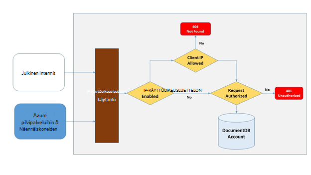

<properties
    pageTitle="DocumentDB palomuurin tuen | Microsoft Azure"
    description="Opettele käyttämään IP ohjausobjektin käytäntöjen palomuurin tuki Azure DocumentDB tietokannan tileihin."
    keywords="IP-käyttöoikeuksien valvonta, palomuurin tuki"
    services="documentdb"
    authors="shahankur11"
    manager="jhubbard"
    editor=""
    tags="azure-resource-manager"
    documentationCenter=""/>

<tags 
    ms.service="documentdb" 
    ms.workload="data-services" 
    ms.tgt_pltfrm="na" 
    ms.devlang="na" 
    ms.topic="article" 
    ms.date="10/17/2016" 
    ms.author="ankshah; kraman"/>

# DocumentDB palomuurin tuki

Suojaamiseen Azure DocumentDB tietokannan tilin tallennettuja tietoja, DocumentDB antama tuki salainen perusteella [luvan mallia](https://msdn.microsoft.com/library/azure/dn783368.aspx) , joka hyödyntää vahva Hash-based viestin todennus-koodin (HMAC). Salainen perustuvat todennus-mallin lisäksi DocumentDB tukee nyt, käytäntö perustuva IP-pohjaisen access ohjaa saapuvien palomuurin tuki. Tämä malli on hyvin samantyyppinen perinteisen tietokantojen palomuurisäännöt ja tarjoaa suojauksen DocumentDB tietokanta-tilille. Tämän mallin avulla voit määrittää DocumentDB tietokanta-tiliä voi käyttää vain koneet hyväksytyn joukko/tai cloud services. Hyväksytyt joukot koneet ja palvelujen DocumentDB resurssien käytön edellyttävät edelleen soittajan esittää kelvollinen todennus-tunnuksen.

## IP access hallinnan yleiskatsaus

Oletusarvon mukaan DocumentDB tietokanta-tili on käytettävissä olevat julkiset internet, kunhan pyyntö on liitettävä kelvollinen todennus-tunnuksen. Määritä IP-käytäntö käyttöoikeuksien hallinnassa, käyttäjän on määritettävä IP-osoitteet ja IP-osoitealueet CIDR lomakkeessa luetaan asiakkaan IP-osoitteet tietyn tietokannan tilin sallittujen luetteloon joukko. Tässä määrityksessä käytetään, kun kaikki palvelupyynnöt peräisin koneet ulkopuolella tämän sallittujen luetteloon estänyt palvelimeen.  Seuraavassa kaaviossa on kuvattu käsittelyn työnkulku IP-pohjaisen käytönvalvonta yhteys.

## Pilvipalveluihin yhteydet

Azure-pilvipalveluihin ovat yleisiä tapa, jolla isännöinnin Keskitaso palvelun logiikan DocumentDB avulla. Voit myöntää oikeuksia DocumentDB tietokannan tiliin cloud-palvelusta pilvipalvelussa julkiseen IP-osoite on lisättävä IP-osoitteiden DocumentDB tietokanta-tiliin yhdistetty ottamalla [yhteyttä tukipalveluun Azure](#configure-ip-policy)sallittujen luetteloon.  Tällä varmistetaan, että kaikki roolin esiintymät pilvipalveluihin on DocumentDB tietokannan tiliäsi. IP-osoitteiden voit hakea cloud Services-palvelut Azure-portaalissa, kuten seuraavassa näyttökuvassa. 

Voit skaalata pilvipalvelussa sijaitsevaan, lisäämällä muita roolin esiintymää, kyseiset uusia esiintymiä on DocumentDB tietokannan tilin käyttö automaattisesti, koska ne ovat osa samaa pilvipalvelussa.

## Näennäiskoneiden yhteydet

[Näennäiskoneiden](https://azure.microsoft.com/services/virtual-machines/) tai [virtuaalikoneen asteikko määrittää](../virtual-machine-scale-sets/virtual-machine-scale-sets-overview.md) myös voidaan isännöimiseen Keskitaso-palveluita käyttämällä DocumentDB.  Voit määrittää DocumentDB tietokannan tili käyttää näennäiskoneiden, julkisten IP-osoitteiden virtuaalikoneen ja/tai virtuaalikoneen asteikko määrittäminen on määritettävä yhtenä sallittujen IP-osoitteiden DocumentDB tietokannan tilin ottamalla [yhteyttä tukipalveluun Azure](#configure-ip-policy). IP-osoitteiden näennäiskoneiden Azure-portaalissa voit hakea seuraavista näyttökuvan esitetyllä tavalla.

Kun lisäät uusia virtuaalikoneen esiintymät ryhmään, ne annetaan automaattisesti DocumentDB tietokannan tiliäsi.

## Internet-yhteydet

Kun käytät DocumentDB tietokanta-tilin Internetissä tietokoneelta, asiakkaan IP-osoite tai IP-osoitealueita koneen on lisättävä IP-osoite DocumentDB tietokannan tilin sallittujen luetteloon. 

## IP-käyttöoikeuskäytännön määrittäminen

Käytä Azure portaalin tiedostoon [Azure](https://portal.azure.com/?#blade/Microsoft_Azure_Support/HelpAndSupportBlade) tukeen pyynnön IP käyttöoikeuskäytännön tietokanta-tilissä käyttöön.

1. Valitse **Uusi tue pyyntöä** [Ohjeen + tuki](https://portal.azure.com/?#blade/Microsoft_Azure_Support/HelpAndSupportBlade) -sivu.
2. Valitse **Uusi tue pyyntöä** , sivu **perusteet**.
3. Valitse **Perustiedot** -sivu seuraavasti:
    - **Ongelman tyyppi**: kiintiön
    - **Tilaus**: tili, johon haluat lisätä IP-käyttöoikeuskäytännön tilausta.
    - **Kiintiön tyyppi**: DocumentDB
    - **Tuen suunnitelman**: kiintiön tuki - levy.
4. **Ongelma** -sivu, toimi seuraavasti:
    - **Vakavuus**: Valitse C - mahdollisimman pieni vaikutus
    - **Tiedot**: kopioi-ruutuun seuraava teksti ja lisätä tilin nimi/s ja IP-osoite ja es: "Haluan tilini DocumentDB tietokantaan palomuurin tuen ottaminen käyttöön. Tietokannan tilin: *Sisällytä tilin nimi/s-näppäinyhdistelmää*. Sallitut IP-osoite tai alueita: *Sisällytä IP-osoitteen/alueen CIDR muodossa, esimerkiksi 13.91.6.132, 13.91.6.1/24*. "
    - Valitse **Seuraava**. 
5. Valitse **Yhteystiedot** -sivu yhteyshenkilön tietojen täyttö ja valitse **Luo**. 

Kun pyyntö on vastaanotettu, IP-käytönvalvonta tulisi olla käytössä 24 tunnin kuluessa. Saat ilmoituksen, kun kutsu on valmis.

## IP-käyttöoikeuskäytännön vianmääritys

### Portaalin toiminnot

Ottamalla IP käyttöoikeuskäytännön DocumentDB tietokannan tilin tiliisi DocumentDB tietokannan kaikki käytöltä koneet ulkopuolella määritetty sallitut IP-osoitealueet luettelo on estetty. Tämän mallin perusteella selaaminen-portaalista tietojen taso-toiminnon myös estetään käytönvalvonta eheyden. 

### SDK & Rest-Ohjelmointirajapinta

Jos tietoturvasyistä SDK tai REST API käytöltä tietokoneita sallittujen luetteloon ei voi palauttaa yleinen 404 ei löydy vastauksen ja muita tietoja ei ole. Varmista, että varmistaa oikean käytännön määrittämisessä käytetään DocumentDB tietokannan tilisi luettelo, joka on määritetty DocumentDB tietokannan tilin IP.

## Seuraavat vaiheet

Lisätietoja verkon liittyvät suorituskykyyn liittyviä vihjeitä artikkelissa [Vihjeitä tehokkuuden parantamiseksi](documentdb-performance-tips.md).