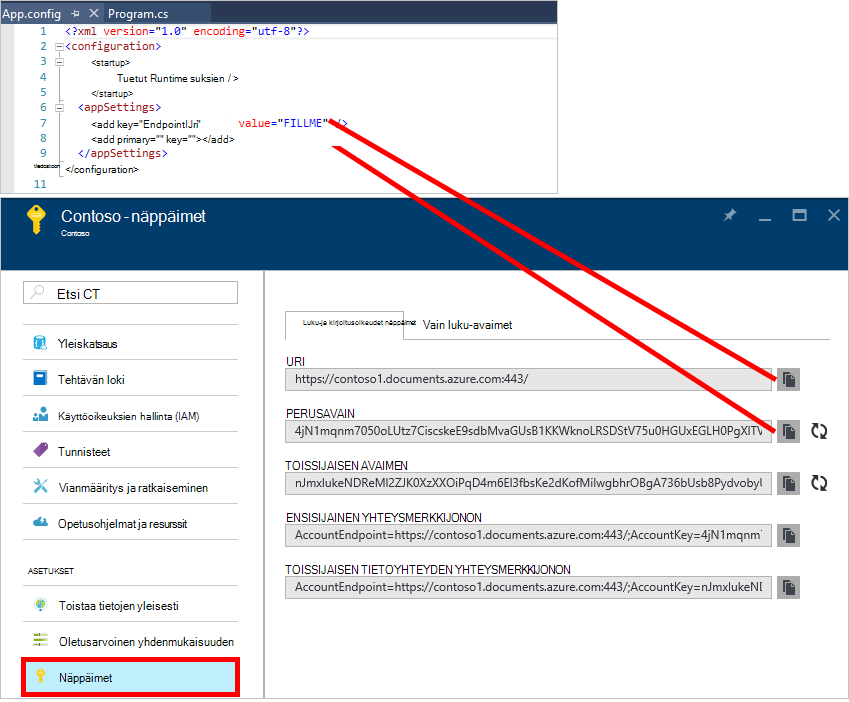
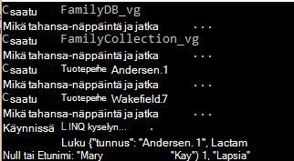
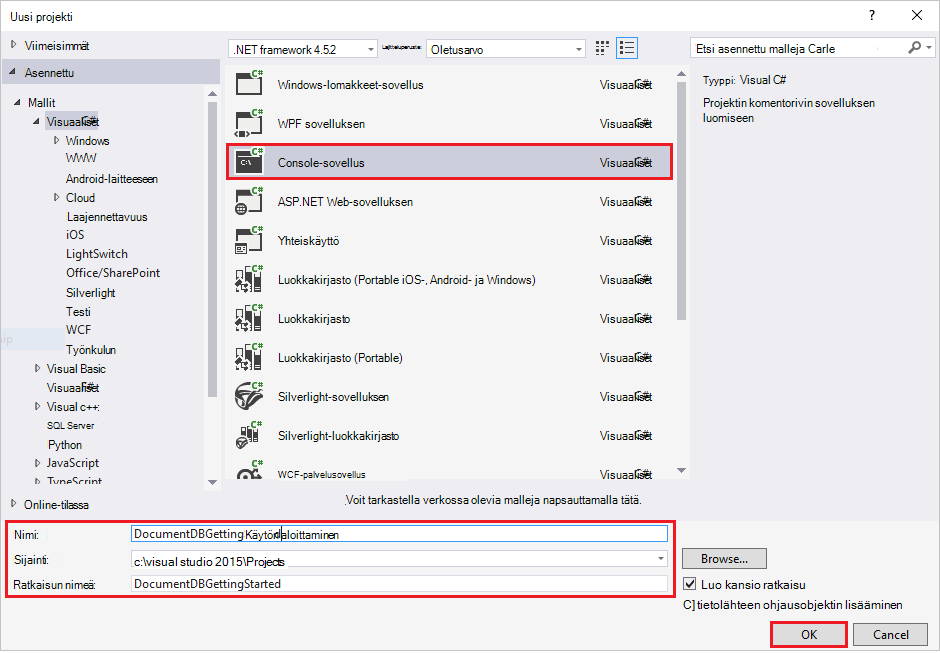
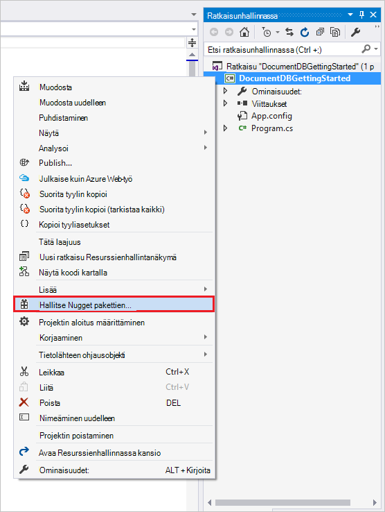
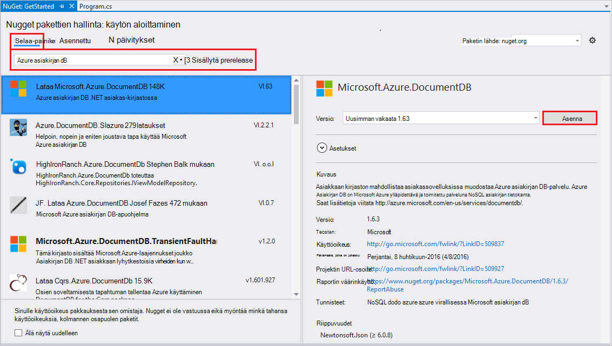
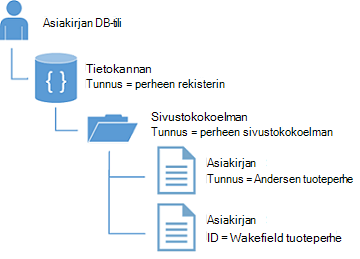
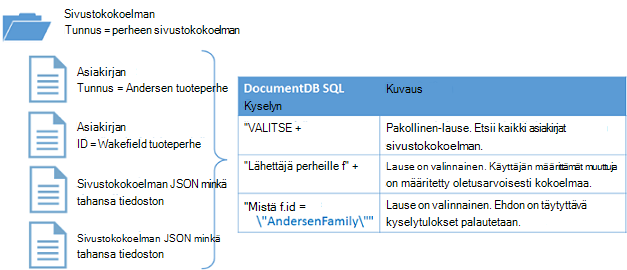

<properties
    pageTitle="NoSQL opetusohjelma: DocumentDB .NET SDK | Microsoft Azure"
    description="NoSQL opetusohjelma, joka luo online-tietokantaan ja C# console-sovelluksesta valitsemalla DocumentDB .NET SDK-paketissa. DocumentDB on JSON NoSQL tietokannan."
    keywords="opetusohjelmassa nosql online tietokannan c# console-sovellus"
    services="documentdb"
    documentationCenter=".net"
    authors="AndrewHoh"
    manager="jhubbard"
    editor="monicar"/>

<tags
    ms.service="documentdb"
    ms.workload="data-services"
    ms.tgt_pltfrm="na"
    ms.devlang="dotnet"
    ms.topic="hero-article"
    ms.date="09/01/2016"
    ms.author="anhoh"/>

# NoSQL opetusohjelma: Muodosta DocumentDB C# console-sovellus

> [AZURE.SELECTOR]
- [.NET](documentdb-get-started.md)
- [Node.js](documentdb-nodejs-get-started.md)

Tervetuloa Azure DocumentDB .NET SDK NoSQL opetusohjelman! Pikaopas projektin käytön tai täyttämällä opetusohjelma, jälkeen on console-sovelluksella, joka luo ja kyselyjen DocumentDB resursseja.

- **[Pikaopas](#quickstart)**: Lataa malli project ja lisää yhteystietosi DocumentDB-sovellus, joka on pienempi kuin 10 minuutin käynnissä.
- **[Opetusohjelma](#tutorial)**: luominen alusta alkaen pikaopas-sovelluksen puolessa tunnissa.

## Edellytykset

- Azure active tili. Jos sinulla ei ole, voit rekisteröityä [ilmaisen tilin](https://azure.microsoft.com/free/).
- [Visual Studio 2013: n tai Visual Studio 2015](http://www.visualstudio.com/).
- .NET framework 4.6

## Pikaopas

1. Lataa malli projektin .zip [GitHub](https://github.com/Azure-Samples/documentdb-dotnet-getting-started-quickstart/archive/master.zip) tai Kloonaa [documentdb-dotnet-käytön-aloittaminen-pikaopas](https://github.com/Azure-Samples/documentdb-dotnet-getting-started-quickstart) repo.
2. Käytä [DocumentDB-tilin luominen](documentdb-create-account.md)Azure-portaalissa.
3. Korvaa EndpointUri ja PrimaryKey arvot Siirtyminen **DocumentDB (NoSQL)** -sivu, valitse valitsemalla **tilin nimi**ja valitsemalla sitten resurssi-valikon **näppäimet** [Azure portal](https://portal.azure.com/)noutamat arvot App.config-tiedostoa.
    
4. Luo projekti. Konsoli-ikkuna näyttää uudet resurssit on luotu, kysely ja valitse Siivotaan.
    
    

## Opetusohjelma

Tässä opetusohjelmassa esitellään DocumentDB tietokannan, DocumentDB sivustokokoelman ja JSON-tiedostojen luominen. Sitten kyselyn keräämistä, ja Järjestä ja Poista tietokanta. Tässä opetusohjelmassa muodostaa pikaopas projektin samalla projektin, mutta muodosta se vaiheittainen ja saavat kuvaus siitä, että olet lisäämässä projektin koodi.

## Vaihe 1: DocumentDB-tilin luominen

Luo DocumentDB-tili. Jos sinulla on jo tili, jota haluat käyttää, siirry eteenpäin [Visual Studio-ratkaisun asennuksen](#SetupVS).

[AZURE.INCLUDE [documentdb-create-dbaccount](../../includes/documentdb-create-dbaccount.md)]

## Vaihe 2: Määritä Visual Studio-ratkaisuun

1. Avaa **Visual Studio 2015** tietokoneeseen.
2. Valitse **Tiedosto** -valikosta **Uusi**ja valitse **projektin**.
3. Valitse **Uusi projekti** -valintaikkunasta **malleja** / **Visual C#** / **Konsolisovelluksen**projektin nimi ja valitse sitten **OK**.

4. Napsauta **Ratkaisunhallinnassa**hiiren kakkospainikkeella uuden konsolin sovelluksessa Visual Studio-ratkaisun alla.
5. Valitse poistumatta valikko Valitse **Hallitse NuGet pakettien...** 
 
6. Valitse **Nuget** -välilehdessä valitsemalla **Selaa**ja kirjoita **azure documentdb** hakuruutuun.
7. Tulokset Etsi **Microsoft.Azure.DocumentDB** ja valitse **Asenna**.
DocumentDB asiakkaan kirjaston Pakettitunnus on [Microsoft.Azure.DocumentDB](https://www.nuget.org/packages/Microsoft.Azure.DocumentDB)

Upea! Nyt kun asennus on valmis, aloitetaan lisäkoodin kirjoitettaessa. Löydät valmiit koodiprojektin Tässä opetusohjelmassa [GitHub](https://github.com/Azure-Samples/documentdb-dotnet-getting-started/blob/master/src/Program.cs).

## Vaihe 3: Yhdistä DocumentDB-tiliin

Lisää ensin Program.cs tiedoston viittaukset C# sovelluksen alkuun:

    using System;
    using System.Linq;
    using System.Threading.Tasks;

    // ADD THIS PART TO YOUR CODE
    using System.Net;
    using Microsoft.Azure.Documents;
    using Microsoft.Azure.Documents.Client;
    using Newtonsoft.Json;

> [AZURE.IMPORTANT] Jotta voit suorittaa NoSQL Tässä opetusohjelmassa, varmista, että edellä riippuvuudet.

Lisää seuraavaksi nämä kaksi vakioita ja *asiakas* -muuttuja julkisen luokan *ohjelman*alapuolella.

    public class Program
    {
        // ADD THIS PART TO YOUR CODE
        private const string EndpointUri = "<your endpoint URI>";
        private const string PrimaryKey = "<your key>";
        private DocumentClient client;

Seuraavaksi pää [Azure Portal](https://portal.azure.com) hakemiseen URI ja perusavain. Perusavain ja DocumentDB URI tarvitaan sovelluksen selvittääksesi, missä muodostaa yhteyden ja DocumentDB luotetaanko sovelluksen yhteys.

Azure-portaalissa Siirry DocumentDB-tilisi ja valitse sitten **näppäimiä**.

Kopioi URI-portaalista ja liitä ne yhdeksi `<your endpoint URI>` program.cs-tiedostossa. Valitse Kopioi PERUSAVAIMEN portaalin ja liitä se kyselyjä `<your key>`.

![Näyttökuva käyttämä NoSQL opetusohjelman C#-konsolisovelluksen luominen Azure-portaalissa. DocumentDB-tili näkyy korostettuna AKTIIVISTA keskittimeen, NÄPPÄIMET-painike korostettuna DocumentDB tili-sivu ja URI, ensisijainen ja toissijainen AVAIMEN arvot korostettuna näppäimet-sivu][keys]

Asetetaan ensin hakeminen aloittaminen sovelluksen luomalla uuden esiintymän **DocumentClient**.

Alla **Main** -menetelmä lisää tämä uusi asynkroninen tehtävä kutsutaan **GetStartedDemo**, joka vahvistaa Microsoftin uusi **DocumentClient**.

    static void Main(string[] args)
    {
    }

    // ADD THIS PART TO YOUR CODE
    private async Task GetStartedDemo()
    {
        this.client = new DocumentClient(new Uri(EndpointUri), PrimaryKey);
    }

Lisää seuraava koodi asynkroninen tehtävän suorittaminen **Main** -menetelmää. **Pää** -menetelmä todellisen poikkeukset ja kirjoittaa ne konsolin.

    static void Main(string[] args)
    {
            // ADD THIS PART TO YOUR CODE
            try
            {
                    Program p = new Program();
                    p.GetStartedDemo().Wait();
            }
            catch (DocumentClientException de)
            {
                    Exception baseException = de.GetBaseException();
                    Console.WriteLine("{0} error occurred: {1}, Message: {2}", de.StatusCode, de.Message, baseException.Message);
            }
            catch (Exception e)
            {
                    Exception baseException = e.GetBaseException();
                    Console.WriteLine("Error: {0}, Message: {1}", e.Message, baseException.Message);
            }
            finally
            {
                    Console.WriteLine("End of demo, press any key to exit.");
                    Console.ReadKey();
            }

Painamalla **F5** oman sovelluksen käyttämiseen.

Onnittelen! Onnistuneesti yhdistettyjä DocumentDB-tili, voit tarkastella DocumentDB resurssien käyttäminen nyt.  

## Vaihe 4: Tietokannan luominen
Ennen kuin lisäät koodin tietokannan luomiseen, Lisää apuohjelma menetelmän konsoliin kirjoittamista varten.

Kopioi ja liitä alapuolella **GetStartedDemo** menetelmä **WriteToConsoleAndPromptToContinue** -menetelmää.

    // ADD THIS PART TO YOUR CODE
    private void WriteToConsoleAndPromptToContinue(string format, params object[] args)
    {
            Console.WriteLine(format, args);
            Console.WriteLine("Press any key to continue ...");
            Console.ReadKey();
    }

DocumentDB [tietokannan](documentdb-resources.md#databases) voi luoda **DocumentClient** luokan [CreateDatabaseAsync](https://msdn.microsoft.com/library/microsoft.azure.documents.client.documentclient.createdatabaseasync.aspx) -menetelmällä. Tietokanta on looginen säilö JSON asiakirjan tallennustilaa osioitu yli sivustokokoelmat.

Kopioi ja liitä alapuolella **WriteToConsoleAndPromptToContinue** menetelmä **CreateDatabaseIfNotExists** -menetelmää.

    // ADD THIS PART TO YOUR CODE
    private async Task CreateDatabaseIfNotExists(string databaseName)
    {
            // Check to verify a database with the id=FamilyDB does not exist
            try
            {
                    await this.client.ReadDatabaseAsync(UriFactory.CreateDatabaseUri(databaseName));
                    this.WriteToConsoleAndPromptToContinue("Found {0}", databaseName);
            }
            catch (DocumentClientException de)
            {
                    // If the database does not exist, create a new database
                    if (de.StatusCode == HttpStatusCode.NotFound)
                    {
                            await this.client.CreateDatabaseAsync(new Database { Id = databaseName });
                            this.WriteToConsoleAndPromptToContinue("Created {0}", databaseName);
                    }
                    else
                    {
                            throw;
                    }
            }
    }

Kopioi ja liitä seuraava koodi **GetStartedDemo** -menetelmää asiakkaan luomisen alapuolella. Tämä luo tietokanta nimeltä *FamilyDB*.

    private async Task GetStartedDemo()
    {
        this.client = new DocumentClient(new Uri(EndpointUri), PrimaryKey);

        // ADD THIS PART TO YOUR CODE
        await this.CreateDatabaseIfNotExists("FamilyDB_va");

Painamalla **F5** oman sovelluksen käyttämiseen.

Onnittelen! Olet luonut DocumentDB tietokannan.  

## Vaihe 5: Luo kokoelma  

> [AZURE.WARNING] **CreateDocumentCollectionAsync** Luo uusi sivustokokoelman varattu siirtonopeuden, jonka on hinnat vaikutukset. Lisätietoja käy Microsoftin [hinnat sivun](https://azure.microsoft.com/pricing/details/documentdb/).

[Sivustokokoelman](documentdb-resources.md#collections) voi luoda **DocumentClient** luokan [CreateDocumentCollectionAsync](https://msdn.microsoft.com/library/microsoft.azure.documents.client.documentclient.createdocumentcollectionasync.aspx) -menetelmällä. Kokoelma on JSON asiakirjojen ja liittyvän JavaScript-sovelluksen logiikkaa säilö.

Kopioi ja liitä alapuolella **CreateDatabaseIfNotExists** menetelmä **CreateDocumentCollectionIfNotExists** -menetelmää.

    // ADD THIS PART TO YOUR CODE
    private async Task CreateDocumentCollectionIfNotExists(string databaseName, string collectionName)
    {
        try
        {
            await this.client.ReadDocumentCollectionAsync(UriFactory.CreateDocumentCollectionUri(databaseName, collectionName));
            this.WriteToConsoleAndPromptToContinue("Found {0}", collectionName);
        }
        catch (DocumentClientException de)
        {
            // If the document collection does not exist, create a new collection
            if (de.StatusCode == HttpStatusCode.NotFound)
            {
                DocumentCollection collectionInfo = new DocumentCollection();
                collectionInfo.Id = collectionName;

                // Configure collections for maximum query flexibility including string range queries.
                collectionInfo.IndexingPolicy = new IndexingPolicy(new RangeIndex(DataType.String) { Precision = -1 });

                // Here we create a collection with 400 RU/s.
                await this.client.CreateDocumentCollectionAsync(
                    UriFactory.CreateDatabaseUri(databaseName),
                    collectionInfo,
                    new RequestOptions { OfferThroughput = 400 });

                this.WriteToConsoleAndPromptToContinue("Created {0}", collectionName);
            }
            else
            {
                throw;
            }
        }
    }

Kopioi ja liitä seuraava koodi **GetStartedDemo** -menetelmän tietokannan luonti alapuolella. Tämä luo *FamilyCollection_va*-niminen asiakirja-sivustokokoelman.

        this.client = new DocumentClient(new Uri(EndpointUri), PrimaryKey);

        await this.CreateDatabaseIfNotExists("FamilyDB_oa");

        // ADD THIS PART TO YOUR CODE
        await this.CreateDocumentCollectionIfNotExists("FamilyDB_va", "FamilyCollection_va");

Painamalla **F5** oman sovelluksen käyttämiseen.

Onnittelen! Olet luonut DocumentDB asiakirjan kokoelman.  

## Vaihe 6: JSON-tiedostojen luominen
[Asiakirjan](documentdb-resources.md#documents) voi luoda **DocumentClient** luokan [CreateDocumentAsync](https://msdn.microsoft.com/library/microsoft.azure.documents.client.documentclient.createdocumentasync.aspx) -menetelmällä. Käyttäjän määrittämät (haluamaansa) JSON sisältö on tiedostoja. Yhden tai usean asiakirjan nyt voit lisätä. Jos sinulla on jo tietoja, jotka haluat tallentaa tietokannan, voit käyttää DocumentDB käyttäjän [tietojen siirtotyökalua käytetään](documentdb-import-data.md).

Ensin on **perhe** -luokka, joka edustaa tallennettuna DocumentDB tässä esimerkissä-objektien luomiseen. **Ylemmän tason** **lapsen** **Pet**, **osoite** aliluokkien, joita käytetään **tuoteperheen**sisällä myös luoda. Huomaa, että tiedostojen on oltava muuntaa sarjaksi JSON- **id** - **tunnus** -ominaisuus. Luo kyseisten luokkien lisäämällä sisäinen aliraportti luokkien **GetStartedDemo** tavan jälkeen.

Kopioi ja liitä **perheen**, **pää**, **lapsen**, **Pet**ja **osoite** luokkien **WriteToConsoleAndPromptToContinue** menetelmä alapuolella.

    private void WriteToConsoleAndPromptToContinue(string format, params object[] args)
    {
        Console.WriteLine(format, args);
        Console.WriteLine("Press any key to continue ...");
        Console.ReadKey();
    }

    // ADD THIS PART TO YOUR CODE
    public class Family
    {
        [JsonProperty(PropertyName = "id")]
        public string Id { get; set; }
        public string LastName { get; set; }
        public Parent[] Parents { get; set; }
        public Child[] Children { get; set; }
        public Address Address { get; set; }
        public bool IsRegistered { get; set; }
        public override string ToString()
        {
                return JsonConvert.SerializeObject(this);
        }
    }

    public class Parent
    {
        public string FamilyName { get; set; }
        public string FirstName { get; set; }
    }

    public class Child
    {
        public string FamilyName { get; set; }
        public string FirstName { get; set; }
        public string Gender { get; set; }
        public int Grade { get; set; }
        public Pet[] Pets { get; set; }
    }

    public class Pet
    {
        public string GivenName { get; set; }
    }

    public class Address
    {
        public string State { get; set; }
        public string County { get; set; }
        public string City { get; set; }
    }

Kopioi ja liitä alapuolella **CreateDocumentCollectionIfNotExists** menetelmä **CreateFamilyDocumentIfNotExists** -menetelmää.

    // ADD THIS PART TO YOUR CODE
    private async Task CreateFamilyDocumentIfNotExists(string databaseName, string collectionName, Family family)
    {
        try
        {
            await this.client.ReadDocumentAsync(UriFactory.CreateDocumentUri(databaseName, collectionName, family.Id));
            this.WriteToConsoleAndPromptToContinue("Found {0}", family.Id);
        }
        catch (DocumentClientException de)
        {
            if (de.StatusCode == HttpStatusCode.NotFound)
            {
                await this.client.CreateDocumentAsync(UriFactory.CreateDocumentCollectionUri(databaseName, collectionName), family);
                this.WriteToConsoleAndPromptToContinue("Created Family {0}", family.Id);
            }
            else
            {
                throw;
            }
        }
    }

Ja Lisää kahden asiakirjan Andersen perhe ja ystävät-tason Wakefield yksi kullekin.

Kopioi ja liitä seuraava koodi **GetStartedDemo** -menetelmän tiedoston sivustokokoelman luominen alapuolella.

    await this.CreateDatabaseIfNotExists("FamilyDB_va");

    await this.CreateDocumentCollectionIfNotExists("FamilyDB_va", "FamilyCollection_va");

    // ADD THIS PART TO YOUR CODE
    Family andersenFamily = new Family
    {
            Id = "Andersen.1",
            LastName = "Andersen",
            Parents = new Parent[]
            {
                    new Parent { FirstName = "Thomas" },
                    new Parent { FirstName = "Mary Kay" }
            },
            Children = new Child[]
            {
                    new Child
                    {
                            FirstName = "Henriette Thaulow",
                            Gender = "female",
                            Grade = 5,
                            Pets = new Pet[]
                            {
                                    new Pet { GivenName = "Fluffy" }
                            }
                    }
            },
            Address = new Address { State = "WA", County = "King", City = "Seattle" },
            IsRegistered = true
    };

    await this.CreateFamilyDocumentIfNotExists("FamilyDB_va", "FamilyCollection_va", andersenFamily);

    Family wakefieldFamily = new Family
    {
            Id = "Wakefield.7",
            LastName = "Wakefield",
            Parents = new Parent[]
            {
                    new Parent { FamilyName = "Wakefield", FirstName = "Robin" },
                    new Parent { FamilyName = "Miller", FirstName = "Ben" }
            },
            Children = new Child[]
            {
                    new Child
                    {
                            FamilyName = "Merriam",
                            FirstName = "Jesse",
                            Gender = "female",
                            Grade = 8,
                            Pets = new Pet[]
                            {
                                    new Pet { GivenName = "Goofy" },
                                    new Pet { GivenName = "Shadow" }
                            }
                    },
                    new Child
                    {
                            FamilyName = "Miller",
                            FirstName = "Lisa",
                            Gender = "female",
                            Grade = 1
                    }
            },
            Address = new Address { State = "NY", County = "Manhattan", City = "NY" },
            IsRegistered = false
    };

    await this.CreateFamilyDocumentIfNotExists("FamilyDB_va", "FamilyCollection_va", wakefieldFamily);

Painamalla **F5** oman sovelluksen käyttämiseen.

Onnittelen! Olet luonut kaksi DocumentDB asiakirjaa.  

##Vaihe 7: Kyselyn DocumentDB resurssit

DocumentDB tukee monipuolisia [kyselyjen](documentdb-sql-query.md) JSON valikoimien tallennettuja asiakirjoja.  Seuraava esimerkki koodi näkyy eri kyselyjen - sekä DocumentDB SQL-syntaksi sekä LINQ - että olemme suorittamisen vastaan asiakirjat on lisätty edellisessä vaiheessa.

Kopioi ja liitä alapuolella **CreateFamilyDocumentIfNotExists** menetelmä **ExecuteSimpleQuery** -menetelmää.

    // ADD THIS PART TO YOUR CODE
    private void ExecuteSimpleQuery(string databaseName, string collectionName)
    {
        // Set some common query options
        FeedOptions queryOptions = new FeedOptions { MaxItemCount = -1 };

            // Here we find the Andersen family via its LastName
            IQueryable<Family> familyQuery = this.client.CreateDocumentQuery<Family>(
                    UriFactory.CreateDocumentCollectionUri(databaseName, collectionName), queryOptions)
                    .Where(f => f.LastName == "Andersen");

            // The query is executed synchronously here, but can also be executed asynchronously via the IDocumentQuery<T> interface
            Console.WriteLine("Running LINQ query...");
            foreach (Family family in familyQuery)
            {
                    Console.WriteLine("\tRead {0}", family);
            }

            // Now execute the same query via direct SQL
            IQueryable<Family> familyQueryInSql = this.client.CreateDocumentQuery<Family>(
                    UriFactory.CreateDocumentCollectionUri(databaseName, collectionName),
                    "SELECT * FROM Family WHERE Family.LastName = 'Andersen'",
                    queryOptions);

            Console.WriteLine("Running direct SQL query...");
            foreach (Family family in familyQueryInSql)
            {
                    Console.WriteLine("\tRead {0}", family);
            }

            Console.WriteLine("Press any key to continue ...");
            Console.ReadKey();
    }

Kopioi ja liitä seuraava koodi **GetStartedDemo** -menetelmän toisen tiedoston luominen alapuolella.

    await this.CreateFamilyDocumentIfNotExists("FamilyDB_va", "FamilyCollection_va", wakefieldFamily);

    // ADD THIS PART TO YOUR CODE
    this.ExecuteSimpleQuery("FamilyDB_va", "FamilyCollection_va");

Painamalla **F5** oman sovelluksen käyttämiseen.

Onnittelen! On onnistuneesti kyselyitä vastaan DocumentDB sivustokokoelman.

Seuraavassa kaaviossa on kuvattu, miten kyselysyntaksia kutsutaan vastaan luomasi sivustokokoelman DocumentDB SQL ja saman liiketoimintalogiikka koskee myös LINQ kyselyn.

[FROM](documentdb-sql-query.md#from-clause) -avainsanan on valinnainen kyselyssä, koska DocumentDB kyselyt on jo rajattu yhden sivustokokoelman. Tämän vuoksi "Lähettäjä perheille f" Voit vaihtamista "pääkansio r-kirjaimella tai muita muuttujan nimi voit valita. DocumentDB tulevat johtaa kyseisen perheille, pääkansion tai muuttujan nimi, jonka valitsit, viittaus kokoelman oletusarvoisesti.

##Vaihe 8: Korvaa JSON-asiakirja

DocumentDB tukee korvaaminen JSON-tiedostoja.  

Kopioi ja liitä alapuolella **ExecuteSimpleQuery** menetelmä **ReplaceFamilyDocument** -menetelmää.

    // ADD THIS PART TO YOUR CODE
    private async Task ReplaceFamilyDocument(string databaseName, string collectionName, string familyName, Family updatedFamily)
    {
        try
        {
            await this.client.ReplaceDocumentAsync(UriFactory.CreateDocumentUri(databaseName, collectionName, familyName), updatedFamily);
            this.WriteToConsoleAndPromptToContinue("Replaced Family {0}", familyName);
        }
        catch (DocumentClientException de)
        {
            throw;
        }
    }

Kopioi ja liitä seuraava koodi **GetStartedDemo** -menetelmän alapuolella kyselyn suorittamista. Sen jälkeen korvata tiedoston, tämä suorittaa saman kyselyn uudelleen, jos haluat tarkastella muutetun asiakirjan.

    await this.CreateFamilyDocumentIfNotExists("FamilyDB_va", "FamilyCollection_va", wakefieldFamily);

    this.ExecuteSimpleQuery("FamilyDB_va", "FamilyCollection_va");

    // ADD THIS PART TO YOUR CODE
    // Update the Grade of the Andersen Family child
    andersenFamily.Children[0].Grade = 6;

    await this.ReplaceFamilyDocument("FamilyDB_va", "FamilyCollection_va", "Andersen.1", andersenFamily);

    this.ExecuteSimpleQuery("FamilyDB_va", "FamilyCollection_va");

Painamalla **F5** oman sovelluksen käyttämiseen.

Onnittelen! DocumentDB asiakirjan korvaaminen onnistui.

##Vaihe 9: Poista JSON-asiakirja

DocumentDB tukee poistaminen JSON-tiedostoja.  

Kopioi ja liitä alapuolella **ReplaceFamilyDocument** menetelmä **DeleteFamilyDocument** -menetelmää.

    // ADD THIS PART TO YOUR CODE
    private async Task DeleteFamilyDocument(string databaseName, string collectionName, string documentName)
    {
        try
        {
            await this.client.DeleteDocumentAsync(UriFactory.CreateDocumentUri(databaseName, collectionName, documentName));
            Console.WriteLine("Deleted Family {0}", documentName);
        }
        catch (DocumentClientException de)
        {
            throw;
        }
    }

Kopioi ja liitä seuraava koodi **GetStartedDemo** -menetelmän alapuolella toisen kyselyn suorittamista.

    await this.ReplaceFamilyDocument("FamilyDB_va", "FamilyCollection_va", "Andersen.1", andersenFamily);

    this.ExecuteSimpleQuery("FamilyDB_va", "FamilyCollection_va");

    // ADD THIS PART TO CODE
    await this.DeleteFamilyDocument("FamilyDB_va", "FamilyCollection_va", "Andersen.1");

Painamalla **F5** oman sovelluksen käyttämiseen.

Onnittelen! Olet poistanut onnistuneesti DocumentDB asiakirjan.

##Vaihe 10: Tietokannan poistaminen

Luodun tietokannan poistaminen poistaa tietokannan ja kaikki lasten resurssit (esimerkiksi sivustokokoelmat, tiedostot).

Kopioi ja liitä seuraava koodi **GetStartedDemo** -menetelmän alapuolella asiakirjan Poista Poista, koko tietokanta ja kaikki lasten resurssit.

    this.ExecuteSimpleQuery("FamilyDB_va", "FamilyCollection_va");

    await this.DeleteFamilyDocument("FamilyDB_va", "FamilyCollection_va", "Andersen.1");

    // ADD THIS PART TO CODE
    // Clean up/delete the database
    await this.client.DeleteDatabaseAsync(UriFactory.CreateDatabaseUri("FamilyDB_va"));

Painamalla **F5** oman sovelluksen käyttämiseen.

Onnittelen! Olet poistanut onnistuneesti DocumentDB tietokannan.

##Vaihe 11: Suorita C# konsolin sovelluksesi kaikki yhdessä!

Painamalla F5 Visual Studiossa luonnissa sovelluksen virheenkorjaus-tilassa.

Raportissa pitäisi näkyä get aloittaminen sovelluksen tulos. Tulos näkyy kyselyt on lisätty ja pitäisi täsmätä alla esimerkkiteksti tulokset.

    Created FamilyDB_va
    Press any key to continue ...
    Created FamilyCollection_va
    Press any key to continue ...
    Created Family Andersen.1
    Press any key to continue ...
    Created Family Wakefield.7
    Press any key to continue ...
    Running LINQ query...
        Read {"id":"Andersen.1","LastName":"Andersen","District":"WA5","Parents":[{"FamilyName":null,"FirstName":"Thomas"},{"FamilyName":null,"FirstName":"Mary Kay"}],"Children":[{"FamilyName":null,"FirstName":"Henriette Thaulow","Gender":"female","Grade":5,"Pets":[{"GivenName":"Fluffy"}]}],"Address":{"State":"WA","County":"King","City":"Seattle"},"IsRegistered":true}
    Running direct SQL query...
        Read {"id":"Andersen.1","LastName":"Andersen","District":"WA5","Parents":[{"FamilyName":null,"FirstName":"Thomas"},{"FamilyName":null,"FirstName":"Mary Kay"}],"Children":[{"FamilyName":null,"FirstName":"Henriette Thaulow","Gender":"female","Grade":5,"Pets":[{"GivenName":"Fluffy"}]}],"Address":{"State":"WA","County":"King","City":"Seattle"},"IsRegistered":true}
    Replaced Family Andersen.1
    Press any key to continue ...
    Running LINQ query...
        Read {"id":"Andersen.1","LastName":"Andersen","District":"WA5","Parents":[{"FamilyName":null,"FirstName":"Thomas"},{"FamilyName":null,"FirstName":"Mary Kay"}],"Children":[{"FamilyName":null,"FirstName":"Henriette Thaulow","Gender":"female","Grade":6,"Pets":[{"GivenName":"Fluffy"}]}],"Address":{"State":"WA","County":"King","City":"Seattle"},"IsRegistered":true}
    Running direct SQL query...
        Read {"id":"Andersen.1","LastName":"Andersen","District":"WA5","Parents":[{"FamilyName":null,"FirstName":"Thomas"},{"FamilyName":null,"FirstName":"Mary Kay"}],"Children":[{"FamilyName":null,"FirstName":"Henriette Thaulow","Gender":"female","Grade":6,"Pets":[{"GivenName":"Fluffy"}]}],"Address":{"State":"WA","County":"King","City":"Seattle"},"IsRegistered":true}
    Deleted Family Andersen.1
    End of demo, press any key to exit.

Onnittelen! Prosenttiosuuden NoSQL Tässä opetusohjelmassa ja on työskentelyä C# console-sovellus!

## Seuraavat vaiheet

- Haluatko monimutkaisia ASP.NET MVC NoSQL-opetusohjelma? Katso [web-sovelluksen kanssa käyttämällä DocumentDB ASP.NET-MVC luominen](documentdb-dotnet-application.md).
- Jos haluat suorittaa asteikko ja suorituskyvyn testaaminen oikeilla DocumentDB Katso [Suorituskyky ja skaalattavuus testaaminen oikeilla Azure DocumentDB](documentdb-performance-testing.md)
-   Lue, miten [näytön DocumentDB-tili](documentdb-monitor-accounts.md).
-   Suorittaa kyselyjä [Kyselyn leikkikenttä](https://www.documentdb.com/sql/demo)otoksen Microsoftin dataset.
-   Lisätietoja ohjelmoinnin mallin [DocumentDB ohjeet sivun](https://azure.microsoft.com/documentation/services/documentdb/)kehittäminen-osassa.

[documentdb-create-account]: documentdb-create-account.md
[documentdb-manage]: documentdb-manage.md
[keys]: media/documentdb-get-started-quickstart/nosql-tutorial-keys.png

