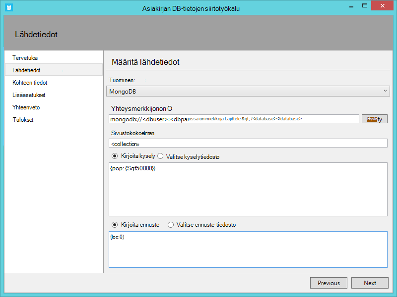
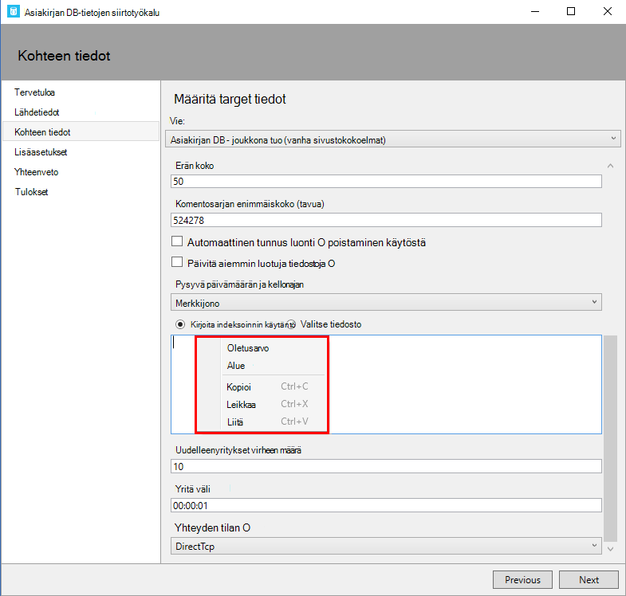

<properties
    pageTitle="Tietokannan siirtotyökalun DocumentDB | Microsoft Azure"
    description="Opettele DocumentDB tietojen tuominen eri lähteistä, mukaan lukien MongoDB, SQL Server taulukon tallennustilaa, Amazon DynamoDB, CSV tai JSON tiedostot Avaa lähde DocumentDB tietojen siirto-työkalujen avulla. JSON-muunnos CSV."
    keywords="CSV json-siirron Tietokantatyökalut muuntaminen csv json"
    services="documentdb"
    authors="andrewhoh"
    manager="jhubbard"
    editor="monicar"
    documentationCenter=""/>

<tags
    ms.service="documentdb"
    ms.workload="data-services"
    ms.tgt_pltfrm="na"
    ms.devlang="na"
    ms.topic="article"
    ms.date="10/06/2016"
    ms.author="anhoh"/>

# Tietojen tuominen DocumentDB tietokannan siirto-työkalulla

Tässä artikkelissa kerrotaan, miten [Microsoft Azure DocumentDB](https://azure.microsoft.com/services/documentdb/) tietojen tuominen eri lähteistä, kuten JSON-tiedostoja, CSV-tiedostoja, SQL, MongoDB, Azure-taulukkotallennus, Amazon DynamoDB ja DocumentDB sivustokokoelmat virallinen Avaa lähde DocumentDB tietojen siirtotyökalun avulla.

Luettuasi tämän artikkelin pystyt seuraaviin kysymyksiin:  

-   Miten voin tuoda JSON-tiedoston, CSV-tiedoston, SQL Serverin tietoihin tai tietojen MongoDB DocumentDB?
-   Miten voin tuoda tietoja Azure-taulukosta tallentaminen, Amazon DynamoDB ja HBase, DocumentDB?
-   Kuinka voit siirtää tietoja DocumentDB sivustokokoelmat välillä?

##Edellytykset

Ennen kuin noudattamalla tämän artikkelin, varmista, että sinulla on asennettuna seuraavat:

- [Microsoft .NET Framework 4.51](https://www.microsoft.com/download/developer-tools.aspx) tai uudempi versio.

##DocumentDB tietojen siirtotyökalun yleiskatsaus

DocumentDB tietojen siirtotyökalun on Avaa lähde-ratkaisun, joka tuo DocumentDB tietoja useista eri lähteistä, mukaan lukien:

- JSON-tiedostot
- MongoDB
- SQL Server
- CSV-tiedostoja
- Azure-taulukkotallennus
- Amazon DynamoDB
- HBase
- DocumentDB sivustokokoelmat

Kun tuonti-työkalussa graafisessa käyttöliittymässä (dtui.exe), se voi myös määräydy komentoriviltä (dt.exe). Itse asiassa on vaihtoehto tulosteen yhdistetty komento Käyttöliittymän välityksellä tuonti määrittämisen jälkeen. Taulukkomuotoinen lähdetietojen (kuten SQL Server- tai CSV-tiedostoja) voidaan muuntaa siten, että hierarkkisia suhteita (aliasiakirjoja) voidaan luoda tuonnin aikana. Jatka eteenpäin, Lue lisää tietolähteen asetukset, malli-komento viivoja ja tuoda kunkin tietolähteen, kohdesivuston asetukset ja tarkasteleminen tuo tulokset.

##DocumentDB tietojen siirtotyökalun asentaminen

Siirron tool-lähdekoodi on käytettävissä GitHub [Tässä](https://github.com/azure/azure-documentdb-datamigrationtool) säilössä ja käännetty versio on saatavana [Microsoft Download](http://www.microsoft.com/downloads/details.aspx?FamilyID=cda7703a-2774-4c07-adcc-ad02ddc1a44d)Centeristä. Voi joko kääntää ratkaisun itse tai vain ladata ja Pura valittua kansioon käännetty versio. Suorita jompikumpi:

- **Dtui.exe**: graafisessa käyttöliittymässä työkalun versio
- **DT.exe**: komentorivin työkalun versio

##JSON-tiedostojen tuonti

JSON tiedosto lähde tuonti-vaihtoehdon avulla voit tuo yksi tai useita yksittäisiä asiakirjoja JSON tiedostoja tai JSON-tiedostoja, että jokainen sisältää matriisin JSON asiakirjoja. Kun lisäät kansiot, jotka sisältävät JSON-tiedostoja, voit tuoda, voit halutessasi rekursiivisesti hakeminen tiedostoja alikansioon.

Seuraavassa on tuomaan JSON tiedostoja komentoriviltä muutamia esimerkkejä:

    #Import a single JSON file
    dt.exe /s:JsonFile /s.Files:.\Sessions.json /t:DocumentDBBulk /t.ConnectionString:"AccountEndpoint=<DocumentDB Endpoint>;AccountKey=<DocumentDB Key>;Database=<DocumentDB Database>;" /t.Collection:Sessions /t.CollectionThroughput:2500

    #Import a directory of JSON files
    dt.exe /s:JsonFile /s.Files:C:\TESessions\*.json /t:DocumentDBBulk /t.ConnectionString:" AccountEndpoint=<DocumentDB Endpoint>;AccountKey=<DocumentDB Key>;Database=<DocumentDB Database>;" /t.Collection:Sessions /t.CollectionThroughput:2500

    #Import a directory (including sub-directories) of JSON files
    dt.exe /s:JsonFile /s.Files:C:\LastFMMusic\**\*.json /t:DocumentDBBulk /t.ConnectionString:" AccountEndpoint=<DocumentDB Endpoint>;AccountKey=<DocumentDB Key>;Database=<DocumentDB Database>;" /t.Collection:Music /t.CollectionThroughput:2500

    #Import a directory (single), directory (recursive), and individual JSON files
    dt.exe /s:JsonFile /s.Files:C:\Tweets\*.*;C:\LargeDocs\**\*.*;C:\TESessions\Session48172.json;C:\TESessions\Session48173.json;C:\TESessions\Session48174.json;C:\TESessions\Session48175.json;C:\TESessions\Session48177.json /t:DocumentDBBulk /t.ConnectionString:"AccountEndpoint=<DocumentDB Endpoint>;AccountKey=<DocumentDB Key>;Database=<DocumentDB Database>;" /t.Collection:subs /t.CollectionThroughput:2500

    #Import a single JSON file and partition the data across 4 collections
    dt.exe /s:JsonFile /s.Files:D:\\CompanyData\\Companies.json /t:DocumentDBBulk /t.ConnectionString:"AccountEndpoint=<DocumentDB Endpoint>;AccountKey=<DocumentDB Key>;Database=<DocumentDB Database>;" /t.Collection:comp[1-4] /t.PartitionKey:name /t.CollectionThroughput:2500

##Tietojen tuominen MongoDB

MongoDB lähde tuonti-asetuksen avulla voit tuoda yksittäisiä MongoDB-sivustokokoelman ja voit myös suodattaa kyselyn-tiedostojen ja/tai muokata asiakirjan rakenteen ennuste käyttämällä.  

Yhteysmerkkijono on vakiomuoto MongoDB:

    mongodb://<dbuser>:<dbpassword>@<host>:<port>/<database>

> [AZURE.NOTE] Tarkista-komennon avulla voit varmistaa, että yhteys merkkijonon ‑kentässä määritetyn MongoDB esiintymän niitä voi käyttää.

Kirjoita nimi, josta tiedot tuodaan sivustokokoelman. Voit myös määrittää tai tiedostoa, kyselyn, joka (esimerkiksi {pop: {$gt: 5000}}) ja/tai ennuste (esimerkiksi {loc:0}) sekä suodattaa ja muotoilla niitä voi tuoda.

Seuraavassa on tuotava MongoDB komentoriviltä muutamia esimerkkejä:

    #Import all documents from a MongoDB collection
    dt.exe /s:MongoDB /s.ConnectionString:mongodb://<dbuser>:<dbpassword>@<host>:<port>/<database> /s.Collection:zips /t:DocumentDBBulk /t.ConnectionString:"AccountEndpoint=<DocumentDB Endpoint>;AccountKey=<DocumentDB Key>;Database=<DocumentDB Database>;" /t.Collection:BulkZips /t.IdField:_id /t.CollectionThroughput:2500

    #Import documents from a MongoDB collection which match the query and exclude the loc field
    dt.exe /s:MongoDB /s.ConnectionString:mongodb://<dbuser>:<dbpassword>@<host>:<port>/<database> /s.Collection:zips /s.Query:{pop:{$gt:50000}} /s.Projection:{loc:0} /t:DocumentDBBulk /t.ConnectionString:"AccountEndpoint=<DocumentDB Endpoint>;AccountKey=<DocumentDB Key>;Database=<DocumentDB Database>;" /t.Collection:BulkZipsTransform /t.IdField:_id/t.CollectionThroughput:2500

##Tuo MongoDB viedä tiedostot

MongoDB Vie JSON tiedoston lähde-tuonti-asetuksen avulla voit tuoda vähintään yksi mongoexport-apuohjelman valmistettu JSON-tiedosto.  

Kun lisäät kansioita, jotka sisältävät MongoDB viedä JSON tiedostot tuontia varten, voit halutessasi rekursiivisesti hakeminen tiedostoja alikansioon.

Tässä on komentoriviltä Esimerkki tuomisesta MongoDB viedä JSON tiedostot:

    dt.exe /s:MongoDBExport /s.Files:D:\mongoemployees.json /t:DocumentDBBulk /t.ConnectionString:"AccountEndpoint=<DocumentDB Endpoint>;AccountKey=<DocumentDB Key>;Database=<DocumentDB Database>;" /t.Collection:employees /t.IdField:_id /t.Dates:Epoch /t.CollectionThroughput:2500

##Tietojen tuominen SQL Server

SQL lähde tuonti-asetuksen avulla voit tuoda yksittäisiä SQL Server-tietokannasta ja tuomista kyselyn avulla voit myös suodattaa. Lisäksi voit muuttaa asiakirjan rakenteen määrittämällä upottamalla erotin (Lisätietoja hetken).  

Yhteysmerkkijonon muoto on vakio SQL yhteysmerkkijonon muoto.

> [AZURE.NOTE] Tarkista-komennon avulla voit varmistaa, että yhteysmerkkijono-kentässä määritetyn SQL Server-esiintymän niitä voi käyttää.

Sisäkkäisiä erotin-ominaisuutta käytetään luomaan hierarkkisia suhteita (sisäinen tiedostot) tuonnin aikana. Ota huomioon seuraavat SQL-kyselyn:

*Valitse tunnus, nimi, osoitetyyppi kuin [Address.AddressType], AddressLine1 kuin [Address.AddressLine1], kaupungissa kuin [Address.Location.City], Aluelääninimi kuin [Address.Location.StateProvinceName], postinumero kuin [Address.PostalCode] ja CountryRegionName kuin [Address.CountryRegionName]-Sales.vStoreWithAddresses missä osoitetyyppi CAST (BusinessEntityID AS varchar) = "Tärkeimmät Officen"*

Joka palauttaa (osittainen) seuraavat tulokset:

Huomaa, kuten Address.AddressType ja Address.Location.StateProvinceName tunnukset. Sisäkkäisiä erotin, määrittämällä ".', tuontityökalu Luo osoite ja Address.Location aliasiakirjoja tuonnin aikana. Tässä on esimerkki DocumentDB tuloksena olevan tiedoston:

*{"tunnus": "956", "nimi": "Tarkempaan myynti ja palvelu", "Osoite": {"Osoitetyyppi": "Main Office", "AddressLine1": "#500 75 O'Connor Street", "Sijainnin": {"Kaupunki": "Ottawa", "Läänimaakuntanimi": "Sitä"}, "Postinumero": "K4B 1S2", "CountryRegionName": "Kanada"}}*

Seuraavassa on muutamia komentoriviltä esimerkkejä tuominen SQL Server:

    #Import records from SQL which match a query
    dt.exe /s:SQL /s.ConnectionString:"Data Source=<server>;Initial Catalog=AdventureWorks;User Id=advworks;Password=<password>;" /s.Query:"select CAST(BusinessEntityID AS varchar) as Id, * from Sales.vStoreWithAddresses WHERE AddressType='Main Office'" /t:DocumentDBBulk /t.ConnectionString:" AccountEndpoint=<DocumentDB Endpoint>;AccountKey=<DocumentDB Key>;Database=<DocumentDB Database>;" /t.Collection:Stores /t.IdField:Id /t.CollectionThroughput:2500

    #Import records from sql which match a query and create hierarchical relationships
    dt.exe /s:SQL /s.ConnectionString:"Data Source=<server>;Initial Catalog=AdventureWorks;User Id=advworks;Password=<password>;" /s.Query:"select CAST(BusinessEntityID AS varchar) as Id, Name, AddressType as [Address.AddressType], AddressLine1 as [Address.AddressLine1], City as [Address.Location.City], StateProvinceName as [Address.Location.StateProvinceName], PostalCode as [Address.PostalCode], CountryRegionName as [Address.CountryRegionName] from Sales.vStoreWithAddresses WHERE AddressType='Main Office'" /s.NestingSeparator:. /t:DocumentDBBulk /t.ConnectionString:" AccountEndpoint=<DocumentDB Endpoint>;AccountKey=<DocumentDB Key>;Database=<DocumentDB Database>;" /t.Collection:StoresSub /t.IdField:Id /t.CollectionThroughput:2500

##Tuo CSV-tiedostot - JSON muuntaa CSV

CSV-tiedoston lähde tuonti-vaihtoehto avulla voit tuoda CSV-tiedostoja. Kun lisäät kansioita, jotka sisältävät tuominen .csv-tiedoston, voit halutessasi rekursiivisesti hakeminen tiedostoja alikansioon.

Samalla SQL-lähde-upottamalla erotin-ominaisuus voidaan luoda hierarkkisia suhteita (sisäinen tiedostot) tuonnin aikana. Harkitse seuraavan CSV-otsikon rivien rivi- ja tiedot:

Huomaa, kuten DomainInfo.Domain_Name ja RedirectInfo.Redirecting aliakset. Sisäkkäisiä erotin, määrittämällä ".', tuontityökalu Luo DomainInfo ja RedirectInfo aliasiakirjoja tuonnin aikana. Tässä on esimerkki DocumentDB tuloksena olevan tiedoston:

*{"DomainInfo": {"Toimialueen_nimi": "ACUS.GOV", "Domain_Name_Address": "http://www.ACUS.GOV"}, "Federal viraston": "järjestelmänvalvojan kokouksen on USA", "RedirectInfo": {"Uudelleenohjausta": "0", "Redirect_Destination": ""}, "tunnus": "9cc565c5-ebcd-1c03-ebd3-cc3e2ecd814d"}*

Tuontityökalun yrittää päätellä tiedot unquoted arvojen CSV-tiedostoja (lainausmerkeissä olevaa arvot käsitellään aina merkkijonoina) perusteella.  Tyypit tunnistetaan seuraavassa järjestyksessä: luku-, päivämäärä ja aika-, totuusarvo.  

On kaksi CSV-tuonti liittyviä muun muassa:

1.  Oletusarvon mukaan unquoted arvot aina rajataan välilehdet ja välilyöntejä, kun tarjottu arvot säilytetään nimellä-on. Tämä ongelma voi ohittaa Poista.välit tarjottu arvoja-valintaruutu tai /s.TrimQuoted komentorivivalitsin.

2.  Oletusarvon mukaan unquoted null kohdellaan lukuna nolla-arvon. Tämä ongelma voidaan ohittaa (Käsittele unquoted null eli "null"-merkkijono) Käsittele kanssa unquoted tyhjä merkkijono-valintaruutu tai /s.NoUnquotedNulls komentorivivalitsin.

Tässä on komentoriviltä Esimerkki CSV tuontia:

    dt.exe /s:CsvFile /s.Files:.\Employees.csv /t:DocumentDBBulk /t.ConnectionString:"AccountEndpoint=<DocumentDB Endpoint>;AccountKey=<DocumentDB Key>;Database=<DocumentDB Database>;" /t.Collection:Employees /t.IdField:EntityID /t.CollectionThroughput:2500

##Tuo Azure-taulukkotallennus

Azure-taulukosta tallennustilan lähde tuonti-asetuksen avulla voit tuoda yksittäisen Azure-taulukosta tallennustilan taulukon ja voit myös suodattaa taulukon kohteiden tuomista.  

Azure-taulukosta tallennustilan yhteysmerkkijonon muoto on:

    DefaultEndpointsProtocol=<protocol>;AccountName=<Account Name>;AccountKey=<Account Key>;

> [AZURE.NOTE] Tarkista-komennon avulla voit varmistaa, että yhteysmerkkijono-kentässä määritettyä Azure-taulukosta tallennustilan esiintymää niitä voi käyttää.

Kirjoita nimi, joista tiedot tuodaan Azure taulukon. Voit halutessasi määrittää [suodattimen](https://msdn.microsoft.com/library/azure/ff683669.aspx).

Azure-taulukosta tallennustilan lähde tuonti-vaihtoehto on seuraavat lisäasetukset:

1. Sisäinen kenttää
    2. Kaikki – sisällyttää kaikki sisäinen kentät (PartitionKey, RowKey ja aikaleiman)
    3. Ei mitään - jättää pois kaikki sisäinen kentät
    4. RowKey - sisältämään vain RowKey-kenttä
3. Valitse sarakkeet
    1. Azure tallennustilan taulukkosuodattimia eivät tue ennusteiden. Jos haluat tuoda vain tietyt Azure-taulukosta kohteen ominaisuudet, lisätä ne Valitse sarakkeet-luettelossa. Kaikki kohteen ominaisuudet ohitetaan.

Tässä on komentoriviltä Esimerkki Azure-taulukkotallennus tuominen:

    dt.exe /s:AzureTable /s.ConnectionString:"DefaultEndpointsProtocol=https;AccountName=<Account Name>;AccountKey=<Account Key>" /s.Table:metrics /s.InternalFields:All /s.Filter:"PartitionKey eq 'Partition1' and RowKey gt '00001'" /s.Projection:ObjectCount;ObjectSize  /t:DocumentDBBulk /t.ConnectionString:" AccountEndpoint=<DocumentDB Endpoint>;AccountKey=<DocumentDB Key>;Database=<DocumentDB Database>;" /t.Collection:metrics /t.CollectionThroughput:2500

##Tietojen tuominen Amazon DynamoDB

Amazon DynamoDB lähde tuonti-asetuksen avulla voit tuoda yksittäisiä Amazon DynamoDB-taulukosta ja voit myös suodattaa tuotavat kohteet. Useita malleja toimitetaan niin, että tuonti määrittämisestä on yhtä helppoa kuin mahdollista.

Amazon DynamoDB yhteysmerkkijonon muoto on:

    ServiceURL=<Service Address>;AccessKey=<Access Key>;SecretKey=<Secret Key>;

> [AZURE.NOTE] Tarkista-komennon avulla voit varmistaa, että yhteysmerkkijono-kentässä määritettyä Amazon DynamoDB esiintymää niitä voi käyttää.

Tässä on komentoriviltä Esimerkki Amazon DynamoDB tuominen:

    dt.exe /s:DynamoDB /s.ConnectionString:ServiceURL=https://dynamodb.us-east-1.amazonaws.com;AccessKey=<accessKey>;SecretKey=<secretKey> /s.Request:"{   """TableName""": """ProductCatalog""" }" /t:DocumentDBBulk /t.ConnectionString:"AccountEndpoint=<DocumentDB Endpoint>;AccountKey=<DocumentDB Key>;Database=<DocumentDB Database>;" /t.Collection:catalogCollection /t.CollectionThroughput:2500

##Tiedostojen tuominen Azure-Blob-säiliö

JSON-tiedoston, MongoDB vientitiedosto ja CSV-tiedoston lähde tuontitoiminto asetukset avulla voit tuoda yhden tai useamman Azure-Blob-säiliö. Määritettyäsi Blob-säilö URL-osoite ja tilin avain on säännöllisen lausekkeen, valitse Tuo tiedostot.

Komentorivin otoksen JSON-tiedostojen tuonti Azure-Blob-säiliö näin:

    dt.exe /s:JsonFile /s.Files:"blobs://<account key>@account.blob.core.windows.net:443/importcontainer/.*" /t:DocumentDBBulk /t.ConnectionString:"AccountEndpoint=<DocumentDB Endpoint>;AccountKey=<DocumentDB Key>;Database=<DocumentDB Database>;" /t.Collection:doctest

##Tietojen tuominen DocumentDB

DocumentDB lähde tuonti-asetuksen avulla voit tuoda tietoja DocumentDB-peräisin ja voit myös suodattaa kyselyn-tiedostojen.  

DocumentDB yhteysmerkkijonon muoto on:

    AccountEndpoint=<DocumentDB Endpoint>;AccountKey=<DocumentDB Key>;Database=<DocumentDB Database>;

DocumentDB, tilin yhteysmerkkijonon voi hakea Azure-portaalin näppäimet-sivu, kuvatulla tavalla [DocumentDB tilin hallinta](documentdb-manage-account.md)-kuitenkin tietokannan nimen on oltava liitetään yhteysmerkkijonon seuraavassa muodossa:

    Database=<DocumentDB Database>;

> [AZURE.NOTE] Tarkista-komennon avulla voit varmistaa, että yhteysmerkkijono-kentässä määritetyn DocumentDB esiintymän niitä voi käyttää.

Voit tuoda yksittäisen DocumentDB kokoelmasta kirjoittamalla nimi, josta tiedot tuodaan sivustokokoelman. Jos haluat tuoda useita DocumentDB sivustokokoelmat, antaa säännöllisen lausekkeen yhden tai useamman sivustokokoelman nimet (esimerkiksi collection01 | collection02 | collection03). Voit myös voi määrittää tai tiedostoa, suodattaminen ja muodon tuotavat tiedot kyselyä varten.

> [AZURE.NOTE] Koska sivustokokoelman kenttä hyväksyy säännöllisistä lausekkeista, jos olet tuomassa yhden kokoelmassa, joiden nimessä on säännöllinen lauseke merkkejä, valitse kyseiset kirjaimet on on sisällettävä vastaavasti.

DocumentDB lähde tuonti-vaihtoehto on lisäasetuksia:

1. Sisäinen kenttätyyppejä: Määrittää sisällyttää DocumentDB asiakirjan järjestelmän ominaisuudet viennin (kuten _rid, _ts) vai ei.
2. Uudelleenyritykset virheen määrä: määrittää, kuinka monta kertaa yrittää DocumentDB yhteys Jos lyhytkestoisia virheitä (kuten verkon connectivity keskeytyskohdasta).
3. Väli: Määrittää kuinka kauan odotettava yritetään DocumentDB yhteys Jos lyhytkestoisia virheitä (kuten verkon connectivity keskeytyskohdasta).
4. Yhteyden tila: Määrittää yhteyden tilan DocumentDB käytettäväksi. Käytettävissä olevat vaihtoehdot ovat DirectTcp, DirectHttps ja yhdyskäytävä. Suoran yhteyden tila on nopeampaa, kun yhdyskäytävän tila on Lisää palomuurin helpossa muodossa, koska se käyttää vain porttiin 443.

> [AZURE.TIP] Yhteyden tilan DirectTcp oletusarvoisesti tuontityökalu. Jos palomuuriongelmia ilmenee, Vaihda yhteyden tilaan yhdyskäytävää, koska se vaatii porttiin 443.

Seuraavassa on joitakin komentoriviltä näytteiden DocumentDB tuominen:

    #Migrate data from one DocumentDB collection to another DocumentDB collections
    dt.exe /s:DocumentDB /s.ConnectionString:"AccountEndpoint=<DocumentDB Endpoint>;AccountKey=<DocumentDB Key>;Database=<DocumentDB Database>;" /s.Collection:TEColl /t:DocumentDBBulk /t.ConnectionString:" AccountEndpoint=<DocumentDB Endpoint>;AccountKey=<DocumentDB Key>;Database=<DocumentDB Database>;" /t.Collection:TESessions /t.CollectionThroughput:2500

    #Migrate data from multiple DocumentDB collections to a single DocumentDB collection
    dt.exe /s:DocumentDB /s.ConnectionString:"AccountEndpoint=<DocumentDB Endpoint>;AccountKey=<DocumentDB Key>;Database=<DocumentDB Database>;" /s.Collection:comp1|comp2|comp3|comp4 /t:DocumentDBBulk /t.ConnectionString:"AccountEndpoint=<DocumentDB Endpoint>;AccountKey=<DocumentDB Key>;Database=<DocumentDB Database>;" /t.Collection:singleCollection /t.CollectionThroughput:2500

    #Export a DocumentDB collection to a JSON file
    dt.exe /s:DocumentDB /s.ConnectionString:"AccountEndpoint=<DocumentDB Endpoint>;AccountKey=<DocumentDB Key>;Database=<DocumentDB Database>;" /s.Collection:StoresSub /t:JsonFile /t.File:StoresExport.json /t.Overwrite /t.CollectionThroughput:2500

##Tietojen tuominen HBase

HBase lähde tuonti-asetuksen avulla voit tuoda tietoja HBase-taulukosta ja voit myös suodattaa tietoja. Useita malleja toimitetaan niin, että tuonti määrittämisestä on yhtä helppoa kuin mahdollista.

HBase Stargate yhteysmerkkijonon muoto on:

    ServiceURL=<server-address>;Username=<username>;Password=<password>

> [AZURE.NOTE] Tarkista-komennon avulla voit varmistaa, että yhteysmerkkijono-kentässä määritetyn HBase esiintymän niitä voi käyttää.

Tässä on komentoriviltä Esimerkki HBase tuominen:

    dt.exe /s:HBase /s.ConnectionString:ServiceURL=<server-address>;Username=<username>;Password=<password> /s.Table:Contacts /t:DocumentDBBulk /t.ConnectionString:"AccountEndpoint=<DocumentDB Endpoint>;AccountKey=<DocumentDB Key>;Database=<DocumentDB Database>;" /t.Collection:hbaseimport

##Tuo DocumentDB (joukkotuonti)

DocumentDB joukkona tuontitoiminto avulla voit tuoda käytettävissä lähde-asetusten käyttäminen DocumentDB tallennettu toimintosarja tehokkuuden. Työkalu tukee yhden kerran osioitu DocumentDB sivustokokoelman tuonti- ja sharded Tuo, jolla tiedot osioidaan yli useita yhden osioitu DocumentDB sivustokokoelmat. Saat lisätietoja tietojen jakaminen [osioimisen ja Azure DocumentDB skaalaus](documentdb-partition-data.md). Työkalu luominen, suorittaa ja poista sitten kohde collection(s) tallennetun toimintosarjan.  

DocumentDB yhteysmerkkijonon muoto on:

    AccountEndpoint=<DocumentDB Endpoint>;AccountKey=<DocumentDB Key>;Database=<DocumentDB Database>;

DocumentDB, tilin yhteysmerkkijonon voi hakea Azure-portaalin näppäimet-sivu, kuvatulla tavalla [DocumentDB tilin hallinta](documentdb-manage-account.md)-kuitenkin tietokannan nimen on oltava liitetään yhteysmerkkijonon seuraavassa muodossa:

    Database=<DocumentDB Database>;

> [AZURE.NOTE] Tarkista-komennon avulla voit varmistaa, että yhteysmerkkijono-kentässä määritetyn DocumentDB esiintymän niitä voi käyttää.

Voit tuoda yksittäisen kokoelmaan kirjoittamalla nimeä kokoelma, johon tiedot tuodaan, ja valitse Lisää-painiketta. Voit tuoda useita sivustokokoelmat, joko lisätä kunkin sivustokokoelman nimen yksitellen tai seuraavaa syntaksia avulla voit määrittää useita sivustokokoelmat: *collection_prefix*[Käynnistä indeksi - Lopeta indeksi]. Useiden sivustokokoelmien kautta edellä mainittujen syntaksi määritettäessä Ota huomioon seuraavat:

1. Tuetaan vain kokonaisluku alueen nimi kuviot. Esimerkiksi määrittäminen sivustokokoelman [0-3] tuottaa seuraavissa: collection0, collection1, collection2, collection3.
2. Voit käyttää lyhennetty syntaksia: [3] sivustokokoelman välittää samat kokoelmien mainituista vaiheessa 1.
3. Useamman kuin yhden korvauksen voidaan suorittaa. Esimerkiksi sivustokokoelman [0 – 1] [0-9] Luo 20 etunollat sivustokokoelman nimet (collection01, … 02... 03).

Kun olet sivustokokoelman nimet on määritetty, valitse haluamasi siirtonopeuden collection(s) (400 RUs on 10 000 RUs). Tuo parhaan suorituskyvyn Valitse suurempi siirtonopeuden. Saat lisätietoja suorituskykyä [suorituskyvyn tasojen DocumentDB](documentdb-performance-levels.md).

> [AZURE.NOTE] Suorituskyvyn nopeus-asetus koskee vain sivustokokoelman luominen. Jos määritetty kokoelma jo olemassa, sen siirtonopeuden ei voi muokata.

Kun tuot useita sivustokokoelmat, tuo työkalu tukee hash perusteella sharding. Tässä skenaariossa Määritä haluat käyttää osion avaimeksi asiakirjan ominaisuus (Jos osion avain on tyhjä, asiakirjat on sharded satunnaisesti usean kohteen kokoelmien).

Voit myös määrittää tuo lähde-kenttä, jonka on käytettävä DocumentDB asiakirjan tunnus-ominaisuuden (Huomaa, että ja jos asiakirjoja ei ole tätä ominaisuutta, tuontityökalu tuottaa tunnus ominaisuuden arvoksi GUID-tunnus)-tuonnin aikana.

On useita Lisäasetukset käytettävissä tuonnin aikana. Ensimmäisen kerran samalla, kun työkalu sisältää oletusarvon syötteessä tuo tallennettu toimintosarja (BulkInsert.js), voit määrittää oman tuo tallennettu toimintosarja:

 

Lisäksi, kun tuot päivämäärän tyypit (kuten SQL Server tai MongoDB), voit valita kolme tuontiasetukset välillä:

 

-   Merkkijono: Toistuvat merkkijonoarvona
-   Kausi: Toistuvat kausi numero arvo
-   Molemmat: Toistuvat merkkijonon ja kausi lukuarvot. Tämä vaihtoehto Luo aliasiakirja, esimerkiksi: "date_joined": {"Arvon": "2013-10-21T21:17:25.2410000Z", "kausi": 1382390245}

DocumentDB joukkona tuontitoiminto on muita lisäasetukset seuraavasti:

1. Erän koko: Työkalu oletusarvoisesti 50 erän koosta.  Jos tuomista asiakirjat on suuri, harkitse pienentäminen erän koko. Vastaavasti jos tuotavat tiedostot ovat pieniä, harkitse nostaminen erän koko.
2. Komentosarjan enimmäiskoko (tavua): työkalu oletusarvo on 512 kt max komentosarjan koosta
3. Poista automaattinen tunnus muodostus: Jos tuomista Jokaisella tiedostolla on tunnus-kenttä, valitsemalla tämän vaihtoehdon voit parantaa suorituskykyä. Asiakirjojen puuttuu yksilöllinen tunnus-kenttä ei tuoda.
4. Päivitä aiemmin luodut tiedostot: Työkalu aiemmin luotuja tiedostoja tilalle tunnus ristiriitoja ei oletusarvoisesti. Jos valitset tämän vaihtoehdon Salli korvaaminen aiemmin luotuja tiedostoja sisältää vastaavat tunnukset. Tämä ominaisuus on hyödyllinen ajoitettu tietojen siirrot, joka päivittää aiemmin luotuja tiedostoja.
5. Uudelleenyritykset virheen määrä: määrittää, kuinka monta kertaa yrittää DocumentDB yhteys Jos lyhytkestoisia virheitä (kuten verkon connectivity keskeytyskohdasta).
6. Väli: Määrittää kuinka kauan odotettava yritetään DocumentDB yhteys Jos lyhytkestoisia virheitä (kuten verkon connectivity keskeytyskohdasta).
7. Yhteyden tila: Määrittää yhteyden tilan DocumentDB käytettäväksi. Käytettävissä olevat vaihtoehdot ovat DirectTcp, DirectHttps ja yhdyskäytävä. Suoran yhteyden tila on nopeampaa, kun yhdyskäytävän tila on Lisää palomuurin helpossa muodossa, koska se käyttää vain porttiin 443.

> [AZURE.TIP] Yhteyden tilan DirectTcp oletusarvoisesti tuontityökalu. Jos palomuuriongelmia ilmenee, Vaihda yhteyden tilaan yhdyskäytävää, koska se vaatii porttiin 443.

##Tuo DocumentDB (peräkkäisiä tietueen tuonti)

DocumentDB peräkkäisiä tietueen tuonti voit tietueen tietueen välein käytettävissä lähde-asetusten tuominen. Voit halutessasi tämä asetus, jos tuot aiemmin, joka on muutettu tallennettujen toimintosarjojen kiintiötä sivustokokoelmassa. Työkalu tukee Tuo sivustokokoelman DocumentDB sekä sharded tuo joiden tietoja on osioitu yli useita yhden osion ja/tai usean osion DocumentDB sivustokokoelmat yhteen (single-osio ja usean osio). Saat lisätietoja tietojen jakaminen [osioimisen ja Azure DocumentDB skaalaus](documentdb-partition-data.md).

DocumentDB yhteysmerkkijonon muoto on:

    AccountEndpoint=<DocumentDB Endpoint>;AccountKey=<DocumentDB Key>;Database=<DocumentDB Database>;

DocumentDB, tilin yhteysmerkkijonon voi hakea Azure-portaalin näppäimet-sivu, kuvatulla tavalla [DocumentDB tilin hallinta](documentdb-manage-account.md)-kuitenkin tietokannan nimen on oltava liitetään yhteysmerkkijonon seuraavassa muodossa:

    Database=<DocumentDB Database>;

> [AZURE.NOTE] Tarkista-komennon avulla voit varmistaa, että yhteysmerkkijono-kentässä määritetyn DocumentDB esiintymän niitä voi käyttää.

Voit tuoda yksittäisen kokoelmaan kirjoittamalla nimeä kokoelma, johon tiedot tuodaan, ja valitse Lisää-painiketta. Voit tuoda useita sivustokokoelmat, joko lisätä kunkin sivustokokoelman nimen yksitellen tai seuraavaa syntaksia avulla voit määrittää useita sivustokokoelmat: *collection_prefix*[Käynnistä indeksi - Lopeta indeksi]. Useiden sivustokokoelmien kautta edellä mainittujen syntaksi määritettäessä Ota huomioon seuraavat:

1. Tuetaan vain kokonaisluku alueen nimi kuviot. Esimerkiksi määrittäminen sivustokokoelman [0-3] tuottaa seuraavissa: collection0, collection1, collection2, collection3.
2. Voit käyttää lyhennetty syntaksia: [3] sivustokokoelman välittää samat kokoelmien mainituista vaiheessa 1.
3. Useamman kuin yhden korvauksen voidaan suorittaa. Esimerkiksi sivustokokoelman [0 – 1] [0-9] Luo 20 etunollat sivustokokoelman nimet (collection01, … 02... 03).

Kun olet sivustokokoelman nimet on määritetty, valitse haluamasi siirtonopeuden collection(s) (400 RUs 250,000 RUs). Tuo parhaan suorituskyvyn Valitse suurempi siirtonopeuden. Saat lisätietoja suorituskykyä [suorituskyvyn tasojen DocumentDB](documentdb-performance-levels.md). Sivustokokoelmat ja siirtonopeuden minkä tahansa Tuo > 10 000 RUs edellyttävät osio-näppäintä. Jos päätät on enemmän kuin 250,000 RUs, nähdä [pyytää entistä DocumentDB rajoitukset](documentdb-increase-limits.md).

> [AZURE.NOTE] Nopeus-asetus koskee vain sivustokokoelman luominen. Jos määritetty kokoelma jo olemassa, sen siirtonopeuden ei voi muokata.

Kun tuot useita sivustokokoelmat, tuo työkalu tukee hash perusteella sharding. Tässä skenaariossa Määritä haluat käyttää osion avaimeksi asiakirjan ominaisuus (Jos osion avain on tyhjä, asiakirjat on sharded satunnaisesti usean kohteen kokoelmien).

Voit myös määrittää tuo lähde-kenttä, jonka on käytettävä DocumentDB asiakirjan tunnus-ominaisuuden (Huomaa, että ja jos asiakirjoja ei ole tätä ominaisuutta, tuontityökalu tuottaa tunnus ominaisuuden arvoksi GUID-tunnus)-tuonnin aikana.

On useita Lisäasetukset käytettävissä tuonnin aikana. Ensimmäisen kerran, kun tuot päivämäärän tyypit (kuten SQL Server tai MongoDB), voit valita kolme tuontiasetukset välillä:

 

-   Merkkijono: Toistuvat merkkijonoarvona
-   Kausi: Toistuvat kausi numero arvo
-   Molemmat: Toistuvat merkkijonon ja kausi lukuarvot. Tämä vaihtoehto Luo aliasiakirja, esimerkiksi: "date_joined": {"Arvon": "2013-10-21T21:17:25.2410000Z", "kausi": 1382390245}

DocumentDB - peräkkäiset tietueen tuontitoiminto on muita lisäasetuksia:

1. Rinnakkaisia pyyntöjen: työkalu oletusarvo on 2 rinnakkain pyynnöt. Jos tuotavat tiedostot ovat pieniä, harkitse nostaminen rinnakkain pyyntöjen määrä. Huomaa, että jos tämän numeron korotetaan liikaa, tuonti saattaa ilmetä rajoitusta.
2. Poista automaattinen tunnus muodostus: Jos tuomista Jokaisella tiedostolla on tunnus-kenttä, valitsemalla tämän vaihtoehdon voit parantaa suorituskykyä. Asiakirjojen puuttuu yksilöllinen tunnus-kenttä ei tuoda.
3. Päivitä aiemmin luodut tiedostot: Työkalu aiemmin luotuja tiedostoja tilalle tunnus ristiriitoja ei oletusarvoisesti. Jos valitset tämän vaihtoehdon Salli korvaaminen aiemmin luotuja tiedostoja sisältää vastaavat tunnukset. Tämä ominaisuus on hyödyllinen ajoitettu tietojen siirrot, joka päivittää aiemmin luotuja tiedostoja.
4. Uudelleenyritykset virheen määrä: määrittää, kuinka monta kertaa yrittää DocumentDB yhteys Jos lyhytkestoisia virheitä (kuten verkon connectivity keskeytyskohdasta).
5. Väli: Määrittää kuinka kauan odotettava yritetään DocumentDB yhteys Jos lyhytkestoisia virheitä (kuten verkon connectivity keskeytyskohdasta).
6. Yhteyden tila: Määrittää yhteyden tilan DocumentDB käytettäväksi. Käytettävissä olevat vaihtoehdot ovat DirectTcp, DirectHttps ja yhdyskäytävä. Suoran yhteyden tila on nopeampaa, kun yhdyskäytävän tila on Lisää palomuurin helpossa muodossa, koska se käyttää vain porttiin 443.

> [AZURE.TIP] Yhteyden tilan DirectTcp oletusarvoisesti tuontityökalu. Jos palomuuriongelmia ilmenee, Vaihda yhteyden tilaan yhdyskäytävää, koska se vaatii porttiin 443.

##Määritä indeksoinnin käytännön DocumentDB sivustokokoelmat luotaessa

Kun annat siirtotyökalun kokoelmien luomiseen tuonnin aikana, voit määrittää kokoelmien indeksoinnin käytännön. Lisäasetukset-osassa DocumentDB usean Tuo ja DocumentDB peräkkäisiä tietueen asetuksia, siirry osaan, indeksointi käytännön.

Lisäasetus indeksoinnin-käytännön avulla, voit indeksoinnin käytäntö-tiedoston valitseminen, manuaalisesti indeksoinnin käytännön Anna tai valitse oletusmalleissa joukosta (napsauttamalla hiiren kakkospainikkeella indeksoinnin käytännön tekstiruutuun).

Työkalu käytännön mallien näyttäminen:

- Oletusarvoisesti. Tämän käytännön parhaiten, kun olet suorittamiseen tasa kyselyitä, jotka perustuvat merkkijonot ja ORDER BY, alue ja tasa kyselyjen käyttäminen luvuissa. Käytäntö on pienempi indeksi tallennustilan katseltavan kuin alue.
- Alue. Käytäntö on parasta käytät ORDER BY-, alue- ja tasa kyselyjen sekä numeroita että merkkijonoja. Käytäntö on suurempi indeksi tallennustilan katseltavan-kuin oletus tai Hash.

> [AZURE.NOTE] Jos et määritä indeksoinnin käytäntö, oletuskäytäntö käytetään. Saat lisätietoja indeksoinnin käytännöt [DocumentDB indeksoinnin käytännöt](documentdb-indexing-policies.md).

## JSON-tiedoston vieminen

DocumentDB JSON vientitoiminto voit käytettävissä lähde-asetusten vieminen JSON-tiedosto, joka sisältää matriisin JSON asiakirjoja. Työkalu käsittelee viennin, tai voit tarkastella tuloksena siirto-komento ja suorita-komento. JSON tiedosto saatetaan tallentaa paikallisesti tai Azure-Blob-objektien tallennustilaan.

Voit halutessasi prettify tuloksena JSON, joka kasvattaa asiakirjan kokoa muodostettaessa sisällön useamman ihmisen luettavissa.

    Standard JSON export
    [{"id":"Sample","Title":"About Paris","Language":{"Name":"English"},"Author":{"Name":"Don","Location":{"City":"Paris","Country":"France"}},"Content":"Don's document in DocumentDB is a valid JSON document as defined by the JSON spec.","PageViews":10000,"Topics":[{"Title":"History of Paris"},{"Title":"Places to see in Paris"}]}]

    Prettified JSON export
    [
    {
    "id": "Sample",
    "Title": "About Paris",
    "Language": {
      "Name": "English"
    },
    "Author": {
      "Name": "Don",
      "Location": {
        "City": "Paris",
        "Country": "France"
      }
    },
    "Content": "Don's document in DocumentDB is a valid JSON document as defined by the JSON spec.",
    "PageViews": 10000,
    "Topics": [
      {
        "Title": "History of Paris"
      },
      {
        "Title": "Places to see in Paris"
      }
    ]
    }]

## Määritysten Lisäasetukset

Määritysten Lisäasetukset-näytön Määritä sijainti, johon haluat kirjoittaa virheitä lokitiedoston. Tällä sivulla koskevat seuraavat säännöt:

1.  Jos tiedostonimi ei anneta, kaikki virheet palautetaan tulokset-sivulla.
2.  Jos tiedostonimi on annettu ilman kansio, sitten tiedosto on luotu (tai korvata) ympäristön hakemiston.
3.  Jos valitset aiemmin luotu tiedosto ja valitse se korvautuu, ei ole Liitä-vaihtoehtoa.

Valitse sitten, haluatko kirjautua kaikki, kriittinen tai virhesanomia. Lopuksi päättää, kuinka usein etenemisen päivitetään edelleen siirto-näytössä.

    

## Vahvista tuontiasetusten ja Näytä komentorivi

1. Tietolähteen tietojen, kohteen tiedot ja lisämäärityksiä määritettyäsi Tarkista Yhteenveto siirron ja vaihtoehtoisesti Näytä/kopio tuloksena siirto-komennon (kopioiminen komento on hyötyä automatisoida tuontitoimenpiteitä):

    

    

2. Kun olet tehnyt lähde- ja asetukset, sitten **Tuo**. Kulunut aika-, siirretty Laske- ja virheen tiedot (Jos et anna tiedostonimi-määritysten Lisäasetukset) päivitetään, kun tuonti on käynnissä. Kun se on valmis, voit viedä tulokset (esimerkiksi kaikki virheiden ratkaisemiseksi).

    

3. Uusi tuonti voi käynnistää myös pitäminen olemassa olevat asetukset (esimerkiksi yhteyden merkkijonon lähteestä ja kohteen valinta, jne.) tai kaikki arvot palautetaan.

    

## Seuraavat vaiheet

- Lisätietoja DocumentDB on artikkelissa [Oppimispolku](https://azure.microsoft.com/documentation/learning-paths/documentdb/).
