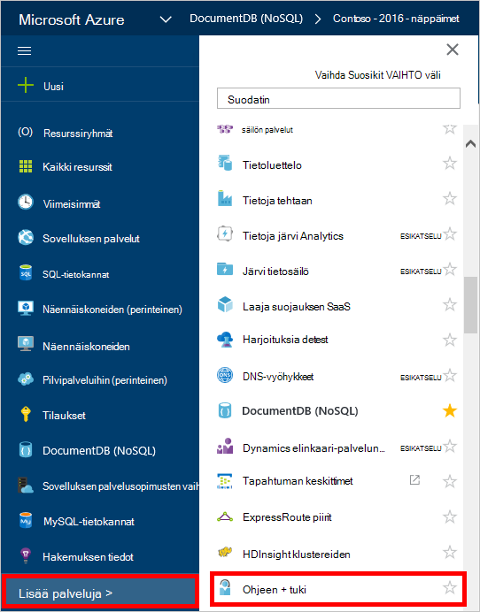
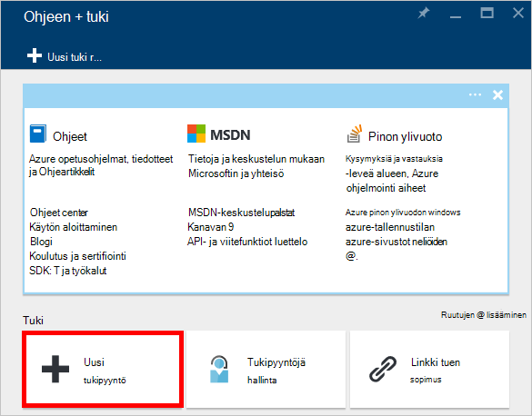
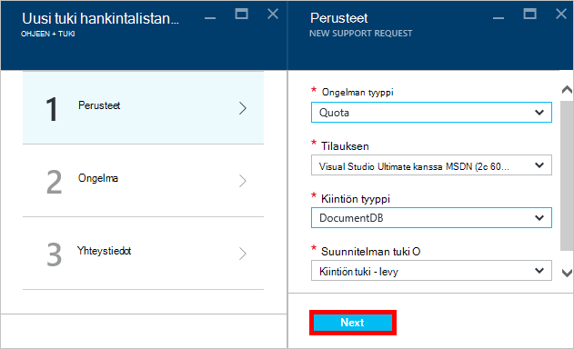
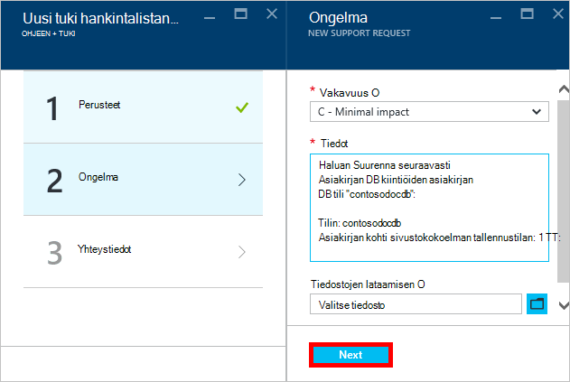
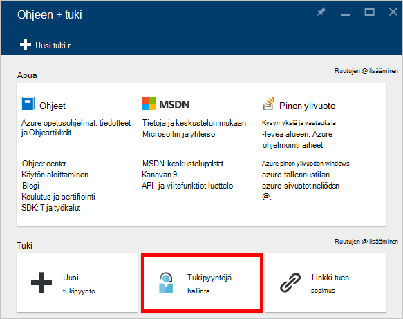

<properties
    pageTitle="Pyyntö entistä DocumentDB tilin kiintiön | Microsoft Azure"
    description="Lue, miten pyytää DocumentDB tietokannan kiintiöitä, kuten asiakirjojen säilyttäminen ja siirtonopeuden kokoelman muutos."
    services="documentdb"
    authors="AndrewHoh"
    manager="jhubbard"
    editor="monicar"
    documentationCenter=""/>

<tags
    ms.service="documentdb"
    ms.workload="data-services"
    ms.tgt_pltfrm="na"
    ms.devlang="na"
    ms.topic="article"
    ms.date="08/25/2016"
    ms.author="anhoh"/>

# Pyyntö entistä DocumentDB rajoitukset

[Microsoft Azure DocumentDB](https://azure.microsoft.com/services/documentdb/) on oletusarvo, joka voidaan säätää ottamalla yhteyttä tukipalveluun Azure kiintiöiden.  Tässä artikkelissa kerrotaan, miten pyytää kiintiön Suurenna.

Luettuasi tämän artikkelin pystyt seuraaviin kysymyksiin:  

-   Mitä DocumentDB tietokannan kiintiön voidaan säätää ottamalla yhteyttä tukipalveluun Azure?
-   Miten DocumentDB tilin kiintiö on muutos voit pyytää?

##DocumentDB tilin kiintiön

Seuraavassa taulukossa on kuvattu DocumentDB kiintiön. Tähdellä (*) merkittyjä kiintiön voidaan säätää ottamalla yhteyttä tukipalveluun Azure:

[AZURE.INCLUDE [azure-documentdb-limits](../../includes/azure-documentdb-limits.md)]

##Kiintiön muutoksen pyytäminen
Seuraavissa vaiheissa kuvataan pyytämisestä kiintiön muutokset.

1. [Azure portal](https://portal.azure.com)valitsemalla **Lisää palveluja**ja valitse sitten **Ohje + tuki**.

    

2. Valitse **Uusi tue pyyntöä** **Ohjeen + tuki** -sivu.

    

3. Valitse **Uusi tue pyyntöä** , sivu **perusteet**. Seuraava, Määritä **ongelman tyyppi** **kiintiön**, **tilauksen** tilaukseen, joka isännöi oman DocumentDB tilin **DocumentDB** **kiintiön tyyppi** ja **Kiintiön tuki - levy** **tuki suunnitelma** . Valitse sitten **Seuraava**.

    

4. Valitse **ongelma** -sivu vakavuus ja Sisällytä tietoja kiintiön Suurenna **tiedot**. Valitse **Seuraava**.

    

5. Lopuksi täytä yhteystietoja **Yhteystiedot** -sivu ja valitse **Luo**.

Kun tuki-lippu on luotu, näyttöön tulee tuki pyynnön numero sähköpostitse.  Voit tarkastella tukipyynnön myös valitsemalla **Hallitse tuki pyytää** **apua + tuki** -sivu.

##Seuraavat vaiheet
- Saat lisätietoja DocumentDB napsauttamalla [tätä](http://azure.com/docdb).
