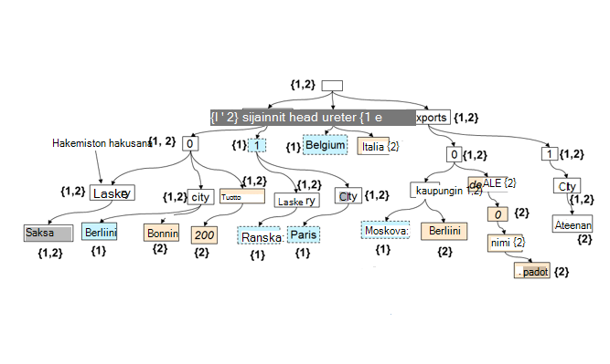

<properties 
    pageTitle="Automaattisen indeksoinnin DocumentDB | Microsoft Azure" 
    description="Tietoja automaattisen Azure DocumentDB indeksoinnin toimii." 
    services="documentdb" 
    authors="arramac" 
    manager="jhubbard" 
    editor="mimig" 
    documentationCenter=""/>

<tags 
    ms.service="documentdb" 
    ms.workload="data-services" 
    ms.tgt_pltfrm="na" 
    ms.devlang="na" 
    ms.topic="article" 
    ms.date="10/27/2016" 
    ms.author="arramac"/>
    
# Automaattinen Azure DocumentDB indeksointi

Tässä artikkelissa on katkelma artikkelista ["rakenteen ympäristöstä riippumattomalla tavalla indeksoinnin ja Azure DocumentDB"](http://www.vldb.org/pvldb/vol8/p1668-shukla.pdf) -raportti, jossa esitetään [41st sisäinen kokouksen erittäin suuri tietokantojen](http://www.vldb.org/2015/) välillä elokuussa 31 päivän – 4. syyskuu 2015- ja johdanto kyselyjä miten indeksoi Azure DocumentDB toimii. 

Luettuasi tämän sinun vastata seuraaviin kysymyksiin:

- Miten DocumentDB johtaa JSON asiakirjan rakenteen?
- Miten DocumentDB hakemiston luominen erillisiä asiakirjojen?
- Kuinka DocumentDB suorittaa automaattisen indeksoinnin tasolla?

##DocumentDB indeksoinnin toiminta

[Microsoft Azure DocumentDB](https://azure.microsoft.com/services/documentdb/) on tosi rakenteen vapauttaa tietokannan tarkoitus laadittuihin ratkaisuihin JSON. Se ei odottaa tai edellytä rakennetta tai toissijainen indeksi määritelmät indeksi tietoihin asteikko. Näin voit nopeasti määrittää ja sovelluksen tietomallien käyttämällä DocumentDB käytöstä. Kun lisäät asiakirjojen kokoelmaa, DocumentDB indeksoi automaattisesti kaikki asiakirjan ominaisuudet, jotta ne ovat käytettävissä kyselyä. Automaattisen indeksoinnin avulla voit tallentaa asiakirjat kuuluvat kokonaan haluamaansa rakenteita ilman katkeamisesta rakenteita tai toissijaisia indeksejä.

Poistaa tietokannan ja application programming mallien impedanssin toisiaan tavoite DocumentDB hyödyntää JSON helppokäyttöisyyden ja sen puuttuminen rakenteen määritys. Tekee ei oletuksia asiakirjat ja mahdollistaa tiedostojen DocumentDB kokoelman rakenteessa lisäksi esiintymän arvot vaihtelevat. Toisin kuin muut asiakirjan tietokannat DocumentDB's tietokantamoduuli toimii suoraan JSON kielioppi-jäljellä olevan agnostic asiakirjamallin käsite ja asiakirjojen rakenne ja esiintymän arvojen välissä olevaa reunaa blurring tasolla. Tämä, valitse-ottaminen käyttöön, ottaa sen automaattisesti indeksin tiedostoja ilman edellyttävät rakennetta tai toissijaisia indeksejä.

DocumentDB indeksoinnin JSON kieliopin sallii tiedostojen **esitetään puut**kertoma hyödyntää. JSON tiedoston vaihtoehtojen esitettäväksi tyhjä pääsolmuksi on luotava joka parents todellinen solmujen asiakirjan loppuun. Tarroissa, mukaan lukien Taulukkoindeksit JSON asiakirjan tulee puun solmu. Seuraavassa kuvassa on esimerkki JSON asiakirjaa ja sen vastaavan puun esityksessä.

>[AZURE.NOTE] Koska JSON itse, joka kuvaa eli kunkin tiedosto sisältää rakenteen (metatiedot) ja tiedot, kuten `{"locationId": 5, "city": "Moscow"}` osoittaa, että on kaksi ominaisuudet `locationId` ja `city`, ja että niillä on numeerinen ja merkkijonon ominaisuusarvoihin. DocumentDB voi johtaa asiakirjojen rakenne ja indeksoida niitä, kun ne lisätään tai korvataan eikä sinun tarvitse koskaan rakenteita tai toissijaisia indeksejä määrittämiseen.

**JSON asiakirjoja puut:**

Esimerkiksi esimerkissä yllä:

- JSON-ominaisuuden `{"headquarters": "Belgium"}` ominaisuus edellä olevassa esimerkissä vastaa polku, osoite ja Belgia.
- JSON-matriisin `{"exports": [{"city": “Moscow"}`, `{"city": Athens"}]}` vastaa polut `/exports/[]/city/Moscow` ja `/exports/[]/city/Athens`.

Automaattinen indeksointi (1) ja asiakirjan puun jokaisen polku on indeksoitu (ellei kehittäjä on määritetty erikseen indeksoinnin käytännön jättäminen pois tiettyjä polku kuviot). (2) indeksi (eli syitä lisäyksen tai poiston solmujen) rakenteen päivittäminen ohjaa kunkin asiakirjan DocumentDB sivustokokoelman päivitys. Yksi ensisijainen vaatimukset tiedostojen automaattisen indeksoinnin on varmistaa, että indeksi ja kyselyn asiakirjan monitasoisissa sisäkkäisiä rakenteen kanssa, sano 10 tasoa kustannukset, on sama kuin tasainen JSON-tiedoston, jossa on avain-arvo-pareina yhden tason laaja. Tämän vuoksi polku normalisoitujen esitys on foundation, jossa molemmat automaattisen indeksoinnin ja kyselyjen alijärjestelmien on suunniteltu.

Tärkeää merkitys treating molemmat yhdenmukaisesti kannalta polkujen rakenteen ja esiintymän arvot on, loogisesti samalla tavalla kuin yksittäisiä asiakirjoja indeksin näkyvissä, joka säilyttää välillä polut kartan asiakirjojen ja tiedostotunnisteet, joka sisältää polun voidaan esittää myös vaihtoehtojen. DocumentDB käyttää tästä luonnissa indeksi-puun joka muodostetaan kaikki puut edustava yksittäisiä tiedostoja kokoelmassa unionin ulos. Indeksi-puunäkymä DocumentDB sivustokokoelmat kasvaa ajan myötä, kun uusia asiakirjoja Hae lisätty tai päivitetty kokoelmaan.

**DocumentDB indeksi vaihtoehtojen:**

Huolimatta, että rakenteeseen vapaa, DocumentDB on SQL- ja JavaScript kyselyn kielet antaa relaatio ennusteiden ja suodattimet, hierarkkisia siirtyminen asiakirjoja, paikkatietojen toiminnot ja kirjoitettu kokonaan JavaScript UDF kutsu. DocumentDB kyselyn suorituksen pystyy tukemaan nämä kyselyt, koska se toimii suoraan vastaan tämän indeksin puun esitys tiedoista.

Indeksoinnin oletuskäytäntö indeksoi kaikki ominaisuudet kaikista tiedostoista ja tarjoaa yhdenmukaisen kyselyt (indeksi on päivitetty synkronoidusti asiakirjan kirjoittaminen merkitys) automaattisesti. Miten DocumentDB tukee indeksi puun tasolla yhdenmukaisia päivitykset? DocumentDB käyttää optimoitu kirjoittaminen, Lukitse vapaa ja kirjaudu rakenteellinen indeksi ylläpito avulla. Tämä tarkoittaa sitä, DocumentDB tukee nopea kirjoituksia aikana edelleen yhdenmukaisia kyselyjen kestävä määrä. 

DocumentDB's indeksoinnin on suunniteltu tallennustilan tehokkuuden ja käsittelemään usean vuokraajan. Kustannukset tehokkuutta levyn tallennustilan katseltavan indeksi on pieni ja ennakoitavissa. Indeksi-päivitykset suoritetaan myös järjestelmäresursseja kohdistettujen DocumentDB sivustokokoelman budjetissa.

##Seuraavat vaiheet
- Lataa ["rakenteen ympäristöstä riippumattomalla tavalla indeksoinnin ja Azure DocumentDB"](http://www.vldb.org/pvldb/vol8/p1668-shukla.pdf), esitetään erittäin suuri tietokantojen 41st sisäinen kokouksessa elokuussa 31 päivän-2015 4 syyskuu.
- [Kysely, joka sisältää DocumentDB SQL](documentdb-sql-query.md)
- Lue, miten voit mukauttaa DocumentDB hakemiston [tähän](documentdb-indexing-policies.md)
 
