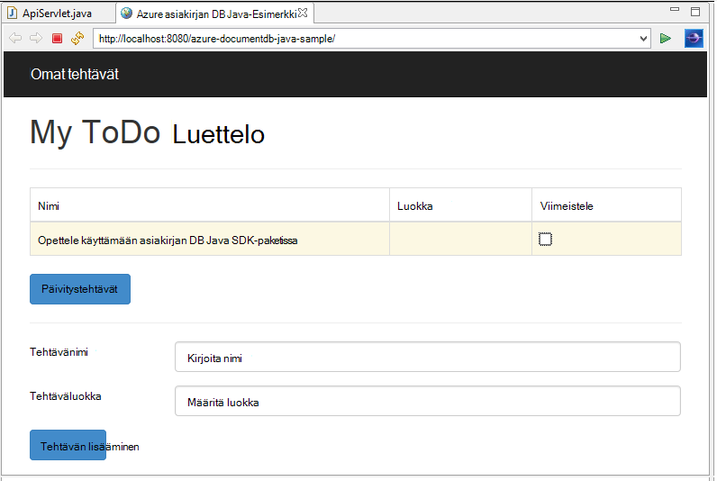
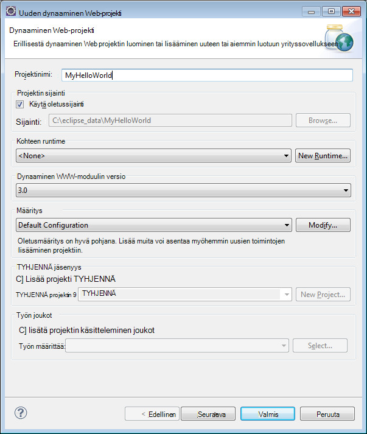
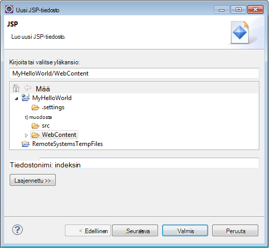
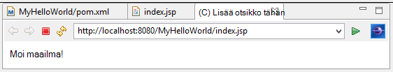
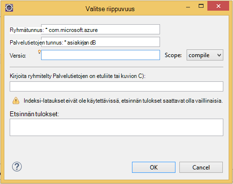

<properties
    pageTitle="Java sovellusten kehittämisen opetusohjelma käyttämällä DocumentDB | Microsoft Azure"
    description="Java web application Tässä opetusohjelmassa näytetään, miten Azure DocumentDB-palvelun avulla voit tallentaa ja access-tietojen Azure-verkkosivustoa isännöidään Java-sovelluksesta."
    keywords="Sovellusten kehittämisen, tietokannan opetusohjelma, java-sovelluksen, java-web-sovelluksen opas, documentdb, azure, Microsoft azure"
    services="documentdb"
    documentationCenter="java"
    authors="dennyglee"
    manager="jhubbard"
    editor="mimig"/>

<tags
    ms.service="documentdb"
    ms.devlang="java"
    ms.topic="hero-article"
    ms.tgt_pltfrm="NA"
    ms.workload="data-services"
    ms.date="08/24/2016"
    ms.author="denlee"/>

# Java DocumentDB käyttävän verkkosovelluksen luominen

> [AZURE.SELECTOR]
- [.NET](documentdb-dotnet-application.md)
- [Node.js](documentdb-nodejs-application.md)
- [Java](documentdb-java-application.md)
- [Python](documentdb-python-application.md)

Java web application Tässä opetusohjelmassa näytetään, miten [Microsoft Azure DocumentDB](https://portal.azure.com/#gallery/Microsoft.DocumentDB) -palvelun avulla voit tallentaa ja access-tietojen Azure-verkkosivustoa isännöidään Java-sovelluksesta. Tässä ohjeaiheessa opit seuraavat asiat:

- Miten voit luoda Pimennys basic JSP-sovelluksessa.
- Miten Azure DocumentDB-palvelu [DocumentDB Java SDK](https://github.com/Azure/azure-documentdb-java)-käyttöä varten.

Java-sovelluksen Tässä opetusohjelmassa näytetään, miten voit luoda verkkopohjaisia Tehtävänhallinnan-sovelluksen, jonka avulla voit luoda ja hakea tehtävät Merkitse valmiiksi-seuraavassa kuvassa esitetyllä tavalla. Tehtävien ToDo luettelossa on tallennettu tiedostoina JSON Azure DocumentDB.

> [AZURE.TIP] Sovellusten kehittämisen Tässä opetusohjelmassa oletetaan, että edellisen kokemus Java avulla. Jos ole ennen käyttänyt Java tai [valmistelevat Työkalut](#Prerequisites), suosittelemme lataamalla valmis [todo](https://github.com/Azure-Samples/documentdb-java-todo-app) projektin GitHub ja rakentaminen se [on tämän artikkelin lopussa olevassa](#GetProject)annettujen ohjeiden mukaisesti. Kun se on luotu, voit tarkastella artikkelin Hanki-koodin kontekstissa projektin tietoja.  

##Opetusohjelmassa Java web-sovelluksen edellytykset
Ennen kuin aloitat sovellusten kehittämisen Tässä opetusohjelmassa, sinun on oltava seuraavasti:

- Azure active tili. Jos sinulla ei ole tiliä, voit luoda ilmainen kokeiluversio tili vain muutaman minuutin. Lisätietoja on artikkelissa [Azure maksuttoman kokeiluversion](https://azure.microsoft.com/pricing/free-trial/).
- [Java Development Kit (JDK 7 +)](http://www.oracle.com/technetwork/java/javase/downloads/index.html).
- [Pimennys IDE Java ss kehittäjille.](http://www.eclipse.org/downloads/packages/eclipse-ide-java-ee-developers/lunasr1)
- [Azure sivustosta, jossa suorituksenaikainen Java-ympäristö (esimerkiksi Tomcat tai jota) käytössä.](../app-service-web/web-sites-java-get-started.md)

Jos asennat nämä työkalut ensimmäistä kertaa, coreservlets.com on Pika-aloitus-osassa asennusprosessin hallintapaketteihin niiden [Opetusohjelma: TomCat7 asentaminen ja käyttäminen Pimennys](http://www.coreservlets.com/Apache-Tomcat-Tutorial/tomcat-7-with-eclipse.html) artikkelissa.

##Vaihe 1: DocumentDB tietokannan tilin luominen

Aloitetaan luomalla DocumentDB-tili. Jos olet jo määrittänyt tilin, voit jatkaa [Vaihe 2: Luo Java JSP sovelluksen](#CreateJSP).

[AZURE.INCLUDE [documentdb-create-dbaccount](../../includes/documentdb-create-dbaccount.md)]

[AZURE.INCLUDE [documentdb-keys](../../includes/documentdb-keys.md)]

##Vaihe 2: Luo Java JSP-sovellus

Voit luoda JSP-sovelluksen:

1. Ensin asetetaan ensin luomalla Java projektin. Käynnistä Pimennys, ja valitse **Tiedosto**, **Uusi**ja valitse sitten **Dynaaminen Web-projekti**. Jos et näe **Dynaaminen Web-projekti** käytettävissä projektina luettelossa, seuraavasti: Valitse **Tiedosto**, **Uusi**, valitse **Projekti**..., laajenna **Web**, **dynaaminen Web**-projekti ja valitse **Seuraava**.

    

2. Kirjoita projektinimi **projektinimi** -ruutuun ja **Kohde suorituksenaikainen** avattavasta valikosta, voit myös valita arvon (kuten Apache Tomcat v7.0) ja valitse sitten **Valmis**. Valitsemalla kohde-Runtimen avulla voit suorittaa projektin paikallisesti Pimennys avulla.
3. Laajenna projektin Pimennys, Project Explorer-näkymässä. **WebContent**hiiren kakkospainikkeella, valitse **Uusi**ja valitse sitten **JSP tiedosto**.
4. Nimeä tiedosto **index.jsp** **JSP uusi tiedosto** -valintaikkunassa. Säilytä pääkansion **WebContent**kuin seuraavassa kuvassa esitetyllä tavalla ja valitse sitten **Seuraava**.

    

5. **Valitse JSP malli** -valintaikkunassa varten tämä opetusohjelma, valitse **Uusi JSP-tiedosto (html)**, ja valitse sitten **Valmis**.

6. Kun index.jsp-tiedosto avautuu Pimennys, Lisää teksti **Hei maailma!** sisällä nykyisen <body> elementti. Oman päivitetyt <body> sisällön pitäisi näyttää seuraava koodi:

        <body>
            <% out.println("Hello World!"); %>
        </body>

8. Tallenna tiedosto index.jsp.
9. Jos määrität kohde runtime vaiheessa 2, voit valita **Projekti** ja valitse **Suorita** JSP-sovelluksen käyttämiseen paikallisesti:

    

##Vaihe 3: Asenna DocumentDB Java SDK-paketissa ##

Helpoin tapa tuoda DocumentDB Java SDK ja riippuvaa on [Apache maven-testi](http://maven.apache.org/).

Toiminto, sinun on muunnettava maven-testi projektin projektin toimimalla seuraavasti:

1. Projektin Project Explorer hiiren kakkospainikkeella, valitse **Määritä**, valitse **maven-testi projektin muuntaminen**.
2. **Luo uusi POM** -ikkunassa Hyväksy oletusarvot ja valitse **Valmis**.
3. Avaa **Project Explorer**pom.xml-tiedosto.
4. **Riippuvuudet** , välilehden **riippuvuudet** -ruutu valitsemalla **Lisää**.
4. **Valitse riippuvuus** -ikkunassa seuraavasti:
 - Kirjoita com.microsoft.azure **Ryhmätunnus** -ruutuun.
 - Kirjoita azure documentdb **Palvelutietojen tunnus** -ruutuun.
 - Kirjoita 1.5.1 **versio** -ruutuun.

    

    Tai lisätä riippuvuuden XML ryhmätunnus ja ArtifactId suoraan pom.xml tekstieditorissa kautta:

        <dependency>
            <groupId>com.microsoft.azure</groupId>
            <artifactId>azure-documentdb</artifactId>
            <version>1.5.1</version>
        </dependency>

5. Valitse **Ok** ja maven-testi asennetaan DocumentDB Java SDK-paketissa.
6. Tallenna tiedosto pom.xml.

##Vaihe 4: DocumentDB-palvelun avulla Java-sovelluksessa

1. Ensin määrittää japanin TodoItem objekti:

        @Data
        @Builder
        public class TodoItem {
            private String category;
            private boolean complete;
            private String id;
            private String name;
        }

    Tähän projektiin on käytössä [Project Lombok](http://projectlombok.org/) konstruktoria, getters tai hankintamenoperiaatteesta muodostimen luomiseen. Voit vaihtoehtoisesti kirjoittaa manuaalisesti tai on IDE, luo se.

2. Käynnistää DocumentDB-palvelun esiintymän uuden **DocumentClient**luominen. Yleensä kannattaa käyttää **DocumentClient** - kuin muodostaa uusi sovellus myöhemmin sivupyynnön. Microsoft käyttää asiakkaan rivittämällä asiakkaan **DocumentClientFactory**. Tämä on myös kohtaa, johon haluat liittää Leikepöydän vaiheessa [1](#CreateDB)tallentamasi URI ja PERUSAVAIMEN arvoa. Korvaa [YOUR\_PÄÄTEPISTEEN\_tähän] URI ja korvaa [YOUR\_AVAIMEN\_tähän] PERUSAVAIMEKSI kanssa.

        private static final String HOST = "[YOUR_ENDPOINT_HERE]";
        private static final String MASTER_KEY = "[YOUR_KEY_HERE]";

        private static DocumentClient documentClient;

        public static DocumentClient getDocumentClient() {
            if (documentClient == null) {
                documentClient = new DocumentClient(HOST, MASTER_KEY,
                        ConnectionPolicy.GetDefault(), ConsistencyLevel.Session);
            }

            return documentClient;
        }

3. Nyt Data Access objektin (DAO), abstrakti toteaa DocumentDB ToDo Microsoftin kohteiden luominen.

    Jotta voit tallentaa ToDo kohteiden kokoelma, asiakkaan täytyy tietää, mitkä tietokanta ja haluat säilyttää sivustokokoelman (kuin viitatun mukaan itse linkit). Yleensä kannattaa tallentaa tietokannan ja sivustokokoelman kun, jotta muut tarvetta palata tietokannan.

    Seuraava koodi on kuvattu voit hakea sekä tietokannan ja sivustokokoelman, jos se on olemassa tai luoda uuden, jos sitä ei ole:

        public class DocDbDao implements TodoDao {
            // The name of our database.
            private static final String DATABASE_ID = "TodoDB";

            // The name of our collection.
            private static final String COLLECTION_ID = "TodoCollection";

            // The DocumentDB Client
            private static DocumentClient documentClient = DocumentClientFactory
                    .getDocumentClient();

            // Cache for the database object, so we don't have to query for it to
            // retrieve self links.
            private static Database databaseCache;

            // Cache for the collection object, so we don't have to query for it to
            // retrieve self links.
            private static DocumentCollection collectionCache;

            private Database getTodoDatabase() {
                if (databaseCache == null) {
                    // Get the database if it exists
                    List<Database> databaseList = documentClient
                            .queryDatabases(
                                    "SELECT * FROM root r WHERE r.id='" + DATABASE_ID
                                            + "'", null).getQueryIterable().toList();

                    if (databaseList.size() > 0) {
                        // Cache the database object so we won't have to query for it
                        // later to retrieve the selfLink.
                        databaseCache = databaseList.get(0);
                    } else {
                        // Create the database if it doesn't exist.
                        try {
                            Database databaseDefinition = new Database();
                            databaseDefinition.setId(DATABASE_ID);

                            databaseCache = documentClient.createDatabase(
                                    databaseDefinition, null).getResource();
                        } catch (DocumentClientException e) {
                            // TODO: Something has gone terribly wrong - the app wasn't
                            // able to query or create the collection.
                            // Verify your connection, endpoint, and key.
                            e.printStackTrace();
                        }
                    }
                }

                return databaseCache;
            }

            private DocumentCollection getTodoCollection() {
                if (collectionCache == null) {
                    // Get the collection if it exists.
                    List<DocumentCollection> collectionList = documentClient
                            .queryCollections(
                                    getTodoDatabase().getSelfLink(),
                                    "SELECT * FROM root r WHERE r.id='" + COLLECTION_ID
                                            + "'", null).getQueryIterable().toList();

                    if (collectionList.size() > 0) {
                        // Cache the collection object so we won't have to query for it
                        // later to retrieve the selfLink.
                        collectionCache = collectionList.get(0);
                    } else {
                        // Create the collection if it doesn't exist.
                        try {
                            DocumentCollection collectionDefinition = new DocumentCollection();
                            collectionDefinition.setId(COLLECTION_ID);

                            collectionCache = documentClient.createCollection(
                                    getTodoDatabase().getSelfLink(),
                                    collectionDefinition, null).getResource();
                        } catch (DocumentClientException e) {
                            // TODO: Something has gone terribly wrong - the app wasn't
                            // able to query or create the collection.
                            // Verify your connection, endpoint, and key.
                            e.printStackTrace();
                        }
                    }
                }

                return collectionCache;
            }
        }

4. Seuraavaksi lisäkoodin TodoItems-kokoelmaan jatkuvat kirjoittamaan. Tässä esimerkissä Käytämme [Gson](https://code.google.com/p/google-gson/) onnistu ja onnistu varaustiedoista JSON asiakirjojen TodoItem tavallinen vanha Java-objektien (POJOs). [Jackson](http://jackson.codehaus.org/) - tai oma mukautettu Sarjatoiminto on myös erinomainen vaihtoehtoisten sarjoitettaessa POJOs.

        // We'll use Gson for POJO <=> JSON serialization for this example.
        private static Gson gson = new Gson();

        @Override
        public TodoItem createTodoItem(TodoItem todoItem) {
            // Serialize the TodoItem as a JSON Document.
            Document todoItemDocument = new Document(gson.toJson(todoItem));

            // Annotate the document as a TodoItem for retrieval (so that we can
            // store multiple entity types in the collection).
            todoItemDocument.set("entityType", "todoItem");

            try {
                // Persist the document using the DocumentClient.
                todoItemDocument = documentClient.createDocument(
                        getTodoCollection().getSelfLink(), todoItemDocument, null,
                        false).getResource();
            } catch (DocumentClientException e) {
                e.printStackTrace();
                return null;
            }

            return gson.fromJson(todoItemDocument.toString(), TodoItem.class);
        }

5. Kuten DocumentDB tietokantojen ja sivustokokoelmat-tiedostoissa viitataan myös itse linkit mukaan. Seuraavat avustaja-funktion avulla us hakea tiedostoja toiseen määritteeseen (esimerkiksi "tunnus") sen sijaan, että itse linkin:

        private Document getDocumentById(String id) {
            // Retrieve the document using the DocumentClient.
            List<Document> documentList = documentClient
                    .queryDocuments(getTodoCollection().getSelfLink(),
                            "SELECT * FROM root r WHERE r.id='" + id + "'", null)
                    .getQueryIterable().toList();

            if (documentList.size() > 0) {
                return documentList.get(0);
            } else {
                return null;
            }
        }

6. Microsoft käyttää helper menetelmä vaiheessa 5 noutaa TodoItem JSON asiakirjan tunnuksen mukaan ja poistaa sen jälkeen POJO:

        @Override
        public TodoItem readTodoItem(String id) {
            // Retrieve the document by id using our helper method.
            Document todoItemDocument = getDocumentById(id);

            if (todoItemDocument != null) {
                // De-serialize the document in to a TodoItem.
                return gson.fromJson(todoItemDocument.toString(), TodoItem.class);
            } else {
                return null;
            }
        }

7. On myös käyttää sivustokokoelman ja luettelo TodoItems käyttämällä DocumentDB SQL DocumentClient:

        @Override
        public List<TodoItem> readTodoItems() {
            List<TodoItem> todoItems = new ArrayList<TodoItem>();

            // Retrieve the TodoItem documents
            List<Document> documentList = documentClient
                    .queryDocuments(getTodoCollection().getSelfLink(),
                            "SELECT * FROM root r WHERE r.entityType = 'todoItem'",
                            null).getQueryIterable().toList();

            // De-serialize the documents in to TodoItems.
            for (Document todoItemDocument : documentList) {
                todoItems.add(gson.fromJson(todoItemDocument.toString(),
                        TodoItem.class));
            }

            return todoItems;
        }

8. Päivitä asiakirja DocumentClient monella tavalla. Tutustu Todo luettelosta sovelluksessa haluamme voi vaihtaa TodoItem onko. Tämä onnistuu päivittämällä asiakirjassa "Valmis" määrite:

        @Override
        public TodoItem updateTodoItem(String id, boolean isComplete) {
            // Retrieve the document from the database
            Document todoItemDocument = getDocumentById(id);

            // You can update the document as a JSON document directly.
            // For more complex operations - you could de-serialize the document in
            // to a POJO, update the POJO, and then re-serialize the POJO back in to
            // a document.
            todoItemDocument.set("complete", isComplete);

            try {
                // Persist/replace the updated document.
                todoItemDocument = documentClient.replaceDocument(todoItemDocument,
                        null).getResource();
            } catch (DocumentClientException e) {
                e.printStackTrace();
                return null;
            }

            return gson.fromJson(todoItemDocument.toString(), TodoItem.class);
        }

9. Lopuksi haluamme mahdollisuus poistaa TodoItem luettelossamme. Voit tehdä tämän Käytämme olemme kirjoittamasi aiemmin noutaa itse linkki ja kerro asiakkaan ja poistaa sen avustaja-menetelmää:

        @Override
        public boolean deleteTodoItem(String id) {
            // DocumentDB refers to documents by self link rather than id.

            // Query for the document to retrieve the self link.
            Document todoItemDocument = getDocumentById(id);

            try {
                // Delete the document by self link.
                documentClient.deleteDocument(todoItemDocument.getSelfLink(), null);
            } catch (DocumentClientException e) {
                e.printStackTrace();
                return false;
            }

            return true;
        }

##Vaihe 5: Johtimen loput Java sovellusten kehittämisen projektin yhdessä

Nyt kun on valmis hauska bittien - kaikki eli vasemmalle luominen nopeasti käyttäjän käyttöliittymä ja kulmien Microsoftin DAO ylöspäin.

1. Ensin aloitetaan ohjauskoneen, soita Microsoftin DAO luominen:

        public class TodoItemController {
            public static TodoItemController getInstance() {
                if (todoItemController == null) {
                    todoItemController = new TodoItemController(TodoDaoFactory.getDao());
                }
                return todoItemController;
            }

            private static TodoItemController todoItemController;

            private final TodoDao todoDao;

            TodoItemController(TodoDao todoDao) {
                this.todoDao = todoDao;
            }

            public TodoItem createTodoItem(@NonNull String name,
                    @NonNull String category, boolean isComplete) {
                TodoItem todoItem = TodoItem.builder().name(name).category(category)
                        .complete(isComplete).build();
                return todoDao.createTodoItem(todoItem);
            }

            public boolean deleteTodoItem(@NonNull String id) {
                return todoDao.deleteTodoItem(id);
            }

            public TodoItem getTodoItemById(@NonNull String id) {
                return todoDao.readTodoItem(id);
            }

            public List<TodoItem> getTodoItems() {
                return todoDao.readTodoItems();
            }

            public TodoItem updateTodoItem(@NonNull String id, boolean isComplete) {
                return todoDao.updateTodoItem(id, isComplete);
            }
        }

    Monimutkaisempia sovelluksessa ohjaimen saattaa näkyvän monimutkaisia liiketoimintalogiikan DAO päälle.

2. Seuraavaksi luodaan servlet reitin HTTP-pyyntöihin valvojalle:

        public class TodoServlet extends HttpServlet {
            // API Keys
            public static final String API_METHOD = "method";

            // API Methods
            public static final String CREATE_TODO_ITEM = "createTodoItem";
            public static final String GET_TODO_ITEMS = "getTodoItems";
            public static final String UPDATE_TODO_ITEM = "updateTodoItem";

            // API Parameters
            public static final String TODO_ITEM_ID = "todoItemId";
            public static final String TODO_ITEM_NAME = "todoItemName";
            public static final String TODO_ITEM_CATEGORY = "todoItemCategory";
            public static final String TODO_ITEM_COMPLETE = "todoItemComplete";

            public static final String MESSAGE_ERROR_INVALID_METHOD = "{'error': 'Invalid method'}";

            private static final long serialVersionUID = 1L;
            private static final Gson gson = new Gson();

            @Override
            protected void doGet(HttpServletRequest request,
                    HttpServletResponse response) throws ServletException, IOException {

                String apiResponse = MESSAGE_ERROR_INVALID_METHOD;

                TodoItemController todoItemController = TodoItemController
                        .getInstance();

                String id = request.getParameter(TODO_ITEM_ID);
                String name = request.getParameter(TODO_ITEM_NAME);
                String category = request.getParameter(TODO_ITEM_CATEGORY);
                boolean isComplete = StringUtils.equalsIgnoreCase("true",
                        request.getParameter(TODO_ITEM_COMPLETE)) ? true : false;

                switch (request.getParameter(API_METHOD)) {
                case CREATE_TODO_ITEM:
                    apiResponse = gson.toJson(todoItemController.createTodoItem(name,
                            category, isComplete));
                    break;
                case GET_TODO_ITEMS:
                    apiResponse = gson.toJson(todoItemController.getTodoItems());
                    break;
                case UPDATE_TODO_ITEM:
                    apiResponse = gson.toJson(todoItemController.updateTodoItem(id,
                            isComplete));
                    break;
                default:
                    break;
                }

                response.getWriter().println(apiResponse);
            }

            @Override
            protected void doPost(HttpServletRequest request,
                    HttpServletResponse response) throws ServletException, IOException {
                doGet(request, response);
            }
        }

3. Tarvitsemme Web käyttöliittymä näyttää käyttäjälle. Oletetaan, että uudelleen kirjoittaminen index.jsp on aiemmin luotu:

        <html>
        <head>
          <meta http-equiv="Content-Type" content="text/html; charset=ISO-8859-1">
          <meta http-equiv="X-UA-Compatible" content="IE=edge;" />
          <title>Azure DocumentDB Java Sample</title>

          <!-- Bootstrap -->
          <link href="//ajax.aspnetcdn.com/ajax/bootstrap/3.2.0/css/bootstrap.min.css" rel="stylesheet">

          
        </head>
        <body>
          <!-- Nav Bar -->
          

            

              

                <a class="navbar-brand" href="#">My Tasks</a>
              

            

          

          <!-- Body -->
          

            <h1>My ToDo List</h1>

            

            <!-- The ToDo List -->
            

              <table class="table table-bordered table-striped" id="todoItems">
                <thead>
                  <tr>
                    <th>Name</th>
                    <th>Category</th>
                    <th>Complete</th>
                  </tr>
                </thead>
                <tbody>
                </tbody>
              </table>

              <!-- Update Button -->
              

                <form class="form-horizontal" role="form">
                  <button type="button" class="btn btn-primary">Update Tasks</button>
                </form>
              

            

            

            <!-- Item Input Form -->
            

              <form class="form-horizontal" role="form">
                

                  <label for="inputItemName" class="col-sm-2">Task Name</label>
                  

                    <input type="text" class="form-control" id="inputItemName" placeholder="Enter name">
                  

                

                

                  <label for="inputItemCategory" class="col-sm-2">Task Category</label>
                  

                    <input type="text" class="form-control" id="inputItemCategory" placeholder="Enter category">
                  

                

                <button type="button" class="btn btn-primary">Add Task</button>
              </form>
            

          

          <!-- Placed at the end of the document so the pages load faster -->
          
          
          
        </body>
        </html>

4. Ja kirjoita lopuksi joitakin asiakkaan Javascript ja useiden WWW-käyttöliittymän ja servlet yhdessä:

        var todoApp = {
          /*
           * API methods to call Java backend.
           */
          apiEndpoint: "api",

          createTodoItem: function(name, category, isComplete) {
            $.post(todoApp.apiEndpoint, {
                "method": "createTodoItem",
                "todoItemName": name,
                "todoItemCategory": category,
                "todoItemComplete": isComplete
              },
              function(data) {
                var todoItem = data;
                todoApp.addTodoItemToTable(todoItem.id, todoItem.name, todoItem.category, todoItem.complete);
              },
              "json");
          },

          getTodoItems: function() {
            $.post(todoApp.apiEndpoint, {
                "method": "getTodoItems"
              },
              function(data) {
                var todoItemArr = data;
                $.each(todoItemArr, function(index, value) {
                  todoApp.addTodoItemToTable(value.id, value.name, value.category, value.complete);
                });
              },
              "json");
          },

          updateTodoItem: function(id, isComplete) {
            $.post(todoApp.apiEndpoint, {
                "method": "updateTodoItem",
                "todoItemId": id,
                "todoItemComplete": isComplete
              },
              function(data) {},
              "json");
          },

          /*
           * UI Methods
           */
          addTodoItemToTable: function(id, name, category, isComplete) {
            var rowColor = isComplete ? "active" : "warning";

            todoApp.ui_table().append($("<tr>")
              .append($("<td>").text(name))
              .append($("<td>").text(category))
              .append($("<td>")
                .append($("<input>")
                  .attr("type", "checkbox")
                  .attr("id", id)
                  .attr("checked", isComplete)
                  .attr("class", "isComplete")
                ))
              .addClass(rowColor)
            );
          },

          /*
           * UI Bindings
           */
          bindCreateButton: function() {
            todoApp.ui_createButton().click(function() {
              todoApp.createTodoItem(todoApp.ui_createNameInput().val(), todoApp.ui_createCategoryInput().val(), false);
              todoApp.ui_createNameInput().val("");
              todoApp.ui_createCategoryInput().val("");
            });
          },

          bindUpdateButton: function() {
            todoApp.ui_updateButton().click(function() {
              // Disable button temporarily.
              var myButton = $(this);
              var originalText = myButton.text();
              $(this).text("Updating...");
              $(this).prop("disabled", true);

              // Call api to update todo items.
              $.each(todoApp.ui_updateId(), function(index, value) {
                todoApp.updateTodoItem(value.name, value.value);
                $(value).remove();
              });

              // Re-enable button.
              setTimeout(function() {
                myButton.prop("disabled", false);
                myButton.text(originalText);
              }, 500);
            });
          },

          bindUpdateCheckboxes: function() {
            todoApp.ui_table().on("click", ".isComplete", function(event) {
              var checkboxElement = $(event.currentTarget);
              var rowElement = $(event.currentTarget).parents('tr');
              var id = checkboxElement.attr('id');
              var isComplete = checkboxElement.is(':checked');

              // Toggle table row color
              if (isComplete) {
                rowElement.addClass("active");
                rowElement.removeClass("warning");
              } else {
                rowElement.removeClass("active");
                rowElement.addClass("warning");
              }

              // Update hidden inputs for update panel.
              todoApp.ui_updateForm().children("input[name='" + id + "']").remove();

              todoApp.ui_updateForm().append($("<input>")
                .attr("type", "hidden")
                .attr("class", "updateComplete")
                .attr("name", id)
                .attr("value", isComplete));

            });
          },

          /*
           * UI Elements
           */
          ui_createNameInput: function() {
            return $(".todoForm #inputItemName");
          },

          ui_createCategoryInput: function() {
            return $(".todoForm #inputItemCategory");
          },

          ui_createButton: function() {
            return $(".todoForm button");
          },

          ui_table: function() {
            return $(".todoList table tbody");
          },

          ui_updateButton: function() {
            return $(".todoUpdatePanel button");
          },

          ui_updateForm: function() {
            return $(".todoUpdatePanel form");
          },

          ui_updateId: function() {
            return $(".todoUpdatePanel .updateComplete");
          },

          /*
           * Install the TodoApp
           */
          install: function() {
            todoApp.bindCreateButton();
            todoApp.bindUpdateButton();
            todoApp.bindUpdateCheckboxes();

            todoApp.getTodoItems();
          }
        };

        $(document).ready(function() {
          todoApp.install();
        });

5. Mahtavaa! Nyt kaikki haluamasi jätetään on testata sovellusta. Suorita sovellus paikallisesti ja lisätä kohteita Todo täyttämällä kohteen nimi ja luokka ja valitsemalla **Lisää tehtävä**.

6. Kun kohde näkyy, onko on valmis, VAIHTO valintaruutu ja valitsemalla **Päivitä tehtävät**voidaan päivittää.

##Vaihe 6: Ota käyttöön Java-sovelluksen Azure-sivustoihin

Azure sivustojen tekee käyttöönotto Java-sovellusten helposti vieminen sovelluksen SOTA-tiedostona ja ladataan joko Ohjausobjektin lähde (kuten GIT) kautta tai FTP.

1. Vietävät sovelluksesi SODAN projektin **Project Explorer**-hiiren kakkospainikkeella, **Vie**ja valitse sitten **SODAN tiedosto**.
2. **SODAN Vie** -ikkunassa seuraavasti:
 - Kirjoita project Web-ruudussa azure-documentdb-java-malli.
 - Valitse kohde-ruudun kohde SOTA-tiedosto tallennetaan.
 - Valitse **Valmis**.

3. Nyt kun SODAN tiedosto on kohdassa käytettävissä, voit ladata sen ainoastaan Azure-sivustoon **webapps** hakemistoon. Saat ohjeet tiedoston lataaminen [lisääminen sovelluksen Azure Java-sivustoon](../app-service-web/web-sites-java-add-app.md).

    Kun webapps hakemiston SOTA-tiedosto on ladattu palvelimeen, runtime-ympäristön havaitsee, että olet lisännyt ja automaattisesti ladata sen.
4. Voit tarkastella valmiin tuotteen, siirry http://YOUR\_sivuston\_NAME.azurewebsites.net/azure-documentdb-java-sample/ ja Aloita lisäämällä tehtävien!

##Pyydä projektin GitHub

Tässä opetusohjelmassa mallit sisälly GitHub [todo](https://github.com/Azure-Samples/documentdb-java-todo-app) projektia. Tuotavan Pimennys todo projektin varmistamiseksi, ohjelmistojen ja resurssien [edellytykset](#Prerequisites) -osassa ja valitse seuraavasti:

1. Asenna [projektin Lombok](http://projectlombok.org/). Lombok käytetään projektin konstruktoreja, getters, hankintamenoperiaatteesta luomiseen. Kun olet ladannut lombok.jar-tiedoston, kaksoisnapsauttamalla sitä asentaa tai asentaa sen komentoriviltä.
2. Jos Pimennys on avoinna, sulje se ja käynnistä se lataamaan Lombok.
3. Valitse **Tuo**Pimennys, valitse **Tiedosto** -valikosta.
4. **Tuonti** -ikkunan **Git**, projektit **-Git**ja valitse sitten **Seuraava**.
5. **Valitse tietovaraston tietolähteen** näytössä Valitse **Kloonaa URI**.
6. **Tietolähteen Git säilöön** näytössä, **URI** -ruutuun kirjoita https://github.com/Azure-Samples/documentdb-java-todo-app.git ja valitse sitten **Seuraava**.
7. **Haaran valinta** näytössä Varmista, että **pää** on valittuna ja valitse sitten **Seuraava**.
8. **Paikallinen kohde** näytössä Valitse **Selaa** ja valitse kansio, johon säilö voidaan kopioida, ja valitse sitten **Seuraava**.
9. **Valitse ohjatun toiminnon, joka käyttää projektien tuomista** näytössä Varmista, että **Tuo aiemmin projekteja** on valittuna, ja valitse sitten **Seuraava**.
10. **Tuo projekteja** näytössä valitsee **DocumentDB** -projekti ja valitse sitten **Valmis**. DocumentDB projekti sisältää DocumentDB Java SDK-paketissa, joka lisätään riippuvuus kuin sen sijaan.
11. **Project Explorer**azure-documentdb-java-sample\src\com.microsoft.azure.documentdb.sample.dao\DocumentClientFactory.java Siirry isännän ja MASTER_KEY arvojen korvaaminen URI ja PERUSAVAIMEN DocumentDB tilin ja tallenna sitten tiedosto. Lisätietoja on artikkelissa [vaiheessa 1. Luo tili DocumentDB tietokannan](#CreateDB).
12. **Project Explorer** **azure-documentdb-java-malli**napsauttamalla hiiren kakkospainikkeella, valitse **Muodosta polku**ja valitse sitten **Määritä luoda polku**.
13. **Java luominen polku** -näytössä oikeanpuoleisen ruudun Valitse **kirjastot** -välilehti ja valitse sitten **Lisää ulkoisen JARs**. Siirry lombok.jar-tiedoston sijainti ja valitse **Avaa**ja valitse sitten **OK**.
14. Avaa **Ominaisuudet** -ikkuna uudelleen vaiheeseen 12 avulla ja valitse sitten vasemmanpuoleisessa ruudussa **Kohdistettu CRT Runtime**.
15. **Kohdistettu CRT Runtime** näytössä Valitse **Uusi**, valitse **Apache Tomcat v7.0**ja valitse sitten **OK**.
16. Avaa **Ominaisuudet** -ikkuna uudelleen vaiheeseen 12 avulla ja valitse sitten vasemmanpuoleisessa ruudussa **Projektin rakenteita**.
17. **Projektin rakenteita** näytössä Valitse **Dynaamisen Web-moduulin** ja **Java**ja valitse sitten **OK**.
18. Valitse näytön alareunassa **palvelimet** -välilehden **Tomcat v7.0 localhost palvelinta** hiiren kakkospainikkeella ja valitse sitten **Lisää ja poista**.
19. Valitse **Lisää ja poista** -ikkunassa Siirry **azure-documentdb-java-Esimerkki** **määritetty** -ruutuun ja valitse sitten **Valmis**.
20. **Palvelin** -välilehti **Tomcat v7.0 localhost palvelinta**hiiren kakkospainikkeella ja valitse sitten **uudelleen**.
21. Siirry selaimessa, 8080/azure-documentdb-java-Esimerkki / ja lisätä tehtäväluettelon. Huomaa, että jos olet muuttanut oletusarvo-porttien arvoja muuttaa 8080 arvo, jonka valitsit.
22. Ottamaan projektin Azure web-sivuston artikkelissa [vaiheeseen 6. Ottaa käyttöön sovelluksen Azure sivustojen](#Deploy).

[1]: media/documentdb-java-application/keys.png
