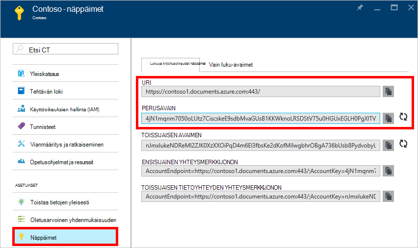
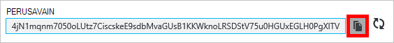
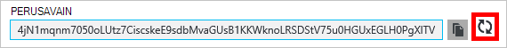
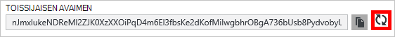
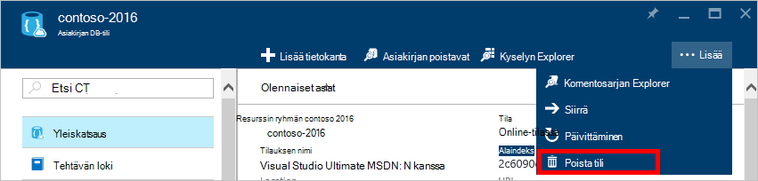
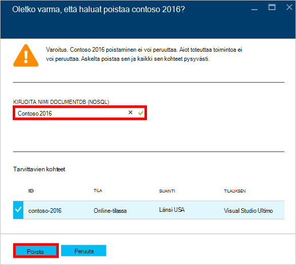

<properties
    pageTitle="DocumentDB-tilin kautta Azure-portaalin hallinta | Microsoft Azure"
    description="Opi hallitsemaan DocumentDB-tilisi kautta Azure-portaalissa. Etsi artikkelista Azure-portaalin avulla voit tarkastella, kopioida, poistaa ja käyttää tilit."
    keywords="Azure-portaaliin, documentdb, azure, Microsoft azure"
    services="documentdb"
    documentationCenter=""
    authors="kirillg"
    manager="jhubbard"
    editor="cgronlun"/>

<tags
    ms.service="documentdb"
    ms.workload="data-services"
    ms.tgt_pltfrm="na"
    ms.devlang="na"
    ms.topic="article"
    ms.date="10/14/2016"
    ms.author="kirillg"/>

# Miten DocumentDB tilin hallinta

Lue, miten voit määrittää yleisen yhdenmukaisuuden, käsitellä näppäimet ja poista DocumentDB-tili Azure-portaalissa.

## DocumentDB yhdenmukaisuuden asetusten hallinta

Oikea yhdenmukaisuuden-tason valitseminen määräytyy semantiikkaan liittyvien sovelluksesi. Kun olisi tutustut DocumentDB käytettävissä yhdenmukaisuuden tasojen lukemalla [käyttäminen yhdenmukaisuuden tasot, jos haluat suurentaa saatavuudesta ja suorituskyvyn DocumentDB] [consistency]. DocumentDB antaa yhdenmukaisuuden, käytettävyys ja suorituskyvyn oikeudet saatavilla tilillesi tietokannan yhdenmukaisuuden jokaisella tasolla. Tietokannan tilin määrittämisessä kanssa vahvan yhdenmukaisuuden taso edellyttää, että tiedot ovat vain yhden Azure alueen rajattua ja yleisesti saatavilla. Toisaalta, kevennetty yhdenmukaisuuden - tasot joka staleness, istunnon tai potentiaalisen Ota voit liittää jokin muu luku Azure alueiden tietokanta-tilillesi. Yksinkertainen seuraavasti näyttää, miten voit valita tietokannan tilisi yhdenmukaisuuden oletustaso. 

### Määritä oletusarvoinen yhdenmukaisuuden DocumentDB tilin

1. [Azure portal](https://portal.azure.com/)DocumentDB tiliäsi.
2. Valitse tili-sivu napsauttamalla **yhdenmukaisuuden**.
3. Valitse **Oletus yhdenmukaisuuden** -sivu yhdenmukaisuuden uusi käyttöoikeustaso ja valitse **Tallenna**.
    ![Oletusarvoinen yhdenmukaisuuden istunnon][5]

## Tarkastele, kopioiminen ja luo pikanäppäimet
Kun luot DocumentDB-tili, palvelun Luo kaksi perusmuodon pikanäppäimet, joita voi käyttää todennusta varten, kun DocumentDB tilin käytetään. Antamalla kaksi pikanäppäinten DocumentDB mahdollistaa näppäimiä palvelukatkoksia DocumentDB tiliisi uudelleen. 

[Azure portal](https://portal.azure.com/)käyttää **DocumentDB tili** -sivu, voit tarkastella, kopioida ja luo pikanäppäimet, joita käytetään DocumentDB tiliäsi resurssin valikosta **näppäimet** -sivu.

> [AZURE.NOTE] **Näppäimet** -sivu sisältää myös ensisijaisen ja toissijaisen tietoyhteyden merkkijonoja, joiden avulla voidaan muodostaa yhteyden tiliisi [Tietojen siirtotyökalua käytetään](documentdb-import-data.md).

Vain luku-avaimet ovat saatavilla myös tämä sivu. Kyselyjen ovat vain luku-toimintoja, kun Luo, poistaa, ja korvaa eivät ole ja lukuja.

### Kopioi pikanäppäin Azure-portaalissa

Valitse **näppäimet** , sivu oikealle puolelle haluat kopioida avaimen **Kopioi** -painike.

### Luo pikanäppäimet

Muuta pikanäppäimet säännöllisesti, jos haluat suojata yhteydet DocumentDB-tiliisi. Kaksi pikanäppäinten määritetään, jotta voit säilyttää yhteydet DocumentDB-tilin käyttämistä yhden pikanäppäin, kun access-näppäintä uudelleen.

> [AZURE.WARNING] Kaikki sovellukset, jotka riippuvat nykyisen avaimen vaikuttaa uudelleen access-näppäimiä. Kaikkien asiakkaiden, jotka käyttävät pikanäppäin DocumentDB-tili on päivitettävä uusi avain.

Jos sinulla on sovellusten tai pilvipalveluihin DocumentDB-tilillä, menetät yhteydet Jos uudelleen näppäimet, ellei avaimien kokoa. Seuraavissa vaiheissa kuvataan yhdistävää juoksevan avaimien prosessi.

1. Päivitä pikanäppäin sovelluksen koodissa DocumentDB tilin toissijainen access-avain.
2. Luo ensisijainen pikanäppäin DocumentDB tilissäsi. [Azure-portaalin](https://portal.azure.com/)DocumentDB tiliäsi.
3. Valitse **näppäimet** **DocumentDB tili** -sivu.
4. Valitse **näppäimet** -sivu napsauttamalla Muodosta uudelleen sarjanumerot-painiketta ja valitse sitten **Ok** ja vahvista, että haluat luoda uuden tunnuksen.
    

5. Kun olet varmistanut, että uusi avain on käytössä (noin 5 minuuttia uudistaminen jälkeen), Päivitä pikanäppäin sovelluksen koodissa ensisijainen uusi avain.
6. Luo toissijainen pikanäppäin.

    

> [AZURE.NOTE] Voi kestää useita minuutteja ennen juuri luotu avain voidaan DocumentDB tiliäsi.

## Tietoyhteyden yhteysmerkkijonon

Noutaminen yhteysmerkkijono, toimi seuraavasti: 

1. [Azure portal](https://portal.azure.com)DocumentDB tiliäsi.
2. Valitse resurssi-valikossa **avaimet**.
3. Valitse **Ensisijainen yhteysmerkkijonon** tai **Toissijaisen yhteysmerkkijono** -ruudun vieressä olevaa **Kopioi** -painike. 

Jos käytät yhteysmerkkijonon [DocumentDB tietokannan siirtotyökalun](documentdb-import-data.md), Liitä tietokannan nimi yhteysmerkkijonon loppuun. `AccountEndpoint=< >;AccountKey=< >;Database=< >`.

## Poista DocumentDB-tili
Poista DocumentDB-tilisi Azure-portaalista, jota käytät enää käyttää **Poista tili** -komento **DocumentDB tili** -sivu.

1. [Azure portal](https://portal.azure.com/)käyttää DocumentDB-tili, jonka haluat poistaa.
2. Valitse **DocumentDB tili** -sivu valitsemalla **Lisää**ja valitse sitten **Poista tili**. Tai -tietokannan nimeä hiiren kakkospainikkeella ja valitse **Poista tili**.
3. Kirjoita DocumentDB tilinimen vahvistamaan, että haluat poistaa tilin tuloksena vahvistus-sivu.
4. Napsauta **Poista** -painiketta.

## Seuraavat vaiheet

Lisätietoja pikaviestien [DocumentDB-tilisi kanssa](http://go.microsoft.com/fwlink/p/?LinkId=402364).

Lisätietoja DocumentDB on artikkelissa Azure DocumentDB ohjeista [azure.com](http://go.microsoft.com/fwlink/?LinkID=402319&clcid=0x409).

<!--Image references-->
[1]: ./media/documentdb-manage-account/documentdb_add_region-1.png
[2]: ./media/documentdb-manage-account/documentdb_add_region-2.png
[3]: ./media/documentdb-manage-account/documentdb_change_write_region-1.png
[4]: ./media/documentdb-manage-account/documentdb_change_write_region-2.png
[5]: ./media/documentdb-manage-account/documentdb_change_consistency-1.png
[6]: ./media/documentdb-manage-account/chooseandsaveconsistency.png

<!--Reference style links - using these makes the source content way more readable than using inline links-->
[bcdr]: https://azure.microsoft.com/documentation/articles/best-practices-availability-paired-regions/
[consistency]: https://azure.microsoft.com/documentation/articles/documentdb-consistency-levels/
[azureregions]: https://azure.microsoft.com/en-us/regions/#services
[offers]: https://azure.microsoft.com/en-us/pricing/details/documentdb/
