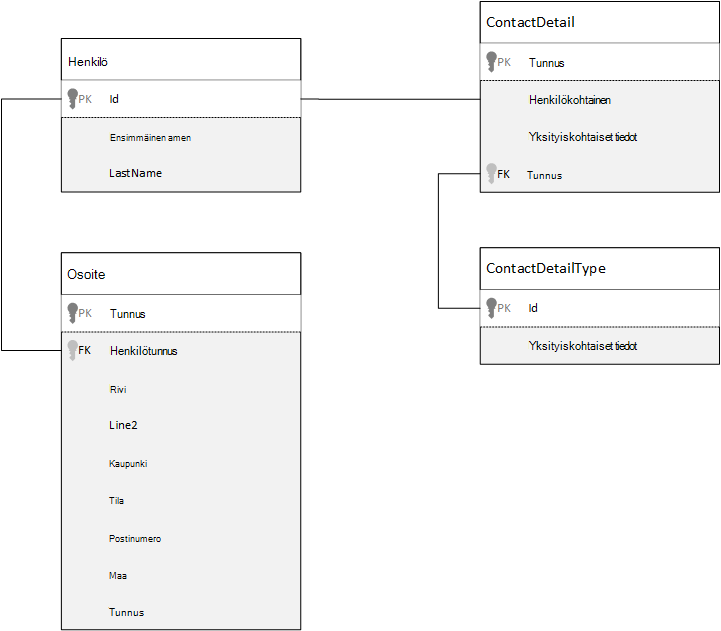
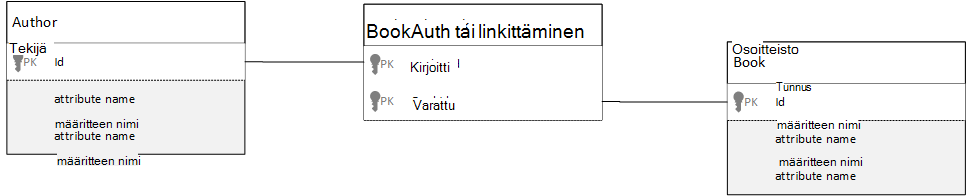

<properties 
    pageTitle="Azure DocumentDB tietojen mallinnus | Microsoft Azure" 
    description="Lisätietoja tietojen mallinnus DocumentDB, NoSQL asiakirjan tietokannan." 
    keywords="tietojen mallinnus"
    services="documentdb" 
    authors="kiratp" 
    manager="jhubbard" 
    editor="mimig1" 
    documentationCenter=""/>

<tags 
    ms.service="documentdb" 
    ms.workload="data-services" 
    ms.tgt_pltfrm="na" 
    ms.devlang="na" 
    ms.topic="article" 
    ms.date="08/05/2016" 
    ms.author="kipandya"/>

#DocumentDB tietojen mallinnus#
Kun rakenteen vapauttaa tietokantoja, kuten Azure DocumentDB ansiosta huipputehokas helposti laajuisiksi tietomallin muutokset olisi silti käytät joitakin aika ajattelua tietoja. 

Miten tiedot suorittaminen tallennetaan? Miten sovelluksen suorittaminen hakeminen ja kyselyjen tiedot? On sovelluksen lukea paksu tai kirjoita paksu? 

Luettuasi tämän artikkelin osaat seuraaviin kysymyksiin:

- Miten asiakirjan tietokannan tiedoston kannattaa ottaa huomioon?
- Mikä on tietomallien ja Miksi minun pitäisi varoen? 
- Miten asiakirjan tietokannan tietojen mallinnus on suhteellisen tietokannan eri?
- Miten tietoja yhteydet-suhteellisen tietokannan Expressin?
- Kun tietojen upottaminen ja linkitettäessä tietoihin?

##Tietojen upottaminen##
Kun käynnistät asiakirjan myymälän tietojen mallinnus DocumentDB, kuten yritä Käsittele kohteiden **itsenäinen asiakirjojen** edustaa JSON.

Ennen kuin olemme hyppäämään mukaan liian paljon edelleen uutiskirjeistä muutama projektipäällikölle ja katsoa, miten emme ehkä malli jotain relaatiotietokannasta monia us ovat jo tuttuja aihe. Seuraavassa esimerkissä esitetään, miten henkilö on ehkä tallennettu relaatiotietokannasta. 

Kun käsittelet relaatiotietokannasta, emme olet on opetettujen normalisointi normalisointi, normalisointi vuotta.

Tietojen normalisointi yleensä tehdään ottaen kohteen, kuten henkilön, ja purkaa tietojen erillinen tekstikohdissa. Yllä olevassa esimerkissä henkilö voi olla useita yhteystiedot tietueita sekä useita osoitetietueita. On myös mene edelleen ja eritellä yhteystietoja edelleen purkamalla yleiset kentät, kuten tyyppi. Sama osoite, on kunkin tietueen tyyppi, kuten *Koti* - tai *Business* 

Ohjata premise tietojen normalisointi ollessa kunkin tietueen **välttää ylimääräisten tietojen tallentamiseen** ja mieluummin viitata tietoihin. Tässä esimerkissä lukemaan henkilön, kaikki yhteystiedot ja osoitteet, sinun on LIITOSTEN avulla voit koota tietoja tehokkaasti suorituksen aikana.

    SELECT p.FirstName, p.LastName, a.City, cd.Detail
    FROM Person p
    JOIN ContactDetail cd ON cd.PersonId = p.Id
    JOIN ContactDetailType on cdt ON cdt.Id = cd.TypeId
    JOIN Address a ON a.PersonId = p.Id

Kirjoitustoimintojen päivitetään yhden henkilön yhteystiedot- ja osoitteet edellyttää useita yksittäisiä taulukoiden välillä. 

Nyt voit tarkastella, kuinka Microsoft malli itsenäinen kokonaisuutena asiakirjan tietokannan samat tiedot.
        
    {
        "id": "1",
        "firstName": "Thomas",
        "lastName": "Andersen",
        "addresses": [
            {            
                "line1": "100 Some Street",
                "line2": "Unit 1",
                "city": "Seattle",
                "state": "WA",
                "zip": 98012
            }
        ],
        "contactDetails": [
            {"email: "thomas@andersen.com"},
            {"phone": "+1 555 555-5555", "extension": 5555}
        ] 
    }

Käyttämällä yllä lähestymistapa on nyt **denormalisoidun** henkilön tietue, jossa on **upotettu** kaikki tiedot, jotka liittyvät kyseisen henkilön yhteystiedot- ja osoitteet, kuten yhteen JSON asiakirjaan.
Lisäksi koska emme ole rajattu kiinteä rakenne on esimerkiksi erimuotoisten yhteystiedot on täysin joustavasti. 

Haetaan valmis henkilön tietueen tietokannasta on nyt yksittäinen luku vastaan yhden sivustokokoelman ja yksittäisiä asiakirjoja. Päivittäminen henkilön tietueen, yhteystietoja ja osoitteet on myös yksittäisen kirjoitus vastaan yksittäisiä asiakirjoja.

Denormalizing tiedot, mukaan sovelluksen täytyy mahdollisesti antaa vähemmän kyselyt ja viimeistele useimmiten päivitykset. 

###Kun haluat upottaa

Käytä yleensä upotetun tietoyhteyden mallit, kun:

- Kohteiden välillä ei **sisältää** suhteita.
- Kohteiden välisiä on **yksi joitakin** yhteydet.
- Tällä upotetun tietoyhteyden **muuttuu harvoin**.
- On upotettu tiedot eivät kasvaa **rajattomasti**.
- Tällä upotetut tiedot, jotka ovat **integraali-teema** -tiedoston tietoihin.

> [AZURE.NOTE] Yleensä denormalisoidun tietomallien tarjoa **lukea** suorituskyvyn parantamiseksi.

###Kun ei voi upottaa

Asiakirjan tietokannan peruslähtökohta ollessa upottaa kaikki tiedot yhteen asiakirjaan ja denormalize kaikki tämän johtavat joissakin tilanteissa, jotka voidaan välttää.

Ota tämä JSON koodikatkelman.

    {
        "id": "1",
        "name": "What's new in the coolest Cloud",
        "summary": "A blog post by someone real famous",
        "comments": [
            {"id": 1, "author": "anon", "comment": "something useful, I'm sure"},
            {"id": 2, "author": "bob", "comment": "wisdom from the interwebs"},
            …
            {"id": 100001, "author": "jane", "comment": "and on we go ..."},
            …
            {"id": 1000000001, "author": "angry", "comment": "blah angry blah angry"},
            …
            {"id": ∞ + 1, "author": "bored", "comment": "oh man, will this ever end?"},
        ]
    }

Tämä voi johtua, miltä upotettu kommentit kirjaa kohteella näyttää on ollut mallinnus tyypillinen blogiin tai CMS-järjestelmän. Tässä esimerkissä ongelma siitä, että kommentit-matriisissa on **Rajoittamaton**, mikä tarkoittaa, että ei ole (käytännön) rajoitettu määrään voi olla mikä tahansa yksittäinen kirjaa kommentit. Tämä muuttuu ongelma, kuten tiedoston kokoa voi kasvaa merkittävästi.

> [AZURE.TIP] Tiedostojen DocumentDB on enimmäiskoko. Saat lisätietoja tämän viitata [DocumentDB rajoitukset](documentdb-limits.md).

Kun asiakirjan koon kasvaa mahdollisuus tiedonsiirron kautta wire sekä lukeminen ja päivittäminen skaalaus-asiakirjaan, heikentyä.

Tässä tapauksessa olisi paremmin huomioitavia seuraavaan malliin.
        
    Post document:
    {
        "id": "1",
        "name": "What's new in the coolest Cloud",
        "summary": "A blog post by someone real famous",
        "recentComments": [
            {"id": 1, "author": "anon", "comment": "something useful, I'm sure"},
            {"id": 2, "author": "bob", "comment": "wisdom from the interwebs"},
            {"id": 3, "author": "jane", "comment": "....."}
        ]
    }

    Comment documents:
    {
        "postId": "1"
        "comments": [
            {"id": 4, "author": "anon", "comment": "more goodness"},
            {"id": 5, "author": "bob", "comment": "tails from the field"},
            ...
            {"id": 99, "author": "angry", "comment": "blah angry blah angry"}
        ]
    },
    {
        "postId": "1"
        "comments": [
            {"id": 100, "author": "anon", "comment": "yet more"},
            ...
            {"id": 199, "author": "bored", "comment": "will this ever end?"}
        ]
    }

Tämä malli on kolme viimeisimmän kommentit upotettu viestin, joka on matriisikaava, jossa on kiinteä sidottu tällä hetkellä. Muita huomautuksia 100 kommentit erissä ryhmittely ja erillisinä tiedostoina tallennettuja. Erän kokoa valittiin 100, koska Microsoftin kuvitteellinen sovellus-toiminnolla käyttäjä voi ladata 100 kommentit kerralla.  

Toisen tapaus, jossa upottamisen tietoja ei ole suositeltavaa on upotetun tietoyhteyden käytetään usein asiakirjojen ja muuttuvat usein. 

Ota tämä JSON koodikatkelman.

    {
        "id": "1",
        "firstName": "Thomas",
        "lastName": "Andersen",
        "holdings": [
            {
                "numberHeld": 100,
                "stock": { "symbol": "zaza", "open": 1, "high": 2, "low": 0.5 }
            },
            {
                "numberHeld": 50,
                "stock": { "symbol": "xcxc", "open": 89, "high": 93.24, "low": 88.87 }
            }
        ]
    }

Tämä voi edustaa henkilön osakkeen portfolion. Microsoft on valinnut voi upottaa osakkeen tiedot kunkin portfolion asiakirjaan. Ympäristössä, jossa toisiinsa liittyvien tietojen muuttuu usein kuten varaston myynti sovelluksen, upottaminen tiedot, jotka muuttuvat usein suorittaminen tarkoittaa, että jatkuvasti päivitettävän portfolion kunkin asiakirjan aina, kun ovat.

Varaston *zaza* kauppaa satoja yhden päivän ajat ja tuhansia käyttäjiä saattaa olla *zaza* portfolion. Kuten edellä on on päivitettävä useita tuhansia portfolion asiakirjojen monta kertaa tietomallia päivittäin, jotka järjestelmän, joka ei skaalata hyvin. 

##Viittaaminen tiedot##

Tietojen upottaminen toimii hyvin usein, mutta se ei ole valittuna, ettei tietoalueessa skenaariot kun denormalizing tietojen aiheuttaa Lisää ongelmia suhteessa sen nykyarvo. Niin on tarkoitus nyt 

Relaatiotietokantojen eivät ole ainoa paikka, jossa voit luoda kohteiden välisiä suhteita. Asiakirjan tietokannassa voi olla tietoja asiakirjaan, joka liittyy todella tiedot myös muissa asiakirjoissa. Nyt I 'M ei advocating jopa minuutin, että olemme järjestelmiin, jotka voidaan parhaiten relaatiotietokannasta DocumentDB-tai asiakirja-tietokannan luominen, mutta yksinkertainen suhteet on hieno ja on hyötyä. 

Microsoft on valinnut osakkeen portfolion Esimerkki vanhemmassa alla JSON, mutta tällä hetkellä viitataan osakkeen kohteen portfolion upottamisen sijaan. Tällä tavalla, kun varasto kohteen muuttuvat usein koko päivän vain asiakirja, joka on päivitettävä on yksi varasto asiakirja. 

    Person document:
    {
        "id": "1",
        "firstName": "Thomas",
        "lastName": "Andersen",
        "holdings": [
            { "numberHeld":  100, "stockId": 1},
            { "numberHeld":  50, "stockId": 2}
        ]
    }
    
    Stock documents:
    {
        "id": "1",
        "symbol": "zaza",
        "open": 1,
        "high": 2,
        "low": 0.5,
        "vol": 11970000,
        "mkt-cap": 42000000,
        "pe": 5.89
    },
    {
        "id": "2",
        "symbol": "xcxc",
        "open": 89,
        "high": 93.24,
        "low": 88.87,
        "vol": 2970200,
        "mkt-cap": 1005000,
        "pe": 75.82
    }
    

Heti Entä huonot puolet tämän menetelmän on kuitenkin tarvitaanko sovelluksen Tarkastele kunkin osakkeen näyttäminen henkilön portfolion; pidossa olevan tietoja tällöin tarvitse tehdä useita trips lataamaan jokaisen osakkeen tiedoston tiedot tietokantaan. Seuraavassa on tehty päätös kirjoittaminen toimintoja, jotka tapahtuu usein koko päivän, mutta puolestaan käsiin luku toiminnoista, joita on mahdollisesti vähemmän vaikutus tietyn järjestelmän suorituskyky-tehokkuuden parantamiseksi.

> [AZURE.NOTE] Normalisoitujen tietojen mallien **edellyttää, että Lisää PYÖRISTÄ-funktiota trips** palvelimeen.

### Mitä tietoja viiteavaimien?
Koska ei tällä hetkellä ei käsite rajoituksen, viiteavaimen tai muussa tapauksessa välisten asiakirjan yhteyksiä, joihin sinulla on tiedostoja ovat tehokas "heikkoja linkkejä" ja ei tarkisteta tietokannan itse. Jos haluat varmistaa, että tiedoston viittaaminen on todella olemassa tietoja, sinun on suoritettava tämä sovelluksen tai palvelinpuolen käynnistimien tai tallennettujen toimintosarjojen DocumentDB.

###Kun haluat viitata
Normitetun tietojen käyttäminen, kun mallit:

- **Yksi-moneen** -yhteydet, jotka edustavat.
- **Monta-moneen** -yhteydet, jotka edustavat.
- Aiheeseen liittyvät tiedot **muuttuvat usein**.
- Viitattu tietoja voi olla **Rajoittamaton**.

> [AZURE.NOTE] Yleensä normalisointi on **kirjoittaa** suorituskyvyn parantamiseksi.

###Mihin yhteyden sijoittanut?
Suhteen kasvu on helpompi määrittää tallentamiseen viittaus-asiakirjassa.

Jos olemme Tarkista JSON, joka mallit julkaisijat ja kirjojen alla.

    Publisher document:
    {
        "id": "mspress",
        "name": "Microsoft Press",
        "books": [ 1, 2, 3, ..., 100, ..., 1000]
    }

    Book documents:
    {"id": "1", "name": "DocumentDB 101" }
    {"id": "2", "name": "DocumentDB for RDBMS Users" }
    {"id": "3", "name": "Taking over the world one JSON doc at a time" }
    ...
    {"id": "100", "name": "Learn about Azure DocumentDB" }
    ...
    {"id": "1000", "name": "Deep Dive in to DocumentDB" }

Jos publisher kohti kirjojen määrä on rajoitettu kasvu pieni, tallentaminen publisher-asiakirjan sisällä kirjan viittaus voi olla hyötyä. Kuitenkin jos kirjojen kohti publisher määrä on rajoittamaton, valitse tämä tietomalli johtaa mutable, kasvava matriisin edellä olevassa esimerkissä publisher-asiakirjassa. 

Siirtyminen asioita ympärille vähän johtaa mallin, joka edustaa edelleen samat tiedot, mutta nyt vältetään nämä suuri mutable sivustokokoelmat.

    Publisher document: 
    {
        "id": "mspress",
        "name": "Microsoft Press"
    }
    
    Book documents: 
    {"id": "1","name": "DocumentDB 101", "pub-id": "mspress"}
    {"id": "2","name": "DocumentDB for RDBMS Users", "pub-id": "mspress"}
    {"id": "3","name": "Taking over the world one JSON doc at a time"}
    ...
    {"id": "100","name": "Learn about Azure DocumentDB", "pub-id": "mspress"}
    ...
    {"id": "1000","name": "Deep Dive in to DocumentDB", "pub-id": "mspress"}

Edellä olevassa esimerkissä on on pudotettu rajoittamaton sivustokokoelman publisher-asiakirjaan. Sen sijaan että on kunkin kirjan tiedoston publisher viittaus.

###Kuinka monta: moneen yhteydet malli?
Suhteellisen tietokannan *monta: moneen* yhteydet usein mallintaa liity taulukoita, johon liittyminen vain yhdessä muiden taulukoiden tietueista. 

Voi replikoida samojen käyttäminen tiedostojen ja tuottaa tietomalli, joka näyttää seuraavankaltaiselta tietoja.

    Author documents: 
    {"id": "a1", "name": "Thomas Andersen" }
    {"id": "a2", "name": "William Wakefield" }
    
    Book documents:
    {"id": "b1", "name": "DocumentDB 101" }
    {"id": "b2", "name": "DocumentDB for RDBMS Users" }
    {"id": "b3", "name": "Taking over the world one JSON doc at a time" }
    {"id": "b4", "name": "Learn about Azure DocumentDB" }
    {"id": "b5", "name": "Deep Dive in to DocumentDB" }
    
    Joining documents: 
    {"authorId": "a1", "bookId": "b1" }
    {"authorId": "a2", "bookId": "b1" }
    {"authorId": "a1", "bookId": "b2" }
    {"authorId": "a1", "bookId": "b3" }

Tämä toimivat. Kuitenkin ladataan joko tekijä ja niiden kirjojen tai lataamista kirjan sen tekijä ja aina edellyttäisi vähintään kaksi muiden kyselyjen tietokannassa. Yhden kyselyn liittävä asiakirjaan ja sitten toisen kyselyn hakeaksesi yhdistettävissä asiakirjassa. 

Jos kaikki jokaisen liity tässä taulukossa on liimaaminen yhteen kaksi kappaletta tietojen, miksi ei sisällytä se kokonaan?
Ota huomioon seuraavat.

    Author documents:
    {"id": "a1", "name": "Thomas Andersen", "books": ["b1, "b2", "b3"]}
    {"id": "a2", "name": "William Wakefield", "books": ["b1", "b4"]}
    
    Book documents: 
    {"id": "b1", "name": "DocumentDB 101", "authors": ["a1", "a2"]}
    {"id": "b2", "name": "DocumentDB for RDBMS Users", "authors": ["a1"]}
    {"id": "b3", "name": "Learn about Azure DocumentDB", "authors": ["a1"]}
    {"id": "b4", "name": "Deep Dive in to DocumentDB", "authors": ["a2"]}

Jos voin käyttää tekijä, heti tiedän, mitkä kirjat niitä on kirjoitettu, ja jos voin käyttää kirjan tiedoston lataaminen voin taas tunnet teosten tunnukset. Toiminto tallentaa välittävät kysely vastaan liity taulukon pienentämisestä sovelluksesi on varmistaaksesi kierrot palvelimen määrä. 

##Hybrid tietomallien##
Olemme olet nyt etsitään upottaminen (tai denormalizing) ja viittaavan (tai normalisointi) tietojen kullakin niiden upsides kullakin kompromisseja kuin emme. 

Se ei aina on oltava joko tai ei voi Pelästynyt sekoitetaan asioita hieman. 

Sovelluksen erityiset käyttötavat ja ehkä tapaukset, joissa sekoittamalla upotettu työmääriä perusteella ja viitatun tiedot on järkevää ja voitu yksinkertaisempi sovelluksen logiikkaa vähemmän palvelimen kanssa johtavat kierrot säilyttäen silti hyvä suorituskyky-taso.

Ota huomioon seuraavat JSON. 

    Author documents: 
    {
        "id": "a1",
        "firstName": "Thomas",
        "lastName": "Andersen",     
        "countOfBooks": 3,
        "books": ["b1", "b2", "b3"],
        "images": [
            {"thumbnail": "http://....png"}
            {"profile": "http://....png"}
            {"large": "http://....png"}
        ]
    },
    {
        "id": "a2",
        "firstName": "William",
        "lastName": "Wakefield",
        "countOfBooks": 1,
        "books": ["b1"],
        "images": [
            {"thumbnail": "http://....png"}
        ]
    }
    
    Book documents:
    {
        "id": "b1",
        "name": "DocumentDB 101",
        "authors": [
            {"id": "a1", "name": "Thomas Andersen", "thumbnailUrl": "http://....png"},
            {"id": "a2", "name": "William Wakefield", "thumbnailUrl": "http://....png"}
        ]
    },
    {
        "id": "b2",
        "name": "DocumentDB for RDBMS Users",
        "authors": [
            {"id": "a1", "name": "Thomas Andersen", "thumbnailUrl": "http://....png"},
        ]
    }

Seuraavassa on olet (enimmäkseen) vahvistanut upotetun malli, jossa ylimmän tason asiakirjan upotetut tiedot muihin kohteisiin, mutta muita tietoja on viittaus. 

Jos tarkastelet kirjan asiakirjan, näkyvissä muutaman kiinnostavat kentät, kun Odotamme tekijöiden matriisin. Ei *tunnus* -kenttä, joka on kentän viitata tekijä-asiakirjaan, tapana normitettu mallin avulla, mutta valitse myös on *nimi* ja *thumbnailUrl*. Syy saattaa olet juuri jumissa *tunnuksella* ja vasemmalle sitä tarvita lisätietoja käyttämistä vastaaviin tekijä-tiedoston "linkki-sovelluksen, mutta koska Microsoftin sovelluksen näyttää tekijän nimen ja pikkukuvan jokaisen kirjan näkyvissä on tallentaa matkassa kohti kirjan luettelon palvelimeen mukaan denormalizing **Tekijä-tietoja** .

Varmista, jos tekijän nimi on muutettu tai ne haluaisit käyttää hänen valokuvaansa olemme Siirry päivitys on päivitettävä jokaisen kirjan ne koskaan julkaistu, mutta tämän sovelluksen oletetaan, että tekijät Älä muuta heidän nimensä kovin usein, tämä on hyväksyttävä rakenne-päätös.  

Esimerkissä on **laskettu valmiiksi koosteet** arvot kallista käsittely tallentamisesta, lue-toiminto. Esimerkissä tekijä asiakirja upotetaan soluihin on tietoja, jotka on laskettu suorituksen aikana. Aina, kun uusi kirja on julkaistu, kirjan tiedosto luodaan, **ja** countOfBooks-kentän arvoksi laskettu arvo kirjan tiedostot, jotka ovat tietyn tekijän määrän perusteella. Tämä optimointi olisi hyvä luku paksu järjestelmien kohtaa, johon on varaa asennettava funktiolauseita kirjoituksia haluat optimoida lukuja.

Mahdollisuus on valmiiksi laskettujen kenttien kanssa on mahdollista, koska DocumentDB tukee **usean tiedoston tapahtumia**. Monta NoSQL stores ei voi tehdä tapahtumat asiakirjojen ja uskottavan vuoksi rakenne päätöksiä, kuten "aina upottaa kaikki", tämä rajoitusten vuoksi. DocumentDB voit käyttää palvelinpuolen käynnistimet tai tallennettujen toimintosarjojen, joka lisää kirjojen ja Päivitä kaikki HAPPAMAN tapahtuman sisällä tekijät. Kun et **ole** voi upottaa kaikki ovat vain, jos haluat, että tietosi pysyvät yhtenäisinä yhteen asiakirjaan.

##Seuraavat vaiheet

Tästä artikkelista suurimmista takeaways on ymmärtää, että tietojen mallinnusta rakenteen vapauttaa maailmaa on yhtä tärkeää kuin koskaan. 

Samalla tavalla kuin ei ole yhden tapaa edustavan tiedosta näytössä, ei ei ole yksi tapa mallin tiedot. Voit Saat lisätietoja sovelluksen sekä kuinka se tuottaa, tarjoaman ja käsitellä tietoja. Valitse käyttämällä joitakin suuntaviivoja Tässä voit määrittää luomisesta mallin, joka korjaa sovelluksen heti tarpeisiin. Kun sovellukset on muutettava, voidaan hyödyntää rakenteen vapaa tietokannan laajuisiksi, muuttaminen ja kehityttävä tietomallin helposti joustavuutta. 

Saat lisätietoja Azure DocumentDB viittaavat palvelun [asiakirjat](https://azure.microsoft.com/documentation/services/documentdb/) -sivu. 

Saat lisätietoja Azure DocumentDB säätäminen indeksit viitata artikkeli [indeksoinnin käytännöt](documentdb-indexing-policies.md).

Selvittääksesi, miten shard useita osioiden välillä tietojen Katso [DocumentDB jakaminen tiedot](documentdb-partition-data.md). 

Ja lopuksi ohjeet tietojen mallinnus ja sharding usean vuokraajan sovellusten kuulla [Skaalaus Azure DocumentDB usean vuokraajan-sovellukseen](http://blogs.msdn.com/b/documentdb/archive/2014/12/03/scaling-a-multi-tenant-application-with-azure-documentdb.aspx).
 
