<properties 
    pageTitle="Käytä MongoChef DocumentDB tilillä protokolla tukee MongoDB | Microsoft Azure" 
    description="Opettele käyttämään MongoChef protokolla tukee nyt käytettävissä esikatselu MongoDB DocumentDB tilillä." 
    keywords="mongochef"
    services="documentdb" 
    authors="AndrewHoh" 
    manager="jhubbard" 
    editor="" 
    documentationCenter=""/>

<tags 
    ms.service="documentdb" 
    ms.workload="data-services" 
    ms.tgt_pltfrm="na" 
    ms.devlang="na" 
    ms.topic="article" 
    ms.date="08/25/2016" 
    ms.author="anhoh"/>

# Käytä MongoChef DocumentDB tilillä MongoDB protokollan tuki

Muodostaa Azure DocumentDB tilille, jolla protokollatuki MongoDB käyttämällä MongoChef edellyttää seuraavia toimia:

- Lataa ja asenna [MongoChef](http://3t.io/mongochef)
- DocumentDB tilisi protokolla tukee MongoDB [yhteysmerkkijonon](documentdb-connect-mongodb-account.md) tiedot

## Yhteyden muodostaminen MongoChef  

Voit lisätä MongoChef Yhteyksienhallinnan protokollatuki MongoDB DocumentDB tiliisi, toimi seuraavasti.

1. Hae käyttäjän DocumentDB protokolla tukee MongoDB yhteystiedot annettujen ohjeiden mukaisesti [tähän](documentdb-connect-mongodb-account.md).

    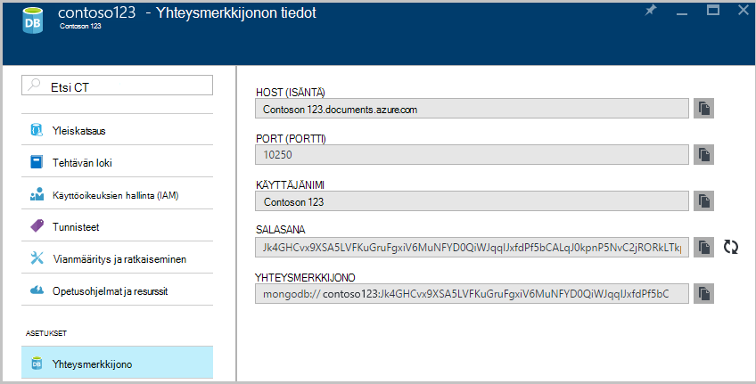

2. **Muodosta** yhteys hallinnan avaaminen ja valitse sitten **Uusi yhteys**

    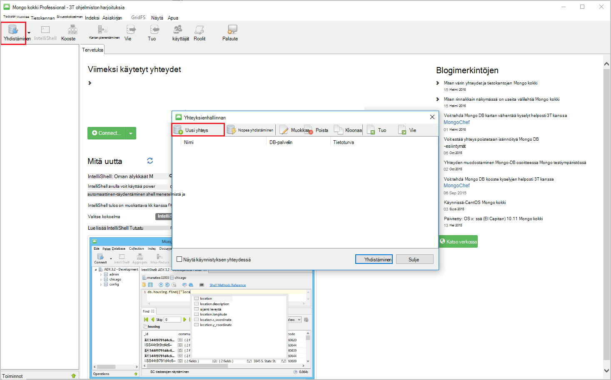
    
2. Kirjoita **palvelin** -välilehdessä **Uusi yhteys** -ikkunassa HOST (FQDN) DocumentDB-tilin kanssa MongoDB ja PORTIN protokollatuki.
    
    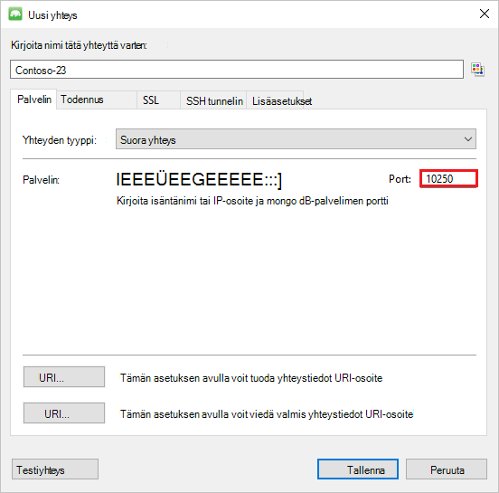

3. Valitse **Uusi yhteys** -ikkunassa **todennus** -välilehden todennustila **standardi (MONGODB CR tai SCARM SHA-1)** ja kirjoita käyttäjänimi ja salasana.  Hyväksy oletusarvon todennus db (järjestelmänvalvojat) tai oman arvoa.

    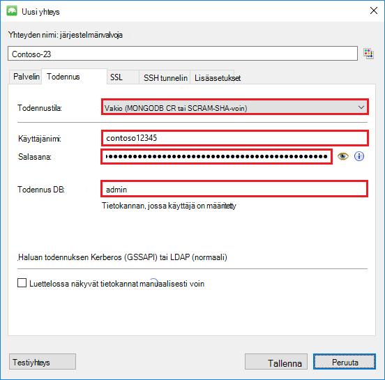

4. **SSL** -välilehdessä **Uusi yhteys** -ikkunassa Tarkista **muodostaa Käytä SSL-protokollaa** -valintaruudun valinta ja **Hyväksy itse allekirjoitettua SSL-varmenteita** -valintanappi.

    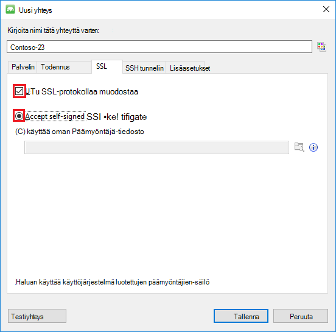

5. Tarkista yhteyden tiedot, valitse **OK** , jos haluat palata uusi yhteys-ikkunaan ja valitse sitten **Tallenna**valitsemalla **Testaa yhteyttä** .

    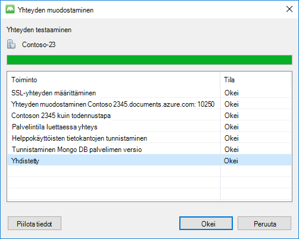

## Käytä MongoChef tietokannan, sivustokokoelman ja asiakirjojen luominen  

Tietokannan luominen kerääminen ja tiedostojen MongoChef, suorita seuraavat vaiheet.

1. **Yhteyksienhallinnan**ja Korosta yhteys ja valitse **Yhdistä**.

    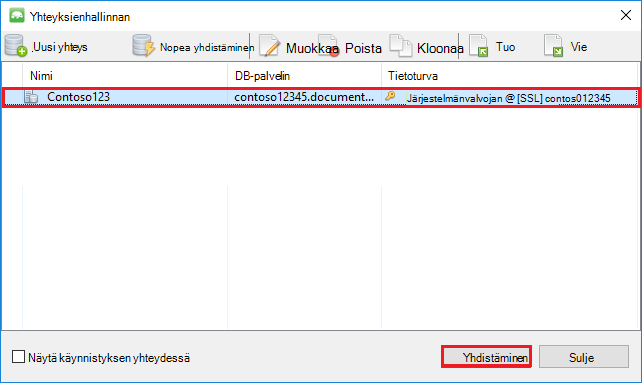

2. Isännän hiiren kakkospainikkeella ja valitse **Lisää tietokannan**.  Tietokannan nimi ja valitse **OK**.
    
    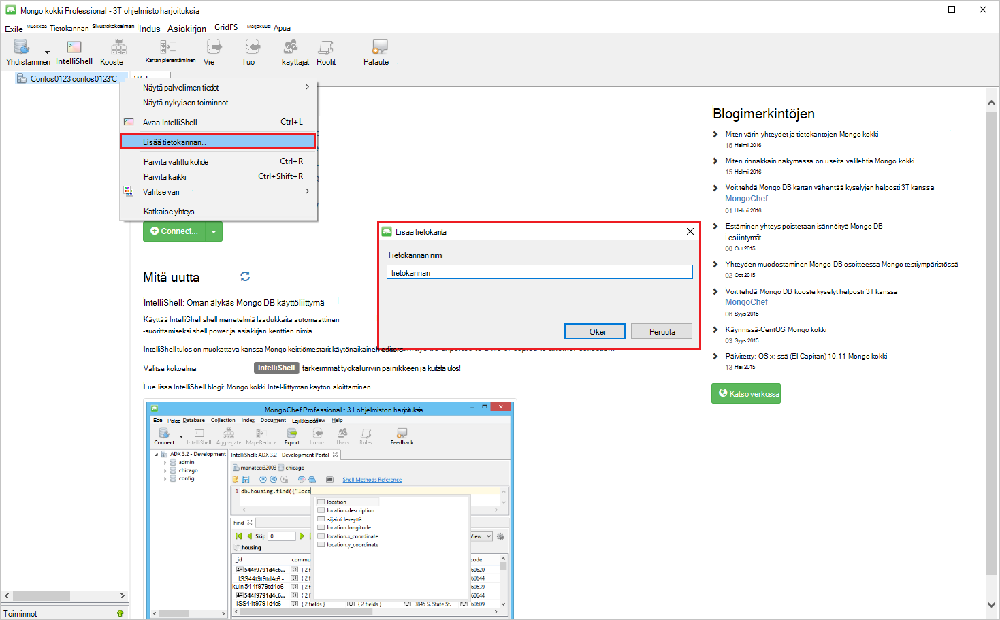

3. Tietokannan hiiren kakkospainikkeella ja valitse **Lisää sivustokokoelman**.  Sivustokokoelman nimi ja valitse **Luo**.

    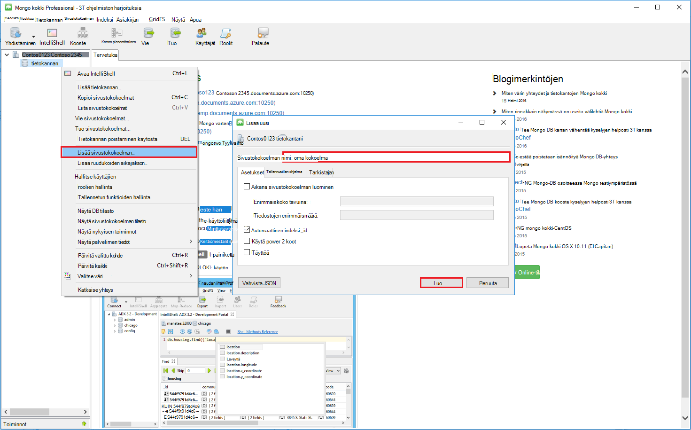

4. Valitse **sivustokokoelman** -valikkovaihtoehto ja valitse sitten **Lisää tiedosto**.

    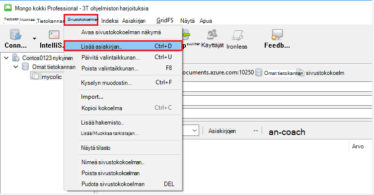

5. Lisää tiedosto-valintaikkunassa Liitä seuraavista ja valitse sitten **Lisää tiedosto**.

        {
        "_id": "AndersenFamily",
        "lastName": "Andersen",
        "parents": [
            { "firstName": "Thomas" },
            { "firstName": "Mary Kay"}
        ],
        "children": [
        {
            "firstName": "Henriette Thaulow", "gender": "female", "grade": 5,
            "pets": [{ "givenName": "Fluffy" }]
        }
        ],
        "address": { "state": "WA", "county": "King", "city": "seattle" },
        "isRegistered": true
        }

    
6. Lisää toiseen tiedostoon, tällä hetkellä seuraavia sisältöä.

        {
        "_id": "WakefieldFamily",
        "parents": [
            { "familyName": "Wakefield", "givenName": "Robin" },
            { "familyName": "Miller", "givenName": "Ben" }
        ],
        "children": [
            {
                "familyName": "Merriam", 
                "givenName": "Jesse", 
                "gender": "female", "grade": 1,
                "pets": [
                    { "givenName": "Goofy" },
                    { "givenName": "Shadow" }
                ]
            },
            { 
                "familyName": "Miller", 
                "givenName": "Lisa", 
                "gender": "female", 
                "grade": 8 }
        ],
        "address": { "state": "NY", "county": "Manhattan", "city": "NY" },
        "isRegistered": false
        }

7. Esimerkkikyselyn suorittaminen. Esimerkiksi perheille, joissa Sukunimi 'Andersen' hakeminen ja palaa vanhemmille ja osavaltio-kenttien.

    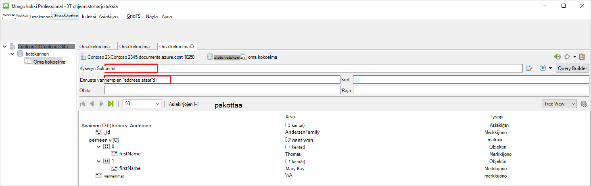
    

## Seuraavat vaiheet

- Tutustu DocumentDB protokollatuki MongoDB [esimerkkejä, joiden](documentdb-mongodb-samples.md)kanssa.

 
