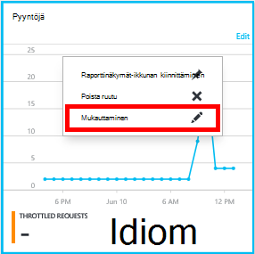

<properties
    pageTitle="Seurata DocumentDB pyynnöt ja tallennustilaa | Microsoft Azure"
    description="Opettele valvoa DocumentDB tilin käyttö arvot, kuten tallennustilan kulutus ja suorituskyvyn mittarit, kuten pyynnöt ja palvelimen virheet."
    services="documentdb"
    documentationCenter=""
    authors="mimig1"
    manager="jhubbard"
    editor="cgronlun"/>

<tags
    ms.service="documentdb"
    ms.workload="data-services"
    ms.tgt_pltfrm="na"
    ms.devlang="na"
    ms.topic="article"
    ms.date="10/17/2016"
    ms.author="mimig"/>

# Seurata DocumentDB pyynnöt, käyttö ja tallennustilaa

Voit valvoa Azure DocumentDB asiakkaiden [Azure portal](https://portal.azure.com/). DocumentDB-tileille sekä suorituskyvyn mittarit, esimerkiksi pyynnöt ja virheiden sekä käyttö arvot, kuten tallennustilan kulutus ovat käytettävissä.

Arvot tarkistaa tili-sivu tai uudet arvot-sivu.

## Näytä suorituskyvyn mittarit-arvot-sivu

1. Uudessa ikkunassa Avaa [Azure portal](https://portal.azure.com/), valitse **Lisää palveluja**, valitse **DocumentDB (NoSQL)**ja valitse sitten, jonka haluat tarkastella suorituskyvyn mittarit DocumentDB tilin nimi.
2. Valitse resurssi-valikossa **arvot**.

Arvot-sivu avautuu ja voit valita tarkistettava sivustokokoelman. Voit tarkastella käytettävyyden, pyynnöt, liikenteen ja tallennustilaa arvot ja verrata niitä DocumentDB palvelutasosopimuksia.

## Näytä suorituskyvyn mittarit, valitse tili-sivu
1.  Uudessa ikkunassa Avaa [Azure portal](https://portal.azure.com/), valitse **Lisää palveluja**, valitse **DocumentDB (NoSQL)**ja valitse sitten, jonka haluat tarkastella suorituskyvyn mittarit DocumentDB tilin nimi.

2.  **Seuranta** -linssin näyttää oletusarvoisesti seuraavat ruudut:
    *   Nykyisen päivän tarjouspyyntöjen.
    *   Tallennustilaa.

    Jos luulet, että tietokannassa on tietoja taulukon näyttää **tietoja ei ole käytettävissä** , on kohdassa [vianmääritys](#troubleshooting) .

    

3.  **Pyynnöt** ja **tallennustilaa** valitsemalla ruutu avautuu yksityiskohtaiset **metrijärjestelmä** -sivu.
4.  **Arvo** -sivu näyttää tietoja arvot on valittuna.  Yläreunaan sivu on kaavion pyyntöjen valinnoista kerran tunnissa ja alla on taulukko, joka näyttää kyselyn ja yhteensä pyynnöt arvot kooste.  Metrijärjestelmän sivu näkyy myös ilmoituksia, jotka on määritetty-arvot, jotka näkyvät nykyisen metrisillä sivu suodatettuna luettelo (tällä tavalla, jos sinulla on useita ilmoituksia, näet vain tässä asiaa niistä).   

    

## Suorituskyvyn portaalissa metrisillä näkymien mukauttaminen

1.  Voit mukauttaa arvot, jotka näyttävät tietyn kaavion kaaviota ja avaa se **metrijärjestelmä** -sivu ja valitse sitten **Muokkaa kaaviota**.  
    

2.  **Muokkaa kaavion** -sivu on asetuksia, jotka näyttävät kaavion sekä niiden aikavälin arvot.  
    

3.  Muuttaa arvot näytetään-osassa, riittää, että Valitse ja poista käytettävissä suorituskyvyn mittarit sivu alaosassa **OK** .  
4.  Haluat olevan aikavälin muuttaminen valita eri tietoalueen (esimerkiksi **Mukautetut**) ja valitse sitten sivu alareunassa **OK** .  

    

## Portaalissa rinnakkain kaavioiden luominen
Azure-portaalin avulla voit luoda rinnakkain metrisillä kaavioita.  

1.  Napsauta ensin haluat kopioida, ja valitse sitten **Mukauta**kaavion.

    

2.  Valitse **Kloonaa** -valikosta Kopioi osa ja valitse sitten **Valmis mukauttaminen**.

      

Voi nyt käsittelette tämän osan metrisillä osa, arvot ja kellonaika alue osassa näkyvä mukauttaminen.  Näin näet kaksi eri arvot kaavio-rinnakkais samanaikaisesti.  
      

## Määritä ilmoitukset-portaalissa
1.  [Azure portal](https://portal.azure.com/) **Lisää palveluja**ja valitse **DocumentDB (NoSQL)**, jonka haluat asennuksen suorituskyvyn metrisillä ilmoitusten DocumentDB tilin nimi.

2.  Valitse resurssi-valikossa **Ilmoitusten säännöt** Avaa ilmoitusten säännöt-sivu.  
    

3.  Valitse **Lisää ilmoitus** **ilmoitusten säännöt** -sivu.  
    

4.  Määritä **ilmoitusten säännön lisääminen** -sivu:
    *   Olet määrittämässä ilmoitusten säännön nimi.
    *   Uusi ilmoitus säännön kuvaus.
    *   Hälytyksen lisätiedot.
    *   Esimerkiksi ehto kynnysarvo ja ajan, jotka määrittävät, milloin ilmoituksen Aktivoi. Esimerkiksi palvelinvirhe määrä suurempi kuin 5 viimeisen 15 minuutin päälle.
    *   Palvelun järjestelmänvalvoja ja coadministrators ovat onko sähköpostitse kun ilmoituksen käynnistyy.
    *   Ylimääräisten sähköpostiosoitteiden ilmoitukset.  
    

## Valvoa DocumentDB ohjelmallisesti
Tilin tason määritetty käytettävissä-portaalissa, kuten tilin tallennustilan käyttö- ja summa pyynnöt, eivät ole käytettävissä DocumentDB-ohjelmointirajapinnan kautta. Voit kuitenkin hakea käyttötiedot sivustokokoelman tasolla käyttämällä DocumentDB-ohjelmointirajapinnan. Sivustokokoelman tasolla tietojen hakemiseen seuraavasti:

- Jos haluat käyttää REST-Ohjelmointirajapinta, [suorittaa GET-kokoelmaan](https://msdn.microsoft.com/library/mt489073.aspx). X-ms-resurssi-kiintiön ja x-ms-resurssien-käyttö ylätunnisteet vastauksesta palautetaan kokoelman tiedot kiintiön ja käyttö.
- Käyttämään .NET SDK-menetelmällä [DocumentClient.ReadDocumentCollectionAsync](https://msdn.microsoft.com/library/microsoft.azure.documents.client.documentclient.readdocumentcollectionasync.aspx) , joka palauttaa [ResourceResponse](https://msdn.microsoft.com/library/dn799209.aspx) , joka sisältää useita käyttö ominaisuuksien, kuten **CollectionSizeUsage**, **DatabaseUsage**tai **DocumentUsage**.

Jos haluat käyttää muita arvot, käytä [Azure näytön SDK](https://www.nuget.org/packages/Microsoft.Azure.Insights). Soittamalla voi hakea käytettävissä metrisillä määritykset:

    https://management.azure.com/subscriptions/{SubscriptionId}/resourceGroups/{ResourceGroup}/providers/Microsoft.DocumentDb/databaseAccounts/{DocumentDBAccountName}/metricDefinitions?api-version=2015-04-08

Kyselyjä, jotka hakevat yksittäisiä arvot Käytä seuraava kaava:

    https://management.azure.com/subscriptions/{SubecriptionId}/resourceGroups/{ResourceGroup}/providers/Microsoft.DocumentDb/databaseAccounts/{DocumentDBAccountName}/metrics?api-version=2015-04-08&$filter=%28name.value%20eq%20%27Total%20Requests%27%29%20and%20timeGrain%20eq%20duration%27PT5M%27%20and%20startTime%20eq%202016-06-03T03%3A26%3A00.0000000Z%20and%20endTime%20eq%202016-06-10T03%3A26%3A00.0000000Z

Lisätietoja on artikkelissa [Resurssin arvot haetaan Azure näytön REST-Ohjelmointirajapinnalla kautta](https://blogs.msdn.microsoft.com/cloud_solution_architect/2016/02/23/retrieving-resource-metrics-via-the-azure-insights-api/). Huomaa, että "Azure Inights" on nimetty uudelleen "Azure näytön".  Tämä blogimerkinnän viittaa vanhempia nimi.

## Vianmääritys
Jos seurantaa ruutujen Näytä **tietoja ei ole käytettävissä** viesti ja viimeksi tehdyt pyynnöt tai lisätä tiedot tietokantaan, voit muokata vastaamaan viimeisimmät käyttö ruutu.

### Nykyinen tietojen päivittäminen ruudun muokkaaminen
1.  Voit mukauttaa arvot, jotka näyttävät tietyn osan kaaviota ja Avaa **metrijärjestelmä** sivu ja valitse sitten **Muokkaa kaavion**.  
    

2.  Valitse **Muokkaa kaavio** -sivu **Aikaväli** -osassa napsauttamalla **aiempia tunti**ja valitse sitten **OK**.  
    

3.  Oman ruutu pitäisi nyt päivittää nykyiset tiedot ja käyttö.  
    

## Seuraavat vaiheet
Lisätietoja DocumentDB kapasiteetti on artikkelissa [hallinta DocumentDB kapasiteetti](documentdb-manage.md).
