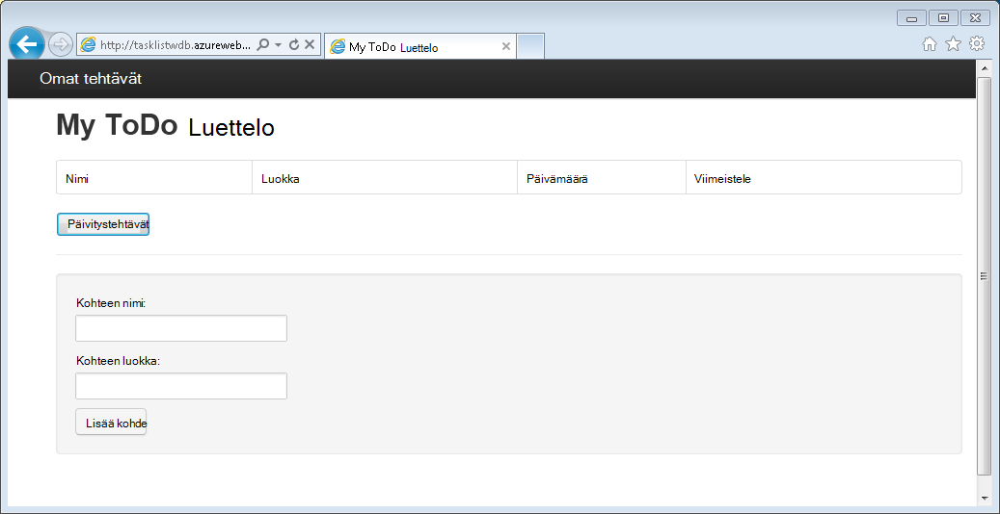
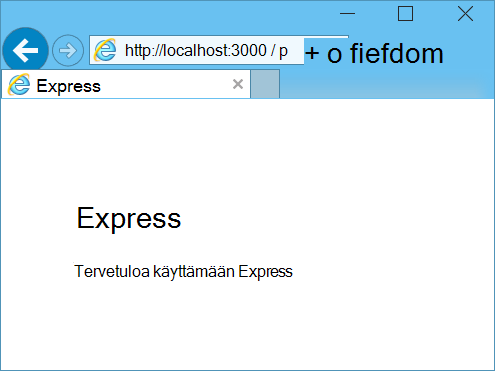
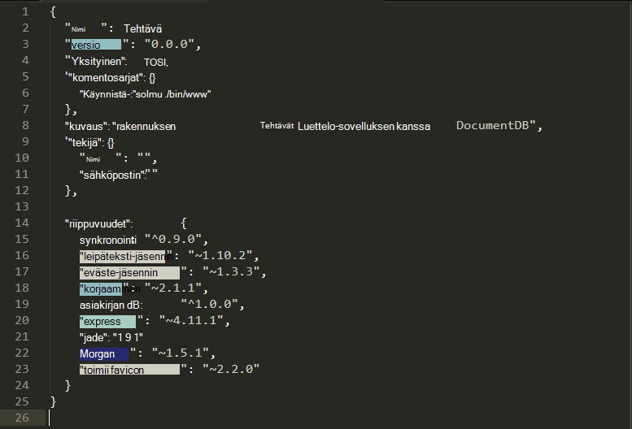

<properties 
    pageTitle="Lisätietoja Node.js - DocumentDB Node.js opetusohjelma | Microsoft Azure" 
    description="Lisätietoja Node.js! Opetusohjelma käsitellään opit käyttämään Microsoft Azure DocumentDB tallentaa ja käyttää tietoja Azure-verkkosivustoa isännöidään Node.js Express WWW-sovelluksesta." 
    keywords="Sovellusten kehittämisen opetusohjelmassa tietokannan tietoja node.js, node.js opetusohjelma, documentdb, azure, Microsoft azure"
    services="documentdb" 
    documentationCenter="nodejs" 
    authors="syamkmsft" 
    manager="jhubbard" 
    editor="cgronlun"/>

<tags 
    ms.service="documentdb" 
    ms.workload="data-services" 
    ms.tgt_pltfrm="na" 
    ms.devlang="nodejs" 
    ms.topic="hero-article" 
    ms.date="08/25/2016" 
    ms.author="syamk"/>

# Node.js DocumentDB käyttävän verkkosovelluksen luominen

> [AZURE.SELECTOR]
- [.NET](documentdb-dotnet-application.md)
- [Node.js](documentdb-nodejs-application.md)
- [Java](documentdb-java-application.md)
- [Python](documentdb-python-application.md)

Node.js Tässä opetusohjelmassa näytetään, miten Azure DocumentDB-palvelun avulla voit tallentaa ja access-tietojen Azure-verkkosivustoa isännöidään Node.js Express-sovelluksesta.

On suositeltavaa katselemalla seuraavassa videossa, jossa opit miten valmistella Azure DocumentDB tietokannan tili ja JSON-tiedostojen tallentaminen Node.js-sovelluksen käytön aloittaminen. 

> [AZURE.VIDEO azure-demo-getting-started-with-azure-documentdb-on-nodejs-in-linux]

Valitse palaa Node.js Tässä opetusohjelmassa, jossa käydään vastaamalla seuraaviin kysymyksiin:

- Miten DocumentDB documentdb npm moduulin toimii?
- Miten voin ottaa Azure sivustojen web-sovelluksen?

Seuraamalla tietokannan Tässä opetusohjelmassa, voit luoda yksinkertaisen verkkopohjaisia Tehtävänhallinnan-sovellus, jonka avulla luodaan, hakeminen ja tehtävien suorittamisesta. Tehtävät tallennetaan tiedostoina JSON Azure DocumentDB.

Älä on aikaa opetusohjelman ja haluat vain Hae täydellinen ratkaisu? Ei ole ongelma, saat valmis malli-ratkaisun [GitHub][].

## Edellytykset

> [AZURE.TIP] Tässä opetusohjelmassa Node.js oletetaan, että edellisen kokemusta Node.js ja Azure sivustot.

Ennen kuin noudattamalla tämän artikkelin, varmista, että käytössäsi ovat seuraavat:

- Azure active tili. Jos sinulla ei ole tiliä, voit luoda ilmainen kokeiluversio tili vain muutaman minuutin. Lisätietoja on artikkelissa [Azure maksuttoman kokeiluversion](https://azure.microsoft.com/pricing/free-trial/).
- [Node.js][] versio v0.10.29 tai uudempi versio.
- [Express luontitoiminto](http://www.expressjs.com/starter/generator.html) (tämä kautta voit asentaa `npm install express-generator -g`)
- [Git][].

## Vaihe 1: DocumentDB tietokannan tilin luominen

Aloitetaan luomalla DocumentDB-tili. Jos olet jo määrittänyt tilin, voit jatkaa [Vaihe 2: Luo uusi Node.js sovellus](#_Toc395783178).

[AZURE.INCLUDE [documentdb-create-dbaccount](../../includes/documentdb-create-dbaccount.md)]

[AZURE.INCLUDE [documentdb-keys](../../includes/documentdb-keys.md)]

## Vaihe 2: Opi luomaan uusi Node.js-sovellus

Nyt Muotoilukoodin Hei maailma Node.js perusprojektin, käyttämällä [Express](http://expressjs.com/) -framework luomiseen.

1. Avaa tuttuja päätteen.

2. Express luontitoiminnon avulla voit luoda uuden sovelluksen kutsutaan **todo**.

        express todo

3. Avaa uusi **todo** -kansio ja asenna riippuvuudet.

        cd todo
        npm install

4. Suorita uusi sovellus.

        npm start

5. Voit tehdä voit tarkastella siirtymällä [http://localhost:3000](http://localhost:3000)selaimesi uusi sovellus.

    

## Vaihe 3: Asenna moduuleja

**Package.json** -tiedosto on projektin ylimmällä luotuja tiedostoja. Tiedoston nimi sisältää moduuleja, joita tarvitaan Node.js sovelluksen luettelo. Myöhemmin, kun otat tämän sovelluksen Azure-sivustojen, tätä tiedostoa käytetään voit selvittää, mitä moduuleja on asennettava sovelluksen tukemaan Azure. On edelleen valmisteltava asentaminen kaksi Lisää pakettien Tässä opetusohjelmassa.

1. Pääte-kohdassa kautta npm **asynkroninen** -moduulin asentaminen.

        npm install async --save

1. Kautta npm **documentdb** -moduulin asentaminen. Tämä on moduuli, jossa DocumentDB tärkeä tapahtuu.

        npm install documentdb --save

3. Nopea valintaruudun **package.json** tiedoston sovelluksen pitäisi näkyä muita moduulit. Tämän tiedoston kertoo Azure pakettien ladattava ja asennettava sovelluksen suoritettaessa. Pitäisi olla esimerkiksi alla olevassa esimerkissä.

    

    Tämä kertoo solmu (ja uudempi Azure), että sovelluksesi riippuu näitä moduuleja.

## Vaihe 4: DocumentDB-palvelun avulla solmu-sovelluksessa

Joka kestää huolellisesti ensimmäinen asennus ja määritys-nyt japanin get alaspäin miksi voimme ja kirjoittaa lisäkoodin avulla Azure DocumentDB on.

### Luo malli

1. Project-kansioon Luo uusi kansio nimeltä **Mallit**.
2. **Mallit** -kansioon Luo uusi tiedosto nimeltä **taskDao.js**. Tämä tiedosto sisältää tämän sovelluksen luomat tehtävät mallista.
3. Luo toinen tiedosto nimeltä **docdbUtils.js**samaan **Mallit** -kansioon. Tämä tiedosto sisältää joitakin hyödyllisiä, uudelleenkäytettäviä, tunnus, jolla tämän sovelluksen koko Käytämme. 
4. Kopioi seuraava koodi- **docdbUtils.js**

        var DocumentDBClient = require('documentdb').DocumentClient;
            
        var DocDBUtils = {
            getOrCreateDatabase: function (client, databaseId, callback) {
                var querySpec = {
                    query: 'SELECT * FROM root r WHERE r.id= @id',
                    parameters: [{
                        name: '@id',
                        value: databaseId
                    }]
                };
        
                client.queryDatabases(querySpec).toArray(function (err, results) {
                    if (err) {
                        callback(err);
        
                    } else {
                        if (results.length === 0) {
                            var databaseSpec = {
                                id: databaseId
                            };
        
                            client.createDatabase(databaseSpec, function (err, created) {
                                callback(null, created);
                            });
        
                        } else {
                            callback(null, results[0]);
                        }
                    }
                });
            },
        
            getOrCreateCollection: function (client, databaseLink, collectionId, callback) {
                var querySpec = {
                    query: 'SELECT * FROM root r WHERE r.id=@id',
                    parameters: [{
                        name: '@id',
                        value: collectionId
                    }]
                };             
                
                client.queryCollections(databaseLink, querySpec).toArray(function (err, results) {
                    if (err) {
                        callback(err);
        
                    } else {        
                        if (results.length === 0) {
                            var collectionSpec = {
                                id: collectionId
                            };
                            
                            client.createCollection(databaseLink, collectionSpec, function (err, created) {
                                callback(null, created);
                            });
        
                        } else {
                            callback(null, results[0]);
                        }
                    }
                });
            }
        };
                
        module.exports = DocDBUtils;

    > [AZURE.TIP] createCollection on valinnainen requestOptions-parametri, jonka avulla voidaan määrittää kokoelman tarjota. Jos requestOptions.offerType ei ole arvoa ei toimitettu sitten kokoelma luodaan käyttämällä oletusarvoista tarjota tyyppi.
    >
    > Lisätietoja DocumentDB tarjota tyypit Lue [DocumentDB tasojen suorituskyky](documentdb-performance-levels.md) 
        
3. Tallenna ja sulje **docdbUtils.js** -tiedosto.

4. **TaskDao.js** tiedoston alussa, Lisää seuraava koodi viittaus **DocumentDBClient** ja **docdbUtils.js** edellä luomaasi:

        var DocumentDBClient = require('documentdb').DocumentClient;
        var docdbUtils = require('./docdbUtils');

4. Lisää seuraavaksi määrittäminen ja viedä tehtävän objektin koodi. Tämä on vastuussa valmistellaan Microsoftin tehtävän objektin ja tietokannan ja asiakirjan sivustokokoelman Käytämme määrittäminen.

        function TaskDao(documentDBClient, databaseId, collectionId) {
          this.client = documentDBClient;
          this.databaseId = databaseId;
          this.collectionId = collectionId;
        
          this.database = null;
          this.collection = null;
        }
        
        module.exports = TaskDao;

5. Lisää seuraava koodi määrittää muita tapoja tehtävän kohdetta, jotka mahdollistavat aktiviteettien DocumentDB tallennettuja tietoja.

        TaskDao.prototype = {
            init: function (callback) {
                var self = this;
        
                docdbUtils.getOrCreateDatabase(self.client, self.databaseId, function (err, db) {
                    if (err) {
                        callback(err);
                    } else {
                        self.database = db;
                        docdbUtils.getOrCreateCollection(self.client, self.database._self, self.collectionId, function (err, coll) {
                            if (err) {
                                callback(err);
        
                            } else {
                                self.collection = coll;
                            }
                        });
                    }
                });
            },
        
            find: function (querySpec, callback) {
                var self = this;
        
                self.client.queryDocuments(self.collection._self, querySpec).toArray(function (err, results) {
                    if (err) {
                        callback(err);
        
                    } else {
                        callback(null, results);
                    }
                });
            },
        
            addItem: function (item, callback) {
                var self = this;
        
                item.date = Date.now();
                item.completed = false;
        
                self.client.createDocument(self.collection._self, item, function (err, doc) {
                    if (err) {
                        callback(err);
        
                    } else {
                        callback(null, doc);
                    }
                });
            },
        
            updateItem: function (itemId, callback) {
                var self = this;
        
                self.getItem(itemId, function (err, doc) {
                    if (err) {
                        callback(err);
        
                    } else {
                        doc.completed = true;
        
                        self.client.replaceDocument(doc._self, doc, function (err, replaced) {
                            if (err) {
                                callback(err);
        
                            } else {
                                callback(null, replaced);
                            }
                        });
                    }
                });
            },
        
            getItem: function (itemId, callback) {
                var self = this;
        
                var querySpec = {
                    query: 'SELECT * FROM root r WHERE r.id = @id',
                    parameters: [{
                        name: '@id',
                        value: itemId
                    }]
                };
        
                self.client.queryDocuments(self.collection._self, querySpec).toArray(function (err, results) {
                    if (err) {
                        callback(err);
        
                    } else {
                        callback(null, results[0]);
                    }
                });
            }
        };

6. Tallenna ja sulje **taskDao.js** -tiedosto. 

### Luo ohjain

1. Projektin **tiet** -kansioon Luo uusi tiedosto nimeltä **tasklist.js**. 
2. Lisää seuraava koodi **tasklist.js**. Tämä Lataa DocumentDBClient ja asynkronisen moduulit, jotka käyttävät **tasklist.js**. Tämä on määritetty myös **TaskList** -funktiota, joka on välitetty määritimme aiemmin **tehtävän** objektin esiintymä:

        var DocumentDBClient = require('documentdb').DocumentClient;
        var async = require('async');
        
        function TaskList(taskDao) {
          this.taskDao = taskDao;
        }
        
        module.exports = TaskList;

3. Jatka **tasklist.js** -tiedoston lisääminen lisäämällä **showTasks, addTask**ja **completeTasks**menetelmiä:
        
        TaskList.prototype = {
            showTasks: function (req, res) {
                var self = this;
        
                var querySpec = {
                    query: 'SELECT * FROM root r WHERE r.completed=@completed',
                    parameters: [{
                        name: '@completed',
                        value: false
                    }]
                };
        
                self.taskDao.find(querySpec, function (err, items) {
                    if (err) {
                        throw (err);
                    }
        
                    res.render('index', {
                        title: 'My ToDo List ',
                        tasks: items
                    });
                });
            },
        
            addTask: function (req, res) {
                var self = this;
                var item = req.body;
        
                self.taskDao.addItem(item, function (err) {
                    if (err) {
                        throw (err);
                    }
        
                    res.redirect('/');
                });
            },
        
            completeTask: function (req, res) {
                var self = this;
                var completedTasks = Object.keys(req.body);
        
                async.forEach(completedTasks, function taskIterator(completedTask, callback) {
                    self.taskDao.updateItem(completedTask, function (err) {
                        if (err) {
                            callback(err);
                        } else {
                            callback(null);
                        }
                    });
                }, function goHome(err) {
                    if (err) {
                        throw err;
                    } else {
                        res.redirect('/');
                    }
                });
            }
        };

4. Tallenna ja sulje **tasklist.js** -tiedosto.
 
### Lisää config.js

1. Projektin hakemistossa Luo uusi tiedosto nimeltä **config.js**.
2. Lisää seuraavat **config.js**. Tämä määrittää asetukset ja tutustu sovellukselle tarvittavat arvot.

        var config = {}
        
        config.host = process.env.HOST || "[the URI value from the DocumentDB Keys blade on http://portal.azure.com]";
        config.authKey = process.env.AUTH_KEY || "[the PRIMARY KEY value from the DocumentDB Keys blade on http://portal.azure.com]";
        config.databaseId = "ToDoList";
        config.collectionId = "Items";
        
        module.exports = config;

3. **Config.js** -tiedostossa isännän ja AUTH_KEY käyttämällä [Microsoft Azure Portal](https://portal.azure.com)-tilisi DocumentDB näppäimet-sivu-kohdan arvoja arvojen päivittäminen:

4. Tallenna ja sulje **config.js** -tiedosto.
 
### Muokkaa app.js

1. Project-kansioon Avaa **app.js** -tiedosto. Aiemmin luotu tiedosto Express-web-sovelluksen luonnin yhteydessä.
2. Lisää seuraava koodi **app.js** alkuun
    
        var DocumentDBClient = require('documentdb').DocumentClient;
        var config = require('./config');
        var TaskList = require('./routes/tasklist');
        var TaskDao = require('./models/taskDao');

3. Koodi määrittää config-tiedoston, jota käytetään, ja voit lukea tämän tiedoston, jotkin muuttujat Käytämme pian ulos arvot.
4. Korvaa **app.js** tiedoston seuraavat kaksi riviä:

        app.use('/', routes);
        app.use('/users', users); 

      seuraavat koodikatkelman: kanssa

        var docDbClient = new DocumentDBClient(config.host, {
            masterKey: config.authKey
        });
        var taskDao = new TaskDao(docDbClient, config.databaseId, config.collectionId);
        var taskList = new TaskList(taskDao);
        taskDao.init();
        
        app.get('/', taskList.showTasks.bind(taskList));
        app.post('/addtask', taskList.addTask.bind(taskList));
        app.post('/completetask', taskList.completeTask.bind(taskList));
        app.set('view engine', 'jade');

6. Nämä rivit määrittäminen meidän **TaskDao** objektin uuden esiintymän, on uusi yhteys DocumentDB (joko lukea **config.js**arvot), alusta tehtäväobjekti ja sidot menetelmiä Microsoftin **TaskList** ohjaimen lomakkeen toiminnot. 

7. Lopuksi Tallenna ja sulje tiedosto **app.js** , on melkein valmis.
 
## Vaihe 5: Luominen käyttöliittymää.

Nyt japanin ottaminen Microsoftin huomiota rakentamiseen käyttöliittymän, jotta käyttäjän todella käsitellä tämän sovelluksen. Näytä-ohjelma käyttää **Jade** Express-sovellus on luotu. Lisätietoja Jade tutustumaan [http://jade-lang.com/](http://jade-lang.com/).

1. **Näkymien** hakemiston **layout.jade** tiedoston käytetään yleisen mallin **.jade** muita tiedostoja. Tässä vaiheessa muokataan käyttämään [Twitter-automaattinen](https://github.com/twbs/bootstrap), joka on Työkalut, joka on helppo nice näköisen verkkosivuston suunnitteluun. 
2. Avaa **layout.jade** tiedoston **näkymät** -kansiossa ja korvata sisällön toimista:
    
        doctype html
        html
          head
            title= title
            link(rel='stylesheet', href='//ajax.aspnetcdn.com/ajax/bootstrap/3.3.2/css/bootstrap.min.css')
            link(rel='stylesheet', href='/stylesheets/style.css')
          body
            nav.navbar.navbar-inverse.navbar-fixed-top
              div.navbar-header
                a.navbar-brand(href='#') My Tasks
            block content
            script(src='//ajax.aspnetcdn.com/ajax/jQuery/jquery-1.11.2.min.js')
            script(src='//ajax.aspnetcdn.com/ajax/bootstrap/3.3.2/bootstrap.min.js')

    Tämä tehokkaasti hahmontamiseen joitakin HTML tämän sovelluksen **Jade** ohjelma ilmoittaa, ettei ja luo kutsutaan **sisältö** on missä antaa asettelua, tutustu sisältösivuja **Estä** .
    Tallenna ja sulje **layout.jade** tiedoston.

4. Avaa nyt **index.jade** tiedoston, näkymä, joka käytetään tämän sovelluksen ja korvaa tiedoston sisällön seuraavasti:

        extends layout
        
        block content
          h1 #{title}
          br
        
          form(action="/completetask", method="post")
            table.table.table-striped.table-bordered
              tr
                td Name
                td Category
                td Date
                td Complete
              if (typeof tasks === "undefined")
                tr
                  td
              else
                each task in tasks
                  tr
                    td #{task.name}
                    td #{task.category}
                    - var date  = new Date(task.date);
                    - var day   = date.getDate();
                    - var month = date.getMonth() + 1;
                    - var year  = date.getFullYear();
                    td #{month + "/" + day + "/" + year}
                    td
                      input(type="checkbox", name="#{task.id}", value="#{!task.completed}", checked=task.completed)
            button.btn(type="submit") Update tasks
          hr
          form.well(action="/addtask", method="post")
            label Item Name:
            input(name="name", type="textbox")
            label Item Category:
            input(name="category", type="textbox")
            br
            button.btn(type="submit") Add item

    Tämä laajentaa asettelua sekä annetaan sisältö on tuli aiemmin **layout.jade** tiedoston **sisällön** paikkamerkki.
    
    Tässä asettelussa luomaasi kaksi HTML-muotoa. 
    Ensimmäinen lomake sisältää taulukon tietojamme ja painike, joka pystyy päivittämään kohteiden lähettämällä Microsoftin ohjauskoneen **/completetask** -menetelmää.
    Toisessa lomakkeessa on kaksi syötteen kentät ja painike, joka pystyy voit luoda uuden kohteen lähettämällä Microsoftin ohjauskoneen **/addtask** -menetelmää.
    
    Kaikki, jotka toimivat Microsoftin sovelluksen annettava on oltava.

5. Avaa **public\stylesheets** directory **style.css** -tiedosto ja korvaa koodin seuraavasti:

        body {
          padding: 50px;
          font: 14px "Lucida Grande", Helvetica, Arial, sans-serif;
        }
        a {
          color: #00B7FF;
        }
        .well label {
          display: block;
        }
        .well input {
          margin-bottom: 5px;
        }
        .btn {
          margin-top: 5px;
          border: outset 1px #C8C8C8;
        }

    Tallenna ja sulje **style.css** tiedoston.

## Vaihe 6: Suorita sovelluksen paikallisesti

1. Voit testata sovelluksen paikallisessa tietokoneessa, suorita `npm start` Kirjoita terminaalissa, Käynnistä sovellus ja Käynnistä selain on sivun, joka näyttää alla olevassa kuvassa:

    

2. Kirjoita tiedot kenttiin kohdetta, kohteen nimi ja luokan avulla ja valitse sitten **Lisää kohde**.

3. Sivun pitäisi päivittää näytetään juuri luomasi kohde ToDo-luettelossa.

    

4. Tehtävän suorittamiseen yksinkertaisesti valmis-sarakkeen valintaruutu ja valitse sitten **Päivitä**.

## Vaihe 7: Käyttöönottaminen sovellusten kehittämisen projektin Azure-sivustot

1. Jos et ole jo, ota käyttöön git säilö Azure-sivustoon. Ohjeita siitä, miten voit tehdä tämän [Paikallisen Git käyttöönoton Azure-sovelluksen palveluun](../app-service-web/app-service-deploy-local-git.md) artikkelissa.

2. Lisää git, joka on remote Azure-sivustoon.

        git remote add azure https://username@your-azure-website.scm.azurewebsites.net:443/your-azure-website.git

3. Ota käyttöön valitseminen kaukosäätimen avulla.

        git push azure master

4. Muutaman sekunnin kuluttua git valmis julkaiseminen web-sovelluksen ja Avaa selaimessa, näet Azure-tietokannassa on kätevä työsi!

## Seuraavat vaiheet

Onnittelen! Sinulla on vain laadittuihin ensimmäisen Node.js Express Web-sovelluksen käyttäminen Azure DocumentDB ja julkaista Azure sivustojen.

Lähdekoodin viitteen sovelluksen voi ladata [GitHub][].

Lisätietoja on artikkelissa [Node.js Developer Center](https://azure.microsoft.com/develop/nodejs/).

[Node.js]: http://nodejs.org/
[Git]: http://git-scm.com/
[Github]: https://github.com/Azure-Samples/documentdb-node-todo-app
 
