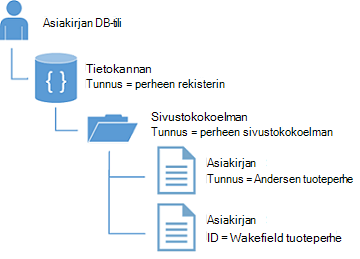
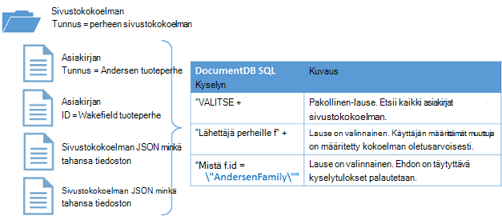

<properties
  pageTitle="Opetusohjelma NoSQL Node.js DocumentDB | Microsoft Azure"
  description="NoSQL Node.js opetusohjelma, joka luo solmu tietokanta ja konsolin sovelluksesta, valitsemalla DocumentDB Node.js SDK-paketissa. DocumentDB on JSON NoSQL tietokannan."
    keywords="node.js opetusohjelmassa solmu-tietokanta"
  services="documentdb"
  documentationCenter="node.js"
  authors="AndrewHoh"
  manager="jhubbard"
  editor="monicar"/>

<tags
  ms.service="documentdb"
  ms.workload="data-services"
  ms.tgt_pltfrm="na"
  ms.devlang="node"
  ms.topic="hero-article"
  ms.date="08/11/2016"
  ms.author="anhoh"/>

# <a name="nosql-nodejs-tutorial-documentdb-nodejs-console-application"></a>NoSQL Node.js opetusohjelma: DocumentDB Node.js console-sovellus  

> [AZURE.SELECTOR]
- [.NET](documentdb-get-started.md)
- [Node.js](documentdb-nodejs-get-started.md)

Tervetuloa Azure DocumentDB Node.js SDK Node.js opetusohjelman! Kun olet suorittanut Tässä opetusohjelmassa, sinun on console-sovelluksella, joka luo ja kyselyjen DocumentDB resurssit, kuten solmu tietokannan.

Käsittelemme:

- Luominen ja yhteyden DocumentDB tilin
- Sovelluksen määrittäminen
- Solmu-tietokannan luominen
- Kokoelma luominen
- JSON-asiakirjojen luominen
- Kyselyt kokoelmaan
- Tiedoston korvaaminen
- Tiedoston poistaminen
- Solmu-tietokannan poistaminen

Ei ole aikaa? Ei hätää! Täydellinen ratkaisu on käytettävissä [GitHub](https://github.com/Azure-Samples/documentdb-node-getting-started). Saat nopean ohjeet [Saat täydellinen ratkaisu](#GetSolution) .

Kun olet suorittanut Node.js opetusohjelman, käytä äänestyspainikkeiden ylä-ja tämän sivun alareunassa palaute. Jos haluat voimme ottaa sinuun yhteyttä henkilökohtaisesti, vapaasti sähköpostiosoitteesi sisällyttäminen kommentit.

Nyt aloitetaan!

## <a name="prerequisites-for-the-nodejs-tutorial"></a>Edellytyksistä Node.js-opetusohjelma

Varmista, että käytössäsi ovat seuraavat:

- Azure active tili. Jos sinulla ei ole, voit rekisteröityä [Maksuttoman Azure-kokeiluversion](https://azure.microsoft.com/pricing/free-trial/).
- [Node.js](https://nodejs.org/) versio v0.10.29 tai uudempi versio.

## <a name="step-1-create-a-documentdb-account"></a>Vaihe 1: DocumentDB-tilin luominen

Luo DocumentDB-tili. Jos sinulla on jo tili, jota haluat käyttää, voit siirtyä eteenpäin [Node.js-sovelluksen asennuksen](#SetupNode).

[AZURE.INCLUDE [documentdb-create-dbaccount](../../includes/documentdb-create-dbaccount.md)]

## <a id="SetupNode"></a>Vaihe 2: Määritä Node.js-sovellus

1. Avaa tuttuja päätteen.
2. Etsi kansio tai kohtaa, johon haluat tallentaa Node.js sovelluksen hakemisto.
3. Luo kaksi tyhjää JavaScript-tiedostojen seuraavia komentoja:
  - Windows:
      * ```fsutil file createnew app.js 0```
        * ```fsutil file createnew config.js 0```
  - Linux/OS x
      * ```touch app.js```
        * ```touch config.js```
4. Kautta npm documentdb-moduulin asentaminen. Kirjoita seuraava komento:
    * ```npm install documentdb --save```

Upea! Nyt kun olet lisännyt on määritetty, aloitetaan lisäkoodin kirjoitettaessa.

## <a id="Config"></a>Vaihe 3: Määritä sinua sovelluksen määritykset

Avaa ```config.js``` tuttuja tekstieditorissa.

Valitse ja kopioi ja liitä alla koodikatkelman ominaisuuksien määrittäminen ```config.endpoint``` ja ```config.primaryKey``` DocumentDB päätepisteen uri ja perusavain. Molemmat määritysten löytyy [Azure-portaalissa](https://portal.azure.com).

![Node.js opetusohjelma – näyttökuva DocumentDB-tili, jossa korostettuna AKTIIVISTA keskittimeen, NÄPPÄIMET-painike korostettuna DocumentDB tili-sivu ja korostettuna näppäimet sivu - solmu tietokannan URI, ensisijainen ja toissijainen AVAIMEN arvot Azure-portaalissa][keys]

    // ADD THIS PART TO YOUR CODE
    var config = {}

    config.endpoint = "~your DocumentDB endpoint uri here~";
    config.primaryKey = "~your primary key here~";

Kopioiminen ja liittäminen ```database id```, ```collection id```, ja ```JSON documents``` , että ```config``` objektin alla kohtaa, johon voit määrittää oman ```config.endpoint``` ja ```config.authKey``` ominaisuudet. Jos sinulla on jo tietoja, jotka haluat tallentaa tietokannan, voit käyttää DocumentDB käyttäjän [tietojen siirtotyökalun](documentdb-import-data.md) sijaan lisääminen asiakirjaan määritykset.

    config.endpoint = "~your DocumentDB endpoint uri here~";
    config.primaryKey = "~your primary key here~";

    // ADD THIS PART TO YOUR CODE
    config.database = {
        "id": "FamilyDB"
    };

    config.collection = {
        "id": "FamilyColl"
    };

    config.documents = {
        "Andersen": {
            "id": "Anderson.1",
            "lastName": "Andersen",
            "parents": [{
                "firstName": "Thomas"
            }, {
                    "firstName": "Mary Kay"
                }],
            "children": [{
                "firstName": "Henriette Thaulow",
                "gender": "female",
                "grade": 5,
                "pets": [{
                    "givenName": "Fluffy"
                }]
            }],
            "address": {
                "state": "WA",
                "county": "King",
                "city": "Seattle"
            }
        },
        "Wakefield": {
            "id": "Wakefield.7",
            "parents": [{
                "familyName": "Wakefield",
                "firstName": "Robin"
            }, {
                    "familyName": "Miller",
                    "firstName": "Ben"
                }],
            "children": [{
                "familyName": "Merriam",
                "firstName": "Jesse",
                "gender": "female",
                "grade": 8,
                "pets": [{
                    "givenName": "Goofy"
                }, {
                        "givenName": "Shadow"
                    }]
            }, {
                    "familyName": "Miller",
                    "firstName": "Lisa",
                    "gender": "female",
                    "grade": 1
                }],
            "address": {
                "state": "NY",
                "county": "Manhattan",
                "city": "NY"
            },
            "isRegistered": false
        }
    };


Tietokannan, sivustokokoelman ja asiakirjan määritelmät toimii oman DocumentDB ```database id```, ```collection id```, ja asiakirjojen tiedot.

Vie-että ```config``` objekti, niin, että voit viitata sen ```app.js``` tiedosto.

            },
            "isRegistered": false
        }
    };

    // ADD THIS PART TO YOUR CODE
    module.exports = config;

##<a id="Connect"></a>Vaihe 4: Muodostaa yhteyden DocumentDB tiliin

Avaa oman tyhjä ```app.js``` tiedostoa tekstieditorissa. Kopioi ja liitä seuraava koodi tuo ```documentdb``` moduulin ja juuri luomasi ```config``` moduuli.

    // ADD THIS PART TO YOUR CODE
    "use strict";

    var documentClient = require("documentdb").DocumentClient;
    var config = require("./config");
    var url = require('url');

Kopioi ja liitä koodi, jota käytetään aiemmin tallennetut ```config.endpoint``` ja ```config.primaryKey``` voit luoda uuden DocumentClient.

    var config = require("./config");
    var url = require('url');

    // ADD THIS PART TO YOUR CODE
    var client = new documentClient(config.endpoint, { "masterKey": config.primaryKey });

Nyt kun olet luonut koodin alustaa documentdb asiakas, voit tarkastella DocumentDB resurssien käyttö.

## <a name="step-5-create-a-node-database"></a>Vaihe 5: Solmu tietokannan luominen
Kopioi ja liitä seuraava koodi HTTP-tilan määrittäminen ei löydy, tietokannan URL-osoite ja sivustokokoelman URL-osoite. Näitä URL-osoitteet ovat, miten DocumentDB asiakkaan etsii oikean tietokannan ja sivustokokoelman.

    var client = new documentClient(config.endpoint, { "masterKey": config.primaryKey });

    // ADD THIS PART TO YOUR CODE
    var HttpStatusCodes = { NOTFOUND: 404 };
    var databaseUrl = `dbs/${config.database.id}`;
    var collectionUrl = `${databaseUrl}/colls/${config.collection.id}`;

[Tietokannan](documentdb-resources.md#databases) voi luoda **DocumentClient** luokan [createDatabase](https://azure.github.io/azure-documentdb-node/DocumentClient.html) -funktiolla. Tietokanta on looginen säilö asiakirjan tallennustilaa osioitu yli sivustokokoelmat.

Kopioi ja liitä uuden tietokannan luomiseen app.js tiedoston **getDatabase** -funktio ```id``` määritetty ```config``` objekti. Funktio tarkistaa, jos saman tietokannan ```FamilyRegistry``` tunnusta ei ole jo. Jos sitä ole, palautettavien sijaan uuden tietokannan.

    var collectionUrl = `${databaseUrl}/colls/${config.collection.id}`;

    // ADD THIS PART TO YOUR CODE
    function getDatabase() {
        console.log(`Getting database:\n${config.database.id}\n`);

        return new Promise((resolve, reject) => {
            client.readDatabase(databaseUrl, (err, result) => {
                if (err) {
                    if (err.code == HttpStatusCodes.NOTFOUND) {
                        client.createDatabase(config.database, (err, created) => {
                            if (err) reject(err)
                            else resolve(created);
                        });
                    } else {
                        reject(err);
                    }
                } else {
                    resolve(result);
                }
            });
        });
    }

Kopioi ja liitä koodi alla, jossa voit määrittää lisää-aputoiminto funktion **Lopeta** , joka tulostuu Lopeta viesti ja **getDatabase** funktion kutsu **getDatabase** -funktio.

                } else {
                    resolve(result);
                }
            });
        });
    }

    // ADD THIS PART TO YOUR CODE
    function exit(message) {
        console.log(message);
        console.log('Press any key to exit');
        process.stdin.setRawMode(true);
        process.stdin.resume();
        process.stdin.on('data', process.exit.bind(process, 0));
    }

    getDatabase()
    .then(() => { exit(`Completed successfully`); })
    .catch((error) => { exit(`Completed with error ${JSON.stringify(error)}`) });

Etsi päätteen, että ```app.js``` tiedoston ja suorita-komento:```node app.js```

Onnittelen! Olet luonut DocumentDB tietokannan.

##<a id="CreateColl"></a>Vaihe 6: Luo kokoelma  

> [AZURE.WARNING] **CreateDocumentCollectionAsync** Luo uusi kokoelma, jolla on hinnat vaikutukset. Lisätietoja käy Microsoftin [hinnat sivun](https://azure.microsoft.com/pricing/details/documentdb/).

[Sivustokokoelman](documentdb-resources.md#collections) voi luoda **DocumentClient** luokan [createCollection](https://azure.github.io/azure-documentdb-node/DocumentClient.html) -funktiolla. Kokoelma on JSON asiakirjojen ja liittyvän JavaScript-sovelluksen logiikkaa säilö.

Kopioiminen ja liittäminen alapuolella luotaessa uusia kokoelmaa kanssa **getDatabase** -funktion **getCollection** -funktio ```id``` määritetty ```config``` objekti. Uudelleen, varmista, että sivustokokoelman samojen tarkistetaan ```FamilyCollection``` tunnusta ei ole jo. Jos sitä ole, palautettavien kyseisen sivustokokoelman sijaan uuden.

                } else {
                    resolve(result);
                }
            });
        });
    }

    // ADD THIS PART TO YOUR CODE
    function getCollection() {
        console.log(`Getting collection:\n${config.collection.id}\n`);

        return new Promise((resolve, reject) => {
            client.readCollection(collectionUrl, (err, result) => {
                if (err) {
                    if (err.code == HttpStatusCodes.NOTFOUND) {
                        client.createCollection(databaseUrl, config.collection, { offerThroughput: 400 }, (err, created) => {
                            if (err) reject(err)
                            else resolve(created);
                        });
                    } else {
                        reject(err);
                    }
                } else {
                    resolve(result);
                }
            });
        });
    }

Kopioi ja liitä koodi **getDatabase** kutsu **getCollection** -funktio suorittaa.

    getDatabase()

    // ADD THIS PART TO YOUR CODE
    .then(() => getCollection())
    // ENDS HERE

    .then(() => { exit(`Completed successfully`); })
    .catch((error) => { exit(`Completed with error ${JSON.stringify(error)}`) });

Etsi päätteen, että ```app.js``` tiedoston ja suorita-komento:```node app.js```

Onnittelen! Olet luonut DocumentDB sivustokokoelman.

##<a id="CreateDoc"></a>Vaihe 7: Asiakirjan luominen
[Asiakirjan](documentdb-resources.md#documents) voi luoda **DocumentClient** luokan [createDocument](https://azure.github.io/azure-documentdb-node/DocumentClient.html) -funktiolla. Käyttäjän määrittämät (haluamaansa) JSON sisältö on tiedostoja. Voit nyt lisätä tiedoston DocumentDB.

Kopioiminen ja liittäminen alapuolella asiakirjojen, joissa JSON tiedot tallennetaan **getCollection** -funktion **getFamilyDocument** -funktio ```config``` objekti. Kuitenkin tarkistetaan varmistaaksesi, että tiedoston samalla tunnuksella ei ole jo.

                } else {
                    resolve(result);
                }
            });
        });
    }

    // ADD THIS PART TO YOUR CODE
    function getFamilyDocument(document) {
        let documentUrl = `${collectionUrl}/docs/${document.id}`;
        console.log(`Getting document:\n${document.id}\n`);

        return new Promise((resolve, reject) => {
            client.readDocument(documentUrl, { partitionKey: document.district }, (err, result) => {
                if (err) {
                    if (err.code == HttpStatusCodes.NOTFOUND) {
                        client.createDocument(collectionUrl, document, (err, created) => {
                            if (err) reject(err)
                            else resolve(created);
                        });
                    } else {
                        reject(err);
                    }
                } else {
                    resolve(result);
                }
            });
        });
    };

Kopioi ja liitä koodi **getCollection** kutsu **getFamilyDocument** -funktio suorittaa.

    getDatabase()
    .then(() => getCollection())

    // ADD THIS PART TO YOUR CODE
    .then(() => getFamilyDocument(config.documents.Andersen))
    .then(() => getFamilyDocument(config.documents.Wakefield))
    // ENDS HERE

    .then(() => { exit(`Completed successfully`); })
    .catch((error) => { exit(`Completed with error ${JSON.stringify(error)}`) });

Etsi päätteen, että ```app.js``` tiedoston ja suorita-komento:```node app.js```

Onnittelen! Olet luonut DocumentDB asiakirjoja.



##<a id="Query"></a>Vaihe 8: Kyselyn DocumentDB resurssit

DocumentDB tukee [monipuolisia kyselyt](documentdb-sql-query.md) , jotka perustuvat JSON valikoimien tallennettuja asiakirjoja. Seuraava esimerkki koodi näkyy kyselyn, jossa voit suorittaa vastaan asiakirjojen kokoelmaa.

Kopioi ja liitä alapuolella **getFamilyDocument** -funktion **queryCollection** -funktiota. DocumentDB tukee kaltaisessa SQL-kyselyjä, alla kuvatulla tavalla. Lisätietoja monimutkaisten kyselyjen luomisesta Tutustu [Kyselyn leikkikenttä](https://www.documentdb.com/sql/demo) ja [kyselyn ohjeiden](documentdb-sql-query.md).

                } else {
                    resolve(result);
                }
            });
        });
    }

    // ADD THIS PART TO YOUR CODE
    function queryCollection() {
        console.log(`Querying collection through index:\n${config.collection.id}`);

        return new Promise((resolve, reject) => {
            client.queryDocuments(
                collectionUrl,
                'SELECT VALUE r.children FROM root r WHERE r.lastName = "Andersen"'
            ).toArray((err, results) => {
                if (err) reject(err)
                else {
                    for (var queryResult of results) {
                        let resultString = JSON.stringify(queryResult);
                        console.log(`\tQuery returned ${resultString}`);
                    }
                    console.log();
                    resolve(results);
                }
            });
        });
    };


Seuraavassa kaaviossa on kuvattu, miten DocumentDB SQL-kyselyn syntaksi, jonka nimi on kokoelma vastaan voit luoda.



[FROM](documentdb-sql-query.md#from-clause) -avainsanan on valinnainen kyselyssä, koska DocumentDB kyselyt on jo rajattu yhden sivustokokoelman. Tämän vuoksi "Lähettäjä perheille f" Voit vaihtamista "pääkansio r-kirjaimella tai muita muuttujan nimi voit valita. DocumentDB tulevat johtaa kyseisen perheille, pääkansion tai muuttujan nimi, jonka valitsit, viittaus kokoelman oletusarvoisesti.

Kopioi ja liitä koodi **getFamilyDocument** kutsu **queryCollection** -funktio suorittaa.

    .then(() => getFamilyDocument(config.documents.Andersen))
    .then(() => getFamilyDocument(config.documents.Wakefield))

    // ADD THIS PART TO YOUR CODE
    .then(() => queryCollection())
    // ENDS HERE

    .then(() => { exit(`Completed successfully`); })
    .catch((error) => { exit(`Completed with error ${JSON.stringify(error)}`) });

Etsi päätteen, että ```app.js``` tiedoston ja suorita-komento:```node app.js```

Onnittelen! On onnistuneesti kyselyitä DocumentDB asiakirjoja.

##<a id="ReplaceDocument"></a>Vaihe 9: Korvaa tiedoston
DocumentDB tukee korvaaminen JSON-tiedostoja.

Kopioi ja liitä alapuolella **queryCollection** -funktion **replaceDocument** -funktiota.

                    }
                    console.log();
                    resolve(result);
                }
            });
        });
    }

    // ADD THIS PART TO YOUR CODE
    function replaceFamilyDocument(document) {
        let documentUrl = `${collectionUrl}/docs/${document.id}`;
        console.log(`Replacing document:\n${document.id}\n`);
        document.children[0].grade = 6;

        return new Promise((resolve, reject) => {
            client.replaceDocument(documentUrl, document, (err, result) => {
                if (err) reject(err);
                else {
                    resolve(result);
                }
            });
        });
    };

Kopioi ja liitä koodi **queryCollection** kutsu **replaceDocument** -funktio suorittaa. Lisää myös Soita **queryCollection** uudelleen Vahvista, että asiakirjan oli onnistui-koodi.

    .then(() => getFamilyDocument(config.documents.Andersen))
    .then(() => getFamilyDocument(config.documents.Wakefield))
    .then(() => queryCollection())

    // ADD THIS PART TO YOUR CODE
    .then(() => replaceFamilyDocument(config.documents.Andersen))
    .then(() => queryCollection())
    // ENDS HERE

    .then(() => { exit(`Completed successfully`); })
    .catch((error) => { exit(`Completed with error ${JSON.stringify(error)}`) });

Etsi päätteen, että ```app.js``` tiedoston ja suorita-komento:```node app.js```

Onnittelen! DocumentDB asiakirjan korvaaminen onnistui.

##<a id="DeleteDocument"></a>Vaihe 10: Tiedoston poistaminen
DocumentDB tukee poistaminen JSON-tiedostoja.

Kopioi ja liitä alapuolella **replaceDocument** -funktion **deleteDocument** -funktiota.

                else {
                    resolve(result);
                }
            });
        });
    };

    // ADD THIS PART TO YOUR CODE
    function deleteFamilyDocument(document) {
        let documentUrl = `${collectionUrl}/docs/${document.id}`;
        console.log(`Deleting document:\n${document.id}\n`);

        return new Promise((resolve, reject) => {
            client.deleteDocument(documentUrl, (err, result) => {
                if (err) reject(err);
                else {
                    resolve(result);
                }
            });
        });
    };

Kopioi ja liitä koodi kutsu toinen **queryCollection** suorittamaan **deleteDocument** -funktio.

    .then(() => queryCollection())
    .then(() => replaceFamilyDocument(config.documents.Andersen))
    .then(() => queryCollection())

    // ADD THIS PART TO YOUR CODE
    .then(() => deleteFamilyDocument(config.documents.Andersen))
    // ENDS HERE

    .then(() => { exit(`Completed successfully`); })
    .catch((error) => { exit(`Completed with error ${JSON.stringify(error)}`) });

Etsi päätteen, että ```app.js``` tiedoston ja suorita-komento:```node app.js```

Onnittelen! Olet poistanut onnistuneesti DocumentDB asiakirjan.

##<a id="DeleteDatabase"></a>Vaihe 11: Solmu-tietokannan poistaminen

Luodun tietokannan poistaminen poistaa tietokannan ja kaikki lasten resurssit (esimerkiksi sivustokokoelmat, tiedostot).

Kopioi ja liitä seuraava koodikatkelman (funktion **uudelleenjärjestäminen**) Poista tietokanta ja lasten resurssit.

                else {
                    resolve(result);
                }
            });
        });
    };

    // ADD THIS PART TO YOUR CODE
    function cleanup() {
        console.log(`Cleaning up by deleting database ${config.database.id}`);

        return new Promise((resolve, reject) => {
            client.deleteDatabase(databaseUrl, (err) => {
                if (err) reject(err)
                else resolve(null);
            });
        });
    }

Kopioi ja liitä koodi **deleteDocument** kutsu suorittamaan **uudelleenjärjestäminen** -toiminto.

    .then(() => deleteFamilyDocument(config.documents.Andersen))

    // ADD THIS PART TO YOUR CODE
    .then(() => cleanup())
    // ENDS HERE

    .then(() => { exit(`Completed successfully`); })
    .catch((error) => { exit(`Completed with error ${JSON.stringify(error)}`) });

##<a id="Run"></a>Vaihe 12: Suorita kaikki yhdessä Node.js sovelluksen!

Kokonaan että funktioiden kutsuminen järjestyksen pitäisi näyttää tältä:

    getDatabase()
    .then(() => getCollection())
    .then(() => getFamilyDocument(config.documents.Andersen))
    .then(() => getFamilyDocument(config.documents.Wakefield))
    .then(() => queryCollection())
    .then(() => replaceFamilyDocument(config.documents.Andersen))
    .then(() => queryCollection())
    .then(() => deleteFamilyDocument(config.documents.Andersen))
    .then(() => cleanup())
    .then(() => { exit(`Completed successfully`); })
    .catch((error) => { exit(`Completed with error ${JSON.stringify(error)}`) });

Etsi päätteen, että ```app.js``` tiedoston ja suorita-komento:```node app.js```

Raportissa pitäisi näkyä get aloittaminen sovelluksen tulos. Tulos on vastattava alla esimerkkiteksti.

    Getting database:
    FamilyDB

    Getting collection:
    FamilyColl

    Getting document:
    Anderson.1

    Getting document:
    Wakefield.7

    Querying collection through index:
    FamilyColl
        Query returned [{"firstName":"Henriette Thaulow","gender":"female","grade":5,"pets":[{"givenName":"Fluffy"}]}]

    Replacing document:
    Anderson.1

    Querying collection through index:
    FamilyColl
        Query returned [{"firstName":"Henriette Thaulow","gender":"female","grade":6,"pets":[{"givenName":"Fluffy"}]}]

    Deleting document:
    Anderson.1

    Cleaning up by deleting database FamilyDB
    Completed successfully
    Press any key to exit

Onnittelen! Luomaasi prosenttiosuuden Node.js opetusohjelman ja on ensimmäinen DocumentDB konsolisovelluksen!

## <a id="GetSolution"></a>Hae täydellinen Node.js opetusohjelman ratkaisu
Rakenna GetStarted ratkaisu, joka sisältää kaikki tämän artikkelin esimerkit, sinun on seuraavasti:

-   [DocumentDB tilin][documentdb-create-account].
-   Käytettävissä olevat GitHub [GetStarted](https://github.com/Azure-Samples/documentdb-node-getting-started) ratkaisu.

Kautta npm **documentdb** -moduulin asentaminen. Kirjoita seuraava komento:
* ```npm install documentdb --save```

Seuraavaksi ```config.js``` tiedosto, config.endpoint ja config.authKey arvojen päivittäminen kuvatulla tavalla [Vaihe 3: Määritä sinua sovelluksen käyttömahdollisuudet](#Config).

## <a name="next-steps"></a>Seuraavat vaiheet

-   Haluatko monimutkaisia Node.js otoksen? Katso [Node.js DocumentDB käyttävän verkkosovelluksen luominen](documentdb-nodejs-application.md).
-  Lue, miten [näytön DocumentDB-tili](documentdb-monitor-accounts.md).
-  Suorittaa kyselyjä [Kyselyn leikkikenttä](https://www.documentdb.com/sql/demo)otoksen Microsoftin dataset.
-  Lisätietoja ohjelmoinnin mallin [DocumentDB ohjeet sivun](https://azure.microsoft.com/documentation/services/documentdb/)kehittäminen-osassa.

[documentdb-create-account]: documentdb-create-account.md
[documentdb-manage]: documentdb-manage.md

[keys]: media/documentdb-nodejs-get-started/node-js-tutorial-keys.png
