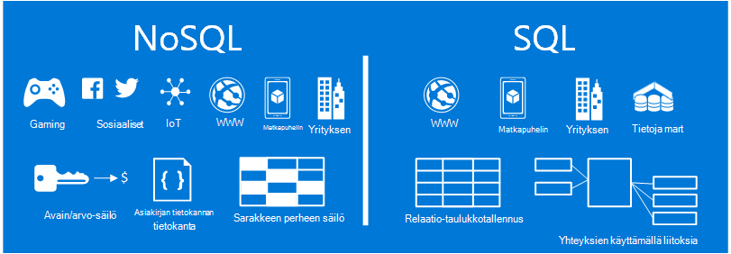
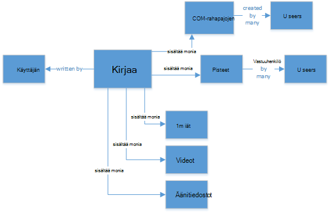
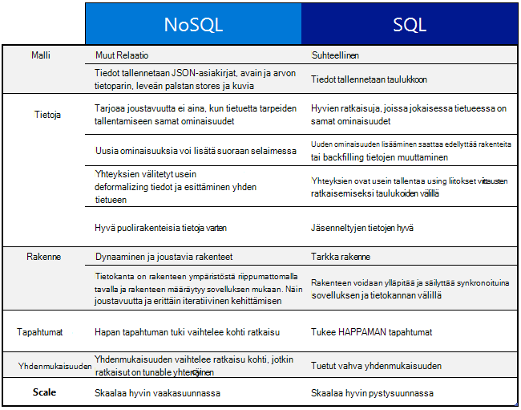
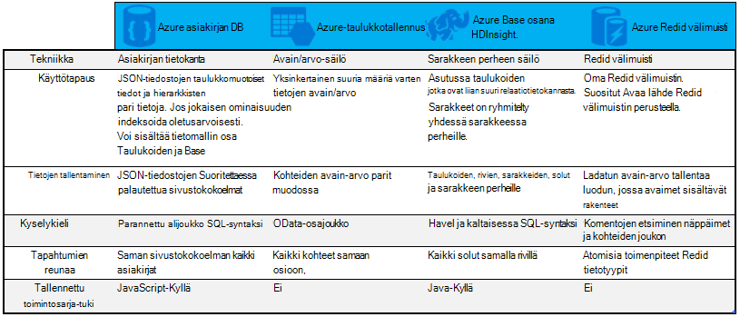

<properties
    pageTitle="Milloin kannattaa käyttää NoSQL ja SQL | Microsoft Azure"
    description="Vertaa NoSQL relaatio ratkaisuja ja SQL-ratkaisujen eduista. Katso, onko jokin Microsoft Azure NoSQL services- tai SQL Server parhaiten sopii käyttämässäsi skenaariossa."
    keywords="nosql ja sql-NoSQL, sql-ja nosql käyttäminen"
    services="documentdb"
    documentationCenter=""
    authors="mimig1"
    manager="jhubbard"
    editor=""/>

<tags
    ms.service="documentdb"
    ms.workload="data-services"
    ms.tgt_pltfrm="na"
    ms.devlang="dotnet"
    ms.topic="article" 
    ms.date="06/24/2016"
    ms.author="mimig"/>

# NoSQL ja SQL

SQL Server- ja relaatiotietokannat (RDBMS) ollut, siirry tietokantojen kahdenkymmenen vuoden. Suojaavat aiempaa suuremmat asemat ja tietojen nopeaan korvaus lajikkeiden ei tarvitse on kuitenkin muuttanut tietoja tallennustilan tarpeiden sovellusten kehittäjille laatu. Jotta tämä skenaario NoSQL tietokantoja, jotka mahdollistavat tasolla rakenteeton ja erilaisten tietojen tallentaminen on saatu suosion. 

NoSQL on SQL-tietokantojen eri tietokantojen luokka. NoSQL käytetään usein, jotka ovat "ei ole SQL- tai toimintatavan, joka sisältää"ei vain SQL-tietojen hallinta tietojen hallintajärjestelmien viitata. On useita tekniikoita NoSQL luokka, kuten asiakirjan tietokantoja, avainarvon stores, sarakkeeseen perheen tallennetaan ja graph tietokantoja, jotka ovat suosittu gaming sosiaalisten, jossa ja IoT-sovelluksissa.

Tässä artikkelissa on tietoja NoSQL ja SQL erot ja antaa sinulle NoSQL ja SQL-palveluja esittely Microsoftilta.  

## Milloin kannattaa käyttää NoSQL?

Oletetaan, että luot uuden sivuston social engagement-palvelun. Käyttäjät voivat luoda kirjoituksia ja lisätä kuvia, videoita ja musiikkia niihin. Muut käyttäjät voivat kommentoida viestit ja antaa korko viestit pisteet (tykkäykset). Aloitussivu on viestit, jotka käyttäjät voivat jakaa ja käsitellä-syötteitä. 

Miten voit tallentaa tiedot? Jos olet tottunut käyttämään SQL, voit aloittaa piirustuksen seuraavankaltaiselta:

Niin paljon, kunnossa, mutta nyt huomioon otettavia asioita yhteen viestiin ja sen näyttämiseen rakenteen. Jos haluat näyttää viestin ja liittyvät kuvat, ääni, video, kommentit, pisteet ja käyttäjätiedot-sivustossa tai sovelluksen, sinun on suorittaa kysely, jossa on kahdeksan taulukon liitokset vain, jos haluat hakea sisältöä. Kuvitellaan nyt stream viestit, jotka dynaamisesti lataaminen ja näytössä, ja voit helposti ennustaa, että se suorittaminen edellyttää tuhansia kyselyt ja monia liitosten tehtävän suorittamiseen.

Voit nyt käyttää relaatio ratkaisu, kuten SQL Server - tietojen tallennusta varten, mutta on jokin muu vaihtoehto, joka helpottaa lähestymistapa NoSQL-vaihtoehto. Muodonmuutoksen viestin JSON-tiedostoon, kuten seuraavassa ja se tallennetaan DocumentDB, Azure NoSQL asiakirjan tietokannan palvelu, voit parantaa suorituskykyä ja noutaa yhden kyselyn ja ei ole liitokset koko viestin. Se on helpompaa, Lisää helppoa ja lisää performant tulos.

    {
        "id":"ew12-res2-234e-544f",
        "title":"post title",
        "date":"2016-01-01",
        "body":"this is an awesome post stored on NoSQL",
        "createdBy":User,
        "images":["http://myfirstimage.png","http://mysecondimage.png"],
        "videos":[
            {"url":"http://myfirstvideo.mp4", "title":"The first video"},
            {"url":"http://mysecondvideo.mp4", "title":"The second video"}
        ],
        "audios":[
            {"url":"http://myfirstaudio.mp3", "title":"The first audio"},
            {"url":"http://mysecondaudio.mp3", "title":"The second audio"}
        ]
    }

Lisäksi näitä tietoja voi osioida salliminen tiedot skaalata ulos luonnollisesti ja hyödyntää NoSQL asteikko ominaisuudet viestin tunnuksen mukaan. Salli NoSQL järjestelmien kehittäjien löysty yhdenmukaisuuden ja tarjota erittäin saatavilla olevista sovelluksista.  Lopuksi tämä ratkaisu ei edellytä kehittäjät voivat määrittää, hallita ja säilyttää salliminen nopean iteraation tietojen tason rakenne.

Voit luoda tämän-ratkaisussa muiden Azure-palveluiden avulla:

- [Azure-haku](https://azure.microsoft.com/services/search/) voidaan web-sovelluksen kautta, jotta käyttäjät voivat etsiä viestejä.
- [Azure-sovelluksen palvelut](https://azure.microsoft.com/services/app-service/) voidaan isännöimiseen sovellukset ja taustaprosessit.
- [Azure-Blob-säiliö](https://azure.microsoft.com/services/storage/) voidaan tallentaa myös kuvilla koko käyttäjäprofiilit.
- [Azure SQL-tietokanta](https://azure.microsoft.com/services/sql-database/) voidaan tallentaa mahdutettavia tietoja, kuten kirjautumistiedot ja käyttöanalyysin tiedot.
- [Azure koneen Learning](https://azure.microsoft.com/services/machine-learning/) voidaan muodostaa tietämyksen ja liiketoimintatietojen, voit antaa palautetta prosessi ja toimittaa oikean sisällön oikeat käyttäjät.

Social engagement-palvelun tämä sivusto on vain yksi tilanne, jossa NoSQL tietokanta on oikea tietomallin projektille. Jos olet kiinnostunut lukemaan lisätietoja artikkelista ja niiden malli tietojen DocumentDB Yhteisöpalvelut-sovelluksissa, katso [siirtymällä sosiaalisen DocumentDB kanssa](documentdb-social-media-apps.md). 

## NoSQL ja SQL vertailu

Seuraavassa taulukossa on Vertailtu NoSQL ja SQL tärkeimmät erot. 

Jos parhaat NoSQL tietokannan tarkoitustaan, jatka seuraavaan osaan ja lisätietoja Azure NoSQL palveluista. Jos SQL-tietokanta parhaat tarpeisiisi Siirry muutoin [mitä Microsoft SQL-versioissa?](#what-are-the-microsoft-sql-offerings)

## Mitä Microsoft Azure NoSQL tarjouksia?

Azure on neljä täysin hallitun NoSQL palvelut: 

- [Azure DocumentDB](https://azure.microsoft.com/services/documentdb/)
- [Azure-taulukkotallennus](https://azure.microsoft.com/services/storage/)
- [Azure Hdinsightiin osana HBase](https://azure.microsoft.com/services/hdinsight/)
- [Azure Redis.txt välimuisti](https://azure.microsoft.com/services/cache/)

Seuraavat vertailukaavio yhdistää jokaisen palvelun avaimen differentiators ulos. Yhtä kuvaa sovelluksen tarpeita parhaiten? 

Jos vähintään yksi seuraavista palveluista ehkä tarpeiden sovelluksesi, Lue lisää kanssa on seuraavissa resursseissa: 

- [DocumentDB oppimispolku](https://azure.microsoft.com/documentation/learning-paths/documentdb/) ja [DocumentDB käyttötapauksiin](documentdb-use-cases.md)
- [Azure-taulukkotallennus käytön aloittaminen](../storage/storage-dotnet-how-to-use-tables.md)
- [Mikä on HBase HDInsight](../hdinsight/hdinsight-hbase-overview.md)
- [Redis välimuistin oppiminen](https://azure.microsoft.com/documentation/learning-paths/redis-cache/)

Siirry [seuraavaksi vaiheet](#next-steps) maksuttoman kokeiluversion tietoja.

## Mitä Microsoft SQL-versioissa?

Microsoft on viisi SQL-versioissa: 

- [Azure SQL-tietokanta](https://azure.microsoft.com/services/sql-database/)
- [SQL Server Azure-Virtuaalikoneissa](https://azure.microsoft.com/services/virtual-machines/sql-server/)
- [SQL Server](https://www.microsoft.com/server-cloud/products/sql-server-2016/)
- [Azure SQL-tietovarasto (ennakkoversio)](https://azure.microsoft.com/services/sql-data-warehouse/)
- [Analytics Platform järjestelmän (paikallisen laitteen)](https://www.microsoft.com/en-us/server-cloud/products/analytics-platform-system/)

Jos olet kiinnostunut SQL Serverin virtuaalikoneen tai SQL-tietokantaan, lue [pilvestä SQL Server-vaihtoehdon valitseminen: SQL Azure (PaaS)-tietokanta tai SQL Server Azure VMs (IaaS)](../sql-database/sql-database-paas-vs-sql-server-iaas.md) lisätietoja kahden eroja.

Jos SQL ääniä, kuten paras vaihtoehto, siirry lisätietoja mitä sekä Microsoft SQL-tuotteiden ja palvelujen on tarjolla [SQL Server](https://www.microsoft.com/server-cloud/products/) .

Siirry [seuraavat vaiheet](#next-steps) maksuttoman kokeiluversion ja arviointi linkit.

## Seuraavat vaiheet

Olemme kutsu Saat lisätietoja SQL- ja NoSQL tuotteitamme mukaan kokeilla niitä maksutta. 

- Kaikissa Azure-palveluissa voit rekisteröityä [vapaa yhden kuukauden kokeiluversio](https://azure.microsoft.com/pricing/free-trial/) ja vastaanottaa 200 voit käyttää Azure palveluja.
    - [Azure DocumentDB](https://azure.microsoft.com/services/documentdb/)
    - [Azure Hdinsightiin osana HBase](https://azure.microsoft.com/services/hdinsight/)
    - [Azure Redis.txt välimuisti](https://azure.microsoft.com/services/cache/)
    - [Azure SQL-tietovarasto (ennakkoversio)](https://azure.microsoft.com/services/sql-data-warehouse/)
    - [Azure SQL-tietokanta](https://azure.microsoft.com/services/sql-database/)
    - [Azure-taulukkotallennus](https://azure.microsoft.com/services/storage/)

- Voit asettamasi on [SQL Server 2016 virtual tietokoneeseen kokeiluversio](https://azure.microsoft.com/marketplace/partners/microsoft/sqlserver2016ctp33evaluationwindowsserver2012r2/) tai ladata sen [SQL Server-kokeiluversio](https://www.microsoft.com/en-us/evalcenter/evaluate-sql-server-2016).
    - [SQL Server](https://www.microsoft.com/server-cloud/products/sql-server-2016/)
    - [SQL Server Azure-Virtuaalikoneissa](https://azure.microsoft.com/services/virtual-machines/sql-server/)

