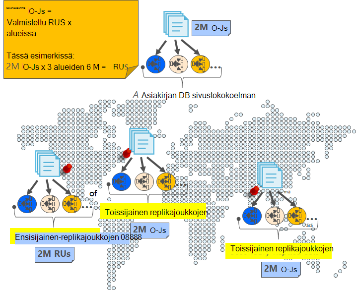
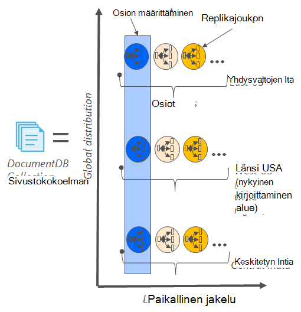
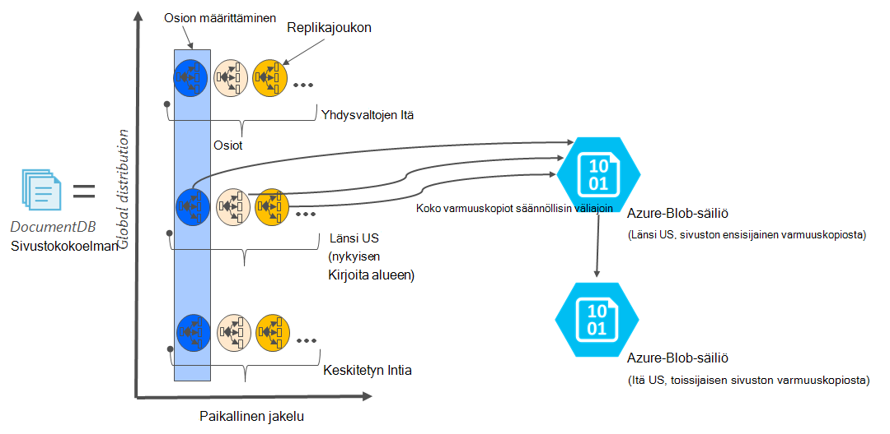

<properties
    pageTitle="Online varmuuskopiointia ja palauttamista DocumentDB | Microsoft Azure"
    description="Opi suorittamaan automaattinen varmuuskopiointi ja palauttaminen NoSQL tietokantojen Azure DocumentDB."
    keywords="Varmuuskopiointi ja palauttaminen online varmuuskopiointi"
    services="documentdb"
    documentationCenter=""
    authors="RahulPrasad16"
    manager="jhubbard"
    editor="monicar"/>

<tags
    ms.service="documentdb"
    ms.workload="data-services"
    ms.tgt_pltfrm="na"
    ms.devlang="multiple"
    ms.topic="article"
    ms.date="09/23/2016"
    ms.author="raprasa"/>

# Automaattinen online varmuuskopiointi ja palauttaminen DocumentDB kanssa 

Azure DocumentDB kestää Varmuuskopioi tiedot automaattisesti säännöllisin väliajoin. Automaattisen varmuuskopioinnin otetaan vaikuttamatta suorituskykyä tai käytettävyys NoSQL tietokanta-toimintoa. Kaikki varmuuskopiot tallennetaan erikseen toisen tallennuspalvelu ja varmuuskopioinnin, yleisesti replikoida vikasietoisuudelle vastaan alueellisen lieventämiseksi. Automaattisen varmuuskopioinnin on tarkoitettu tilanteissa, kun poistat vahingossa DocumentDB sivustokokoelman ja tarvitaan myöhemmin tietojen palauttaminen tai tietojen palauttaminen ratkaista.  

Tämän artikkelin alussa on nopea recap tietojen kopion ja DocumentDB käytettävyys ja käsitellään varmuuskopiot. 

## Suuri DocumentDB - recap käytettävyys

DocumentDB tarkoituksena on [yleisesti distributed](documentdb-distribute-data-globally.md) – voit skaalata siirtonopeuden eri useita Azure alueilla käytännön perustuva automaattisesti ja läpinäkyvä usean homing ohjelmointirajapinnan kanssa. Tietokannan järjestelmän ojentamassa [99,99 % käytettävyys palvelutasosopimuksia](https://azure.microsoft.com/support/legal/sla/documentdb/v1_0/)kaikki DocumentDB kirjoituksia ovat pysyvästi toteutettu paikallisen levyille mukaan replikoiden paikallisten tietojen keskuksen äänistä ennen tunnustavat asiakkaalle. Huomaa, että DocumentDB suuren käytettävyyden riippuvainen paikallisesta säilöstä ja ei ole riippuvainen ulkoisille synkronointitekniikoiden. Lisäksi, jos tietokanta-tiliisi on liitetty useita Azure alue, että kirjoituksia, replikoida muiden alueiden välillä. Skaalata siirtonopeuden ja access-tietojen etsiminen pienen viiveitä, voi olla useita lukea alueiden tietokannan tiliin yhdistetty kuin haluat. Lue alueittain (replikoitua) tiedot säilytetään kuuluminen replikajoukon yli.  

Kuten seuraavassa kaaviossa, yhden DocumentDB sivustokokoelman on [osioitu vaakasuunnassa](documentdb-partition-data.md). Seuraavassa kaaviossa ympyrän on merkitty "Osion" ja kunkin osion tehdään erittäin käytettävissä replikajoukon kautta. Tämä on paikallinen jakauman yksittäisen Azure alueen (merkitty X-akselilla). Lisäksi kunkin osion (ja sen vastaavan replikajoukon) Valitse yleisesti jaetaan useiden alueiden tietokannan tilisi (esimerkiksi alueilla Tässä kuvassa kolme – Yhdysvaltojen Itä, Länsi US ja keskitetyn Intia). "Osion määrittäminen" on yleisesti hajautettu kohteen, joka sisältää useita kopioita tietojen kunkin alueen (merkitty Y-akselin). Voit määrittää prioriteetti tietokannan tilisi alueet ja DocumentDB on läpinäkyvä automaattisesti seuraavan alueen järjestelmän tietojen varalta. Voit myös manuaalisesti jäljitellä automaattisesti Testaa sovelluksen lopusta loppuun käytettävyyttä.  

Seuraava kuva havainnollistaa arvojen kanssa DocumentDB hyvin aste.

## Koko, automaattinen, online-varmuuskopiointi

Jokin meni vikaan-poistetun sivustokokoelman tai tietokannan oma! DocumentDB, jossa tiedot kuitenkin tietojen varmuuskopioinnin tehdään myös erittäin tarpeettomat ja joustavat alueellisen lieventämiseksi. Nämä automaattinen varmuuskopiot tällä hetkellä otetaan noin neljän tunnin välein. 

Varmuuskopioista otetaan vaikuttamatta suorituskykyä tai käytettävyys tietokanta-toimintoa. DocumentDB kestää varmuuskopioinnin taustalla ilman muissa valmistellun RUs tai suorituskykyyn vaikuttavia ja vaikuttamatta NoSQL tietokannan käytettävyyttä. 

Toisin kuin tietoja, jotka on tallennettu DocumentDB sisällä automaattisen varmuuskopioinnin on tallennettu Azure-Blob-säiliö palvelu. Pieni viive/tehokas lataus takaamiseksi varmuuskopion tilannevedoksen ladataan Azure-Blob-säiliö nykyisen kirjoitus-alueen DocumentDB tietokanta-tilisi kanssa samalla alueella esiintymään. Vikasietoisuudelle alueelliset vastaan kunkin tilannevedoksen varmuuskopion tietojen Azure-Blob-objektien tallennustilaan uudelleen replikoida toisen alueen geo tarpeettomat tallennustilan (GRS) kautta. Seuraavassa kaaviossa näkyy, että koko DocumentDB kokoelma, (jossa on kaikki kolme ensisijaista osiota Länsi Yhdysvalloissa tässä esimerkissä) varmuuskopioidaan remote Azure-Blob-säiliö tilillä Länsi Yhdysvalloissa ja sitten GRS replikoida Itä US. 

Seuraavassa kuvassa on kuvattu säännöllisiä DocumentDB kohteilla GRS Azuren tallennustilaan koko varmuuskopiot.

## Tietyn tilannevedoksen säilytysaika

Edellä kuvatulla otamme säännöllisesti tilannevedoksia tietojen ja tutustu yhteensopivuus-asetusten kohti, olemme säilyttää uusimman tilannevedoksen määrittäminen 90 päivää ennen sen myöhemmin saa tyhjentää. Jos sivustokokoelman tai tili on poistettu, DocumentDB tallentaa edellisen varmuuskopioinnin 90 päivää.

## Tietokannan palauttaminen varmuuskopiosta online

Tietojen poistamisen vahingossa, niin voit [tiedoston tuki lippu](https://portal.azure.com/?#blade/Microsoft_Azure_Support/HelpAndSupportBlade) tai [Soita Azure tukeen](https://azure.microsoft.com/support/options/) , jos haluat palauttaa tiedot edellisen automaattisen varmuuskopioinnin. Tietyn tilannevedoksen varmuuskopion voi palauttaa DocumentDB edellyttää, että tiedot on vähintään käytettävissä kanssamme kyseisen tilannevedoksen, varmuuskopioiminen toistaminen.

## Seuraavat vaiheet

Replikoida NoSQL tietokannan useita tietojen keskikohdan mukaan-kohdassa [Jaa tietojen yleisesti DocumentDB](documentdb-distribute-data-globally.md). 

Tiedoston yhteyshenkilölle Azure tuki- [tiedoston lippu Azure-portaalista](https://portal.azure.com/?#blade/Microsoft_Azure_Support/HelpAndSupportBlade).