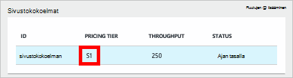
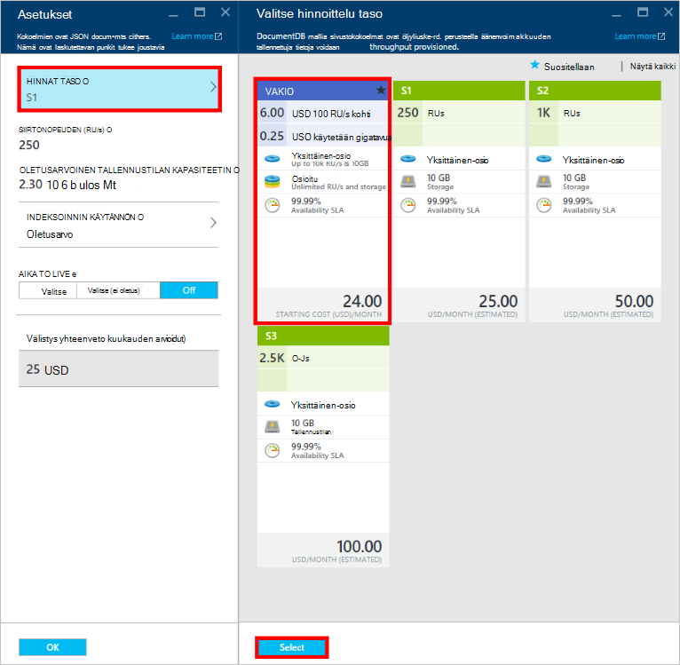
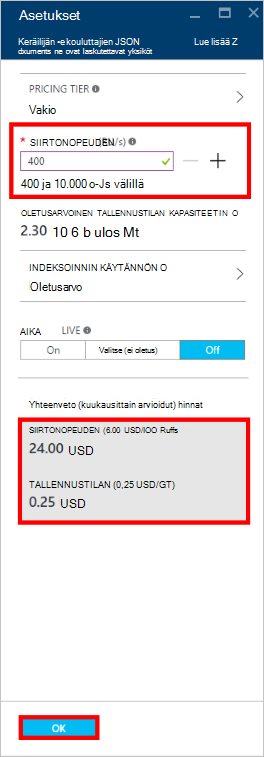
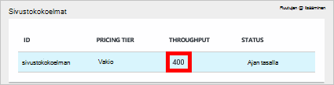

<properties
    pageTitle="Suorituskyvyn tasojen DocumentDB | Microsoft Azure"
    description="Lue lisätietoja siitä, miten suorituskyvyn tasojen DocumentDB avulla voit varata siirtonopeuden kohti sivustokokoelman välein."
    services="documentdb"
    authors="mimig1"
    manager="jhubbard"
    editor="monicar"
    documentationCenter=""/>

<tags
    ms.service="documentdb"
    ms.workload="data-services"
    ms.tgt_pltfrm="na"
    ms.devlang="na"
    ms.topic="article"
    ms.date="08/26/2016"
    ms.author="mimig"/>

# Suorituskyvyn tasojen DocumentDB

Tässä artikkelissa on yleiskatsaus [Microsoft Azure DocumentDB](https://azure.microsoft.com/services/documentdb/)tasojen suorituskykyä.

Luettuasi tämän artikkelin pystyt seuraaviin kysymyksiin:  

-   Mikä on suorituskyvyn tason?
-   Miten siirtonopeuden on varattu tietokanta-tili?
-   Miten suorituskykyä toimii?
-   Miten 'M laskuttaa suorituskyvyn tasoissa?

## Johdanto suorituskyvyn tasot

DocumentDB valikoimien luotu vakio tilissä on valmisteltu liittyvät suorituskyvyn tasolla. Valikoimien tietokannassa voi olla eri suorituskyvyn tason voit määrittää lisää siirtonopeuden usein käytetyt loppu ja siirtonopeuden harvoin käytetyt loppu on vähennetty. DocumentDB tukee käyttäjän määrittämä suorituskyvyn tasojen ja ennalta määritetty suorituskykyä.  

Suorituskyvyn tasoissa on liitetty [pyyntö yksikkö (RU)](documentdb-request-units.md) -korko raja. Tämä on, sen suorituskyky-tason perusteella kokoelman varataan siirtonopeuden ja on käytettävissä, sivustokokoelman yksinomaan.

<table border="0" cellspacing="0" cellpadding="0">
    <tbody>
        <tr>
            <td valign="top">

</td>
            <td valign="top">
Tiedot
</td>
            <td valign="top">
Siirtonopeuden rajoitukset
</td>
            <td valign="top">
Tallennustilan rajoitusten
</td>
            <td valign="top">
Versio
</td>
            <td valign="top">
API
</td>            
        </tr>
        <tr>
            <td valign="top">
Käyttäjän määrittämät suorituskyky
</td>
            <td valign="top">
Tallennustilan käytön mukaan laskutettavat gt: N käytön mukaan.

Siirtonopeuden mittayksikkö on 100 RU/s
</td>
            <td valign="top">
Rajoittamaton. 400 – 250 000 pyytää yksiköt/s oletusarvoisesti (suuremmat pyyntö)
</td>
            <td valign="top">
Rajoittamaton. 250 gt oletusarvoisesti (suuremmat pyyntö) 
</td>
            <td valign="top">
V2
</td>
            <td valign="top">
API 2015 – 12-16 ja uudempi
</td>  
        </tr>
        <tr>
            <td valign="top">
Ennalta määritetyt suorituskyky
</td>
            <td valign="top">
10 Gigatavua, joka on varattu tallennustila.

S1 = 250 RU/s, S2 = 1 000 RU/s, S3 = 2500 RU/s
</td>
            <td valign="top">
2500 RU/s
</td>
            <td valign="top">
10 GIGATAVUA
</td>
            <td valign="top">
V1
</td>
            <td valign="top">
Mikä tahansa
</td>  
        </tr>        
    </tbody>
</table>                

DocumentDB sallii monipuoliset, mukaan lukien kyselyt, kyselyt ja käyttäjän määrittämät funktiot (UDF) tallennetut toimintosarjat ja käynnistimet tietokanta-toimintoa. Näihin toimintoihin liittyvät käsittely kustannukset vaihtelevat suorittimen ja IO toiminnon suorittaminen edellyttää muistin mukaan. Sen sijaan pohtivat ja laitteistoresurssien hallinta, voit ajatella pyynnön yksikkö yksittäisen mittaa resurssien tarvitse suorittaa eri tietokannan ja palvelun sovelluksen pyynnön.

Kokoelmien voi luoda [Microsoft Azure-portaalissa](https://portal.azure.com), [REST API](https://msdn.microsoft.com/library/azure/mt489078.aspx) tai jokin [DocumentDB SDK: T](https://msdn.microsoft.com/library/azure/dn781482.aspx). DocumentDB-ohjelmointirajapinnan avulla voit määrittää kokoelman suorituskyvyn taso.

> [AZURE.NOTE] Kokoelma suorituskyvyn tasoon voidaan säätää API tai [Microsoft Azure-portaalissa](https://portal.azure.com/). Suorituskyvyn tason muutokset odotetaan suorittamiseen 3 minuutin kuluessa.

## Suorituskyvyn tasojen määrittämisohjeet loppu
Kokoelma luomiasi RUs nimettyjen suorituskyky perusteella koko kohdistus on varattu eikä kokoelman.

Huomautus ennalta määritetyt ja käyttäjän määrittämät suorituskyvyn sekä määritetyt DocumentDB toimii siirtonopeuden pidättäminen perusteella. Luomalla kokoelma sovellus on varattu ja laskuttaa varattu siirtonopeuden riippumatta siitä, kuinka paljon, että siirtonopeuden käytetään aktiivisesti. Käyttäjän määrittämät suorituskyvyn määritetyt tallennustila on käytön mukaan laskutettavat kulutus perusteella, mutta ennalta määritetyt suorituskyvyn määritetyt 10 gt: n tallennustilan on varattu sivustokokoelman luomisen yhteydessä.  

Kun sivustokokoelmat luodaan, voit muuttaa suorituskyvyn taso DocumentDB SDK: T tai Azure perinteinen portaalin kautta.

> [AZURE.IMPORTANT] DocumentDB standardiksi sivustokokoelmat ovat laskutettu tuntihinta, ja luot valikoimien laskutetaan pienin tunnin käyttö.

Jos asetat sivustokokoelman tunnin kuluessa suorituskyvyn taso, sinua laskuteta suorituskyvyn parhaan tunnin aikana. Esimerkiksi Jos kasvatat suorituskyky-tason kokoelman 8:53 Suomen voit veloitetaanko uudelle tasolle 8:00 Suomen aloittaen. Vastaavasti jos 8:53 Suomen vähentää suorituskyvyn taso, uusi korko käytetään 9:00 Suomen.

Pyyntö resurssit on varattu suorituskyvyn tason määrittäminen perustuu valikoimien. Pyyntö Yksikkökulutus lasketaan muodossa toinen korko kohden. Sovellukset, jotka ylittävät valmistellun pyynnön Yksikköhinta (tai suorituskyky)-ohjelmista rajoittanut, kunnes nopeus laskee alapuolelle, että varattu taso. Jos sovellus edellyttää siirtonopeuden ylemmän tason, voit suurentaa valikoimien suorituskyky-tason.

> [AZURE.NOTE] Kun sovellus ylittää suorituskyvyn tasot yksi tai useita loppu-pyynnöt rajoittanut kohti sivustokokoelman välein. Tämä tarkoittaa, että jotkin sovelluksen pyynnöt välttämättä onnistu samalla, kun muut saattaa olla rajoitettu. On suositeltavaa Lisää uudelleenyritykset kun rajoittanut, jotta voit käsitellä pyynnön liikenne piikkarit pieni määrä.

## Suorituskyvyn tasojen käsitteleminen
DocumentDB sivustokokoelmat mahdollistavat Ryhmitä tietosi kyselyn kuvioiden ja sovelluksen suorituskyvyn tarpeiden perusteella. DocumentDB's automaattisen indeksoinnin ja kyselyiden tuki on aivan yhteinen collocate erilaisten tiedostojen saman kokoelman. Seikkoja-päätät, käytetäänkö erillisessä sivustokokoelmat ovat seuraavat:

- Kyselyjen – kokoelma on vaikutusalueen kyselyn suorittamista varten. Jos tarvitset kysely asiakirjajoukon, tehokkainta luku kuviot peräisin yhden sivustokokoelman collocating tiedostoja.
- Tapahtumat – kaikki tapahtumat on rajattu yhteen kokoelmassa. Jos sinulla on tiedostoja, jotka on päivitettävä yhden tallennetun toimintosarjan tai käynnistin, ne olla tallennettuna saman kokoelman. Tarkemmin sanottuna osion avaimen sisällä kokoelma on tapahtuman reunaa. Lisätietoja on artikkelissa [DocumentDB osioimisen](documentdb-partition-data.md) .
- Suorituskyvyn eristystaso – kokoelma on liitetty suorituskyvyn taso. Näin varmistat, että kunkin sivustokokoelman on varmasti ennakoitavissa suorituskykyä varattu RUs kautta. Tietoja voidaan kohdistaa eri sivustokokoelmat suorituskyvyn eri tasot, access korkojakso perusteella.

> [AZURE.IMPORTANT] On tärkeää ymmärtää laskutetaan osoitteessa koko normaalin korvauksen sivustokokoelmat sovelluksen luoman määrän perusteella.

On suositeltavaa, että sovelluksesi tekee käyttö pieneen kokoelmien, ellei sinulla ole suuri tallennustilan tai siirtonopeuden vaatimuksia. Varmistaa, että on hyvin ymmärretty sovelluksen kuviot uudet sivustokokoelmat luontia varten. Voit halutessasi varata sivustokokoelman luominen kuin hallinta-toiminto käsitellään sovelluksen ulkopuolella. Vastaavasti säätäminen kokoelma suorituskyky-tason muuttuu, jolla sivustokokoelman laskutetaan tuntihinta. Olisi valvoa sivustokokoelman suorituskyvyn tasot, jos sovelluksesi säätää nämä dynaamisesti.

## Käyttäjän määrittämät suorituskyvyn S1, S2, S3 muuttaminen

Voit muuttaa ennalta määritetyt siirtonopeuden tasot avulla käyttäjäkohtainen siirtonopeuden tasot Azure-portaalissa seuraavasti. Käyttäjän määrittämät siirtonopeuden tasoa käyttämällä voi mukauttaa oman siirtonopeuden tarpeitasi. Ja jos käytät edelleen S1-tiliä, voit suurentaa oman oletusarvon siirtonopeuden 250 RU/s 400 RU/s vain muutamalla napsautuksella.

Lisätietoja hinnoittelu muutokset liittyvät käyttäjän määrittämiä ja ennalta määritettyjä siirtonopeuden blogimerkinnässä [DocumentDB: kaikki tiedot on hyvä tietää käyttämisestä uuden hinnoittelu asetukset](https://azure.microsoft.com/blog/documentdb-use-the-new-pricing-options-on-your-existing-collections/).

> [AZURE.VIDEO changedocumentdbcollectionperformance]

1. Siirry [**Azure portal**](https://portal.azure.com)selaimessa.
2. Valitse **Selaa** -> **DocumentDB tilit**ja valitse sitten DocumentDB-tili, jota haluat muokata.   
3. **Tietokantojen** lensissä valitsemalla Muokkaa-tietokanta ja valitse **tietokanta** -sivu, voit muokata sivustokokoelman. Käyttää ennalta määritettyjä nopeus-tileillä on S1, S2 tai S3 hinnoittelu taso.

      

4. Valitse **Lisää**, valitse **asetukset** yläpalkissa **sivustokokoelmat** -sivu.   
5. Valitse **asetukset** -sivu **Hinnat taso** ja Huomaa, että **Valitse hinnoittelu taso** -sivu näkyy kuukausittainen kustannukset arvio kunkin suunnitelma. Jos haluat muuttaa omia siirtonopeuden, valitsemalla **Vakio**ja valitse sitten Tallenna muutokset **valitsemalla** .

      

6. **Asetukset** -sivu kohdassa **Hinnat taso** muutetaan **Vakio** ja **siirtonopeuden (RU/s)** -ruudussa näkyy oletusarvo on 400. Määrittää nopeus välillä 400 – 10 000 [yksikköä pyytää](documentdb-request-units.md)/second (RU/s). **Hinnat yhteenveto** sivun alareunassa päivittyy automaattisesti antamaan arvio kuukausihinta. Valitse **OK** , Tallenna muutokset.

    

7. Takaisin käyttöön **tietokanta** -sivu voit tarkistaa uuden siirtonopeuden kokoelman.

    

Jos päätät, että sinun on enemmän siirtonopeuden (yli 10 000 RU/s) tai lisää tallennustilaa (suurempi kuin 10 Gigatavua) voit luoda osioitua sivustokokoelman. Osioitu sivustokokoelman-kohdassa [luominen kokoelma](documentdb-create-collection.md).

>[AZURE.NOTE] Suorituskyvyn tasolla ohjelmista muuttaminen voi kestää jopa 2 minuuttia.

## Käyttämällä .NET SDK suorituskyvyn tasojen muuttaminen

Oman sivustokokoelmat suorituskyvyn tasojen muuttaminen toinen vaihtoehto on Microsoftin SDK: T kautta. Tässä osassa käsitellään vain muuttamisesta sivustokokoelman suorituskyvyn tasolla käyttämällä Microsoftin [.NET SDK](https://msdn.microsoft.com/library/azure/dn948556.aspx), mutta prosessi vastaa sekä muita [SDK: T](https://msdn.microsoft.com/library/azure/dn781482.aspx). Jos ole aiemmin käyttänyt Microsoftin .NET SDK-paketissa, käy Microsoftin [Aloitusopas](documentdb-get-started.md).

Näin koodikatkelman vaihtamisen tarjouksen siirtonopeuden 50 000 pyynnön yksiköt sekunnissa:

    //Fetch the resource to be updated
    Offer offer = client.CreateOfferQuery()
                      .Where(r => r.ResourceLink == collection.SelfLink)    
                      .AsEnumerable()
                      .SingleOrDefault();

    // Set the throughput to 5000 request units per second
    offer = new OfferV2(offer, 5000);

    //Now persist these changes to the database by replacing the original resource
    await client.ReplaceOfferAsync(offer);

    // Set the throughput to S2
    offer = new Offer(offer);
    offer.OfferType = "S2";

    //Now persist these changes to the database by replacing the original resource
    await client.ReplaceOfferAsync(offer);

> [AZURE.NOTE] Kokoelmien valmisteltu alle 10 000 pyynnön yksiköt voi siirtää toisen tarjouksia ja käyttäjän määrittämät siirtonopeuden ja milloin tahansa ennalta määritetyt siirtonopeuden (S1, S2, S3) välillä. Kokoelmien, joka on valmisteltu ja yli 10 000 pyynnön yksikköä kohden toinen ei voi muuntaa ennalta määritetyt siirtonopeuden tasot.

Käy [MSDN](https://msdn.microsoft.com/library/azure/microsoft.azure.documents.client.documentclient.aspx) muita esimerkkejä ja lisätietoja tarjoavat Microsoftin tavoista:

- [**ReadOfferAsync**](https://msdn.microsoft.com/library/azure/microsoft.azure.documents.client.documentclient.readofferasync.aspx)
- [**ReadOffersFeedAsync**](https://msdn.microsoft.com/library/azure/microsoft.azure.documents.client.documentclient.readoffersfeedasync.aspx)
- [**ReplaceOfferAsync**](https://msdn.microsoft.com/library/azure/microsoft.azure.documents.client.documentclient.replaceofferasync.aspx)
- [**CreateOfferQuery**](https://msdn.microsoft.com/library/azure/microsoft.azure.documents.linq.documentqueryable.createofferquery.aspx)

## Kokoelma siirtonopeuden muuttaminen

Jos käytössäsi on jo käyttäjän määrittämä suorituskyvyn, voit muuttaa kokoelmaa siirtonopeuden toimimalla seuraavasti. Jos haluat muuttaa käyttäjän määrittämä suorituskyvyn S1, S2 tai S3 suorituskyvyn taso (ennalta määritetyt suorituskyky), katso [muuttaminen S1, S2, käyttäjän määrittämä suorituskyvyn S3](#changing-performance-levels-using-the-azure-portal).

1. Siirry [**Azure portal**](https://portal.azure.com)selaimessa.
2. Valitse **Selaa** -> **DocumentDB tilit**ja valitse sitten DocumentDB-tili, jota haluat muokata.   
3. **DocumentDB tili** -sivu **tietokantojen** lasi, valitse Valitse muokattava tietokanta ja valitse **tietokanta** -sivu sivustokokoelman muokkaamista.
4. Valitse **sivustokokoelmat** -sivu yläpalkissa **asetukset** .   
5. Valitse **asetukset** -sivu kasvata **siirtonopeuden (RU/s)** -ruutuun ja valitse sitten **OK** , jos haluat tallentaa muutoksen. Näyttää vain yhden alueen kyseisen sivustokokoelman uusi arvioitu kuukausihinta päivittää **Hinnat yhteenveto** sivu alareunassa.

    

Jos et ole varma mitä niin, että oman siirtonopeuden, katso [Estimating siirtonopeuden tarvitsee](documentdb-request-units.md#estimating-throughput-needs) ja [pyytää yksikön Laskimen](https://www.documentdb.com/capacityplanner).

## Seuraavat vaiheet

Lisätietoja hinnat ja Azure DocumentDB tietojen hallinnasta, tutki nämä resurssit:

- [DocumentDB hinnat](https://azure.microsoft.com/pricing/details/documentdb/)
- [DocumentDB kapasiteetin hallinta](documentdb-manage.md)
- [DocumentDB tietojen mallinnus](documentdb-modeling-data.md)
- [DocumentDB tietojen jakaminen](documentdb-partition-data.md)
- [Pyydä yksiköt](http://go.microsoft.com/fwlink/?LinkId=735027)

Saat lisätietoja DocumentDB on Azure DocumentDB [ohjeissa](https://azure.microsoft.com/documentation/services/documentdb/).

Aloita asteikko ja suorituskyvyn testaaminen oikeilla DocumentDB, katso [suorituskyvyn ja mittakaava testaaminen Azure DocumentDB kanssa](documentdb-performance-testing.md).

[1]: ./media/documentdb-performance-levels/documentdb-change-collection-performance7-9.png
[2]: ./media/documentdb-performance-levels/documentdb-change-collection-performance10-11.png
