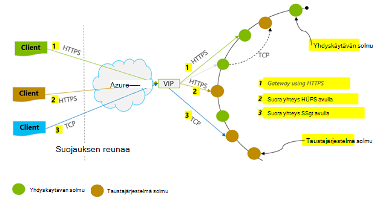
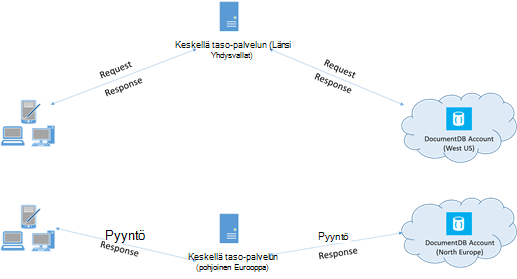

<properties 
    pageTitle="DocumentDB suorituskykyyn liittyviä vihjeitä | Microsoft Azure" 
    description="Lisätietoja Azure DocumentDB tietokannan suorituskyvyssä asiakkaan asetukset"
    keywords="Voit parantaa tietokannan suorituskykyä"
    services="documentdb" 
    authors="mimig1" 
    manager="jhubbard" 
    editor="" 
    documentationCenter=""/>

<tags 
    ms.service="documentdb" 
    ms.workload="data-services" 
    ms.tgt_pltfrm="na" 
    ms.devlang="na" 
    ms.topic="article" 
    ms.date="10/17/2016" 
    ms.author="mimig"/>

# Vinkkejä suorituskyvyn DocumentDB

Azure DocumentDB on nopea ja joustavia jaettu tietokanta Skaalaa saumattomasti taattua viive ja siirtonopeuden. Ei tarvitse tehdä muutoksia pää arkkitehtuuri tai skaalata tietokannan kanssa DocumentDB monimutkaisia koodin kirjoittaminen. Skaalaus ylös ja alas on yhtä helppoa kuin yhden API-kutsu ja [Soita SDK-menetelmää](documentdb-performance-levels.md#changing-performance-levels-using-the-net-sdk). Koska DocumentDB on käyttää verkon puhelut kautta välillä on kuitenkin asiakkaan optimointi voit tehdä piikin suorituskyvyn saavuttamiseksi.

Jotta Jos pyydät "siitä, miten voit parantaa tietokannan-suorituskykyä?" Ota huomioon seuraavat vaihtoehdot:

## Verkko

1. **Yhteyden käytännön: Käytä suoran yhteyden tila**
    
    Miten asiakas muodostaa yhteyden Azure DocumentDB on tärkeää vaikutuksia suorituskykyyn, erityisesti havaittujen asiakkaan viive kannalta. Kaksi avaimen asetukset ovat käytettävissä asiakkaan käytännön – yhteyden *tilan* ja [yhteyden *protokolla*](#connection-protocol)-yhteyden määrittäminen.  Kaksi käytettävissä olevat tilat ovat seuraavat:

    1. Yhdyskäytävän tila (oletus)
    2. Suora tila

    DocumentDB on jaettu tallennustilan-järjestelmä, DocumentDB resurssit, kuten sivustokokoelmien on osioitu monia tietokoneissa ja kunkin osion on replikoida suuren. Loogisen fyysistä osoitetta käännös on käytettävissä reititys taulukon, joka on myös sisäisesti käytettävissä resurssiksi.

    Yhdyskäytävän tila DocumentDB yhdyskäytävän koneet suorittaa tämän reititys, jotta asiakas-koodi on yksinkertainen ja Järjestä. Asiakassovellus huomioitavia pyynnöt DocumentDB yhdyskäytävän koneet, joka kääntää looginen URI Taustajärjestelmä solmu fyysistä osoitetta-pyynnössä ja lähettää pyynnön asianmukaisesti.  Vastaavasti suoraan tilassa asiakkaiden on säilyttää – ja Päivitä ajoittain – tässä taulukossa, kopio ja sitten suoraan Yhdistä Taustajärjestelmä DocumentDB solmut.

    Yhdyskäytävän tila tueta kaikissa SDK-ympäristöissä, eikä se on määritetty oletusarvoinen.  Sovelluksen käytetään yrityksen verkossa oleville tarkka palomuurin rajoitetusti, yhdyskäytävän tila on paras vaihtoehto, koska se käyttää tavallinen HTTPS-portti ja yksi päätepiste. Suorituskyvyn, tarjoa on kuitenkin, että yhdyskäytävän tila liittyy muita verkon siirräntävälien aina, kun tietojen lukeminen tai kirjoittaa DocumentDB.   Tästä syystä suoraan tila on vähemmän verkon siirräntävälien vuoksi suorituskyvyn parantamiseksi.

2. **Yhteyden käytännön: TCP-protokollaa**

    Kun hyödyntäminen suoraan tila on kaksi protokolla-asetukset:

    - TCP
    - HTTPS

    DocumentDB on yksinkertainen ja avaa RESTful ohjelmoinnin mallin HTTPS-protokollan välityksellä. Lisäksi on tehokas TCP protokolla, joka on myös RESTful sen viestintä-mallissa ja käyttää SDK .NET-asiakasohjelman kautta. Suora TCP- ja HTTPS­yhteydet käyttäminen alustava käyttöoikeuksien ja salauksen liikenne SSL. Saat parhaan suorituskyvyn Käytä TCP-protokollaa, kun se on mahdollista. 

    Käytettäessä TCP yhdyskäytävän tila TCP porttiin 443 on DocumentDB portin ja 10250 on MongoDB API-porttiin. Kun käytät TCP suoraan tilassa lisäksi yhdyskäytävän portit, sinun on varmistettava portti 10000 ja 20000 välillä on avoinna, koska DocumentDB käyttää dynaamisen TCP-portit. Jos yrität käyttää TCP porttien eivät ole avoinna, näyttöön tulee HTTP 503 – palvelu ei ole käytettävissä-virhe. 

    Yhteyden tila on määritetty DocumentClient esiintymän ConnectionPolicy-parametrin rakentaminen aikana. Suora tila on käytössä, jos protokolla voidaan määrittää myös ConnectionPolicy-parametrin kuluessa.

        var serviceEndpoint = new Uri("https://contoso.documents.net");
        var authKey = new "your authKey from Azure Mngt Portal";
        DocumentClient client = new DocumentClient(serviceEndpoint, authKey, 
        new ConnectionPolicy
        {
            ConnectionMode = ConnectionMode.Direct,
            ConnectionProtocol = Protocol.Tcp
        });

    Koska TCP tuetaan vain suorat tilassa, jos yhdyskäytävän tila on käytössä, pitää yhteyttä yhdyskäytävän käytetään aina HTTPS-protokollan ja ConnectionPolicy protokolla-arvo oteta huomioon.

    

3. **Soita OpenAsync välttämiseksi ensimmäisen pyydettäessä käynnistyksen viive**

    Oletusarvon mukaan ensimmäinen pyyntö on suurempi viive koska se on hakeaksesi osoite reititys-taulukosta. Voit välttää tämän käynnistys viive ensimmäisen pyynnön, Soita OpenAsync() kerran alustus aikana seuraavasti.

        await client.OpenAsync();

4. **Collocate asiakkaiden suorituskyvyn samalla Azure alueella**

    Jos mahdollista, Aseta kutsumista DocumentDB samalla alueella DocumentDB tietokantana sovelluksia. Lähes vertailun puhelut DocumentDB samalla alueella suorittaa 1 – 2 ms sisällä, mutta Länsi ja USA pitkin välinen viive on > 50 ms. Tämä viive todennäköisesti voivat vaihdella pyynnön pyyntö otetaan huomioon pyynnön, kun se kulkee asiakaskoneesta Azure palvelinkeskuksen reunan mukaan. Pienin mahdollinen viive saavutetaan varmistamalla puheluja sovellus on sama kuin valmistellun DocumentDB päätepiste Azure alue sijaitsevat. Käytettävissä alueiden luettelo on artikkelissa [Azure alueet](https://azure.microsoft.com/regions/#services).

    

5. **Suurenna viestiketjuissa siirtyminen/tehtävien määrä**

    Koska puhelut DocumentDB tehdään verkon kautta, joudut ehkä vaihdella pyyntöjen rinnakkaisuus aste niin, että asiakassovellus käyttää hyvin vähän aikaa odotetaan pyyntöjen välillä. Jos käytössäsi on esimerkiksi. VERKON 's [Tehtävien rinnakkain kirjasto](https://msdn.microsoft.com//library/dd460717.aspx), Luo 100s tehtävien luettavaksi tai muut DocumentDB järjestyksessä.

## SDK-käyttö

1. **Asenna uusimmat SDK**

    DocumentDB SDK: T parannetaan jatkuvasti antamaan parhaan suorituskyvyn. Katso uusimmat SDK ja tarkista parannukset [DocumentDB SDK](documentdb-sdk-dotnet.md) -sivuja. 

2. **Käytä Yksiarvoinen DocumentDB asiakkaan sovelluksesi elinkaaren**
  
    Huomaa, että DocumentClient jokaiselle esiintymälle on viestiketjun sopivaa ja suorittaa tehokas hallinta ja osoite tallentamisesta välimuistiin, kun suoraan-tilassa. Anna tehokas hallinta ja tehostaviksi DocumentClient mukaan, kannattaa käyttää sovelluksen elinkaaren yksittäisen esiintymän DocumentClient AppDomain kohden.

3. **Suurenna System.Net MaxConnections host kohden**

    DocumentDB pyynnöt tehdään päälle HTTPS/REST oletusarvoisesti ja testataan yhteyden oletusrajoitus kohti isäntänimi tai IP-osoite. Voit joutua määrittämään MaxConnections suuremmat arvot (100-1000), niin, että asiakas-kirjastossa voit hyödyntää useita samanaikaista DocumentDB yhteyttä. .NET SDK 1.8.0 ja edellä [ServicePointManager.DefaultConnectionLimit](https://msdn.microsoft.com/library/system.net.servicepointmanager.defaultconnectionlimit.aspx) oletusarvo on 50 ja muuta arvo, voit määrittää [Documents.Client.ConnectionPolicy.MaxConnectionLimit](https://msdn.microsoft.com/en-us/library/azure/microsoft.azure.documents.client.connectionpolicy.maxconnectionlimit.aspx) suurempi arvo.  

4. **Rinnakkaisia kyselyjen osioitua loppu säätäminen**

     DocumentDB .NET SDK versiota 1.9.0 ja tuen rinnakkainen kyselyjä, jolloin voit kyselyn osioitua sivustokokoelman rinnakkain yläpuolella (katso [käyttämisestä SDK: T](documentdb-partition-data.md#working-with-the-sdks) ja Aiheeseen liittyvät [MALLIKOODEJA](https://github.com/Azure/azure-documentdb-dotnet/blob/master/samples/code-samples/Queries/Program.cs) , saat lisätietoja). Rinnakkaisia kyselyt on suunniteltu parantamaan kyselyviive ja siirtonopeuden serial vastaavaan niiden päälle. Rinnakkaisia kyselyt on kaksi parametria, käyttäjät voivat paranna mukautettu Sovita niiden vaatimukset (a) MaxDegreeOfParallelism: ohjaamaan osioiden enimmäismäärä kuin voidaan suorittaa kysely rinnakkain ja MaxBufferedItemCount (b): Voit hallita valmiiksi noudetut tulosten määrää. 
    
    (a) ***säädön MaxDegreeOfParallelism\: *** 
    rinnakkainen kyselyn works tekemällä kyselyn useita osioita rinnakkain. Kuitenkin yksittäisiä osioitua kerää tietoja haetaan peräkkäin kyselyn osalta. MaxDegreeOfParallelism asettaminen osioiden määrää on suurin mahdollisuutta saavuttamiseksi useimmat performant kyselyn edellyttäen kaikki järjestelmän ehdot säilyvät ennallaan. Jos et tiedä osioiden määrää, voit määrittää MaxDegreeOfParallelism suuri määrä ja järjestelmä valitsee pienin (osioita, jos syöttötapa määrä) MaxDegreeOfParallelism nimellä. 
    
    On tärkeää muistaa, että rinnakkain kyselyjen tuottaa parhaan edut, jos tiedot jaetaan tasaisesti kaikki osiot, jotka koskevat kyselyn. Jos osioitua sivustokokoelman osioitu siten, että kaikki tai kyselyn palauttamien tietojen useimpia on tiivistetty muutaman osioiden (yksi osio Huonoin tapaus) ja valitse kysely suorituskyky bottlenecked osioita mukaan. 
    
    (b) ***säädön MaxBufferedItemCount\: *** 
    rinnakkain kysely on suunniteltu hakeaksesi tuloksia valmiiksi, kun nykyisen erän tulosten käsitellään asiakas. Viive parannusta kyselyn valmiiksi haun avulla. MaxBufferedItemCount on parametri rajoittaminen ennalta noudetut tulosten määrää. Kyselyn, joka vastaanottaa suurin etu valmiiksi haetaan MaxBufferedItemCount odotettua palautettujen tulosten määrää (tai suurempi luku) avulla. 
    
    Huomaa, että valmiiksi haetaan toimii samalla tavalla MaxDegreeOfParallelism riippumatta ja on yksi puskurin kaikki osiot tiedot.  

5. **Palvelinpuolen yleisen luettelon ottaminen käyttöön**
    
    Vähentää muistista korkojakso ohjeita joissakin tapauksissa: Määritä .NET- [gcServer](https://msdn.microsoft.com/library/ms229357.aspx) tosi.

6. **Ota käyttöön backoff RetryAfter väliajoin**
 
    Suorituskyvyn testauksen aikana suuremmaksi kuormituksen kunnes pieni korvaus pyyntöjen Hae rajoittanut. Jos rajoittanut-asiakassovellus olisi backoff rajoituksen käyttöön uudelleen palvelimessa määritetyn aikavälin. Arvossa backoff varmistaa käyttävät vähän odotusaika uudelleenyritykset välillä. Yritä käytännön tuki sisältyy versio 1.8.0 ja edellä DocumentDB [.NET](documentdb-sdk-dotnet.md) ja [Java](documentdb-sdk-java.md)ja versiota 1.9.0 ja edellä [Node.js](documentdb-sdk-node.md) ja [Python](documentdb-sdk-python.md). Lisätietoja on artikkelissa [Exceeding varattu siirtonopeuden rajoittaa](documentdb-request-units.md#exceeding-reserved-throughput-limits) ja [RetryAfter](https://msdn.microsoft.com/library/microsoft.azure.documents.documentclientexception.retryafter.aspx).

7. **Asiakas-työmäärää, asteikko**

    Jos testaat suuren siirtonopeuden tasoilla (> 50 000 RU/s)-asiakassovellus voi tulla pullonkaula koneen capping ulos-Suoritin tai verkon käytön vuoksi. Pääset tähän mennessä, voit edelleen siirtää edelleen DocumentDB tilin mukaan asiakassovelluksissa verkkosovellusten laajentaminen useita palvelinten.

8. **Pienempi luku viive asiakirjan välimuistin URI**

    Välimuistin asiakirjan URI mahdollisuuksien luetuksi varmistaa parhaan suorituskyvyn.

9. **Paranna sivukoko kyselyjen/luettu-syötteiden suorituskyvyn parantamiseksi**

    Kun suorittamiseen syötteessä luku-luku-tiedostojen syötteen toimintoja (kuten ReadDocumentFeedAsync) tai kun varmenteiden DocumentDB SQL-kyselyn tulokset palautetaan Segmentoitu tavalla, jos tulosjoukko on liian suuri. Oletusarvon mukaan tulokset palautetaan näkyvissä 100 kohteita tai 1 Megatavu, kumpi rajoitus on osumien ensimmäisen. 

    Vähennä verkon asiakaspäässä noutaa kaikki sovellettavan tulokset, voit suurentaa sivun koon myös käyttämällä x-ms-max-kohteen-määrä pyynnön otsikossa enintään 1 000. Tapauksissa sinun on vain muutama tulosten esittämistä varten esimerkiksi jos käyttäjä käyttöliittymän tai sovelluksen API palauttaa vain 10 tulokset kerrallaan, voit myös pienentää 10 voit vähentää lukuja ja kyselyjen kulutettu siirtonopeuden sivukoko.

    Voit myös määrittää sivun koon myös käyttämällä käytettävissä DocumentDB SDK: T.  Esimerkki:
    
        IQueryable<dynamic> authorResults = client.CreateDocumentQuery(documentCollection.SelfLink, "SELECT p.Author FROM Pages p WHERE p.Title = 'About Seattle'", new FeedOptions { MaxItemCount = 1000 });

10. **Suurenna viestiketjuissa siirtyminen/tehtävien määrä**

    Katso verkko-osassa [Suurenna viestiketjuissa siirtyminen/tehtävien määrä](#increase-threads) .

## Indeksoinnin käytäntö

1. **Käytä nopeampi piikin aika nieltynä korvaukset kuitata indeksointi**

    DocumentDB avulla voit määrittää – tasolla sivustokokoelman – indeksoinnin käytäntö, jonka avulla voit valita kokoelma indeksoidaan automaattisesti vai ei-tiedostoja.  Lisäksi voit myös valita painikkeen (Consistent) ja asynkroninen (viive) indeksi-päivitykset. Oletusarvon mukaan indeksi päivitetään synkronoidusti kunkin Lisää, korvaa tai poista asiakirjan-kokoelmaan. Synkronoidusti tilassa mahdollistaa kyselyt vastaamaan samalla [yhdenmukaisuuden taso](documentdb-consistency-levels.md) , asiakirjan-lukee "keskusteluviestit" indeksin välittömästi.
    
    Viive-indeksointi voidaan pitää skenaarioissa, jossa tiedot on kirjoitettu bursts ja haluat kuoletuksen indeksoi sisältö pitkän ajanjakson ajan tarvittava työmäärä. Viive-indeksointi avulla voit myös käyttää valmistellun siirtonopeuden tehokkaasti ja yhteyshenkilönä kirjoittaminen pyynnöt aikaan mahdollisimman vähän viive kanssa. On tärkeää Huomaa kuitenkin, kun viive-indeksointi on käytössä, kyselytulokset olevan tekstin yhdenmukaisia määritetty DocumentDB tilin yhdenmukaisuuden taso riippumatta.

    Näin ollen yhdenmukaisia indeksoinnin tilaa (IndexingPolicy.IndexingMode on määritetty Consistent) veloitetaan suurin pyynnön yksikkökulun kohti kirjoitus-ja indeksoinnin tilaa (IndexingPolicy.IndexingMode on määritetty viive) ja ei ole indeksoinnin viive (IndexingPolicy.Automatic on määritetty epätosi) on nolla indeksoinnin kustannukset kirjoittaminen aikaan.

2. **Indeksoinnin nopeampaa kirjoittaa käyttämättömät polut pois**

    DocumentDB's indeksoinnin käytännön avulla voit määrittää asiakirjan polut, voit lisätä tai poistaa indeksoinnista mukaan hyödyntäminen indeksoinnin polut (IndexingPolicy.IncludedPaths ja IndexingPolicy.ExcludedPaths). Käyttöä indeksoinnin polut voit tarjota parannettu kirjoittamisen suorituskykyä ja pienempi indeksi tallennustilan skenaariot, jossa kyselyn kuviot kutsutaan etukäteen kuin indeksoinnin kustannukset ovat suoraan vaikutus yksilöllinen polut indeksoitu määrä.  Esimerkiksi seuraava koodi näkyy asiakirjat kokonaisen osan jättäminen pois (tietovälinettä alipuu) indeksoinnin käyttämästä "*" yleismerkkiä.

        var collection = new DocumentCollection { Id = "excludedPathCollection" };
        collection.IndexingPolicy.IncludedPaths.Add(new IncludedPath { Path = "/*" });
        collection.IndexingPolicy.ExcludedPaths.Add(new ExcludedPath { Path = "/nonIndexedContent/*");
        collection = await client.CreateDocumentCollectionAsync(UriFactory.CreateDatabaseUri("db"), excluded);

    Lisätietoja on artikkelissa [DocumentDB indeksoinnin käytännöt](documentdb-indexing-policies.md).

## Siirtonopeuden

1. **Mittaa ja paranna alemman pyynnön yksiköt ja toisen käyttö**

    DocumentDB on monenlaisia tietokannan toimintoja, mukaan lukien relaatio- ja hierarkkisten kyselyjen UDF, tallennettujen toimintosarjojen ja käynnistimien – kaikki liiketoiminnan tietokannan kokoelmassa tiedostoja. Näihin toimintoihin liittyvät kustannukset määräytyvät suorittimen, IO ja muistin toiminnon suorittaminen edellyttää. Sen sijaan, että Pohdi ja laitteistoresurssien hallinta Voit ajatella pyynnön yksikkö (RU) yksittäisen mittaa tarvitse suorittaa eri tietokannan ja palvelun sovelluksen pyynnön resurssien.

    [Pyydä yksiköt](documentdb-request-units.md) on valmisteltu tietokanta-tileille, voit ostaa kapasiteetin yksiköiden määrän perusteella. Pyyntö Yksikkökulutus lasketaan muodossa sekunnissa korvaus. Sovellukset, jotka ylittävät valmistellun pyynnön Yksikköhinta niiden tili on rajoitettu, kunnes nopeus laskee tilin varattu tason alapuolelle. Jos sovellus edellyttää siirtonopeuden ylemmän tason, voit hankkia lisää kapasiteetin yksiköt.

    Kyselyn monimutkaisuutta vaikuttaa, kuinka monta pyytää yksikköä on käytetty toiminnon. Predikaatit määrä, laatu predikaatit UDF määrä ja lähde-tietojoukko suuruus vaikuttaa kyselyn toiminnot kustannukset.

    Mitata toiminnon katseltavan (luominen, päivittäminen ja poistaminen), Tarkasta x-ms-pyynnön-maksu-otsikon (tai vastaavia RequestCharge ominaisuuden ResourceResponse<T> tai FeedResponse<T> .NET SDK: ssa) mitata pyynnön yksiköiden kulutettu nämä toiminnot.

        // Measure the performance (request units) of writes
        ResourceResponse<Document> response = await client.CreateDocumentAsync(collectionSelfLink, myDocument);
        Console.WriteLine("Insert of document consumed {0} request units", response.RequestCharge);
        // Measure the performance (request units) of queries
        IDocumentQuery<dynamic> queryable = client.CreateDocumentQuery(collectionSelfLink, queryString).AsDocumentQuery();
        while (queryable.HasMoreResults)
             {
                  FeedResponse<dynamic> queryResponse = await queryable.ExecuteNextAsync<dynamic>();
                  Console.WriteLine("Query batch consumed {0} request units", queryResponse.RequestCharge);
             }
        
    Pyyntö kulun määrää tämä ylätunniste ei ole kokonaisluku, valmistellun siirtonopeuden (eli 2000 RUs / toisen). Jos yllä kysely palauttaa 1000 1 kt asiakirjoja, toiminto kustannukset on 1 000. Näin ollen yhden sekunnin palvelimen merkkien vain kaksi pyynnöt ennen rajoittimen myöhemmät. Lisätietoja on artikkelissa [pyynnön yksiköt](documentdb-request-units.md) ja [pyynnön yksikön Laskimen](https://www.documentdb.com/capacityplanner).

2. **Kahvan korko rajoittaminen/pyynnön korko on liian suuri**

    Kun asiakas yrittää ylittää varattu siirtonopeuden tiliä varten, on palvelin ei ole kansiohierarkiassa ja siirtonopeuden kapasiteetin ulkopuolelle varattu ei ole käyttöä. Palvelin synkronointiraja lopettaa pyyntö, jonka RequestRateTooLarge (HTTP-tilakoodin 429) ja palauttaa x-ms-yritä-jälkeen-ms-otsikon, joka kertoo ajan millisekunteina, käyttäjän on odotettava ennen uudelleenyritysvälin pyynnön.
 
        HTTP Status 429,
        Status Line: RequestRateTooLarge
        x-ms-retry-after-ms :100

    SDK: T kaikki implisiittisesti todellisen vastauksessa, noudattavat palvelimessa määritetyn uudelleen jälkeen otsikon, ja yritä uudelleen pyynnön. Ellei tilisi käyttää samanaikaisesti useita asiakkaita, seuraava uudelleen onnistuu.

    Jos sinulla on useampi kuin yksi asiakas toimivien kumulatiivisesti johdonmukaisesti pyynnön korko yllä, oletusarvo-yritä Laske määritettynä 9 sisäisesti asiakas ei voi riittää; Tässä tapauksessa asiakkaan ilmoittaa DocumentClientException tilakoodi 429 sovellukseen. Oletusarvon uudelleenyritysmäärä voi muuttaa määrittämällä RetryOptions ConnectionPolicy-esiintymässä. Oletusarvon mukaan tilakoodi 429 DocumentClientException palautetaan kumulatiivinen odottaa 30 sekunnin ajan kuluttua, jos pyynnön jatkaa pyynnön korko yllä. Näin tapahtuu myös kun nykyinen uudelleenyritysmäärä on pienempi kuin suurin uudelleen laskeminen, määrittää sitä oletuskieleksi 9 tai käyttäjän määrittämä arvo.

    Kun automaattinen uudelleen toiminnan avulla voidaan parantaa vikasietoisuudesta ja useimpien sovellusten käytettävyyttä, se voi tulla kohtaan odds kun tekevät suorituskyvyn viitearvoja erityisesti silloin, kun mittaaminen viive.  Asiakkaan havaittujen viive kasvamaan, jos käynnit palvelimen rajoituksen ja aiheuttaa asiakkaan SDK äänettömästi uudelleen. Viive piikkarit suorituskyvyn kokeiden yhteydessä välttämiseksi mittaa kunkin toiminnon palauttama maksu ja varmistaa toimivan varattu pyynnön nopeus alle pyynnöt. Lisätietoja on artikkelissa [pyytää yksiköt](documentdb-request-units.md).
   
3. **Suurempi siirtonopeuden pienempi tiedostojen rakenne**

    Tietyn toiminnon pyynnön Kulu (eli kokouspyynnön käsittely kustannus) on suoraan vaikutus asiakirjan kokoa. Suurten tiedostojen toimenpiteet kustannusten yli pieni asiakirjat-toimintoja.

## Yhdenmukaisuuden tasot

1. **Käytä heikkoja yhdenmukaisuuden tasot paremmin luku viiveitä**

    Toinen tärkeä tekijä huomioon yhdenmukaisuuden tason ollessa säätäminen DocumentDB sovellusten suorituskykyä. Yhdenmukaisuuden tason valinta on suorituskyvyn vaikutuksia sekä lukujen kirjoituksia. Voit määrittää yhdenmukaisuuden oletustaso tietokannan tilin ja valitsemasi yhdenmukaisuuden taso sitten soveltaa kaikkien sivustokokoelmien (kaikki tietokannat) DocumentDB tilin. Kirjoitustoimintoja, myös yhdenmukaisuuden tason muuttaminen vaikutuksen havaitaan pyynnön viive. Käytetään vahvempi yhdenmukaisuuden tasoja, kirjoita viiveitä kasvattaa. Toisaalta yhdenmukaisuuden tasolla luettujen vaikutus havaitaan siirtonopeuden kannalta. Heikkoja yhdenmukaisuuden tasot Salli suurempi luku siirtonopeuden toteutunut asiakas.

    Oletusarvon mukaan kaikki lukee ja käyttäjän määrittämät resurssit vastaan kyselyt käyttävät yhdenmukaisuuden oletustaso määritetty tietokanta-tilissä. Voit kuitenkin pienentämällä tietyn luku/kysely yhdenmukaisuuden taso määrittämällä x-ms-yhdenmukaisuuden-tason pyynnön otsikko. Lisätietoja on artikkelissa [DocumentDB yhdenmukaisuuden tasot](documentdb-consistency-levels.md).

## Seuraavat vaiheet

Katso esimerkkisovellus, jota käytetään kokeilla DocumentDB-muutaman asiakaskoneiden tehokas skenaariot, [Suorituskyky ja skaalattavuus testaaminen oikeilla Azure DocumentDB](documentdb-performance-testing.md).

Lisätietoja sovelluksen asteikko ja tehokas suunnittelemisesta on Katso myös [osioimisen ja Azure DocumentDB skaalaus](documentdb-partition-data.md).
