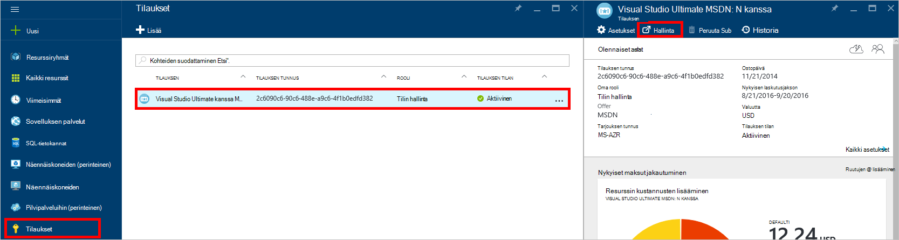
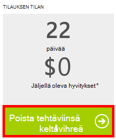

<properties
    pageTitle="DocumentDB portaalin vianmääritys | Microsoft Azure"
    description="Selvitä DocumentDB Azure-portaalissa ongelmien ratkaisemiseen." 
    services="documentdb"
    documentationCenter=""
    authors="mimig1"
    manager="jhubbard"
    editor="monicar"/>

<tags
    ms.service="documentdb"
    ms.workload="data-services"
    ms.tgt_pltfrm="na"
    ms.devlang="na"
    ms.topic="article"
    ms.date="08/29/2016"
    ms.author="mimig"/>

# Vianmääritysvihjeitä Azure DocumentDB-portaalissa

Tässä artikkelissa käsitellään DocumentDB jatkuvat Azure-portaalissa. 

## Resurssien puuttuvat

**Ongelma**: tietokannat tai sivustokokoelmat puuttuvat portaalin lavat.

**Ratkaisu**: Pienennä sovellusten käyttö toimimaan kokoelman suurin nopeus-kiintiön. 

**Selitys**: portaali on jokin sovellus, esimerkiksi mihin tahansa muuhun, puheluiden soittamiseen DocumentDB tietokannan ja sivustokokoelman. Jos pyyntöjen ovat tällä hetkellä ole rajoittanut vuoksi kutsujen erillisessä sovelluksesta, portaalin voi myös on rajoittanut, aiheuttaa resursseja ei näy portaalissa. Voit ratkaista ongelman ottamalla suuren siirtonopeuden käyttö syy osoite ja päivitä sitten portaalin sivu. Tietoja siitä, miten mitataan ja pienempi siirtonopeuden käyttö löytyy [suorituskykyyn liittyviä vihjeitä](documentdb-performance-tips.md) artikkelin [nopeus](documentdb-performance-tips.md#throughput) -kohdan.
 
## Sivujen tai lavat ei lataudu

**Ongelma**: sivut ja lavat portaalissa eivät näy.

**Ratkaisu**: Pienennä sovellusten käyttö toimimaan kokoelman suurin nopeus-kiintiön. 

**Selitys**: portaali on jokin sovellus, esimerkiksi mihin tahansa muuhun, puheluiden soittamiseen DocumentDB tietokannan ja sivustokokoelman. Jos pyyntöjen ovat tällä hetkellä ole rajoittanut vuoksi kutsujen erillisessä sovelluksesta, portaalin voi myös on rajoittanut, aiheuttaa resursseja ei näy portaalissa. Voit ratkaista ongelman ottamalla suuren siirtonopeuden käyttö syy osoite ja päivitä sitten portaalin sivu. Tietoja siitä, miten mitataan ja pienempi siirtonopeuden käyttö löytyy [suorituskykyyn liittyviä vihjeitä](documentdb-performance-tips.md) artikkelin [nopeus](documentdb-performance-tips.md#throughput) -kohdan.

## Lisää sivustokokoelman-painike ei ole käytettävissä

**Ongelma**: tietokanta-sivu- **Kokoelmaan Lisää** -painike ei ole käytettävissä.

**Selitys**: Jos Azure-tilauksesi on liitetty etu hyvitykset, kuten vapaa hyvitykset tarjoaa MSDN-tilaus, ja olet käyttänyt kaikki oman hyvitykset kuukauden, et voi luoda kaikki muut sivustokokoelmat DocumentDB.

**Ratkaisu**: Poista käyttörajan tilistä.

1. Azure-portaalissa Jumpbar, **tilaukset**, valitse DocumentDB tietokannan tilausta ja valitsemalla sitten **Hallitse** **tilaus** -sivu. 
    

2. Uudessa selainikkunassa näet, että tekstiviestejä ei ole enää jäljellä. Poista tehtäviinsä jatkuvasti tai vain nykyisen laskutusjakson valitsemalla **Poista käyttöraja** . Suorita sitten Ohjattu lisääminen tai Vahvista luottokorttitiedot. 
    

 
## Kyselyn Explorer täyttää virheet

Katso [kyselyn Explorer vianmääritys](documentdb-query-collections-query-explorer.md#troubleshoot).

## Tietoja ei ole käytettävissä seurannassa ruudut

Katso [vianmääritys seuranta ruudut](documentdb-monitor-accounts.md#troubleshooting).

## Tiedostoja ei palautettu asiakirjan Resurssienhallinnassa

Katso [vianmääritys asiakirjan Explorer](documentdb-view-json-document-explorer.md#troubleshoot).

## Seuraavat vaiheet

Jos ilmenee edelleen ongelmia portaalissa, anna sähköpostitse [askdocdb@microsoft.com](mailto:askdocdb@microsoft.com) apua tai tiedoston tuki pyytää portaalissa valitsemalla **Selaa** **ohjetta + tuki**-ja valitsemalla **Luo tukipyyntö**.
