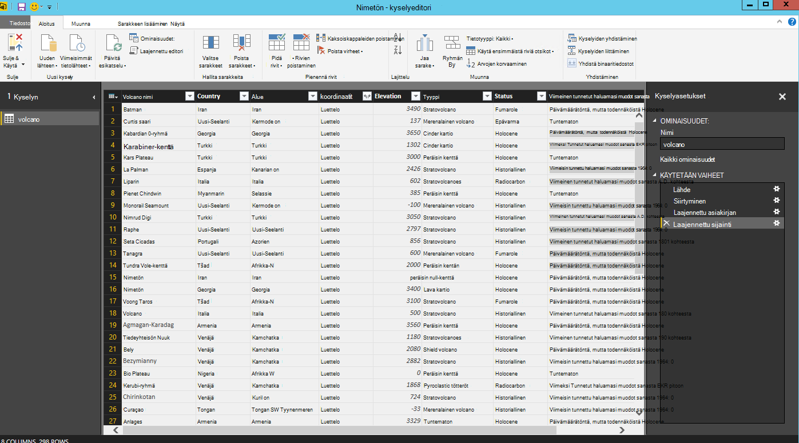

<properties
    pageTitle="Power BI-opetusohjelma DocumentDB yhdistimen | Microsoft Azure"
    description="Power BI Tässä opetusohjelmassa avulla voit tuoda JSON, kyetäkseen raporttien luominen ja Visualisoi tietoja DocumentDB ja Power BI-Connectorin avulla."
    keywords="Power bi-opetusohjelma, visualisoida tietoa, power bi-yhdistin"
    services="documentdb"
    authors="h0n"
    manager="jhubbard"
    editor="mimig"
    documentationCenter=""/>

<tags
    ms.service="documentdb"
    ms.workload="data-services"
    ms.tgt_pltfrm="na"
    ms.devlang="na"
    ms.topic="article"
    ms.date="09/22/2016"
    ms.author="hawong"/>

# DocumentDB Power BI-opetusohjelma: visualisoida tietoa käyttämällä Power BI-yhdistin

[PowerBI.com](https://powerbi.microsoft.com/) on verkkopalveluun, jossa voit luoda ja jakaa tiedot, jotka ovat tärkeitä organisaation raporttinäkymien ja raportteja.  Power BI Desktopin on erillinen raportointityökalu, jonka avulla voit hakea tietoja eri tietolähteistä peräisin, yhdistäminen ja muunna tietoja, luoda tehokkaita raportteja ja visualisointeja ja raporttien julkaiseminen Power BI.  Power BI Desktopin uusinta versiota voit nyt kirjautua tiliisi DocumentDB kautta DocumentDB yhdistimen Power BI.   

Power BI Tässä opetusohjelmassa on käy läpi vaiheet yhdistäminen Power BI Desktopin DocumentDB tiliin, siirry kohtaa, johon haluat purkaa tiedot käyttämällä siirtymistoiminnon kokoelma, muuntaa JSON tietojen Sarakemuoto Power BI Desktop Kyselyeditorin avulla ja luominen ja julkaiseminen raportin PowerBI.com.

Kun olet suorittanut tämän Power BI-opetusohjelman, jonka voi seuraaviin kysymyksiin:  

-   Miten voin luoda raportteja tietojen DocumentDB-Power BI Desktopin käyttäminen?
-   Miten voin muodostaa Power BI Desktopin DocumentDB tiliin?
-   Miten voin voit hakea tietoja Power BI Desktopin kokoelma?
-   Miten Power BI Desktopin sisäkkäisiä JSON tietojen voivat muuttaa?
-   Kuinka voin julkaista ja jakaa PowerBI.com omien raporttien?

## Edellytykset

Ennen kuin seuraamalla ohjeita Power BI Tässä opetusohjelmassa, varmista, että käytössäsi ovat seuraavat:

- [Power BI Desktopin uusimman version](https://powerbi.microsoft.com/desktop).
- Microsoftin Azure DocumentDB tilisi tietojen tai esittely tilin käyttöä.
    - Tässä opetusohjelmassa näkyvät volcano tiedot lisätään esittely. Esittely tällä tilillä ei ole sidottu minkä tahansa palvelutasosopimuksia ja on tarkoitettu vain esittelyä.  Microsoft pidättää tämän esittely-tili kuten voit tehdä muutoksia, mutta liian vähän lopetetaan tili, avaimen muuttaminen, rajoittamalla muuttaminen ja poista tiedot, milloin tahansa ilman advance-ilmoitus tai syy.
        - URL-osoite: https://analytics.documents.azure.com
        - Vain luku-näppäintä: MSr6kt7Gn0YRQbjd6RbTnTt7VHc5ohaAFu7osF0HdyQmfR + YhwCH2D2jcczVIR1LNK3nMPNBD31losN7lQ/fkw ==
    - Tai luo oma tili-kohdassa [Luo tili DocumentDB tietokannan Azure-portaalissa](https://azure.microsoft.com/documentation/articles/documentdb-create-account/). Tämän jälkeen saat otoksen volcano tiedot, jotka ovat samanlaisia tietoja käytetään tässä opetusohjelmassa (mutta ei sisällä GeoJSON lohkot)- [NOAA sivuston](https://www.ngdc.noaa.gov/nndc/struts/form?t=102557&s=5&d=5) ja tuo [DocumentDB tietojen siirtotyökalun](https://azure.microsoft.com/documentation/articles/documentdb-import-data/)tiedot.

Voit jakaa PowerBI.com raportit, on oltava tilin PowerBI.com.  Lue lisää Power BI for vapaa- ja Power BI Pro owa_for_androidiin [https://powerbi.microsoft.com/pricing](https://powerbi.microsoft.com/pricing).

## Aloittaminen
Tässä opetusohjelmassa oletetaan, että olet geologist, opiskelevat tulivuoret eri puolilla maailmaa.  Volcano tallennetaan DocumentDB tilillä ja JSON-tiedostot näyttävät alla kuvattua.

    {
        "Volcano Name": "Rainier",
        "Country": "United States",
        "Region": "US-Washington",
        "Location": {
            "type": "Point",
            "coordinates": [
            -121.758,
            46.87
            ]
        },
        "Elevation": 4392,
        "Type": "Stratovolcano",
        "Status": "Dendrochronology",
        "Last Known Eruption": "Last known eruption from 1800-1899, inclusive"
    }

Haluat volcano tietojen hakemiseen DocumentDB tililtä ja Visualisoi tietoja vuorovaikutteisia Power BI-taulukkoraportin kuvattua.

Kokeile valmis? Aloitetaanpa.

1. Suorita Power BI Desktopin työasemalle.
2. Kun Power BI Desktopin käynnistetään, *aloitusnäyttö* tulee näkyviin.

    

3. Voit suoraan *aloitusnäyttö* **Nouda tiedot**, katso **Viimeisimmät tietolähteet**tai **Avaa muita raportteja** .  Valitse Sulje näytön oikeassa yläkulmassa X. **Power BI Desktopin raporttinäkymä** tulee näkyviin.

    

4. Valitse **Aloitus** -valintanauha ja valitse sitten Valitse **Nouda tiedot**.  **Nouda tiedot** -ikkuna tulee näkyviin.

5. Valitse **Azure**, valitse **Microsoft Azure DocumentDB (Beta)**ja valitse **Yhdistä**.  Näyttöön tulee **Microsoft Azure DocumentDB Yhdistä** -ikkuna.

    

6. Määritä DocumentDB tilin päätepisteen URL-osoite **, jonka haluat hakea tietoja alla kuvatulla tavalla**. Voit noutaa **[avaimet](documentdb-manage-account.md#keys)** sivu URI-ruutuun Azure-portaalin URL-osoite tai esittely tiliä voi käyttää, jolloin URL-osoite on `https://analytics.documents.azure.com`. 

    Jätä tietokannan nimi, sivustokokoelman nimi ja SQL-lause tyhjäksi, koska nämä kentät ovat valinnaisia.  Käytämme sen sijaan, valitse tietokanta ja sivustokokoelman tunnistamiseen, mistä tiedot tulevat siirtymistoiminnon.

    

7. Jos olet muodostamassa yhteyttä tämän päätepisteen ensimmäistä kertaa, sinun pyydetään tili-näppäintä.  Voit noutaa avain Azure-portaalin **[vain luku - avaimet](documentdb-manage-account.md#keys)** -sivu-ruutuun **Perusavain** tai esittely tiliä, jossa tapaus avain ei voi käyttää `RcEBrRI2xVnlWheejXncHId6QRcKdCGQSW6uSUEgroYBWVnujW3YWvgiG2ePZ0P0TppsrMgscoxsO7cf6mOpcA==`. Kirjoita tilin-näppäintä ja valitse **Yhdistä**.

    On suositeltavaa, että käytät vain luku-näppäintä painettuna, kun raporttien luomiseen.  Tämä estää mahdollisia tietoturvauhkia tarpeettomat näyttäminen perustyyli-näppäintä. Vain luku-avain on käytettävissä Azure-portaalin [näppäimet](documentdb-manage-account.md#keys) -sivu tai voit käyttää yllä esittely tilin tiedot.

    

8. Kun tili on yhdistetty, **Etsintä** tulee näkyviin.  **Etsintä** näkyy tietokantojen tilissä luettelo.
9. Valitse ja laajenna tietokannan, jossa raportin tiedot ovat peräisin, jos käytät esittely-tili, valitse **volcanodb**.   

10. Valitse kokoelma, joka noutaa tiedot. Jos käytät esittely, valitse **volcano1**.

    Esikatselu-ruudussa näkyy **tietueen** kohteiden luettelo.  Asiakirjan esitetään lukuna **tietuetyypin Power BI** . Vastaavasti sisäkkäisiä JSON tekstilohkon sisällä asiakirjan on myös **tietueen**.

    

11. Valitse **Muokkaa** käynnistää kyselyeditori, niin että voit muuntaa tiedot.

## Litistämistä ja muodonmuutoksen JSON asiakirjat
1. Power BI Kyselyeditorissa, keskimmäisessä ruudussa **asiakirjan** sarakkeen pitäisi näkyä.

2. Valitse laajennin osoitteessa **asiakirjan** sarakkeen otsikon oikealla puolella.  Pikavalikko ja kenttien luettelo tulee näkyviin.  Valitse kentät, jotka tarvitset raportin, esimerkiksi Volcano nimi, maan, alueen, sijainti, korkeus, tyyppi, tila ja viimeisen tietää haluamasi muodot sanasta, ja valitse sitten **OK**.

    

3. Keskimmäisessä ruudussa näkyy tuloksen esikatselu ja valitut kentät.

    

4. Tässä esimerkissä sijainti-ominaisuus on GeoJSON eston asiakirjassa.  Kuten näet, sijainti esitetään lukuna **Power BI Desktopin-tietuetyypin** .  
5. Valitse sijainti-sarakkeen otsikon oikealla puolella, laajennin.  Pikavalikko ja tyyppi ja koordinaatit kentät tulevat näkyviin.  Oletetaan, että Valitse koordinaatit-kenttä ja valitse **OK**.

    

6. Keskimmäisessä ruudussa näkyy nyt koordinaatit sarakkeen **luettelon** tyyppi.  Opetusohjelman alussa esitetyllä GeoJSON tiedot tässä opetusohjelmassa on tyyppi tallentanut koordinaatit matriisin leveys- ja Pituusastetiedot arvoilla.

    Koordinaattien [0]-elementti edustaa pituutta koordinaatit [1] edustaa leveyttä.
    

7. Voit litistää koordinaatit taulukko luodaan **Mukautettu sarake** nimeltä LatLong.  Valitse valintanauhan **Lisää sarake** ja valitse sitten **Lisää mukautettu sarake**.  **Lisää mukautettu sarake** -ikkuna tulee näkyviin.

8. Anna uuden sarakkeen, kuten LatLong nimi.

9. Seuraavaksi voit määrittää mukautetun kaavan uuden sarakkeen.  Esimerkissä on KETJUTA leveys- ja Pituusastetiedot arvot erotettu toisistaan pilkulla seuraavan esimerkin käyttämällä seuraavaa kaavaa: `Text.From([Document.Location.coordinates]{1})&","&Text.From([Document.Location.coordinates]{0})`. Valitse **OK**.

    Lisätietoja-lausekkeet DAX (Data Analysis) mukaan lukien DAX-Funktiot käy [DAX Basic-Power BI Desktopin](https://support.powerbi.com/knowledgebase/articles/554619-dax-basics-in-power-bi-desktop).

    

10. Nyt keskimmäisessä ruudussa näkyy uusi LatLong-sarake, jossa leveys- ja Pituusastetiedot arvot on erotettu toisistaan pilkulla.

    

    Jos saat virheilmoituksen uuteen sarakkeeseen, varmista, että käytössä vaiheet Kyselyasetukset-kohdassa vastaavat seuraavassa kuvassa:

    

    Jos vaiheet ovat erilaiset, poista ylimääräisiä toimia ja Lisää mukautettu sarake uudelleen. 

11. Microsoft on nyt valmis litistämistä tiedot taulukkomuotoinen muotoon.  Voit hyödyntää kaikkia ominaisuuksia, jotka ovat käytettävissä Kyselyeditorissa muodon ja muuntaa DocumentDB tiedot.  Jos käytät otosten, muuttaa tietotyypin käyttöoikeuksien **kokonaislukuun** muuttamalla **Home** -valintanauhan **Tietotyyppi** .

    

12. Valitse **Sulje ja käytä** Tallenna tietomalliin.

    

## Raporttien luominen
Power BI Desktop Raporttinäkymä on, mistä voit aloittaa tietojen visualisoimiseen raporttien luomiseen.  Voit luoda raportteja vetämällä ja pudottamalla kentät kyselyjä **raportin** alusta.

Raporttinäkymä kannattaako tiedot:

 1. **Kentät** -ruudussa tällä, jossa näet luettelon tietomallien kentillä, voit käyttää raporttien.

 2. **Visualisoinnit** -ruutu. Raportin voi olla yksi tai useita visualisointeja.  Valitse visual tyypit sovittaminen tarpeitasi **Visualisoinnit** -ruudusta.

 3. **Raportin** piirtoalusta, jossa luoda raportin kuvat on.

 4. **Raportti** -sivu. Voit lisätä useita raportin sivuja Power BI Desktopin.

Seuraavassa kuvassa näkyy perusvaiheet luoda yksinkertaisen vuorovaikutteisen kartan view-raportin luominen.

1. Tässä esimerkissä on Luo kartta-näkymä, jossa kukin volcano sijainti.  Valitse **Visualisoinnit** -ruudussa Dashboard yllä olevassa näyttökuvassa visual tyyppi.  Raportissa pitäisi näkyä maalattava **raportin** kangasta kartan visuaalinen tyyppi.  **Visualisoinnin** -ruudussa pitäisi näkyä myös visual tyyppi liittyvät ominaisuudet.

2. Nyt vetämällä ja pudottamalla LatLong kentän **kentät** -ruudusta **sijainti** -ominaisuuden **Visualisoinnit** -ruudussa.
3. Seuraavaksi vetämällä ja pudottamalla **selite** -ominaisuuteen Volcano nimi-kenttään.  

4. Vetämällä ja pudottamalla käyttöoikeuksien kentän **koko** -ominaisuuden.  

5. Pitäisi tulla näkyviin kartan visuaalisia, jossa kuplien ilmaisee, että kunkin volcano sijainnista volcano laajentamisen hajautettuna kuplan koko joukko.

6. Olet nyt luonut perusraportin.  Voit mukauttaa raportin lisäämällä uusia visualisointeja.  Tässä tapauksessa on lisätty Volcano tyyppi osittajan raportin vuorovaikutteinen.  

    

## Julkaise ja raportin jakaminen
Jos haluat jakaa raportin, on oltava tilin PowerBI.com.

1. Valitse Power BI Desktopin **Home** -valintanauhan.
2. Valitse **Julkaise**.  Voit pyydetään antamaan PowerBI.com-tilin käyttäjänimi ja salasana.
3. Tunnistetieto on tarkistettu, kun raportti on julkaistu valitun hyperlinkin kohde.
4. Valitse **Avaa 'PowerBITutorial.pbix' Power BI: n** ja PowerBI.com-raportin jakaminen.

    

## Raporttinäkymien luominen PowerBI.com

Nyt kun olet luonut raportin, jolla jakaa ne PowerBI.com

Kun julkaiset PowerBI.com Power BI Desktop-raportin, se luo **raportti** ja **tietojoukko** PowerBI.com vuokraajan. **PowerBITutorial** , PowerBI.com-nimisen raportin julkaisemisen jälkeen kellokuvakkeesta saa näkyviin PowerBITutorial **raportteja** ja **tietojoukkoja** osien PowerBI.com käyttöön.

   

Voi jakaa raporttinäkymä luodaan Napsauta PowerBI.com raportin **PIN-tunnuksen Live sivu** -painiketta.

   

Noudata sitten ohjeita [raportista ruutujen kiinnittäminen](https://powerbi.microsoft.com/documentation/powerbi-service-pin-a-tile-to-a-dashboard-from-a-report/#pin-a-tile-from-a-report) ja luo uudet raporttinäkymät. 

Voit tehdä myös raportin luonnoslehtiössä muutokset ennen luominen Raporttinäkymät-ikkunan. On kuitenkin suositeltavaa, että käytät Power BI Desktopin julkaista PowerBI.com raportin ja tee haluamasi muutokset.

## PowerBI.com tietojen päivittäminen

Voit päivittää luonnoslehtiössä ja ajoitettu tietojen kahdella eri tavalla.

Ad hoc-päivitykseen napsauttamalla yksinkertaisesti mukaan **tietojoukko**, kuten PowerBITutorial eclipses (...). Pitäisi näkyä tulee luettelo toiminnoista, kuten **Päivitä nyt**. Valitse **Päivitä nyt** voit päivittää tiedot.

Ajoitetusta päivityksestä toimi seuraavasti.

1. Valitse **Ajoita päivitys** -toiminto-luettelossa. 
    

2. Laajenna **asetukset** -sivun **tietolähteen tunnistetietoja**. 

3. Valitse **Muokkaa tunnistetiedot**. 

    Määritä-valikko tulee näkyviin. 

4. Kirjoita salaisuus kyseisen tietojoukon DocumentDB tiliin yhdistäminen ja valitse sitten **Kirjaudu sisään**. 

5. Laajenna **Ajoita päivitys** ja määrittää haluat päivittää dataset aikataulun. 
  
6. Valitse **Käytä** ja olet määrittämässä ajoitettu päivitys.

## Seuraavat vaiheet
- Lisätietoja Power BI-kohdassa [Aloita Power BI](https://powerbi.microsoft.com/documentation/powerbi-service-get-started/).
- Saat lisätietoja DocumentDB on [siirtymissivu DocumentDB ohjeissa](https://azure.microsoft.com/documentation/services/documentdb/).
