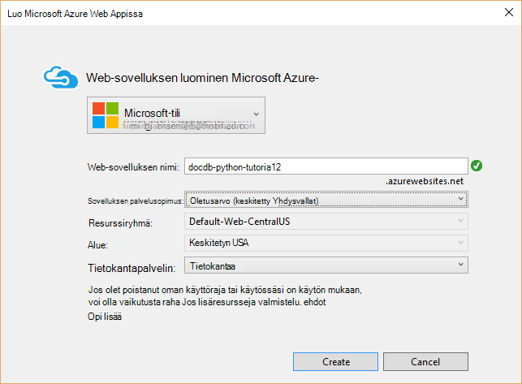

<properties
    pageTitle="Python: N Web sovellusten kehittämisen DocumentDB | Microsoft Azure"
    description="Tarkista tietokannan opetusohjelman DocumentDB avulla voit tallentaa ja käyttää tietoja isännöidään Azure Python: N web-sovelluksen. Etsi sovellusten kehittämisen ratkaisuja." 
    keywords="Sovellusten kehittämisen, tietokannan opetusohjelma, python: n, python web-sovelluksen, python web kehitystä, documentdb, azure, Microsoft azure"
    services="documentdb"
    documentationCenter="python"
    authors="syamkmsft"
    manager="jhubbard"
    editor="cgronlun"/>

<tags
    ms.service="documentdb"
    ms.workload="data-management"
    ms.tgt_pltfrm="na"
    ms.devlang="python"
    ms.topic="hero-article"
    ms.date="08/25/2016"
    ms.author="syamk"/>

# <a name="python-flask-web-application-development-with-documentdb"></a>Python: N Web sovellusten kehittämisen DocumentDB

> [AZURE.SELECTOR]
- [.NET](documentdb-dotnet-application.md)
- [Node.js](documentdb-nodejs-application.md)
- [Java](documentdb-java-application.md)
- [Python](documentdb-python-application.md)

Tässä opetusohjelmassa näytetään, miten voit käyttää Azure DocumentDB tallentamiseen ja access-tietojen Python-web-sovelluksen isännöimät Azure ja presumes että edellisen kokemusta Python ja Azure sivustot.

Tietokannan Tässä opetusohjelmassa kerrotaan:

1. Luominen ja valmisteleminen DocumentDB tilin.
2. Python MVC-sovelluksen luominen
3. Yhteyden muodostaminen ja Azure DocumentDB käyttäminen WWW-sovelluksesta.
4. Azure-sivustojen web-sovelluksen käyttöönotto.

Noudattamalla tässä opetusohjelmassa voit luoda yksinkertaisen äänestyspainikkeita sovellus, jonka avulla voit äänestää kyselyn.


## <a name="database-tutorial-prerequisites"></a>Tietokannan opetusohjelman edellytykset

Ennen kuin noudattamalla tämän artikkelin, varmista, että sinulla on asennettuna seuraavat:

- Azure active tili. Jos sinulla ei ole tiliä, voit luoda ilmainen kokeiluversio tili vain muutaman minuutin. Lisätietoja on artikkelissa [Azure maksuttoman kokeiluversion](https://azure.microsoft.com/pricing/free-trial/).
- [Visual Studio 2013](http://www.visualstudio.com/) tai uudempi versio, tai [Visual Studio Express](), joka on ilmainen versio. Tässä opetusohjelmassa ohjeita kirjoitetaan Visual Studio 2015 varten. 
- Visual Studio- [GitHub](http://microsoft.github.io/PTVS/)Python työkaluja. Tässä opetusohjelmassa käyttää Python työkalut ja 2015. 
- Azure Python SDK Visual Studio 2,4 tai uudempi versio [azure.com](https://azure.microsoft.com/downloads/)käytettävissä. On käytetty Microsoft Azure SDK Python 2.7 varten.
- Python 2.7- [python.org][2]. On käytetty Python 2.7.11. 

> [AZURE.IMPORTANT] Jos asennat Python 2.7 ensimmäistä kertaa, varmista mukauttaminen Python 2.7.11-näytön valita **Lisää python.exe polku**.
> 
>    

- Microsoft Visual C++ kääntäjä Python 2.7 [Microsoft Download Centeristä][3].

## <a name="step-1-create-a-documentdb-database-account"></a>Vaihe 1: DocumentDB tietokannan tilin luominen

Aloitetaan luomalla DocumentDB-tili. Jos olet jo määrittänyt tilin, voit jatkaa [Vaihe 2: Luo uusi Python: N web-sovelluksen](#step-2:-create-a-new-python-flask-web-application).

[AZURE.INCLUDE [documentdb-create-dbaccount](../../includes/documentdb-create-dbaccount.md)]

<br/>
Selkeät nyt miten voit luoda uuden Python: N web-sovelluksen alkava ylöspäin.

## <a name="step-2-create-a-new-python-flask-web-application"></a>Vaihe 2: Luo uusi Python: N web-sovellus

1. Visual Studiossa, valitse **Tiedosto** -valikosta **Uusi**ja valitse sitten **Projekti**.

    **Uusi projekti** -valintaikkuna.

2. Vasemmassa ruudussa Laajenna **Mallit** ja **Python**ja valitse sitten **WWW**. 

3. Valitse keskimmäisessä ruudussa, kirjoita **nimi** ruutuun tyyppi **opetusohjelma** **: N Web-projekti** ja valitse sitten **OK**. Muista, että Python paketin nimet pitäisi olla pieniksi kirjaimiksi kuvatulla tavalla [Python koodin oppaan tyyli](https://www.python.org/dev/peps/pep-0008/#package-and-module-names).

    Niille uusi Python: n se on web application development kehys, jonka avulla voit laajentaa Python verkkosovelluksista nopeammin.

    

4. **Python Tools for Visual Studio** -ikkunassa Valitse **Asenna virtual-ympäristöön**. 

    

5. **Lisää näennäisen ympäristön** -ikkunassa voit hyväksy oletusarvot ja käyttää Python 2.7 perus ympäristössä, koska PyDocumentDB ei tällä hetkellä tue Python 3.x, ja valitse sitten **Luo**. Tämä määrittää tarvittavat Python virtual ympäristön projektin.

    

    Kohde-ikkunassa näkyvät `Successfully installed Flask-0.10.1 Jinja2-2.8 MarkupSafe-0.23 Werkzeug-0.11.5 itsdangerous-0.24 'requirements.txt' was installed successfully.` kun ympäristöön on asennettu.

## <a name="step-3-modify-the-python-flask-web-application"></a>Vaihe 3: Python: N web-sovelluksen muokkaaminen

### <a name="add-the-python-flask-packages-to-your-project"></a>Python: N pakettien lisääminen projektiin

Kun projekti on määritetty, tarvitset tarvittavat: N paketit lisääminen projektiin, mukaan lukien pydocumentdb, DocumentDB Python pakkaaminen.

1. Napsauta ratkaisunhallinnassa Avaa tiedosto nimeltä **requirements.txt** ja korvaa sisältöä seuraavasti:

        flask==0.9
        flask-mail==0.7.6
        sqlalchemy==0.7.9
        flask-sqlalchemy==0.16
        sqlalchemy-migrate==0.7.2
        flask-whooshalchemy==0.55a
        flask-wtf==0.8.4
        pytz==2013b
        flask-babel==0.8
        flup
        pydocumentdb>=1.0.0

2. Tallenna tiedosto **requirements.txt** . 
3. Napsauta ratkaisunhallinnassa **kirjekuori** hiiren kakkospainikkeella ja valitse **Asenna requirements.txt**.

    

    Onnistuneen asennuksen jälkeen kohde-ikkunassa näkyvät seuraavasti:

        Successfully installed Babel-2.3.2 Tempita-0.5.2 WTForms-2.1 Whoosh-2.7.4 blinker-1.4 decorator-4.0.9 flask-0.9 flask-babel-0.8 flask-mail-0.7.6 flask-sqlalchemy-0.16 flask-whooshalchemy-0.55a0 flask-wtf-0.8.4 flup-1.0.2 pydocumentdb-1.6.1 pytz-2013b0 speaklater-1.3 sqlalchemy-0.7.9 sqlalchemy-migrate-0.7.2

    > [AZURE.NOTE] Vain harvoin voi näkyä kohde-ikkunassa epäonnistui. Jos näin käy, tarkista Jos uudelleenjärjestäminen liittyvän virheen. Joskus tyhjennys epäonnistuu, mutta asennus on onnistunut (vierittää ylöspäin kohde-ikkunassa voit tarkistaa tämän). Voit tarkistaa asennuksen tarkistamalla [virtual ympäristössä](#verify-the-virtual-environment). Asennus epäonnistui, mutta tiedot on tarkistettu, voidaanko Jatka.

### <a name="verify-the-virtual-environment"></a>Tarkista virtual ympäristössä

Varmista seuraavaksi, että kaikki on asennettu oikein.

1. Rakenna ratkaisu painamalla **CTRL-näppäintä**+**VAIHTO**+**B**.
2. Kun Luo onnistuu, voit aloittaa sivuston painamalla **F5-näppäintä**. Tämä käynnistää: N kehittämisketjun palvelimen ja käynnistää selaimen. Raportissa pitäisi näkyä seuraava sivu.

    

3. Lopeta virheenkorjaus sivuston painamalla näppäinyhdistelmää **VAIHTO**+Visual Studiossa**F5-näppäintä** .

### <a name="create-database-collection-and-document-definitions"></a>Tietokannan, sivustokokoelman ja asiakirjan määritelmien luominen

Nyt luodaan uusia tiedostoja lisäämällä ja päivittämällä muiden äänestyspainikkeita sovelluksen.

1. Napsauta ratkaisunhallinnassa **opetusohjelma** projektin hiiren kakkospainikkeella, valitsemalla **Lisää**ja valitse **Uusi kohde**. Valitse **Tyhjä Python tiedosto** ja nimeä tiedosto **forms.py**.  
2. Lisää seuraava koodi forms.py-tiedosto ja tallenna sitten tiedosto.

```python
from flask.ext.wtf import Form
from wtforms import RadioField

class VoteForm(Form):
    deploy_preference  = RadioField('Deployment Preference', choices=[
        ('Web Site', 'Web Site'),
        ('Cloud Service', 'Cloud Service'),
        ('Virtual Machine', 'Virtual Machine')], default='Web Site')
```


### <a name="add-the-required-imports-to-viewspy"></a>Lisää tarvittavat tuonnin views.py

1. Napsauta ratkaisunhallinnassa Laajenna **opetusohjelma** -kansio ja Avaa **views.py** -tiedosto. 
2. Lisää seuraavat tuomalla lauseet **views.py** tiedoston ylhäältä sitten tallentaa tiedoston. Nämä tuoda DocumentDB's PythonSDK ja: N paketit.

    ```python
    from forms import VoteForm
    import config
    import pydocumentdb.document_client as document_client
    ```


### <a name="create-database-collection-and-document"></a>Tietokannan, sivustokokoelman ja asiakirjan luominen

- Edelleen **views.py**, Lisää seuraava koodi tiedoston loppuun. Tämä on huolellisesti lomakkeen käyttämän tietokannan luominen. Älä poista mitään **views.py**aiemmin koodia. Liitä vain tämä loppuun.

```python
@app.route('/create')
def create():
    """Renders the contact page."""
    client = document_client.DocumentClient(config.DOCUMENTDB_HOST, {'masterKey': config.DOCUMENTDB_KEY})

    # Attempt to delete the database.  This allows this to be used to recreate as well as create
    try:
        db = next((data for data in client.ReadDatabases() if data['id'] == config.DOCUMENTDB_DATABASE))
        client.DeleteDatabase(db['_self'])
    except:
        pass

    # Create database
    db = client.CreateDatabase({ 'id': config.DOCUMENTDB_DATABASE })

    # Create collection
    collection = client.CreateCollection(db['_self'],{ 'id': config.DOCUMENTDB_COLLECTION })

    # Create document
    document = client.CreateDocument(collection['_self'],
        { 'id': config.DOCUMENTDB_DOCUMENT,
          'Web Site': 0,
          'Cloud Service': 0,
          'Virtual Machine': 0,
          'name': config.DOCUMENTDB_DOCUMENT 
        })

    return render_template(
       'create.html',
        title='Create Page',
        year=datetime.now().year,
        message='You just created a new database, collection, and document.  Your old votes have been deleted')
```

> [AZURE.TIP] **CreateCollection** menetelmä on valinnainen **RequestOptions** kolmannen parametrina. Tämän avulla voidaan määrittää tarjota kokoelman. Jos offerType ei ole arvoa ei määritetä, valitse kokoelman luodaan käyttämällä oletusarvoista tarjota tyyppi. Saat lisätietoja DocumentDB tarjota tyypit [suorituskyvyn tasojen DocumentDB](documentdb-performance-levels.md).


### <a name="read-database-collection-document-and-submit-form"></a>Lue tietokannan, sivustokokoelman, asiakirjan ja Lähetä lomake

- Edelleen **views.py**, Lisää seuraava koodi tiedoston loppuun. Tämä on varoen lomakkeen tietokannan, sivustokokoelman ja asiakirjojen lukeminen määrittämiseen. Älä poista mitään **views.py**aiemmin koodia. Liitä vain tämä loppuun.

```python
@app.route('/vote', methods=['GET', 'POST'])
def vote(): 
    form = VoteForm()
    replaced_document ={}
    if form.validate_on_submit(): # is user submitted vote  
        client = document_client.DocumentClient(config.DOCUMENTDB_HOST, {'masterKey': config.DOCUMENTDB_KEY})

        # Read databases and take first since id should not be duplicated.
        db = next((data for data in client.ReadDatabases() if data['id'] == config.DOCUMENTDB_DATABASE))

        # Read collections and take first since id should not be duplicated.
        coll = next((coll for coll in client.ReadCollections(db['_self']) if coll['id'] == config.DOCUMENTDB_COLLECTION))

        # Read documents and take first since id should not be duplicated.
        doc = next((doc for doc in client.ReadDocuments(coll['_self']) if doc['id'] == config.DOCUMENTDB_DOCUMENT))

        # Take the data from the deploy_preference and increment our database
        doc[form.deploy_preference.data] = doc[form.deploy_preference.data] + 1
        replaced_document = client.ReplaceDocument(doc['_self'], doc)

        # Create a model to pass to results.html
        class VoteObject:
            choices = dict()
            total_votes = 0

        vote_object = VoteObject()
        vote_object.choices = {
            "Web Site" : doc['Web Site'],
            "Cloud Service" : doc['Cloud Service'],
            "Virtual Machine" : doc['Virtual Machine']
        }
        vote_object.total_votes = sum(vote_object.choices.values())

        return render_template(
            'results.html', 
            year=datetime.now().year, 
            vote_object = vote_object)

    else :
        return render_template(
            'vote.html', 
            title = 'Vote',
            year=datetime.now().year,
            form = form)
```


### <a name="create-the-html-files"></a>HTML-tiedostojen luominen

1. Napsauta ratkaisunhallinnassa **opetusohjelma** -kansiossa **templates** -kansion hiiren kakkospainikkeella, valitse **Lisää**ja valitse sitten **Uusi kohde**. 
2. Valitse **HTML-sivulle**ja kirjoita nimi-ruutuun **create.html**. 
3. Toista vaiheet 1 ja 2 Luo kaksi muita HTML-tiedostoja: results.html ja vote.html.
4. Lisää seuraava koodi **create.html** `<body>` elementti. Se näyttää viesti, jossa ilmoitetaan, että luoda uuden tietokannan, sivustokokoelman ja asiakirjojen.

    ```html
    
    
    <h2>{{ title }}.</h2>
    <h3>{{ message }}</h3>
    <p><a href="{{ url_for('vote') }}" class="btn btn-primary btn-large">Vote &raquo;</a></p>
    
    ```

5. Lisää seuraava koodi **results.html** `<body`> elementti. Se näyttää kyselyn tulokset.

    ```html
    
    
    <h2>Results of the vote</h2>
        <br />
        
    
    <div class="row">
        <div class="col-sm-5">{{choice}}</div>
            <div class="col-sm-5">
                <div class="progress">
                    <div class="progress-bar" role="progressbar" aria-valuenow="{{vote_object.choices[choice]}}" aria-valuemin="0" aria-valuemax="{{vote_object.total_votes}}" style="width: {{(vote_object.choices[choice]/vote_object.total_votes)*100}}%;">
                                {{vote_object.choices[choice]}}
                </div>
            </div>
            </div>
    </div>
    
    
    <br />
    <a class="btn btn-primary" href="{{ url_for('vote') }}">Vote again?</a>
    
    ```

6. Lisää seuraava koodi **vote.html** `<body`> elementti. Se näyttää kyselyä ja hyväksyy äänet. Rekisteröinnistä äänet ohjausobjekti on välitetty views.py, jossa on tunnistaa äänestyksen cast ja liittää asiakirjan vastaavasti.

    ```html
    
    
    <h2>What is your favorite way to host an application on Azure?</h2>
    <form action="" method="post" name="vote">
        {{form.hidden_tag()}}
            {{form.deploy_preference}}
            <button class="btn btn-primary" type="submit">Vote</button>
    </form>
    
    ```

7. **Mallit** -kansioon korvaa **index.html** sisällön seuraavasti. Tämä on sovelluksen aloitussivu.
    
    ```html
    
    
    <h2>Python + DocumentDB Voting Application.</h2>
    <h3>This is a sample DocumentDB voting application using PyDocumentDB</h3>
    <p><a href="{{ url_for('create') }}" class="btn btn-primary btn-large">Create/Clear the Voting Database &raquo;</a></p>
    <p><a href="{{ url_for('vote') }}" class="btn btn-primary btn-large">Vote &raquo;</a></p>
    
    ```

### <a name="add-a-configuration-file-and-change-the-initpy"></a>Lisää määritystiedoston ja muuta \_ \_alusta\_\_.py

1. Napsauta ratkaisunhallinnassa **opetusohjelma** projektin hiiren kakkospainikkeella, valitsemalla **Lisää**, **Uusi**kohde, valitse **Tyhjä Python tiedosto**ja nimeä tiedosto **config.py**. Tämä määritystiedosto tarvitaan: N lomakkeet. Sen avulla voit antaa myös salausavaimen. Tämä avain ei tarvita Tässä opetusohjelmassa, vaikka.

2. Lisää seuraava koodi config.py, sinun täytyy muuttaa arvoja **DOCUMENTDB\_HOST** ja **DOCUMENTDB\_AVAIMEN** seuraavassa vaiheessa.

    ```python
    CSRF_ENABLED = True
    SECRET_KEY = 'you-will-never-guess'
    
    DOCUMENTDB_HOST = 'https://YOUR_DOCUMENTDB_NAME.documents.azure.com:443/'
    DOCUMENTDB_KEY = 'YOUR_SECRET_KEY_ENDING_IN_=='
    
    DOCUMENTDB_DATABASE = 'voting database'
    DOCUMENTDB_COLLECTION = 'voting collection'
    DOCUMENTDB_DOCUMENT = 'voting document'
    ```

3. [Azure portal](https://portal.azure.com/)Siirtyminen **näppäimet** -sivu valitsemalla **Selaa** **DocumentDB tilit**, kaksoisnapsauta käytettävän tilin nimi ja valitse sitten **Essentials** -alueella **näppäimet** -painiketta. Kopioi **URI** -arvo **näppäimet** -sivu ja liitä se **config.py** -tiedoston arvona **DOCUMENTDB\_HOST** ominaisuuden. 
4. Takaisin kopioi **Perusavain** tai **Toissijaisen avaimen**arvon Azure-portaalia **näppäimet** -sivu ja liitä se **config.py** -tiedoston summana **DOCUMENTDB\_AVAIMEN** ominaisuus.
5. Valitse ** \_ \_alusta\_\_.py** tiedoston, Lisää seuraava rivi. 

        app.config.from_object('config')

    Niin, että tiedoston sisältö on:

    ```python
    from flask import Flask
    app = Flask(__name__)
    app.config.from_object('config')
    import tutorial.views
    ```

6. Kun olet lisännyt kaikki tiedostot, ratkaisunhallinnassa pitäisi näyttää tältä:

    


## <a name="step-4-run-your-web-application-locally"></a>Vaihe 4: Suorita web-sovelluksen paikallisesti

1. Rakenna ratkaisu painamalla **CTRL-näppäintä**+**VAIHTO**+**B**.
2. Kun Luo onnistuu, voit aloittaa sivuston painamalla **F5-näppäintä**. Näytössä pitäisi näkyä seuraava.

    

3. Valitse **Luo/Poista äänestyksen tietokannan** tietokannan luomiseen.

    

4. Napsauta **Ääni** ja valitse maksutapa.

    

5. Jokaisen ääni, voit määrittää menevä tarvittavat laskuri.

    

6. Lopeta virheenkorjaus projektin painamalla näppäinyhdistelmää VAIHTO + F5.

## <a name="step-5-deploy-the-web-application-to-azure-websites"></a>Vaihe 5: Azure sivustojen web-sovelluksen käyttöönotto

Nyt kun olet valmis sovelluksen oikein DocumentDB vastaan, seuraavaksi käyttöön Azure sivustot.

1. Napsauta ratkaisunhallinnassa projektin (Varmista, että et ole vielä käynnissä paikallisesti) ja valitse **Julkaise**.  

    

2. **Julkaise** -ikkunassa Valitse **Microsoft Azure Web Apps -sovellusten**ja valitse sitten **Seuraava**.

    

3. **Microsoft Azure Web Apps-ikkunaan** -ikkunassa valitsemalla **Uusi**.

    

4. **Sivuston luominen Microsoft Azure** -ikkunassa **Web-sovelluksen nimi**, **sovelluksen palvelusopimus**, **resurssiryhmä**ja **alue**ja valitse sitten **Luo**.

    

5. **Julkaise** -ikkunassa Valitse **Julkaise**.

    

3. Muutaman sekunnin kuluttua Visual Studio valmis julkaiseminen web-sovelluksen ja Avaa selaimessa, näet Azure-tietokannassa on kätevä työsi!

## <a name="troubleshooting"></a>Vianmääritys

Jos olet suorittanut tietokoneen ensimmäisen Python sovellus, varmista, että seuraavat kansiot (tai vastaava asennuksen sijainnit) sisältyvät LIIKERATA muuttuja:

    C:\Python27\site-packages;C:\Python27\;C:\Python27\Scripts;

Jos näyttöön tulee virhesanoma, ääni-sivulla ja nimeltä projektin jollakin muulla kuin **opetusohjelma**, varmista, että ** \_ \_alusta\_\_.py** viittaa rivin oikea projektin nimeä: `import tutorial.view`.

## <a name="next-steps"></a>Seuraavat vaiheet

Onnittelen! Vain sinulla on valmis käyttämällä Azure DocumentDB ensimmäisen Python web-sovelluksen ja julkaista Azure sivustojen.

Olemme päivittää ja kehittää tässä ohjeaiheessa usein palautteen perusteella.  Kun olet prosenttiosuuden opetusohjelman käyttämällä Ota ylä-ja tämän sivun alareunassa äänestyspainikkeiden ja muista lisätä palautetta mitä tehty parannuksia, joiden haluat olevan näkyvissä. Jos haluat voimme ottaa sinuun yhteyttä henkilökohtaisesti, vapaasti sähköpostiosoitteesi sisällyttäminen kommentit.

Voit lisätä lisätoimintoja web-sovelluksen, tarkista käytettävissä [DocumentDB Python SDK](documentdb-sdk-python.md)-ohjelmointirajapinnan.

Saat lisätietoja Azure ja Visual Studio Python [Python Developer Center](https://azure.microsoft.com/develop/python/). 

Saat lisätietoja Python: N opetusohjelmat [: N Mt-opetusohjelmassa osa I: Hei, maailma!](http://blog.miguelgrinberg.com/post/the-flask-mega-tutorial-part-i-hello-world). 

  [Visual Studio Express]: http://www.visualstudio.com/products/visual-studio-express-vs.aspx
  [2]: https://www.python.org/downloads/windows/
  [3]: https://www.microsoft.com/download/details.aspx?id=44266
  [Microsoft Web Platform Installer]: http://www.microsoft.com/web/downloads/platform.aspx
  [Azure portal]: http://portal.azure.com
