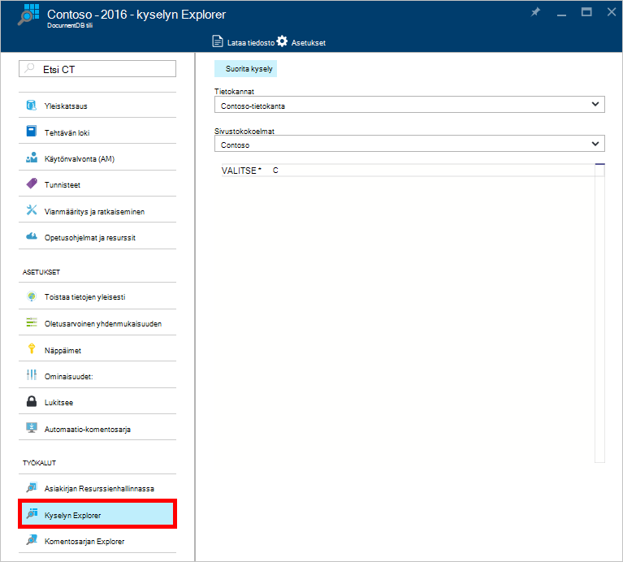
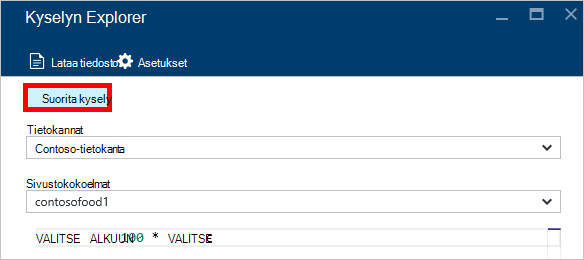
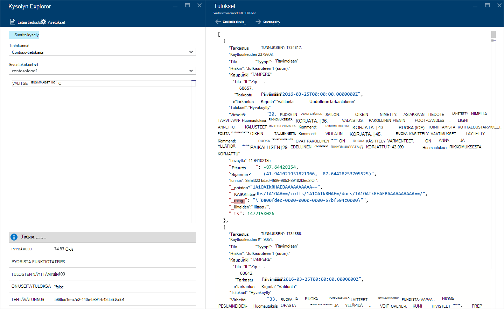
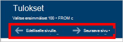
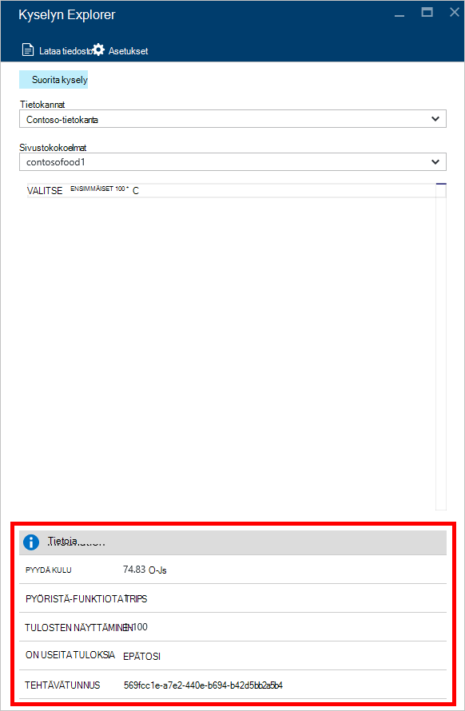
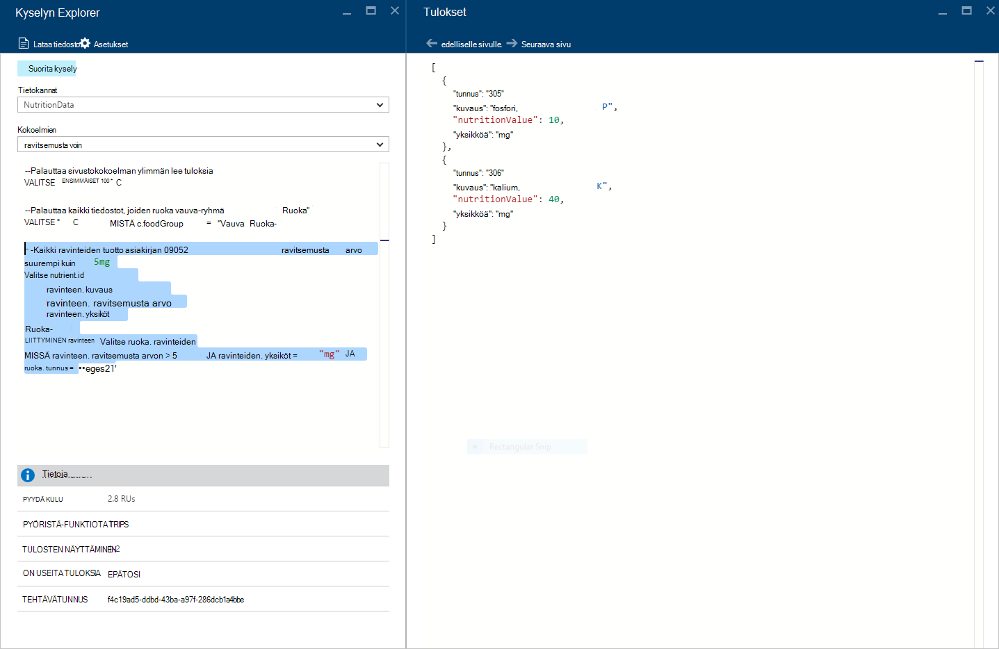
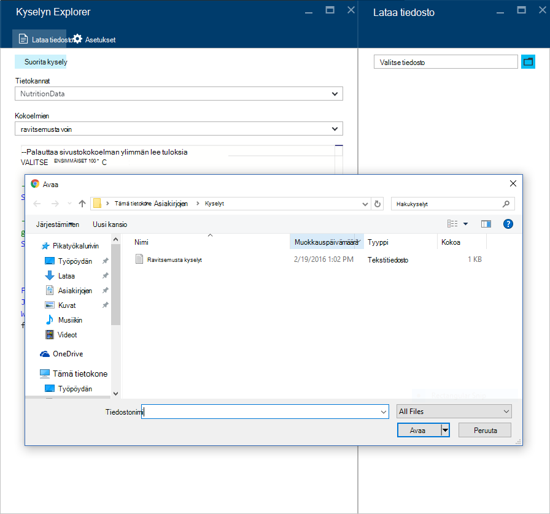
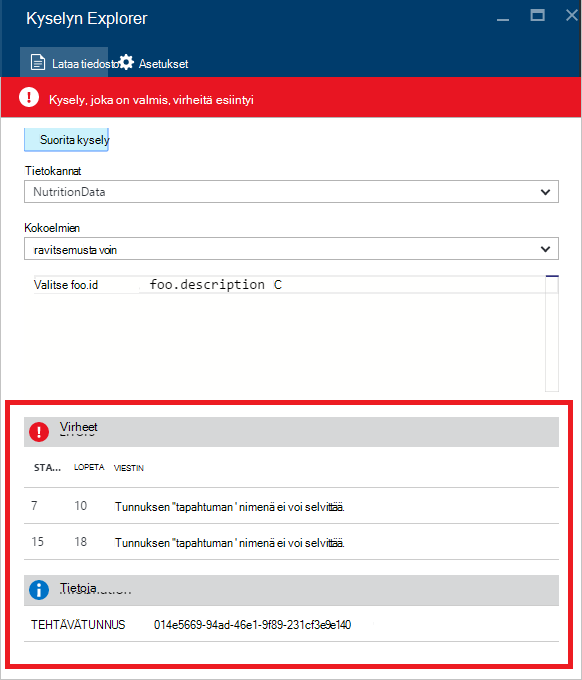

<properties
    pageTitle="DocumentDB kyselyn Explorer: SQL kyselyeditori | Microsoft Azure"
    description="Lisätietoja DocumentDB kyselyn Explorer SQL-kyselyeditori kirjoittaminen SQL-kyselyjä ja käyttää niitä NoSQL DocumentDB sivustokokoelman Azure-portaalissa."
    keywords="kirjoittaminen sql-kyselyjä, sql-kyselyeditori"
    services="documentdb"
    authors="kirillg"
    manager="jhubbard"
    editor="monicar"
    documentationCenter=""/>

<tags
    ms.service="documentdb"
    ms.workload="data-services"
    ms.tgt_pltfrm="na"
    ms.devlang="na"
    ms.topic="article"
    ms.date="08/30/2016"
    ms.author="kirillg"/>

# Sähköpostin kirjoittaminen, muokkaaminen ja Suorita SQL-kyselyjä DocumentDB kyselyn Resurssienhallinnassa 

Tässä artikkelissa on yleiskatsaus [Microsoft Azure DocumentDB](https://azure.microsoft.com/services/documentdb/) kyselyn Explorer Azure portaalin työkalua, joka mahdollistaa sähköpostin kirjoittaminen, muokkaaminen ja suorittaa [DocumentDB sivustokokoelman](documentdb-create-collection.md)SQL-kyselyjä.

1. Valitse Azure-portaalissa Jumpbar, **DocumentDB (NoSQL)**. Jos **DocumentDB (NoSQL)** ei ole näkyvissä, valitse **Lisää palveluja** ja valitse sitten **DocumentDB (NoSQL)**.

2. Valitse resurssi-valikosta **Kyselyn Explorer**. 

    

3. Valitse **Kyselyn Explorer** -sivu valitsemalla **tietokantojen** ja **kokoelmien** kyselyn avattavat luettelot ja kirjoita kysely suoritetaan. 

    **Tietokantojen** ja **kokoelmien** avattavista luetteloista on valmiiksi missä käynnistät kyselyn Explorer tilanteen mukaan. 

    Oletusarvoinen kyselyn `SELECT TOP 100 * FROM c` on annettu.  Voit hyväksyä oletuskyselyä tai muodosta oma kysely SQL-kyselykielen [SQL-kyselyn cheat taulukko](documentdb-sql-query-cheat-sheet.md) -tai [SQL-kysely ja SQL-syntaksi](documentdb-sql-query.md) -artikkelin ohjeiden avulla.

    Valitse tulokset **Suorita kysely** .

    

4. **Tulokset** -sivu näyttää kyselyn tulokset. 

    

## Tulosten käyttäminen

Oletusarvon mukaan kyselyn Explorer palauttaa tuloksia 100 määrä.  Jos kysely tuottaa yli 100 tuloksia, riittää, että **Seuraava sivu** tai **Edellinen sivu** komentojen avulla tulosjoukko siirtyminen.

Onnistuneiden kyselyjen **tiedot** -ruutu sisältää arvot, kuten pyynnön maksutta PYÖRISTÄ-funktiota trips kyselyn tehnyt, tällä hetkellä ole näkyvissä, tulokset joukko määrän ja ovatko enemmän tuloksia, jotka voidaan sitten käyttää kautta **Seuraava sivu** -komento kuin edellä mainittiin.

## Useiden kyselyjen avulla

Jos käytät useiden kyselyjen ja haluat siirtyä niiden välillä, voit kirjoittaa kaikki kyselyt kyselyn tekstiruutuun **Kyselyn Explorer** -sivu, sitten Korosta haluat suorittaa yhden ja valitse sitten **suorittaa kyselyn** tulokset.

## Lisää kyselyjen tiedostosta SQL-kyselyeditori

Voit ladata **Tiedoston lataaminen** -komennon avulla aiemmin luodun tiedoston sisällön.

## Vianmääritys

Jos kysely on valmis, virheitä, kyselyn Explorer näyttää luettelo virheistä, jotka auttavat vianmäärityksessä tehokkuutta.

## DocumentDB SQL-kyselyjen portaalin ulkopuolella suorittaminen

Kyselyn Explorer Azure-portaalissa on vain yksi tapa suorittaa DocumentDB SQL-kyselyjä. Voit myös suorittamalla SQL-kyselyjä [REST API](https://msdn.microsoft.com/library/azure/dn781481.aspx) tai [asiakkaan SDK: T](documentdb-sdk-dotnet.md). Saat lisätietoja näistä menetelmistä [suoritetaan SQL-kyselyjä](documentdb-sql-query.md#executing-sql-queries)

## Seuraavat vaiheet

Lisätietoja DocumentDB SQL-kieliopin tueta kyselyn Explorerissa, on artikkelissa [SQL-kysely ja SQL-syntaksi](documentdb-sql-query.md) tai tulostaa [SQL-kyselyn cheat taulukko](documentdb-sql-query-cheat-sheet.md).
Voit myös nauttivat [Kyselyn leikkikenttä](https://www.documentdb.com/sql/demo) , missä voit testata kyselyjen verkossa otoksen tietojoukko kokeileminen.
