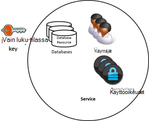
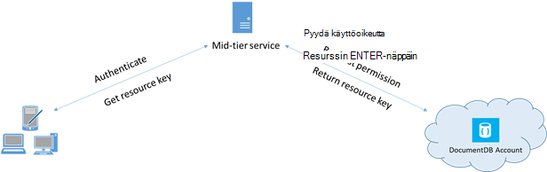

<properties 
    pageTitle="Opi käyttämään DocumentDB tietojen suojaamiseen | Microsoft Azure" 
    description="Lisätietoja Accessin ohjausobjektin käsitteiden DocumentDB, kuten perusmuodon näppäimet, vain luku-avaimet, käyttäjät ja käyttöoikeudet." 
    services="documentdb" 
    authors="kiratp" 
    manager="jhubbard" 
    editor="monicar" 
    documentationCenter=""/>

<tags 
    ms.service="documentdb" 
    ms.workload="data-services" 
    ms.tgt_pltfrm="na" 
    ms.devlang="na" 
    ms.topic="article" 
    ms.date="09/19/2016" 
    ms.author="kipandya"/>

# DocumentDB tietojen suojaaminen

Tässä artikkelissa on yleiskatsaus suojaaminen [Microsoft Azure DocumentDB](https://azure.microsoft.com/services/documentdb/)tallennettuja tietoja voidaan käyttää.

Luettuasi tämän yleiskatsaus pystyt seuraaviin kysymyksiin:  

-   Mitkä ovat DocumentDB perustyyli näppäimet?
-   Mitkä ovat DocumentDB vain luku-avaimet?
-   Mitkä ovat DocumentDB resurssin tunnusten?
-   Miten voin käyttää DocumentDB käyttäjät ja käyttöoikeudet suojaamiseen DocumentDB tietojen käytön?

## DocumentDB access hallinnan käsitteitä

DocumentDB on ensimmäisen luokan käsitteitä jotta DocumentDB resurssien käyttöoikeuksien hallinnassa.  Tässä ohjeaiheessa tarkoitetaan DocumentDB resursseja on ryhmitelty kahteen luokkaan:

- Järjestelmänvalvojan resurssit
    - Tilin
    - Tietokannan
    - Käyttäjän
    - Käyttöoikeudet
- Sovelluksen resurssit
    - Sivustokokoelman
    - Tarjouksen
    - Asiakirjan
    - Liite
    - Tallennettu toimintosarja
    - Käynnistin
    - Käyttäjän määrittämä funktio

Nämä kahteen luokkaan kontekstissa, DocumentDB tukee access ohjausobjektin mukana seuraavat henkilöt kolmenlaisia: järjestelmänvalvoja, vain luku-järjestelmänvalvoja ja tietokannan käyttäjä huomioon.  Access-ohjausobjektin kunkin henkilön oikeudet ovat seuraavat:
 
- Tilin järjestelmänvalvojaan: täydet käyttöoikeudet kaikki tietyn DocumentDB tilin resurssit (järjestelmänvalvojan ja sovelluksen).
- Vain luku-järjestelmänvalvoja: vain luku-oikeudet kaikkiin resurssit (järjestelmänvalvojan ja sovelluksen annetun DocumentDB-tilin. 
- Tietokannan käyttäjä: DocumentDB käyttäjän resurssin liittyvät tietyt DocumentDB tietokannan resurssit (esimerkiksi sivustokokoelmat, tiedostoja, komentosarjojen).  Voi olla yksi tai tietyn tietokannan liittyvät käyttäjän lisäresursseja ja käyttäjän kullekin resurssille saattaa olla yhdistetty vähintään yksi käyttöoikeudet.

Mainittuun luokkaan ja resurssien mielessä DocumentDB malli määrittää access-rakenteita kolmenlaisia:

- Perustyyli avaimet: DocumentDB tilin luonnin yhteydessä luodut kaksi perustyyli näppäimet (ensisijainen ja toissijainen).  Painettavat näppäimet käyttöön kaikkien resurssien DocumentDB tilin täydet järjestelmänvalvojan käyttöoikeudet.

- Vain luku-avaimet: DocumentDB tilin luonnin yhteydessä (ensisijainen ja toissijainen) kaksi vain luku-avaimet luodaan.  Painettavat näppäimet käyttöön kaikille resursseille DocumentDB tilin vain luku-tilassa.

- Resurssin tunnusten: resurssin tunnus on liitetty DocumentDB oikeudet resurssin ja sieppaa yhteyden käyttäjän tietokannan ja haluamasi oikeudet välillä, että käyttäjällä on tietyn DocumentDB sovelluksen resurssin-(kuten sivustokokoelman, asiakirjan).

## DocumentDB pää- ja vain luku-näppäimiä käsitteleminen

Kuten edellä mainittiin, DocumentDB perustyyli näppäimet on kaikkien resurssien DocumentDB-tilin täydet järjestelmänvalvojan käyttöoikeudet, kun vain luku-avaimet lukuoikeus kaikille resursseille tilin.  Seuraavat koodikatkelman kuvataan, miten esiintymää DocumentClient ja luoda uuden tietokannan DocumentDB tilin päätepisteen ja avaimen avulla. 

    //Read the DocumentDB endpointUrl and authorization keys from config.
    //These values are available from the Azure Classic Portal on the DocumentDB Account Blade under "Keys".
    //NB > Keep these values in a safe and secure location. Together they provide Administrative access to your DocDB account.
    
    private static readonly string endpointUrl = ConfigurationManager.AppSettings["EndPointUrl"];
    private static readonly SecureString authorizationKey = ToSecureString(ConfigurationManager.AppSettings["AuthorizationKey"]);
        
    client = new DocumentClient(new Uri(endpointUrl), authorizationKey);
    
    // Create Database
    Database database = await client.CreateDatabaseAsync(
        new Database
        {
            Id = databaseName
        });

## DocumentDB resurssin tunnusten yleiskatsaus

Voit käyttää resurssin tunnus (luomalla DocumentDB käyttäjät ja käyttöoikeudet) kun haluat lisätä DocumentDB tilisi resurssien käytön asiakas, joka ei voi luottaa perustyyli-näppäimen kanssa. DocumentDB perustyyli avaimien sisältää sekä ensisijaisen ja toissijaisen näppäintä, kukin ottavat myöntää tilin ja kaikki sen resurssit järjestelmänvalvojan oikeudet. Haittaohjelmien tai huolimattomasti käytön mahdollisuutta tilisi paljastaa joko perustyyli avaimien avautuu. 

Vastaavasti DocumentDB vain luku-avaimet kaikki resurssit - käyttöoikeus resurssit, paitsi lukuoikeudet on tietenkin - DocumentDB-tilin, eikä sitä voi käyttää eritellympiä pääsy DocumentDB resurssit.

DocumentDB resurssin tunnusten on turvallinen vaihtoehto, joka sallii käyttävät voivat lukea, kirjoittaa ja poista resursseja DocumentDB tilisi sinulle on myönnetty tarvittavat käyttöoikeudet, ja ilman tarvetta perustyyliin tai vain avaimen luku.

Tässä on tyypillinen rakenne kuviota, jolla resurssi tunnusten voidaan pyytää, luoda ja toimittaa asiakkaille:

1. Keskellä taso-palvelu on määritetty tukemaan mobiilisovelluksen jakaminen käyttäjän valokuvia.
2. Keskellä taso-palvelu on DocumentDB tilin perustyyli-näppäintä.
3. Valokuva-sovellus on asennettu peruskäyttäjän mobiililaitteissa. 
4. Kirjaudu sisään, valitse valokuva-sovellus muodostaa keskellä taso-palvelussa käyttäjän tunnistetiedot. Tämä tunnistetietojen perustaminen järjestelmä on pelkästään sovelluksen ylöspäin.
5. Kun tunnistetiedot on muodostettu, keskellä taso-palvelun pyytää käyttöoikeudet tunnistetietojen perusteella.
6. Puolivälin taso-palvelun lähettää resurssin tunnus takaisin phone-sovellus.
7. Puhelin-sovelluksen edelleen käyttää resurssin tunnus käyttää suoraan määritettyjen resurssien tunnuksen ja sallii sen resurssin tunnus aikavälin oikeuksilla DocumentDB resursseja. 
8. Resurssin tunnus vanhenee, myöhemmät saavat 401 luvattoman poikkeuksen.  Tässä vaiheessa Puhelin-sovellus muodostaa uudelleen käyttäjätietoja ja pyytää uusi resurssi-tunnuksen.

## DocumentDB käyttäjät ja käyttöoikeudet
DocumentDB käyttäjän resurssi on liitetty DocumentDB tietokannan.  Tietokantojen voi olla nolla tai usean käyttäjän DocumentDB.  Seuraavat koodikatkelman esitetään, kuinka voit luoda DocumentDB käyttäjän resurssin.

    //Create a user.
    User docUser = new User
    {
        Id = "mobileuser"
    };

    docUser = await client.CreateUserAsync(UriFactory.CreateDatabaseUri("db"), docUser);

> [AZURE.NOTE] DocumentDB kullakin käyttäjällä on PermissionsLink-ominaisuutta, jolla voidaan käyttää käyttäjän liittyvät oikeudet luettelon noutaminen.

Resurssin DocumentDB käyttöoikeus on liitetty DocumentDB käyttäjä.  Kukin käyttäjä voi olla nolla tai useampia DocumentDB käyttöoikeudet.  Suojaustunnus, käyttäjän on oltava, kun yrität käyttää tietyn sovelluksen resurssin oikeudet resurssin pääsee.
On kaksi käytettävissä käyttöoikeustasot, jotka voi antaa käyttöoikeuden resurssin:

- Kaikki: Käyttäjällä on täydet oikeudet resurssin
- Luku: Käyttäjä voi lukea vain resurssin sisältö, mutta voi tehdä kirjoittaminen, Päivitä tai poista toimenpiteet resurssi.

> [AZURE.NOTE] Jotta voit suorittaa DocumentDB tallennettujen toimintosarjojen käyttäjän on oltava kaikki oikeudet sivustokokoelman, johon tallennetun toimintosarjan suorittamisen.

Seuraavat koodikatkelman näyttää, miten voit luoda oikeudet resurssin lukea oikeudet resurssin resurssi-tunnuksen ja käyttöoikeuksien liittäminen edellä luotu käyttäjän.

    // Create a permission.
    Permission docPermission = new Permission
    {
        PermissionMode = PermissionMode.Read,
        ResourceLink = documentCollection.SelfLink,
        Id = "readperm"
    };
            
  docPermission = odotettava asiakas. CreatePermissionAsync (UriFactory.CreateUserUri ("db", "käyttäjä"), docPermission); Console.WriteLine (docPermission.Id + "on tunnus:" + docPermission.Token);
  
Jos olet määrittänyt osion näppäintä kokoelmasta sitten sivustokokoelman käyttöoikeudet, asiakirjan ja liitteen resurssien täytyy kuulua ResourcePartitionKey ResourceLink lisäksi.

Jotta voit helposti noutaa kaikki tietyn käyttäjän liittyvät oikeudet-resurssit, DocumentDB tekee käytettävissä käyttöoikeus syötteen kunkin käyttäjäobjektin.  Seuraavat koodikatkelman voit hakea edellä luotu käyttäjään käyttöoikeuksia, muodostaa luettelon käyttöoikeudet ja vahvistaa uuden DocumentClient käyttäjän puolesta.

    //Read a permission feed.
    FeedResponse<Permission> permFeed = await client.ReadPermissionFeedAsync(
      UriFactory.CreateUserUri("db", "myUser"));

    List<Permission> permList = new List<Permission>();
      
    foreach (Permission perm in permFeed)
    {
        permList.Add(perm);
    }
            
    DocumentClient userClient = new DocumentClient(new Uri(endpointUrl), permList);

> [AZURE.TIP] Resurssin tunnusten on kelvollinen aikajakson on 1 tunti.  Suojaustunnuksen elinaika kuitenkin voi määrittää eksplisiittisesti, enintään viiden tunnin ajan.

## Seuraavat vaiheet

- Saat lisätietoja DocumentDB napsauttamalla [tätä](http://azure.com/docdb).
- Lisätietoja hallinta pää-ja vain luku-, napsauta [tätä](documentdb-manage-account.md).
- Saat lisätietoja DocumentDB luvan tunnusten muodostamisesta, napsauttamalla [tätä](https://msdn.microsoft.com/library/azure/dn783368.aspx)
 
