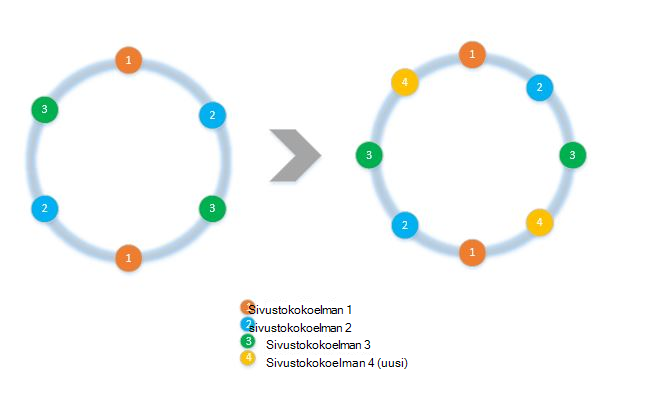
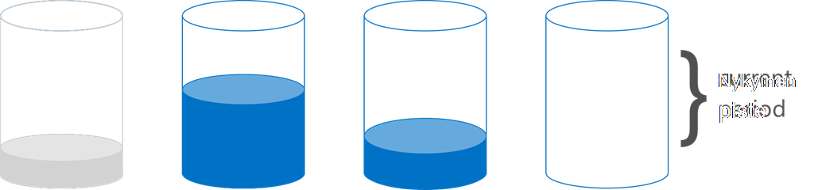

<properties 
    pageTitle="Asiakkaan puoli jakaminen SDK: T ja ottamisesta käyttöön | Microsoft Azure" 
    description="Opettele käyttämään (shard)-osion tiedot ja reitin pyyntöihin Azure SDK:-t DocumentDB yli useita sivustokokoelmat" 
    services="documentdb" 
    authors="arramac" 
    manager="jhubbard" 
    editor="cgronlun" 
    documentationCenter=""/>

<tags 
    ms.service="documentdb" 
    ms.workload="data-services" 
    ms.tgt_pltfrm="na" 
    ms.devlang="na" 
    ms.topic="article" 
    ms.date="10/27/2016" 
    ms.author="arramac"/>

# <a name="how-to-partition-data-using-client-side-support-in-documentdb"></a>Miten osion tiedot asiakkaan tuen käyttäminen DocumentDB

Azure DocumentDB tukee [Automaattinen kokoelmien jakaminen](documentdb-partition-data.md). On kuitenkin käyttää tapauksissa silloin, kun se on hyödyllisiin hieno hakuindeksointi voidaan suojata päättää jakaminen toiminta. Vähentää kattilan että koodin vaaditaan jakaminen tehtäviä, jotta Olemme lisänneet toimintoja .NET, Node.js ja Java SDK: T, joka on helppo luoda sovelluksia, jotka on skaalattu yli useita sivustokokoelmat.

Tässä artikkelissa otamme luokat ja liittymät .NET SDK ja miten voit käyttää niitä osioitua sovellusten kehittämiseen. Muut SDK: T, kuten Java, Node.js ja Python tuen samanlaisia menetelmät ja liittymät asiakkaan jakaminen.

## <a name="client-side-partitioning-with-the-documentdb-sdk"></a>Asiakkaan jakaminen DocumentDB SDK: N kanssa

Ennen kuin olemme tarkastella tarkemmin – jakaminen, recap oletetaan, että jotkin DocumentDB peruskäsitteitä, jotka liittyvät jakaminen. Azure DocumentDB tietokannan jokaiselle tilille koostuu joukosta tietokantojen kussakin useita sivustokokoelmat, joihin voi olla tallennettujen toimintosarjojen, käynnistimien, UDF, tiedostoja ja Aiheeseen liittyvät liitteet. Kokoelmien voidaan yhden osion tai osioitua itse ja on seuraavat ominaisuudet:

- Kokoelmien tarjouksen suorituskyvyn yksinään. Näin ollen on suorituskyvyn etu-lajitteleminen saman kokoelman samalla asiakirjat. Esimerkiksi sarjan Aikatietojen, haluat ehkä sijoittaa tiedot, viime kuussa, joka on usein kyselyjä, sisällä kokoelma on suurempi valmistellun siirtonopeuden olisi vanhat tiedot sijoitetaan sisällä sivustokokoelmat pienen valmistellun siirtonopeuden kanssa.
- Hapan tapahtumat eli tallennettujen toimintosarjojen ja käynnistimien ei voi olla kokoelma. Tapahtumien on rajattu osio avaimen arvossa toiseen.
- Kokoelmien Älä pakota rakenne, jotta niitä voidaan käyttää samaa tyyppiä tai eri asiakirjojen JSON.

Alkaen versio [Azure DocumentDB SDK: T 1.5.x](documentdb-sdk-dotnet.md), voit suorittaa asiakirjan toimet suoraan tietokannan vastaan. Sisäisesti [DocumentClient](https://msdn.microsoft.com/library/azure/microsoft.azure.documents.client.documentclient.aspx) käyttää PartitionResolver, jonka olet määrittänyt tarvittavat sivustokokoelman pyynnöt reitin tietokannan.

>[AZURE.NOTE] [Palvelinpuolen jakaminen](documentdb-partition-data.md) käyttöön REST API 2015 – 12-16 ja SDK: T 1.6.0+ deprecates asiakkaan osion tulkintatoiminnon lähestymistapa yksinkertainen Käytä tapauksissa. Asiakkaan jakaminen on joustavampaa kuitenkin ja voit valvoa suorituskykyä eristystaso yli osion näppäimet, hallita rinnakkaisuuden luettaessa tulokset kohteesta useita osioita ja käyttää alue/paikkatietojen tavoista hash ja jakaminen.

.NET-PartitionResolver kunkin luokan on betonin soveltaminen [IPartitionResolver](https://msdn.microsoft.com/library/azure/microsoft.azure.documents.client.ipartitionresolver.aspx) -käyttöliittymä, jossa on kolme tapaa - [GetPartitionKey](https://msdn.microsoft.com/library/azure/microsoft.azure.documents.client.ipartitionresolver.getpartitionkey.aspx), [ResolveForCreate](https://msdn.microsoft.com/library/azure/microsoft.azure.documents.client.ipartitionresolver.resolveforcreate.aspx) ja [ResolveForRead](https://msdn.microsoft.com/library/azure/microsoft.azure.documents.client.ipartitionresolver.resolveforread.aspx). LINQ kyselyt ja ReadFeed Iteroijissa ResolveForRead menetelmän avulla sisäisesti päällä, jotka vastaavat pyynnön osion näppäintä kokoelmien käytöstä. Luo vastaavasti toimintojen käyttäminen reitittämään ResolveForCreate-menetelmä luo oikealle-osioon. Muutoksia ei ole korvaa vaaditaan, poistaminen ja lukea, koska ne käyttävät asiakirjat, joka sisältää jo vastaava kokoelma viittaus.

SDK: T on myös kaksi luokat, jotka tukevat kaksi canonical osioinnin tekniikoita, hajautuksessa ja alueen haut [HashPartitionResolver](https://msdn.microsoft.com/library/azure/microsoft.azure.documents.partitioning.hashpartitionresolver.aspx) ja [RangePartitionResolver](https://msdn.microsoft.com/library/azure/mt126047.aspx)kautta. Näiden luokkien avulla voit helposti lisätä osiointilogiikan sovelluksen.  

## <a name="add-partitioning-logic-and-register-the-partitionresolver"></a>Lisää osiointilogiikan ja rekisteröi PartitionResolver 

Seuraavassa on koodikatkelman, luo [HashPartitionResolver](https://msdn.microsoft.com/library/azure/microsoft.azure.documents.partitioning.hashpartitionresolver.aspx) ja rekisteröi DocumentClient tietokantaan.

```cs
// Create some collections to partition data.
DocumentCollection collection1 = await client.CreateDocumentCollectionAsync(...);
DocumentCollection collection2 = await client.CreateDocumentCollectionAsync(...);

// Initialize a HashPartitionResolver using the "UserId" property and the two collection self-links.
HashPartitionResolver hashResolver = new HashPartitionResolver(
    u => ((UserProfile)u).UserId, 
    new string[] { collection1.SelfLink, collection2.SelfLink });

// Register the PartitionResolver with the database.
this.client.PartitionResolvers[database.SelfLink] = hashResolver;

```

## <a name="create-documents-in-a-partition"></a>Tiedostojen luominen-osio  

Rekisteröitynyt PartitionResolver voit suorittaa Luo ja kyselyt suoraan vastaan tietokantaa, alla kuvatulla tavalla. Tässä esimerkissä SDK käytetään PartitionResolver Pura käyttäjätunnus ja hash se reitittää luontitoiminto oikea sivustokokoelman arvon avulla.

```cs
Document johnDocument = await this.client.CreateDocumentAsync(
    database.SelfLink, new UserProfile("J1", "@John", Region.UnitedStatesEast));
Document ryanDocument = await this.client.CreateDocumentAsync(
    database.SelfLink, new UserProfile("U4", "@Ryan", Region.AsiaPacific, UserStatus.AppearAway));
```

## <a name="create-queries-against-partitions"></a>Kyselyitä, jotka perustuvat osioiden luominen  

Voit tehdä kyselyn mukaan tietokannan ja osion avaimen kulkee [CreateDocumentQuery](https://msdn.microsoft.com/library/azure/microsoft.azure.documents.linq.documentqueryable.createdocumentquery.aspx) -menetelmällä. Kysely palauttaa yksittäisen tulosjoukon päälle kaikki kokoelmien tietokannasta, jotka vastaavat osio-näppäintä.  

```cs
// Query for John's document by ID - uses PartitionResolver to restrict the query to the partitions 
// containing @John. Again the query uses the database self link, and relies on the hash resolver 
// to route the appropriate collection.
var query = this.client.CreateDocumentQuery<UserProfile>(
    database.SelfLink, null, partitionResolver.GetPartitionKey(johnProfile))
    .Where(u => u.UserName == "@John");
johnProfile = query.AsEnumerable().FirstOrDefault();
```

## <a name="create-queries-against-all-collections-in-the-database"></a>Tietokannan kyselyitä, jotka perustuvat kaikkien sivustokokoelmien luominen 

Voit myös kyselyn tietokannan kaikki kokoelmien ja luetteloi tulokset, kun Näytä alla mukaan ohitetaan osion avaimen argumentti.

```cs
// Query for all "Available" users. Here since there is no partition key, the query is serially executed 
// across each partition/collection and returns a single result-set. 
query = this.client.CreateDocumentQuery<UserProfile>(database.SelfLink)
    .Where(u => u.Status == UserStatus.Available);
foreach (UserProfile activeUser in query)
{
    Console.WriteLine(activeUser);
}
```

## <a name="hash-partition-resolver"></a>Hash-osion tulkintatoiminnon
Kanssa hash jakaminen, osiot määritetään hash-funktio, jonka avulla voi jakaa tasaisesti osioiden määrää pyyntöjä ja tietojen arvon perusteella. Tämän menetelmän käytetään tavallisesti osion tietojen valmistettu tai kulutettu useita eri asiakkaiden ja on hyötyä käyttäjäprofiilien, luettelokohteiden ja IoT ("Internet, asioiden") telemetriatietojen tietojen tallentamista varten. Hash jakaminen käytetään myös DocumentDB's palvelinpuolen osioinnin tukiryhmän toiseen.

**Hash osioimisen:**


Yksinkertainen hash, jakaminen värimallin yli *N* sivustokokoelmat olisi otettava minkä tahansa tiedoston, Laske *hash(d) mod N* määrittääksesi, mikä se on haluamassasi kohdassa sivustokokoelman. Mutta tämän yksinkertaisen tekniikka ongelma on, että se ei toimi hyvin, kun lisäät uuden sivustokokoelmat tai poistaa sivustokokoelmien tämä edellyttäisi Hae reshuffled lähes kaikki tiedot. [Yhdenmukaisia hajautuksessa] (http://citeseerx.ist.psu.edu/viewdoc/summary?doi=10.1.1.23.3738) on tunnettu algoritmin, joka korjaa tämän käyttämällä hajautusmalli, vähän tietojen siirto aikana lisäämällä tai poistamalla sivustokokoelmat.

[HashPartitionResolver](https://msdn.microsoft.com/library/azure/microsoft.azure.documents.partitioning.hashpartitionresolver.aspx) luokan toteuttaa logiikan luonnissa yhdenmukaisia hash-soi päälle määritettyä [IHashGenerator](https://msdn.microsoft.com/library/azure/microsoft.azure.documents.partitioning.ihashgenerator.aspx) käyttöliittymässä hash-funktiota. Oletusarvon mukaan HashPartitionResolver käyttää MD5 hash-funktiota, mutta voit muuttaa tämä ulos hajautusfunktiota käyttöönoton. HashPartitionResolver sisäisesti Luo 16 hajautusarvot tai "virtual" sijaitsevien solmujen valikoimien hash soinnin saavuttamiseksi Lisää tasaista jakaumaa asiakirjojen kokoelmien yli, mutta voi vaihdella tämän numeron kaupan tietojen vinous olevan asiakkaan puoli laskenta käytöstä.

**Yhtenäinen hajautuksessa HashPartitionResolver:**


## <a name="range-partition-resolver"></a>Alueen osion tulkintatoiminnon

Alueen jakaminen, osiot on määritetty perusteella osion käyttäjäavainten onko tietyllä välillä. Tätä käytetään usein jakaminen aika aikaleiman ominaisuuksia (esimerkiksi eventTime 2015 1 huhti – 2015 14 huhti). [RangePartitionResolver](https://msdn.microsoft.com/library/azure/mt126047.aspx) -luokan avulla voit säilyttää alueen yhdistämisen\<T\> ja sivustokokoelman itse linkki. 

[Alueen\<T\> ](https://msdn.microsoft.com/library/azure/mt126048.aspx) on yksinkertainen luokka, joka hallitsee alueista tyypit, jotka toteutettava IComparable\<T\> ja IEquatable\<T\> merkkijonoja tai lukuja, kuten. Saat lukee ja luo, voit siirtää minkä tahansa haluamaansa alueen ja tulkintatoiminnon tunnistaa candidate sivustokokoelmat tunnistamalla alueet, jotka Leikkaa osiot pyydetty solualueen. Nämä toiminnot voivat olla hyödyllisiä alueen kyselyitä, jotka perustuvat sarjan aikatietoja suoritettaessa.

**Alueen jakaminen:**  

  

Erityiset tapaus alueen jakaminen on, kun alue on vain yksi erillinen arvoa, niin sanottu "haku jakaminen". Tämä käytetään tavallisesti jakaminen alueittain (kuten Skandinavia osio sisältää Norja, Tanska ja Ruotsi) tai vuokraajiin usean vuokraajan sovelluksen jakaminen.

## <a name="samples"></a>Esimerkkejä, joiden 

Tutustu [DocumentDB jakaminen näytteiden Github projektin](https://github.com/Azure/azure-documentdb-dotnet/tree/287acafef76ad223577759b0170c8f08adb45755/samples/code-samples/Partitioning) sisältävä koodikatkelmat siitä, miten voit käyttää näitä PartitionResolvers ja laajentaa ne toteuttamisesta oman resolvers sopivaksi erityiseen tapauksissa, kuten jompikumpi seuraavista: 

* Voit määrittää haluamaansa lambda lausekkeen GetPartitionKey ja käyttää sitä toteuttamisesta koostetun osioinnin avaimet tai osion erityyppisiä kohteita eri tavalla.
* Voit luoda yksinkertaisen [LookupPartitionResolver](https://github.com/Azure/azure-documentdb-dotnet/blob/287acafef76ad223577759b0170c8f08adb45755/samples/code-samples/Partitioning/Partitioners/LookupPartitionResolver.cs) , joka käyttää manuaalista hakutaulukkoa suorittamiseen jakaminen. Tätä mallia käytetään usein jakaminen erillinen arvojen, kuten alue, vuokraajan tunnus tai sovelluksen nimi.
* Voit luoda [ManagedPartitionResolver](https://github.com/Azure/azure-documentdb-dotnet/blob/287acafef76ad223577759b0170c8f08adb45755/samples/code-samples/Partitioning/Partitioners/ManagedHashPartitionResolver.cs) , joka luo automaattisesti, joka määrittää nimeämiskäytännön värimallin, IndexingPolicy ja tallennettujen toimintosarjojen, joka on rekisteröity vastaan uudet sivustokokoelmat malliin perustuvan sivustokokoelmat.
* Voit luoda värimallin pienempi [SpilloverPartitionResolver](https://github.com/Azure/azure-documentdb-dotnet/blob/287acafef76ad223577759b0170c8f08adb45755/samples/code-samples/Partitioning/Partitioners/SpilloverPartitionResolver.cs) , joka luo uuden sivustokokoelmat yksinkertaisesti vanha sivustokokoelmat Täytä ylös.
* Voit muuntaa sarjaksi ja poistaa PartitionResolver tilan JSON-, niin, että voit jakaa prosessien välillä ja sammutukset välillä. Pysyvä nämä config tiedostoja tai jopa DocumentDB sivustokokoelman.
* Yhtenäinen hajautuksessa perusteella dynaamisesti lisäämällä ja poistamalla tietokannan osioitu osioiden [DocumentClientHashPartitioningManager](https://github.com/Azure/azure-documentdb-dotnet/blob/287acafef76ad223577759b0170c8f08adb45755/samples/code-samples/Partitioning/Util/DocumentClientHashPartitioningManager.cs) luokka. Sisäisesti se käyttää [TransitionHashPartitionResolver](https://github.com/Azure/azure-documentdb-dotnet/blob/287acafef76ad223577759b0170c8f08adb45755/samples/code-samples/Partitioning/Partitioners/TransitionHashPartitionResolver.cs) reitin lukee ja kirjoittaa jollakin neljästä tilat - vanha osiointimallin (ReadCurrent) uuden lukea siirron aikana (ReadNext) yhdistäminen tulokset molempien (ReadBoth) tai olla poissa käytöstä (ei mitään) siirron aikana.

Mallit ovat Avaa lähde ja on suositeltavaa lähettää salaus puretaan pyyntöjä maksuja, joka voi hyödyntää muiden DocumentDB kehittäjät kanssa. Lue ohjeita siitä, miten voit osallistua [osuus ohjeita](https://github.com/Azure/azure-documentdb-net/blob/master/Contributing.md) .  

>[AZURE.NOTE] Sivustokokoelman Luo ovat korko-rajoittavat DocumentDB, jotta kuvassa otoksen menetelmiä saattaa kestää muutaman minuutin suorittamiseen.

##<a name="faq"></a>USEIN KYSYTYT KYSYMYKSET
**Tukeeko DocumentDB palvelinpuolen jakaminen?**

Kyllä, DocumentDB tukee [palvelinpuolen jakaminen](documentdb-partition-data.md). DocumentDB tukee myös asiakkaan jakaminen asiakkaan osion resolvers edistynyt käyttö tapauksissa kautta.

**Kun palvelinpuolen ja asiakaspuolen jakaminen kannattaa käyttää?**
Käytä tapauksissa useimpia Suosittelemme käyttö palvelinpuolen jakaminen, koska se käsittelee hallintatehtävät tietojen jakaminen ja reititys pyynnöt. Jos on alue, jakaminen tai erityinen Käyttötapaus eri arvoja osion näppäinyhdistelmien välinen eristystaso suorituskyvyn, valitse asiakkaan jakaminen saattaa olla paras tapa.

**Miten voi lisätä tai poistaa kokoelman Omat osiointimalli?**

Tutustu DocumentClientHashPartitioningManager soveltaminen näytteiden Projectissa on esimerkki siitä, miten voit toteuttaa osioiminen.

**Miten jatkuvat tai jakaa Omat osioinnin määritysten muiden asiakkaiden kanssa?**

Voit muuntaa sarjaksi JSON partitioner tilaksi ja tallentaa tiedostojen, tai jopa DocumentDB sivustokokoelmat. Tutustu RunSerializeDeserializeSample menetelmä näytteiden Esimerkki Projectissa.

**Miten eri osioinnin tekniikoita ketjut?**

Voit ketjut PartitionResolvers käyttämällä omaa IPartitionResolver, joka käyttää vähintään yhden olemassa olevan resolvers sisäisesti. Tutustu näytteiden projektin Esimerkki TransitionHashPartitionResolver.

##<a name="references"></a>Viittaukset
* [Palvelinpuolen DocumentDB jakaminen](documentdb-partition-data.md)
* [DocumentDB sivustokokoelmat ja suorituskyvyn tasoon](documentdb-performance-levels.md)
* [Valitse Github MALLIKOODEJA jakaminen](https://github.com/Azure/azure-documentdb-dotnet/tree/287acafef76ad223577759b0170c8f08adb45755/samples/code-samples/Partitioning)
* [DocumentDB .NET SDK Documentation MSDN](https://msdn.microsoft.com/library/azure/dn948556.aspx)
* [DocumentDB .NET-objektit](https://github.com/Azure/azure-documentdb-net)
* [DocumentDB rajoitukset](documentdb-limits.md)
* [Vinkkejä suorituskyvyn DocumentDB-blogi](https://azure.microsoft.com/blog/2015/01/20/performance-tips-for-azure-documentdb-part-1-2/)
 
