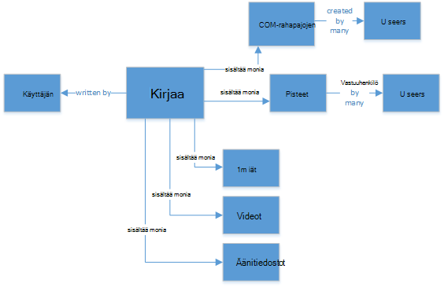
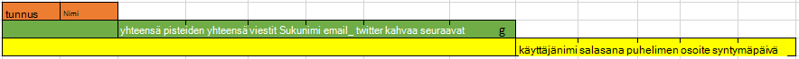
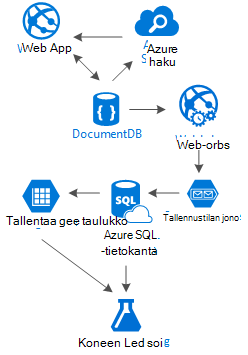

<properties 
    pageTitle="DocumentDB rakenne kuvio: Yhteisöpalvelut sovellusten | Microsoft Azure" 
    description="Tietoja rakenne kuvion sosiaalisten verkkojen hyödyntäminen tallennustilan joustavuutta DocumentDB ja muut Azure palvelut." 
    keywords="Yhteisöpalvelut sovellukset"
    services="documentdb" 
    authors="ealsur" 
    manager="jhubbard" 
    editor="" 
    documentationCenter=""/>

<tags 
    ms.service="documentdb" 
    ms.workload="data-services" 
    ms.tgt_pltfrm="na" 
    ms.devlang="na" 
    ms.topic="article" 
    ms.date="09/27/2016" 
    ms.author="mimig"/>

# Siirtyminen sosiaalisen DocumentDB kanssa

Erittäin toisiinsa society luonnonvaraisena tarkoittaa, että-elinkaaren vaiheessa sinusta tulee osa **sosiaalisen verkoston**. Käytämme yhteisöpalveluihin pitämään yhteyttä ystävien, työtovereita, perheen tai joskus Microsoftin aktiivisia henkilöitä jakamaan henkilöille, joilla on yhteinen kiinnostuksen kohteita.

Insinöörien tai kehittäjät on ehkä on miettinyt, miten näiden verkkojen Tallenna ja interconnect tietojamme, tai voi olla jopa on luovat luomiseen ja arkkitehti tietyn kapealla markkinoille uuden yhteisöpalvelun itsellesi. Milloin on suuri kysymys: miten tämä tieto on tallennettu?

Oletetaan, että olemme luomassa uutta ja sen yhteisöpalvelun, katsoa käyttäjien viestejä artikkeleita, joissa tietovälineestä, kuten kuvia, videoita ja jopa musiikkia. Käyttäjät voivat kommentoida viestit ja anna pisteet for luokitukset. Ole viesteistä, jonka käyttäjät näkevät syötteen voi ottaa yhteyttä tärkeimmät sivuston aloitussivu. Tämä ei kuulosta todella monimutkaisia (heti) mutta yksinkertaisuuden, japanin enää olemassa (emme voi delve kyselyjä mukautetun käyttäjän syötteiden vaikuttaa yhteydet, mutta se ylittää tavoitteena on tämän artikkelin).

Näkyy kuinka Microsoft tallentaa tämä ja missä?

Monia sinun on ehkä ole kokemusta SQL-tietokantoja tai on oltava vähintään käsite [Relaatio tietojen mallinnus](https://en.wikipedia.org/wiki/Relational_model) ja olet ehkä tietoja aloittaa piirtämisen seuraavankaltaiselta:

 

Täysin normitettu ja aika tietorakenne... joka ei skaalaudu. 

Et saa me virhe, joita Olen käyttänyt SQL-tietokantoja Oma aika, ne ovat todella käteviä, mutta jokaisen kuvio, harjoittelu ja ohjelmiston alustan, kuten ei ole sopivaa joka tapauksessa.

Miksei SQL paras valinta tässä skenaariossa? Katsotaan yhteen viestiin rakenteen voisi Näytä merkintään sivusto tai sovelluksen minulla on Tee kysely, joka sisältää. 8 taulukon liitokset (!) vain yhden yksittäisen Kirjaa nyt stream viestit, jotka dynaamisesti lataaminen ja näkyvän näytön ja saatat nähdä missä valitsen kuvan näyttämiseen.

Emme voi, käyttäminen humongous SQL-esiintymässä tarpeeksi power ratkaisemiseksi tuhansia kyselyjen nämä tukemaan Microsoftin sisältö, mutta todella, miksi haluat olemme kun yksinkertaisempi ratkaisua monet liitokset?

## NoSQL tien

Ei voi [suorittaa Azure](http://neo4j.com/developer/guide-cloud-deployment/#_windows_azure) määräten graph tietokantoja, mutta ne eivät ole edullinen ja IaaS palvelut edellyttävät (infrastruktuuri-muodossa--palvelun, näennäiskoneiden pääasiassa) ja ylläpitoa. Käytän pyritään alemman kustannukset-ratkaisuun, jotka toimivat tässä artikkelissa useimmissa skenaarioissa Azure's NoSQL tietokannan [DocumentDB](https://azure.microsoft.com/services/documentdb/)käytössä. Käyttämällä [NoSQL](https://en.wikipedia.org/wiki/NoSQL) lähestymistavan mukaan tietojen tallentaminen JSON-muodossa ja käyttämällä [denormalization](https://en.wikipedia.org/wiki/Denormalization), tutustu aiemmin monimutkaisia kirjaa voidaan muuntaa yhdeksi [asiakirjan](https://en.wikipedia.org/wiki/Document-oriented_database):

    {
        "id":"ew12-res2-234e-544f",
        "title":"post title",
        "date":"2016-01-01",
        "body":"this is an awesome post stored on NoSQL",
        "createdBy":User,
        "images":["http://myfirstimage.png","http://mysecondimage.png"],
        "videos":[
            {"url":"http://myfirstvideo.mp4", "title":"The first video"},
            {"url":"http://mysecondvideo.mp4", "title":"The second video"}
        ],
        "audios":[
            {"url":"http://myfirstaudio.mp3", "title":"The first audio"},
            {"url":"http://mysecondaudio.mp3", "title":"The second audio"}
        ]
    }

Ja sen voi saada yhden kyselyn avulla ja liitosten avulla ei ole. Tämä on paljon yksinkertainen ja selkeä ja budget-wise, se vaatii vähemmän resursseja tavoitteet paremmin tuloksen.

Azure DocumentDB varmistetaan, että kaikki ominaisuudet indeksoidaan sen avulla [automaattisen indeksoinnin](documentdb-indexing.md), jossa voit myös voi [mukauttaa](documentdb-indexing-policies.md). Rakenteen vapaa-menetelmän avulla us tiedostojen tallentaminen eri ja dynaaminen rakenteiden ehkäpä huomenna haluamme viestit haluat luokkien tai niihin liittyvät hashtags luettelon kanssa, DocumentDB käsittelee lisätty määritteet uusia asiakirjoja ei ole ylimääräisiä työlle vaatii us.

Kommenttien lisääminen viestiin voidaan käsitellä vain muut viestit ylemmän tason ominaisuus (Tämä yksinkertaistaa Microsoftin objektin määritys). 

    {
        "id":"1234-asd3-54ts-199a",
        "title":"Awesome post!",
        "date":"2016-01-02",
        "createdBy":User2,
        "parent":"ew12-res2-234e-544f"
    }

    {
        "id":"asd2-fee4-23gc-jh67",
        "title":"Ditto!",
        "date":"2016-01-03",
        "createdBy":User3,
        "parent":"ew12-res2-234e-544f"
    }

Ja sosiaalisen yhteydenpitoa voidaan tallentaa eri objektin laskureita:

    {
        "id":"dfe3-thf5-232s-dse4",
        "post":"ew12-res2-234e-544f",
        "comments":2,
        "likes":10,
        "points":200
    }

Syötteiden luomiseen on vain ohjeisiin ja tiedostoja, jotka voivat sisältää kirjaa tunnukset annetun asiayhteyden tilauksen luettelo:

    [
        {"relevance":9, "post":"ew12-res2-234e-544f"},
        {"relevance":8, "post":"fer7-mnb6-fgh9-2344"},
        {"relevance":7, "post":"w34r-qeg6-ref6-8565"}
    ]

Emme voi olla "uusimman" stream viesteillä vyöhykkeen luontipäivämäärän mukaan, kyseiset viesteillä kanssa "Upeimmat" stream tykkäykset Lisää viimeisen 24 tuntia, on myös Toteuta mukautettu stream kullekin käyttäjälle perusteella logiikan, kuten seuraajat ja kiinnostuksen kohteita ja olisi edelleen viestit luettelo. On tärkeää, miten voit luoda näihin luetteloihin, mutta lukeminen suorituskyvyn säilyy kattotukien. Kun olemme hankkia yksi näistä luetteloista, on annettava yhteen kyselyn DocumentDB avulla [IN-operaattori](documentdb-sql-query.md#where-clause) hankkiminen viestien sivujen kerrallaan.

Syötteen virtaa voivat luotu käyttäen [Azure App Services](https://azure.microsoft.com/services/app-service/) taustaprosessit: [Webjobs](../app-service-web/web-sites-create-web-jobs.md). Kun viestiin on luotu, taustakäsittely voi käynnistää käyttämällä [Azuren tallennustilaan](https://azure.microsoft.com/services/storage/) [olevien](../storage/storage-dotnet-how-to-use-queues.md) ja Webjobs saatu käyttämällä [Azure Webjobs SDK](../app-service-web/websites-dotnet-webjobs-sdk.md)-käyttöönoton kirjaa välittämisen sisällä virtaa oman mukautetun logiikan perusteella. 

Lykätty tavalla luominen tekstin yhdenmukaisia ympäristössä samaa menetelmää avulla voidaan käsitellä pistettä ja tykkäyksien viestin päälle.

Seuraajat ovat hankalampaa osan valitseminen. DocumentDB on 512 kt, tiedoston enimmäiskoko, joten voi ottaa huomioon seuraajat tallentaminen tiedostona tämän rakenteen:

    {
        "id":"234d-sd23-rrf2-552d",
        "followersOf": "dse4-qwe2-ert4-aad2",
        "followers":[
            "ewr5-232d-tyrg-iuo2",
            "qejh-2345-sdf1-ytg5",
            //...
            "uie0-4tyg-3456-rwjh"
        ]
    }

Tämä saattaa toimia käyttäjä, jolla on muutama tuhansia seuraajat, mutta jos jotkin MSN yhdistää Microsoftin järjestää arvot, tämä menetelmä on myöhemmin osumien asiakirjan koon pää.

Voit ratkaista tämän Käytämme eri tapaa. Käyttäjätilastot-tiedoston osaksi voi tallentaa seuraajat määrä:

    {
        "id":"234d-sd23-rrf2-552d",
        "user": "dse4-qwe2-ert4-aad2",
        "followers":55230,
        "totalPosts":452,
        "totalPoints":11342
    }

Ja seuraajat todellinen kaavio voi olla tallennettuna Azure-tallennustilan taulukoita avulla [tunniste](https://github.com/richorama/AzureStorageExtensions#azuregraphstore) , joka mahdollistaa yksinkertaisen "A-seuraavat-B" tallennusta ja hakua. Olemme delegoida noutopalvelun prosessin tarkka seuraajat luettelon (kun annettava se) Azure-tallennustilan taulukoihin, mutta nopeasti numerot hakukentälle näin olemme jatkaa DocumentDB.

## "Tikapuut" kuvio ja tietojen monistaminen

Kun olet ehkä jo huomannut, joka viittaa viestiin JSON asiakirjan, on käyttäjän useita kertoja. Ja sinun on arvata oikea-ja tämä tarkoittaa sitä, joka vastaa käyttäjän, tämä denormalization annetut tiedot voi olla käytössä useampi kuin yksi paikka.

Jotta nopeampaa kyselyjen maksamaan tietojen monistaminen. Tämä sivu-tehosteen ongelma on, että jotkin toiminnon käyttäjän tiedot muuttuvat, on ensin etsittävä kaikki tehtävät hän joskus asentaminen ja päivittää ne kaikki. Ei äänen hyvin käytännön, oikea?

Kaavion tietokantojen ratkaista omia tavalla, ratkaise tunnistamalla käyttäjä, jolla on Näytä tämän sovelluksen tehtävätyypin avain määritteiden tarkastellaan. Jos viestiin näyttäminen tämän sovelluksen visuaalisesti vaan Näytä vain laatijan nimi ja kuva, miksi tallentaa kaikki käyttäjän tiedot "createdBy"-määritteen? Jos jokaisen kommentin olemme näyttäminen vain käyttäjän kuvan, emme tarvitse loput hänen tiedot. Jos järjestelmässä soitan "tikapuut kuvion" tulee toista on.

Voit esimerkiksi käyttäjätiedot:

    {
        "id":"dse4-qwe2-ert4-aad2",
        "name":"John",
        "surname":"Doe",
        "address":"742 Evergreen Terrace",
        "birthday":"1983-05-07",
        "email":"john@doe.com",
        "twitterHandle":"@john",
        "username":"johndoe",
        "password":"some_encrypted_phrase",
        "totalPoints":100,
        "totalPosts":24
    }
    
Katsomalla nämä tiedot emme voi nopeasti tunnistaa eli tärkeitä tietoja ja joka ei ole, luot "Tikapuut":

Pienin vaihe kutsutaan UserChunk mahdollisimman vähän erilaisia tietoja, joka määrittää käyttäjän ja niitä käytetään tietojen kopioinnista. Vähentämällä "kerromme" tietoja kaksoiskappaleet tietojen koon pienentäminen vahinkojen valtaviin päivitykset.

Keskimmäinen vaihe kutsutaan käyttäjän, ja se on koko, jota käytetään useimmissa suorituskyvyn riippuva kyselyjä DocumentDB useimmin käytetyt ja tärkeät tiedot. Se sisältää UserChunk liittyviä tietoja.

Suurin on laajennettu käyttäjä. Se sisältää kaikki tärkeät käyttäjätietoja sekä muita tietoja, joka ei edellytä avaaminen luettavaksi nopeasti tai sen käyttö on potentiaalisen (kuten kirjautumisen). Nämä tiedot voidaan tallentaa DocumentDB Azure SQL-tietokanta tai Azure-tallennustilan taulukoissa ulkopuolella.

Miksi syy jakaa käyttäjän ja jopa tallentaa tiedot eri paikoissa? Koska DocumentDB tallennustila ei [ole äärettömän](documentdb-limits.md) ja myös suorituskykyä valitsemalla Näytä, suurempi asiakirjat, costlier kyselyt. Pidät tiedostot slim tee kaikkien suorituskyvyn riippuva sosiaalisen verkon, kyselyjen ja muiden potentiaalisen skenaarioissa, kuten koko profiilin muokkaukset-kirjautumiset ylimääräisten tietojen tallentamista varten, jopa mahdollisista käyttöanalyysin ja Big datasta hankkeita heti ajantasainen tieto. Microsoft ei varoen todella Jos keräämistä varten mahdollisista tiedot ovat hitaammin, koska se on käynnissä Azure SQL-tietokanta, emme ole koskevat kuitenkin, että käyttäjien on nopea ja slim käyttökokemuksen. Käyttäjä, tallennetun DocumentDB, näyttää tältä:

    {
        "id":"dse4-qwe2-ert4-aad2",
        "name":"John",
        "surname":"Doe",
        "username":"johndoe"
        "email":"john@doe.com",
        "twitterHandle":"@john"
    }

Ja viestiin näyttää:

    {
        "id":"1234-asd3-54ts-199a",
        "title":"Awesome post!",
        "date":"2016-01-02",
        "createdBy":{
            "id":"dse4-qwe2-ert4-aad2",
            "username":"johndoe"
        }
    }

Ja muokkauksen syntyy, jossa yksi lohko määritteiden muuttuu, kun se on helppo tarvittavien asiakirjojen etsiminen käyttämällä kyselyjä, jotka viittaavat indeksoidut määritteet (Valitse * FROM kirjaa p WHERE p.createdBy.id == "edited_user_id") ja sitten päivittämällä näkyvissä.

## Etsi-ruutuun

Käyttäjien Luo Kaikeksi, paljon sisältöä. Olemme pitäisi voivat hakea ja löytää sisällön, jossa ei ole ehkä suoraan niiden sisällön virtaa ehkä koska olemme ei toimi laatijat ja ehkä on vain yrität löytää, että vanha viestiin on ollut 6 kuukautta.

Thankfully ja Azure DocumentDB on käytössä, koska olemme helposti toteuttaa hakukone [Azure Etsi](https://azure.microsoft.com/services/search/) käyttäminen muutaman minuutin ja kirjoittamatta yksirivinen koodin (muut kuin selvästi, Etsi prosessi ja Käyttöliittymän).

Miksi tämä on helppoa?

Azure haun toteuttaa Soita, mitä ne [Indeksoijilla](https://msdn.microsoft.com/library/azure/dn946891.aspx), taustaprosessit, liitä tiedot säilöjen-tietoihin ja automagically lisääminen, päivittäminen ja poistaminen objektit indeksit. Ne tukevat [Azure SQL-tietokanta Indeksoijilla](https://blogs.msdn.microsoft.com/kaevans/2015/03/06/indexing-azure-sql-database-with-azure-search/), [Azure-BLOB Indeksoijilla](../search/search-howto-indexing-azure-blob-storage.md) ja thankfully, [Azure DocumentDB Indeksoijilla](../documentdb/documentdb-search-indexer.md). Siirtymän DocumentDB Azure Etsi tiedoista on yksinkertaista, sekä kaupan tietoja JSON-muodossa, vain annettava Luo [indeksi](../search/search-create-index-portal.md) ja kartan, mitkä attribuutit Microsoftin asiakirjoista haluamme indeksoitu, joka ei sen nopeasti (vaihtelee tietojamme koon), tutustu sisältö tulee saataville haetaan, paras-muodossa--hakupalvelun-ratkaisun pilvi-infrastruktuuria. 

Lisätietoja Azure haun pääset käsiksi [Hitchhiker's Guide to haku](https://blogs.msdn.microsoft.com/mvpawardprogram/2016/02/02/a-hitchhikers-guide-to-search/).

## Pohjana olevat tiedot

Kun kaikki tämän sisällön, joka kasvaa ja kasvaa päivittäin tallentamista emme voi olla molemmista suunnittelemassa: Mitä voin tehdä kaikki vuosta tietojen kanssa oma käyttäjiltä?

Vastaus on helppoa: sijoita se toimi ja se oppiminen.

Mutta mikä on tietoja? Muutama helposti esimerkkejä [markkinatunnelma analysis](https://en.wikipedia.org/wiki/Sentiment_analysis)-sisällön suositukset, jotka perustuvat käyttäjän asetukset tai jopa automaattinen sisällön valvojan, jonka avulla varmistetaan, että koko sisällön julkaisemat sekä sosiaalisen verkoston on turvallista perheen.

Nyt kun sain voit taustapuolen, todennäköisesti Ajattele on joitakin PhotoDraw'n matemaattiset tiede-Pura näiden kuvioiden ja tietojen yksinkertainen tietokantojen ja tiedostojen ulos, mutta sinun on väärä.

[Azure koneen Learning](https://azure.microsoft.com/services/machine-learning/), [Cortana liiketoimintatietojen Suite](https://www.microsoft.com/en/server-cloud/cortana-analytics-suite/overview.aspx)osa on täysin hallitun pilvipalvelussa, jolla voit luoda työnkulut käyttämällä yksinkertaista vedä ja pudota-käyttöliittymän algoritmit koodin oman algoritmit [R](https://en.wikipedia.org/wiki/R_(programming_language)) tai Käytä valmiiksi määritettyjä ja haluat käyttää ohjelmointirajapinnan kuten: [Tekstin Analytics](https://gallery.cortanaanalytics.com/MachineLearningAPI/Text-Analytics-2), [Sisällön valvojan](https://www.microsoft.com/moderator) tai [suosituksia](https://gallery.cortanaanalytics.com/MachineLearningAPI/Recommendations-2).

Tavoitteet jokin seuraavista tilanteista koneen Learning syy ingest eri lähteistä peräisin olevat tiedot [Azure tietojen järvi](https://azure.microsoft.com/services/data-lake-store/) avulla ja [U-SQL](https://azure.microsoft.com/documentation/videos/data-lake-u-sql-query-execution/) avulla voit käsitellä tietoja ja luo tulosteen, joka voi käsitellä Azure koneen Learning.

Käytettävissä olevat toinen vaihtoehto on [Kognitiiviset Microsoft-palveluiden](https://www.microsoft.com/cognitive-services) avulla voit analysoida käyttäjät Tutustu sisältöä; paitsi voit Ymmärrämme ne paremmin (– analysoinnin he kirjoittavat [tekstin Analytics](https://www.microsoft.com/cognitive-services/en-us/text-analytics-api)API), mutta emme voi tunnistaa tarpeettomat tai kehittynyt sisältö ja toimia vastaavasti [Tietokoneen näkö Ohjelmointirajapinnan](https://www.microsoft.com/cognitive-services/en-us/computer-vision-api)kanssa. Kognitiiviset palveluja ovat ulos,-valmiilla ratkaisuja, jotka eivät tarvitse mitä tahansa tietokoneen Learning tietämyksen käyttämään useita.

## Tekemistä

Tässä artikkelissa yrittää kansalaisia joitakin kyselyjä vaihtoehtoja luominen yhteisöpalveluihin kokonaan Azure-edullinen Services ja antamisen hyviä tuloksia nimeltä "Tikapuut" Monikerroksinen tallennustilan ratkaisu ja tietojen jakauman käyttöä.

Totuusversiona on, että ei ole hopea luettelomerkin tämäntyyppisten skenaariot, se on hyvä palveluja, jotka mahdollistavat us luonnissa hyvien kokemukset yhdistelmä luoma synergia: nopeuden ja Azure DocumentDB antamaan hyvien sosiaalisen sovelluksen, liiketoimintatietojen takana pääosin hakuratkaisun Azure haku, kuten luvun Azure App Services isäntään joustavuutta ei edes kielen ympäristöstä riippumattomalla tavalla sovellusten mutta tehokkaita taustaprosessit ja laajennettava Azure-tallennustilan ja Azure SQL-tietokantaan varten tallentaminen mahdutettavia tietoja ja Azure koneen Learning analyyttisten power knowledge ja intelligence, jotka voivat antaa palautetta Microsoftin prosesseja ja ohjeita us pitää oikean sisällön oikeat käyttäjät.

## Seuraavat vaiheet

Lisätietoja tietomallien lukemalla artikkelin [DocumentDB tietojen mallinnus](documentdb-modeling-data.md) . Jos haluat muuttaa käytössä muissa tapauksissa DocumentDB, katso [yleisiä DocumentDB käyttötapauksiin](documentdb-use-cases.md).

Tai saada lisätietoja DocumentDB seuraamalla [DocumentDB Oppimispolku](https://azure.microsoft.com/documentation/learning-paths/documentdb/).
