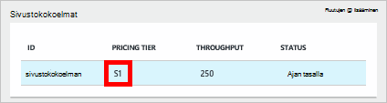
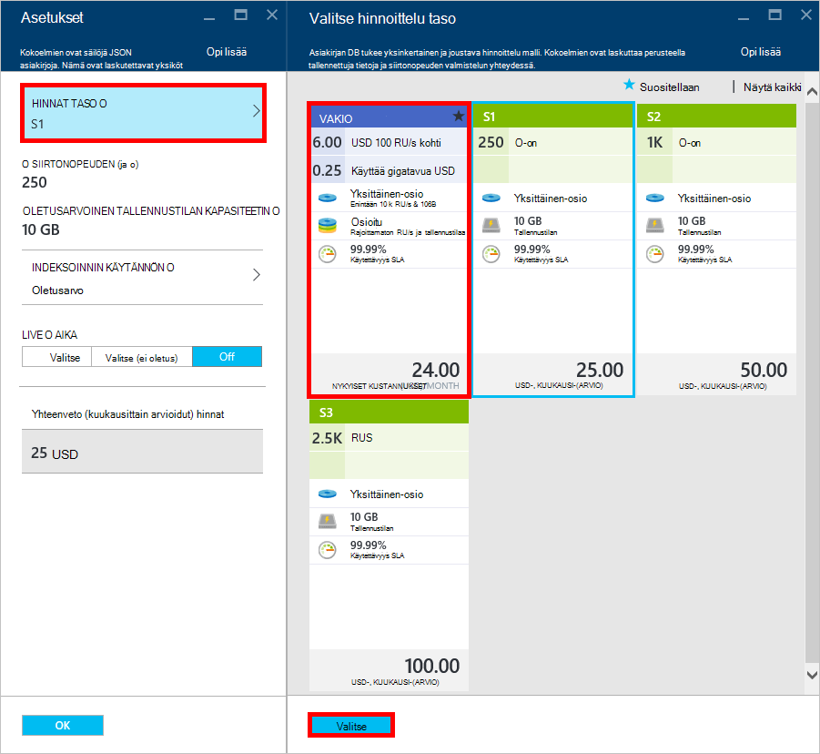
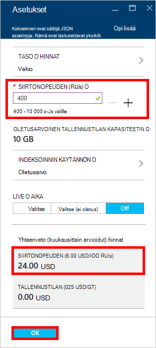
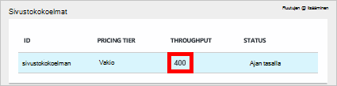

<properties 
    pageTitle="Supercharge DocumentDB S1 tilisi | Microsoft Azure" 
    description="Voit hyödyntää parantavat siirtonopeuden DocumentDB S1 tilisi tekemällä joitakin yksinkertaisia muutoksia Azure-portaalissa." 
    services="documentdb" 
    authors="mimig1" 
    manager="jhubbard" 
    editor="monicar" 
    documentationCenter=""/>

<tags 
    ms.service="documentdb" 
    ms.workload="data-services" 
    ms.tgt_pltfrm="na" 
    ms.devlang="na" 
    ms.topic="article" 
    ms.date="08/25/2016" 
    ms.author="mimig"/>

# Supercharge DocumentDB-tili

Parannettu siirtonopeuden Azure DocumentDB S1 tilin hyödyntää seuraavasti. Turhaan ilman lisäkustannuksia voit suurentaa siirtonopeuden aiemmin S1-tilisi 250 [RU/s](documentdb-request-units.md) 400 RU/s tai Lisää!  

> [AZURE.VIDEO changedocumentdbcollectionperformance]

## Vaihda käyttäjän määrittämä suorituskyvyn Azure-portaalissa

1. Siirry [**Azure portal**](https://portal.azure.com)selaimessa. 
2. Valitse **Selaa** -> **DocumentDB (NoSQL)**ja valitse sitten DocumentDB-tili, jota haluat muokata.   
3. **Tietokantojen** lensissä Valitse muokattava tietokanta ja valitse **tietokanta** -sivu S1 hinnoittelu tason kokoelmaan.

      

4. **Sivustokokoelman** , sivu-Valitse **Lisää**ja valitse sitten **asetukset**.   
5. Valitse **asetukset** -sivu **Hinnat taso** ja Huomaa, että kunkin suunnitelman kuukausittain kustannukset arvio näkyy. Valitse **Valitse hinnoittelu taso** -sivu **Vakio**ja valitse sitten Tallenna muutokset **valitsemalla** .

      

6. **Asetukset** -sivu kohdassa **Hinnat taso** muutetaan **Vakio** ja **siirtonopeuden (RU/s)** -ruudussa näkyy oletusarvo on 400. Valitse **OK** , Tallenna muutokset. 

    > [AZURE.NOTE] Voit määrittää nopeus välillä 400 – 10 000 [yksikköä pyytää](../articles/documentdb/documentdb-request-units.md)/second (RU/s). **Hinnat yhteenveto** sivun alareunassa päivittyy automaattisesti antamaan arvio kuukausihinta.
    
    

8. Voit tarkistaa ahdetut siirtonopeuden kokoelman takaisin käyttöön **tietokanta** -sivu. 

    

Lisätietoja käyttäjän määrittämien ja ennalta määritettyjä liittyvät muutokset blogimerkinnässä [DocumentDB: kaikki tiedot on hyvä tietää käyttämisestä uuden hinnoittelu asetukset](https://azure.microsoft.com/blog/documentdb-use-the-new-pricing-options-on-your-existing-collections/).

## Seuraavat vaiheet

Jos päätät, että sinun on enemmän siirtonopeuden (yli 10 000 RU/s) tai lisää tallennustilaa (suurempi kuin 10 Gigatavua) voit luoda osioitua sivustokokoelman. Osioitu sivustokokoelman-kohdassa [luominen kokoelma](documentdb-create-collection.md).