<properties
    pageTitle="DocumentDB asiakirjan Explorer, voit tarkastella JSON | Microsoft Azure"
    description="Lisätietoja DocumentDB asiakirjan Explorer Azure Portal-työkalun JSON tarkasteleminen, muokkaaminen, luominen ja DocumentDB, NoSQL asiakirjan tietokannan JSON tiedostojen lataaminen."
        keywords="Näytä json"
    services="documentdb"
    authors="kirillg"
    manager="jhubbard"
    editor="monicar"
    documentationCenter=""/>

<tags
    ms.service="documentdb"
    ms.workload="data-services"
    ms.tgt_pltfrm="na"
    ms.devlang="na"
    ms.topic="article"
    ms.date="08/30/2016"
    ms.author="kirillg"/>

# Tarkasteleminen, muokkaaminen, luominen ja DocumentDB asiakirjan Resurssienhallinnassa JSON tiedostojen lataaminen

Tässä artikkelissa on yleiskatsaus [Microsoft Azure DocumentDB](https://azure.microsoft.com/services/documentdb/) asiakirjan Explorer Azure portaalin työkalua, joka mahdollistaa tarkasteleminen, muokkaaminen, luominen, lataa ja suodattaa DocumentDB JSON-asiakirjoja. 

Huomaa asiakirjan Explorer ei ole otettu käyttöön DocumentDB tili ja MongoDB protokollatuki. Tämä sivu päivitetään, kun tämä ominaisuus on käytössä.

## Käynnistä asiakirjan Resurssienhallinnassa

1. Valitse Azure-portaalissa Jumpbar, **DocumentDB (NoSQL)**. Jos **DocumentDB (NoSQL)** ei ole näkyvissä, valitse **Lisää palveluja** ja valitse sitten **DocumentDB (NoSQL)**.

2. Valitse tilin nimi. 

3. Valitse resurssi-valikossa **Asiakirja Explorer**. 
 
    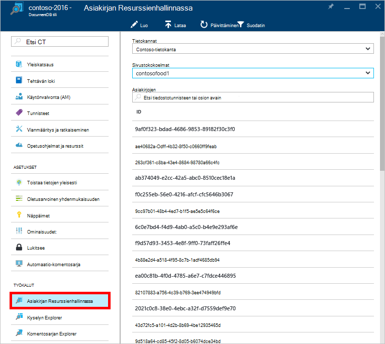

    **Asiakirjan Explorer** -sivu- **tietokantojen** ja **kokoelmien** avattavien luetteloiden valmiiksi kaikille jossa käynnistetty asiakirjan Explorer tilanteen mukaan. 

## Asiakirjan luominen

1. [Käynnistä asiakirjan Explorer](#launch-document-explorer).

2. Valitse **Luo tiedosto** **Asiakirjan Explorer** -sivu. 

    Mahdollisimman vähän JSON koodikatkelman annetaan **asiakirjan** -sivu.

    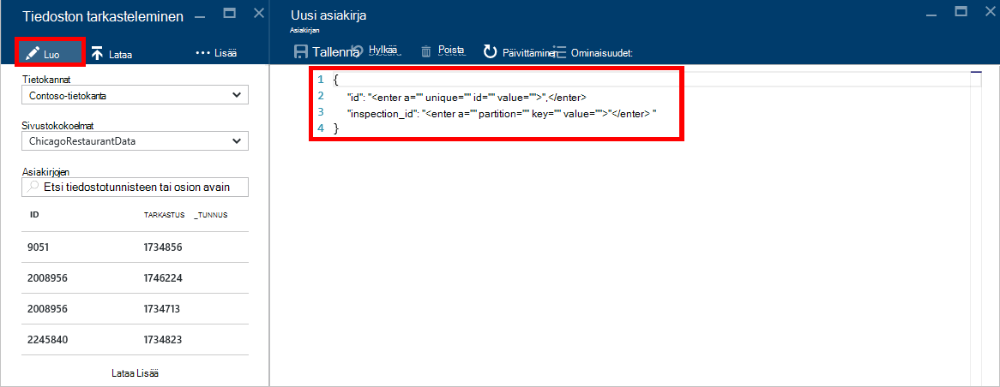

2. Kirjoita **asiakirjan** -sivu tai liitä, joille haluat luoda JSON asiakirjan sisällön ja valitse Vahvista tietokanta ja **Asiakirjan Explorer** -sivu on määritetty asiakirjan **tallentaminen** .

    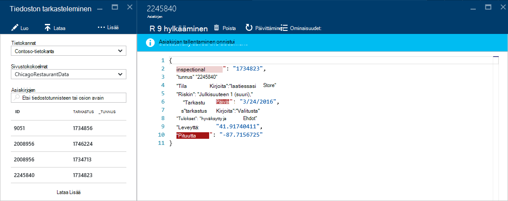

    > [AZURE.NOTE] Jos et anna ""-Tunnusominaisuutta, valitse asiakirjan Explorer lisää automaattisesti id-ominaisuus ja luo tunnus arvona GUID-tunnus.

    Jos sinulla on jo tietoja JSON tiedostoja, MongoDB, SQL Server, CSV-tiedostoja ja tallennustilaa, Amazon DynamoDB, HBase, Azure-taulukosta tai DocumentDB muista peräisin, voit käyttää DocumentDB käyttäjän [tietojen siirtotyökalun](documentdb-import-data.md) tuomaan tietoja nopeasti.

## Asiakirjan muokkaaminen

1. [Käynnistä asiakirjan Explorer](#launch-document-explorer).

2. Jos haluat muokata aiemmin luodun tiedoston, valitse **Asiakirjan Explorer** -sivu, muokkaamista **asiakirjan** -sivu ja valitse sitten **Tallenna**.

    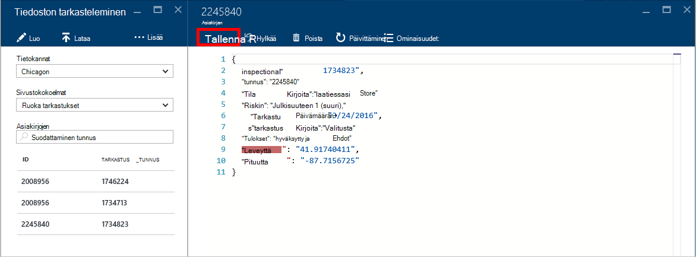

    Jos olet muokkaamassa asiakirjaa, ja päätät, että haluat hylätä muutokset parhaillaan seuraamasi, riittää, että Valitse **Hylkää** **asiakirjan** sivu-Vahvista Hylkää ja asiakirjan tilaan ladataan.

    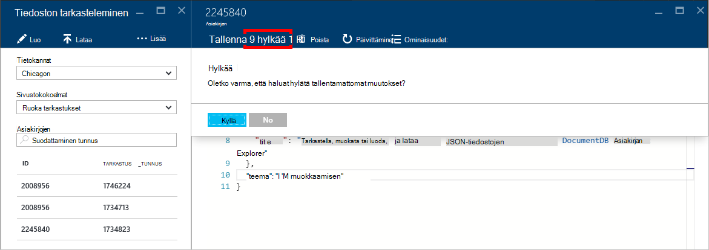

## Tiedoston poistaminen

1. [Käynnistä asiakirjan Explorer](#launch-document-explorer).

2. Valitse **Asiakirjan Explorerin**tiedosto, valitse **Poista**ja vahvista poisto. Vahvistamisen, jälkeen asiakirjan poistetaan heti asiakirjan Explorer-luettelosta.

    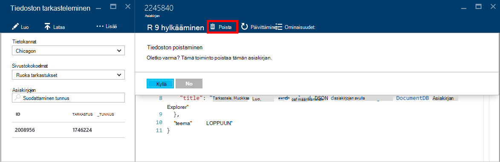

## JSON-asiakirjojen käsitteleminen

Asiakirjan Explorer tarkistaa, että kaikki uusi tai muokattu asiakirja sisältää kelvollinen JSON.  Voit myös Näytä JSON virheet osoittamalla virheellinen kohta kelpoisuustarkistusvirhe tietoja.

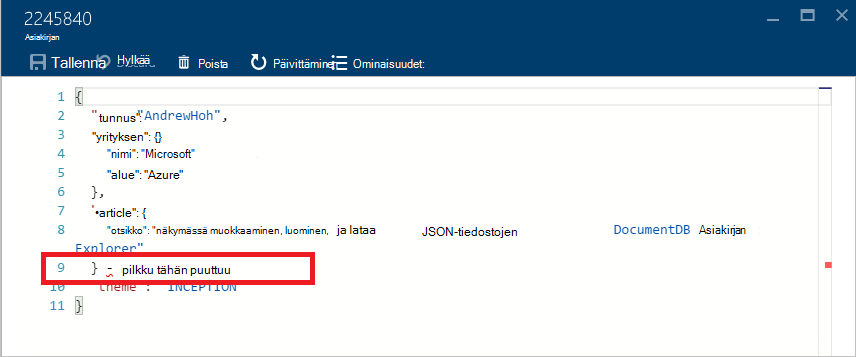

Asiakirjan Explorer estää lisäksi asiakirjan tallentaminen virheellinen JSON sisältöä.

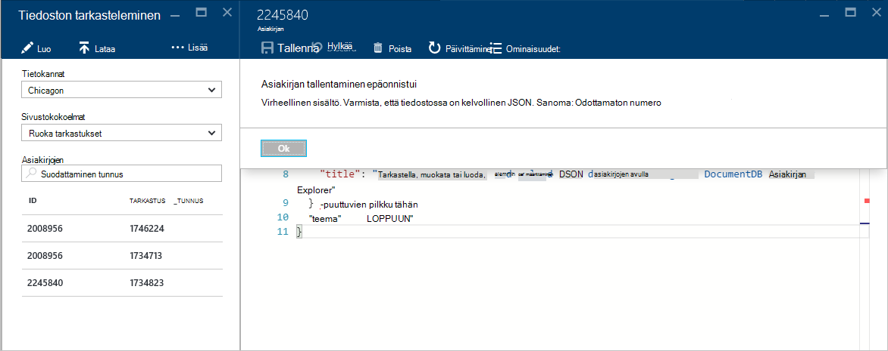

Lopuksi asiakirjan Explorer avulla voit helposti tarkastella ladatut asiakirjan järjestelmän ominaisuudet valitsemalla **Ominaisuudet** -komennon.

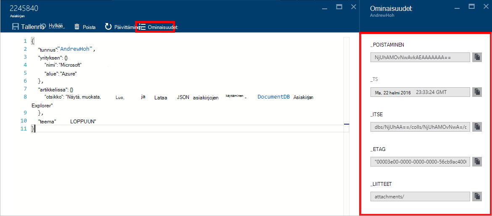

> [AZURE.NOTE] Aikaleima (_ts)-ominaisuuden sisäisesti esitetään lukuna kausi aikaa, mutta asiakirjan Explorer näyttää arvon ihmisten GMT luettavassa muodossa.

## Suodatin-asiakirjat
Asiakirjan Explorer tukee useita Siirtymisasetukset ja Lisäasetukset.

Oletusarvoisesti asiakirjan Explorer lataa valitun sivustokokoelman niiden luontipäivämäärän vanhimmasta uusimpaan mukaan ensimmäiset 100 tiedostoissa.  Voit ladata muita tiedostoja (erissä 100) valitsemalla **Lataa Lisää** vaihtoehdon alareunassa olevan tiedoston Explorer-sivu. Voit valita, mitä tiedostoja lataamaan kautta **Suodata** -komento.

1. [Käynnistä asiakirjan Explorer](#launch-document-explorer).

2. Valitse **Suodata**yläreunassa olevalla **Asiakirjan Explorer** -sivu.  

    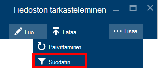
  
3.  Komento-palkin alapuolella näkyy suodatusasetukset. Suodatin-asetuksissa antaa WHERE-lauseen ja/tai ORDER BY-lause ja valitse sitten **Suodatin**.

    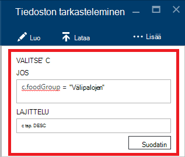

    Asiakirjan Explorer päivittyvät automaattisesti tiedostoissa, jotka vastaavat suodatuskyselyn tulokset. Lue lisätietoja [SQL-kysely ja SQL-syntaksi](documentdb-sql-query.md) DocumentDB SQL-kieliopin artikkeli tai kopion [SQL-kyselyn cheat taulukon](documentdb-sql-query-cheat-sheet.md)tulostaminen.

    **Tietokannan** ja **sivustokokoelman** -ruutuihin avattavan luettelon avulla voidaan muuttaa helposti sivustokokoelman, josta tiedostot ovat tällä hetkellä tarkastelun eikä sinun tarvitse Sulje ja Käynnistä uudelleen asiakirjan Explorer.  

    Asiakirjan Explorer tukee myös ladatut Asiakirjajoukon suodattaminen niiden id-ominaisuutta.  Kirjoita tiedostojen suodattamalla tunnus-ruutuun.

    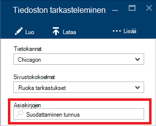

    Luettelo on suodatettu asiakirjan Explorerissa tulokset perusteella annetut ehdot.

    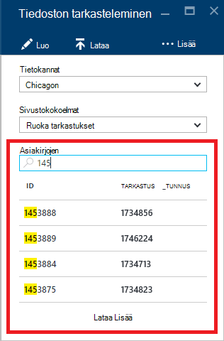

    > [AZURE.IMPORTANT] Asiakirjan Explorer suodattimen toiminnot vain suodattimet ***tällä hetkellä*** ladata useita asiakirjajoukon, ja suorita kysely valitun sivustokokoelman.

4. Päivittämiseen ladata asiakirjan Explorer asiakirjojen luettelo valitsemalla **Päivitä** yläreunaan sivu.

    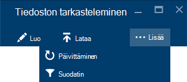

## Tiedostojen lisääminen joukkona

Asiakirjan Explorer tukee joukkona nieltynä vähintään yhden olemassa olevan JSON-asiakirjojen enintään 100 JSON-tiedoston lataaminen-toimintoa kohden.  

1. [Käynnistä asiakirjan Explorer](#launch-document-explorer).

2. Aloita lataus valitsemalla **Lataa tiedosto**.

    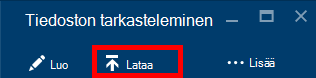

    **Lataa asiakirja** -sivu avautuu. 

2. Valitse Selaa-painiketta ja avaa Resurssienhallinta-ikkunassa, valitse vähintään yksi JSON tiedostojen lataaminen ja valitse sitten **Avaa**.

    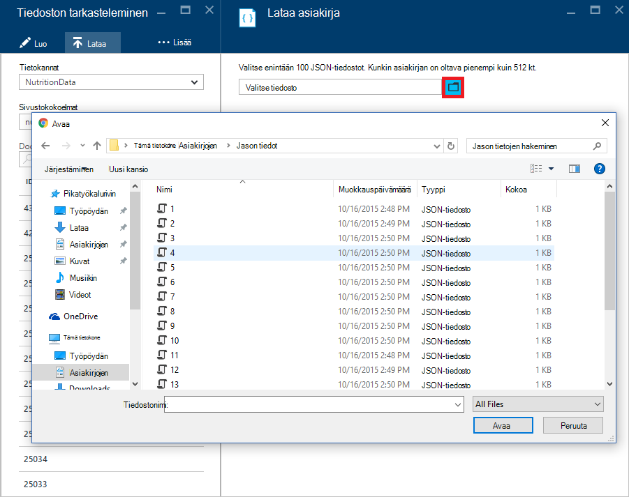

    > [AZURE.NOTE] Asiakirjan Explorer tukee tällä hetkellä enintään 100 JSON asiakirjojen yksittäisiä Lataa toimintoa kohden.

3. Kun olet tehnyt valinnan, napsauta **Lataa** -painiketta.  Tiedostot lisätään automaattisesti asiakirjan Explorer ruudukon ja lataa tulokset näkyvät toiminnon edetessä. Yksittäisiä tiedostoja raportoidaan tuonti epäonnistuu.

    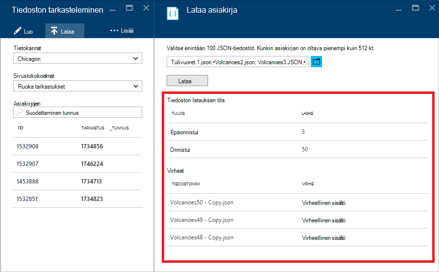

4. Kun toiminto on valmis, voit valita ylöspäin toiseen 100 tiedostojen lataaminen.

## Portaalin ulkopuolella JSON-asiakirjojen käsitteleminen

Asiakirjan Explorer Azure-portaalissa on vain yksi tapa tiedostojen käyttö DocumentDB. Voit käsitellä asiakirjoja [REST API](https://msdn.microsoft.com/library/azure/mt489082.aspx) tai [asiakkaan SDK: T](documentdb-sdk-dotnet.md). Esimerkiksi koodi, näet [.NET SDK asiakirjan esimerkkejä](documentdb-dotnet-samples.md#document-examples) ja [Node.js SDK asiakirjan esimerkkejä](documentdb-nodejs-samples.md#document-examples).

Jos haluat tuoda tai tiedostojen siirtäminen toisesta lähteestä (JSON, MongoDB, SQL Server, CSV tiedostoista, Azure-taulukosta tallennustilaa, Amazon DynamoDB, tai HBase), voit tuoda tiedot nopeasti DocumentDB DocumentDB [tietojen siirtotyökalua käytetään](documentdb-import-data.md) .

## Vianmääritys

**Ongelma**: asiakirjan Explorer palauttaa **asiakirjoja ei löydy**.

**Ratkaisu**: Varmista, että olet valinnut oikean tilauksen, tietokanta ja sivustokokoelman, johon tiedostot on lisätty. Tarkista myös varmistaa, että käyttämälläsi siirtonopeuden kiintiöiden. Jos käyttämälläsi osoitteessa suurin nopeus tason ja hakeminen-rajoittanut alemman toimimaan kokoelman suurin nopeus-kiintiön sovellusten käyttö.

**Selitys**: portaali on jokin sovellus, esimerkiksi mihin tahansa muuhun, puheluiden soittamiseen DocumentDB tietokannan ja sivustokokoelman. Jos pyyntöjen ovat tällä hetkellä ole rajoittanut vuoksi kutsujen erillisessä sovelluksesta, portaalin voi myös on rajoittanut, aiheuttaa resursseja ei näy portaalissa. Voit ratkaista ongelman ottamalla suuren siirtonopeuden käyttö syy osoite ja päivitä sitten portaalin sivu. Tietoja siitä, miten mitataan ja pienempi siirtonopeuden käyttö löytyy [suorituskykyyn liittyviä vihjeitä](documentdb-performance-tips.md) artikkelin [nopeus](documentdb-performance-tips.md#throughput) -kohdan.

## Seuraavat vaiheet

Lisätietoja DocumentDB SQL-kieliopin tueta asiakirjan Explorerissa, on artikkelissa [SQL-kysely ja SQL-syntaksi](documentdb-sql-query.md) tai tulostaa [SQL-kyselyn cheat taulukko](documentdb-sql-query-cheat-sheet.md).

[Oppimispolku](https://azure.microsoft.com/documentation/learning-paths/documentdb/) on myös hyötyä opastaa, kun opit Lisää DocumentDB. 
