<properties
    pageTitle="DocumentDB komentosarjan Resurssienhallinnassa, JavaScript-editorin | Microsoft Azure"
    description="Lisätietoja DocumentDB komentosarjan Explorer Azure Portal-työkalu DocumentDB palvelinpuolen ohjelmoinnin palvelutiedot esimerkiksi tallennettujen toimintosarjojen käynnistimien ja käyttäjän määrittämien funktioiden hallinta."
    keywords="JavaScript-editori"
    services="documentdb"
    authors="kirillg"
    manager="jhubbard"
    editor="monicar"
    documentationCenter=""/>

<tags
    ms.service="documentdb"
    ms.workload="data-services"
    ms.tgt_pltfrm="na"
    ms.devlang="na"
    ms.topic="article"
    ms.date="08/30/2016"
    ms.author="kirillg"/>

# Luominen ja suorittaminen tallennettujen toimintosarjojen, käynnistimien ja käyttäjän määrittämien funktioiden DocumentDB komentosarjan Resurssienhallinnassa

Tässä artikkelissa on yleiskatsaus Explorer [Microsoft Azure DocumentDB](https://azure.microsoft.com/services/documentdb/) komentosarja, joka on JavaScript-editori, jonka avulla voit tarkastella ja suorittaa DocumentDB palvelinpuolen ohjelmoinnin palvelutiedot esimerkiksi tallennettujen toimintosarjojen ja käyttäjän määrittämien funktioiden käynnistimien Azure-portaalissa. Lue lisätietoja DocumentDB palvelinpuolen ohjelmoinnin [tallennettu toimintosarja, tietokannan käynnistimien ja UDF](documentdb-programming.md) -artikkelissa.

## Käynnistä komentosarjan Explorer

1. Valitse Azure-portaalissa Jumpbar, **DocumentDB (NoSQL)**. Jos **DocumentDB tilejä** ei ole näkyvissä, valitse **Lisää palveluja** ja valitse sitten **DocumentDB (NoSQL)**.

2. Valitse **Komentosarja Explorer**resurssit-valikossa.

    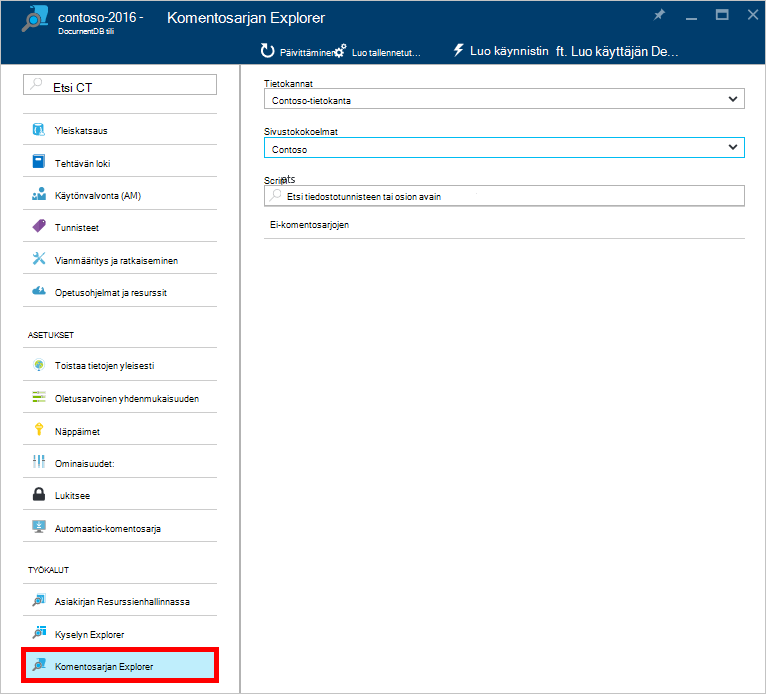
 
    **Tietokannan** ja **sivustokokoelman** avattavan luettelon valmiiksi ruutuihin missä käynnistät komentosarjan Explorer tilanteen mukaan.  Esimerkiksi jos käynnistät-tietokanta-sivu, valitse nykyinen tietokanta on valmiiksi.  Jos voit käynnistää sivustokokoelman sivu-kokoelman on valmiiksi.

4.  **Tietokannan** ja **sivustokokoelman** avattavan luettelon-ruutuihin avulla voit helposti muuttaa sivustokokoelman, josta komentosarjat ovat tällä hetkellä tarkastelun eikä sinun tarvitse Sulje ja Käynnistä uudelleen komentosarjan Explorer.  

5. Komentosarjan Explorer tukee myös komentosarjojen ladatut joukko suodattaminen niiden id-ominaisuutta.  Kirjoittaa Suodatin-kenttään ja tulokset komentosarjan Explorer-luettelossa on suodatettu mukaan annetut ehdot.

    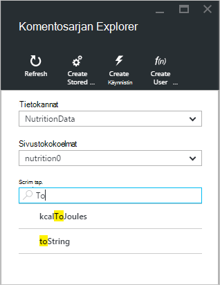

    > [AZURE.IMPORTANT] Komentosarjan Explorer suodattaa toiminnot vain suodattimet olevasta ***tällä hetkellä*** ladata komentosarjoja ja ei päivity automaattisesti valittuna sivustokokoelman.

5. Päivittämiseen komentosarjan Explorer ladata komentosarjoja luettelo valitsemalla **Päivitä** -komento yläreunaan sivu.

    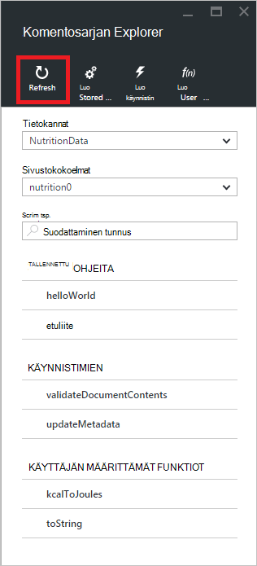

## Luoda, tarkastella ja muokata tallennettujen toimintosarjojen, käynnistimien ja käyttäjän määrittämät funktiot

Komentosarjan Explorer avulla voit suorittaa helposti DocumentDB palvelinpuolen ohjelmoinnin palvelutiedot CRUD-toimintoja.  

- Voit luoda komentosarjan, yksinkertaisesti valitsemalla käytettävissä luoda komentosarjan explorer-komennosta, tunnus, kirjoita komentosarja sisällön, ja sitten **Tallenna**.

    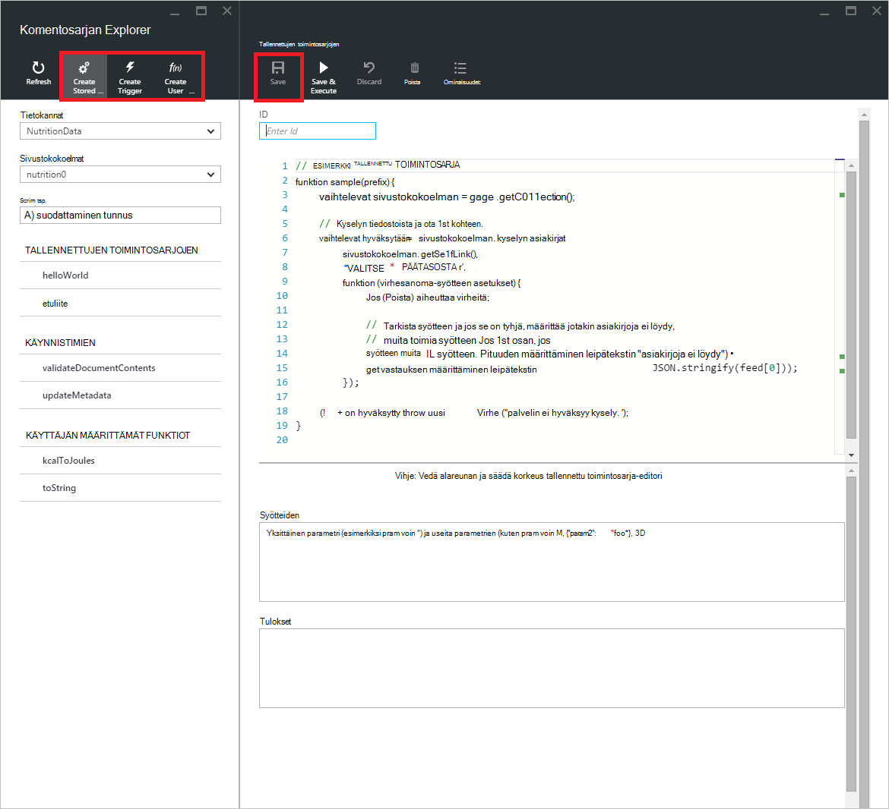

- Käynnistimen luotaessa määritettävä myös käynnistimen tyyppi ja liipaisin toiminto

    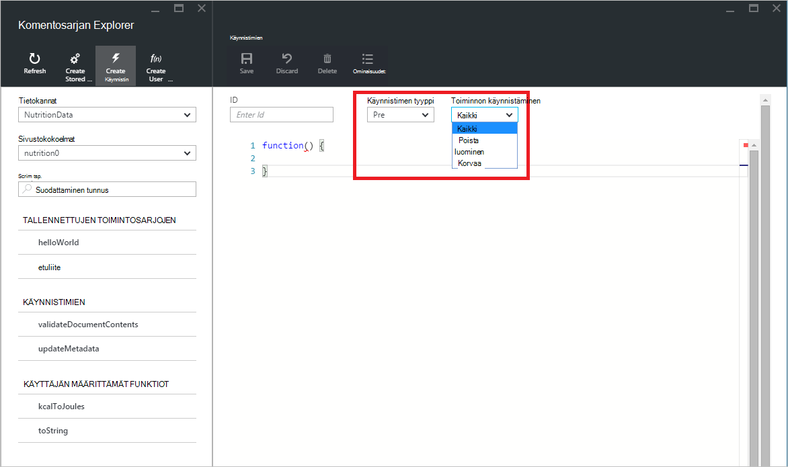

- Voit tarkastella komentosarjan, valitsemalla komentosarjan, jonka haluat muuttaa.

    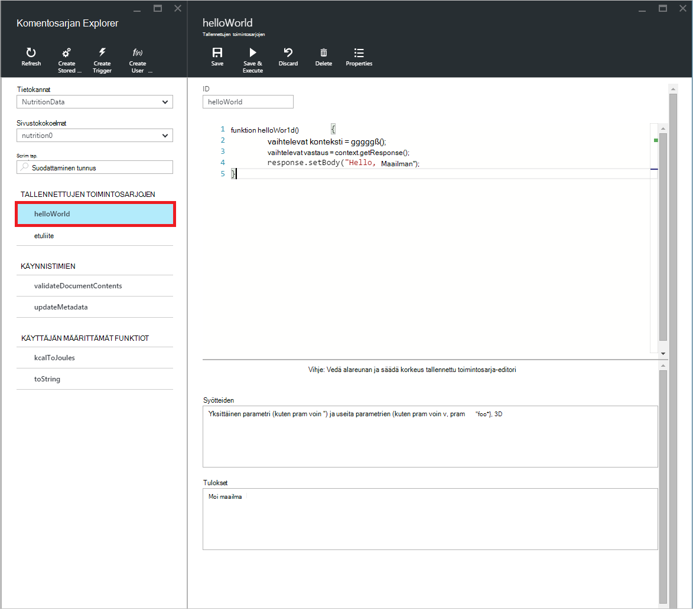

- Jos haluat muokata komentosarjan, yksinkertaisesti Tee haluamasi muutokset JavaScript-koodia editorin ja valitse **Tallenna**.

    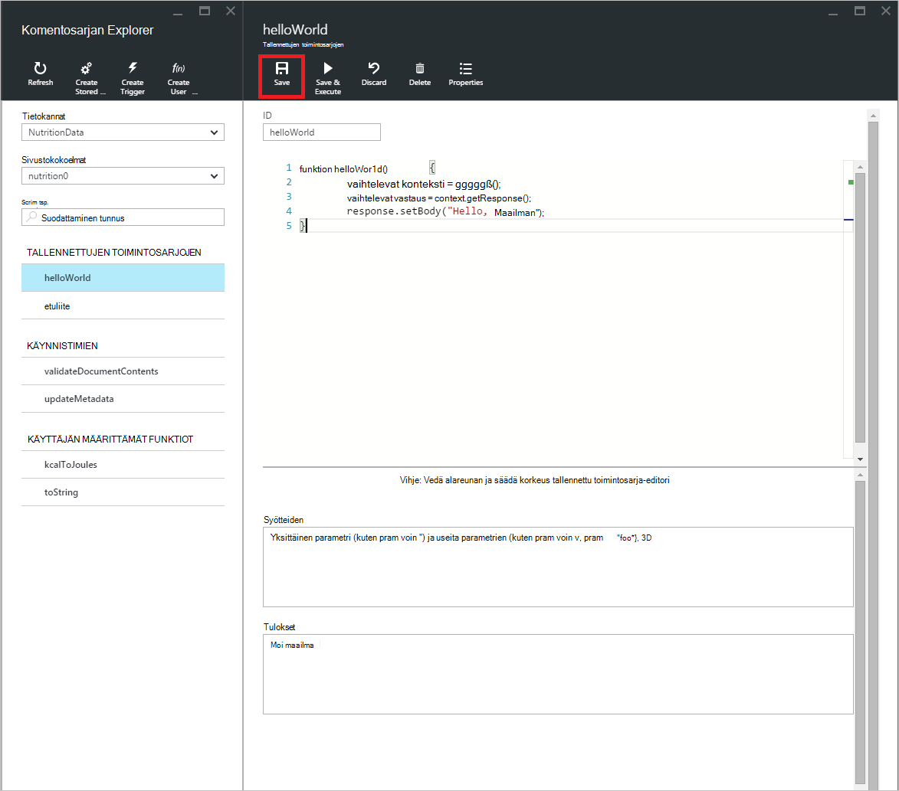

- Jos haluat hylätä odottavat muutokset komentosarjan, valitse **Hylkää** -komennon.

    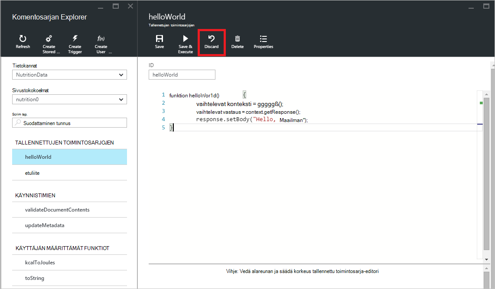

- Komentosarjan Explorer avulla voit helposti tarkastella ladatut komentosarja järjestelmän ominaisuudet valitsemalla **Ominaisuudet** -komennon.

    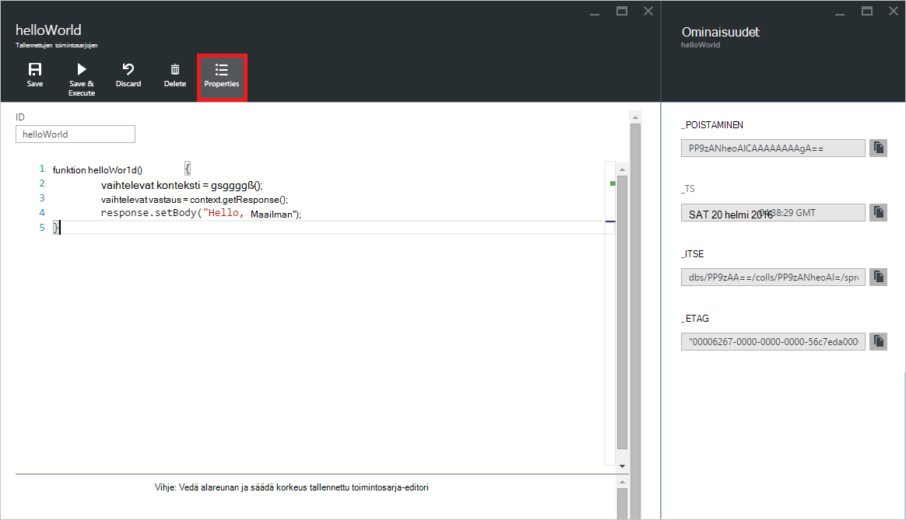

    > [AZURE.NOTE] Aikaleima (_ts)-ominaisuuden sisäisesti esitetään lukuna kausi aikaa, mutta komentosarja Explorer näyttää arvon ihmisten GMT luettavassa muodossa.

- Jos haluat poistaa komentosarjan, valitse se komentosarjan Resurssienhallinnassa ja valitse **Poista** -komennon.

    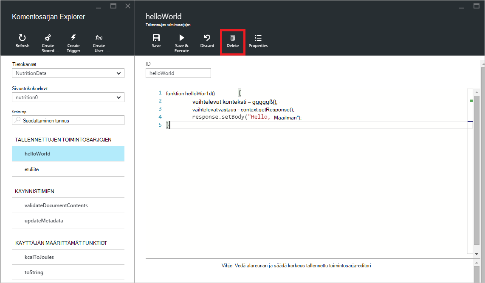

- Vahvista poistaminen valitsemalla **Kyllä** tai Peruuta poistamistoiminto valitsemalla **ei**.

    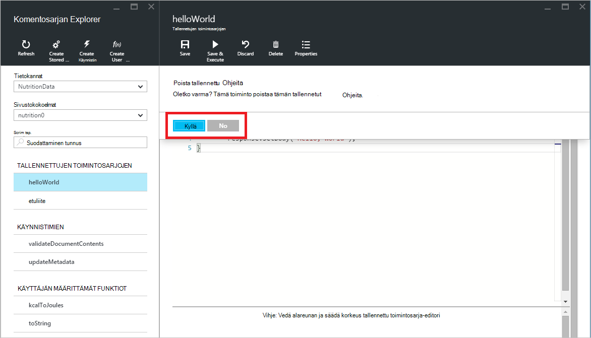

## Tallennetun toimintosarjan suorittaminen

> [AZURE.WARNING] Tallennettujen toimintosarjojen suorittaminen komentosarjan Explorerissa ei tueta vielä palvelimen puoli osioitu loppu. Katso lisätietoja seuraavasta [osioimisen ja DocumentDB skaalaus](documentdb-partition-data.md).

Komentosarjan Resurssienhallinnan avulla voit suorittaa palvelinpuolen tallennettujen toimintosarjojen Azure-portaalista.

- Kun avaat uuden Luo tallennettu toimintosarja-sivu, oletusarvo-komentosarjan (*etuliite*) jo antanut. Jotta voit suorittaa *etuliite* komentosarja tai oman komentosarjan, Lisää *tunnuksen* ja *syötteiden*. Tallennettujen toimintosarjojen, jotka hyväksyvät useita parametreja kaikkien syötteiden on oltava matriisin ( *["tapahtuman nimenä", "palkin"]*).

    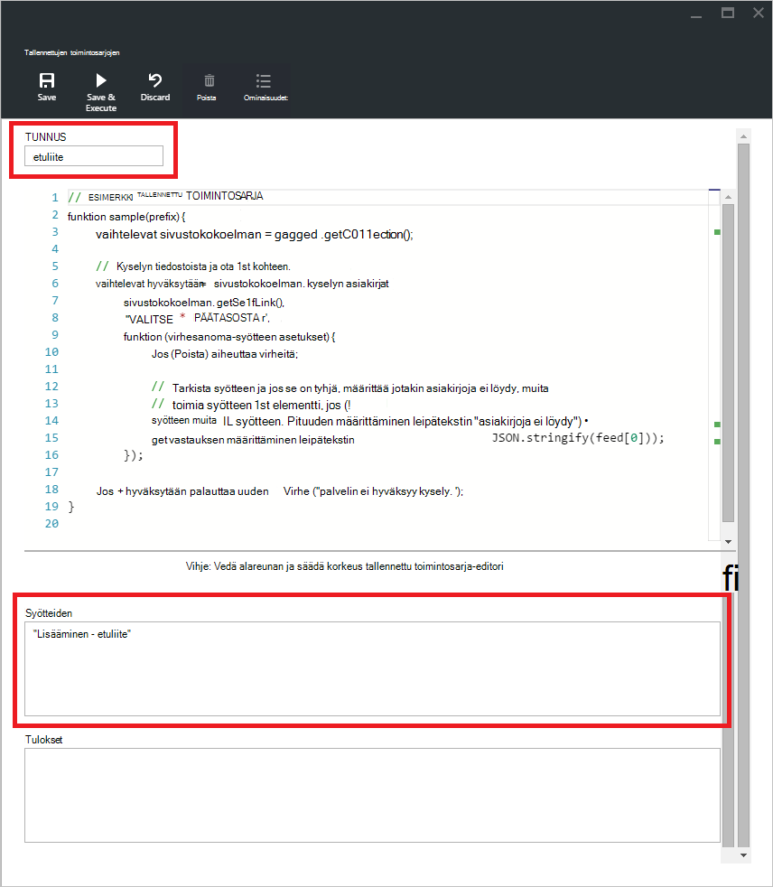

- Voit suorittaa tallennetun toimintosarjan, valitsemalla **Tallenna ja suorita** -komennon script editor-ruudussa.

    > [AZURE.NOTE] **Tallenna ja suorita** -komento tallentaa tallennettu toimintosarja ennen kuin suoritat, mikä tarkoittaa sitä, se korvaa tallennetun toimintosarjan aiemmin tallennettu versio.

- Onnistuneiden tallennetun toimintosarjan suorituskerran on *tallennettu ja suorittaa tallennetun toimintosarjan onnistui* -tila ja palautettujen tulosten täytetään *tulosruudussa* .

    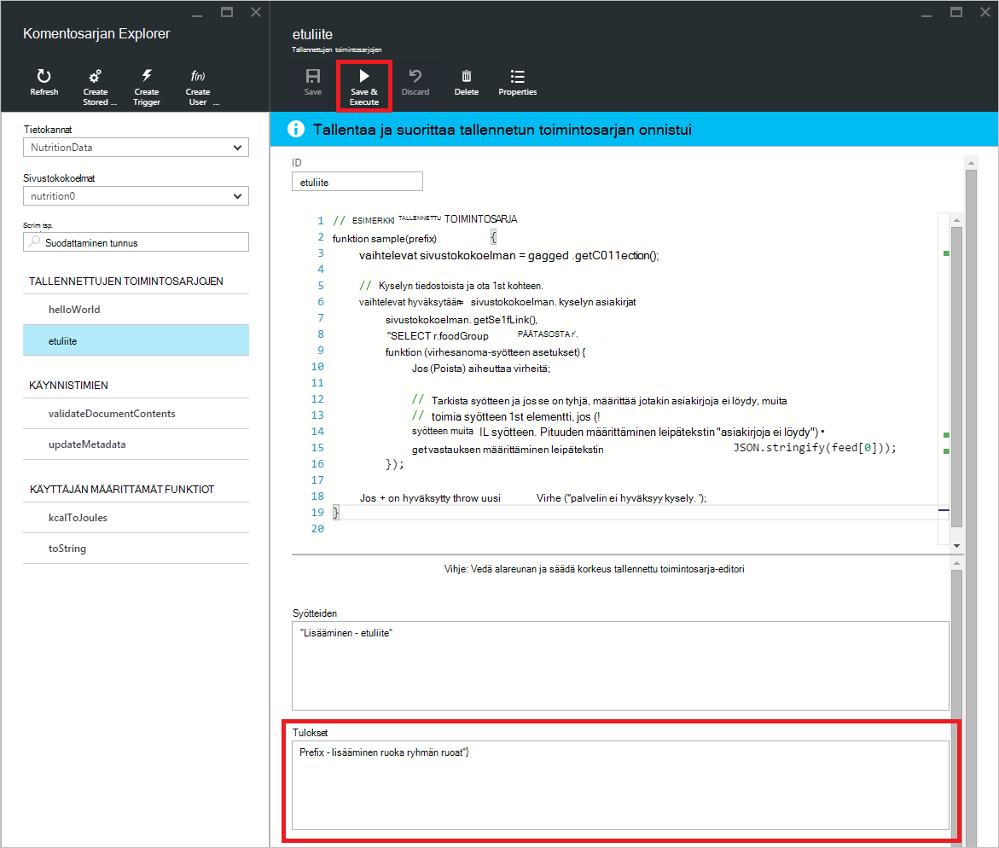

- Jos suorittamisen tapahtuu virhe, virhe täytetään *tulosruudussa* .

    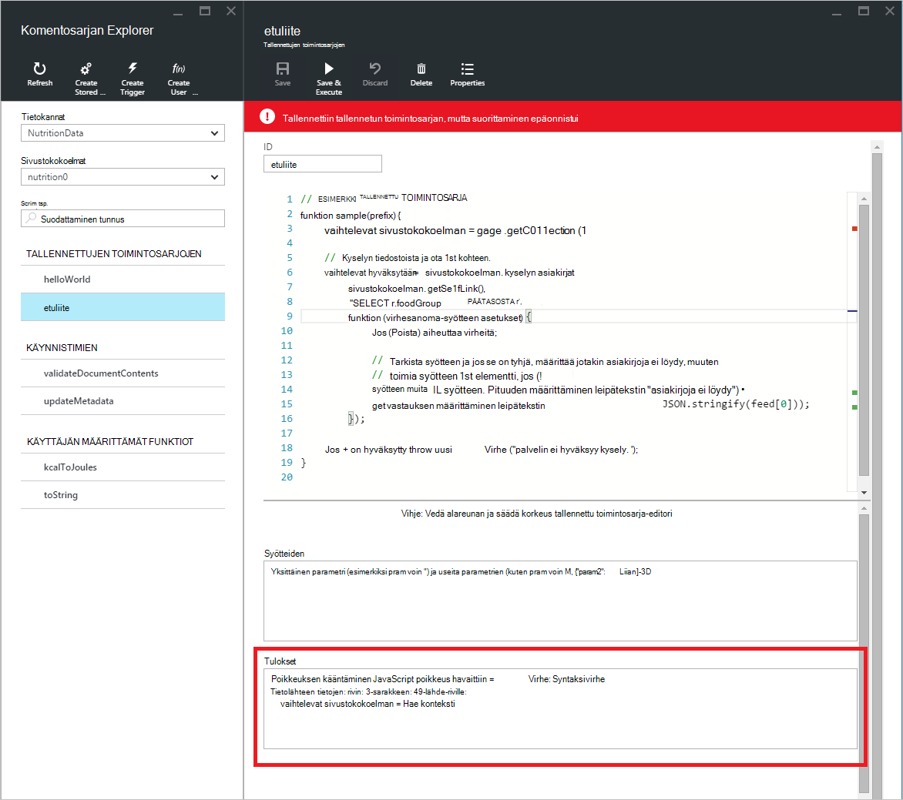

## Portaalin ulkopuolella komentosarjojen käyttäminen

Komentosarjan Explorer Azure-portaalissa on vain yksi tapa tallennettujen toimintosarjojen, käynnistimien ja käyttäjän määrittämien funktioiden DocumentDB. Voit myös käyttää komentosarjoja REST-Ohjelmointirajapinnalla ja [asiakkaan SDK: T](documentdb-sdk-dotnet.md). REST API-ohjeista on esimerkkejä, joiden [tallennettujen toimintosarjojen käyttämällä muille käyttäjille](https://msdn.microsoft.com/library/azure/mt489092.aspx), [käyttäjän määrittämät funktiot, käyttämällä muille käyttäjille](https://msdn.microsoft.com/library/azure/dn781481.aspx)ja [käynnistimien avulla muiden](https://msdn.microsoft.com/library/azure/mt489116.aspx). Esimerkkejä, joiden ovat myös käytettävissä näyttäminen [käyttäminen komentosarjojen C#](documentdb-dotnet-samples.md#server-side-programming-examples) ja [komentosarjojen Node.js käsitteleminen](documentdb-nodejs-samples.md#server-side-programming-examples).

## Seuraavat vaiheet

Lisätietoja DocumentDB palvelinpuolen ohjelmoinnin [tallennettu toimintosarja, tietokannan käynnistimien ja UDF](documentdb-programming.md) -artikkelissa.

[Oppimispolku](https://azure.microsoft.com/documentation/learning-paths/documentdb/) on myös hyötyä opastaa, kun opit Lisää DocumentDB.  
