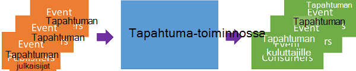
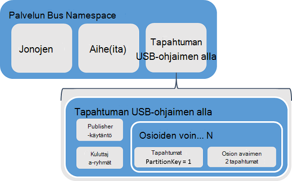
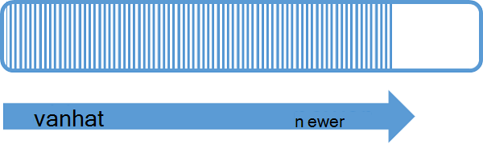
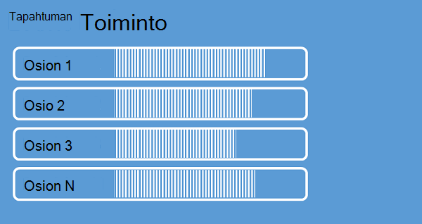
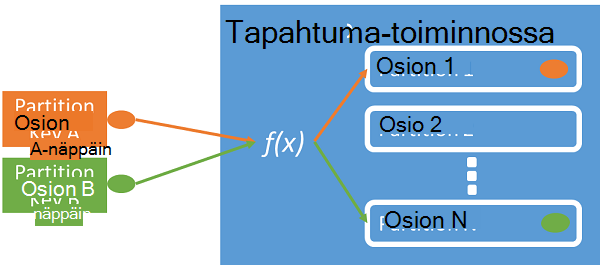
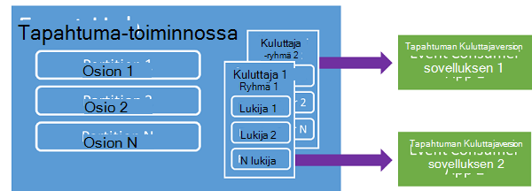
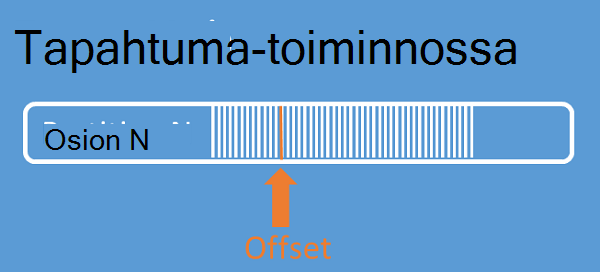
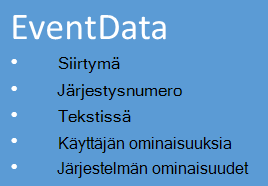

<properties 
    pageTitle="Yleistä Azure tapahtuman keskittimet | Microsoft Azure"
    description="Johdanto ja Azure tapahtuman keskittimet yleiskatsaus."
    services="event-hubs"
    documentationCenter="na"
    authors="sethmanheim"
    manager="timlt"
    editor="" />
<tags 
    ms.service="event-hubs"
    ms.devlang="na"
    ms.topic="get-started-article"
    ms.tgt_pltfrm="na"
    ms.workload="na"
    ms.date="08/16/2016"
    ms.author="sethm" />

# Azure tapahtuman keskittimet yleiskatsaus

Monet Moderni ratkaisut todentamalla tarjota mukautuvat asiakkaan kokemukset tai parantaa jatkuva palaute ja automaattisia telemetriatietojen-tuotteita. Tällaisia ratkaisuja ovat kärsivät turvallisesti ja luotettavasti käsitteleminen hyvin suuria määriä tietoja monta samanaikainen julkaisijoiden todennus. Microsoft Azure tapahtuman keskittimet on hallitun platform-palvelu, joka tarjoaa perustan suurissa tietojen saanti laaja eri skenaarioissa. Tällaiset skenaariot ovat toiminnan seuraaminen mobiilisovellukset web klustereihin-konsolin visualisointi n sieppaus-Ottelu tapahtuman tiedot liikenne ja telemetriatietoja kerättyjen teollisuuden koneet tai ajoneuvot yhteydessä. Yleisiä rooli määrää tapahtuman keskittimet toistetaan ratkaisu arkkitehtuureihin on, että se toimii "eteen oven", tapahtuma-putkijohto, kutsutaan usein *tapahtuman ingestor*. Tapahtuman ingestor on osa tai palvelu, joka on avattujen tapahtuman julkaisijat ja tapahtuman kuluttajille irrottamisen tapahtuma-muodossa-tapahtumat kulutus tuotannon välillä.

Azure tapahtuman keskittimet on tapahtuman käsittelyn palvelun, joka sisältää pienen viive ja suuri luotettavuutta tapahtuma- ja telemetriatietojen tunkeutumisen pilveen valtaviin tasolla. Tämä palvelu edeltävät muiden käyttämisestä on hyötyä sovelluksen instrumentation, käyttäjän kokemus tai työnkulun käsittelyn ja asioita Internet (IoT) skenaarioita. Tapahtuman keskittimet tarjoaa käsittely ominaisuuksien viestin virta ja tapahtumaa-toiminnossa on samalla olevien ja aiheet kokonaisuus, vaikka se on ominaisuuksia, jotka ovat täysin erilainen kuin perinteisen yrityksen viestintä. Tekstiviesti paranee edellyttävät kehittyneitä ominaisuudet, kuten järjestyksen, perille kirjain tai tapahtuman tuki vahva toimituksen vahvistukset yleisesti ollessa tapahtuman saanti hallitseva huolta suuren siirtonopeuden ja käsittelyn tapahtuman virtaa joustavasti. Vuoksi tapahtuman keskittimet ominaisuudet eroavat palvelun Bus aiheet siten, että ne erittäin yksipuolinen suuren siirtonopeuden ja käsittelyn skenaariot tapahtuma. Näin ollen tapahtuman keskittimet Toteuta joitakin sähköpostiviestinnän toimintoja, jotka ovat käytettävissä ohjeita. Jos tarvitset näitä ominaisuuksia, aiheet ovat paras vaihtoehto.

Tapahtuma-toiminnossa luodaan tasolla tapahtuman keskittimet nimitilan, palvelun Bus olevien ja ohjeita. Tapahtuman keskittimet käyttää AMQP ja HTTP sen ensisijainen API liityntäkohdat. Seuraavassa kaaviossa on esitetty tapahtuman keskittimet ja palvelun Bus välisen suhteen.

## Perustietoja

Tapahtuman keskittimet on streaming osioitua kuluttaja kuvion kautta viesti. Olevien ja aiheet käyttävät [Pikaluistelukilpailuissa Consumer](https://msdn.microsoft.com/library/dn568101.aspx) mallin joissa kunkin kuluttaja yrittää lukea samasta jonossa tai resurssi. Tämä kilpailu resurssien hakutulosten kädessä monimutkaisuutensa ja stream käsittely asteikko-rajoitukset. Tapahtuman keskittimet käyttää osioitua kuluttaja kuvion joissa kunkin kuluttaja vain lukee tietyt tai osiota, viesti-muodossa. Tätä mallia mahdollistaa käsittely vaakasuuntainen asteikko ja tarjoaa muita stream keskittyvässä ominaisuuksia, jotka eivät ole käytettävissä olevien ja ohjeita.

### Osiot

Osio on järjestetty sarjan tapahtumien, joka pidetään tapahtumaa-toiminnossa. Uudempaan tapahtumien saapuessa lisätään tässä järjestyksessä loppuun. Osion Voit ajatella "Vahvista loki."

Osioiden säilyttää tiedot määritetyn säilytys ajankohtaan, joka on määritetty tapahtumaa-toiminnossa tasolla. Tämä asetus koskee kaikkia osioiden välillä tapahtuman toiminnossa. Tapahtumien päättyy ajan perusteella; Et voi erikseen poistaa niitä. Tapahtuma-toiminnossa on useita osioita. Kunkin osion on erillinen, ja se sisältää omassa peräkkäisten tietojen. Osioiden kasvaa seurauksena usein eri koroilla.

Osioiden määrää on määritetty tapahtumaa-toiminnossa luominen aikaa ja on oltava 2 – 32 (oletus on 4). Osiot ovat tietojen organisaation järjestelmä ja Lisää liittyvät edeltävät rinnakkaisuus pakollinen muissa ohjelmissa kuin haluat tapahtuman keskittimet siirtonopeuden aste. Näin osioiden määrää valinta suoranaisesti liity samanaikainen lukijat oletat on määrä tapahtumaa-toiminnossa. Tapahtuma-toiminnossa luonnin jälkeen osion määrä ei ole muutettavissa; Ota huomioon numeron kannalta pitkään odotettu asteikko. Voit suurentaa 32 osion rajoitus ottamalla yhteyttä palvelun Bus-ryhmän.

Kun osiot ovat tunnistettavissa, ja ne voidaan lähettää suoraan, on parasta Vältä tietojen lähettäminen tietyt osiot. Sen sijaan voit käyttää suurempi tason rakenteita [tapahtuman julkaisijan](#event-publisher) ja [Julkaisijan käytännön](#capacity-and-security) osien käyttöön.

Tapahtuman keskittimet kontekstissa viestit kutsutaan *tapahtumatietoja*. Tapahtumatiedot sisältävät tapahtuman leipätekstiin, käyttäjän määritetään ominaisuuden kantolaukku ja eri metatietoja, kuten sen siirtymä tapahtumasta osio ja sen virtaa numeron. Osioiden on täytetty järjestyksessä tapahtumatietoja.

## Tapahtuman julkaisijan

Yritys, joka lähettää tapahtumia tai tietojen tapahtumaa-toiminnossa on *tapahtuman julkaisijan*. Tapahtuman julkaisijat julkaista HTTPS-tai AMQP 1.0 tapahtumat. Tapahtuman julkaisijat avulla jaettu Access allekirjoitus (SAS)-tunnuksen tunnistetietoja, tapahtuma-keskittimeen, ja voit yksilöivät tiedot tai yleisiä SAS-tunnuksen, skenaarion vaatimusten mukaan.

Lisätietoja SAS käyttämisestä on artikkelissa [Jaettujen palvelun Bus Access allekirjoituksen todentaminen](../service-bus-messaging/service-bus-shared-access-signature-authentication.md).

### Publisherin perustoiminnot

Tässä osassa kuvataan yleisiä tehtäviä tapahtuman julkaisijat.

#### Hankkia SAS tunnus

Jaetun Access allekirjoitus (SAS) on tapahtuman keskittimien todennus-järjestelmä. Palvelun Bus sisältää nimitilan ja tapahtumaa-toiminnossa tasolla SAS käytännöt. SAS-tunnuksen Suojaussidosten avaimen luodaan, ja se on SHA-hash tietyssä muodossa koodattu URL-osoite. Käytä key (käytäntö) ja tunnuksen nimiä, palvelun Bus voit uudelleen hajautuksen ja todentaa näin lähettäjää. Tavallisesti SAS tunnusten tapahtuman julkaisijat luodaan vain **lähettää** jakamisoikeudet tietyn tapahtumaa-toiminnossa. Tämä SAS suojaustunnuksen URL-järjestelmä perustana publisher tunnus publisher-käytäntö otetaan käyttöön. Lisätietoja SAS käyttämisestä on artikkelissa [Jaettujen palvelun Bus Access allekirjoituksen todentaminen](../service-bus-messaging/service-bus-shared-access-signature-authentication.md).

#### Tapahtuman julkaiseminen

Voit julkaista tapahtuman AMQP 1.0 tai HTTPS. Palvelun Bus tarjoaa .NET-asiakkaiden tapahtumaa-toiminnossa [EventHubClient](https://msdn.microsoft.com/library/microsoft.servicebus.messaging.eventhubclient.aspx) luokan julkaisun tapahtumat. Muut CRT Runtime ja ympäristöjen voit käyttää AMQP 1.0-asiakas, kuten [Apache Qpid](http://qpid.apache.org/). Voit julkaista tapahtumat yksitellen tai erämuotoinen. Yksittäisen julkaisun (tapahtuman tiedot esiintymän) on enintään 256 kt, riippumatta siitä, onko yksittäinen tapahtuma tai erän. Suurempi kuin tämä aiheuttaa virheen julkaisun tapahtumat. Parhaat käytännöt julkaisijat tiedä osioiden sisällä tapahtumaa-toiminnossa ja määritä vain *osion key* (otettu käyttöön seuraavan osion) tai jäsenyys niiden Suojaussidosten tunnuksen kautta on.

Voit käyttää AMQP tai HTTPS on käyttö-skenaario. AMQP edellyttää pysyvä kaksisuuntainen-socket lisäksi suojauksen (TLS) tai SSL/TLS perustaminen. Tämä voi olla kallista toiminnon kannalta verkkoliikennettä, mutta se tapahtuu vain AMQP-istunnon alussa. HTTPS on pienempi alkuperäinen katseltavan, mutta vaatii muita SSL yleisrasite aina. Kuka julkaista usein tapahtumien julkaisijat AMQP on merkittäviä suorituskyvyn, viiveen ja siirtonopeuden säästöjen.

### Osion avain

Osion avain on arvo, jota käytetään yhdistämään saapuvat tapahtumatiedot tietyn osioihin tiedot organisaation kannalta. Osion avain on välitetty tapahtuma-keskittimeen lähettäjän määrittämä-arvo. Se käsitellään staattinen hajautusfunktiota tulos, joka luo osion varauksen kautta. Jos et määritä osio näppäintä julkaistessasi tapahtuman, PYÖRISTÄ-funktiota Mikko varauksen käytetään. Osion näppäimet käytettäessä tapahtuman julkaisijan on vain tietoinen osion sen avaimen ei osio, johon tapahtumat on julkaistu. Lähettäjän hänen nimeään tarvitse lisätä liikaa lisätietoja edeltävät käsittely- ja tallennustilaa tapahtumien irtautus avain ja osion insulates. Osion avaimet tärkeiden tietojen edeltävät käsittelyyn järjestämisessä, mutta ne ovat olennaisesti toisiinsa liittymättömiä osioiden itse. Laitteen kohti tai käyttäjän yksilöivä tunnistetiedot on hyvä osio-näppäintä, mutta muita määritteitä, kuten geography voi myös voidaan ryhmitellä liittyvät tapahtumat osio. Seuraava kuva esittää tapahtuman lähettäjien kiinnittäminen osioiden-näppäimellä osio.

Tapahtuman keskittimet varmistaa, että kaikissa tapahtumien jakaminen saman osion arvon toimitetaan järjestyksessä ja samaan osioon. Seurannan aikana, jos osion näppäimet on käyttänyt publisher käytäntöjä, joka on kuvattu seuraavassa osassa sitten julkaisijan henkilöllisyyden ja osion avaimen on vastattava. Muussa tapauksessa tapahtuu virhe.

### Tapahtuman kuluttajaversion

Yritys, joka lukee tapahtumatietoja tapahtuma-toiminnosta on tapahtuman kuluttajaversion. Kaikki tapahtuman kuluttajille lukea – osioiden kuluttaja-ryhmässä tapahtuma-muodossa. Kunkin osion pitäisi olla vain yksi aktiivinen reader kerrallaan. Kaikki tapahtuman keskittimet kuluttajille yhteyden kautta AMQP 1.0-istunnon, jossa tapahtumat toimitetaan heti, kun ne ovat käytettävissä. Asiakas ei tarvitse lisääminen tietojen käytettävyyttä.

#### Kuluttaja-ryhmät

Julkaise ja tilaa järjestelmän ja tapahtuman keskittimet on otettu käyttöön ryhmiä. Kuluttaja-ryhmä on koko tapahtumaa-toiminnossa näkymän (osavaltio, sijainnin tai siirtymä). Kuluttaja ryhmien käyttöön kullekin vievää lisäsovellukset on erillinen näkymä tapahtuman virta ja lukea virta itsenäisesti etenee ja oman siirtymät. Virta käsittelyn arkkitehtuuri, valitse kunkin edeltävät sovelluksen vastaa tehtävässä kuluttaja-ryhmä. Voit halutessasi kirjoittaa tapahtumatietoja pitkään tallennustilan tallennustilan writer sovellus on kuluttaja-ryhmä. Monimutkainen käsittely suoritetaan toiseen, erillisessä kuluttaja ryhmittäin. Voit käyttää osioiden vain kuluttaja-ryhmän kautta. Tapahtuma-toiminnossa on aina kuluttaja oletusryhmän ja voit luoda enintään 20 ryhmiä vakio tason tapahtumaa-toiminnossa.

Seuraavassa on esimerkkejä kuluttaja ryhmän URI-konferenssi:

    //<my namespace>.servicebus.windows.net/<event hub name>/<Consumer Group #1>
    //<my namespace>.servicebus.windows.net/<event hub name>/<Consumer Group #2>

Seuraava kuva esittää tapahtuman kuluttajille kuluttaja-ryhmissä.

#### Virta siirtymät

Siirtymä on tapahtuman-osiossa paikalle. Voit ajatella siirtymä asiakaspuolen kohdistinta. Siirtymän on tavu tapahtuman numerointi. Näin-tapahtuman kuluttajille (lukija) Määritä pisteen tapahtuman virtauttaa, joista he haluavat alkaa lukea tapahtumat. Voit määrittää siirtymän aikaleima tai siirtymän arvo. Käyttäjät ovat vastuussa tallentaminen omia siirtymäarvojen tapahtuman keskittimet palvelun ulkopuolella.

Kuhunkin tapahtumaan sisältää osioon, siirtymä. Tämä siirtymä käytetään kuluttajille näyttämään tietyn osion järjestyksessä tapahtuman sijainti. Siirtymät voi siirtää tapahtumaa-toiminnossa joko numero tai aikaleima-arvon, kun lukuohjelmaa muodostaa.

#### Checkpointing

*Checkpointing* on prosessi, jolla lukijat merkkiä ja vahvista osion tapahtuman jaksoon niiden sijainnin. Checkpointing kuuluu kuluttaja ja ilmenee osion kohti välein kuluttaja-ryhmän. Tämä tarkoittaa, että kuluttaja kunkin ryhmän kunkin osion lukija on seurantaan nykyisen sijaintinsa tapahtuman virtauttaa ja palvelun voit ilmoittaa, kun se katsoo tietovirta valmis. Jos lukuohjelmaa katkaisee osio, kun yhteys se uudelleen alkaa, lähettäjä aiemmin kyseisen osion viimeisen reader kuluttaja kyseisen ryhmän tarkistuspiste lukemista. Kun Lukija yhdistää ja se kulkee tämän siirtymä Määritä sijainti, johon voit ryhtyä lukemaan tapahtumaa-toiminnossa. Näin voit käyttää checkpointing sekä Merkitse tapahtumien valmiiksi"", edeltävät sovellukset ja antaa vikasietoisuudelle, jos automaattisesti eri tietokoneissa käynnissä lukijat välille. Koska tapahtumatiedot säilytetään säilytys aikavälin määritettyä aikaa tapahtumaa-toiminnossa on luotu, on mahdollista palata vanhoja tietoja määrittämällä alemman poikkeaman checkpointing prosessia. Tämän menetelmän avulla checkpointing mahdollistaa automaattisesti vikasietoisuudelle ja valvottu tapahtuman stream uusinnan.

#### Kuluttaja perustoiminnot

Tässä osassa kuvataan yleisiä tehtäviä tapahtuman keskittimet tapahtuman kuluttajille tai lukijat. Kaikki tapahtuman keskittimet kuluttajille muodostaa AMQP 1.0 kautta. AMQP 1.0 ei istunnon ja tila-aware kaksisuuntainen tietoliikenneyhteyden. Kunkin osion on AMQP 1.0 linkki istuntoon, joka helpottaa tapahtumien eristetyt mukaan osion transport.

##### Yhteyden muodostaminen osio

Jotta tarjoaman tapahtumien tapahtuma-toiminnosta kuluttaja on muodostettava yhteys osio. Kuten edellä mainittiin, voit käyttää aina osioiden kuluttaja-ryhmä. Osana osioitua kuluttaja-mallin vain yhden lukuohjelmaa olisi aktiivinen osioon kuluttaja ryhmän tiettynä hetkenä. Osioiden kesto järjestelmä käyttää järjestämiseen tietyt osiot lukija-yhteyksien muodostamisesta on yleinen käytäntö. Näin se on mahdollista jokaista osiota kuluttaja-ryhmässä on vain yksi aktiivinen reader. Jaksossa siirtäminen lukuohjelmaa hallinta on tärkeää tehtävän, joka on saatu checkpointing. Tämä toiminto on yksinkertaistettu käyttämällä .NET-asiakkaiden [EventProcessorHost](https://msdn.microsoft.com/library/microsoft.servicebus.messaging.eventprocessorhost.aspx) -luokka. [EventProcessorHost](https://msdn.microsoft.com/library/microsoft.servicebus.messaging.eventprocessorhost.aspx) on älykäs kuluttaja-agentti ja on kuvattu seuraavassa osassa.

##### Lue tapahtumat

Kun AMQP 1.0 istunnon ja linkki avataan tiettyyn osioon, tapahtumien toimitetaan tapahtuman keskittimet-palvelun AMQP 1.0-asiakas. Tämä toimitus-järjestelmä mahdollistaa korkeampi siirtonopeuden ja pienempi kuin salaus puretaan perustuva menetelmiä, kuten HTTP GET viive. Kuin tapahtumat lähetetään asiakas-tapahtuman tiedot jokaiselle esiintymälle on tärkeää metatietoja, kuten siirtymä- ja vuorovaikutuksen numero, jota käytetään helpottamiseksi checkpointing tapahtumien järjestys.

Se on tämä siirtymä parhaiten mahdollistaa hallinta edistymistä käsittelyn virta tavalla hallinta.

## Kapasiteetti ja suojaus

Tapahtuman keskittimet on erittäin skaalattava rinnakkain arkkitehtuuri stream tunkeutumisen. Ovat näin ollen ottaa huomioon, kun kokoa ja skaalausta tapahtuman keskittimet perustuvan ratkaisun useita keskeisiä ominaisuuksia. Ensimmäinen kapasiteetin ohjausobjektit kutsutaan *siirtonopeuden yksiköiden*, joka on kuvattu seuraavassa osassa.

### Siirtonopeuden yksiköt

Tapahtuman keskittimet siirtonopeuden kapasiteetin ohjataan siirtonopeuden yksiköt. Siirtonopeuden yksiköt valmiiksi ostettu kapasiteetti yksikköä. Yksittäisen siirtonopeuden yksikkö sisältää seuraavat:

- Tunkeutumisen: Enintään 1 Megatavu toisella tai 1000 tapahtumat sekunnissa kohden.

- Juniin: Enintään 2 Megatavun sekunnissa.

Tunkeutumisen on rajoitettu kapasiteetti myöntämä siirtonopeuden ostettujen yksiköiden määrän. Summa-tulokset yllä olevien tietojen lähettäminen "kiintiö on ylitetty" poikkeuksen. Summa on joko 1 Megatavu toisella tai 1000 tapahtumat sekunnissa kohti, kumpi on ensin. Juniin tuota rajoittava poikkeukset, mutta se on rajoitettu siirtonopeuden ostettujen yksiköiden myöntämä tiedonsiirto määrä: 2 Megatavun sekunnissa siirtonopeuden kohti. Jos saat julkaisun korko poikkeukset tai odotat Nähdäksesi suurempi juniin, tarkista, kuinka monta siirtonopeuden yksikköä olet ostanut nimitilan, jossa tapahtuma-toiminnossa on luotu. Voit hankkia lisää siirtonopeuden yksiköiden, voit muuttaa asetusta **nimitilan** -sivulla [Azure perinteinen portal][] **Mittakaava** -välilehti. Voit myös muuttaa tätä asetusta Azure-ohjelmointirajapinnan käyttäminen.

Vaikka osiot ovat tietojen organisaation-käsitteestä, siirtonopeuden yksiköt kuuluvat laskettuna kapasiteetin käsite. Siirtonopeuden yksiköt tunnissa laskuttaa ja ovat valmiiksi ostettujen. Kun ostanut, siirtonopeuden yksiköt laskuttaa vähintään yhden tunnin. Enintään 20 siirtonopeuden yksiköt voi ostaa tapahtuman keskittimet nimitilan ja Azure-tili-enintään 20 siirtonopeuden yksiköiden. Nämä siirtonopeuden yksiköt jaetaan kaikki tapahtuman keskittimet annetun nimitilan.

Siirtonopeuden yksiköt parhaat työmäärään välein valmisteltu ja aina välttämättä ostettavissa heti. Jos asetat tietyn kapasiteetin, on suositeltavaa, että ostat kyseiset siirtonopeuden yksiköt etuajassa. Jos tarvitset enemmän kuin 20 siirtonopeuden yksikköä, ota Azure tuki ostaa lisää siirtonopeuden yksiköt lohkot 20 enintään 100 siirtonopeuden ensimmäisen yksiköt sitoumus erikseen. Lisäksi, että voit myös ostaa tulosryhmiä siirtonopeuden 100 yksikköä.

On suositeltavaa, että olet huolellisesti saldo siirtonopeuden yksiköt ja osioiden optimaalisen asteikkoa, jossa tapahtuma keskittimet saavuttamiseksi. Yksittäinen-osio on yksi siirtonopeuden yksikön suurin asteikko. Siirtonopeuden yksiköiden määrän, on oltava pienempi tai yhtä osioiden määrää tapahtumaa-toiminnossa.

Tarkemmat hinnoittelutiedot artikkelissa [Tapahtuman keskittimet hinnoittelua](https://azure.microsoft.com/pricing/details/event-hubs/).

### Publisher-käytäntö

Tapahtuman keskittimet mahdollistaa hajautetun hallintaoikeutta tapahtuman julkaisijat *publisher käytännöt*kautta. Publisher käytännöt on suunniteltu helpottamaan paljon riippumaton tapahtumien julkaisijoiden suorituksenaikainen ominaisuusjoukko. Publisher-käytäntöjä kunkin publisher käyttää oma yksilöllinen julkaistessasi tapahtumien tapahtuma-keskittimeen, käyttämällä seuraava:

    //<my namespace>.servicebus.windows.net/<event hub name>/publishers/<my publisher name>

Sinun ei tarvitse luoda publisher nimiä etuajassa, mutta ne on vastattava käytetyn tapahtuman, julkaistessasi varmistamiseksi riippumaton publisher käyttäjätietojen SAS tunnus. Saat lisätietoja SAS [Jaettu palvelun Bus Access allekirjoituksen todentaminen](../service-bus-messaging/service-bus-shared-access-signature-authentication.md). Publisherin käytännöt käytettäessä **PartitionKey** -arvo on määritetty julkaisijan nimi. Toimii oikein, näitä arvoja on vastattava.

## Yhteenveto

Azure tapahtuman keskittimet on hyper-akseli tapahtuma- ja telemetriatietojen käsittelyn palvelu, jota voi käyttää yleisiä sovellus- ja minkä tahansa asteikko valvonta työnkulun. Julkaise tilaa-ominaisuuksien kanssa pieni viive voi tarjota ja valtaviin tasolla tapahtuman keskittimet yhteyshenkilönä "käytössä asteikko" Big datasta varten. Publisher-pohjaisia käyttäjätietojen ja kumottujen varmenteiden luettelot nämä ominaisuudet ovat laajentamista yleisiä toimintoja Internet tilanteita, joissa. Lisätietoja tapahtuman keskittimet sovellusten kehittämisestä on [tapahtuman keskittimet ohjelmoinnin opas](event-hubs-programming-guide.md).

## Seuraavat vaiheet

Nyt kun olet oppinut tapahtuman keskittimet käsitteistä, voit siirtää seuraavissa tilanteissa:

- Aloittaminen [tapahtuman keskittimet opetusohjelma].
- Valmis [tapahtuman keskittimet käyttävän sovelluksen malli].

[Azure perinteinen portal]: http://manage.windowsazure.com
[Tapahtuman keskittimet opetusohjelma]: event-hubs-csharp-ephcs-getstarted.md
[Tapahtuman keskittimet käyttävä malli-sovellus]: https://code.msdn.microsoft.com/windowsazure/Service-Bus-Event-Hub-286fd097
