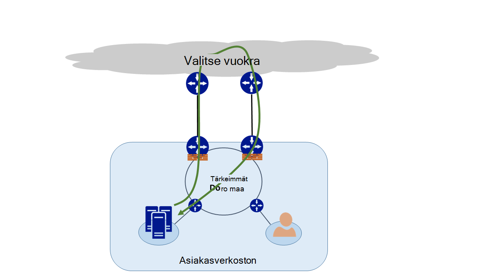
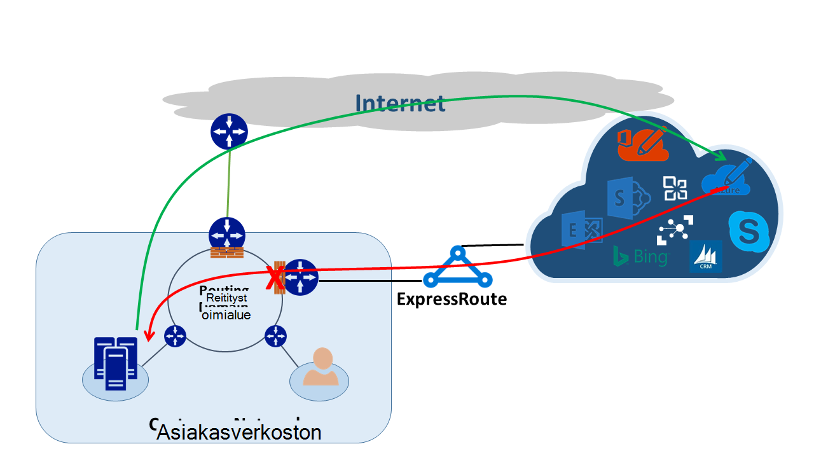
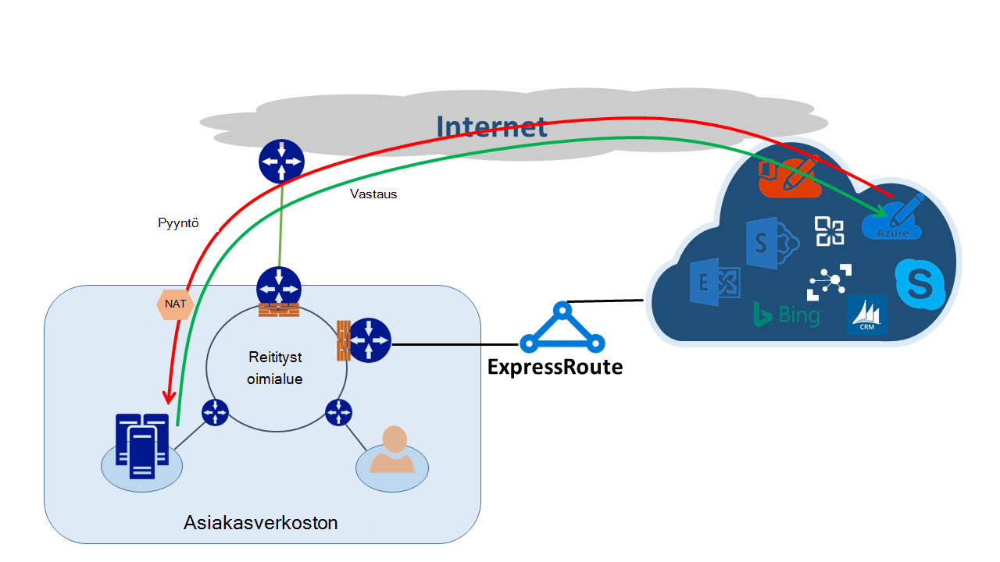

<properties
   pageTitle="Julkiseen reititys | Microsoft Azure"
   description="Tässä artikkelissa käydään läpi asiakkaan ehkä yleisölle tarkoitetun kanssa verkossa, jossa on useita linkkejä kohteeseen julkiseen reitityksestä ongelmat."
   documentationCenter="na"
   services="expressroute"
   authors="osamazia"
   manager="carmonm"
   editor=""/>
<tags
   ms.service="expressroute"
   ms.devlang="na"
   ms.topic="get-started-article"
   ms.tgt_pltfrm="na"
   ms.workload="infrastructure-services"
   ms.date="10/10/2016"
   ms.author="osamazia"/>

# Julkiseen reititys useita verkkopolut

Tässä artikkelissa kerrotaan, miten eteenpäin, ja palaa verkkoliikennettä saattaa kestää eri tiet, kun eri poluista on käytettävissä verkon lähde- ja välillä.

On tärkeää ymmärtää kahdesta käsitteestä ymmärtää julkiseen reititys. Yksi on useita verkkopolut vaikutus. Toinen osa on kuinka laitteita, kuten palomuurin pitää tila. Tällaisia laitteita kutsutaan tilallisten laitteet. Nämä kaksi tekijöiden Luo tilanteita, joissa mikä verkko-liikenne on hylättiin tilallisten laitteella, koska tilallisten laite ei havaittu, että liikenne on peräisin itse laitteen kanssa.

## Useita verkkopolut

Kun yrityksen verkossa on vain yksi linkki Internet-yhteyden kautta niiden Internet-palveluntarjoajalta, kaikki liikenne, ja Internetistä kulkee sama polku. Usein yritykset ostaa useita piirit tarpeettomat polut parantaa verkon toiminta-aika. Tällöin on mahdollista, että liikenteestä, joka siirtyy ulkopuolella verkon yhteyden Internetiin, käy läpi yksi linkki ja palaa liikenne siirtyy eri linkin kautta. Tämä tunnetaan yleisesti nimellä julkiseen reititys. Julkiseen reitityksessä käänteisen verkkoliikennettä kestää kansiopolku alkuperäisen vuosta.

Vaikka se tapahtuu pääasiassa Internetissä, myös julkiseen reititys koskee muita eri poluista yhdistelmiä. Se koskee esimerkiksi sekä Internet-polun yksityinen polku, siirry samaan kohteeseen ja useita yksityinen tiet, siirry samaan kohteeseen.

Kunkin reitittimen muutamiin lähteestä kohteeseen, laskee parhaat polku saavuttamiseksi kohde. Paras mahdollinen polku reitittimen määrittäminen perustuu kaksi tärkeimmät seikat:

-   Reititys-protokollan reunan yhdyskäytävän erityisen perustuu reititys ulkoiset verkostot välillä. Erityisen tulee mainokset muiden tekijöiden aiheuttamia, ja ne käy läpi vaiheet, voit selvittää parhaan polun oikeaan kohteeseen. Paras polku tallennetaan sen reititys-taulukon.
-   Reititys liittyvän aliverkkopeite pituuden vaikuttaa reititys polkuja. Jos reitittimen vastaanottaa useita ilmoituksia samaa IP-osoitetta, mutta erilaisia aliverkon peitteitä, reitittimen haluaa kanssa pidempi aliverkkopeite ilmoitus, koska se on tarkempaa reittiä.

## Tilallisten laitteet

Paketin IP-otsikon Tarkista reitittimen reititys tarkoituksiin. Joitakin laitteita Etsi myös tarkempaa paketin sisällä. Yleensä seuraaviin laitteisiin katsomalla Layer4 (Transmission Control Protocol tai TCP; tai käyttäjän datagrammiprotokolla tai UDP) tai jopa Layer7 (sovelluskerroksen) otsikot. Tällaiset laitteet on joko suojaus tai kaistanleveyden optimointi laitteet. 

Palomuuri on Yleinen esimerkki tilallisten laitteen. Palomuuri sallii tai estää paketin läpi sen liityntäkohdat, kuten protokolla, TCP/UDP-portin ja URL-Osoitteen otsikot eri kenttien perusteella. Tämä taso paketin tarkastuksen siirtää näkyvä, käsittelyn lataaminen laitteeseen. Voit parantaa suorituskykyä palomuurin tarkastaa vuo ensimmäisen paketin. Se sallii Jatka paketin, se säilyttää työnkulku tiedot sen tila-taulukossa. Kaikki myöhemmin-paketteja, jotka liittyvät tämä työnkulku sallitaan alkuperäinen määrittäminen perustuu. Paketin, joka on osa aiemmin työnkulku on ehkä saapuvat palomuurissa. Jos palomuurin ei ole aiempaan tilatietoja sen, palomuurin pudottaa paketin.

## Julkiseen reititys ExpressRoute kanssa

Kun muodostat yhteyden Microsoft Azure ExpressRoute kautta, verkon muutokset tältä:

-   Sinulla on useita linkkejä Microsoftille. Linkin on Internet-yhteyden ja toinen on ExpressRoute kautta. Jotkin-liikenne paikalliseen Microsoft voi siirtyä Internetin kautta, mutta palata ExpressRoute kautta tai päinvastoin.
-   Saat tarkempia IP-osoitteiden ExpressRoute kautta. Jotta tietoliikenteen verkosta Microsoftille palveluiden ExpressRoute kautta tarjoaa reitittimen mieluummin aina ExpressRoute.

Selvittääksesi nämä kaksi muutokset on verkossa tehosteen seuraavassa joissakin tilanteissa. Esimerkkinä sinulla on vain yksi piiri Internet ja voit käyttää kaikkia Microsoft palveluita Internetin kautta. Verkon tietoliikenteen Microsoft ja takaisin traverses saman Internet-linkin, ja välittää palomuurin läpi. Palomuurin tietueiden kulun, kun se havaitsee ensimmäisen paketin ja paketteja takaisin on sallittu, koska kulun tila-taulukossa.

Valitse Ota käyttöön ExpressRoute ja käyttää palveluita Microsoftin tarjoama ExpressRoute päälle. Muiden Microsoftin palvelujen ovat kulutettu Internetin välityksellä. Voit ottaa käyttöön erillinen palomuuri reunassa, joka on liitetty ExpressRoute. Microsoft mainostaa tiettyihin etuliitteiden verkon kautta ExpressRoute erityisistä palveluista. Reititys infrastruktuurin valitsee ExpressRoute kuin ne etuliitteiden ensisijainen polku. Jos ovat ei mainonta julkiseen IP-osoitteiden Microsoftille ExpressRoute päälle, Microsoft yhteydessä julkiseen IP-osoitteiden Internetin kautta. Välitä liikenne verkosta Microsoft käyttävät ExpressRoute ja käänteisen liikenne Microsoft Internet. Kun reunan palomuurin näkee vastauksen paketin kulkuun, joka ei löydy tila-taulukossa, pudottaa palautuksen liikenne.

Jos haluat käyttää samaa verkon osoite muuntaminen (NAT) resurssivarantoon ExpressRoute Internetissä, näet seurantakohteita asiakkaiden kanssa verkossa yksityinen IP-osoitteiden. Palvelujen, kuten Windows Update-pyyntöjen siirtyä Internetin kautta, koska palvelun IP-osoitteita ei ilmoittaa ExpressRoute kautta. Palaa liikenne on kuitenkin takaisin ExpressRoute kautta. Jos Microsoft vastaanottaa kanssa samaan aliverkkopeite IP-osoite Internet- ja ExpressRoute, se haluaa ExpressRoute Internetin välityksellä. Jos palomuuri tai jotakin muuta tilallisten laitetta, joka on verkossa reuna ja vastakkaisten ExpressRoute ei ole kulun edellisen tietoja, se avautuu paketteja, jotka kuuluvat, että työnkulku.

## Julkiseen reititys ratkaisut

Käytettävissä on kaksi tärkeimmät vaihtoehtoista julkiseen reitityksestä ongelma voidaan ratkaista. Yksi on kautta reititys ja toinen on käyttää lähde-pohjainen NAT (SNAT).

### Reititys

Varmista, että julkisten IP-osoitteiden on ilmoitetaan leveä oikeaan kohtaan WAN-verkkoon linkkejä. Esimerkiksi jos haluat käyttää Internet mail-tietoliikenteen tietoliikenteen ja ExpressRoute, sinun olisi ei mainostaa käyttäjän Active Directory Federation Services (AD FS) julkisten IP-osoitteiden ExpressRoute päälle. Vastaavasti muista ei Näytä paikallisen AD FS palvelimen IP-osoitteiden reitittimen vastaanottaa ExpressRoute kautta. Vastaanotettujen ExpressRoute tiet ovat tiettyihin, joten he tehdä ExpressRoute tietoliikenteen ensisijainen polku Microsoftille. Tämä aiheuttaa julkiseen reititys.

Jos haluat käyttää ExpressRoute todennusta varten, varmista, että AD FS julkisten IP-osoitteiden on mainonta ExpressRoute ilman tulkintatoiminnon päälle Tällä tavalla liikenteestä, joka on peräisin Microsoftilta ja siirtyy paikallisen AD FS ‑palvelin esitellään ExpressRoute. Palaa liikenne asiakkaan Microsoft käyttää ExpressRoute, koska se on ensisijainen reitin Internetin välityksellä.

### Lähde-pohjainen NAT

Toinen tapa julkiseen reititys ongelmien ratkaisemiseen on SNAT avulla. Esimerkiksi sinun on ei määrittämiisi julkiseen IP-osoite on paikallisen Simple Mail Transfer Protocol (SMTP)-palvelimen kautta ExpressRoute koska aiot käyttää tätä tyyppisiä Internet. Pyynnön, joka on peräisin Microsoft ja siirtyy paikalliseen SMTP-palvelimen traverses Internetissä. Voit SNAT saapuvan pyynnön sisäinen IP-osoitteeseen. SMTP-palvelinta käänteisessä tietoliikenteen siirtyy reunan palomuurin (joka käytettävään NAT) sijaan ExpressRoute kautta. Palaa liikenne siirtyy Internetin kautta.

## Julkiseen reititys tunnistus

Traceroute on paras tapa Varmista, että verkkoliikennettä on sallita ohittaa odotettu polku. Jos arvelet liikenne paikalliseen SMTP-palvelimen Microsoft tulevat Internet-polku, odotettu traceroute on SMTP-palvelimen Office 365: een. Tulos vahvistaa, että liikenne varmasti jätä verkon Internetissä ja ei ExpressRoute kohti.
