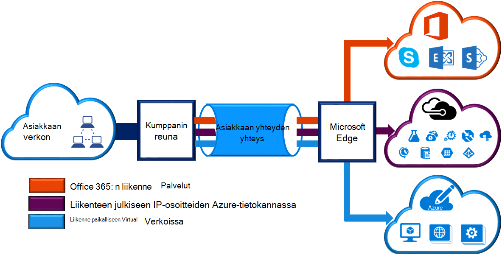
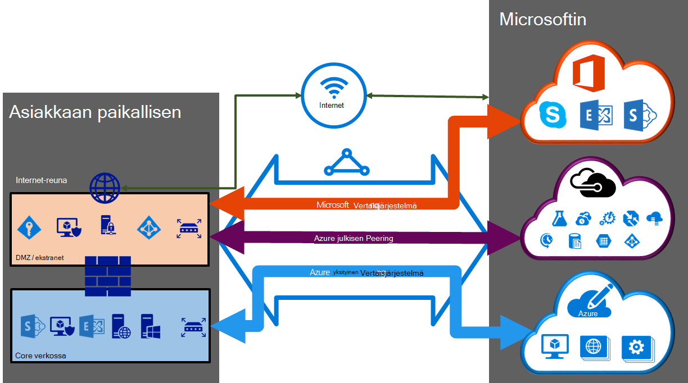

<properties 
   pageTitle="ExpressRoute piirit ja reititys toimialueiden | Microsoft Azure"
   description="Tällä sivulla on yleiskuvaus ExpressRoute piirit ja reititys toimialueet."
   documentationCenter="na"
   services="expressroute"
   authors="cherylmc"
   manager="carmonm"
   editor=""/>
<tags 
   ms.service="expressroute"
   ms.devlang="na"
   ms.topic="article" 
   ms.tgt_pltfrm="na"
   ms.workload="infrastructure-services" 
   ms.date="10/10/2016"
   ms.author="cherylmc"/>

# ExpressRoute piirit ja reititys toimialueet

 On tilaa *ExpressRoute piiri* muodostaa yhteyden Microsoftin paikallisen infrastruktuurin connectivity-palvelun kautta. Seuraavassa kuvassa on looginen esittäminen WAN- ja Microsoft väliset yhteydet.

## ExpressRoute piirit

*ExpressRoute piiri* edustaa looginen paikallisen infrastruktuuri ja Microsoftin pilvipalveluihin connectivity-palvelun kautta välinen yhteys. Voit tilata useita ExpressRoute piirit. Kunkin voi olla samassa tai eri alueilla, sekä niiden paikallisen eri yhdistämispalvelua tarjoajat – voidaan muodostaa yhteys. 

ExpressRoute piirit ei voi yhdistää minkä tahansa fyysisiä kohteita. Piirin tunnistetaan yksilöllisesti standardi GUID-tunnus, jota kutsutaan palvelun avaimeksi (s-näppäintä). Palvelun avain on vain osan Microsoft connectivity-palvelu ja olet vaihtamista tiedoista. S-näppäintä ei ole salaisuus tietoturvasyistä. On 1:1 yhdistämisen ExpressRoute piiri ja sitten s-näppäintä.

ExpressRoute piiri voi olla jopa kolme riippumaton peerings: Azure julkinen, Azure yksityinen ja Microsoftin. Kunkin peering on itsenäinen erityisen kahdet istuntoa ne määritetty toisena suuren käytettävyyden. Ei 1: n (1 < = N < = 3) yhdistäminen ExpressRoute piiri välillä ja reititys toimialueet. ExpressRoute piiri voi olla mikä tahansa, kahden tai kaikki kolme peerings ExpressRoute piiri kohti käytössä.
 
Kunkin on kiinteä kaistanleveys (50 Mbps, 100 Mbps, 200 Mbps, 500 Mbps, 1 Gbps, 10 Gbps) sekä on nyt yhdistetty connectivity palveluntarjoaja ja peering sijainti. Voit valita kaistanleveys on voidaan jakaa kaikki peerings virtapiirin varten. 

### Kiintiön rajat ja rajoitukset

Oletus-kiintiön ja rajoitukset koskevat jokaisen ExpressRoute piiri. Lisätietoja [Azure tilaus ja palvelun rajoitukset, kiintiöiden ja rajoitusten](../azure-subscription-service-limits.md) sivun tiedot-kiintiön.

## ExpressRoute reititys toimialueet

ExpressRoute piiri on liitetty useita reititys toimialueita: Azure julkinen, Azure yksityinen ja Microsoftin. Kunkin reititys toimialueen määritetään samannimisen reitittimen kahdet (aktiivinen aktiivinen tai kuormituksen jakamisen määritys) suuren. Azure services luokkana *Azure julkisen* ja *yksityisen Azure* edustaa IP-osoitteiden mallit.

### Yksityinen peering

Azure Laske-palveluihin, eli näennäiskoneiden (IaaS) ja pilvipalveluihin (PaaS), jotka on otettu virtual verkossa oleville voidaan yhdistää yksityinen peering toimialueen kautta. Yksityinen peering toimialueen pidetään tunniste on luotettu core verkoston tuominen Microsoft Azure. Voit määrittää kaksisuuntaisen yhteyden core verkko- ja Azure virtual verkkojen (VNets) välillä. Tämä peering avulla voit muodostaa yhteyden näennäiskoneiden ja cloud services suoraan niiden yksityiset IP-osoitteet.  

Voit muodostaa useita virtual verkkoja yksityinen peering toimialueeseen. Tarkista [usein kysytyt kysymykset-sivun](expressroute-faqs.md) tietoja rajat ja rajoitukset. Pääset käsiksi [Azure tilaus ja palvelun rajoitukset, kiintiöiden ja rajoitusten](../azure-subscription-service-limits.md) sivun tiedot-rajoitukset.  Lisätietoja on lisätietoja reititys määritysten [Reititys](expressroute-routing.md) -sivua.

### Julkinen peering

Julkiseen IP-osoitteiden tarjotaan palveluja, kuten Azure-tallennustilan, SQL-tietokannat ja sivustot. Voit muodostaa yksityisesti julkiseen IP-osoitteet, mukaan lukien pilvipalveluihin – julkisen peering Reititystoimialue VIPs maksuttomien palveluiden. Voit muodostaa yhteyttä DMZ julkisen peering toimialueen ja muodostaa Azure palvelun julkiseen IP-osoitteiden niiden oman WAN ilman, että voit muodostaa yhteyden Internetin kautta. 

Yhteyksien käynnistetään aina oman WAN Microsoft Azure-palveluihin. Microsoft Azure services ei voi aloittaa yhteydet mukaan – tämä Reititystoimialue verkostoon. Kun julkinen peering on otettu käyttöön, voi muodostaa kaikki Azure services. Emme Salli voidaan valita valikoivasti, jossa on mainostaa tiet, services. Voit tarkastella etuliitteiden kirjainkoko on ilmoittaa sinulle kautta peering [Microsoft Azure palvelinkeskuksen IP-alueita](http://www.microsoft.com/download/details.aspx?id=41653) -sivulla luettelo. Sivu päivitetään viikoittain.

Voit määrittää mukautetun reitin suodattimet tarjoaman vain tiet, sinun on verkossa oleville. Lisätietoja on lisätietoja reititys määritysten [Reititys](expressroute-routing.md) -sivua. Voit määrittää mukautetun reitin suodattimet tarjoaman vain tiet, sinun on verkossa oleville. 

On lisätietoja [usein kysytyt kysymykset-sivulla](expressroute-faqs.md) julkinen peering Reititystoimialue tukee Services. 
 
### Microsoft peering

[AZURE.INCLUDE [expressroute-office365-include](../../includes/expressroute-office365-include.md)]

Yhteyden kaikkiin muihin Microsoft online Services (kuten Office 365-palvelut) on – Microsoft peering. Olemme käyttöön kaksisuuntaisen WAN- ja Microsoft cloud palvelujen – Microsoft peering Reititystoimialue väliset yhteydet. Sinun on muodostettava yhteys Microsoftin pilvipalveluihin vain julkiseen IP-osoitteet, jotka sinä tai connectivity-palveluntarjoajan omistaa päälle ja sinun on noudatettava määritettyjä sääntöjä. Katso lisätietoja [ExpressRoute edellytykset](expressroute-prerequisites.md) -sivu.

Avata [usein kysytyt kysymykset-sivun](expressroute-faqs.md) tiedot tuettu Services, kustannuksia sekä tiedot. Katso lisätietoja [ExpressRoute sijainnit](expressroute-locations.md) -sivulla yhdistämispalvelua tarjoajat peering Microsoft-tuen tarjoaminen luettelo.

## Reititys toimialueen vertailu

Alla olevassa taulukossa verrataan kolme reititys toimialueet.

||**Yksityinen Peering**|**Julkinen Peering**|**Microsoft Peering**|
|---|---|---|---|
|**Maks. # etuliitteiden kohti peering tuettu**|4000 oletusarvoisesti 10 000 ExpressRoute Premium kanssa|200|200|
|**Tuetut IP-osoitealueet**|Mikä tahansa kelvollinen IPv4-osoite oman WAN kuluessa.|Sinun tai connectivity-palvelun julkisen IPv4-osoitteet.|Sinun tai connectivity-palvelun julkisen IPv4-osoitteet.|
|**Luvun vaatimukset kuin**|Yksityisten ja julkisten LUKUINA. Yleisön on oltava oma NUMERONA, jos haluat käyttää. | Yksityisten ja julkisten LUKUINA. On kuitenkin osoitettava omistajuuden julkiseen IP-osoitteet.| Yksityisten ja julkisten LUKUINA. On kuitenkin osoitettava omistajuuden julkiseen IP-osoitteet.|
|**Reititys käyttöliittymän IP-osoitteet**|RFC1918 ja julkiseen IP-osoitteet|Julkisten IP-osoitteiden reititys paikallisrekisterit rekisteröity.| Julkisten IP-osoitteiden reititys paikallisrekisterit rekisteröity.|
|**MD5 Hash-tuki**| Kyllä|Kyllä|Kyllä|

Voit valita yhden tai useamman reititys toimialueiden käyttöön niiden ExpressRoute piiri osana. Voit valita on reititys toimialueita laitetaan saman VPN-yhteyttä, jos haluat yhdistää yhden Reititystoimialue. Voit sijoittaa ne myös eri reititys toimialueet-samanlainen kaavio. Suositellut määritykset on yksityinen peering on yhdistetty suoraan core-verkko- ja julkinen ja Microsoft peering linkit ovat yhteydessä oman DMZ.
 
Jos haluat, että kaikki kolme peering istunnot, sinulla on kolme paria erityisen istuntoon (yksi pari peering mistäkin). Erityisen istunnon parit on erittäin käytettävissä linkin. Jos olet muodostamassa kerroksen 2 yhdistämispalvelua tarjoajat kautta, vastuussa määrittämisestä ja hallinnasta reititys. Voit lukea lisää tarkastelemalla [Työnkulut](expressroute-workflows.md) ExpressRoute määrittämisestä.

## Seuraavat vaiheet

- Etsi palveluntarjoaja. Katso [ExpressRoute palveluntarjoajien ja sijainnit](expressroute-locations.md).
- Varmista, että kaikki edellytykset täyttyvät. Katso [ExpressRoute edellytykset](expressroute-prerequisites.md).
- Määritä ExpressRoute-yhteys.
    - [Luo ExpressRoute piiri](expressroute-howto-circuit-classic.md)
    - [Määritä reititys (piiri peerings)](expressroute-howto-routing-classic.md)
    - [Linkin VNet ExpressRoute piiri](expressroute-howto-linkvnet-classic.md)
