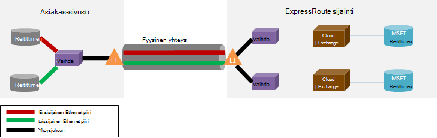

<properties
   pageTitle="ExpressRoute usein kysytyt kysymykset"
   description="ExpressRoute usein kysytyt kysymykset sisältää tietoja tuettu Azure-palveluja, kustannukset, tiedot ja yhteydet, SLA, tarjoajat ja sijainnit, kaistanleveyden ja lisää teknisistä tiedoista."
   documentationCenter="na"
   services="expressroute"
   authors="cherylmc"
   manager="carmonm"
   editor=""/>
<tags
   ms.service="expressroute"
   ms.devlang="na"
   ms.topic="article" 
   ms.tgt_pltfrm="na"
   ms.workload="infrastructure-services"
   ms.date="10/10/2016"
   ms.author="cherylmc"/>

# ExpressRoute usein kysytyt kysymykset

## Mikä on ExpressRoute?
ExpressRoute on Azure-palvelu, jolla voit luoda yksityinen yhteyksiä Microsoft palvelinkeskusten ja infrastruktuurin, joka on paikallisesti tai ulkoistaminen-tilojen välillä. ExpressRoute yhteydet ei siirry julkisen Internetin välityksellä ja tarjota suurempi suojaus, luotettavuutta ja nopeuksia alemman viiveet suurempia kuin tavallinen yhteydet kanssa Internetissä.

### Mitä hyötyä ExpressRoute ja yksityisverkkoyhteydet käytön?
ExpressRoute yhteydet ei siirry julkisen Internetin välityksellä ja tarjota suurempi suojaus, luotettavuutta ja nopeuksia ala- ja yhtenäinen viiveet suurempia kuin tavallinen yhteydet kanssa Internetissä. Joissakin tapauksissa ExpressRoute yhteyksien avulla voit siirtää tietoja välillä paikallisen laitteet ja Azure voi tuottaa kustannukset merkittäviä etuja.

### Mitä Microsoftin pilvipalveluihin tuetaan ExpressRoute kautta?
ExpressRoute tukee useimmat Microsoft Azure-palveluista, kuten tänään Office 365: ssä.  Tarkista päivitykset yleiseen käyttöön pian.

### Missä on palvelu?
Katso tämän sivun sijainti ja käytettävyyden: [ExpressRoute kumppanit ja sijainnit](expressroute-locations.md).

### Miten ExpressRoute käyttää muodostamaan yhteys Microsoft, jos käytössäni ei ole sektorin jonkin ExpressRoute carrier kumppaneiden kanssa?
Voit valita aluekohtaiset carrier ja Power View Ethernet yhteydet johonkin tuetut exchange tarjoajan sijainnit. Voit sitten vertaiskone Microsoft tarjoajan sijainnissa. Tarkista [ExpressRoute kumppanit ja sijainnit](expressroute-locations.md) , onko käytössä exchange-Kohdista-palveluntarjoajan viimeisessä osassa. Voit tilata sitten ExpressRoute-piiri muodostaa Azure palveluntarjoajan kautta.

### Kuinka paljon ExpressRoute kustannukset?
Tarkista hintatiedot [hinnoittelua tiedot](https://azure.microsoft.com/pricing/details/expressroute/) .

### Jos voin maksaa ExpressRoute-piiri annetun kaistanleveyden, voin hankkia verkon palveluntarjoaja VPN-yhteyden olla ovat yhtä nopeita?
Ei. Voit hankkia VPN-yhteyden nopeudesta minkä tahansa-palveluntarjoajalta. Azure-yhteys kuitenkin rajoitettu ExpressRoute piiri kaistanleveyden, jota ostat.

### Jos voin maksaa ExpressRoute-piiri annetun kaistanleveyden, tarvitsen mahdollisuus burst suurempia nopeuksia ylöspäin, jos tarvitaan?
Kyllä. ExpressRoute piirit on määritetty tukemaan tapaukset, joissa voit burst jopa kaksi kertaa varten ilman lisäkustannuksia hankittu kaistanleveydestä. Tarkista palveluntarjoajalta, jos ne tukevat tätä ominaisuutta.

### Käytettävät samaa yksityisverkon yhteyttä VPN- ja Azure muiden kanssa samanaikaisesti
Kyllä. ExpressRoute-piiri, kerran asetukset pystyt käyttämään virtual verkon palveluja ja Azure muiden samanaikaisesti. Voit muodostaa yhteyden virtual verkkojen yksityinen peering polku ja muut palvelut julkisen peering polussa.

### ExpressRoute tarjota palvelussa palvelutasosopimusta (SLA)?
Lue lisätietoja [ExpressRoute SLA-sivu](https://azure.microsoft.com/support/legal/sla/) .

## Tuetut palvelut
Useimmat Azure services tuetaan ExpressRoute päälle.

- Yhteys näennäiskoneiden ja cloud Services-palvelut on otettu käyttöön virtual verkkoja tuetaan yksityinen peering polussa.
- Azure sivustojen tuetaan julkisen peering polussa.
- IoT keskittimeen tuetaan julkisen peering polussa.
- Office 365: n tuetaan Microsoft peering polussa.
- Kaikki muut palvelut ovat käytettävissä julkisen peering polussa. Poikkeukset ovat seuraavat:

    **Seuraavat palvelut ei tueta:**

    - CDN
    - Visual Studio Team Services kuormituksen testaaminen
    - Monimenetelmäisen todentamisen
    - Liikenteen hallinta

## Tietojen ja yhteydet

### Onko rajoitusten ExpressRoute avulla voit siirtää tietojen määrään?
Emme ole määritetty rajoitukset tiedonsiirto määrää. Lisätietoja on lisätietoja kaistanleveyden korvaukset [hinnat tiedot](https://azure.microsoft.com/pricing/details/expressroute/) .

### Mitä yhteysnopeus tukemat ExpressRoute?
Tuetut kaistanleveyden tarjouksia:

| 50 Mbps, 100 Mbps, 200 Mbps 500 Mbps 1Gbps, 2 Gbps, 5 Gbps 10Gbps |

### Mitä palveluntarjoajien on käytettävissä?
Katso [ExpressRoute kumppanit ja sijainnit](expressroute-locations.md) for palveluntarjoajia ja sijainnit.

## Teknisiä tietoja

### Mitkä ovat tekniset vaatimukset muodostamisesta Azure paikallisen sijaintini?
Katso [ExpressRoute edellytykset sivun](expressroute-prerequisites.md) vaatimuksia.

### Ovat ExpressRoute yhteydet tarpeettomat?
Kyllä. Kunkin Express reitin piiri on tarpeettomia kahdet väliset yhteydet, jotka on määritetty Suuri käytettävyys.

### Voin menetetään connectivity Jos jokin ExpressRoute linkit eivät toimi?
Menetät ei yhteyden, jos jokin cross yhteyksistä epäonnistuu. Tarpeettomien yhteys on käytettävissä tukemaan verkon kuormituksen. Voit luoda useita piirit lisäksi saada virheen toimintakykyyn peering eri sijainnissa.

### Jos en ole yhtä osoitteessa cloud exchange ja palveluntarjoaja tarjoaa pisteestä pisteeseen-yhteys, pitääkö tilauksen kaksi fyysinen Omat paikalliseen verkkoon ja Microsoft väliset yhteydet? 
Ei, tarvitset vain yhtä fyysistä yhteyttä Jos palveluntarjoajan muodostaa kahden Ethernet virtual piirit fyysinen yhteyden kautta. Fyysinen (kuten OCR-fiber) yhteys katkaistaan tason 1 (L1) laitteen (Katso alla olevassa kuvassa). Kaksi Ethernet virtual virtapiirit on merkitty eri VLAN tunnukset, yksi, jonka ja yksi toissijaisen. VLAN näiden tunnusten on ulompi 802.1Q Ethernet otsikko. Sisemmän 802.1Q Ethernet otsikko (ei näy) on nyt yhdistetty [ExpressRoute Reititystoimialue](expressroute-circuit-peerings.md). 

### Voit voin perusteella jokin Omat näennäislähiverkkojen Azure käyttämällä ExpressRoute?
Ei. Microsoft ei tue kerroksen 2 connectivity tunnisteet Azure kyselyjä.

### Minulla on useampi kuin yksi ExpressRoute piiri tilauksen?
Kyllä. Voit valita useamman kuin yhden ExpressRoute piiri tilauksen. Erillinen piirit määrän oletusrajoitus on määritetty 10. Ota Microsoft Support niin, että rajoitus tarvittaessa.

### Ovatko ExpressRoute piirit eri tarjoajien?
Kyllä. Voit määrittää ExpressRoute piirit useita palveluntarjoajia. Kunkin ExpressRoute piiri päivitetään vain yhden palveluntarjoajan.

### Miten oma virtual verkostojen yhdistäminen ExpressRoute piiri
Perusvaiheet ovat Jäsennettyjen alapuolella.

- Edellyttää ExpressRoute piiri muodostaa ja ottaa sen käyttöön palveluntarjoajan on.
- Voit tai palvelu on määritettävä erityisen peering (s).
- Linkittäminen ExpressRoute piiri virtual verkkoon.

Lisätietoja on kohdassa [piiri valmistelu ja piiri Yhdysvaltojen ExpressRoute työnkulut](expressroute-workflows.md) .

### Onko yhteys reunat ExpressRoute-piiri?
Kyllä. [ExpressRoute kumppanit ja sijainnit](expressroute-locations.md) -sivulla on yleiskatsaus connectivity rajat-ExpressRoute piiri. Yhteyden ExpressRoute piiri on rajoitettu vain yhden geopoliittisten alueen. Yhteys voidaan laajentaa ristiksi geopoliittisten alueiden ottamalla ExpressRoute premium-ominaisuus.

### Voit luoda linkin useita virtual verkon ExpressRoute piiri?
Kyllä. Voit linkittää enintään 10 virtual verkkojen ExpressRoute piiri.

### Minulla on useita Azure-tilaukset, jotka sisältävät virtual verkot. Voit muodostaa virtual verkkoihin, joita yksittäisen ExpressRoute piiri erillisessä tilaaminen?
Kyllä. Voit sallia muiden enintään 10 Azure tilaukset käyttämään yksittäisen ExpressRoute piiri. Tämä rajoitus voidaan lisätä ottamalla ExpressRoute premium-ominaisuus.

Lisätietoja on artikkelissa [jakamisen ExpressRoute-piiri useita-tilauksissa](expressroute-howto-linkvnet-arm.md).

### Virtuaalinen verkkojen yhdistettyjen saman piiri toisistaan erillään?
Ei. Linkitetty saman ExpressRoute piiri virtual verkoista ovat samassa Reititystoimialue ja eivät ole toisistaan erillään reititys näkökulmasta. Jos tarvitset reitin eristystaso, tarvitset erillinen ExpressRoute virtapiiri luomiseen.

### Voi olla yksi virtual verkko on useampi kuin yksi ExpressRoute piiri yhteydessä?
Kyllä. Voit linkittää yhden virtual verkoston kanssa 4 ExpressRoute piirit. Ne on tilattava 4 eri [ExpressRoute sijainnit](expressroute-locations.md).

### Voin käyttää Internetissä: Omat ExpressRoute piirit virtuaalinen verkkojen?
Kyllä. Jos olet ei määrittämiisi tiet oletusarvo (0.0.0.0/0) tai internet reitin etuliitteiden erityisen istunnon kautta, voi linkittää ExpressRoute piiri virtual verkosta internet-yhteys.

### Voit estää internet-yhteys virtual verkkoihin ExpressRoute piirit yhteydessä?
Kyllä. Voit estää kaikki internet-yhteys näennäiskoneiden virtual verkon käyttöön, tiet oletusarvo (0.0.0.0/0) mainostaa ja reitittää, kaikki liikenne ExpressRoute piiri. Huomaa, että jos mainostaa oletusarvon tiet, emme pakottaa liikenne palveluihin tarjota julkisen peering (kuten Azure tallennustilan ja SQL DB) että paikallisen takaisin päälle. Sinun on määrittäminen yhteyttä reitittimen liikenne palaa Azure julkisen peering avulla tai Internetin välityksellä.

### Virtual verkkojen saman ExpressRoute piiri linkitetty toisiinsa puhua?
Kyllä. Näennäiskoneiden on otettu käyttöön sama ExpressRoute piiri virtual verkkojen viestiä toistensa kanssa.

### Sivusto yhteys käytetään virtual verkkojen ExpressRoute yhdessä
Kyllä. Sivuston sivuston VPN-yhteydet voivat olla ExpressRoute.

### Virtuaalinen verkon siirtää käyttämään ExpressRoute sivusto sivusto / pisteen sivuston asetuksista
Kyllä. Sinun on luotava ExpressRoute yhdyskäytävän virtual verkossa oleville. Ilmenee pieni käyttökatkot, liittyvää prosessia.

### Mitä tarvitsen yhteyden muodostaminen Azuren tallennustilaan ExpressRoute kautta?
Täytyy vahvistaa ExpressRoute piiri ja määritä tiet, julkisen peering.

### Mitä voin mainostaa tiet enimmäismäärään?
Kyllä. Olemme Hyväksy 4000 reitin etuliitteitä varten yksityinen peering ja 200 julkisen peering ja Microsoft peering ylöspäin. Voit kasvattaa 10 000 tiet, yksityinen peering, jos otat ExpressRoute premium-toiminnon avulla.

### Mitä rajoituksia IP-alueita voin mainostaa erityisen istunnon kautta?
Microsoft ei hyväksy yksityinen etuliitteiden (RFC1918) julkinen ja Microsoft peering erityisen-istunnossa.

### Mitä tapahtuu, jos minulla erityisen rajoittaa?
Erityisen istunnot poistetaan. Ne palautetaan, kun etuliite-määrä siirtyy rajan alle.

### Mikä on ExpressRoute erityisen pitoon aikaa? Se voidaan säätää?
Pidon aika on 180. Pysyvät viestit lähetetään 60 sekunnin välein. Nämä ovat kiinteät asetukset, joita ei voi muuttaa Microsoft-puolella.

### Kun voin mainostaa oletusarvon reitin (0.0.0.0/0) Omat virtual verkkoihin, aktivoimisen et voi Windows Azure-VMs käytössä. Miten voin korjaaminen tämä?
Seuraavat vaiheet auttaa Azure tunnistaa aktivointipyynnön:

1. Muodostaa ExpressRoute piiri julkisen peering.
2. Suorittaa DNS-haku ja Etsi **kms.core.windows.net** IP-osoite
3. Valitse jokin seuraavat kaksi kohdetta, niin, että Avaintenhallintapalvelulla tunnistaa aktivoinnin pyynnön tulee Azure ja tukee pyynnön.
    - Paikallisen verkossa reitittää liikenteen, joka on tarkoitettu IP-osoite (vaiheessa 2 saadun) takaisin Azure kautta julkisen peering.
    - On NSP tarjoajan karva-PIN-koodin liikenteen Azure julkisen peering kautta.

### Voit muuttaa ExpressRoute piiri kaistanleveyden?
Kyllä. Voit suurentaa ExpressRoute piiri kaistanleveyden eikä sinun tarvitse tear. Sinulla on yhteys palvelussa varmistamiseksi, ei päivitetä sisällä niiden verkkojen kaistanleveyden lisäys ylikuormitustilan seuranta. Voit kuitenkin ei saa oikeuden ExpressRoute piiri kaistanleveyden vähentämiseksi. Tarvitse kaistanleveyden tarkoittaa irti revittävät alaspäin ala- ja ExpressRoute piiri vapaa.

### Miten voin muuttaa ExpressRoute piiri kaistanleveyden?
Voit päivittää kaistanleveyden ExpressRoute virtapiirin omistautunut päivityksen piiri API ja PowerShell-cmdlet-komennolla.

## ExpressRoute Premium

### Mikä on ExpressRoute premium?
ExpressRoute premium on kokoelma alla luetellut toiminnot.

 - Korottaa reititys taulukon raja-4000 tiet 10 000 tiet, yksityinen peering.
 - Korottaa määrä, joiden yhdistämistä tuetaan ExpressRoute virtapiirin VNets (oletusarvo on 10). Katso lisätietoja alla olevassa taulukossa.
 - Yleinen yhteys Microsoft core verkon kautta. Osaat nyt voit linkittää VNet geopoliittisten alueella ExpressRoute-piiri toisen alueen kanssa. **Esimerkki:** Voit linkittää VNet, joka on luotu piin laakso ExpressRoute-piiri Europe Länsi kansioon.
 - Office 365-palveluissa ja CRM Online-yhteys.

### Kuinka monta VNets voit luoda linkin ExpressRoute piiri Jos voin käytössä ExpressRoute premium?
Seuraavissa taulukoissa näkyy ExpressRoute rajoitukset ja VNets määrä ExpressRoute piiri kohden.

[AZURE.INCLUDE [expressroute-limits](../../includes/expressroute-limits.md)]

### Miten voin antaa ExpressRoute premium?
ExpressRoute premium-ominaisuuksia voi ottaa käyttöön, kun ominaisuus on käytössä, ja voit Sammuta päivittämällä piiri tila. Voit ottaa käyttöön ExpressRoute premium piiri luonnin aikana tai soittaa päivityksen varatut piiri API / PowerShell cmdlet-komento, jotta ExpressRoute premium.

### Miten voin vaimentaa ExpressRoute premium?
Voit poistaa käytöstä ExpressRoute premium soittamalla varattu päivityksen piiri API / PowerShell cmdlet-komento, sinun on varmistettava, että yhteys on skaalattu on täytettävä oletusarvon rajoituksia, ennen kuin poistat ExpressRoute premium. Olemme epäonnistuu pyynnön, jos haluat poistaa käytöstä ExpressRoute premium oman käyttö Skaalaa oletusarvon rajoissa.

### Voinko valita haluan premium ominaisuus joukosta ominaisuuksia?
Ei. Sinulla voi valita ominaisuuksista, joita tarvitset. Olemme ottaminen käyttöön kaikkia ominaisuuksia, kun otat käyttöön ExpressRoute premium.

### Kuinka paljon ExpressRoute premium kustannukset?
Lisätietoja kustannusten [hinnat tiedot](https://azure.microsoft.com/pricing/details/expressroute/) .

### Voin maksaa ExpressRoute Premium lisäksi vakio ExpressRoute kulut
Kyllä. ExpressRoute premium ovat voimassa tasalla ExpressRoute piiri kulujen ja kulujen vaatii yhteyden toimittaja.

## ExpressRoute ja Office 365-palveluihin ja CRM Online

[AZURE.INCLUDE [expressroute-office365-include](../../includes/expressroute-office365-include.md)]

### Miten voin luoda ExpressRoute-piiri, voit muodostaa yhteyden Office 365-palveluissa ja CRM Online-tilassa?

1. Tarkista [ExpressRoute edellytykset](expressroute-prerequisites.md) -sivu, varmista, että ehtojen mukaan.
2. Tarkista palveluntarjoajien ja sijainnit [ExpressRoute kumppanit](expressroute-locations.md) ja sijainnit, varmista, että yhteys tarpeitasi täyttyvät.
3. Suunnittele kapasiteetin tarkastelemalla [verkkosuunnittelu ja suorituskyvyn parantaminen Office 365: ssä](http://aka.ms/tune/).
4. Noudata seuraavia ohjeita asennuksen connectivity [ExpressRoute työnkulut piiri valmistelu ja piiri Yhdysvaltojen](expressroute-workflows.md)työnkuluissa.

>[AZURE.IMPORTANT] Varmista, että olet ottanut ExpressRoute premium lisäosa yhteys Office 365-palveluissa ja CRM Online määritettäessä.

### Pitääkö käyttöön Azure julkisen Peering muodostaa yhteyden Office 365-palveluissa ja CRM Online-tilassa?
Ei, voit vain on otettava käyttöön Microsoft Peering. Todennus-liikenne paikalliseen Azure AD lähetetään Microsoft Peering kautta. 

### Oma aiemmin ExpressRoute piirit tukee yhteys Office 365-palveluissa ja CRM Online-tilassa?
Kyllä. Olemassa olevan ExpressRoute-piiri on määritetty tukemaan muodostaa yhteys Office 365-palveluissa. Varmista, että sinulla on riittävät kapasiteetin haluat muodostaa yhteyden Office 365-palveluissa ja varmista, että olet ottanut premium-lisäosa. [Verkkosuunnittelu ja suorituskyvyn parantaminen Office 365: n](http://aka.ms/tune/) avulla voit suunnitella connectivity tarpeitasi. Katso myös [Luo ja Muokkaa ExpressRoute piiri](expressroute-howto-circuit-classic.md).

### Mitä palveluja niitä voi käyttää ExpressRoute yhteyden Office 365: ssä?

Lisätietoja [Office 365: n URL-osoitteet ja IP-osoitealueet](http://aka.ms/o365endpoints) sivun ajan tasalla tueta ExpressRoute palvelut-luettelo.

### Kuinka paljon ExpressRoute Office 365-palveluissa ja CRM Online kustannukset?
Office 365-palveluihin ja CRM Online edellyttää premium-lisäosa on otettu käyttöön. [Hinnat tiedot-sivu](https://azure.microsoft.com/pricing/details/expressroute/) sisältää tietoja kustannusten ExpressRoute.

### Mitä alueita ExpressRoute Office 365: n voi käyttää?
Lisätietoja saat lisätietoja luettelossa kumppanien ja sijainnit, joissa tuetaan ExpressRoute [ExpressRoute kumppanit ja sijainnit](expressroute-locations.md) .

### Pääsenkö Office 365: n Internetin välityksellä vaikka ExpressRoute on määritetty organisaatiossani?
Kyllä. Office 365-Palvelupäätepisteet ovat tavoitettavissa Internetin kautta, vaikka ExpressRoute on määritetty verkkoa varten. Jos olet sijaintiin, jossa on määritetty muodostaa yhteyden Office 365-palvelujen avulla ExpressRoute, muodostaa yhteyden ExpressRoute kautta.

### Dynamics AX Online voi käyttää ExpressRoute yhteyden?
Ei, sitä ei tueta.
