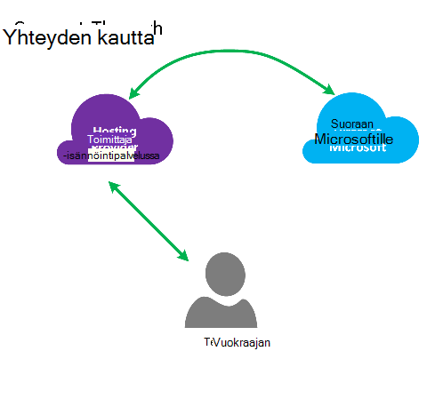
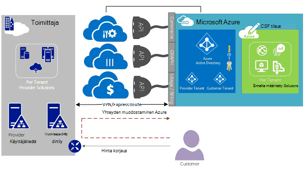
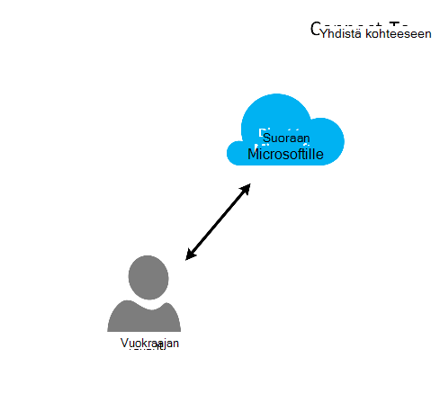
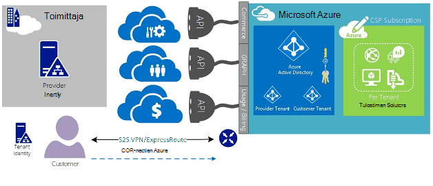
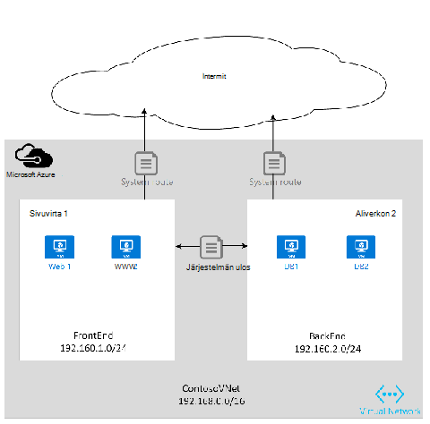
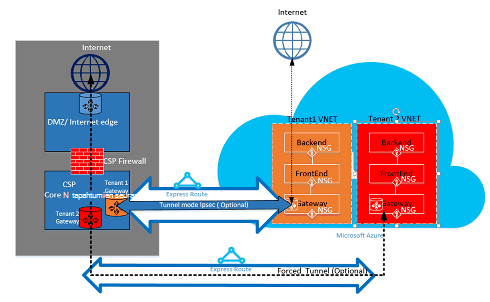

<properties
   pageTitle="Azure ExpressRoute Cloud ratkaisu toimittajien | Microsoft Azure"
   description="Tässä artikkelissa on tietoja Cloud palveluntarjoajien, jotka haluat sisällyttää Azure palvelut ja ExpressRoute niiden tarjouksia kyselyjä."
   documentationCenter="na"
   services="expressroute"
   authors="richcar"
   manager="carmonm"
   editor=""/>
<tags
   ms.service="expressroute"
   ms.devlang="na"
   ms.topic="get-started-article"
   ms.tgt_pltfrm="na"
   ms.workload="infrastructure-services"
   ms.date="10/10/2016"
   ms.author="richcar"/>

# Cloud-palveluntarjoajat (CSP) ExpressRoute

Microsoft toimittaa Hyper-akseli perinteinen jälleenmyyjät ja distributors (CSP) voivat valmistella nopeasti uusia palveluja ja ratkaisut asiakkaillesi ilman, että sijoittamaan kehittäminen uusi palveluista. Microsoft toimittaa ohjelmat ja ohjelmointirajapinnan, joiden avulla voit hallita Microsoft Azure resurssien puolesta asiakkaille CSP sallimaan Cloud ratkaisu Provider (CSP) voivat hallita suoraan uusi palveluista. Yksi näistä resursseista on ExpressRoute. ExpressRoute avulla CSP muodostaa aiemmin asiakkaan resurssien Azure-palveluihin. ExpressRoute on nopea yksityinen tietoliikenneyhteyden Azure-palveluihin. 

ExpresRoute koostuu kahdet piirit suuren, joka on liitetty yhteen asiakas-tilauksia ja ei voi jakaa useille asiakkaille. Kunkin piiri katkaistaan pitämään suuri käytettävyys eri reitittimen.

>[AZURE.NOTE] Ei kaistanleveys ja yhteyden caps ExpressRoute, mikä tarkoittaa, että suuren/kompleksiluvun käyttöotot edellyttää useita ExpressRoute piirit yhdelle asiakkaalle.

Microsoft Azure on kasvava määrä palvelut, joita voit tarjoaminen asiakkaille.  Paras tilaan palveluista hyödyntää niissä on käytettävä ExpressRoute yhteydet antamaan nopea pieni viive access, Microsoft Azure-ympäristöön.

## Microsoft Azure hallinta
Microsoft toimittaa CSP ohjelmointirajapinnan Azure asiakas-tilausten hallinta sallimalla ohjelmallisesti integrointi oman service management järjestelmien kanssa. Tuetut hallintatoiminnot löytyy [tähän](https://msdn.microsoft.com/library/partnercenter/dn974944.aspx).

## Microsoft Azure Resurssienhallinta
Sen mukaan, asiakkaalle työskentelee sopimuksessa määritetään miten tilaus hallitaan. CSP suoraan voi hallita luomisen ja ylläpidon resurssien tai asiakkaan voit hallita Microsoft Azure-tilauksen ja luo Azure resurssit, kun he tarvitsevat. Jos asiakkaan hallitsee luominen Microsoft Azure tilauksen resurssien ne käyttävät jokin kaksi malleista: malli "Yhdistä-kautta" tai "suorat-To-malli. Näitä malleja on kuvattu seuraavissa osissa.  

### Yhdistä – malli

  

Yhdistä –-mallissa CSP Luo suoran muodostaminen oman palvelinkeskukseen ja asiakkaan Azure tilauksen. Suora yhteys on muodostettu ExpressRoute, yhdistämällä verkon Azure avulla. Valitse asiakkaan muodostaa verkon. Tässä skenaariossa edellyttää, että asiakkaan kulkee CSP verkon Azure-palvelujen. 

Jos asiakkaalle on muut Azure tilaukset, jota ei hallita, ne näistä palveluista, valitse muu CSP tilauksen valmistelun yhteydessä yhdistäminen julkinen Internet- tai oman yksityisen yhteyden avulla. 

CSP Azure palveluiden hallinta oletetaan, että CSP on aiemmin muodostettu asiakkaan tunnistetietojen säilön, johon sitten replikoida Azure Active Directoryyn CSP tilauksen kautta Administrate-On-Behalf-Of (AOBO) hallintaa varten. Tässä skenaariossa avaimen ohjaimet ovat kohtaa, johon annetun kumppanin tai palveluntarjoaja on muodostettu yhteys, asiakkaan kanssa, asiakkaan on tällä hetkellä muissa palveluntarjoajalta tai kumppanin on haluavat tarjoajan isännöimä ja Azure isännöimä ratkaisuja ovat joustavia ja asiakkaan haasteisiin, joka ei voida täyttää CSP yksin yhdistelmät. Tämä malli on esitelty **Kuva**alapuolella.

### Yhdistä kohteeseen-malli

Yhdistä kohteeseen-mallissa palveluntarjoaja Luo suoraan niiden asiakkaan palvelinkeskuksen ja ExpressRoute välityksellä asiakkaan (asiakas) CSP valmisteltu Azure tilauksen välinen yhteys verkkoon.

>[AZURE.NOTE] Saat ExpressRoute asiakkaan on voit luoda ja ylläpitää ExpressRoute piiri.  

Tässä yhteys tilanteessa edellyttää, asiakkaan yhdistetään suoraan asiakasverkoston CSP hallitun Azure-tilauksen, joka on luotu, omistaja ja kokonaan tai osittain hallitsee asiakas suoran verkkoyhteyden käyttäminen. Näiden asiakkaiden, sen oletetaan, että palvelu ei ole tällä hetkellä asiakkaan tunnistetietojen säilön muodostettu ja palveluntarjoajan auttaa asiakasta replikoiminen niiden nykyisen tunnista myymälän Azure Active Directoryyn tilauksen kautta AOBO hallintaa varten. Tässä skenaariossa avaimen ohjaimet ole missä annetun kumppanin tai palveluntarjoaja on muodostettu yhteys, asiakkaan kanssa, asiakkaan on tällä hetkellä muissa palveluntarjoajalta tai kumppanin on haluavat tarjoa palveluja, jotka perustuvat ainoastaan Azure isännöimä ratkaisuja ilman, että aiemmin tarjoajan palvelinkeskuksen tai infrastruktuurin.

Asiakkaan tarpeiden ja Azure palvelujen nykyisen tarvittaessa perustuvat välillä nämä kaksi-asetuksen valinta. Tietoja näitä malleja ja liittyvän Roolipohjainen käytön hallinta, verkkokäytön ja käyttäjätiedot suunnittelun kuviot käydään tiedot on seuraavissa linkeissä:
-   **Roolin perusteella Access ohjausobjektin (RBAC)** – RBAC perustuu Azure Active Directory.  Saat lisätietoja Azure RBAC [tähän](../active-directory/role-based-access-control-configure.md).
-   Microsoft Azure verkko eri aiheet **Verkko** – käsitellään.
-   **Azure Active Directory (AAD)** – AAD on Microsoft Azure ja 3 SaaS parannetulla käyttäjähallinnan. Lisätietoja on artikkelissa Azure AD [tähän](https://azure.microsoft.com/documentation/services/active-directory/).  

## Verkon nopeuksia
ExpressRoute tukee verkon nopeuksia 50 Mt/s 10 gt/s-näppäinyhdistelmää. Näin asiakkaat voivat hankkia verkon kaistanleveyden tarvitaan niiden yksilöllinen ympäristössä.

>[AZURE.NOTE] Kaistanleveys voidaan lisätä tarvittaessa ilman toiminnan viestinnän, mutta voit pienentää verkon nopeus edellyttää sen virtapiirin alaspäin ja luotaessa alemman verkon nopeutta.  

ExpressRoute tukee useita vNets, yksi ExpressRoute piiri yhteyden paremmin käyttöasteen nopeampi yhteyksiä. Yksittäisen ExpressRoute piiri voidaan jakaa useita Azure tilauksia samassa asiakkaalla kesken.

## ExpressRoute määrittäminen
ExpressRoute voit on määritetty tukemaan kolmenlaisia liikenne ([Reititys toimialueita](#ExpressRoute-routing-domains)) yksittäisen ExpressRoute piiri päälle. Tämä liikenne on eristetyt Microsoft peering, Azure julkisen peering ja yksityiset peering. Voit valita yhden tai kaikkien tyyppisiä liikenne lähetetään yksittäisen ExpressRoute piiri kautta tai käyttää useita ExpressRoute piirit ExpressRoute piiri ja asiakkaalle vaatii eristystaso koon mukaan. Asiakkaan suojaus-reagoimisessa eivät salli julkisen liikenteen ja yksityiset liikenne voidaan siirtää saman piiri päälle.

### Yhdistä – malli
Yhdistä – kokoonpanossa, jota on vastuussa kaikista verkko perustuksia asiakkaiden palvelinkeskuksen resurssien muodostaa ylläpidettävä Azure tilaukset. Kunkin asiakkaan, jotka haluat Azure-ominaisuuksien käyttäminen on omia ExpressRoute yhteys, jota hallitaan itse. Voit käyttää samoja menetelmiä asiakkaan käyttäisi toimittamisessa ExpressRoute piiri. Voit noudattaa artikkelissa [ExpressRoute työnkulkujen](./expressroute-workflows.md) piiri valmistelu ja piiri hyötyä samat vaiheet. Voit sitten Määritä reunan yhdyskäytävän erityisen tiet, voit hallita liikenne paikalliseen verkkoon ja Azure vNet välistä juoksutus.

### Yhdistä kohteeseen-malli
Yhdistä kohteeseen-kokoonpanossa asiakkaalle jo on aiemmin luodun yhteyden Azure tai aloittaa yhteyden ExpressRoute linkittämisestä asiakkaan oman palvelinkeskuksen suoraan Azure sijaan että palvelinkeskukseen, internet-palveluntarjoajalta. Aloita valmistelu asiakkaalle noudattamalla ohjeita etäyhteyden välityksellä, mallin yllä olevien ohjeiden mukaisesti. Kun asiakkaalle on määritettävä paikallisen reitittimen voivan käyttää verkon ja Azure vNets virtapiirin on muodostettu.

Voit avustaminen yhteyden ja määrittämisestä tiet, jotta resurssien oman datacenter(s) asiakkaan oman joten resursseihin tai ylläpidettävä Azure tiedoilla.

## ExpressRoute reititys toimialueet
ExpressRoute tarjoaa kolme reititys toimialuetta: julkinen, yksityinen ja Microsoft peering. Kunkin reititys toimialueen on määritetty samat reitittimen aktiivinen aktiivinen määrityksessä suuren. Lisätietoja ExpressRoute reititys toimialueiden kohde [tähän](./expressroute-circuit-peerings.md).

Voit määrittää mukautetun tiet suodattimia, jotta vain haluat sallia tai on ajettavia. Lisätietoja tai Katso, miten voit tehdä muutoksia, lue artikkeli: [Luo ja Muokkaa reititys PowerShellin ExpressRoute-piiri](./expressroute-howto-routing-classic.md) lisätietoja reititys suodattimet.

>[AZURE.NOTE] Microsoftin tuotteiden ja julkisen Peering yhteys on oltava vaikka omistaa asiakas- tai CSP julkiseen IP-osoite- ja on noudatettava kaikkia määritettyjä sääntöjä. Lisätietoja on artikkelissa [ExpressRoute edellytykset](expressroute-prerequisites.md) -sivu.  

## Reititys
ExpressRoute muodostaa Azure verkkoihin Azure Virtual yhdyskäytävien kautta. Verkon yhdyskäytävien on reititys Azure virtual verkot.

Reititys taulukon vNet liikenne voidaan ohjata / osoitteesta vNet aliverkosta, luo myös luominen Azure Virtual verkoissa. Jos oletusarvoinen reitin taulukko on liian vähän mukautetun ratkaisun tiet voi luoda reitittämään lähtevän tietoliikenteen mukautetun laitteiden tai estä tiet tietyn aliverkosta tai ulkoiset verkostot.

### Oletusarvoinen reititys
Oletusarvoinen reitti-taulukko sisältää seuraavat tiet:

- Reititys aliverkon sisällä
- Aliverkon aliverkon virtual verkoston sisällä
- Yhteys Internetiin
- Virtuaalinen verkko-ja-virtual verkkoon käyttämällä VPN-yhdyskäytävän
- Virtuaalinen verkko-ja-paikalliseen verkkoon VPN- tai ExpressRoute yhdyskäytävän

  

### Käyttäjän määrittämät reititys (UDR)
Käyttäjän määrittämät tiet Salli liikenteen hallinta Lähtevät varattujen aliverkosta muiden aliverkosta virtual verkkoon tai yhteen muiden ennalta määritettyjä yhdyskäytävien (ExpressRoute; internet tai VPN). Käyttäjän määrittämät reititys taulukko, joka korvaa oletusarvoisen reititys taulukon mukautetun tiet voidaan korvata oletusarvon järjestelmässä reititys taulukon. Käyttäjän määrittämät reititys, asiakkaat voivat luoda tiettyjä laitteita, kuten palomuurit tai tunkeutumisen tunnistus laitteisiin tai käytön estäminen tietyn aliverkosta isännöinnin käyttäjäkohtainen reitin aliverkosta. Etsi yleiskuvaus käyttäjän määrittämät tiet [tähän](../virtual-network/virtual-networks-udr-overview.md). 

## Tietoturva
Sen mukaan, mikä malli on käytössä, Yhdistä- tai Yhdistä-kautta, asiakkaalle määrittää suojauskäytännöt niiden vNet tai tarjoaa suojauksen käytännön vaatimukset CSP voit määrittää niiden vNets. Voidaan määrittää suojauksen seuraavat ehdot:

1.  **Asiakkaan eristystaso** – Azure-ympäristö on asiakkaan eristystaso tallentamalla suojatun tietokannan, jota käytetään kunkin asiakkaan liikenne GRE tunnelin tärkeintä Asiakastunnus- ja vNet tiedot.
2.  **Verkon suojaus ryhmän (NSG)** säännöt ovat määrittäminen sallittu liikenteen ja solun sisällä vNets Azure aliverkosta ulos. Oletusarvon mukaan NSG sisältää estävät säännöt vNet Internet-liikenteen estäminen ja salliminen liikenteen vNet kuluessa. Lisätietoja verkko-käyttöoikeusryhmät kohde [tähän](https://azure.microsoft.com/blog/network-security-groups/).
3.  **Voimassa tunneling** – tämä on uudelleenohjaaminen sidottu internet-liikenteen peräisin olevien Azure ohjataan edelleen paikallisen palvelinkeskukseen ExpressRoute-yhteyden kautta. Lisätietoja pakotettu tunneling kohde [tähän](./expressroute-routing.md#advertising-default-routes).  

4.  **Salauksen** , vaikka ExpressRoute virtapiirit ovat omistautunut tietyn asiakkaan, on mahdollista, että verkkopalvelun voi olla vakuudesta, sallimisen tunkeilija tutkia paketin liikenne. Osoitteen tämän mahdollisen asiakas- tai CSP voit salata liikenne yhteyden määrittämällä kaikki liikenne käytössä paikallisen resurssit ja Azure juoksutus IP-Tunnelointitila käytännöt resurssit (valinnainen Tunnelointitila IP viitata asiakkaan 1: n kuva 5: ExpressRoute suojaus, yllä). Toinen vaihtoehto on käyttää palomuurin laitteen jokaisessa ExpressRoute piiri päätepiste. Tämä edellyttää muita 3 osapuolen palomuuri VMs/laitteiden on asennettava molemmat päät salaamaan liikenne ExpressRoute piiri päälle.

  

## Seuraavat vaiheet
Cloud Solution Provider-palvelun avulla on helppo Suurenna asiakkaillesi ilman kallista infrastruktuuri- ja ominaisuuksien ostot, säilyttäen näkyvyyttäsi ensisijainen ulkoistukset palveluna edellyttää arvoa. Saumaton integrointi Microsoft Azure onnistuu CSP API, jonka avulla voi integroida Microsoft Azure sisällä aiemmin hallinta-kehysten hallintaa kautta.  

Lisätietoja tukikäytännöistä on seuraavissa linkeissä:

[Microsoft Cloud Solution Provider ohjelma](https://partner.microsoft.com/en-US/Solutions/cloud-reseller-overview).  
[Voit aloittaa Cloud-ratkaisun toimittajaan kuin transact](https://partner.microsoft.com/en-us/solutions/cloud-reseller-pre-launch).  
[Microsoft Cloud Solution Provider resurssit](https://partner.microsoft.com/en-us/solutions/cloud-reseller-resources).
