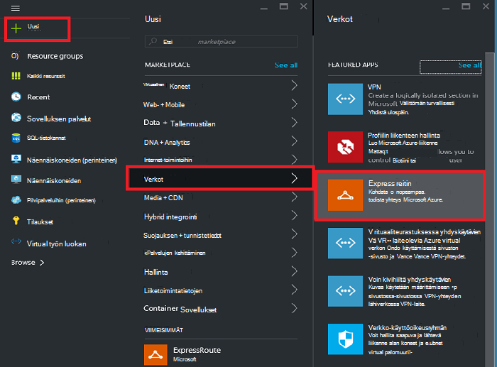
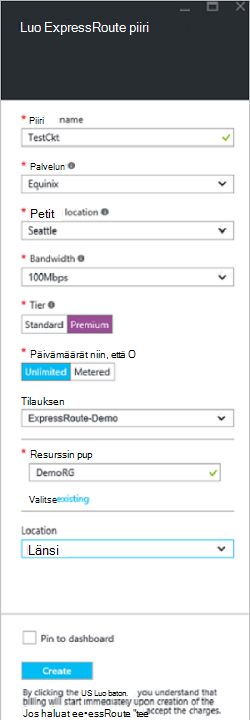
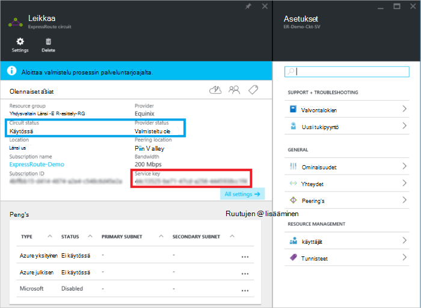
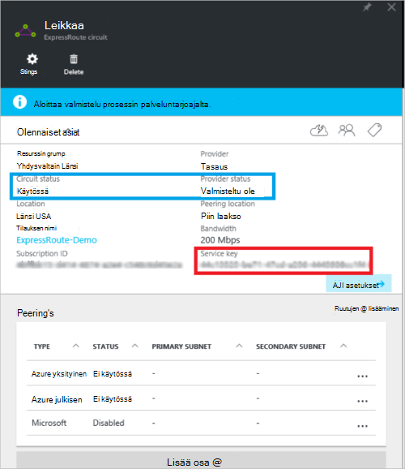
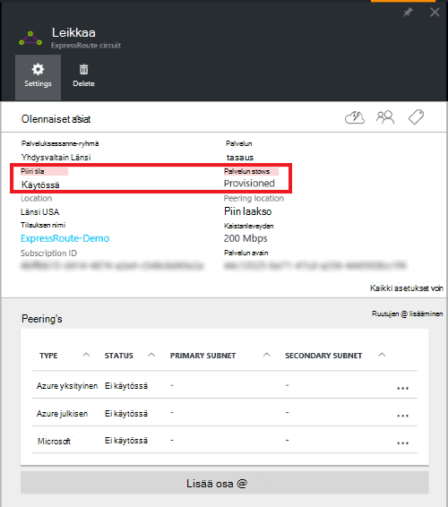

<properties
   pageTitle="Luoda ja muokata ExpressRoute piiri käyttämällä Resurssienhallinta ja Azure-portaalin | Microsoft Azure"
   description="Tässä artikkelissa kerrotaan, miten voit luoda, valmistella, tarkista, päivittää, poistaa ja deprovision ExpressRoute piiri."
   documentationCenter="na"
   services="expressroute"
   authors="cherylmc"
   manager="carmonm"
   editor=""
   tags="azure-resource-manager"/>
<tags
   ms.service="expressroute"
   ms.devlang="na"
   ms.topic="article"
   ms.tgt_pltfrm="na"
   ms.workload="infrastructure-services"
   ms.date="10/10/2016"
   ms.author="cherylmc"/>

# Luoda ja muokata ExpressRoute piiri

> [AZURE.SELECTOR]
[Azure Portal - Resurssienhallinta](expressroute-howto-circuit-portal-resource-manager.md)
[PowerShell - Resurssienhallinta](expressroute-howto-circuit-arm.md)
[PowerShell – perinteinen](expressroute-howto-circuit-classic.md)

Tässä artikkelissa kerrotaan, miten voit luoda Azure ExpressRoute piiri Azure portaalin ja Azure resurssien hallinnan käyttöönottomalli. Seuraavat vaiheet myös noudattamalla voit virtapiirin tilan tarkistaminen, Päivitä tai poista ja deprovision sen.

**Tietoja malleista Azure käyttöönotto**

[AZURE.INCLUDE [vpn-gateway-clasic-rm](../../includes/vpn-gateway-classic-rm-include.md)] 

## Ennen aloittamista

- Tarkista [edellytykset](expressroute-prerequisites.md) ja [Työnkulut](expressroute-workflows.md) , ennen kuin aloitat määritys.
- Varmista, että sinulla on pääsy [Azure portal](https://portal.azure.com).
- Varmista, että sinulla on oikeus luoda uusia verkko resursseja. Jos sinulla ei ole käyttöoikeuksia, ota yhteyttä tili-järjestelmänvalvojaan.

## Luoda ja valmistella ExpressRoute piiri

### 1. Kirjaudu Azure-portaaliin

Selaimessa Siirry [Azure portal](http://portal.azure.com) ja kirjaudu sisään Azure-tili.

### 2. Luo uusi ExpressRoute piiri

>[AZURE.IMPORTANT] ExpressRoute piiri laskutetaan-palvelun avainta annetaan hetken. Varmista tehtävän suorittamiseen, kun yhteys-palvelu on valmis valmistelu virtapiirin.

1. Voit luoda ExpressRoute piiri valitsemalla Luo uusi resurssi. Valitse **Uusi** > **Verkko** > **ExpressRoute**, seuraavassa kuvassa esitetyllä tavalla:

    

2. Kun valitset **ExpressRoute**, näkyviin tulee **Luo ExpressRoute piiri** -sivu. Kun olet täyttänyt tämä sivu arvoja, varmista, että Määritä oikea SKU taso ja tietojen niin, että.

    - **Taso** määrittää, onko käytössä ExpressRoute-standardiksi tai ExpressRoute premium-lisäosa. Voit määrittää **Vakio** vakio tuote- tai **Premium** Hanki premium-lisäosa.

    - **Tietoja niin, että** määrittää laskutuksen tyypin. Voit määrittää **mukaan laskutettava** laskutettavan tietoliikennesopimus ja **Rajoittamaton** rajoittamaton tietoliikennesopimus. Huomaa, että voit muuttaa laskutuksen tyypin **mukaan laskutettava** **Rajoittamaton**, mutta ei voi muuttaa tyyppi **Rajoittamaton** **mukaan laskutettava**.

    

>[AZURE.IMPORTANT] Ota huomioon, että Peering sijainti osoittaa [Fyysinen sijainti](expressroute-locations.md) kohtaa, johon on peering Microsoftille. Tämä ei **ole** linkitetty "Sijainnin"-ominaisuutta, joka viittaa alueen, jossa Azure verkkopalvelun resurssi sijaitsee. Kun ne ovat liity on hyvä valitsemaan verkon resurssin palveluntarjoaja maantieteellisesti lähellä virtapiirin Peering sijainti. 

### 3. Näytä piirit ja ominaisuudet

**Näytä kaikki piirit**

Voit tarkastella kaikkia piirit, jonka loit valitsemalla **kaikki resurssit** vasemmanpuoleisesta valikosta.
    

**Ominaisuuksien tarkasteleminen**

    You can view the properties of the circuit by selecting it. On this blade, note the service key for the circuit. You must copy the circuit key for your circuit and pass it down to the service provider to complete the provisioning process. The circuit key is specific to your circuit.

### 4. lähettäminen palvelun avainta palveluntarjoajan connectivity valmisteluun

Tämä sivu- **palvelun tila** on nykyisen tilan valmistelu tarjoaja reunassa tiedot. **Piiri tila** on tilaa Microsoft-puolella. Lisätietoja piiri valmistelu hyötyä [Työnkulut](expressroute-workflows.md#expressroute-circuit-provisioning-states) on artikkelissa.

Kun luot uuden ExpressRoute piiri, virtapiirin on seuraavassa vaiheessa:

Palvelun tila: ei valmistelun yhteydessä 
Piiri tila: käytössä

Virtapiirin muuttuvat seuraavat tilaan, kun yhteys-palvelun käyttöön puolestasi:

Palvelun tila: valmistelu 
Piiri tila: käytössä

Voit käyttää ExpressRoute piiri sen on oltava seuraavat tilassa:

Palvelun tila: valmistelun yhteydessä 
Piiri tila: käytössä

### 5. Tarkista säännöllisesti tila ja piiri avaimen tila

Voit tarkastella piiri, jotka ovat kiinnostuneita valitsemalla Ominaisuudet. Tarkista **palvelun tila** ja varmista, että se on **Provisioned** ennen kuin jatkat.

### 6. reititys konfiguroinnin luominen

Vaiheittaiset ohjeet ovat viitata [ExpressRoute piiri reititys configuration](expressroute-howto-routing-portal-resource-manager.md) artikkelin luomaan ja muokkaamaan piiri peerings.

>[AZURE.IMPORTANT] Nämä ohjeet koskevat vain piirit, jotka on luotu, jotka tarjoavat kerroksen 2 yritystietojen yhdistämispalvelut palveluntarjoajia. Jos käytät palveluntarjoaja, jossa voit valita hallittuja layer 3 services (yleensä IP VPN, kuten MPLS), yhteys-palveluntarjoajan määrittää ja hallita reititys puolestasi.

### 7. virtual verkon linkittäminen ExpressRoute piiri

Linkki seuraavaksi virtual verkon ExpressRoute piiri. Käytä [linkittäminen virtual verkkojen ExpressRoute piirit](expressroute-howto-linkvnet-arm.md) artikkelin käsiteltäessä resurssien hallinnan käyttöönottomalli.

## Käytön ExpressRoute piiri tila

Voit tarkastella piirin tilaa valitsemalla se. 

## ExpressRoute piiri muokkaaminen

Voit muuttaa tiettyjä ominaisuuksia ExpressRoute piiri ilman vaikuttavat yhteys. Tällä hetkellä ei voi muokata ExpressRoute piiri ominaisuudet Azure-portaalissa. PowerShellin avulla voit kuitenkin Muokkaa piiri ominaisuuksia. Lisätietoja on kohdassa [muokkaaminen ExpressRoute-piiri PowerShell-toiminnolla](expressroute-howto-circuit-arm.md#modify).

Voit tehdä seuraavia toimintoja ei ole käyttökatkot:

- Ota käyttöön tai poistaa käytöstä ExpressRoute piiri ExpressRoute premium apuohjelman.

- Suurentaa ExpressRoute piiri kaistanleveyden. Huomaa, että päivitysprosessin piirin kaistanleveyden ei tueta. 

- Muuttaa niin, että suunnitelma rajoittamaton tietojen käytön mukaan laskutettavat tiedoista. Huomaa, että muuttaminen niin, että suunnitelma rajoittamaton tietojen käytön mukaan laskutettavat tietoja ei tueta.

-  Voit ottaa käyttöön ja poistaa käytöstä **Salli perinteinen toimintoja**.

Lisätietoja rajat ja rajoitukset viitata [ExpressRoute usein kysytyt kysymykset](expressroute-faqs.md).

## Valmistelun poistaminen ja poistamalla ExpressRoute piiri

Voit poistaa ExpressRoute piiri valitsemalla **Poista** -kuvaketta. Ota seuraavat seikat huomioon:

- Kaikki virtual verkkojen ExpressRoute piiri on Poista linkki. Jos toiminto epäonnistuu, tarkista, onko virtual verkkoja on linkitetty virtapiirin.

- Jos ExpressRoute piiri palveluntarjoajan valmistelu tila on **Provisioning** tai **Provisioned** on työskenneltävä palveluntarjoajalta deprovision kiertäminen piiri. Olemme säilyvät Varaa resurssit ja laskuttaa, kunnes palveluntarjoaja valmistelun poistaminen virtapiirin on valmis, ja ilmoittaa us.

- Jos palveluntarjoaja on käyttömahdollisuus purettu piiri (palveluntarjoajan valmistelu tilan on määritetty **valmisteltu ole**) voit poistaa virtapiirin. Tämä estää virtapiirin Laskutus

## Seuraavat vaiheet

Kun olet luonut oman piiri, varmista, että teet jonkin seuraavista:

- [Luoda ja muokata reititys ExpressRoute piiri](expressroute-howto-routing-portal-resource-manager.md)
- [Linkki virtual verkon ExpressRoute piiri](expressroute-howto-linkvnet-arm.md)
