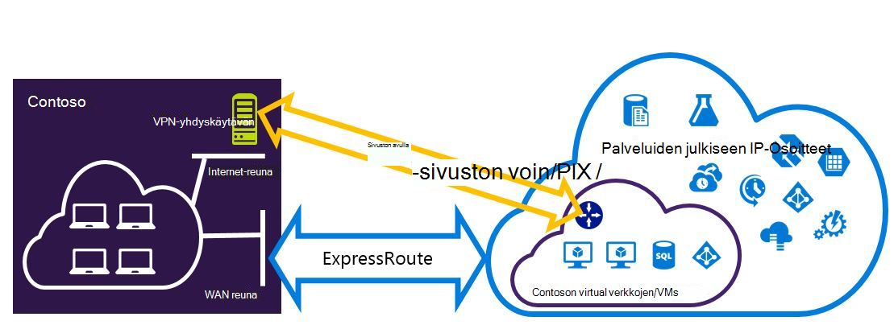
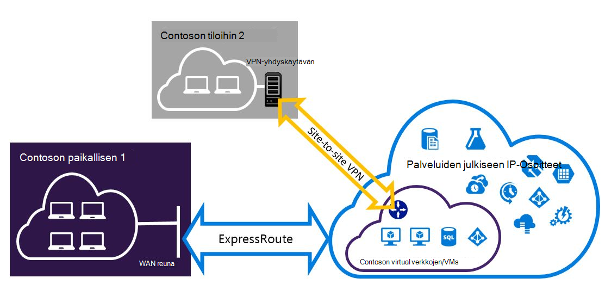

<properties
   pageTitle="Määritä Expressroute ja sivuston sivuston VPN-yhteydet, jotka voivat olla | Microsoft Azure"
   description="Tässä artikkelissa käydään läpi ExpressRoute ja sivusto VPN-yhteyden, jotka voivat olla perinteinen käyttöönoton mallin määrittäminen."
   documentationCenter="na"
   services="expressroute"
   authors="charwen"
   manager="carmonm"
   editor=""
   tags="azure-service-management"/>
<tags
   ms.service="expressroute"
   ms.devlang="na"
   ms.topic="get-started-article"
   ms.tgt_pltfrm="na"
   ms.workload="infrastructure-services"
   ms.date="10/10/2016"
   ms.author="charwen"/>

# ExpressRoute ja sivuston sivuston samanaikaisesti olemassa olevien yhteyksien perinteinen käyttöönoton mallin määrittäminen

> [AZURE.SELECTOR]
- [PowerShell - resurssien hallinta](expressroute-howto-coexist-resource-manager.md)
- [PowerShell – perinteinen](expressroute-howto-coexist-classic.md)

Määritä sivusto sivusto VPN- ja ExpressRoute voi ottaa on monia etuja. Voit määrittää sivuston sivuston VPN ExressRoute kuin suojatun automaattisesti polku tai sivustot ja jotka eivät ole yhteydessä ExpressRoute muodostaa sivuston sivuston VPN-yhteydet avulla. Käsiteltävät aiheet määrittäminen molempia tämän artikkelin ohjeita. Tämä artikkeli koskee perinteinen käyttöönotto-malliin. Tämä määritys ei ole käytettävissä-portaalissa.

**Tietoja malleista Azure käyttöönotto**

[AZURE.INCLUDE [vpn-gateway-clasic-rm](../../includes/vpn-gateway-classic-rm-include.md)] 

>[AZURE.IMPORTANT] ExpressRoute piirit on määritettävä valmiiksi, ennen kuin noudattamalla seuraavia ohjeita. Varmista, että olet noudattanut [ExpressRoute piiri luominen](expressroute-howto-circuit-classic.md) ja [määrittäminen reititys](expressroute-howto-routing-classic.md) apuviivoihin ennen noudattamalla seuraavia ohjeita.

## Rajat ja rajoitukset

- **Salataanko siirrettävät reititys ei tueta.** Et voi reitittää (joko Azure) kuin paikalliseen verkkoon kirjauduttaessa sivusto sivusto VPN-verkon kautta liitetyn ja paikallisen verkon kautta ExpressRoute liitetyn välillä.
- **Pisteen sivusto ei ole tuettu.** Et voi ottaa käyttöön kohta sivuston VPN-yhteyksien saman VNet, joka on liitetty ExpressRoute. Pisteen sivuston VPN ja ExpressRoute ei voi olla samaa VNet.
- **Pakotetun tunneling ei voi ottaa käyttöön sivustossa sivuston VPN-yhdyskäytävä.** Voit vain "pakottaa" kaikki sidottujen Internet-liikenne takaisin paikalliseen verkon kautta ExpressRoute.
- **Perustiedot SKU yhdyskäytävä ei tueta.** Sinun on käytettävä ei - Basic SKU yhdyskäytävän [ExpressRoute yhdyskäytävän](expressroute-about-virtual-network-gateways.md) ja [VPN-yhdyskäytävän](../vpn-gateway/vpn-gateway-about-vpngateways.md).
- **Reititys-pohjainen VPN yhdyskäytävän vain tuetaan.** Sinun on käytettävä reitti-pohjainen [VPN-yhdyskäytävän](../vpn-gateway/vpn-gateway-about-vpngateways.md).
- **Staattisen reitin on määritetty VPN-yhdyskäytävä.** Jos kuin paikalliseen verkkoon kirjauduttaessa on yhdistetty ExpressRoute ja sivusto VPN-yhteyttä, sinulla on määritetty reitittämään julkinen Internet-sivusto sivusto VPN-yhteyden lähiverkossa staattisen reitin.
- **ExpressRoute yhdyskäytävä on määritettävä ensin.** Sinun on luotava ExpressRoute yhdyskäytävän ensimmäisen kerran, ennen kuin lisäät sivuston sivuston VPN-yhdyskäytävä.

## Rakenteen määritys

### Määrittää sivuston sivuston VPN automaattisesti polku ExpressRoute varten

Voit määrittää sivuston sivuston VPN-yhteyden varmuuskopioina ExpressRoute varten. Tämä koskee vain virtual verkkojen linkitetty Azure yksityinen peering polku. Azure julkinen ja Microsoft peerings kautta on services ei ole VPN-pohjainen automaattisesti ratkaisu. ExpressRoute piiri on aina ensisijainen linkki. Tietoja juoksuttaa sivusto sivusto VPN avulla vain, jos ExpressRoute piiri epäonnistuu. 

### Sivustoille tarkasteltaviksi kautta ExpressRoute sivusto sivusto VPN-yhteyden määrittäminen

Voit määrittää verkoston missä Jotkin sivustot yhdistäminen suoraan Azure sivusto sivusto VPN-verkon kautta, ja Jotkin sivustot muodostaa ExpressRoute kautta. 

>[AZURE.NOTE] Et voi virtual verkon määrittäminen salataanko siirrettävät reitittimen nimellä.

## Ohjeet, joiden avulla valitseminen

Kahden eri tiedostojoukot toimenpiteistä, jotta voit määrittää yhteydet, jotka voivat olla valittavana on. Onko sinulla aiemmin virtual verkkoon, jossa haluat muodostaa yhteyden, tai haluat luoda uuden virtual verkon riippuu määritysten kuvatulla tavalla, joka valitaan.

- Voin ei ole VNet ja on luotava.
    
    Jos sinulla ei vielä ole virtual verkko-toiminto edetään ohjatusti luominen uuden virtual verkon perinteinen käyttöönoton mallin ja luot uuden ExpressRoute ja sivuston sivusto-VPN-yhteydet. Määritä [Luo uusi virtual verkko- ja samanaikaisesti olemassa olevien](#new)artikkelissa-osion ohjeita noudattamalla.

- Perinteinen käyttöönoton mallin VNet on jo.

    Virtual verkon saattaa on jo olemassa olevan sivuston sivuston VPN-yhteyden tai ExpressRoute yhteyden paikassa. Artikkelissa-osassa [Voit määrittää aiemmin luodusta VNet coexsiting yhteyksiä](#add) käy läpi poistaminen yhdyskäytävän ja luomalla uuden ExpressRoute ja sivuston sivusto-VPN-yhteydet. Huomaa, että luotaessa uusia yhteyksiä vaiheet on suoritettava hyvin tietyssä järjestyksessä. Älä käytä ohjeita muita artikkeleita yhdyskäytävät ja yhteydet.

    Tässä toimintosarjassa yhteyksiä, jotka voivat olla edellyttää, että käyttämäsi yhdyskäytävän poistaminen ja määritä sitten uusia yhdyskäytäviä. Tämä tarkoittaa sitä, voit hallita käyttökatkot paikallisen-yhteyksien poistaminen ja luo yhdyskäytävä ja yhteyksiä, mutta sinun ei tarvitse siirtää VMs tai palvelujen uuden virtual verkon. VMs ja palvelujen edelleen saa oikeuden tiedonvälitys ulos kuormituksen samalla, kun määrität käyttämäsi yhdyskäytävän, jos ne on määritetty tekemään niin.

## Voit luoda uuden virtual verkko- ja samanaikaisesti olemassa olevien

Tämä toiminto opastusta luomisesta VNet ja luo sivusto ja ExpressRoute yhteydet, jotka olla.

1. Tarvitset Azure PowerShellin cmdlet-komennot uusimman version asentaminen. Katso, [miten voit asentaa ja määrittää PowerShellin Azure](../powershell-install-configure.md) lisätietoja asentaminen PowerShellin cmdlet-komennot. Huomaa, että cmdlet-komennot, jotka määritysten käytät voi olla hieman erilainen kuin mitä ehkä tottunut. Muista käyttää Cmdlet-komentoja määritetty näissä ohjeissa. 

2. Luo virtuaalisia verkon rakenne. Saat lisätietoja määritys-rakenne [Azure Virtual verkon määritysten rakenne](https://msdn.microsoft.com/library/azure/jj157100.aspx).

    Kun luot rakenteen, varmista, että Käytä seuraavia arvoja:

    - Yhdyskäytävän aliverkon virtual verkkoa varten on oltava /27 tai lyhentää etuliite (esimerkiksi /26 tai /25).
    - Yhdyskäytävän yhteystyyppi on "omistautunut".

              <VirtualNetworkSite name="MyAzureVNET" Location="Central US">
                <AddressSpace>
                  <AddressPrefix>10.17.159.192/26</AddressPrefix>
                </AddressSpace>
                <Subnets>
                  <Subnet name="Subnet-1">
                    <AddressPrefix>10.17.159.192/27</AddressPrefix>
                  </Subnet>
                  <Subnet name="GatewaySubnet">
                    <AddressPrefix>10.17.159.224/27</AddressPrefix>
                  </Subnet>
                </Subnets>
                <Gateway>
                  <ConnectionsToLocalNetwork>
                    <LocalNetworkSiteRef name="MyLocalNetwork">
                      <Connection type="Dedicated" />
                    </LocalNetworkSiteRef>
                  </ConnectionsToLocalNetwork>
                </Gateway>
              </VirtualNetworkSite>

3. Kun olet luonut ja määrittänyt xml-rakennetiedostoon, Lataa tiedosto. Tämä luo virtuaalisia verkossa.

    Lataa tiedostosi arvon korvaaminen omalla seuraavan cmdlet-komennon avulla.

        Set-AzureVNetConfig -ConfigurationPath 'C:\NetworkConfig.xml'

4. Luo ExpressRoute-yhdyskäytävä. Varmista, Määritä GatewaySKU *Vakio*, *korkean*tai *UltraPerformance* ja GatewayType kuin *DynamicRouting*.

    Käytä seuraava näyte, korvaaminen oman arvot.

        New-AzureVNetGateway -VNetName MyAzureVNET -GatewayType DynamicRouting -GatewaySKU HighPerformance

5. Linkki ExpressRoute virtapiirin ExpressRoute yhdyskäytävä. Kun tämä vaihe on valmis, välillä paikallisen verkko- ja Azure kautta ExpressRoute, yhteys on muodostettu.

        New-AzureDedicatedCircuitLink -ServiceKey <service-key> -VNetName MyAzureVNET

6. Luo sivusto VPN-yhdyskäytävän seuraavaksi. GatewaySKU on oltava *Vakio* *korkean*tai *UltraPerformance* ja GatewayType on oltava *DynamicRouting*.

        New-AzureVirtualNetworkGateway -VNetName MyAzureVNET -GatewayName S2SVPN -GatewayType DynamicRouting -GatewaySKU  HighPerformance

    Voit hakea VPN yhdyskäytävän asetusten, kuten yhdyskäytävä-tunnus ja julkiseen IP `Get-AzureVirtualNetworkGateway` cmdlet-komento.

        Get-AzureVirtualNetworkGateway

        GatewayId            : 348ae011-ffa9-4add-b530-7cb30010565e
        GatewayName          : S2SVPN
        LastEventData        :
        GatewayType          : DynamicRouting
        LastEventTimeStamp   : 5/29/2015 4:41:41 PM
        LastEventMessage     : Successfully created a gateway for the following virtual network: GNSDesMoines
        LastEventID          : 23002
        State                : Provisioned
        VIPAddress           : 104.43.x.y
        DefaultSite          :
        GatewaySKU           : HighPerformance
        Location             :
        VnetId               : 979aabcf-e47f-4136-ab9b-b4780c1e1bd5
        SubnetId             :
        EnableBgp            : False
        OperationDescription : Get-AzureVirtualNetworkGateway
        OperationId          : 42773656-85e1-a6b6-8705-35473f1e6f6a
        OperationStatus      : Succeeded

7. Voit luoda paikallisen sivuston VPN yhdyskäytävän kohteen. Tämä komento ei määrittää paikallisen VPN-yhdyskäytävän. Sen sijaan se voit antaa paikallisen yhdyskäytävän asetuksia, kuten julkiseen IP-osoite ja paikallisen osoite tila, niin, että Azure VPN-yhdyskäytävän voit muodostaa yhteyden.

    >[AZURE.IMPORTANT] Paikallisen sivuston VPN-sivusto sivusto ei ole määritetty netcfg. Sen sijaan sinun on käytettävä cmdlet voit määrittää paikallisen sivuston parametrit. Et voi määrittää sen portal tai netcfg-tiedoston avulla.

    Seuraavassa esimerkissä arvojen korvaaminen omalla käyttäminen

        New-AzureLocalNetworkGateway -GatewayName MyLocalNetwork -IpAddress <MyLocalGatewayIp> -AddressSpace <MyLocalNetworkAddress>

    > [AZURE.NOTE] Jos paikallisessa verkossa on useita ohjautuu sen vuoksi, voit siirtää ne kaikki matriisina.  $MyLocalNetworkAddress =@("10.1.2.0/24","10.1.3.0/24","10.2.1.0/24")  

    Voit hakea VPN yhdyskäytävän asetusten, kuten yhdyskäytävä-tunnus ja julkiseen IP `Get-AzureVirtualNetworkGateway` cmdlet-komento. Esimerkki.

        Get-AzureLocalNetworkGateway

        GatewayId            : 532cb428-8c8c-4596-9a4f-7ae3a9fcd01b
        GatewayName          : MyLocalNetwork
        IpAddress            : 23.39.x.y
        AddressSpace         : {10.1.2.0/24}
        OperationDescription : Get-AzureLocalNetworkGateway
        OperationId          : ddc4bfae-502c-adc7-bd7d-1efbc00b3fe5
        OperationStatus      : Succeeded

8. Määrittää paikallisen VPN-laitteen muodostaa uusi yhdyskäytävä. Käyttää tietoja, voit hakea vaiheessa 6 VPN-laitteesi määritettäessä. Saat lisätietoja VPN-laitteen määrittäminen [VPN-laitteen määrittäminen](../vpn-gateway/vpn-gateway-about-vpn-devices.md).

9. Linkki Azure-sivusto sivusto VPN-yhdyskäytävän paikallisen yhdyskäytävän.

    Tässä esimerkissä connectedEntityId on paikallinen yhdyskäytävä-tunnuksen, josta löydät suorittamalla `Get-AzureLocalNetworkGateway`. Voit etsiä virtualNetworkGatewayId käyttämällä `Get-AzureVirtualNetworkGateway` cmdlet-komento. Tämän vaiheen jälkeen sivuston sivuston VPN-yhteyden kautta lähiverkossa ja Azure välinen yhteys on muodostettu.

        New-AzureVirtualNetworkGatewayConnection -connectedEntityId <local-network-gateway-id> -gatewayConnectionName Azure2Local -gatewayConnectionType IPsec -sharedKey abc123 -virtualNetworkGatewayId <azure-s2s-vpn-gateway-id>

## Voit määrittää aiemmin luodusta VNet coexsiting yhteydet

Jos sinulla on aiemmin virtual verkkoon, tarkista yhdyskäytävän aliverkon koko. Jos aliverkon yhdyskäytävä on /28 tai /29, poista VPN-yhdyskäytävän ensin ja suurentaa yhdyskäytävän aliverkon. Tässä jaksossa kerrotaan, miten voit tehdä sen.

Jos aliverkon yhdyskäytävä on /27 tai suurempi ja virtual verkko on yhdistetty ExpressRoute kautta, voit ohittaa alla kuvatulla tavalla ja siirry ["Vaihe 6 – Luo sivusto VPN-yhdyskäytävän"](#vpngw) edellisessä osassa.

>[AZURE.NOTE] Kun poistat aiemmin yhdyskäytävän, paikallinen paikallisen menetetään virtual verkon yhteys määritysten työskentelyn aikana.

1. Tarvitset Azure Resurssienhallinta PowerShellin cmdlet-komennot uusimman version asentaminen. Katso, [miten voit asentaa ja määrittää PowerShellin Azure](../powershell-install-configure.md) lisätietoja asentaminen PowerShellin cmdlet-komennot. Huomaa, että cmdlet-komennot, jotka määritysten käytät voi olla hieman erilainen kuin mitä ehkä tottunut. Muista käyttää Cmdlet-komentoja määritetty näissä ohjeissa. 

2. Poista aiemmin ExpressRoute tai sivuston sivuston VPN-yhdyskäytävä. Käytä seuraavat cmdlet-arvojen korvaaminen omalla.

        Remove-AzureVNetGateway –VnetName MyAzureVNET

3. Vie VPN-rakenne. Käytä seuraavia PowerShell-cmdlet-arvojen korvaaminen omalla.

        Get-AzureVNetConfig –ExportToFile “C:\NetworkConfig.xml”

4. Muokkaa verkon määritysten rakennetta, niin, että yhdyskäytävän aliverkon on /27 tai lyhentää etuliite (esimerkiksi /26 tai /25). Esimerkki. 
>[AZURE.NOTE] Sinulla ei ole tarpeeksi IP-osoitteiden virtual verkon yhdyskäytävän aliverkon suurentaa vasemmalle, jos haluat lisätä IP-osoitetilaa. Saat lisätietoja määritys-rakenne [Azure Virtual verkon määritysten rakenne](https://msdn.microsoft.com/library/azure/jj157100.aspx).

          <Subnet name="GatewaySubnet">
            <AddressPrefix>10.17.159.224/27</AddressPrefix>
          </Subnet>

5. Jos edellisen yhdyskäytävän sivusto sivusto VPN-yhteyttä, sinun on muutettava yhteys myös **erityisvarastopaikka**.

                 <Gateway>
                  <ConnectionsToLocalNetwork>
                    <LocalNetworkSiteRef name="MyLocalNetwork">
                      <Connection type="Dedicated" />
                    </LocalNetworkSiteRef>
                  </ConnectionsToLocalNetwork>
                </Gateway>

6. Tässä vaiheessa on VNet ei ole yhdyskäytävien kanssa. Luo uusi yhdyskäytävien ja viimeistele yhteyksiisi, voit jatkaa [Vaihe 4 – Luo ExpressRoute yhdyskäytävän](#gw)edellisen toimintaohjeiden löytyvät.

## Seuraavat vaiheet

Saat lisätietoja ExpressRoute [ExpressRoute usein kysytyt kysymykset](expressroute-faqs.md)
